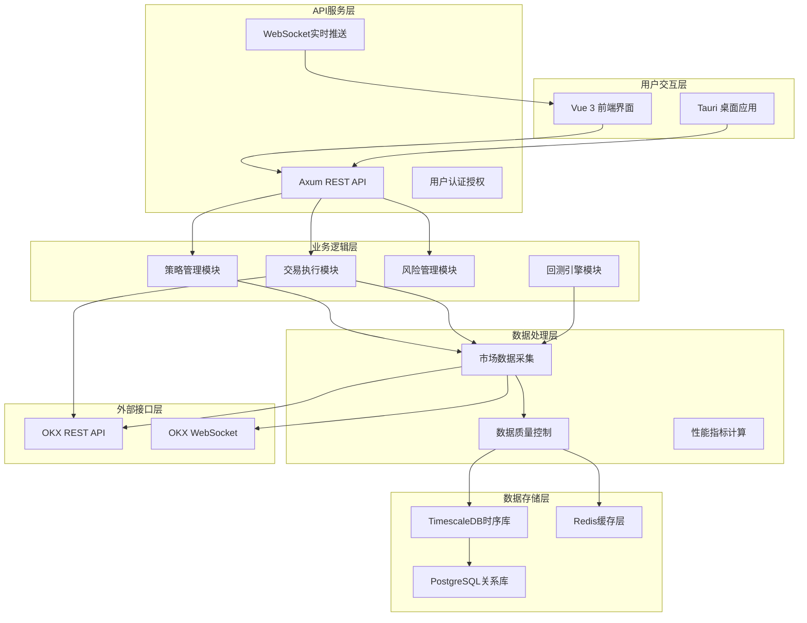
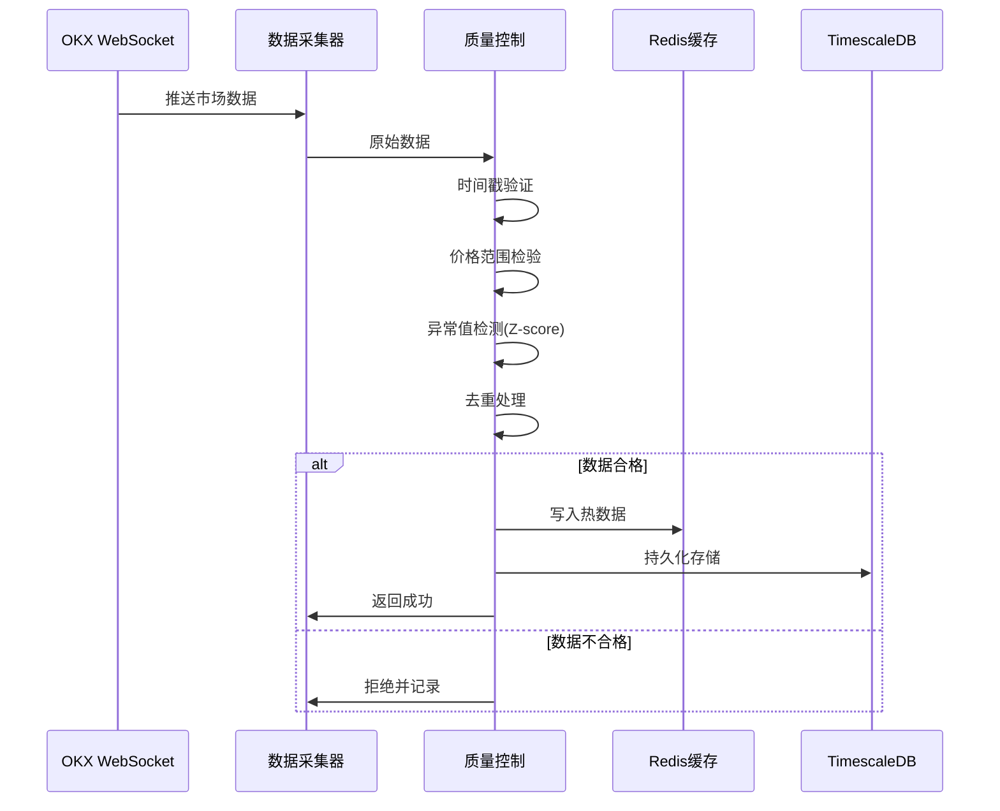
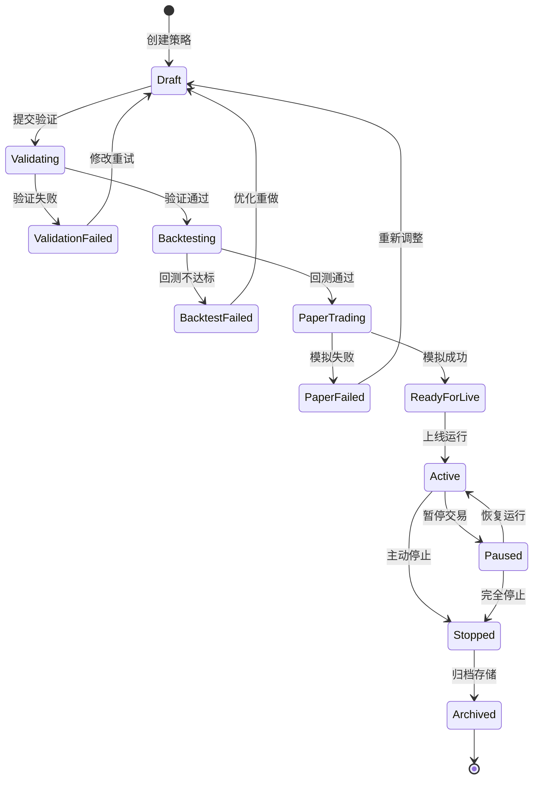
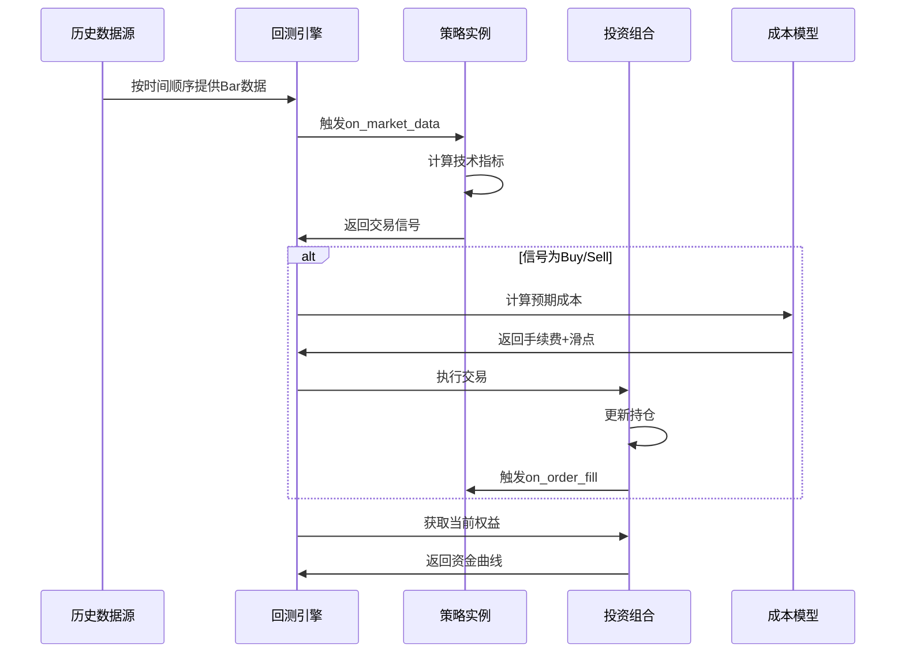
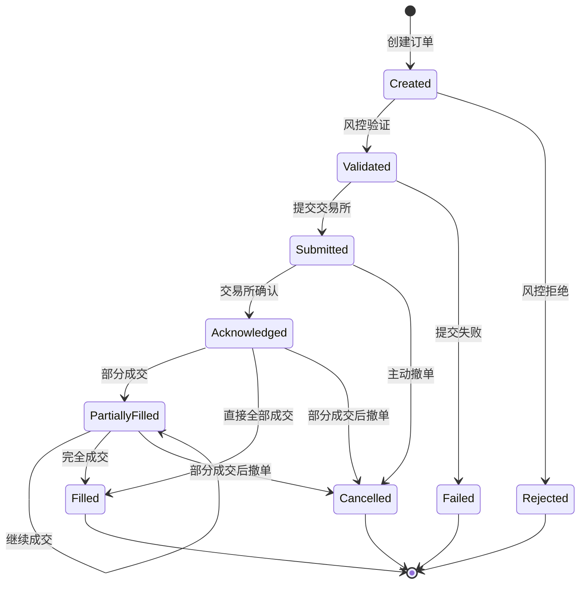
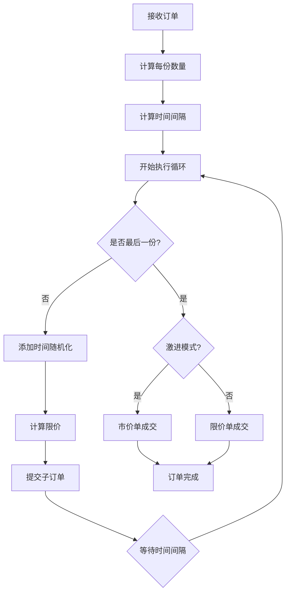
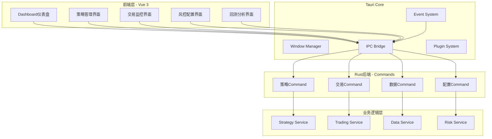

# OKX虚拟币量化交易系统设计文档

## 1. 系统概述

### 1.1 项目目标

构建一个专业级的针对OKX交易所的虚拟货币量化交易平台，实现自动化交易策略的开发、回测、风险管理和实盘执行。系统需满足高性能、高可用、低延迟的要求，并提供完整的风险控制和监控告警机制。

### 1.2 核心设计原则

| 原则 | 说明 |
|------|------|
| 高内聚低耦合 | 模块化设计，各层次职责清晰，便于独立开发和测试 |
| 高可用性 | 关键服务冗余部署，秒级故障转移，确保交易不中断 |
| 可扩展性 | 策略热插拔机制，无需重启即可部署新策略 |
| 性能优先 | 微秒级延迟优化，信号到市场延迟 < 100ms (p95) |
| 风险第一 | 事前、事中、事后全流程风险管控 |

### 1.3 技术栈

| 组件 | 技术选型 | 说明 |
|------|----------|------|
| 后端核心 | Rust 2021 | 高性能、内存安全、零成本抽象 |
| 异步运行时 | Tokio | 高并发异步IO处理 |
| Web框架 | Axum | 轻量级、类型安全的HTTP服务 |
| 桌面应用 | Tauri 2.0 | 跨平台桌面应用框架 |
| 前端框架 | Vue 3.0 | 响应式用户界面 |
| 数据库 | PostgreSQL 15 + TimescaleDB | 时序数据优化存储 |
| 缓存层 | Redis 7 | 热数据缓存，降低延迟 |
| 精度计算 | rust_decimal | 8位小数精度的金融计算 |

## 2. 系统架构设计

### 2.1 整体架构分层

系统采用六层架构设计，从下至上依次为：

### 2.2 核心模块划分

| 模块名称 | 职责范围 | 关键组件 |
|----------|----------|----------|
| 数据层 (Data Layer) | 行情数据获取、清洗、存储 | 数据采集器、质量控制、TimescaleDB存储、Redis缓存 |
| 策略层 (Strategy Layer) | 策略开发、回测、优化 | 策略框架、生命周期管理、信号生成、性能度量 |
| 交易层 (Trading Layer) | 订单执行、资金管理 | 订单管理器、状态机、TWAP/VWAP算法、订单对账 |
| 风控层 (Risk Layer) | 事前/事中/事后风险管理 | 预交易验证、VaR计算、止损止盈、熔断机制 |
| 监控层 (Monitoring Layer) | 实时监控、异常告警、绩效评估 | 指标采集、健康检查、告警规则、性能追踪 |
| 管理层 (Management Layer) | 用户权限、参数配置、系统管理 | 用户认证、配置管理、审计日志 |

## 3. 数据管理模块设计

### 3.1 数据采集架构

#### 3.1.1 多源数据接入

数据源覆盖范围：

| 数据类型 | 数据源 | 更新频率 | 用途 |
|----------|--------|----------|------|
| 实时行情 | OKX WebSocket | 实时推送 | 策略信号生成 |
| Level 2深度 | OKX Order Book | 100ms更新 | 流动性分析、冲击成本 |
| 逐笔成交 | OKX Trades | 实时推送 | 成交量分析 |
| K线数据 | OKX Candles | 1分钟/5分钟 | 技术指标计算 |
| 历史数据 | OKX REST API | 按需获取 | 回测、模型训练 |
| 账户数据 | OKX Private Channel | 实时推送 | 仓位追踪、资金监控 |

#### 3.1.2 数据采集流程

### 3.2 数据质量控制

#### 3.2.1 五层验证机制

| 验证层级 | 验证内容 | 阈值配置 | 失败处理 |
|----------|----------|----------|----------|
| 第1层：时间戳验证 | 检测未来数据、过期数据 | 允许时差 ±5秒 | 拒绝并告警 |
| 第2层：价格范围验证 | 价格偏离度检验 | 偏离前值 ±10% | 拒绝并标记 |
| 第3层：统计异常检测 | Z-score异常值过滤 | Z值 > 3.0 | 拒绝并记录 |
| 第4层：重复检测 | 消息ID去重 | 基于消息哈希 | 丢弃重复消息 |
| 第5层：完整性检验 | 必填字段缺失检查 | 所有必填字段 | 拒绝不完整数据 |

#### 3.2.2 数据标准化处理

标准化规则：

| 数据项 | 标准化规则 |
|--------|------------|
| 时间戳 | 统一转换为UTC时间，精度到毫秒 |
| 价格精度 | 统一8位小数 (rust_decimal) |
| 交易对格式 | 标准化为 "BASE-QUOTE" 格式 (如BTC-USDT) |
| 数量单位 | 统一为基础货币单位 |
| 空值处理 | 缺失K线数据使用前向填充，标记为插值数据 |

### 3.3 数据存储架构

#### 3.3.1 存储分层策略

| 存储层 | 技术选型 | 数据类型 | 保留期限 |
|--------|----------|----------|----------|
| 热数据缓存 | Redis | 最新价格、最新K线、订单簿快照 | 实时更新，保留1小时 |
| 时序数据库 | TimescaleDB | OHLCV数据、逐笔成交、订单簿历史 | 压缩后保留5年 |
| 关系数据库 | PostgreSQL | 用户信息、策略配置、交易记录、审计日志 | 永久保存 |
| 冷数据归档 | 对象存储 | 2年以上历史数据 | 按需加载 |

#### 3.3.2 TimescaleDB表结构设计

**核心表及优化策略：**

| 表名 | 分区策略 | 压缩策略 | 索引策略 | 保留策略 |
|------|----------|----------|----------|----------|
| market_ohlcv | 按时间7天分块 | 30天后启动压缩 | (symbol, time) B-tree | 5年后删除 |
| market_ticks | 按时间1天分块 | 7天后启动压缩 | (symbol, time) | 90天后删除 |
| order_book_snapshots | 按时间1天分块 | 立即压缩 | (symbol, time, side) | 7天后删除 |
| trades | 按时间30天分块 | 不压缩 | (order_id, strategy_id, time) | 永久保留 |
| positions | 常规表 | 不压缩 | (user_id, symbol, status) | 永久保留 |

**连续聚合视图（Continuous Aggregates）：**

| 视图名称 | 聚合粒度 | 刷新策略 | 用途 |
|----------|----------|----------|------|
| ohlcv_5m_continuous | 5分钟K线 | 每1分钟刷新 | 短期策略信号生成 |
| ohlcv_1h_continuous | 1小时K线 | 每5分钟刷新 | 中期趋势分析 |
| ohlcv_1d_continuous | 日K线 | 每1小时刷新 | 长期策略回测 |
| strategy_performance_daily | 每日策略收益 | 每日凌晨刷新 | 绩效评估 |

## 4. 策略开发与回测系统

### 4.1 策略框架设计

#### 4.1.1 策略生命周期管理

策略完整生命周期包含12个状态：

#### 4.1.2 状态转换规则

| 起始状态 | 目标状态 | 转换条件 | 自动/手动 |
|----------|----------|----------|-----------|
| Draft | Validating | 配置完整性检查通过 | 手动触发 |
| Validating | Backtesting | 参数合理性验证通过 | 自动 |
| Backtesting | PaperTrading | 夏普比率 > 1.0, 最大回撤 < 20% | 自动 |
| PaperTrading | ReadyForLive | 模拟盘运行满30天且表现稳定 | 人工审核 |
| ReadyForLive | Active | 风控审批通过 | 手动触发 |
| Active | Paused | 触发熔断条件或手动暂停 | 自动/手动 |
| Active | Stopped | 达到止损线或策略到期 | 自动/手动 |

#### 4.1.3 策略接口定义

策略需实现9个核心方法：

| 方法名称 | 职责 | 调用时机 | 返回值 |
|----------|------|----------|--------|
| initialize | 策略初始化，加载配置和历史状态 | 策略启动时 | 成功/失败 |
| on_market_data | 处理实时行情数据 | 收到市场数据推送时 | 无返回值 |
| generate_signal | 生成交易信号 | 策略逻辑触发时 | Buy/Sell/Hold信号 |
| on_order_fill | 订单成交回调 | 订单完全成交后 | 无返回值 |
| on_order_reject | 订单拒绝回调 | 订单被交易所拒绝时 | 无返回值 |
| get_metrics | 获取策略性能指标 | 定期查询或报告时 | 性能指标结构 |
| serialize_state | 序列化策略状态 | 热更新或持久化时 | 状态JSON字符串 |
| deserialize_state | 反序列化策略状态 | 策略恢复时 | 成功/失败 |
| shutdown | 策略关闭清理 | 策略停止时 | 无返回值 |

### 4.2 回测引擎设计

#### 4.2.1 事件驱动回测架构

回测引擎采用事件驱动模型，确保回测逻辑与实盘保持一致：

#### 4.2.2 真实性保证机制

回测必须严格遵守的规则：

| 真实性要素 | 实现方式 | 参数配置 |
|------------|----------|----------|
| 成交成本 | Maker手续费: 0.08% / Taker手续费: 0.10% | 可按交易所费率配置 |
| 滑点模拟 | 市价单滑点 = 买卖价差 × 50% + 市场冲击成本 | 基于订单簿深度计算 |
| 市场冲击 | 冲击成本 = (订单量 / 日均成交量) × 价格 × 影响系数 | 影响系数默认0.1% |
| 流动性约束 | 单笔订单不超过5分钟平均成交量的10% | 超限则拆单执行 |
| 成交延迟 | 信号生成到订单提交延迟 50ms, 订单确认延迟 100ms | 可配置延迟分布 |
| 前视偏差 | 严格按时间戳顺序处理，禁止使用未来数据 | 编译期检查 |

#### 4.2.3 防止过拟合策略

| 防过拟合手段 | 具体措施 | 验收标准 |
|--------------|----------|----------|
| 样本外验证 | 训练集60%, 验证集20%, 测试集20% | 测试集表现不低于训练集80% |
| 时间序列交叉验证 | 滚动窗口回测，每次向前推进30天 | 所有窗口夏普比率 > 0.5 |
| 参数平原检验 | 参数±20%范围内收益波动 < 30% | 可视化参数热力图 |
| 蒙特卡洛模拟 | 随机打乱交易序列1000次测试鲁棒性 | 95%置信区间包含原始收益 |
| 最大回测期限 | 至少包含一个完整牛熊周期 (5-7年) | BTC历史数据覆盖2017至今 |
| 策略复杂度惩罚 | 参数数量每增加1个，要求收益提升5% | 控制参数总数 < 10个 |

#### 4.2.4 性能指标计算

回测结果需计算以下指标：

| 指标类别 | 指标名称 | 计算公式 | 优秀标准 |
|----------|----------|----------|----------|
| 收益指标 | 累计收益率 | (期末权益 - 期初权益) / 期初权益 | > 年化20% |
| 收益指标 | 年化收益率 | 累计收益率 × (365 / 交易天数) | > 30% |
| 风险指标 | 夏普比率 | (年化收益 - 无风险利率) / 年化波动率 | > 1.5 |
| 风险指标 | 索提诺比率 | (年化收益 - 无风险利率) / 下行波动率 | > 2.0 |
| 风险指标 | 最大回撤 | (峰值 - 谷值) / 峰值 | < 20% |
| 风险指标 | 卡尔玛比率 | 年化收益率 / 最大回撤 | > 2.0 |
| 交易指标 | 胜率 | 盈利交易次数 / 总交易次数 | > 50% |
| 交易指标 | 盈亏比 | 平均盈利 / 平均亏损 | > 2.0 |
| 交易指标 | 盈利因子 | 总盈利 / 总亏损 | > 1.5 |
| 交易指标 | 日均交易次数 | 总交易次数 / 交易天数 | 根据策略类型 |

## 5. 交易执行模块设计

### 5.1 订单管理系统

#### 5.1.1 订单状态机

订单生命周期包含9个状态：

#### 5.1.2 订单类型支持

| 订单类型 | 适用场景 | 执行逻辑 | 风险提示 |
|----------|----------|----------|----------|
| Market | 需要立即成交 | 以当前最优价格成交 | 滑点风险高 |
| Limit | 价格敏感策略 | 指定价格挂单，等待成交 | 可能不成交 |
| PostOnly | 做市策略 | 仅作为Maker成交，享受费率优惠 | 必须进入订单簿 |
| IOC (立即成交或取消) | 高频策略 | 立即成交部分，未成交部分取消 | 流动性要求高 |
| FOK (全部成交或取消) | 大额订单 | 全部成交或全部取消 | 成交概率低 |
| StopLoss | 止损保护 | 触及止损价时转为市价单 | 可能滑点成交 |
| TakeProfit | 止盈策略 | 触及目标价时转为限价单 | 需监控市场 |
| TrailingStop | 动态止损 | 跟踪最高价回撤一定比例触发 | 参数设置敏感 |
| Iceberg | 隐藏订单量 | 分批显示订单，避免市场冲击 | 执行时间长 |

#### 5.1.3 订单对账机制

对账流程确保订单状态一致性：

| 对账层级 | 检查项 | 频率 | 不一致处理 |
|----------|--------|------|------------|
| 实时对账 | 订单状态同步 | 每次WebSocket推送 | 立即更新本地状态 |
| 定期对账 | 所有未完成订单 | 每30秒 | 主动查询交易所API |
| 深度对账 | 成交记录和资金流水 | 每小时 | 记录差异并告警 |
| 每日对账 | 所有订单和成交 | 每日凌晨 | 生成对账报告 |

#### 5.1.4 超时处理策略

| 超时场景 | 超时阈值 | 处理动作 |
|----------|----------|----------|
| 订单提交超时 | 5秒 | 重试3次，失败则标记为Failed |
| 订单确认超时 | 10秒 | 主动查询订单状态 |
| 部分成交超时 | 策略配置的最大等待时间 | 撤销未成交部分 |
| 撤单确认超时 | 3秒 | 重复发送撤单请求 |

### 5.2 智能执行算法

#### 5.2.1 TWAP算法 (时间加权平均价格)

**算法目标**：在指定时间窗口内均匀分配订单，降低市场冲击。

**配置参数**：

| 参数名称 | 说明 | 取值范围 | 默认值 |
|----------|------|----------|--------|
| duration | 执行总时长 | 1分钟 - 6小时 | 30分钟 |
| slice_count | 拆分份数 | 5 - 100 | 20 |
| randomization | 时间随机化比例 | 0% - 30% | 10% |
| price_offset_bps | 价格偏移(基点) | -50 - 50 | 0 |
| aggressive_final | 最后一份是否激进成交 | true/false | true |

**执行流程**：

#### 5.2.2 VWAP算法 (成交量加权平均价格)

**算法目标**：根据历史成交量分布，在成交量大的时段多执行订单。

**配置参数**：

| 参数名称 | 说明 | 取值范围 | 默认值 |
|----------|------|----------|--------|
| lookback_days | 历史成交量回溯天数 | 1 - 30 | 7 |
| start_time | 执行开始时间 | 00:00 - 23:59 | 当前时间 |
| end_time | 执行结束时间 | start_time之后 | 当前+30分钟 |
| volume_profile | 成交量分布曲线 | hourly/intraday | hourly |
| max_participation | 最大参与率 | 5% - 30% | 10% |

**执行逻辑**：

成交量权重计算示例（每小时权重）：

| 时段 | 历史平均成交量 | 权重比例 | 分配订单量 |
|------|----------------|----------|------------|
| 00:00-01:00 | 100 BTC | 3% | 总量 × 3% |
| 01:00-02:00 | 80 BTC | 2.4% | 总量 × 2.4% |
| 08:00-09:00 | 500 BTC | 15% | 总量 × 15% |
| 14:00-15:00 | 800 BTC | 24% | 总量 × 24% |

### 5.3 执行性能监控

| 监控指标 | 计算方式 | 告警阈值 |
|----------|----------|----------|
| 信号到订单延迟 | 信号生成时间 - 订单提交时间 | p95 > 100ms |
| 订单提交延迟 | 订单创建 - 交易所确认时间 | p95 > 50ms |
| 实际成交价偏离 | abs(实际成交价 - 信号价) / 信号价 | > 0.5% |
| 订单成功率 | 成交订单数 / 总订单数 | < 99% |
| 执行滑点 | (实际成交价 - 理论价) / 理论价 | > 0.3% |

## 6. 风险管理系统

### 6.1 事前风控 (Pre-trade Risk)

#### 6.1.1 六大预交易验证器

| 验证器名称 | 验证内容 | 拒绝条件 | 优先级 |
|------------|----------|----------|--------|
| 1. 资金检查 | 可用资金、保证金占用 | 可用资金不足订单金额 | 最高 |
| 2. 持仓限制 | 单币种持仓上限 | 持仓价值超过账户总资产的25% | 高 |
| 3. 杠杆控制 | 账户总杠杆倍数 | 总杠杆 > 3x | 高 |
| 4. 流动性检查 | 订单簿深度 | 订单量 > 盘口5档总量的50% | 中 |
| 5. 交易权限 | 禁买/禁卖清单 | 币种在黑名单中 | 高 |
| 6. 流量控制 | 每秒下单频率 | 超过10单/秒 | 中 |

#### 6.1.2 仓位管理规则

| 仓位控制维度 | 规则描述 | 限额配置 |
|--------------|----------|----------|
| 单币种仓位 | 单个交易对持仓价值上限 | 不超过账户总资产的25% |
| 总仓位限制 | 所有持仓总价值上限 | 不超过账户总资产的80% |
| 行业集中度 | 同类型币种总仓位 | 如DeFi板块不超过40% |
| 最大持仓数 | 同时持有的币种数量 | 不超过10个币种 |
| 保证金比例 | 账户保证金率下限 | 维持保证金率 > 15% |

### 6.2 事中风控 (Real-time Monitoring)

#### 6.2.1 实时监控指标

| 监控项 | 监控频率 | 告警阈值 | 熔断阈值 |
|--------|----------|----------|----------|
| 策略实时盈亏 | 每笔成交 | 单日亏损 > 5% | 单日亏损 > 10% |
| 持仓浮动盈亏 | 每次行情更新 | 未实现亏损 > 账户权益的8% | 未实现亏损 > 15% |
| 成交价偏离 | 每笔成交 | 偏离信号价 > 1% | 偏离 > 3% |
| 流动性枯竭 | 每5秒 | 盘口深度下降 > 50% | 深度下降 > 80% |
| 系统资源 | 每10秒 | CPU > 80%, 内存 > 85% | CPU > 95%, 内存 > 95% |

#### 6.2.2 动态止损止盈

| 止损类型 | 触发条件 | 执行动作 |
|----------|----------|----------|
| 固定止损 | 持仓亏损达到固定比例 (如-5%) | 市价单全部平仓 |
| 追踪止损 | 回撤超过峰值的固定比例 (如回撤-3%) | 市价单全部平仓 |
| 时间止损 | 持仓超过最大持有期 (如72小时) | 限价单平仓，未成交则转市价 |
| 策略级止损 | 策略累计亏损超过阈值 | 暂停策略，清空所有仓位 |
| 账户级止损 | 账户总权益回撤超过阈值 (如-20%) | 暂停所有策略，强制平仓 |

### 6.3 事后风控 (Post-trade Analysis)

#### 6.3.1 VaR模型 (Value at Risk)

**三种VaR计算方法**：

| 方法名称 | 计算原理 | 适用场景 | 数据要求 |
|----------|----------|----------|----------|
| 历史模拟法 | 基于过去252个交易日的收益率分布 | 历史重演场景 | 至少1年历史数据 |
| 方差-协方差法 | 假设收益率服从正态分布 | 正常市场环境 | 资产间相关系数矩阵 |
| 蒙特卡洛模拟 | 随机生成10000条收益率路径 | 极端情况压力测试 | 波动率和相关性参数 |

**VaR参数配置**：

| 参数 | 说明 | 标准配置 |
|------|------|----------|
| 置信水平 | VaR置信度 | 95% (1.65σ) 和 99% (2.33σ) |
| 持有期 | 风险暴露时间 | 1日VaR |
| 回溯窗口 | 历史数据时间跨度 | 252个交易日 (1年) |

**预期短缺 (Expected Shortfall / CVaR)**：

计算超过VaR阈值的条件期望损失，更关注尾部风险。

#### 6.3.2 压力测试场景

| 压力场景 | 测试内容 | 历史参考 |
|----------|----------|----------|
| 暴跌场景 | BTC单日下跌30% | 2021年5月19日 |
| 流动性危机 | 主流币种流动性枯竭，买卖价差扩大10倍 | 2020年3月12日 |
| 极端波动 | 日内振幅超过50% | 2022年11月FTX事件 |
| 连续亏损 | 策略连续20笔交易全部亏损 | 模拟最坏情况 |
| 交易所故障 | 交易所API不可用超过1小时 | 2021年4月18日币安故障 |

#### 6.3.3 归因分析

绩效归因拆解收益来源：

| 归因维度 | 计算方式 | 用途 |
|----------|----------|------|
| 市场收益 | 基准指数收益率 | 剥离市场Beta |
| 策略Alpha | 总收益 - 市场收益 | 评估策略超额收益 |
| 交易成本 | 手续费 + 滑点损失 | 优化执行效率 |
| 择时能力 | 进出场时机贡献 | 评估信号质量 |
| 资金管理 | 仓位管理贡献 | 优化资金分配 |

### 6.4 熔断机制

| 熔断级别 | 触发条件 | 熔断动作 | 恢复条件 |
|----------|----------|----------|----------|
| 一级熔断 | 单策略单日亏损 > 5% | 暂停该策略30分钟 | 人工审核恢复 |
| 二级熔断 | 账户总权益回撤 > 10% | 暂停所有策略，只允许平仓 | 风控团队审批 |
| 三级熔断 | 账户总权益回撤 > 20% | 强制平仓所有持仓，冻结账户 | 高级管理层审批 |
| 市场熔断 | BTC单小时跌幅 > 15% | 暂停所有开仓，允许平仓 | 市场稳定后自动恢复 |
| 系统熔断 | 关键服务故障 | 停止所有交易，保持连接监控 | 故障修复并测试通过 |

## 7. 技术实现要点

### 7.1 性能优化策略

| 优化维度 | 技术手段 | 性能目标 |
|----------|----------|----------|
| 计算性能 | Rust零成本抽象，编译期优化 | 信号计算延迟 < 1ms |
| 内存管理 | 对象池，避免频繁分配/释放 | GC停顿 < 10ms |
| 并发处理 | Tokio异步运行时，无锁数据结构 | 支持10000并发WebSocket连接 |
| 网络延迟 | 托管至交易所机房，专线连接 | 网络RTT < 5ms |
| 数据库查询 | TimescaleDB索引优化，查询缓存 | 聚合查询 < 100ms |
| 缓存策略 | Redis缓存热点数据，LRU淘汰 | 缓存命中率 > 95% |

### 7.2 高可用架构

#### 7.2.1 服务冗余部署

| 服务类型 | 部署方式 | 高可用保障 |
|----------|----------|------------|
| 交易执行节点 | 主备双节点 | 主节点故障，备节点3秒内接管 |
| 数据采集节点 | 多活部署 | 任一节点故障不影响数据采集 |
| API服务 | 负载均衡 + 3节点集群 | 单节点故障不影响服务 |
| 数据库 | PostgreSQL主从复制 | 自动故障转移 |
| 缓存层 | Redis Sentinel哨兵模式 | 主从切换 < 30秒 |

#### 7.2.2 故障恢复机制

| 故障类型 | 检测方式 | 恢复流程 |
|----------|----------|----------|
| 进程崩溃 | 心跳检测(每5秒) | systemd自动重启 |
| 网络中断 | TCP连接超时 | 指数退避重连，最大重试5分钟 |
| 交易所API限流 | HTTP 429响应 | 等待限流解除，降级为低频模式 |
| 数据库连接池耗尽 | 连接超时 | 动态扩容连接池，最大100连接 |
| 磁盘空间不足 | 监控磁盘使用率 | 告警并清理过期日志 |

### 7.3 系统稳定性保障

#### 7.3.1 异常处理规范

所有潜在异常场景必须显式处理：

| 异常类型 | 处理策略 |
|----------|----------|
| 网络请求失败 | 重试3次，指数退避(1s, 2s, 4s)，失败记录日志 |
| 数据解析错误 | 拒绝该条数据，记录原始内容，告警 |
| 数据库操作失败 | 事务回滚，重试1次，失败则降级为缓存 |
| 第三方API超时 | 超时时间5秒，超时则返回错误，不阻塞主流程 |
| 内存分配失败 | 拒绝新请求，触发GC，告警 |

#### 7.3.2 限流与降级

| 限流场景 | 限流策略 | 降级措施 |
|----------|----------|----------|
| API请求频率 | 令牌桶算法，100请求/秒 | 超限请求返回429，提示稍后重试 |
| 数据库写入 | 批量写入，每批1000条 | 超限则排队等待 |
| WebSocket连接数 | 最大10000连接 | 拒绝新连接，返回503 |
| 策略并发数 | 最大100个策略同时运行 | 新策略排队等待空闲位 |
| 日志写入 | 每秒最多10000条 | 采样记录，丢弃低优先级日志 |

### 7.4 基础设施配置

| 基础设施 | 配置要求 | 说明 |
|----------|----------|------|
| 服务器 | 16核CPU, 64GB内存, 2TB NVMe SSD | 托管至交易所机房 |
| 网络 | 双运营商专线，带宽100Mbps | 主备链路自动切换 |
| 时钟同步 | NTP协议，精度±10ms | 确保订单时间戳准确 |
| 操作系统 | Ubuntu 22.04 LTS | 长期支持版本 |
| 容器化 | Docker 24.0 + Kubernetes 1.28 | 便于弹性伸缩 |
| 监控 | Prometheus + Grafana | 实时监控和告警 |

## 8. 安全与合规

### 8.1 数据安全

| 安全措施 | 实现方式 | 安全级别 |
|----------|----------|----------|
| 传输加密 | TLS 1.3协议，禁用TLS 1.2以下版本 | 高 |
| 存储加密 | AES-256加密数据库文件和备份 | 高 |
| API密钥管理 | 密钥加密存储，内存中明文使用后立即清除 | 高 |
| 访问控制 | RBAC权限模型，最小权限原则 | 中 |
| IP白名单 | 仅允许指定IP访问交易API | 中 |
| 双因子认证 | 登录、出金、修改策略需2FA | 高 |
| 审计日志 | 所有操作记录，不可篡改 | 高 |

### 8.2 交易安全

| 安全机制 | 保护措施 |
|----------|----------|
| API密钥权限 | 仅开启交易权限，禁止提币权限 |
| 密钥轮换 | 每30天强制更换API密钥 |
| 模拟盘验证 | 新策略必须模拟盘运行满30天 |
| 订单签名 | 每个订单HMAC-SHA256签名防篡改 |
| 异地登录告警 | 检测到异常IP登录立即告警 |
| 资金变动通知 | 大额资金变动实时短信/邮件通知 |

### 8.3 合规性要求

| 合规维度 | 合规措施 |
|----------|----------|
| 数据隐私 | 遵守GDPR/PIPL，用户数据加密存储，不出境 |
| 反洗钱 | 监控异常交易模式，大额交易记录备查 |
| 信息披露 | 策略历史业绩标注"历史业绩不代表未来" |
| 用户适当性 | 风险评估问卷，高风险策略仅对专业投资者开放 |
| 审计日志 | 保留所有操作日志至少7年 |
| 监管报告 | 按需生成交易报告，配合监管检查 |

## 9. 监控与运维体系

### 9.1 实时监控仪表盘

#### 9.1.1 四层监控架构

| 监控层级 | 监控对象 | 关键指标 | 刷新频率 |
|----------|----------|----------|----------|
| 系统层 | 服务器资源 | CPU使用率, 内存占用, 磁盘IO, 网络带宽 | 10秒 |
| 数据层 | 数据流质量 | 行情延迟, 数据缺失率, WebSocket连接状态 | 实时 |
| 策略层 | 策略运行状态 | 信号生成速度, 持仓数量, 实时盈亏 | 实时 |
| 交易层 | 订单执行质量 | 订单成功率, 平均延迟, 滑点统计, 成交量 | 实时 |

#### 9.1.2 监控指标采集

| 指标类型 | 示例指标 | 采集方式 |
|----------|----------|----------|
| 计数器 (Counter) | 订单总数, 成交笔数, 错误次数 | 累加递增 |
| 仪表盘 (Gauge) | 当前持仓数, WebSocket连接数, 可用资金 | 实时值 |
| 直方图 (Histogram) | 订单延迟分布, 滑点分布 | 分位数统计 |
| 摘要 (Summary) | 每分钟交易量, 每小时PnL | 时间窗口聚合 |

### 9.2 告警机制

#### 9.2.1 告警级别分类

| 告警级别 | 严重程度 | 响应时间 | 通知渠道 |
|----------|----------|----------|----------|
| INFO | 信息提示 | 无需立即处理 | 系统日志 |
| WARNING | 警告 | 30分钟内处理 | 邮件 |
| ERROR | 错误 | 10分钟内处理 | 邮件 + 企业微信 |
| CRITICAL | 致命 | 立即处理 | 邮件 + 企业微信 + 短信 + 电话 |

#### 9.2.2 告警规则配置

| 告警规则 | 触发条件 | 告警级别 | 自动响应 |
|----------|----------|----------|----------|
| 数据延迟 | 行情数据延迟 > 5秒 | WARNING | 重连WebSocket |
| 订单失败率高 | 1分钟内失败率 > 5% | ERROR | 暂停策略 |
| 资金异常 | 可用资金突降 > 20% | CRITICAL | 停止所有策略 |
| 策略亏损 | 单日亏损 > 10% | CRITICAL | 强制平仓 |
| 系统资源 | CPU > 95% 持续1分钟 | ERROR | 清理缓存，重启进程 |
| 数据库连接 | 连接池耗尽 | CRITICAL | 扩容连接池，拒绝新请求 |

#### 9.2.3 告警收敛策略

| 收敛维度 | 收敛规则 |
|----------|----------|
| 时间收敛 | 相同告警5分钟内只发送一次 |
| 次数收敛 | 同类告警1小时内最多发送5次 |
| 级别升级 | 同一问题持续告警3次后升级告警级别 |
| 静默时段 | 非交易时段(凌晨2-6点)降低告警频率 |

### 9.3 日志管理

#### 9.3.1 结构化日志规范

所有日志采用JSON格式，必须包含以下字段：

| 字段名 | 类型 | 说明 | 示例 |
|--------|------|------|------|
| timestamp | ISO8601 | 日志时间戳 | "2024-01-15T10:30:45.123Z" |
| level | String | 日志级别 | "ERROR" |
| service | String | 服务名称 | "order_manager" |
| trace_id | UUID | 请求追踪ID | "550e8400-e29b-41d4-a716-446655440000" |
| message | String | 日志内容 | "Order submission failed" |
| context | Object | 上下文信息 | {"order_id": "123", "symbol": "BTC-USDT"} |

#### 9.3.2 日志分级策略

| 日志级别 | 使用场景 | 采样率 | 保留期限 |
|----------|----------|--------|----------|
| DEBUG | 开发调试信息 | 生产环境关闭 | 不保留 |
| INFO | 正常业务流程 | 100% | 7天 |
| WARNING | 警告性事件 | 100% | 30天 |
| ERROR | 错误事件 | 100% | 90天 |
| CRITICAL | 致命错误 | 100% | 永久保留 |

#### 9.3.3 日志存储与分析

| 组件 | 功能 | 配置 |
|------|------|------|
| Logstash | 日志收集和转换 | 每秒处理10000条日志 |
| Elasticsearch | 日志存储和索引 | 3节点集群，30天热数据，90天冷数据 |
| Kibana | 日志可视化和查询 | 预置10个常用查询仪表盘 |

### 9.4 持续优化

#### 9.4.1 A/B测试框架

| 测试维度 | 测试方式 | 评估指标 |
|----------|----------|----------|
| 策略参数 | 同时运行新旧参数版本，各分配50%资金 | 夏普比率, 最大回撤 |
| 执行算法 | TWAP vs VWAP并行执行 | 滑点, 成交速度 |
| 风控规则 | 不同止损比例对比 | 总收益, 胜率 |

#### 9.4.2 自动化优化

| 优化对象 | 优化算法 | 执行频率 |
|----------|----------|----------|
| 策略参数 | 贝叶斯优化 | 每月1次 |
| 仓位分配 | 马科维茨均值方差优化 | 每周1次 |
| 执行参数 | 网格搜索 | 每季度1次 |

#### 9.4.3 压力测试

| 测试类型 | 测试内容 | 执行频率 |
|----------|----------|----------|
| 功能测试 | 全链路集成测试 | 每次发版前 |
| 性能测试 | 1000并发订单提交 | 每周1次 |
| 容量测试 | 10000策略同时运行 | 每月1次 |
| 故障演练 | 模拟数据库宕机、网络中断 | 每季度1次 |

## 10. Tauri 2.0桌面应用架构设计

### 10.1 Tauri架构概述

Tauri 2.0作为桌面应用框架，提供Rust后端与Vue 3前端的无缝集成，实现高性能、小体积、安全的跨平台桌面应用。

#### 10.1.1 架构分层

#### 10.1.2 Tauri配置要点

| 配置项 | 配置值 | 说明 |
|--------|--------|------|
| Tauri版本 | 2.0 | 使用最新稳定版 |
| Bundle标识符 | com.okx.quant | 应用唯一标识 |
| 窗口模式 | 多窗口支持 | 主窗口 + 策略详情窗口 + 图表窗口 |
| 安全配置 | CSP严格模式 | 防止XSS攻击 |
| 系统托盘 | 启用 | 最小化到托盘，快速访问 |
| 自动更新 | 启用 | 支持增量更新 |

### 10.2 前后端通信机制

#### 10.2.1 Tauri Command定义

Tauri使用Command模式实现前后端通信，所有Command必须是异步函数并返回Result类型。

**核心Command分类：**

| Command类别 | Command示例 | 功能说明 |
|-------------|-------------|----------|
| 策略管理 | get_strategies, create_strategy, update_strategy, delete_strategy | 策略CRUD操作 |
| 策略控制 | start_strategy, stop_strategy, pause_strategy | 策略生命周期控制 |
| 回测执行 | run_backtest, get_backtest_results | 执行回测并获取结果 |
| 实时数据 | subscribe_market_data, get_latest_price | 市场数据订阅 |
| 交易操作 | place_order, cancel_order, get_positions | 订单和持仓管理 |
| 风控配置 | get_risk_limits, update_risk_limits | 风控参数配置 |
| 系统监控 | get_system_metrics, get_alerts | 系统状态和告警 |

#### 10.2.2 事件驱动通信

Tauri支持双向事件系统，后端可主动向前端推送事件。

**事件类型定义：**

| 事件名称 | 事件数据 | 触发时机 |
|----------|----------|----------|
| market-data-update | { symbol, price, volume, timestamp } | 实时行情更新（每秒） |
| order-status-change | { order_id, status, filled_qty } | 订单状态变更 |
| position-update | { symbol, quantity, pnl } | 持仓变更 |
| strategy-signal | { strategy_id, signal_type, confidence } | 策略信号生成 |
| risk-alert | { level, message, timestamp } | 风险告警 |
| system-health | { cpu, memory, latency } | 系统健康状态（每10秒） |

#### 10.2.3 状态管理

Tauri应用使用Pinia进行Vue 3状态管理。

| Store模块 | 管理状态 | 持久化 |
|-----------|----------|--------|
| userStore | 用户信息、认证token | localStorage |
| strategyStore | 策略列表、当前选中策略 | Vuex持久化插件 |
| marketStore | 实时行情、订单簿数据 | 内存（不持久化） |
| tradeStore | 持仓、订单历史 | IndexedDB |
| configStore | 系统配置、风控参数 | localStorage |

### 10.3 前端界面设计

#### 10.3.1 核心页面结构

| 页面名称 | 路由路径 | 功能描述 | 关键组件 |
|----------|----------|----------|----------|
| Dashboard仪表盘 | /dashboard | 系统概览、关键指标 | MetricsCard, RealtimeChart, AlertList |
| 策略管理 | /strategies | 策略列表、创建、编辑 | StrategyTable, StrategyEditor, StateIndicator |
| 策略详情 | /strategies/:id | 单个策略监控、参数调整 | PerformanceChart, SignalHistory, PositionTable |
| 回测分析 | /backtest | 回测配置、结果分析 | BacktestConfig, EquityCurve, MetricsTable |
| 交易监控 | /trading | 实时订单、持仓监控 | OrderBook, PositionList, TradeHistory |
| 风控中心 | /risk | 风险指标、限额配置 | VaRChart, RiskLimits, AlertRules |
| 系统设置 | /settings | 系统配置、API密钥管理 | ConfigForm, ApiKeyManager |

#### 10.3.2 实时数据可视化

**图表组件库选型：**

| 图表库 | 用途 | 优势 |
|--------|------|------|
| ECharts | K线图、资金曲线、指标图表 | 功能全面，性能优秀 |
| TradingView Lightweight Charts | 专业K线图 | 金融级图表，交互流畅 |
| Chart.js | 简单统计图表 | 轻量级，易用 |

**关键图表类型：**

| 图表类型 | 数据源 | 更新频率 | 数据点数量 |
|----------|--------|----------|------------|
| 实时K线图 | WebSocket市场数据 | 实时更新 | 最近500根K线 |
| 资金曲线 | 策略权益变化 | 每次交易后 | 全部历史数据 |
| 回撤曲线 | 计算峰谷回撤 | 每次交易后 | 全部历史数据 |
| 订单簿深度图 | 实时订单簿 | 100ms | 买卖各50档 |
| 成交量分布 | 历史成交数据 | 每日更新 | 最近30天 |
| 风险热力图 | VaR计算结果 | 每小时 | 持仓币种 × 风险指标 |

#### 10.3.3 UI组件设计规范

| 设计要素 | 规范 |
|----------|------|
| UI框架 | Element Plus (Vue 3专用) |
| 色彩方案 | 深色主题（护眼，适合长时间盯盘） + 浅色备选 |
| 字体 | 主字体：Roboto, 等宽字体：Fira Code (代码/数字显示) |
| 响应式设计 | 最小分辨率 1366×768，推荐 1920×1080 |
| 无障碍支持 | 键盘导航、屏幕阅读器支持 |
| 国际化 | 支持中文、英文切换 (vue-i18n) |

### 10.4 Tauri安全机制

#### 10.4.1 内容安全策略 (CSP)

| CSP指令 | 配置值 | 说明 |
|---------|--------|------|
| default-src | 'self' | 仅允许加载同源资源 |
| script-src | 'self' 'unsafe-inline' | 允许内联脚本（Vue需要） |
| connect-src | 'self' https://www.okx.com wss://ws.okx.com | 允许连接OKX API |
| img-src | 'self' data: https: | 允许图片资源 |
| style-src | 'self' 'unsafe-inline' | 允许内联样式 |

#### 10.4.2 Command权限控制

每个Tauri Command必须在`tauri.conf.json`中显式声明权限。

| 权限范围 | Command列表 | 限制条件 |
|----------|-------------|----------|
| 策略只读 | get_strategies, get_strategy_metrics | 所有用户 |
| 策略写入 | create_strategy, update_strategy | 需要管理员权限 |
| 交易操作 | place_order, cancel_order | 需要启用2FA |
| 系统配置 | update_risk_limits, update_api_keys | 需要管理员权限 + 2FA |

#### 10.4.3 敏感数据保护

| 数据类型 | 存储方式 | 加密方式 |
|----------|----------|----------|
| API密钥 | Tauri Store (加密文件) | AES-256-GCM |
| 用户密码 | 不存储 | 仅存储Bcrypt哈希 |
| 认证Token | Memory + SessionStorage | 无需加密（短期有效） |
| 策略参数 | LocalStorage | 不加密（非敏感） |

### 10.5 跨平台打包与分发

#### 10.5.1 打包配置

| 平台 | 打包格式 | 安装包大小 | 备注 |
|------|----------|------------|------|
| Windows | .msi / .exe | ~15MB | 支持静默安装 |
| macOS | .dmg / .app | ~18MB | 需要代码签名 |
| Linux | .deb / .AppImage | ~20MB | 支持主流发行版 |

#### 10.5.2 自动更新策略

| 更新类型 | 触发条件 | 更新流程 |
|----------|----------|----------|
| 强制更新 | 安全补丁、关键Bug修复 | 启动时检测，强制下载安装 |
| 可选更新 | 功能迭代、性能优化 | 后台下载，用户确认后安装 |
| 增量更新 | 文件变更 < 5MB | 仅下载变更文件，加速更新 |

**更新服务器：**
- 使用GitHub Releases作为更新源
- 更新清单文件：`latest.json` 包含版本号、下载URL、变更日志
- 签名验证：所有更新包必须通过数字签名验证

### 10.6 性能优化

#### 10.6.1 前端性能优化

| 优化手段 | 具体措施 | 性能提升 |
|----------|----------|----------|
| 虚拟滚动 | 大列表使用vue-virtual-scroller | 渲染10000+订单无卡顿 |
| 懒加载 | 路由级代码分割 | 首屏加载时间 < 2秒 |
| 图表优化 | Canvas渲染 + 数据降采样 | 60fps流畅动画 |
| WebWorker | 复杂计算移至Worker线程 | UI线程不阻塞 |
| 防抖节流 | 频繁触发事件使用lodash debounce/throttle | 减少无效渲染 |

#### 10.6.2 IPC通信优化

| 优化策略 | 实现方式 |
|----------|----------|
| 批量传输 | 多个Command调用合并为一次 |
| 数据压缩 | 大数据使用Gzip压缩传输 |
| 序列化优化 | 使用MessagePack替代JSON（可选） |
| 事件节流 | 高频事件（如行情更新）限制为10次/秒 |

### 10.7 开发与调试

#### 10.7.1 开发环境配置

| 工具 | 版本 | 用途 |
|------|------|------|
| Node.js | 18+ | 前端构建 |
| pnpm | 8+ | 包管理器（比npm快） |
| Rust | 1.75+ | Tauri后端 |
| Tauri CLI | 2.0 | 开发服务器、打包 |

**开发命令：**

| 命令 | 功能 |
|------|------|
| `pnpm install` | 安装依赖 |
| `pnpm tauri dev` | 启动开发服务器（热重载） |
| `pnpm tauri build` | 生产环境打包 |
| `pnpm test` | 运行前端单元测试 |
| `cargo test` | 运行Rust单元测试 |

#### 10.7.2 调试工具

| 工具 | 用途 |
|------|------|
| Vue DevTools | Vue组件调试 |
| Chrome DevTools | 前端调试、网络分析 |
| Tauri DevTools | IPC通信调试 |
| rust-analyzer | Rust代码智能提示 |

### 10.8 前端单元测试

#### 10.8.1 测试框架

| 框架 | 用途 |
|------|------|
| Vitest | Vue 3单元测试（兼容Vite） |
| Vue Test Utils | Vue组件测试工具 |
| Mock Service Worker | API Mock |
| Playwright | E2E测试 |

#### 10.8.2 测试覆盖目标

| 测试类型 | 覆盖率目标 | 测试重点 |
|----------|------------|----------|
| 组件测试 | 80%+ | 交互逻辑、事件处理、Props验证 |
| Store测试 | 90%+ | 状态变更、异步Action |
| 工具函数 | 95%+ | 纯函数逻辑、边界条件 |
| E2E测试 | 核心流程 | 策略创建 → 回测 → 上线流程 |

## 11. 常见陷阱与最佳实践

### 11.1 必须避免的陷阱

| 陷阱类型 | 具体表现 | 危害 | 预防措施 |
|----------|----------|------|----------|
| 过度优化 | 在回测中追求100%胜率 | 实盘必然失效 | 样本外验证，参数平原检验 |
| 忽视成本 | 不考虑手续费和滑点 | 理论收益与实盘差距30%-50% | 回测必须包含真实成本 |
| 幸存者偏差 | 只用现存币种回测 | 高估策略收益 | 包含退市币种数据 |
| 前视偏差 | 使用未来数据 | 回测结果虚高 | 严格按时间戳顺序处理 |
| 过短回测期 | 仅用3个月数据 | 未覆盖牛熊周期 | 至少5年历史数据 |
| 单策略依赖 | 只运行一个策略 | 风险过度集中 | 至少3-5个低相关策略组合 |
| 过拟合 | 参数调到历史最优 | 未来表现差 | 蒙特卡洛模拟，正则化 |
| 杠杆滥用 | 使用高杠杆追求收益 | 极易爆仓 | 严格控制杠杆≤3x |

### 11.2 推荐的最佳实践

| 最佳实践 | 具体做法 | 收益 |
|----------|----------|------|
| 小资金起步 | 实盘初期仅用总资金的10%验证 | 降低试错成本 |
| 逐步加仓 | 策略稳定3个月后再增加资金 | 确保策略鲁棒性 |
| 每日复盘 | 分析当日交易与预期偏差 | 及时发现问题 |
| 策略文档化 | 记录策略逻辑、参数、假设 | 便于回溯和优化 |
| 代码评审 | 新策略通过团队评审 | 提高代码质量 |
| 版本控制 | 策略代码Git管理 | 可回溯历史版本 |
| 模拟盘先行 | 新策略跑满30天模拟盘 | 验证策略有效性 |
| 分散投资 | 多币种、多策略组合 | 降低系统性风险 |
| 设定止损 | 所有仓位必须设置止损 | 限制最大损失 |
| 定期归档 | 每月归档日志和数据 | 满足合规要求 |

## 12. 实施计划

### 12.1 开发阶段划分

| 阶段 | 主要任务 | 工期 | 完成标准 |
|------|----------|------|----------|
| 第一阶段 | 核心框架搭建 | 2周 | Workspace结构、核心类型、错误处理完成 |
| 第二阶段 | 数据层实现 | 3周 | OKX客户端、数据采集、质量控制、TimescaleDB存储完成 |
| 第三阶段 | 策略框架 | 2周 | 策略接口、生命周期、示例策略完成 |
| 第四阶段 | 回测引擎 | 3周 | 事件驱动回测、成本模型、性能指标完成 |
| 第五阶段 | 交易执行 | 4周 | 订单管理、状态机、TWAP/VWAP算法完成 |
| 第六阶段 | 风险管理 | 3周 | 预交易验证、VaR计算、熔断机制完成 |
| 第七阶段 | API服务 | 2周 | Axum REST API、健康检查、认证授权完成 |
| 第八阶段 | 监控告警 | 2周 | 指标采集、告警规则、仪表盘完成 |
| 第九阶段 | 前端开发 | 3周 | Vue 3界面、Tauri桌面应用完成 |
| 第十阶段 | 测试与部署 | 2周 | 集成测试、性能测试、生产部署完成 |

### 12.2 测试计划

#### 12.2.1 单元测试覆盖

| 模块 | 测试覆盖目标 | 测试用例类型 |
|------|--------------|--------------|
| 核心类型 | 95%+ | 正向case、边界值、负向case、属性测试 |
| 数据采集 | 90%+ | Mock WebSocket、异常场景、重连逻辑 |
| 策略框架 | 90%+ | 状态机转换、信号生成、性能计算 |
| 回测引擎 | 95%+ | 成本计算、投资组合、指标计算 |
| 交易执行 | 95%+ | 订单状态机、超时处理、对账逻辑 |
| 风险管理 | 95%+ | 预交易验证、VaR计算、熔断触发 |

#### 12.2.2 集成测试

| 测试场景 | 测试内容 |
|----------|----------|
| 端到端交易流程 | 数据采集 → 信号生成 → 订单执行 → 仓位更新 |
| 故障恢复 | WebSocket断线重连、数据库故障切换 |
| 性能基准 | 1000并发订单、10000策略实例 |
| 安全测试 | API密钥加密、访问控制、SQL注入防护 |

#### 12.2.3 Example示例

每个核心模块需提供可运行的示例程序：

| 示例程序 | 演示内容 |
|----------|----------|
| websocket_ticker | OKX WebSocket连接和行情订阅 |
| simple_ma_crossover | 均线交叉策略实现 |
| grid_trading | 网格交易策略 |
| rsi_strategy | RSI均值回归策略 |
| backtest_simple | 回测引擎使用示例 |
| twap_execution | TWAP算法执行示例 |
| risk_validation | 风险验证器使用 |

### 12.3 文档计划

| 文档类型 | 文档内容 | 交付物 |
|----------|----------|--------|
| 设计文档 | 系统架构、模块设计、接口定义 | 本文档 |
| API文档 | Rustdoc生成的所有公开API文档 | cargo doc生成 |
| 用户手册 | 安装部署、配置说明、使用教程 | Markdown文档 |
| 开发指南 | 代码规范、贡献指南、测试规范 | CONTRIBUTING.md |
| 运维手册 | 监控配置、故障排查、应急预案 | OPS.md |

## 13. 性能与质量目标

### 13.1 性能目标

| 性能指标 | 目标值 | 测量方式 |
|----------|--------|----------|
| 信号到市场延迟 (p95) | < 100ms | 分布式追踪 |
| 信号到市场延迟 (p99) | < 200ms | 分布式追踪 |
| 订单提交延迟 (p95) | < 50ms | 本地时间戳 |
| 订单成功率 | > 99% | 成交订单 / 总订单 |
| 数据处理延迟 | < 10ms | WebSocket接收到处理完成 |
| 系统正常运行时间 | 99.9% | 月度统计 |
| 数据库查询 (p95) | < 100ms | 慢查询日志 |
| Redis缓存命中率 | > 95% | Redis统计 |

### 13.2 质量目标

| 质量指标 | 目标值 | 验证方式 |
|----------|--------|----------|
| 单元测试覆盖率 | > 90% | cargo tarpaulin |
| 集成测试通过率 | 100% | CI/CD pipeline |
| 编译器警告数 | 0 | cargo clippy |
| 代码规范检查 | 100%通过 | cargo fmt |
| 文档覆盖率 | > 90% | cargo doc检查 |
| 静态分析问题 | 0严重问题 | cargo audit |
| 依赖漏洞 | 0高危漏洞 | cargo deny |

### 13.3 业务目标

| 业务指标 | 目标值 | 说明 |
|----------|--------|------|
| 策略年化收益 | > 30% | 扣除所有成本后 |
| 夏普比率 | > 1.5 | 风险调整后收益 |
| 最大回撤 | < 20% | 峰谷回撤 |
| 月度胜率 | > 60% | 盈利月份占比 |
| 日均交易量 | 根据策略 | 不同策略差异大 |

## 14. 附录

### 14.1 关键技术术语

| 术语 | 英文 | 解释 |
|------|------|------|
| 夏普比率 | Sharpe Ratio | (年化收益 - 无风险利率) / 年化波动率 |
| 最大回撤 | Maximum Drawdown | 从峰值到谷值的最大跌幅百分比 |
| 在险价值 | Value at Risk (VaR) | 在给定置信水平下，未来某时段的最大可能损失 |
| 滑点 | Slippage | 预期成交价与实际成交价的差异 |
| 市场冲击 | Market Impact | 大额订单对市场价格造成的影响 |
| TWAP | Time-Weighted Average Price | 时间加权平均价格执行算法 |
| VWAP | Volume-Weighted Average Price | 成交量加权平均价格执行算法 |
| 前视偏差 | Look-Ahead Bias | 在回测中使用了未来才能获得的信息 |
| 幸存者偏差 | Survivorship Bias | 只考虑存活样本，忽略已退出样本 |
| 过拟合 | Overfitting | 模型过度拟合历史数据，泛化能力差 |

### 14.2 数据库Schema参考

核心表结构已在现有migrations中定义：

- `migrations/001_initial_schema.sql` - 11张核心表
- `migrations/002_continuous_aggregates.sql` - 4个物化视图

### 14.3 配置参数示例

系统配置分为以下几类：

| 配置类别 | 配置文件位置 | 关键参数 |
|----------|--------------|----------|
| 数据库配置 | DATABASE_URL环境变量 | PostgreSQL连接串 |
| OKX API | OKX_*环境变量 | API密钥、密码、是否测试网 |
| Redis配置 | config/redis.toml | 连接地址、密码、数据库编号 |
| 策略配置 | config/strategies/*.toml | 各策略参数 |
| 风控配置 | config/risk.toml | VaR参数、仓位限制 |
| 监控配置 | config/monitoring.toml | 告警阈值、通知渠道 |

---

**文档版本**: 1.0  
**编写日期**: 2024  
**状态**: 完整设计  
**适用项目**: EA OKX量化交易系统
