# OKX Quantitative Trading System Design

## 1. Project Overview

### 1.1 System Purpose
A professional-grade quantitative trading platform for OKX cryptocurrency exchange, designed to automate trading strategies with emphasis on risk management, system stability, and low-latency execution.

### 1.2 Core Principles
- Risk-first approach: Risk management takes absolute priority over profit optimization
- Stability over features: System reliability is paramount
- Modular architecture: High cohesion, low coupling design
- Performance-critical: Microsecond-level latency for core execution engine

### 1.3 Technology Stack

| Layer | Technology | Purpose |
|-------|-----------|---------|
| Backend Core | Rust | High-performance trading engine, low latency |
| Async Runtime | Tokio | Asynchronous I/O operations |
| Web Framework | Axum | REST API server |
| Desktop Framework | Tauri 2.0 | Cross-platform desktop application |
| Frontend | Vue 3.0 | User interface and visualization |
| Database | PostgreSQL | Persistent data storage |
| Time-Series DB | TimescaleDB extension | High-frequency market data |
| Cache Layer | Redis | Hot data caching, session management |
| Message Queue | (To be selected) | Asynchronous order processing |

## 2. System Architecture

### 2.1 Architectural Layers

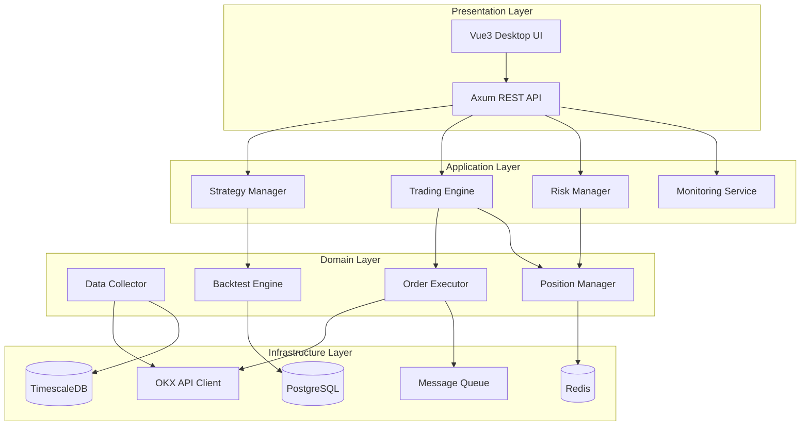

### 2.2 Module Boundaries

| Module | Responsibility | Dependencies |
|--------|---------------|--------------|
| Data Layer | Market data acquisition, cleaning, storage | OKX API, TimescaleDB, PostgreSQL |
| Strategy Layer | Strategy development, backtesting, optimization | Data Layer, Backtest Engine |
| Trading Layer | Order execution, risk control, capital management | OKX API, Risk Manager, MQ |
| Monitoring Layer | Real-time monitoring, alerting, performance evaluation | All layers |
| Management Layer | User permissions, configuration, system admin | PostgreSQL, Redis |

### 2.3 High Availability Design

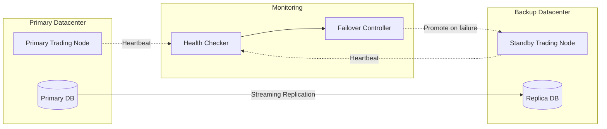

**Failover Requirements:**
- Heartbeat interval: 1 second
- Failure detection: 3 consecutive missed heartbeats
- Automatic failover time: Less than 5 seconds
- Data loss tolerance: Zero for critical trading data

## 3. Data Management Module

### 3.1 Data Source Integration

#### 3.1.1 Data Type Specifications

| Data Type | Source | Update Frequency | Storage Duration |
|-----------|--------|------------------|------------------|
| Real-time Market Data | OKX WebSocket (Level 1/2) | Real-time | 30 days in TimescaleDB |
| Trade Tick Data | OKX WebSocket | Real-time | 90 days |
| Historical OHLCV | OKX REST API | Daily sync | 5+ years |
| Account Balance | OKX REST API | Per trade + 10s polling | Perpetual |
| Order Book Depth | OKX WebSocket | Real-time | 7 days |
| Funding Rate | OKX REST API | 8 hours | 2 years |
| Liquidation Data | OKX WebSocket | Real-time | 1 year |

#### 3.1.2 OKX WebSocket Channel Subscriptions

| Channel | Purpose | Message Rate | Data Fields |
|---------|---------|--------------|-------------|
| tickers | Real-time price updates | ~100ms per symbol | last, bid, ask, volume24h, high24h, low24h |
| candle1m / candle5m / candle1H | OHLCV data | Per interval | timestamp, open, high, low, close, volume, volumeCcy |
| books5 / books-l2-tbt | Order book depth | ~100ms (books5), real-time (l2-tbt) | bids, asks with price and quantity |
| trades | Executed trades | Real-time per trade | tradeId, price, size, side, timestamp |
| account | Account updates | On change | balance, availBal, frozenBal, equity |
| positions | Position changes | On change | posId, instId, pos, avgPx, upl, uplRatio |
| orders | Order status updates | On change | ordId, clOrdId, state, fillSz, avgPx |
| liquidation-warning | Liquidation alerts | On risk threshold | instId, margin-ratio, timestamp |

#### 3.1.3 OKX REST API Endpoints

| Endpoint Category | Endpoints | Rate Limit | Usage |
|------------------|-----------|------------|-------|
| Market Data | /api/v5/market/candles | 20 req/2s | Historical OHLCV backfill |
| Market Data | /api/v5/market/history-candles | 20 req/2s | Extended historical data |
| Market Data | /api/v5/market/trades | 20 req/2s | Historical trade ticks |
| Account | /api/v5/account/balance | 10 req/2s | Account balance verification |
| Account | /api/v5/account/positions | 10 req/2s | Position reconciliation |
| Trading | /api/v5/trade/order | 60 req/2s | Place orders |
| Trading | /api/v5/trade/cancel-order | 60 req/2s | Cancel orders |
| Trading | /api/v5/trade/orders-pending | 20 req/2s | Query open orders |
| Trading | /api/v5/trade/orders-history | 20 req/2s | Historical order data |
| Public | /api/v5/public/instruments | 20 req/2s | Trading pair metadata |

#### 3.1.4 Data Synchronization Strategy

**Initial Bootstrap Process:**

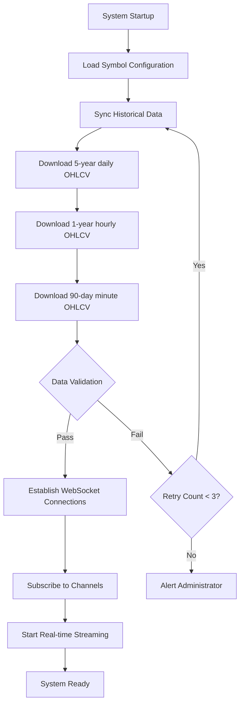

**Gap Detection and Recovery:**

| Scenario | Detection Method | Recovery Action | SLA |
|----------|-----------------|-----------------|-----|
| Missing candles | Compare timestamp sequence | Fetch missing intervals via REST API | < 60 seconds |
| WebSocket disconnect | Heartbeat timeout (30s) | Reconnect + fetch gap data | < 10 seconds |
| Delayed data | Compare message timestamp to system time | Log warning, continue processing | Alert if > 5s |
| Duplicate data | Check message ID cache (last 10k) | Silently discard | N/A |
| Order book desync | Periodic checksum validation | Full snapshot refresh | < 5 seconds |

### 3.2 Data Quality Control Pipeline

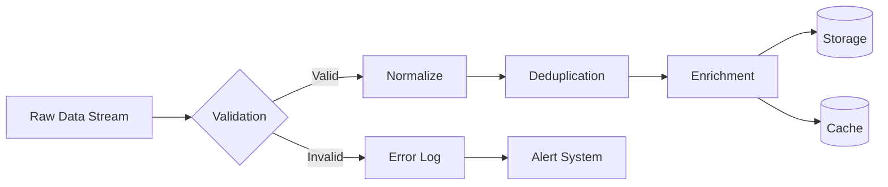

**Quality Control Checklist:**
- Timestamp validation: Reject future timestamps and stale data beyond 5 seconds
- Duplicate detection: Check message ID and timestamp combination
- Range validation: Price must be within 10% of last valid price
- Missing field detection: Reject incomplete messages
- Anomaly detection: Statistical outlier detection using rolling Z-score

### 3.3 Data Storage Strategy

| Data Category | Storage Solution | Retention Policy | Access Pattern |
|---------------|------------------|------------------|----------------|
| Hot Market Data (< 7 days) | Redis + TimescaleDB | 7 days | High-frequency read |
| Warm Market Data (7-90 days) | TimescaleDB | 90 days | Medium-frequency query |
| Cold Market Data (> 90 days) | PostgreSQL with compression | 5+ years | Batch analysis |
| Strategy Configurations | PostgreSQL | Perpetual | Low-frequency CRUD |
| Trade Records | PostgreSQL | Perpetual | Audit and analysis |
| System Logs | File + ELK Stack | 180 days | Debug and monitoring |

### 3.4 Data Models

#### 3.4.1 Market Data Schema

**Table: market_ohlcv (TimescaleDB Hypertable)**

| Field | Type | Nullable | Index | Constraints | Description |
|-------|------|----------|-------|-------------|-------------|
| id | BIGSERIAL | NO | - | - | Auto-increment ID |
| symbol | VARCHAR(20) | NO | Composite PK | - | Trading pair (e.g., BTC-USDT) |
| timestamp | TIMESTAMPTZ | NO | Composite PK | - | Candle open time |
| interval | VARCHAR(10) | NO | Composite PK | CHECK IN ('1m','5m','15m','1h','4h','1d') | Time interval |
| open | DECIMAL(20,8) | NO | - | CHECK > 0 | Opening price |
| high | DECIMAL(20,8) | NO | - | CHECK >= open AND >= low | Highest price |
| low | DECIMAL(20,8) | NO | - | CHECK <= close AND <= high | Lowest price |
| close | DECIMAL(20,8) | NO | - | CHECK > 0 | Closing price |
| volume | DECIMAL(20,8) | NO | - | CHECK >= 0 | Base currency volume |
| quote_volume | DECIMAL(20,8) | NO | - | CHECK >= 0 | Quote currency volume |
| trade_count | INTEGER | NO | - | CHECK >= 0 | Number of trades in interval |
| vwap | DECIMAL(20,8) | YES | - | - | Volume-weighted average price |
| created_at | TIMESTAMPTZ | NO | - | DEFAULT NOW() | Record creation time |

**Partitioning Strategy:**
- Hypertable chunk interval: 7 days
- Compression policy: Enable after 30 days
- Retention policy: 5 years for daily, 2 years for hourly, 90 days for minute data

**Table: market_ticks**

| Field | Type | Nullable | Index | Description |
|-------|------|----------|-------|-------------|
| id | BIGSERIAL | NO | Primary | Auto-increment ID |
| symbol | VARCHAR(20) | NO | Composite | Trading pair |
| timestamp | TIMESTAMPTZ | NO | Composite | Trade execution time |
| trade_id | VARCHAR(50) | NO | Unique | OKX trade ID |
| price | DECIMAL(20,8) | NO | - | Trade price |
| quantity | DECIMAL(20,8) | NO | - | Trade quantity |
| side | VARCHAR(4) | NO | - | 'buy' or 'sell' |
| is_block_trade | BOOLEAN | NO | - | Block trade indicator |

**Table: order_book_snapshots**

| Field | Type | Nullable | Index | Description |
|-------|------|----------|-------|-------------|
| id | BIGSERIAL | NO | Primary | Auto-increment ID |
| symbol | VARCHAR(20) | NO | Composite | Trading pair |
| timestamp | TIMESTAMPTZ | NO | Composite | Snapshot time |
| bids | JSONB | NO | - | Array of [price, quantity] |
| asks | JSONB | NO | - | Array of [price, quantity] |
| checksum | INTEGER | YES | - | OKX checksum for validation |
| depth_level | VARCHAR(10) | NO | - | 'books5' or 'books50' |

#### 3.4.2 Trading Data Schema

**Table: trades**

| Field | Type | Nullable | Index | Constraints | Description |
|-------|------|----------|-------|-------------|-------------|
| id | UUID | NO | Primary | DEFAULT gen_random_uuid() | Internal trade ID |
| okx_order_id | VARCHAR(50) | YES | Unique | - | OKX order ID |
| client_order_id | VARCHAR(50) | NO | Unique | - | Client-assigned order ID |
| strategy_id | UUID | NO | Foreign Key | REFERENCES strategies(id) | Associated strategy |
| symbol | VARCHAR(20) | NO | Secondary | - | Trading pair |
| side | VARCHAR(4) | NO | - | CHECK IN ('buy','sell') | Order side |
| order_type | VARCHAR(20) | NO | - | CHECK IN ('market','limit','stop_loss','take_profit','post_only') | Order type |
| position_side | VARCHAR(10) | NO | - | CHECK IN ('long','short','net') | Position side |
| quantity | DECIMAL(20,8) | NO | - | CHECK > 0 | Order quantity |
| price | DECIMAL(20,8) | YES | - | CHECK > 0 | Limit price (NULL for market) |
| avg_fill_price | DECIMAL(20,8) | YES | - | - | Average execution price |
| filled_quantity | DECIMAL(20,8) | NO | - | CHECK >= 0 AND <= quantity | Filled quantity |
| commission | DECIMAL(20,8) | NO | - | CHECK >= 0 | Trading fee paid |
| commission_asset | VARCHAR(10) | NO | - | - | Fee currency |
| realized_pnl | DECIMAL(20,8) | YES | - | - | Realized profit/loss |
| slippage_bps | INTEGER | YES | - | - | Slippage in basis points |
| status | VARCHAR(20) | NO | - | CHECK IN ('created','submitted','partial','filled','cancelled','rejected','failed') | Order status |
| reject_reason | TEXT | YES | - | - | Rejection reason if applicable |
| created_at | TIMESTAMPTZ | NO | Secondary | DEFAULT NOW() | Order creation time |
| submitted_at | TIMESTAMPTZ | YES | - | - | Submitted to exchange |
| first_fill_at | TIMESTAMPTZ | YES | - | - | First partial fill time |
| completed_at | TIMESTAMPTZ | YES | - | - | Order completion time |
| latency_ms | INTEGER | YES | - | - | Submission to first fill latency |
| total_latency_ms | INTEGER | YES | - | - | Creation to completion latency |

**Table: positions**

| Field | Type | Nullable | Index | Description |
|-------|------|----------|-------|-------------|
| id | UUID | NO | Primary | Position ID |
| strategy_id | UUID | NO | Foreign Key | Associated strategy |
| symbol | VARCHAR(20) | NO | Composite Unique | Trading pair |
| side | VARCHAR(10) | NO | - | 'long', 'short', or 'net' |
| quantity | DECIMAL(20,8) | NO | - | Current position size |
| avg_entry_price | DECIMAL(20,8) | NO | - | Average entry price |
| current_price | DECIMAL(20,8) | NO | - | Latest market price |
| unrealized_pnl | DECIMAL(20,8) | NO | - | Unrealized profit/loss |
| realized_pnl | DECIMAL(20,8) | NO | - | Cumulative realized PnL |
| margin | DECIMAL(20,8) | YES | - | Margin requirement |
| leverage | DECIMAL(10,2) | YES | - | Leverage ratio |
| liquidation_price | DECIMAL(20,8) | YES | - | Liquidation price |
| opened_at | TIMESTAMPTZ | NO | - | Position open time |
| last_updated | TIMESTAMPTZ | NO | - | Last update time |

#### 3.4.3 Strategy and Configuration Schema

**Table: strategies**

| Field | Type | Nullable | Index | Description |
|-------|------|----------|-------|-------------|
| id | UUID | NO | Primary | Strategy ID |
| name | VARCHAR(100) | NO | Unique | Strategy name |
| description | TEXT | YES | - | Strategy description |
| strategy_type | VARCHAR(50) | NO | Secondary | Type (e.g., 'trend_following', 'mean_reversion') |
| version | VARCHAR(20) | NO | - | Strategy version |
| parameters | JSONB | NO | - | Strategy parameters |
| risk_limits | JSONB | NO | - | Risk control parameters |
| symbols | TEXT[] | NO | - | Allowed trading pairs |
| status | VARCHAR(20) | NO | Secondary | 'active', 'paused', 'stopped', 'backtesting' |
| allocated_capital | DECIMAL(20,8) | NO | - | Capital allocation |
| max_position_size | DECIMAL(20,8) | NO | - | Maximum position size |
| max_leverage | DECIMAL(10,2) | NO | - | Maximum leverage allowed |
| created_by | UUID | NO | - | User ID who created |
| created_at | TIMESTAMPTZ | NO | - | Creation timestamp |
| updated_at | TIMESTAMPTZ | NO | - | Last update timestamp |
| deployed_at | TIMESTAMPTZ | YES | - | Deployment timestamp |
| stopped_at | TIMESTAMPTZ | YES | - | Stop timestamp |

**Table: strategy_performance**

| Field | Type | Nullable | Description |
|-------|------|----------|-------------|
| id | BIGSERIAL | NO | Record ID |
| strategy_id | UUID | NO | Strategy reference |
| date | DATE | NO | Performance date |
| total_trades | INTEGER | NO | Number of trades |
| winning_trades | INTEGER | NO | Profitable trades |
| losing_trades | INTEGER | NO | Losing trades |
| total_pnl | DECIMAL(20,8) | NO | Total profit/loss |
| total_commission | DECIMAL(20,8) | NO | Total fees paid |
| net_pnl | DECIMAL(20,8) | NO | Net profit/loss |
| return_pct | DECIMAL(10,4) | NO | Daily return percentage |
| sharpe_ratio | DECIMAL(10,4) | YES | Daily Sharpe ratio |
| max_drawdown | DECIMAL(10,4) | NO | Maximum drawdown |
| win_rate | DECIMAL(10,4) | NO | Win rate percentage |
| avg_win | DECIMAL(20,8) | YES | Average winning trade |
| avg_loss | DECIMAL(20,8) | YES | Average losing trade |
| profit_factor | DECIMAL(10,4) | YES | Gross profit / gross loss |
| total_volume | DECIMAL(20,8) | NO | Total trading volume |

#### 3.4.4 Risk and Monitoring Schema

**Table: risk_events**

| Field | Type | Nullable | Description |
|-------|------|----------|-------------|
| id | BIGSERIAL | NO | Event ID |
| event_type | VARCHAR(50) | NO | 'limit_breach', 'anomaly', 'margin_call', etc. |
| severity | VARCHAR(20) | NO | 'info', 'warning', 'critical', 'emergency' |
| strategy_id | UUID | YES | Related strategy |
| symbol | VARCHAR(20) | YES | Related symbol |
| description | TEXT | NO | Event description |
| metric_name | VARCHAR(100) | YES | Metric that triggered |
| metric_value | DECIMAL(20,8) | YES | Current value |
| threshold_value | DECIMAL(20,8) | YES | Threshold breached |
| action_taken | VARCHAR(50) | YES | Automated action |
| acknowledged | BOOLEAN | NO | Manual acknowledgment |
| acknowledged_by | UUID | YES | User who acknowledged |
| acknowledged_at | TIMESTAMPTZ | YES | Acknowledgment time |
| created_at | TIMESTAMPTZ | NO | Event timestamp |

**Table: system_metrics**

| Field | Type | Nullable | Description |
|-------|------|----------|-------------|
| id | BIGSERIAL | NO | Record ID |
| timestamp | TIMESTAMPTZ | NO | Metric timestamp |
| metric_category | VARCHAR(50) | NO | 'system', 'data', 'trading', 'risk' |
| metric_name | VARCHAR(100) | NO | Specific metric |
| metric_value | DECIMAL(20,8) | NO | Metric value |
| unit | VARCHAR(20) | YES | Measurement unit |
| tags | JSONB | YES | Additional metadata |

#### 3.4.5 User and Access Control Schema

**Table: users**

| Field | Type | Nullable | Index | Description |
|-------|------|----------|-------|-------------|
| id | UUID | NO | Primary | User ID |
| username | VARCHAR(50) | NO | Unique | Username |
| email | VARCHAR(255) | NO | Unique | Email address |
| password_hash | VARCHAR(255) | NO | - | Argon2id hash |
| role | VARCHAR(20) | NO | - | 'admin', 'manager', 'trader', 'analyst', 'auditor' |
| two_factor_enabled | BOOLEAN | NO | - | 2FA enabled flag |
| two_factor_secret | VARCHAR(255) | YES | - | TOTP secret (encrypted) |
| api_key_hash | VARCHAR(255) | YES | - | API key hash |
| is_active | BOOLEAN | NO | - | Account active status |
| last_login | TIMESTAMPTZ | YES | - | Last login time |
| created_at | TIMESTAMPTZ | NO | - | Account creation |
| updated_at | TIMESTAMPTZ | NO | - | Last update |

**Table: audit_logs**

| Field | Type | Nullable | Description |
|-------|------|----------|-------------|
| id | BIGSERIAL | NO | Log ID |
| user_id | UUID | YES | User who performed action |
| action | VARCHAR(100) | NO | Action performed |
| resource_type | VARCHAR(50) | NO | Type of resource |
| resource_id | VARCHAR(100) | YES | Resource identifier |
| old_value | JSONB | YES | Previous state |
| new_value | JSONB | YES | New state |
| ip_address | INET | YES | Client IP address |
| user_agent | TEXT | YES | Client user agent |
| success | BOOLEAN | NO | Action success |
| error_message | TEXT | YES | Error if failed |
| created_at | TIMESTAMPTZ | NO | Action timestamp |

## 4. Strategy Development and Backtesting

### 4.1 Strategy Design Framework

#### 4.1.1 Strategy Interface Contract

**Core Strategy Trait Definition:**

| Method | Input Parameters | Return Type | Responsibility |
|--------|-----------------|-------------|----------------|
| initialize | config: StrategyConfig | Result of Strategy Instance | Load parameters, validate configuration, allocate resources |
| on_market_data | data: MarketDataEvent | Result of unit | Process incoming market data, update internal state |
| generate_signal | snapshot: MarketSnapshot | Result of Signal | Analyze market conditions and generate trading signal |
| calculate_position_size | signal: Signal, portfolio: Portfolio | Result of PositionSize | Determine order quantity based on signal and risk |
| on_order_fill | fill: OrderFill | Result of unit | Update strategy state after order execution |
| on_order_reject | reject: OrderReject | Result of unit | Handle order rejection scenarios |
| get_metrics | - | PerformanceMetrics | Calculate current performance statistics |
| shutdown | - | Result of unit | Clean up resources, save state |

**Strategy Configuration Structure:**

| Parameter Category | Fields | Data Type | Validation Rules |
|-------------------|--------|-----------|------------------|
| Identity | strategy_id, name, version | String | Non-empty, version semver format |
| Trading Parameters | symbols, timeframes, position_mode | Array, Enum | Symbols must exist, valid timeframes |
| Signal Parameters | indicator_periods, thresholds, filters | Map of Key-Value | Numeric ranges, no conflicting filters |
| Risk Parameters | max_position_size, max_leverage, stop_loss_pct | Decimal | Positive values, leverage <= system max |
| Execution Parameters | order_type, execution_algo, timeout_seconds | Enum, Integer | Valid types, timeout 5-300 seconds |
| Capital Management | allocated_capital, position_sizing_method | Decimal, Enum | Capital > 0, valid sizing method |

#### 4.1.2 Strategy Lifecycle Management

**Strategy State Machine:**

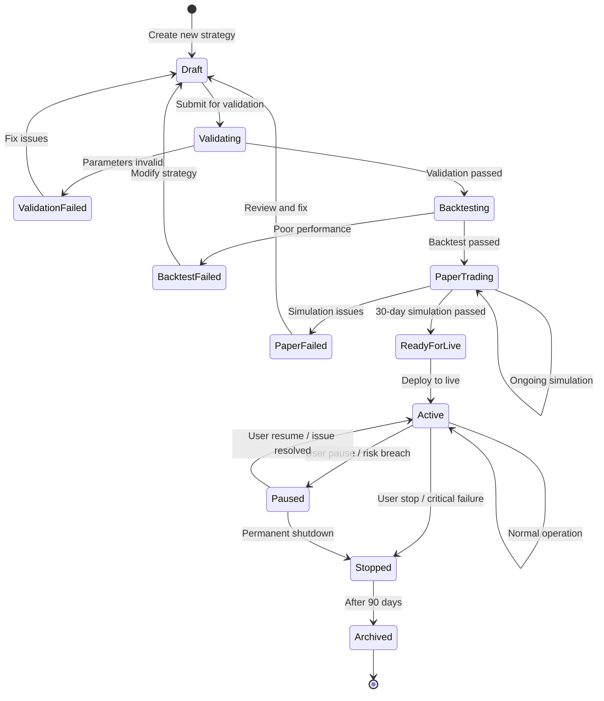

**State Transition Permissions:**

| From State | To State | Required Permission | Additional Checks |
|------------|----------|--------------------|-----------------|
| Draft | Validating | Strategy Manager | All required fields populated |
| Validating | Backtesting | System | Validation rules passed |
| Backtesting | PaperTrading | Strategy Manager | Sharpe > 1.0, Drawdown < 30% |
| PaperTrading | ReadyForLive | Super Admin | 30 days completed, no critical issues |
| ReadyForLive | Active | Super Admin | Capital allocated, risk limits set |
| Active | Paused | Trader / System | None |
| Paused | Active | Strategy Manager | Issue resolution documented |
| Active/Paused | Stopped | Strategy Manager | Open positions closed or approved |
| Stopped | Archived | System (automated) | 90 days after stop + no references |

#### 4.1.3 Strategy Hot-Reload Mechanism

**Deployment Process:**

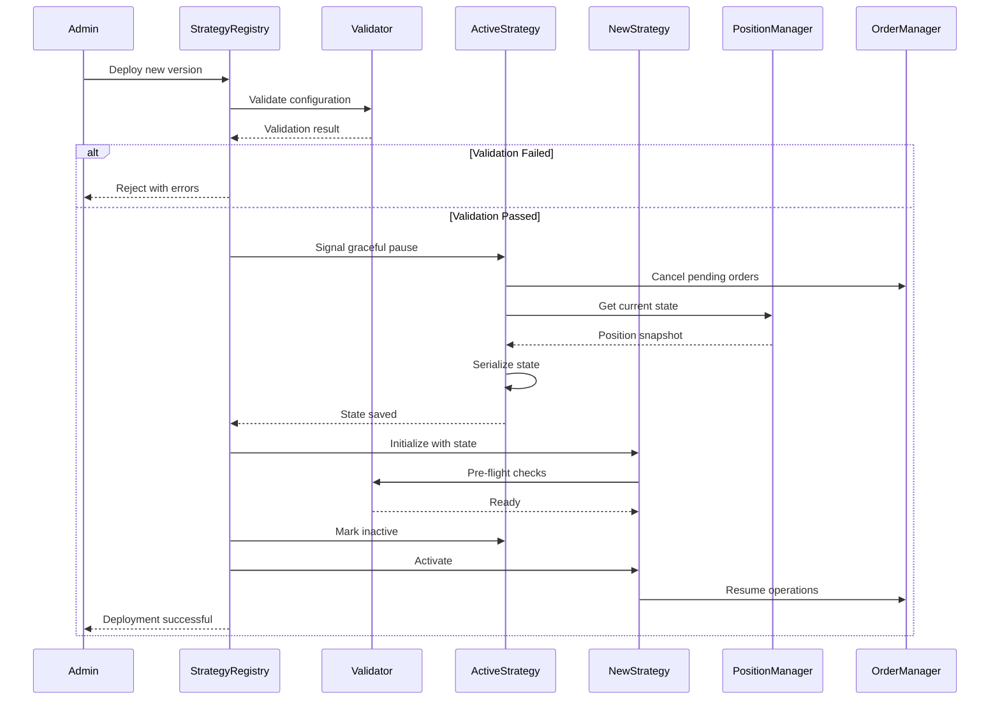

**State Serialization Schema:**

| State Component | Data Fields | Serialization Format | Purpose |
|-----------------|-------------|---------------------|----------|
| Market Context | last_prices, indicators, signals | JSON | Resume without recalculation |
| Position State | open_positions, avg_prices, unrealized_pnl | JSON | Maintain position continuity |
| Order State | pending_orders, order_history_ids | JSON | Track in-flight orders |
| Internal Counters | trade_count, consecutive_wins, daily_pnl | JSON | Preserve strategy logic state |
| Timestamp | last_processed_time, deployment_time | ISO 8601 | Time synchronization |

#### 4.1.4 Strategy Plugin Architecture

**Plugin Discovery and Loading:**

| Step | Process | Validation | Error Handling |
|------|---------|------------|----------------|
| 1. Discovery | Scan strategies directory for .wasm files | File exists, valid extension | Log warning, skip file |
| 2. Load Binary | Read WASM module into memory | Valid WASM header, size < 10MB | Reject with error |
| 3. Verify Signature | Check cryptographic signature | Signed by authorized key | Reject unsigned |
| 4. Instantiate | Load into WASM runtime (Wasmtime) | Exports required functions | Fail deployment |
| 5. Type Check | Validate function signatures | Match expected interface | Reject incompatible |
| 6. Sandbox Test | Run in isolated environment | No crashes, responds to test | Mark as untrusted |
| 7. Register | Add to strategy registry | Unique name, version | Fail if duplicate |

**Resource Limits for Strategy Plugins:**

| Resource | Limit | Enforcement | Violation Action |
|----------|-------|-------------|------------------|
| Memory | 256 MB per instance | WASM runtime | Kill and restart |
| CPU Time | 50ms per market data event | Timeout wrapper | Log warning, use cached signal |
| File I/O | Read-only access to data directory | Sandboxing | Permission denied |
| Network | No direct network access | Firewall rules | Connection refused |
| System Calls | Whitelist only (time, random) | WASM capability control | Trap execution |

### 4.2 Backtesting Engine Requirements

#### 4.2.1 Realistic Simulation Components

**Trading Cost Model:**

| Cost Type | Calculation Method | Default Parameters | Customization |
|-----------|-------------------|--------------------|---------------|
| Maker Fee | order_value * maker_fee_rate | 0.0008 (0.08%) | Per symbol override |
| Taker Fee | order_value * taker_fee_rate | 0.001 (0.1%) | Per symbol override |
| Funding Rate | position_value * funding_rate (every 8h) | Dynamic from historical data | Use average or actual |
| Withdrawal Fee | Flat fee per withdrawal | Symbol-specific | Config file |
| Gas Fee (for tokens) | Dynamic based on network | Historical gas prices | Estimate or actual |

**Slippage Model:**

| Model Type | Formula | Parameters | Use Case |
|------------|---------|------------|----------|
| Fixed Slippage | price * (1 ± fixed_bps / 10000) | fixed_bps = 5 | Low volatility assets |
| Linear Slippage | price * (1 ± (base_bps + volume_factor * order_size_pct)) | base_bps=5, volume_factor=0.01 | Normal market conditions |
| Square Root Impact | price * (1 ± impact_coef * sqrt(order_size / daily_volume)) | impact_coef = 0.1 | Large orders |
| Spread-based | (bid + ask) / 2 ± (ask - bid) / 2 * fill_aggression | fill_aggression = 0.5 | Limit order simulation |
| Historical Slippage | Use actual execution data from similar trades | Requires historical fills | High-frequency strategies |

**Market Impact Model:**

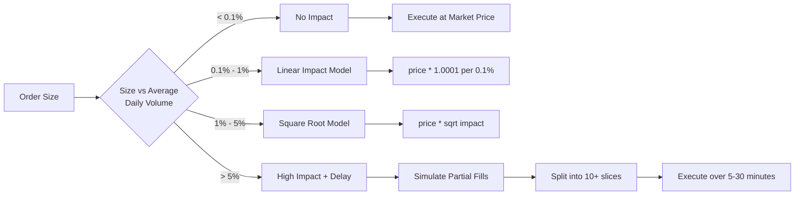

**Fill Rate Model:**

| Order Type | Condition | Fill Probability | Fill Logic |
|------------|-----------|------------------|------------|
| Market Order | Always | 100% | Immediate fill at bid/ask |
| Limit Buy | price >= ask | 100% | Immediate fill as taker |
| Limit Buy | bid < price < ask | 50% | Probabilistic based on depth |
| Limit Buy | price <= bid | 10-30% | Based on historical fill rate |
| Limit Sell | price <= bid | 100% | Immediate fill as taker |
| Limit Sell | bid < price < ask | 50% | Probabilistic |
| Limit Sell | price >= ask | 10-30% | Based on depth |
| Stop Loss | Triggered | 95% | High probability but may fail in crash |
| Iceberg Order | Split execution | 100% over time | Delayed fills with intervals |

**Latency Simulation:**

| Latency Component | Distribution | Parameters | Total Impact |
|------------------|--------------|------------|-------------|
| Signal Generation | Fixed | 10ms | Internal processing |
| Risk Check | Fixed | 5ms | Internal validation |
| Network to Exchange | Normal Distribution | mean=30ms, std=15ms | Variable |
| Exchange Processing | Exponential Distribution | lambda=20ms | Order queue time |
| Confirmation Back | Normal Distribution | mean=20ms, std=10ms | Network |
| **Total Latency** | **Convolution** | **Mean: 85ms, p95: 130ms** | **Signal to fill** |

#### 4.2.2 Overfitting Prevention Framework

**Multi-Level Validation Pipeline:**

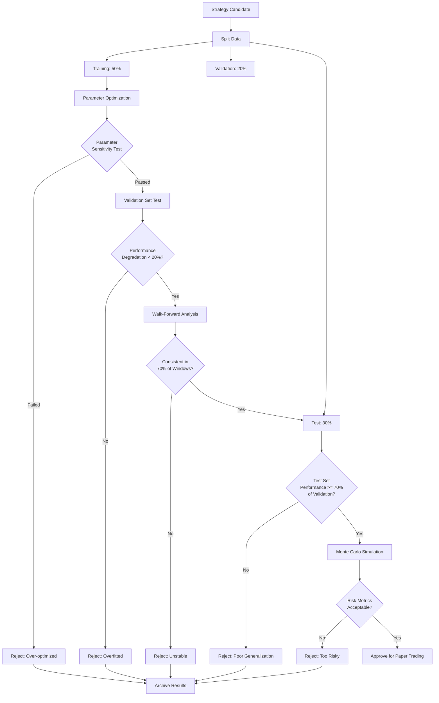

**Parameter Sensitivity Analysis:**

| Test Type | Method | Acceptance Criteria | Metric |
|-----------|--------|---------------------|--------|
| Single Parameter | Vary each parameter ±20% independently | Sharpe ratio variation < 25% | Robustness score |
| Parameter Plateau | Grid search to find stable regions | Plateau width > 30% of range | Stability index |
| Interaction Effects | Test parameter pairs | No strong negative interactions | Correlation matrix |
| Extreme Values | Test boundary conditions | No crashes, graceful degradation | Error handling |

**Walk-Forward Analysis Configuration:**

| Parameter | Value | Rationale |
|-----------|-------|----------|
| Training Window | 12 months | Capture seasonal patterns |
| Testing Window | 3 months | Validate near-term performance |
| Step Size | 1 month | Frequent re-optimization |
| Reoptimization Frequency | Every step | Adaptive to market changes |
| Minimum Windows | 8 | Statistical significance |
| Success Threshold | 70% profitable windows | Majority consistency |

**Monte Carlo Simulation Specifications:**

| Aspect | Configuration | Purpose |
|--------|--------------|----------|
| Number of Paths | 10,000 | Statistical confidence |
| Return Generation | Bootstrap from historical returns | Preserve empirical distribution |
| Path Length | 252 trading days (1 year) | Annual performance projection |
| Random Seed | Time-based + strategy ID | Reproducible but unique |
| Percentile Analysis | 5th, 25th, 50th, 75th, 95th | Range of outcomes |
| Risk Metrics | Max DD at 95th percentile < 40% | Worst-case scenario |

#### 4.2.3 Backtest Execution Engine

**Event-Driven Simulation Architecture:**

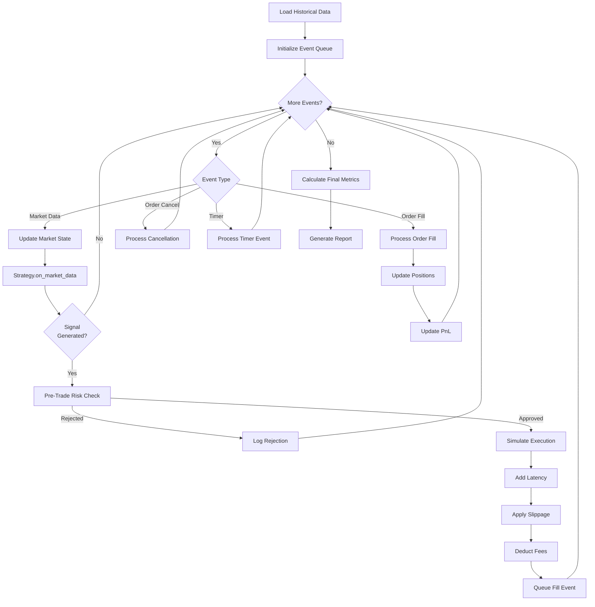

**Backtest Performance Optimization:**

| Optimization | Technique | Performance Gain | Trade-off |
|--------------|-----------|------------------|----------|
| Data Loading | Memory-mapped files | 10x faster I/O | Higher memory usage |
| Indicator Calculation | Vectorized operations (SIMD) | 5-10x faster | Complexity increase |
| Event Processing | Lock-free queues | 3x throughput | Implementation complexity |
| Parallel Backtests | Multi-threading (Rayon) | Linear with cores | Resource contention |
| Caching | Memoization of repeated calculations | 2-5x for complex indicators | Memory overhead |

#### 4.2.4 Backtest Validation and Quality Assurance

**Validation Checklist:**

| Check | Method | Pass Criteria | Automation |
|-------|--------|---------------|------------|
| No Future Data | Timestamp validation | All data timestamps <= signal time | Automated assert |
| Correct Pricing | Compare fill prices to market data | Fills within bid-ask spread | Automated check |
| Cost Accuracy | Verify fee calculations | Match exchange fee schedule | Unit tests |
| Position Integrity | Track position reconciliation | Positions match trade history | Automated validation |
| PnL Accuracy | Compare to manual calculation | < 0.01% difference | Automated test |
| Survivorship Bias | Include delisted symbols | Test data includes failures | Manual review |
| Market Hours | Only trade during exchange hours | No weekend/holiday trades | Automated filter |

**Benchmark Comparison:**

| Benchmark | Calculation | Purpose |
|-----------|-------------|----------|
| Buy and Hold | Buy at start, sell at end | Baseline comparison |
| Market Index | Bitcoin/Ethereum performance | Relative performance |
| Risk-Free Rate | T-bill or stablecoin yield | Sharpe ratio calculation |
| Equal-Weight Portfolio | 1/N allocation across symbols | Naive diversification baseline |
| Random Strategy | Monte Carlo random trades | Statistical significance test |

### 4.3 Performance Metrics

| Metric | Formula Description | Target Threshold |
|--------|---------------------|------------------|
| Annualized Return | Compound annual growth rate | > 15% |
| Sharpe Ratio | Risk-adjusted return (excess return / volatility) | > 1.5 |
| Sortino Ratio | Downside risk-adjusted return | > 2.0 |
| Maximum Drawdown | Largest peak-to-trough decline | < 25% |
| Calmar Ratio | Return / max drawdown | > 0.8 |
| Win Rate | Percentage of profitable trades | > 45% |
| Profit Factor | Gross profit / gross loss | > 1.5 |
| Average Trade Duration | Mean holding period | Strategy-dependent |
| Daily Value at Risk (95%) | Maximum expected daily loss at 95% confidence | < 5% |

## 5. Trading Execution Module

### 5.1 Order Lifecycle Management

#### 5.1.1 Order State Machine

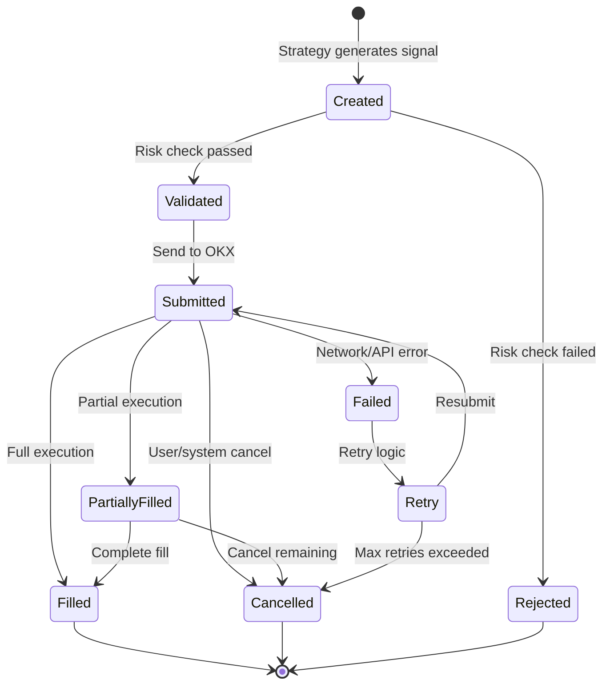

#### 5.1.2 Order Type Specifications

**Supported Order Types:**

| Order Type | OKX API Type | Parameters | Use Case | Risk Level |
|------------|--------------|------------|----------|------------|
| Market | market | symbol, side, size | Immediate execution | High (slippage) |
| Limit | limit | symbol, side, size, price | Price control | Low |
| Post-Only Limit | post_only | symbol, side, size, price | Maker rebates | Low |
| IOC (Immediate or Cancel) | ioc | symbol, side, size, price | Partial fill acceptable | Medium |
| FOK (Fill or Kill) | fok | symbol, side, size, price | All-or-nothing | Medium |
| Stop Loss | conditional | symbol, side, size, trigger_price, order_price | Risk management | High |
| Take Profit | conditional | symbol, side, size, trigger_price, order_price | Profit taking | Medium |
| Trailing Stop | conditional | symbol, side, size, callback_ratio | Dynamic stop | Medium |
| Iceberg | iceberg | symbol, side, size, price, visible_size | Hide large orders | Low |
| TWAP Algorithm | twap | symbol, side, size, duration, slices | Time distribution | Low |
| VWAP Algorithm | vwap | symbol, side, size, start_time, end_time | Volume matching | Low |

#### 5.1.3 Order Timeout Handling

**Timeout Configuration:**

| Order Type | Timeout Threshold | Action on Timeout | Retry Strategy |
|------------|------------------|-------------------|----------------|
| Market Order | 5 seconds | Critical alert, investigate | No retry (should never timeout) |
| Limit Order (aggressive) | 60 seconds | Cancel and resubmit as market | 1 retry |
| Limit Order (passive) | Configurable (default: 300s) | Cancel or keep based on strategy | Strategy-dependent |
| Stop Loss Order | 3 seconds | Force market order immediately | Immediate execution |
| Take Profit Order | 120 seconds | Cancel and re-evaluate | No automatic retry |
| Iceberg Slice | 30 seconds per slice | Cancel and adjust | Retry with smaller size |
| TWAP Slice | Per-slice timeout | Skip slice, continue with next | Continue algorithm |

**Retry Logic Configuration:**

| Scenario | Max Retries | Backoff Strategy | Conditions |
|----------|-------------|------------------|------------|
| Network Error | 3 | Exponential (1s, 2s, 4s) | Transient network issues |
| Rate Limit | 5 | Linear (2s intervals) | API rate limiting |
| Insufficient Balance | 1 | Immediate | Check balance first |
| Invalid Symbol | 0 | No retry | Configuration error |
| Server Error (5xx) | 3 | Exponential (2s, 4s, 8s) | Exchange issues |
| Order Rejected | 0 | No retry, log reason | Business rule violation |

#### 5.1.4 Order Tracking and Reconciliation

**Order Status Synchronization:**

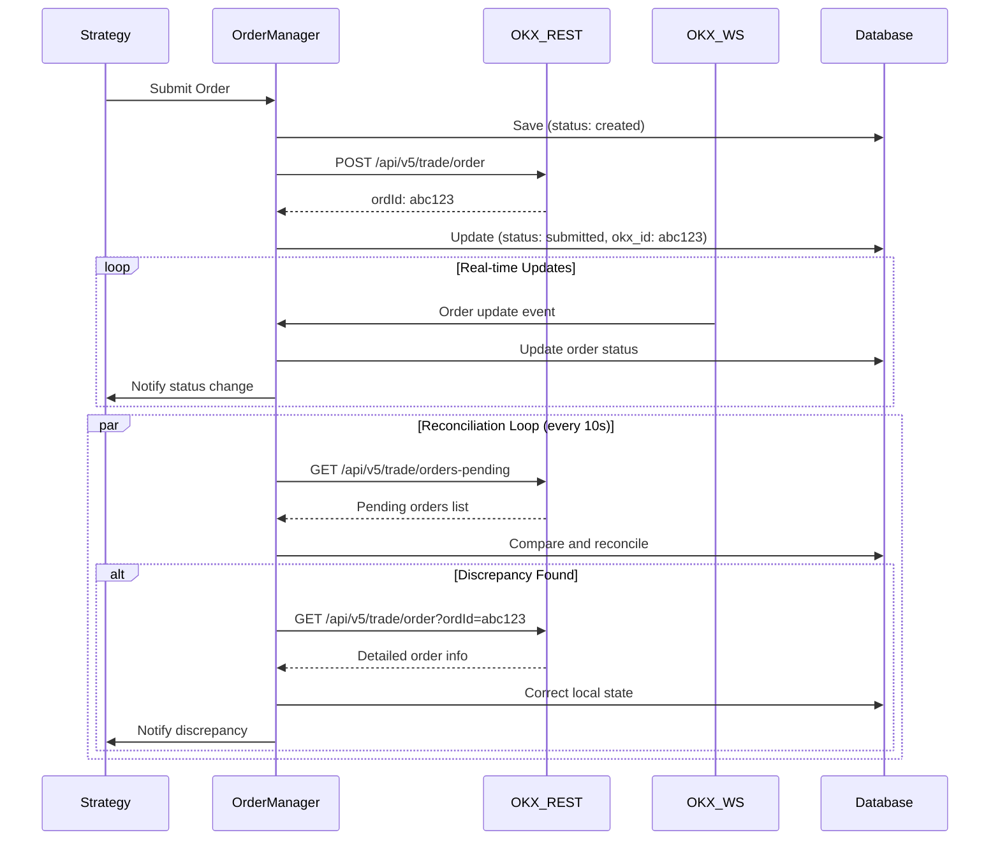

**Reconciliation Rules:**

| Discrepancy Type | Detection Method | Resolution Action | Alert Level |
|-----------------|------------------|-------------------|-------------|
| Missing local order | OKX has order, local doesn't | Import order into database | CRITICAL |
| Phantom local order | Local has order, OKX doesn't | Mark as failed/cancelled | CRITICAL |
| Status mismatch | Different status | Use OKX as source of truth | WARNING |
| Fill quantity mismatch | Different filled amounts | Update to OKX value | WARNING |
| Price mismatch | Different fill prices | Update to OKX value | INFO |

### 5.2 Smart Order Execution Algorithms

#### 5.2.1 TWAP (Time-Weighted Average Price)

**Algorithm Parameters:**

| Parameter | Type | Range | Default | Description |
|-----------|------|-------|---------|-------------|
| total_quantity | Decimal | > 0 | Required | Total order size to execute |
| duration_minutes | Integer | 5-1440 | 30 | Execution time window |
| slice_interval_seconds | Integer | 30-300 | 120 | Time between child orders |
| randomization_pct | Decimal | 0-25 | 10 | Random offset to avoid detection |
| order_type | Enum | limit, post_only | limit | Child order type |
| price_offset_bps | Integer | -50 to 50 | 0 | Offset from mid-price (basis points) |
| aggressive_on_final | Boolean | - | true | Use market order for last slice |

**Execution Logic:**

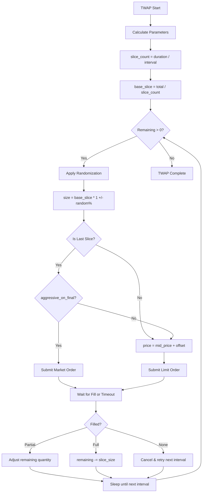

**Performance Metrics:**

| Metric | Calculation | Target |
|--------|-------------|--------|
| TWAP Deviation | abs(avg_fill_price - twap_benchmark) / twap_benchmark | < 0.1% |
| Fill Rate | filled_quantity / total_quantity | > 95% |
| Completion Time | actual_duration / target_duration | 0.9 - 1.1 |
| Slippage vs Mid | (avg_fill - avg_mid_price) / avg_mid_price | < 0.05% |

#### 5.2.2 VWAP (Volume-Weighted Average Price)

**Algorithm Parameters:**

| Parameter | Type | Range | Default | Description |
|-----------|------|-------|---------|-------------|
| total_quantity | Decimal | > 0 | Required | Total order size |
| start_time | Time | Trading hours | Now | Execution start |
| end_time | Time | Trading hours | +30 min | Execution end |
| participation_rate | Decimal | 0.05-0.30 | 0.10 | Target % of market volume |
| volume_profile | Enum | historical, intraday, custom | historical | Volume distribution pattern |
| price_limit_pct | Decimal | 0.1-2.0 | 0.5 | Max deviation from VWAP |
| catch_up_enabled | Boolean | - | true | Accelerate if behind schedule |

**Historical Volume Profile:**

| Time Period (UTC) | Typical Volume % | Adjustment Factor |
|------------------|------------------|-------------------|
| 00:00 - 02:00 | 8% | 0.8 |
| 02:00 - 04:00 | 5% | 0.5 |
| 04:00 - 06:00 | 6% | 0.6 |
| 06:00 - 08:00 | 12% | 1.2 |
| 08:00 - 10:00 | 15% | 1.5 |
| 10:00 - 12:00 | 10% | 1.0 |
| 12:00 - 14:00 | 9% | 0.9 |
| 14:00 - 16:00 | 11% | 1.1 |
| 16:00 - 18:00 | 10% | 1.0 |
| 18:00 - 20:00 | 7% | 0.7 |
| 20:00 - 22:00 | 4% | 0.4 |
| 22:00 - 24:00 | 3% | 0.3 |

**Dynamic Slice Sizing:**

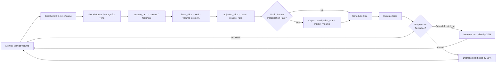

#### 5.2.3 Implementation Selector (Smart Router)

**Execution Decision Tree:**

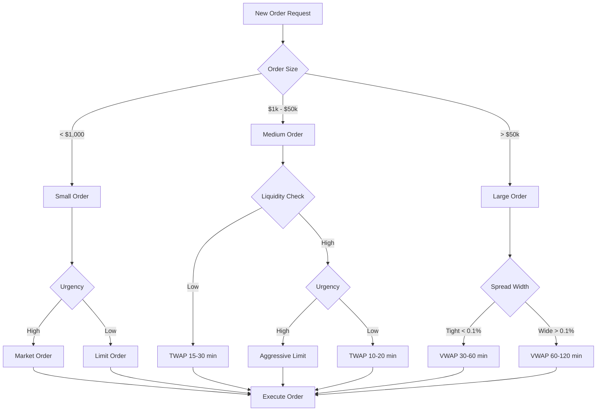

**Selection Criteria Matrix:**

| Order Size | Market Volatility | Spread | Liquidity | Recommended Algorithm |
|------------|------------------|--------|-----------|----------------------|
| < $1k | Any | Any | Any | Market or Limit |
| $1k-$10k | Low | Tight | High | Aggressive Limit |
| $1k-$10k | High | Wide | Low | TWAP (15 min) |
| $10k-$50k | Low | Tight | High | TWAP (20 min) |
| $10k-$50k | High | Wide | Low | VWAP (30 min) |
| $50k+ | Any | Tight | High | VWAP (60 min) |
| $50k+ | Any | Wide | Low | VWAP (120 min) + Iceberg |

### 5.3 Latency Optimization

#### 5.3.1 Latency Budget Breakdown

**Target Latencies (95th Percentile):**

| Component | Target (ms) | Measurement Point | Optimization Techniques |
|-----------|-------------|-------------------|------------------------|
| Market Data Processing | 1 | WebSocket receive → internal event | Zero-copy parsing, lock-free queues |
| Strategy Signal Generation | 10 | Market data → signal decision | Pre-computed indicators, vectorization |
| Risk Validation | 5 | Signal → risk approval | In-memory rule evaluation, parallel checks |
| Order Serialization | 2 | Order object → JSON/API format | Pre-allocated buffers, template reuse |
| Network to OKX | 30 | Send → OKX ACK | Geographic co-location, dedicated lines |
| OKX Internal Processing | 10 | OKX receive → execution | No control (exchange-side) |
| Confirmation Back | 20 | OKX fill → WebSocket notification | Parallel REST + WebSocket monitoring |
| **Total End-to-End** | **50** | **Market data → Order filled** | **All above combined** |

#### 5.3.2 Performance Optimization Strategies

**Rust-Specific Optimizations:**

| Technique | Implementation | Benefit | Code Impact |
|-----------|----------------|---------|-------------|
| Zero-Copy Parsing | Use bytes crate, avoid string allocation | 50% reduction in parsing time | Medium |
| SIMD Vectorization | Use packed_simd for indicator calculations | 4-8x speedup | High |
| Lock-Free Data Structures | crossbeam lock-free queues | Eliminate contention | Low |
| Memory Pools | Object pooling for orders | Reduce allocation overhead | Medium |
| Inline Functions | #[inline] on hot path | Eliminate call overhead | Low |
| Compile-Time Computation | const fn for static calculations | Zero runtime cost | Low |
| Profile-Guided Optimization | rustc PGO flags | 10-20% overall improvement | Very Low |

**Network Optimizations:**

| Optimization | Configuration | Expected Improvement |
|--------------|--------------|---------------------|
| WebSocket Keep-Alive | 30-second ping/pong | Prevent connection drops |
| TCP_NODELAY | Enabled | Reduce latency by 20-40ms |
| Connection Pooling | 5 persistent connections | Eliminate handshake overhead |
| HTTP/2 Multiplexing | Enable for REST API | 2x throughput |
| Geographic Co-location | Server in OKX datacenter region | 5-15ms reduction |
| Dedicated Network | Private link to exchange | Stable low latency |

#### 5.3.3 Latency Monitoring

**Instrumentation Points:**

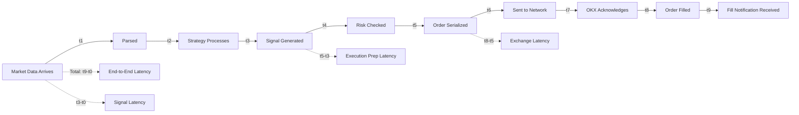

**Latency SLA and Alerting:**

| Metric | Target (p95) | Warning Threshold | Critical Threshold | Alert Action |
|--------|-------------|-------------------|-------------------|-------------|
| Market Data Lag | 1ms | 5ms | 10ms | Check WebSocket connection |
| Signal Generation | 10ms | 20ms | 50ms | Profile strategy code |
| Risk Check | 5ms | 10ms | 20ms | Review risk rule complexity |
| API Round-Trip | 50ms | 100ms | 200ms | Check network, contact OKX |
| End-to-End | 100ms | 150ms | 300ms | Full system investigation |

### 5.4 Order Execution Error Handling

#### 5.4.1 Error Classification

**Error Taxonomy:**

| Error Category | OKX Error Codes | Severity | Retry | User Notification |
|----------------|-----------------|----------|-------|------------------|
| Insufficient Balance | 51008, 51009 | CRITICAL | No | Immediate |
| Invalid Symbol | 51001, 51002 | ERROR | No | Immediate |
| Order Size Too Small | 51010 | ERROR | No | Immediate |
| Rate Limit Exceeded | 50011 | WARNING | Yes (backoff) | Batch summary |
| Network Timeout | - | WARNING | Yes (3x) | After retries fail |
| Server Error | 50000-50099 | WARNING | Yes (3x) | After retries fail |
| Invalid Order Type | 51020 | ERROR | No | Immediate |
| Position Limit | 51014 | CRITICAL | No | Immediate |
| Maintenance Mode | 51006 | INFO | Yes (long backoff) | Status update |

#### 5.4.2 Error Recovery Strategies

**Recovery Decision Matrix:**

| Error Type | Immediate Action | Fallback Strategy | System State Change |
|------------|------------------|-------------------|--------------------|
| Insufficient Balance | Cancel order | Reduce size if partial fill | Update available balance |
| Rate Limit | Queue with delay | Wait and retry | Slow down order submission |
| Network Timeout | Retry with exponential backoff | Switch to backup connection | Monitor connection health |
| Invalid Parameter | Reject order | Log for investigation | None |
| Exchange Maintenance | Pause trading | Wait for maintenance end | Set system to standby mode |
| Position Limit | Reject new orders | Close existing positions | Pause strategy |
| Server Error | Retry up to 3 times | Cancel if persistent | Alert DevOps |

**Circuit Breaker Pattern:**

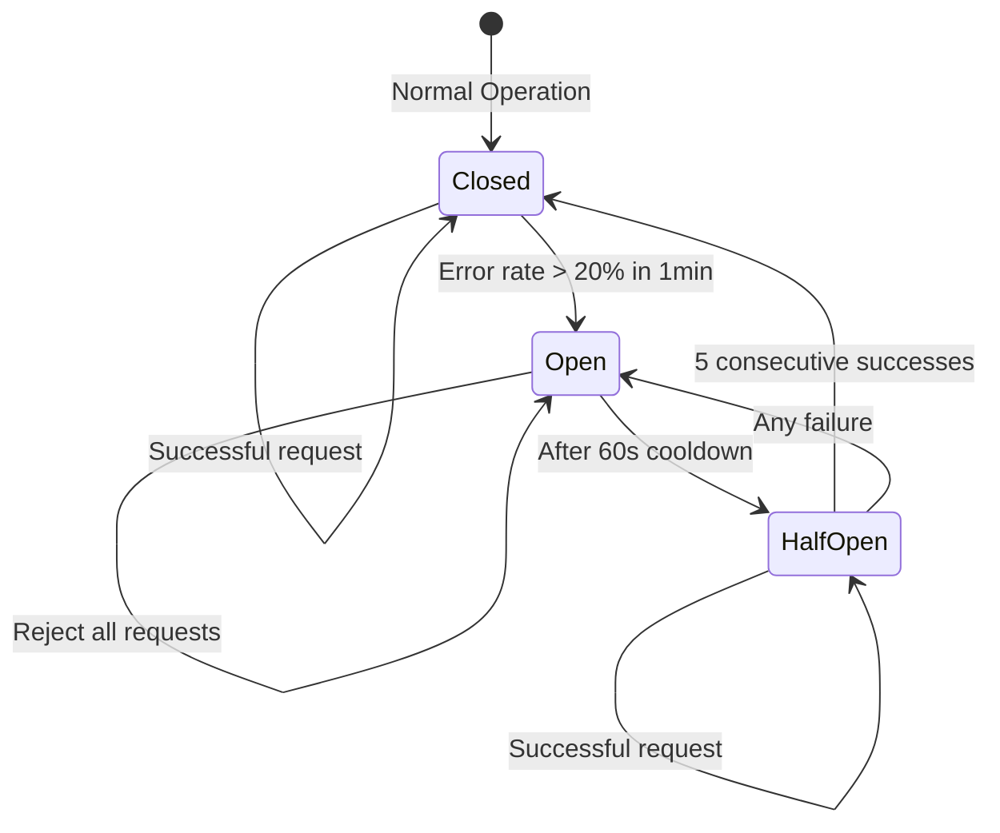

**Circuit Breaker Configuration:**

| Parameter | Value | Description |
|-----------|-------|-------------|
| Error Threshold | 20% | Percentage of failed requests to trigger |
| Time Window | 60 seconds | Period to measure error rate |
| Open Duration | 60 seconds | How long to reject requests |
| Half-Open Test Count | 5 | Successful requests to close circuit |
| Excluded Errors | 4xx client errors | Don't count as failures |

## 6. Risk Management System

### 6.1 Pre-Trade Risk Controls

#### 6.1.1 Capital and Position Checks

**Validation Rules:**

| Risk Control | Rule | Configuration | Calculation Method | Breach Action |
|--------------|------|---------------|-------------------|---------------|
| Available Balance | order_value <= available_balance * utilization_ratio | Max utilization: 80% | order_value = quantity * price | Reject order |
| Single Position Limit | position_value <= total_portfolio * concentration_limit | Max per symbol: 20% | position_value = abs(quantity * current_price) | Reject order |
| Sector Concentration | sum(correlated_positions) <= total_portfolio * sector_limit | Max per sector: 40% | Group by correlation > 0.7 | Reject order |
| Total Leverage | total_exposure / equity | Max leverage: 3x | exposure = sum(abs(position_values)) | Reject order, force close |
| Daily Loss Limit | daily_pnl >= -1 * daily_loss_threshold | Threshold: 5% of equity | Sum of all realized + unrealized PnL today | Stop all trading |
| Order Size Limit | single_order <= max_order_size | Configurable per symbol | Direct order quantity check | Reject order |
| Maximum Position Count | open_positions < max_positions | Default: 20 positions | Count distinct symbols | Reject new symbols |
| Margin Requirement | available_margin >= required_margin * 1.2 | 120% buffer | OKX margin calculation | Reject order |

#### 6.1.2 Risk Check Implementation Flow

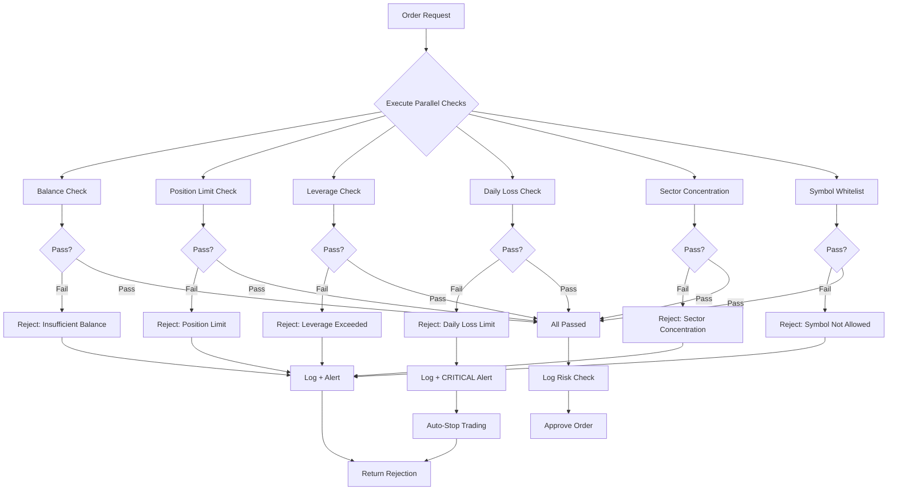

#### 6.1.3 Trading Permission Matrix

**Permission Validation Rules:**

| Permission Type | Validation Rule | Data Source | Cache TTL | Failure Mode |
|----------------|----------------|-------------|-----------|-------------|
| Symbol Whitelist | Symbol exists in approved_symbols table | PostgreSQL | 5 minutes | Reject (fail-closed) |
| Trading Hours | current_time within exchange_hours AND not_maintenance | System clock + API status | Real-time | Reject |
| Maintenance Mode | system_status != 'maintenance' | Redis flag | Real-time | Reject all |
| Strategy Status | strategy.status == 'active' | Redis + PostgreSQL | 10 seconds | Reject |
| API Rate Limit | request_count < rate_limit_threshold | Redis counter | 1 second | Queue or reject |
| User Permission | user.role allows action | PostgreSQL | 1 minute | Reject |
| Circuit Breaker | circuit_state != 'open' | In-memory | Real-time | Reject |
| VaR Limit | projected_var <= var_limit | Calculated | 5 minutes | Reject |

#### 6.1.4 Pre-Trade Risk Configuration

**Risk Limits by Account Tier:**

| Limit Type | Tier 1 (Learning) | Tier 2 (Standard) | Tier 3 (Professional) | Tier 4 (Institutional) |
|------------|------------------|-------------------|----------------------|------------------------|
| Max Capital | $10,000 | $100,000 | $1,000,000 | Unlimited |
| Max Leverage | 2x | 3x | 5x | 10x |
| Max Position Size | 10% | 20% | 30% | 50% |
| Daily Loss Limit | 3% | 5% | 7% | 10% |
| Max Open Positions | 5 | 20 | 50 | 200 |
| Allowed Strategies | Basic only | All | All | All + Custom |
| API Rate Limit | 10 req/s | 30 req/s | 60 req/s | 120 req/s |

### 6.2 Real-Time Monitoring and Alerts

#### 6.2.1 Monitoring Pipeline

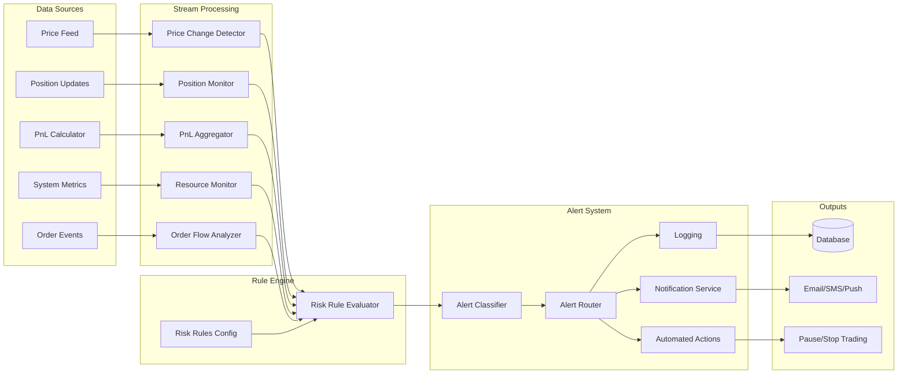

#### 6.2.2 Real-Time Risk Metrics

**Continuously Monitored Metrics:**

| Metric | Calculation | Update Frequency | Warning Threshold | Critical Threshold |
|--------|-------------|------------------|-------------------|--------------------|
| Portfolio Delta | sum(position_qty * current_price) | Real-time (per tick) | N/A | N/A |
| Unrealized PnL | sum((current_price - avg_entry) * qty) | Real-time | -3% of equity | -5% of equity |
| Realized PnL (Daily) | sum(closed_position_pnl) since midnight | Per trade | -2% of equity | -5% of equity |
| Current Leverage | total_exposure / equity | Per position change | 2.5x | 3.0x |
| Largest Position | max(position_value) / portfolio_value | Per position change | 18% | 20% |
| Margin Utilization | used_margin / available_margin | Real-time | 80% | 90% |
| Strategy Deviation | abs(live_sharpe - backtest_sharpe) / backtest_sharpe | Hourly | 30% | 50% |
| Correlation Change | current_correlation vs historical | Every 15 min | 0.3 increase | 0.5 increase |
| Drawdown | (peak_equity - current_equity) / peak_equity | Per trade | 15% | 25% |
| Trade Velocity | trades_per_hour | Per hour | Strategy dependent | 2x expected |

#### 6.2.3 Alert Classification and Routing

**Alert Levels:**

| Level | Trigger Condition | Examples | Notification Channels | Auto Actions |
|-------|------------------|----------|----------------------|-------------|
| INFO | Minor deviation (85-90% of limit) | Approaching position limit | Log only, Dashboard | None |
| WARNING | Significant deviation (90-95%) | Position at 92% of limit, PnL at -2.5% | Email, UI notification | None |
| CRITICAL | Limit breached (95-100%) | Daily loss at -5.1%, Leverage at 3.1x | SMS, Email, Desktop alert, Phone | Pause affected strategy |
| EMERGENCY | Severe breach (>100%) | Daily loss > -7%, System failure | Phone call, All channels, On-call | Stop all trading, liquidate if necessary |

**Alert Routing Configuration:**

| Alert Type | INFO | WARNING | CRITICAL | EMERGENCY |
|------------|------|---------|----------|----------|
| Balance Insufficient | Log | Email | SMS + Email | Phone + All |
| Position Limit | Dashboard | Email | SMS + Pause | Phone + Stop |
| Leverage Exceeded | Dashboard | Email + Dashboard | SMS + Reduce | Phone + Force Close |
| Daily Loss Limit | Log | Email | SMS + Pause | Phone + Stop All |
| System Error | Log | Email | SMS + Alert DevOps | Phone + Failover |
| Market Anomaly | Dashboard | Email | SMS | SMS |
| Strategy Deviation | Log | Email | Email + Review | SMS + Pause |
| API Failure | Log | Dashboard | SMS + Retry | Phone + Backup |

#### 6.2.4 Anomaly Detection

**Statistical Anomaly Detection:**

| Anomaly Type | Detection Method | Window Size | Threshold | Response |
|--------------|------------------|-------------|-----------|----------|
| Price Spike | Z-score > 3 on 1-min returns | 20 minutes | 3 sigma | Pause trading for 30s |
| Volume Surge | Current volume > 5x average | 1 hour | 5x | Reduce position sizes |
| Spread Widening | Current spread > 3x normal | 5 minutes | 3x | Switch to limit orders |
| Execution Slippage | Slippage > mean + 2*std | 100 trades | 2 sigma | Review execution algo |
| Strategy PnL Drift | Rolling Sharpe < backtest - 1 | 30 days | 1.0 difference | Strategy review |
| Order Reject Rate | Rejects > 5% of submissions | 1 hour | 5% | Check risk rules |
| Latency Increase | p95 latency > 2x baseline | 10 minutes | 2x | Network investigation |

### 6.3 Post-Trade Risk Analysis

#### 6.3.1 Value at Risk (VaR) Calculation

**VaR Methodologies:**

| Method | Calculation Approach | Data Requirements | Computation Time | Accuracy |
|--------|---------------------|-------------------|------------------|----------|
| Historical Simulation | Sort historical returns, take percentile | 252 days of returns | Fast (seconds) | Medium |
| Variance-Covariance | Assume normal distribution, use std dev | Mean and covariance matrix | Very fast (milliseconds) | Low (normal assumption) |
| Monte Carlo | Simulate 10,000 random paths | Return distribution parameters | Moderate (1-2 minutes) | High |
| EWMA (Exponentially Weighted) | Weight recent data more heavily | Time series of returns | Fast (seconds) | Medium-High |

**VaR Configuration:**

| Parameter | 1-Day VaR (95%) | 1-Day VaR (99%) | 1-Week VaR (95%) | 1-Week VaR (99%) |
|-----------|-----------------|-----------------|------------------|------------------|
| Confidence Level | 95% | 99% | 95% | 99% |
| Time Horizon | 1 day | 1 day | 7 days | 7 days |
| Historical Window | 252 days | 252 days | 252 days | 252 days |
| Portfolio Value | Current equity | Current equity | Current equity | Current equity |
| Target VaR Limit | < 5% of equity | < 8% of equity | < 12% of equity | < 18% of equity |
| Action if Exceeded | Alert WARNING | Alert CRITICAL | Strategy review | Reduce positions |

**VaR Backtesting:**

| Metric | Expected | Tolerance | Action if Breach |
|--------|----------|-----------|------------------|
| 95% VaR Breach Rate | 5% of days | 3% - 7% | Recalibrate model |
| 99% VaR Breach Rate | 1% of days | 0% - 2% | Recalibrate model |
| Largest Breach | < 2x VaR | < 3x VaR | Review model assumptions |
| Consecutive Breaches | Rare | < 3 days | Increase VaR buffer |

#### 6.3.2 Stress Testing

**Stress Scenarios:**

| Scenario Name | Market Condition | Historical Reference | Simulated Change | Expected Max Loss | Portfolio Action |
|---------------|------------------|---------------------|------------------|-------------------|------------------|
| Flash Crash | 20% drop in 5 minutes | May 2021 crypto crash | BTC -20%, alts -30% | < 10% of portfolio | Stop losses trigger |
| Extended Bear Market | 50% decline over 3 months | 2022 crypto winter | BTC -50%, alts -70% | < 30% of portfolio | Strategy adapts to bear |
| Low Liquidity | Order book depth < 50% normal | Weekend low volume | Spread widens 5x | Execution issues | Reduce sizes |
| Exchange Outage | OKX unavailable 10 minutes | Historical outages | No trading possible | Positions at risk | Hold, monitor |
| Funding Rate Spike | Funding rate > 0.1% (8h) | High leverage periods | Cost increase | 2% weekly cost | Reduce leverage |
| Correlation Breakdown | Uncorrelated assets move together | Market panic | All positions -15% | 15% loss | Diversification fails |
| Black Swan | Extreme 5-sigma event | March 2020 COVID | BTC -50% in 1 day | 25-40% portfolio | Emergency liquidation |

**Stress Test Execution:**

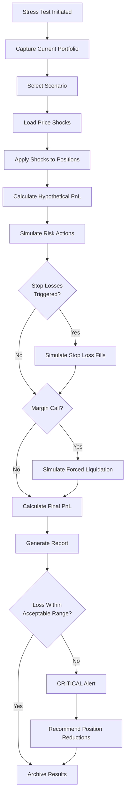

#### 6.3.3 Performance Attribution

**Attribution Framework:**

| Factor | Calculation | Data Source | Update Frequency | Purpose |
|--------|-------------|-------------|------------------|----------|
| Market Return (Beta) | portfolio_beta * market_return | Historical correlation | Daily | Systematic risk |
| Strategy Alpha | total_return - (beta * market_return) - sector_returns | Trade data | Daily | True skill |
| Sector Exposure | weighted_sum(sector_returns * sector_weights) | Position data | Daily | Industry concentration |
| Execution Cost | sum(actual_fill_price - signal_price) * quantity | Order data | Per trade | Slippage impact |
| Trading Costs | sum(commissions + funding_fees) | Order data | Daily | Cost efficiency |
| Timing Effect | sum((entry_time_return - signal_time_return) * quantity) | Trade timestamps | Per trade | Latency impact |
| Size Effect | correlation(order_size, slippage) | Order data | Weekly | Market impact |

**Attribution Report Structure:**

| Component | Example Value | % of Total Return | Interpretation |
|-----------|---------------|-------------------|----------------|
| Total Return | +12.5% | 100% | Overall performance |
| Market Beta | +5.0% | 40% | Captured market movement |
| Sector Allocation | +2.0% | 16% | Benefited from sector selection |
| Strategy Alpha | +6.5% | 52% | True strategy skill |
| Execution Cost | -0.8% | -6% | Lost to slippage |
| Trading Fees | -0.2% | -2% | Commission costs |
| **Net Excess Return** | **+8.5%** | **68%** | **Above market performance** |

### 6.4 Circuit Breaker Mechanisms

#### 6.4.1 Automatic Trading Halt Conditions

**Halt Triggers:**

| Condition | Threshold | Scope | Action | Resume Condition | Auto-Resume |
|-----------|-----------|-------|--------|------------------|-------------|
| Daily Loss Limit | Portfolio loss > 5% | All strategies | Stop all trading | Manual review + approval | No |
| Single Strategy Anomaly | Strategy PnL deviation > 3 sigma | Specific strategy | Pause strategy | Parameter review | No |
| System Error Rate | Error rate > 5% in 5 min | System-wide | Halt trading | Error rate < 1% for 10 min | Yes |
| Market Volatility | BTC 1h volatility > 10% | All strategies | Reduce to 50% size | Volatility < 6% for 1h | Yes |
| Rapid Drawdown | 10% loss in 30 minutes | All strategies | Emergency stop | Manual intervention | No |
| API Failure | 3 consecutive failures | System-wide | Halt + failover | Connection restored | Yes |
| Margin Call | Margin ratio < 110% | All positions | Close positions | Margin > 130% | Auto |
| Liquidity Drought | Order book depth < 30% avg | Affected symbols | Pause symbol trading | Liquidity restored | Yes |

#### 6.4.2 Circuit Breaker State Machine

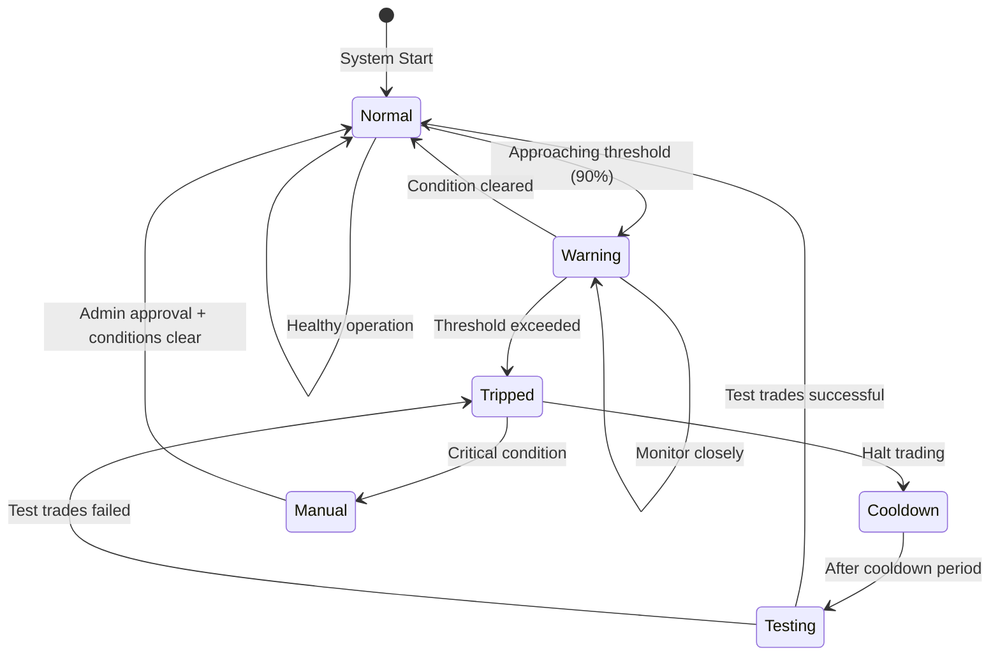

**Cooldown Periods:**

| Trigger Type | Cooldown Duration | Test Trades | Success Criteria |
|--------------|------------------|-------------|------------------|
| System Error | 10 minutes | 5 small orders | 100% success rate |
| Market Volatility | 60 minutes | 10 small orders | >= 80% success, no anomalies |
| Daily Loss | Until next day | Manual test | Risk manager approval |
| API Failure | 5 minutes | 3 test requests | All successful |
| Liquidity Drought | 30 minutes | N/A (passive check) | Order book depth > 50% avg |

#### 6.4.3 Emergency Protocols

**Emergency Response Ladder:**

| Severity | Trigger | Immediate Action | Notification | Follow-up |
|----------|---------|------------------|--------------|----------|
| Level 1 - Caution | Warning threshold | Log + Dashboard alert | Email to traders | Monitor |
| Level 2 - Alert | Critical threshold | Pause affected strategies | SMS to traders + manager | Investigation |
| Level 3 - Emergency | Multiple breaches | Stop all trading | Phone to all + escalation | Emergency meeting |
| Level 4 - Crisis | Systemic failure | Emergency liquidation | Phone + on-call CEO | Crisis management |

**Emergency Liquidation Procedure:**

```mermaid
flowchart TB
    Emergency[Emergency Triggered] --> Assess[Assess Portfolio Risk]
    Assess --> Priority[Prioritize Positions]
    
    Priority --> Risky[Identify Riskiest Positions]
    Risky --> Close1[Close Top 20% Riskiest]
    Close1 --> CheckMargin{Margin Safe?}
    
    CheckMargin -->|Yes| Monitor[Monitor Remaining]
    CheckMargin -->|No| Close2[Close Next 30%]
    
    Close2 --> Recheck{Margin Safe?}
    Recheck -->|No| CloseAll[Close All Positions]
    Recheck -->|Yes| Monitor
    
    CloseAll --> CashMode[Move to 100% Cash]
    Monitor --> Stabilize[Stabilize Portfolio]
    CashMode --> PostMortem[Post-Mortem Analysis]
    Stabilize --> PostMortem
```

**Position Closure Priority:**

| Priority | Criteria | Rationale |
|----------|----------|----------|
| 1. Highest Risk | Highest leverage + lowest liquidity | Most dangerous |
| 2. Underwater Positions | Largest unrealized losses | Stop bleeding |
| 3. Concentrated Bets | Largest position sizes | Reduce exposure |
| 4. Low Conviction | Recently entered positions | Preserve capital |
| 5. Profitable Positions | Take profits | Secure gains |

### 6.2 Real-Time Monitoring and Alerts

```mermaid
flowchart LR
    subgraph "Data Collection"
        Price[Price Feed]
        Position[Position Data]
        PnL[PnL Calculator]
        System[System Metrics]
    end
    
    subgraph "Rule Engine"
        Rules[Risk Rules]
        Threshold[Threshold Checker]
    end
    
    subgraph "Alert System"
        Classify[Alert Classification]
        Route[Alert Router]
    end
    
    subgraph "Actions"
        Log[Logging]
        Notify[Notification]
        AutoStop[Auto Stop Strategy]
        Emergency[Emergency Shutdown]
    end
    
    Price --> Threshold
    Position --> Threshold
    PnL --> Threshold
    System --> Threshold
    
    Rules --> Threshold
    Threshold --> Classify
    
    Classify -->|INFO| Log
    Classify -->|WARNING| Notify
    Classify -->|CRITICAL| AutoStop
    Classify -->|EMERGENCY| Emergency
```

**Alert Classification:**

| Level | Trigger Condition | Notification Channel | Auto Action |
|-------|------------------|---------------------|-------------|
| INFO | Minor deviation (e.g., 90% of limit) | Log only | None |
| WARNING | Approaching limit (e.g., 95% of limit) | Email, UI notification | None |
| CRITICAL | Limit breached | SMS, Email, Desktop alert | Pause affected strategy |
| EMERGENCY | Severe breach (e.g., 20% daily loss) | Phone call, All channels | Stop all trading, liquidate positions |

### 6.3 Post-Trade Risk Analysis

**Value at Risk (VaR) Calculation:**

| Method | Description | Confidence Level | Horizon |
|--------|-------------|------------------|---------|
| Historical Simulation | Based on last 252 trading days | 95%, 99% | 1 day, 1 week |
| Variance-Covariance | Parametric method assuming normal distribution | 95%, 99% | 1 day |
| Monte Carlo | 10,000 simulated paths | 95%, 99% | 1 day, 1 week |

**Stress Testing Scenarios:**

| Scenario | Market Condition | Expected Behavior |
|----------|-----------------|-------------------|
| Flash Crash | 20% price drop in 5 minutes | Stop loss triggers, max loss < 10% |
| Low Liquidity | Order book depth < 50% of normal | Execution algorithms pause, no new orders |
| Exchange Outage | OKX API unavailable for 10 minutes | Failover to backup, positions held safely |
| Black Swan | 50% market crash similar to March 2020 | Emergency liquidation, capital preservation |

**Performance Attribution:**

| Factor | Calculation Method | Purpose |
|--------|-------------------|---------|
| Market Return | Portfolio beta * market return | Systematic risk contribution |
| Strategy Alpha | Total return - market return - sector return | True strategy skill |
| Sector Exposure | Weighted sector returns | Industry concentration risk |
| Execution Cost | Actual price - signal price | Slippage and timing impact |
| Trading Costs | Sum of commissions and fees | Cost efficiency analysis |

### 6.4 Circuit Breaker Mechanisms

**Automatic Trading Halt Conditions:**

| Condition | Threshold | Action | Resume Condition |
|-----------|-----------|--------|------------------|
| Daily Loss Limit | Portfolio loss > 5% | Stop all strategies | Manual review and approval |
| Strategy Anomaly | Strategy PnL deviation > 3 sigma from backtest | Pause specific strategy | Parameter review |
| System Error Rate | Error rate > 5% in 5 minutes | Halt trading | Error rate < 1% for 10 minutes |
| Market Volatility | Bitcoin volatility > 10% in 1 hour | Reduce position sizes to 50% | Volatility normalizes |
| Rapid Drawdown | 10% loss in 30 minutes | Emergency stop | Manual intervention required |

## 7. System Monitoring and Operations

### 7.1 Real-Time Dashboard Metrics

**System Health Metrics:**

| Category | Metric | Update Frequency | Alert Threshold |
|----------|--------|------------------|-----------------|
| Infrastructure | CPU utilization | 10 seconds | > 80% |
| Infrastructure | Memory usage | 10 seconds | > 85% |
| Infrastructure | Disk I/O wait | 10 seconds | > 50% |
| Infrastructure | Network bandwidth | 10 seconds | > 70% capacity |
| Data Pipeline | Market data latency | Real-time | > 500ms |
| Data Pipeline | Data gap detection | 1 minute | Any missing data |
| Trading | Order success rate | 1 minute | < 95% |
| Trading | Average execution latency | 1 minute | > 100ms (p95) |
| Trading | Active strategy count | Real-time | Monitoring only |
| Risk | Current VaR | 5 minutes | > 8% of portfolio |
| Risk | Total exposure | Real-time | > 250% of equity |

**Strategy Performance Metrics:**

| Metric | Calculation | Display Format |
|--------|-------------|----------------|
| Real-time PnL | Current value - initial value - costs | Absolute value + percentage |
| Sharpe Ratio (rolling 30d) | (Return - risk_free_rate) / std_dev | Numeric with trend line |
| Current Drawdown | Current value - recent peak | Percentage with visual indicator |
| Win Rate (last 100 trades) | Winning trades / total trades | Percentage |
| Daily Trade Count | Count of completed trades today | Integer |
| Position Utilization | Used capital / available capital | Percentage gauge |

### 7.2 Logging Strategy

**Log Levels and Retention:**

| Level | Use Case | Retention Period | Storage Location |
|-------|----------|------------------|------------------|
| DEBUG | Development troubleshooting | 7 days | Local files (rotated) |
| INFO | Normal operations, trade confirmations | 90 days | ELK Stack |
| WARNING | Recoverable errors, retry attempts | 180 days | ELK Stack + alerts |
| ERROR | Failed operations, exceptions | 1 year | ELK Stack + persistent DB |
| CRITICAL | System failures, security incidents | Perpetual | Persistent DB + backup |

**Structured Log Format:**

| Field | Type | Description | Example |
|-------|------|-------------|---------|
| timestamp | ISO 8601 | Event time with milliseconds | 2024-01-15T10:30:45.123Z |
| level | String | Log level | ERROR |
| module | String | Source module | trading_engine::executor |
| trace_id | UUID | Request correlation ID | 550e8400-e29b-41d4-a716-446655440000 |
| message | String | Human-readable message | Order submission failed |
| context | JSON Object | Structured metadata | {"order_id": "abc123", "symbol": "BTC-USDT"} |

### 7.3 Alert Configuration

**Alert Deduplication and Throttling:**

| Rule | Configuration | Purpose |
|------|--------------|---------|
| Deduplication Window | 5 minutes | Prevent alert spam for same issue |
| Rate Limiting | Max 10 alerts per minute per channel | Avoid notification overload |
| Alert Grouping | Group by module and error type | Batch related alerts |
| Escalation | If unacknowledged after 15 minutes, escalate to higher tier | Ensure response |

**Notification Channels:**

| Channel | Priority | Use Case | Response Time SLA |
|---------|----------|----------|-------------------|
| Desktop Push | INFO, WARNING | Non-urgent notifications | No SLA |
| Email | WARNING | Standard operational alerts | 30 minutes |
| SMS | CRITICAL | Urgent issues requiring attention | 10 minutes |
| Phone Call | EMERGENCY | System-wide failures | 5 minutes |
| Webhook | All | Integration with external systems | Real-time |

### 7.4 Continuous Optimization Framework

```mermaid
flowchart TB
    Monitor[Monitoring System] --> Collect[Collect Performance Data]
    Collect --> Analyze[Analyze Metrics]
    
    Analyze --> ParamDrift{Parameter Drift<br/>Detected?}
    ParamDrift -->|Yes| Reoptimize[Re-optimize Parameters]
    ParamDrift -->|No| ABTest{A/B Test<br/>Available?}
    
    Reoptimize --> Backtest[Backtest New Parameters]
    Backtest --> Validate{Validation<br/>Passed?}
    Validate -->|Yes| PaperTrade[Paper Trade 7 Days]
    Validate -->|No| Archive[Archive Results]
    
    ABTest -->|Yes| RunAB[Run A/B Test]
    ABTest -->|No| Monitor
    
    RunAB --> Compare[Compare Results]
    Compare --> Winner{Winner<br/>Identified?}
    Winner -->|Yes| Promote[Promote to Production]
    Winner -->|No| Monitor
    
    PaperTrade --> Performance{Performance<br/>Acceptable?}
    Performance -->|Yes| Deploy[Deploy to Production]
    Performance -->|No| Reject[Reject Changes]
    
    Deploy --> Monitor
    Promote --> Monitor
    Archive --> Monitor
    Reject --> Monitor
```

**Optimization Schedule:**

| Task | Frequency | Automation Level | Owner |
|------|-----------|------------------|-------|
| Parameter Auto-tuning | Weekly | Automated with manual approval | System |
| Strategy A/B Testing | Continuous (new variants) | Automated | Strategy team |
| Performance Review | Daily | Automated report | Trading team |
| Full System Stress Test | Weekly (Sunday) | Automated | DevOps team |
| Disaster Recovery Drill | Monthly | Manual | DevOps team |
| Security Audit | Quarterly | Manual | Security team |

## 8. Security and Compliance

### 8.1 Data Security Measures

**Encryption Standards:**

| Data Type | At-Rest Encryption | In-Transit Encryption | Key Management |
|-----------|-------------------|---------------------|----------------|
| Database | AES-256 | TLS 1.3 | PostgreSQL key rotation (90 days) |
| API Keys | AES-256 with HSM | N/A (stored only) | Hardware Security Module |
| User Passwords | Argon2id | TLS 1.3 | Per-user salt |
| Session Tokens | ChaCha20-Poly1305 | TLS 1.3 | Redis with 1-hour expiry |
| Market Data | None (public data) | TLS 1.3 | N/A |
| Trade Logs | AES-256 | TLS 1.3 | Annual key rotation |

**Access Control Model:**

| Role | Permissions | Scope |
|------|------------|-------|
| Super Admin | Full system access, configuration changes | Global |
| Strategy Manager | Deploy/pause strategies, view all data | All strategies |
| Trader | Monitor positions, manual override | Assigned strategies only |
| Analyst | Read-only access to historical data | Data layer only |
| Auditor | Read-only access to all logs and trades | System-wide (no control) |

### 8.2 API Security

**OKX API Key Management:**

| Security Measure | Implementation | Rationale |
|-----------------|----------------|-----------|
| Key Storage | Encrypted in database, decrypted only in memory | Prevent key leakage |
| IP Whitelist | Only application server IPs allowed | Network-level protection |
| API Key Rotation | Manual rotation every 90 days | Limit exposure window |
| Permission Scope | Read + Trade only, no withdrawals | Minimize attack surface |
| Rate Limiting | Respect OKX limits with 80% buffer | Avoid account suspension |
| Request Signing | HMAC-SHA256 with timestamp | Prevent replay attacks |

**Authentication Flow:**

```mermaid
sequenceDiagram
    participant User
    participant Frontend
    participant AuthService
    participant Database
    participant Trading
    
    User->>Frontend: Login (username + password + 2FA)
    Frontend->>AuthService: Submit credentials
    AuthService->>Database: Verify credentials
    Database-->>AuthService: User record
    AuthService->>AuthService: Validate 2FA token
    
    alt Authentication successful
        AuthService->>AuthService: Generate JWT token
        AuthService->>Database: Store session
        AuthService-->>Frontend: Return JWT
        Frontend->>Frontend: Store token securely
        Frontend->>Trading: Request with JWT
        Trading->>AuthService: Validate JWT
        AuthService-->>Trading: Token valid
        Trading-->>Frontend: Protected resource
    else Authentication failed
        AuthService-->>Frontend: Error (with rate limit)
    end
```

### 8.3 Regulatory Compliance

**Data Privacy Requirements:**

| Requirement | Implementation | Standard |
|-------------|----------------|----------|
| Personal Data Encryption | All PII encrypted at rest | GDPR Article 32 |
| Data Minimization | Collect only necessary trading data | GDPR Article 5(1)(c) |
| Right to Erasure | User data deletion within 30 days of request | GDPR Article 17 |
| Data Portability | Export user data in JSON format | GDPR Article 20 |
| Audit Trail | Immutable log of all data access | SOC 2 Type II |
| Data Residency | All data stored within compliant jurisdictions | Local regulations |

**Trading Compliance:**

| Area | Rule | Enforcement |
|------|------|-------------|
| Strategy Disclosure | Historical performance labeled as past results | UI disclaimer |
| Risk Warnings | Display risk warnings before strategy activation | Mandatory acknowledgment |
| Leverage Limits | Enforce maximum leverage based on user tier | System-level caps |
| Wash Trading Prevention | Detect and block self-trading patterns | Automated detection |
| Market Manipulation | Monitor for pump-and-dump patterns | Alert and investigation |

### 8.4 Audit and Compliance Monitoring

**Audit Log Requirements:**

| Event Type | Logged Information | Retention |
|------------|-------------------|-----------|
| User Authentication | Username, IP, timestamp, success/failure | 1 year |
| Configuration Changes | User, old value, new value, timestamp | Perpetual |
| Strategy Deployment | Strategy ID, version, deployer, timestamp | Perpetual |
| Trade Execution | Full order details, market conditions | 7 years |
| Risk Override | User, reason, affected trade, approval chain | Perpetual |
| System Errors | Stack trace, context, recovery actions | 1 year |

## 9. Deployment and Operational Roadmap

### 9.1 Implementation Phases

**Phase 1: Foundation (Months 1-3)**

| Milestone | Deliverables | Acceptance Criteria |
|-----------|-------------|---------------------|
| Infrastructure Setup | PostgreSQL, TimescaleDB, Redis deployed | Load test: 10K writes/sec |
| OKX Integration | WebSocket market data, REST API client | < 50ms latency (p95) |
| Basic Data Pipeline | Real-time data ingestion and storage | Zero data loss for 24h continuous run |
| Core Trading Engine | Order submission and status tracking | 99.9% success rate |
| User Authentication | Login, session management, RBAC | Pass security penetration test |

**Phase 2: Strategy & Backtesting (Months 4-6)**

| Milestone | Deliverables | Acceptance Criteria |
|-----------|-------------|---------------------|
| Backtest Engine | Historical simulation with realistic costs | Match manual calculations |
| Strategy Framework | Plugin architecture for custom strategies | Load 3 example strategies |
| Risk Management | Pre-trade checks and position limits | Block all violations |
| Performance Analytics | Sharpe, drawdown, win rate calculations | Validated against industry tools |
| Paper Trading | Simulation mode without real orders | Run 30 days without errors |

**Phase 3: Production Readiness (Months 7-9)**

| Milestone | Deliverables | Acceptance Criteria |
|-----------|-------------|---------------------|
| Monitoring Dashboard | Real-time metrics and alerts | < 1s dashboard refresh |
| Alert System | Multi-channel notifications | Alert delivery < 10s |
| Failover Mechanism | Automatic failover to backup node | < 5s recovery time |
| Live Trading (Small Capital) | Real money trading with $1,000 | Zero critical incidents for 30 days |
| Documentation | User manual, API docs, runbooks | Complete coverage |

**Phase 4: Optimization & Scale (Months 10-12)**

| Milestone | Deliverables | Acceptance Criteria |
|-----------|-------------|---------------------|
| Performance Tuning | Latency optimization | < 30ms signal-to-market (p95) |
| Advanced Execution | TWAP, VWAP algorithms | Beat simple market orders by 0.1% |
| Strategy Optimization | Auto-tuning and A/B testing framework | 10% Sharpe improvement |
| Multi-Strategy Support | Run 5+ strategies concurrently | No resource contention |
| Production Scale | Handle $100,000+ portfolio | All metrics within SLA |

### 9.2 Testing Strategy

#### 9.2.1 Unit Testing Requirements

**Rust Unit Testing Standards:**

| Component | Coverage Target | Test Categories | Tooling |
|-----------|----------------|-----------------|----------|
| Core Domain Models | 95% | Structure, validation, serialization | cargo test |
| Data Parser | 90% | Valid/invalid inputs, edge cases | cargo test + proptest |
| Risk Validator | 95% | All rules, boundary conditions | cargo test |
| Order Manager | 90% | State transitions, error cases | cargo test + mockito |
| Strategy Logic | 80% | Signal generation, parameters | cargo test |
| API Client | 85% | Request/response, errors | cargo test + wiremock |
| Indicators | 90% | Mathematical correctness | cargo test + approx |

**Test Case Categories:**

| Category | Description | Example Test Cases | Priority |
|----------|-------------|-------------------|----------|
| Positive Tests | Normal operation with valid inputs | Valid order creation, successful parsing | HIGH |
| Negative Tests | Invalid inputs and error conditions | Invalid JSON, missing fields, out-of-range | HIGH |
| Edge Cases | Boundary values and corner cases | Zero quantity, max integer, empty data | HIGH |
| Concurrent Tests | Multi-threaded scenarios | Race conditions, deadlocks | MEDIUM |
| Mock Tests | External API failures and timeouts | Network errors, API downtime | HIGH |
| Property-Based | Random input generation (proptest) | Fuzz testing parsers, validators | MEDIUM |
| Benchmark Tests | Performance regression detection | Latency benchmarks for hot paths | MEDIUM |

**Unit Test Structure Pattern:**

```
Each test module should follow this structure:

1. Module declaration with cfg(test) attribute
2. Test fixtures and helper functions
3. Positive test cases
4. Negative test cases
5. Edge case tests
6. Mock/integration tests

Naming convention:
- test_function_name_when_condition_should_expected_result
- test_validate_order_when_insufficient_balance_should_reject

Assertion patterns:
- Use assert_eq! for exact matches
- Use assert! for boolean conditions
- Use assert_matches! for pattern matching
- Use approx::assert_relative_eq! for floating-point
```

**Mock and Stub Strategy:**

| External Dependency | Mocking Tool | Mock Strategy |
|--------------------|--------------|---------------|
| OKX REST API | wiremock | HTTP mock server with recorded responses |
| OKX WebSocket | Manual mock | Fake WebSocket sender with test messages |
| PostgreSQL | sqlx with in-memory DB | Real database with test schema |
| Redis | redis-test | Embedded Redis instance |
| System Time | mock_instant | Controllable clock for time-dependent tests |

#### 9.2.2 Integration Testing

**Integration Test Scenarios:**

| Test Scenario | Scope | Environment | Success Criteria | Duration |
|--------------|-------|-------------|------------------|----------|
| End-to-End Order Flow | Full order lifecycle | Testnet | Order placed → filled < 5s | 30s |
| Data Pipeline | Market data → storage | Staging | 1M ticks processed, zero loss | 5 min |
| Strategy Deployment | Deploy → activate → trade | Staging | Strategy executes first trade | 2 min |
| Failover Mechanism | Primary down → backup up | Staging | Backup active < 5s | 1 min |
| Load Test | Sustained high throughput | Staging | 100 orders/s for 1 hour | 1 hour |
| Disaster Recovery | DB restore from backup | Production-like | Full recovery < 1 hour | 2 hours |
| WebSocket Reconnection | Disconnect → reconnect | Staging | Auto-reconnect + resync | 2 min |
| Multi-Strategy | 5 strategies running concurrently | Staging | No interference, all active | 10 min |

**Integration Test Environment:**

| Component | Configuration | Data |
|-----------|--------------|-------|
| Database | PostgreSQL 15 + TimescaleDB | Anonymized prod data |
| OKX API | Testnet environment | Simulated trading |
| Cache | Redis 7 standalone | Fresh instance per test |
| Network | Isolated test network | Controlled latency |

#### 9.2.3 Example Test Cases

**Example 1: Order Validation Test**

```
Test Name: test_risk_validator_rejects_order_exceeding_position_limit

Setup:
- Create portfolio with 100,000 USD equity
- Set position limit to 20% (20,000 USD)
- Create existing BTC position worth 15,000 USD

Test Steps:
1. Create new BTC buy order for 6,000 USD
2. Call risk_validator.validate_order()
3. Assert result is Err(RiskViolation::PositionLimitExceeded)
4. Verify order was not submitted
5. Verify alert was logged

Expected Result:
- Validation returns error
- Error type is PositionLimitExceeded
- No order sent to exchange
- Alert logged with severity WARNING
```

**Example 2: Market Data Parsing Test**

```
Test Name: test_okx_ticker_parser_handles_all_fields

Setup:
- Load sample OKX ticker JSON message
- Create parser instance

Test Steps:
1. Parse valid ticker message
2. Assert all fields extracted correctly
3. Assert timestamp converted to correct timezone
4. Assert price parsed with correct precision (8 decimals)
5. Assert volume is non-negative

Expected Result:
- Parsing succeeds
- Symbol = "BTC-USDT"
- Price has 8 decimal precision
- Timestamp matches message timestamp
- All optional fields handled
```

**Example 3: TWAP Algorithm Test**

```
Test Name: test_twap_splits_order_into_correct_slices

Setup:
- Total quantity: 10 BTC
- Duration: 30 minutes
- Slice interval: 5 minutes
- Expected slices: 6

Test Steps:
1. Initialize TWAP algorithm with parameters
2. Run algorithm in simulation mode
3. Collect generated child orders
4. Assert slice count = 6
5. Assert sum of slice sizes = 10 BTC
6. Assert time intervals ≈ 5 minutes each
7. Assert randomization within ±10%

Expected Result:
- 6 child orders created
- Total quantity preserved
- Time distribution correct
- Each slice randomized independently
```

**Example 4: Concurrent Position Update Test**

```
Test Name: test_position_manager_handles_concurrent_updates

Setup:
- Create position manager
- Initialize 5 positions

Test Steps:
1. Spawn 10 concurrent tasks
2. Each task updates different positions randomly
3. Each task performs 100 updates
4. Wait for all tasks to complete
5. Verify final position state consistency
6. Assert no race conditions
7. Assert all updates applied

Expected Result:
- All 1000 updates succeed
- Position quantities are correct
- No data corruption
- No deadlocks
```

**Example 5: Backtest Accuracy Validation Test**

```
Test Name: test_backtest_pnl_matches_manual_calculation

Setup:
- Simple strategy: Buy at day 1, sell at day 5
- Known historical prices
- Fixed fees: 0.1%

Test Steps:
1. Run backtest with simple strategy
2. Manually calculate expected PnL:
   - Entry: 100 BTC @ 30,000 = 3,000,000
   - Fee: 3,000 (0.1%)
   - Exit: 100 BTC @ 32,000 = 3,200,000
   - Fee: 3,200 (0.1%)
   - Net PnL: 200,000 - 6,200 = 193,800
3. Compare backtest PnL to manual calculation
4. Assert difference < 0.01%

Expected Result:
- Backtest PnL = 193,800 (within rounding)
- All fees accounted
- No unexplained discrepancies
```

#### 9.2.4 Performance and Benchmark Testing

**Benchmark Suites:**

| Benchmark | Metric | Target | Tool |
|-----------|--------|--------|------|
| Market Data Parsing | Throughput (msg/s) | > 100,000 | Criterion |
| Indicator Calculation | Latency (μs) | < 100 | Criterion |
| Order Serialization | Latency (μs) | < 50 | Criterion |
| Risk Validation | Latency (μs) | < 5,000 | Criterion |
| Database Write | Throughput (writes/s) | > 10,000 | Criterion |
| End-to-End Latency | Latency (ms) | < 100 (p95) | Custom instrumentation |

**Benchmark Regression Detection:**

| Threshold | Action |
|-----------|--------|
| > 5% slower | Warning in CI |
| > 15% slower | Fail CI build |
| > 10% faster | Review for correctness (may indicate bug) |

**Load Testing Specifications:**

| Test Type | Configuration | Duration | Success Criteria |
|-----------|--------------|----------|------------------|
| Baseline Load | 10 orders/s | 1 hour | < 1% errors, latency < 200ms |
| Peak Load | 100 orders/s | 15 minutes | < 5% errors, latency < 500ms |
| Stress Test | Increasing until failure | Until crash | Identify breaking point |
| Soak Test | 50 orders/s | 24 hours | No memory leaks, stable performance |
| Spike Test | 0 → 200 → 0 orders/s | 30 minutes | System recovers, no crashes |

#### 9.2.5 Security Testing

**Security Test Categories:**

| Test Type | Tools | Focus Areas |
|-----------|-------|-------------|
| Static Analysis | cargo-audit, clippy | Dependency vulnerabilities, unsafe code |
| Fuzzing | cargo-fuzz | Parser robustness, panic handling |
| Penetration Testing | Manual + OWASP ZAP | API security, authentication |
| Secrets Scanning | truffleHog | Prevent credential leaks |
| SQL Injection | sqlmap | Database query safety |

**Security Checklist:**

| Item | Verification Method | Status |
|------|-------------------|--------|
| No hardcoded secrets | Code review + secrets scanner | Required |
| All inputs validated | Unit tests for validators | Required |
| SQL injection prevention | Parameterized queries only | Required |
| XSS prevention | CSP headers + input sanitization | Required |
| HTTPS enforcement | Configuration check | Required |
| API authentication | Integration tests | Required |
| Rate limiting | Load tests | Required |
| Audit logging | Log verification | Required |

### 9.3 Code Organization

#### 9.3.1 Rust Workspace Structure

**Project Directory Layout:**

```
ea_okx/
├── Cargo.toml                    # Workspace root
├── Cargo.lock
├── .cargo/
│   └── config.toml               # Build configuration
├── crates/
│   ├── core/                     # Core domain models
│   │   ├── Cargo.toml
│   │   └── src/
│   │       ├── lib.rs
│   │       ├── models/           # Domain entities
│   │       │   ├── mod.rs
│   │       │   ├── order.rs
│   │       │   ├── position.rs
│   │       │   ├── trade.rs
│   │       │   └── strategy.rs
│   │       ├── types/            # Common types
│   │       │   ├── mod.rs
│   │       │   ├── symbol.rs
│   │       │   ├── price.rs
│   │       │   └── decimal.rs
│   │       └── error.rs          # Error types
│   │
│   ├── data/                     # Data layer
│   │   ├── Cargo.toml
│   │   └── src/
│   │       ├── lib.rs
│   │       ├── collector/        # Data collection
│   │       │   ├── mod.rs
│   │       │   ├── websocket.rs
│   │       │   ├── rest.rs
│   │       │   └── reconciler.rs
│   │       ├── parser/           # Message parsing
│   │       │   ├── mod.rs
│   │       │   ├── okx.rs
│   │       │   └── normalizer.rs
│   │       ├── storage/          # Data persistence
│   │       │   ├── mod.rs
│   │       │   ├── timescale.rs
│   │       │   ├── postgres.rs
│   │       │   └── redis.rs
│   │       └── quality/          # Data quality
│   │           ├── mod.rs
│   │           ├── validator.rs
│   │           └── cleaner.rs
│   │
│   ├── strategy/                 # Strategy framework
│   │   ├── Cargo.toml
│   │   └── src/
│   │       ├── lib.rs
│   │       ├── traits/           # Strategy interface
│   │       │   ├── mod.rs
│   │       │   └── strategy.rs
│   │       ├── manager/          # Strategy lifecycle
│   │       │   ├── mod.rs
│   │       │   ├── registry.rs
│   │       │   └── deployer.rs
│   │       ├── indicators/       # Technical indicators
│   │       │   ├── mod.rs
│   │       │   ├── ma.rs
│   │       │   ├── rsi.rs
│   │       │   └── bollinger.rs
│   │       └── backtest/         # Backtesting
│   │           ├── mod.rs
│   │           ├── engine.rs
│   │           ├── simulator.rs
│   │           └── metrics.rs
│   │
│   ├── trading/                  # Trading execution
│   │   ├── Cargo.toml
│   │   └── src/
│   │       ├── lib.rs
│   │       ├── order/            # Order management
│   │       │   ├── mod.rs
│   │       │   ├── manager.rs
│   │       │   ├── executor.rs
│   │       │   └── tracker.rs
│   │       ├── execution/        # Execution algorithms
│   │       │   ├── mod.rs
│   │       │   ├── twap.rs
│   │       │   ├── vwap.rs
│   │       │   └── router.rs
│   │       ├── position/         # Position management
│   │       │   ├── mod.rs
│   │       │   ├── manager.rs
│   │       │   └── calculator.rs
│   │       └── portfolio/        # Portfolio management
│   │           ├── mod.rs
│   │           └── tracker.rs
│   │
│   ├── risk/                     # Risk management
│   │   ├── Cargo.toml
│   │   └── src/
│   │       ├── lib.rs
│   │       ├── validator/        # Pre-trade checks
│   │       │   ├── mod.rs
│   │       │   ├── rules.rs
│   │       │   └── checker.rs
│   │       ├── monitor/          # Real-time monitoring
│   │       │   ├── mod.rs
│   │       │   ├── metrics.rs
│   │       │   └── alerting.rs
│   │       ├── analysis/         # Post-trade analysis
│   │       │   ├── mod.rs
│   │       │   ├── var.rs
│   │       │   ├── stress_test.rs
│   │       │   └── attribution.rs
│   │       └── circuit_breaker/
│   │           ├── mod.rs
│   │           └── breaker.rs
│   │
│   ├── okx-client/               # OKX API client
│   │   ├── Cargo.toml
│   │   └── src/
│   │       ├── lib.rs
│   │       ├── rest/
│   │       │   ├── mod.rs
│   │       │   ├── client.rs
│   │       │   ├── auth.rs
│   │       │   └── endpoints.rs
│   │       ├── websocket/
│   │       │   ├── mod.rs
│   │       │   ├── client.rs
│   │       │   └── channels.rs
│   │       └── models/
│   │           ├── mod.rs
│   │           ├── market.rs
│   │           └── trading.rs
│   │
│   └── monitoring/               # Monitoring and observability
│       ├── Cargo.toml
│       └── src/
│           ├── lib.rs
│           ├── metrics/
│           │   ├── mod.rs
│           │   └── collector.rs
│           ├── logging/
│           │   ├── mod.rs
│           │   └── structured.rs
│           └── tracing/
│               ├── mod.rs
│               └── spans.rs
│
├── src/                          # Main application
│   ├── main.rs                   # Entry point
│   ├── config.rs                 # Configuration
│   ├── api/                      # REST API
│   │   ├── mod.rs
│   │   ├── routes/
│   │   │   ├── mod.rs
│   │   │   ├── strategies.rs
│   │   │   ├── orders.rs
│   │   │   ├── positions.rs
│   │   │   └── risk.rs
│   │   ├── handlers/
│   │   │   ├── mod.rs
│   │   │   └── websocket.rs
│   │   └── middleware/
│   │       ├── mod.rs
│   │       ├── auth.rs
│   │       └── rate_limit.rs
│   └── app.rs                    # Application setup
│
├── examples/                     # Example strategies
│   ├── simple_ma_crossover.rs
│   ├── grid_trading.rs
│   ├── market_making.rs
│   ├── rsi_strategy.rs
│   └── mean_reversion.rs
│
├── tests/                        # Integration tests
│   ├── common/
│   │   ├── mod.rs
│   │   ├── fixtures.rs
│   │   └── helpers.rs
│   ├── backtest_accuracy_test.rs
│   ├── order_execution_test.rs
│   ├── failover_test.rs
│   ├── data_pipeline_test.rs
│   └── end_to_end_test.rs
│
├── benches/                      # Performance benchmarks
│   ├── parsing_bench.rs
│   ├── indicator_bench.rs
│   ├── order_bench.rs
│   └── e2e_latency_bench.rs
│
├── frontend/                     # Vue 3 application
│   ├── src/
│   │   ├── main.ts
│   │   ├── App.vue
│   │   ├── components/
│   │   ├── views/
│   │   ├── stores/
│   │   ├── services/
│   │   └── utils/
│   ├── package.json
│   ├── tsconfig.json
│   └── vite.config.ts
│
├── migrations/                   # Database migrations
│   ├── 001_initial_schema.sql
│   ├── 002_add_strategy_tables.sql
│   ├── 003_add_risk_tables.sql
│   └── 004_add_indexes.sql
│
├── config/                       # Configuration files
│   ├── development.toml
│   ├── staging.toml
│   ├── production.toml
│   └── symbols.toml              # Trading pairs config
│
├── scripts/                      # Utility scripts
│   ├── setup_db.sh
│   ├── backup.sh
│   ├── deploy.sh
│   └── benchmark.sh
│
├── docs/                         # Documentation
│   ├── architecture.md
│   ├── api.md
│   ├── strategy_guide.md
│   └── deployment.md
│
├── .github/
│   └── workflows/
│       ├── ci.yml
│       ├── test.yml
│       └── deploy.yml
│
├── .gitignore
├── README.md
├── LICENSE
└── rustfmt.toml                  # Code formatting
```

#### 9.3.2 Module Dependencies

**Dependency Graph:**

```mermaid
flowchart TD
    App[Main Application] --> API[API Routes]
    App --> Core[Core]
    
    API --> Strategy[Strategy]
    API --> Trading[Trading]
    API --> Risk[Risk]
    API --> Monitoring[Monitoring]
    
    Strategy --> Core
    Strategy --> Data[Data]
    
    Trading --> Core
    Trading --> OKX[OKX Client]
    Trading --> Risk
    
    Risk --> Core
    Risk --> Trading
    
    Data --> Core
    Data --> OKX
    
    Monitoring --> Core
    
    Core -.->|No dependencies| None
```

**Crate Dependency Rules:**

| Rule | Description | Enforcement |
|------|-------------|-------------|
| No Circular Dependencies | Crates cannot depend on each other circularly | Cargo will error |
| Core is Foundation | Only core has zero dependencies | Code review |
| Layer Separation | Upper layers depend on lower, not vice versa | Architecture review |
| Feature Flags | Optional dependencies behind features | Cargo.toml |

#### 9.3.3 Key Dependencies

**Rust Crate Dependencies:**

| Crate | Version | Purpose | Category |
|-------|---------|---------|----------|
| tokio | 1.35+ | Async runtime | Core |
| axum | 0.7+ | Web framework | API |
| sqlx | 0.7+ | Database client | Data |
| redis | 0.24+ | Cache client | Data |
| serde | 1.0+ | Serialization | Core |
| serde_json | 1.0+ | JSON handling | Data |
| rust_decimal | 1.33+ | Precise decimals | Core |
| chrono | 0.4+ | Date/time | Core |
| tracing | 0.1+ | Structured logging | Monitoring |
| tracing-subscriber | 0.3+ | Log formatting | Monitoring |
| metrics | 0.21+ | Metrics collection | Monitoring |
| tungstenite | 0.21+ | WebSocket client | Data |
| reqwest | 0.11+ | HTTP client | OKX Client |
| uuid | 1.6+ | UUID generation | Core |
| anyhow | 1.0+ | Error handling | Core |
| thiserror | 1.0+ | Error types | Core |
| config | 0.13+ | Configuration | Core |
| jsonwebtoken | 9.2+ | JWT auth | API |
| argon2 | 0.5+ | Password hashing | API |
| crossbeam | 0.8+ | Concurrency primitives | Trading |
| parking_lot | 0.12+ | Faster mutexes | Trading |
| rayon | 1.8+ | Data parallelism | Strategy |
| criterion | 0.5+ | Benchmarking | Dev |
| proptest | 1.4+ | Property testing | Dev |
| wiremock | 0.6+ | HTTP mocking | Dev |

#### 9.3.4 Documentation Standards

**Documentation Requirements:**

| Item | Requirement | Tool |
|------|-------------|------|
| Public APIs | Full rustdoc with examples | cargo doc |
| Modules | Module-level documentation | rustdoc |
| Complex Functions | Detailed doc comments | rustdoc |
| Examples | At least 5 working examples | examples/ dir |
| Architecture | High-level design docs | Markdown |
| API Endpoints | OpenAPI/Swagger spec | utoipa |
| User Guide | Strategy development guide | Markdown |
| Deployment | Deployment procedures | Markdown |

**Documentation Format:**

```
Rustdoc Format:
- Summary line (one sentence)
- Detailed description
- Parameters with description
- Return value description  
- Errors that can occur
- Examples
- Safety notes (if unsafe)
- Panics section (if applicable)

Example:
/// Validates an order against pre-trade risk rules.
///
/// This function performs comprehensive risk checks including:
/// - Balance verification
/// - Position limits
/// - Leverage constraints  
/// - Daily loss limits
///
/// Parameters:
/// - order: The order to validate
/// - portfolio: Current portfolio state
///
/// Returns:
/// - Ok(()) if all checks pass
/// - Err(RiskViolation) with specific violation type
///
/// Errors:
/// - RiskViolation::InsufficientBalance
/// - RiskViolation::PositionLimitExceeded
/// - RiskViolation::LeverageTooHigh
///
/// Examples:
/// (example code here)
```

## 10. Risk Mitigation and Best Practices

### 10.1 Common Pitfalls to Avoid

| Pitfall | Impact | Prevention |
|---------|--------|------------|
| Overfitting in Backtesting | Strategy fails in live trading | Out-of-sample validation, walk-forward analysis |
| Ignoring Transaction Costs | Actual returns 30-50% lower | Include realistic fees and slippage |
| Survivorship Bias | Inflated backtest results | Include delisted and failed tokens |
| Look-Ahead Bias | Impossible performance | Strict timestamp validation |
| Insufficient Testing Period | Strategy breaks in new market regime | Minimum 5-year backtest including bear markets |
| Single Strategy Dependency | High risk concentration | Portfolio of 3-5 uncorrelated strategies |
| Poor Error Handling | System crashes during anomalies | Comprehensive exception handling |
| Inadequate Monitoring | Issues go unnoticed | Real-time alerts and daily reviews |

### 10.2 Operational Best Practices

**Pre-Production Checklist:**

| Item | Verification Method | Responsible Party |
|------|-------------------|-------------------|
| Strategy Backtest | 5-year historical test with realistic costs | Strategy Developer |
| Paper Trading | 30 days simulation mode | Strategy Manager |
| Risk Parameter Review | All limits configured correctly | Risk Officer |
| Security Audit | Penetration testing passed | Security Team |
| Disaster Recovery Test | Full recovery within 1 hour | DevOps |
| Documentation Complete | All runbooks and guides finalized | Tech Writer |
| Stakeholder Approval | Sign-off from management | Product Owner |

**Daily Operations Routine:**

| Time | Task | Owner |
|------|------|-------|
| 09:00 | Review overnight alerts and system logs | Operations |
| 09:30 | Check strategy performance vs. backtest | Traders |
| 12:00 | Monitor mid-day positions and risk metrics | Risk Manager |
| 18:00 | Daily performance report generation | System (automated) |
| 18:30 | Review daily trades and anomalies | Trading Team |
| 19:00 | Backup verification | DevOps |

**Weekly Maintenance:**

| Day | Task | Duration |
|-----|------|----------|
| Sunday 02:00 | Full system stress test | 2 hours |
| Sunday 04:00 | Database optimization and vacuum | 1 hour |
| Sunday 05:00 | Security patch review and application | 2 hours |
| Monday 09:00 | Weekly performance review meeting | 1 hour |
| Friday 17:00 | Strategy parameter review | 1 hour |

### 10.3 Capital Scaling Guidelines

**Progressive Capital Allocation:**

| Stage | Capital Allocation | Duration | Success Criteria |
|-------|-------------------|----------|------------------|
| Initial Paper Trading | $0 (simulation) | 30 days | Positive Sharpe, < 20% drawdown |
| Pilot Live Trading | $1,000 | 30 days | Performance within 20% of backtest |
| Small Scale | $10,000 | 90 days | Sharpe > 1.5, max drawdown < 15% |
| Medium Scale | $50,000 | 180 days | Consistent profitability, zero critical incidents |
| Full Scale | $100,000+ | Ongoing | Risk-adjusted returns meet targets |

**Risk Adjustment Rules:**

| Market Condition | Action | Rationale |
|-----------------|--------|-----------|
| Volatility > 2x normal | Reduce position sizes by 50% | Preserve capital in uncertain conditions |
| Strategy drawdown > 15% | Pause and review | Prevent further losses |
| Three consecutive losing days | Reduce leverage to 1x | Avoid compounding losses |
| New market regime detected | Run accelerated backtest | Validate strategy still applicable |

### 10.4 Continuous Improvement Process

**Monthly Review Agenda:**

| Topic | Metrics Reviewed | Action Items |
|-------|-----------------|--------------|
| Strategy Performance | Sharpe, drawdown, vs. benchmark | Parameter adjustment proposals |
| System Stability | Uptime, error rates, latency | Infrastructure improvements |
| Risk Management | VaR accuracy, limit breaches | Risk rule refinement |
| Costs | Trading fees, infrastructure costs | Cost optimization |
| Security | Audit logs, access patterns | Security enhancement |

**Knowledge Capture:**

| Event | Documentation Required | Storage Location |
|-------|----------------------|------------------|
| Strategy Deployment | Strategy logic, parameters, rationale | Strategy repository |
| System Incident | Incident report, root cause, remediation | Incident database |
| Parameter Change | Old/new values, reason, approver | Configuration changelog |
| Performance Anomaly | Market conditions, strategy behavior, analysis | Performance analysis folder |
| Lessons Learned | What happened, why, how to prevent | Knowledge base |

## 11. Technology Implementation Notes

### 11.1 Rust-Specific Design Patterns

#### 11.1.1 Concurrency Architecture

**Tokio Runtime Configuration:**

| Component | Runtime Type | Thread Pool Size | Configuration |
|-----------|-------------|------------------|---------------|
| Market Data Processor | Multi-threaded | CPU cores | Default Tokio runtime |
| Strategy Executor | Multi-threaded | CPU cores | Shared with data processor |
| Order Manager | Multi-threaded | CPU cores / 2 | Dedicated runtime |
| Background Tasks | Multi-threaded | 4 threads | Separate runtime for non-critical |
| Blocking I/O | Blocking thread pool | 50 threads | For database operations |

**Concurrency Patterns:**

| Pattern | Use Case | Tokio Primitive | Implementation Details |
|---------|----------|-----------------|------------------------|
| Actor Model | Isolated strategy instances | tokio::sync::mpsc | Each strategy runs in own task with message queue |
| Shared State | Position and risk state | tokio::sync::RwLock | Multiple readers, single writer pattern |
| Fan-Out Processing | Multi-symbol data processing | tokio::task::spawn | Spawn task per symbol for parallel processing |
| Rate Limiting | API request throttling | tokio::time::interval | Token bucket with async await |
| Timeout Handling | Network request timeouts | tokio::time::timeout | Wrap all external calls |
| Graceful Shutdown | System shutdown | tokio::sync::broadcast | Broadcast shutdown signal to all tasks |
| Task Cancellation | Stop strategy execution | tokio::sync::CancellationToken | Cancel token per strategy |

**Message Passing Architecture:**

```mermaid
flowchart LR
    subgraph "Market Data Tasks"
        WS[WebSocket Reader] -->|mpsc| Parser[Data Parser]
        Parser -->|broadcast| Distributor[Market Data Distributor]
    end
    
    subgraph "Strategy Tasks"
        Distributor -->|mpsc| S1[Strategy 1]
        Distributor -->|mpsc| S2[Strategy 2]
        Distributor -->|mpsc| S3[Strategy N]
    end
    
    subgraph "Order Management"
        S1 -->|mpsc| OrderQueue[Order Queue]
        S2 -->|mpsc| OrderQueue
        S3 -->|mpsc| OrderQueue
        
        OrderQueue --> RiskCheck[Risk Validator]
        RiskCheck -->|mpsc| Executor[Order Executor]
    end
    
    subgraph "External"
        Executor -->|async| OKX_API[OKX API]
        OKX_API -->|oneshot| Executor
    end
```

**Channel Types and Usage:**

| Channel Type | Use Case | Capacity | Bounded | Performance |
|--------------|----------|----------|---------|-------------|
| mpsc (multi-producer, single-consumer) | Strategy to order manager | 1000 | Yes | High throughput |
| broadcast | Market data distribution | 100 | Yes | Low latency |
| oneshot | Request-response pattern | 1 | Implicit | Minimal overhead |
| watch | Configuration updates | 1 (latest) | Always | Very low overhead |
| Mutex (tokio::sync::Mutex) | Exclusive access | N/A | N/A | Avoid in hot path |
| RwLock (tokio::sync::RwLock) | Read-heavy shared state | N/A | N/A | Good for position cache |

#### 11.1.2 Error Handling Strategy

**Error Type Hierarchy:**

| Error Category | Error Types | Handling Approach | Recovery Action | Logging Level |
|----------------|-------------|------------------|-----------------|---------------|
| Transient Network | ConnectionReset, Timeout, DNS | Retry with exponential backoff | Automatic retry up to 3 times | WARN |
| Data Validation | InvalidPrice, MissingField, OutOfRange | Log and skip invalid data | Alert + continue processing | ERROR |
| Business Rule | InsufficientBalance, PositionLimit | Reject operation immediately | Alert + audit log | INFO |
| Critical System | OOM, PanicError, DatabaseDown | Fail fast + trigger failover | Emergency shutdown | CRITICAL |
| Resource Exhaustion | ChannelFull, ThreadPoolExhausted | Graceful degradation | Shed non-critical load | ERROR |
| External API | RateLimit, InvalidAuth, ServerError | Retry or fallback | Automatic or manual intervention | WARN/ERROR |

**Error Handling Pattern:**

```
Using Result type throughout:
- All fallible operations return Result of T, E
- Use question mark operator for propagation
- Map errors to domain-specific error types
- Use anyhow for application errors, thiserror for library errors
- Implement From trait for error conversion

Retry Pattern:
- Wrap external calls with retry logic
- Use exponential backoff: 1s, 2s, 4s
- Maximum 3 retries for transient errors
- Circuit breaker for repeated failures

Circuit Breaker:
- Track error rate per external service
- Open circuit after 20% error rate in 1 minute
- Half-open after 60 second cooldown
- Close after 5 consecutive successes
```

#### 11.1.3 Memory Management

**Allocation Strategies:**

| Data Type | Allocation Strategy | Rationale | Implementation |
|-----------|-------------------|-----------|----------------|
| Market Data Streams | Pre-allocated ring buffers | Avoid allocation in hot path | Fixed-size circular buffer with wrapping index |
| Order Objects | Object pooling | Reduce allocator pressure | Pool of reusable Order structs |
| Large Historical Datasets | Memory-mapped files | Efficient large data access | Use memmap2 crate |
| Temporary Calculations | Stack allocation where possible | Faster than heap | Use arrays instead of Vec when size known |
| String Processing | Minimize cloning | Reduce allocations | Use &str and Cow where possible |
| JSON Parsing | Zero-copy deserialization | Avoid string allocation | Use serde with borrowing |

**Memory Pool Design:**

| Pool Type | Object Type | Pool Size | Allocation Policy | Eviction Policy |
|-----------|-------------|-----------|-------------------|------------------|
| Order Pool | Order struct | 10,000 | Pre-allocate on startup | Never (fixed pool) |
| Buffer Pool | Vec of u8 (4KB) | 1,000 | Lazy allocation | LRU when pool full |
| String Pool | Common strings | 500 | Pre-populated | Never (static strings) |

**Memory Monitoring:**

| Metric | Threshold | Action |
|--------|-----------|--------|
| Heap Usage | > 80% of limit | Trigger GC, alert |
| Allocation Rate | > 1GB/s | Investigate hot paths |
| Memory Leaks | Growing over time | Heap profiling |

#### 11.1.4 Performance Optimization

**Optimization Techniques:**

| Technique | Implementation | Performance Gain | Complexity | Trade-off |
|-----------|----------------|------------------|------------|----------|
| Zero-Copy Parsing | Use bytes crate, avoid string allocation | 50% parsing time reduction | Medium | Type safety |
| SIMD Vectorization | Use std::simd for indicator calculations | 4-8x speedup | High | Platform-specific |
| Lock-Free Structures | crossbeam lock-free queues | 3x throughput | Medium | Limited use cases |
| Memory Pools | Object pooling for orders | 30% less allocations | Medium | Memory overhead |
| Inline Functions | #[inline] on hot path | 10-20% call overhead | Low | Code bloat |
| Const Evaluation | const fn for static calculations | Zero runtime cost | Low | Limited functionality |
| Profile-Guided Optimization | rustc --profile-generate/use | 10-20% overall | Very Low | Build complexity |
| Async Batching | Batch database writes | 10x I/O throughput | Medium | Latency trade-off |
| Lazy Initialization | defer expensive operations | Faster startup | Low | First-use penalty |

**SIMD Indicator Calculation Example Pattern:**

```
For calculating moving averages and other indicators:
- Load price data into SIMD vectors (f32x8 or f64x4)
- Process 4-8 values in parallel per instruction
- Use std::simd or faster crate
- Fall back to scalar for remainder
- Benchmark to verify improvement

Expected speedup:
- Simple moving average: 6-8x
- RSI calculation: 4-5x  
- Bollinger Bands: 5-7x
```

**Compiler Optimization Flags:**

| Configuration | Flag | Purpose |
|--------------|------|----------|
| Release Build | opt-level = 3 | Maximum optimization |
| LTO | lto = "fat" | Link-time optimization |
| Code Generation | codegen-units = 1 | Better optimization |
| Target CPU | target-cpu = "native" | Use all CPU features |
| Panic Strategy | panic = "abort" | Smaller binary, faster |

### 11.2 Database Schema Design

#### 11.2.1 TimescaleDB Configuration

**Hypertable Specifications:**

| Table | Partitioning Key | Chunk Interval | Compression Policy | Retention Policy |
|-------|-----------------|----------------|-------------------|------------------|
| market_ohlcv | timestamp | 7 days | After 30 days | 5 years |
| market_ticks | timestamp | 1 day | After 7 days | 90 days |
| order_book_snapshots | timestamp | 1 day | After 3 days | 7 days |
| trades | timestamp | 7 days | After 30 days | 7 years (compliance) |
| system_metrics | timestamp | 1 day | After 14 days | 180 days |

**Compression Settings:**

| Column Type | Compression Algorithm | Compression Ratio | Query Performance |
|-------------|---------------------|------------------|-------------------|
| DECIMAL (prices) | Gorilla | 10:1 | Excellent |
| BIGINT (timestamps) | Delta-of-delta | 20:1 | Excellent |
| VARCHAR (symbols) | Dictionary | 5:1 | Good |
| JSONB | LZ4 | 3:1 | Moderate |

**Continuous Aggregates:**

| Aggregate View | Base Table | Refresh Policy | Materialization Window |
|----------------|-----------|----------------|------------------------|
| market_ohlcv_5m | market_ticks | Real-time | Last 7 days |
| market_ohlcv_1h | market_ohlcv_5m | Every 5 minutes | Last 90 days |
| market_ohlcv_1d | market_ohlcv_1h | Every 1 hour | All time |
| strategy_performance_daily | trades | Every 1 hour | Last 2 years |

#### 11.2.2 Indexing Strategy

**Index Specifications:**

| Table | Index Type | Columns | Purpose | Size Impact |
|-------|-----------|---------|---------|-------------|
| market_ohlcv | B-tree | (symbol, timestamp) | Time-series queries | 20% of table |
| market_ohlcv | B-tree | (symbol, interval, timestamp) | Interval-specific queries | 25% of table |
| trades | B-tree | (strategy_id, timestamp) | Strategy performance | 15% of table |
| trades | B-tree | (symbol, timestamp) | Symbol analysis | 15% of table |
| trades | Hash | (okx_order_id) | Order lookup | 10% of table |
| positions | Hash | (symbol) | Current position lookup | 5% of table |
| strategies | B-tree | (status, updated_at) | Active strategies | 5% of table |

**Index Maintenance:**

| Task | Frequency | Command | Rationale |
|------|-----------|---------|----------|
| Reindex | Monthly | REINDEX TABLE | Prevent index bloat |
| Analyze | Daily | ANALYZE | Update query planner statistics |
| Vacuum | Weekly | VACUUM ANALYZE | Reclaim space, update stats |

#### 11.2.3 Query Optimization

**Common Query Patterns:**

| Query Type | Optimization Strategy | Expected Performance |
|------------|---------------------|---------------------|
| Latest price lookup | Index on (symbol, timestamp DESC) | < 1ms |
| Historical OHLCV range | Hypertable chunk exclusion | < 50ms for 1 year |
| Trade history by strategy | Partition by strategy_id | < 100ms for 10k trades |
| Position aggregation | Materialized view | < 10ms |
| Risk metrics calculation | Pre-computed continuous aggregates | < 50ms |

**Connection Pooling:**

| Parameter | Value | Rationale |
|-----------|-------|----------|
| Max Connections | 50 | Balance concurrency and resources |
| Min Idle | 10 | Always have ready connections |
| Max Lifetime | 30 minutes | Prevent stale connections |
| Connection Timeout | 10 seconds | Fail fast |
| Idle Timeout | 5 minutes | Release unused connections |

### 11.3 Frontend Architecture (Vue 3)

#### 11.3.1 Component Structure

**Component Hierarchy:**

```mermaid
flowchart TB
    App[App.vue] --> Layout[MainLayout.vue]
    
    Layout --> Nav[NavigationBar]
    Layout --> Dashboard[DashboardView]
    Layout --> Strategies[StrategiesView]
    Layout --> Trading[TradingView]
    Layout --> Risk[RiskView]
    Layout --> Settings[SettingsView]
    
    Dashboard --> PortfolioSummary[PortfolioSummary]
    Dashboard --> PositionList[PositionList]
    Dashboard --> RecentTrades[RecentTrades]
    Dashboard --> PerformanceChart[PerformanceChart]
    
    Strategies --> StrategyList[StrategyList]
    Strategies --> StrategyDetail[StrategyDetail]
    Strategies --> BacktestResults[BacktestResults]
    
    Trading --> OrderEntry[OrderEntry]
    Trading --> OrderBook[OrderBook]
    Trading --> PriceChart[PriceChart]
    Trading --> TradeHistory[TradeHistory]
    
    Risk --> RiskMetrics[RiskMetrics]
    Risk --> VaRChart[VaRChart]
    Risk --> AlertsPanel[AlertsPanel]
```

**Component Responsibilities:**

| Component | Responsibility | State Management | Update Frequency |
|-----------|---------------|------------------|------------------|
| DashboardView | Main layout and navigation | Vuex global store | N/A |
| StrategyList | Display active strategies | Local + API polling | 10 seconds |
| PositionMonitor | Real-time position updates | WebSocket subscription | Real-time |
| ChartWidget | Price and indicator charts | Lightweight-charts library | 1 second |
| OrderPanel | Manual order entry | Form validation + API | On-demand |
| RiskMonitor | Risk metrics display | WebSocket subscription | 5 seconds |
| AlertsPanel | System alerts and notifications | WebSocket + local state | Real-time |

#### 11.3.2 State Management (Pinia)

**Store Modules:**

| Store | Scope | Cached Data | Persistence |
|-------|-------|-------------|-------------|
| authStore | User authentication | JWT token, user info | localStorage |
| marketDataStore | Market data | Latest prices, order books | Memory only |
| portfolioStore | Positions and PnL | Current positions, balance | SessionStorage |
| strategyStore | Strategy management | Strategy list, parameters | Memory + API |
| orderStore | Order management | Pending orders, history | Memory + API |
| riskStore | Risk metrics | VaR, limits, alerts | Memory |
| settingsStore | User preferences | UI settings, preferences | localStorage |

**State Update Pattern:**

```
WebSocket Events → Store Actions → Reactive State → Component Re-render

- WebSocket messages trigger store actions
- Actions update reactive state
- Vue reactivity system triggers component updates
- Components consume state via computed properties
```

#### 11.3.3 Real-Time Data Flow

**WebSocket Integration:**

```mermaid
sequenceDiagram
    participant Backend
    participant WSClient
    participant Pinia
    participant Component
    
    Backend->>WSClient: Market data update
    WSClient->>WSClient: Parse JSON
    WSClient->>Pinia: Dispatch action
    Pinia->>Pinia: Update state
    Pinia->>Component: Reactive trigger
    Component->>Component: Re-render
    
    Backend->>WSClient: Position change
    WSClient->>Pinia: Update portfolio
    Pinia->>Component: Notify subscribers
    Component->>Component: Update UI
```

**WebSocket Message Handling:**

| Message Type | Handler | Store | Throttle | Priority |
|-------------|---------|-------|----------|----------|
| ticker | updatePrice | marketDataStore | 100ms per symbol | High |
| orderUpdate | updateOrder | orderStore | None | Critical |
| positionUpdate | updatePosition | portfolioStore | None | Critical |
| tradeExecution | addTrade | orderStore | None | High |
| riskAlert | addAlert | riskStore | None | Critical |
| systemStatus | updateStatus | settingsStore | 1s | Medium |

#### 11.3.4 Chart and Visualization

**Charting Library: Lightweight Charts**

| Chart Type | Data Points | Update Method | Performance Target |
|------------|-------------|---------------|--------------------|
| Candlestick | Up to 10,000 | Incremental update | 60 FPS |
| Line (indicators) | Up to 5,000 per series | Batch update | 60 FPS |
| Volume | Up to 10,000 | Sync with price | 60 FPS |
| Depth Chart | 50 levels | Full replace | 10 FPS |

**Chart Optimization:**

| Technique | Implementation | Benefit |
|-----------|----------------|----------|
| Data Decimation | Show every Nth point when zoomed out | 10x less rendering |
| Viewport Culling | Only render visible data | Constant performance |
| WebGL Rendering | Use GPU acceleration | Smooth animations |
| Debounced Updates | Batch updates every 100ms | Reduce reflows |

### 11.4 Tauri Integration

#### 11.4.1 Desktop Application Architecture

**Tauri Layer Responsibilities:**

| Layer | Technology | Responsibility | Communication |
|-------|-----------|----------------|---------------|
| Frontend | Vue 3 + TypeScript | User interface | IPC commands to backend |
| Tauri Core | Rust | Window management, system integration | Bridge between frontend and backend |
| Backend API | Axum | Business logic, data access | HTTP/WebSocket to frontend |
| System APIs | Native OS | File system, notifications | Tauri commands |

**IPC Command Structure:**

| Command | Purpose | Input | Output | Async |
|---------|---------|-------|--------|-------|
| read_config_file | Load local configuration | file_path | Config JSON | Yes |
| save_trades_export | Export trades to CSV | trade_data | file_path | Yes |
| show_notification | Display system notification | message, title | void | No |
| get_system_info | Retrieve system metrics | - | SystemInfo | No |
| open_external_link | Open URL in browser | url | void | No |
| check_for_updates | Auto-update check | - | UpdateInfo | Yes |

#### 11.4.2 Security Configuration

**Tauri Security Features:**

| Feature | Configuration | Purpose |
|---------|--------------|----------|
| CSP (Content Security Policy) | script-src 'self'; connect-src https://okx.com wss://okx.com | Prevent XSS |
| Allowlist | Only whitelisted APIs enabled | Minimize attack surface |
| API Scoping | Commands require permissions | Least privilege |
| HTTPS Enforcement | All remote resources via HTTPS | Encrypted communication |
| Local Storage Encryption | Encrypt sensitive data | Protect credentials |

**Allowed Tauri APIs:**

| API Module | Allowed Commands | Rationale |
|------------|------------------|----------|
| fs | read, write (specific dirs only) | Configuration and exports |
| notification | all | User alerts |
| clipboard | writeText (audit logged) | Copy trade IDs |
| window | create, close, setTitle | Multi-window support |
| updater | check, install | Auto-updates |
| shell | open (URLs only, no commands) | External links |

#### 11.4.3 Desktop-Specific Features

**Application Features:**

| Feature | Implementation | Security Consideration | User Benefit |
|---------|----------------|----------------------|-------------|
| System Notifications | Tauri notification API | User permission required | Real-time alerts |
| Local Data Caching | SQLite via Tauri | Encrypted storage | Offline viewing |
| Auto-Update | Tauri updater plugin | Signed updates only | Always latest version |
| Multi-Window | Tauri window API | Separate security contexts | Better workflow |
| Tray Icon | Tauri system tray | Background mode | Always accessible |
| Keyboard Shortcuts | Tauri global shortcuts | Register on startup | Power user features |

**Update Mechanism:**

```mermaid
flowchart TB
    Start[App Launch] --> CheckUpdate{Check for Updates}
    CheckUpdate -->|Available| Download[Download Update]
    CheckUpdate -->|None| Continue[Continue Normal]
    
    Download --> Verify[Verify Signature]
    Verify -->|Valid| Prompt[Prompt User]
    Verify -->|Invalid| Reject[Reject Update]
    
    Prompt -->|Accept| Install[Install Update]
    Prompt -->|Defer| Continue
    
    Install --> Restart[Restart Application]
    Reject --> Continue
    Continue --> Running[Application Running]
```

#### 11.4.4 Backend Communication

**Communication Protocols:**

| Protocol | Use Case | Endpoint | Authentication |
|----------|----------|----------|----------------|
| HTTP REST | CRUD operations, queries | http://localhost:3000/api | JWT in header |
| WebSocket | Real-time market data, positions | ws://localhost:3000/ws | Token in query param |
| Tauri IPC | Local file operations | tauri://localhost | Built-in security |

**Connection Management:**

| Aspect | Strategy | Configuration |
|--------|----------|---------------|
| WebSocket Reconnection | Exponential backoff | 1s, 2s, 4s, 8s, max 30s |
| Heartbeat | Ping every 30s | Timeout after 60s |
| Auto-Recovery | Reconnect on disconnect | Restore subscriptions |
| Connection Pooling | HTTP keep-alive | Max 10 connections |

### 11.5 Deployment Architecture

#### 11.5.1 Production Deployment

**Infrastructure Components:**

| Component | Technology | Deployment | Scaling |
|-----------|-----------|------------|----------|
| Trading Engine | Rust binary | Systemd service | Vertical (high-spec single instance) |
| API Server | Axum | Systemd service | Vertical (co-located with engine) |
| Database | PostgreSQL + TimescaleDB | Managed instance | Master-replica replication |
| Cache | Redis | Managed instance | Cluster mode (3 nodes) |
| Desktop App | Tauri executable | User-installed | N/A |

**Server Specifications:**

| Tier | CPU | RAM | Disk | Network | Purpose |
|------|-----|-----|------|---------|----------|
| Production | 16 cores (3.5GHz+) | 64 GB | 1 TB NVMe SSD | 10 Gbps | Live trading |
| Backup | 8 cores | 32 GB | 500 GB SSD | 1 Gbps | Failover standby |
| Development | 4 cores | 16 GB | 256 GB SSD | 1 Gbps | Testing |

#### 11.5.2 Monitoring and Observability

**Metrics Collection:**

| Metric Type | Tool | Retention | Alerting |
|-------------|------|-----------|----------|
| Application Metrics | Prometheus | 90 days | Grafana alerts |
| System Metrics | Node Exporter | 90 days | Grafana alerts |
| Logs | Loki | 180 days | LogQL queries |
| Traces | (Optional) Jaeger | 7 days | Latency alerts |
| Uptime | UptimeRobot | Perpetual | Email/SMS |

**Key Performance Indicators:**

| KPI | Target | Measurement | Dashboard |
|-----|--------|-------------|----------|
| Order Latency (p95) | < 100ms | Histogram | Real-time graph |
| System Uptime | 99.9% | Uptime check | Monthly report |
| API Success Rate | > 99% | Counter | Real-time |
| Database Query Time | < 50ms (p95) | Histogram | Real-time |
| Memory Usage | < 80% | Gauge | Real-time |
| Error Rate | < 0.1% | Counter | Real-time |

## 12. Success Metrics and KPIs

### 12.1 System Performance KPIs

| KPI | Target | Measurement Frequency | Owner |
|-----|--------|----------------------|-------|
| System Uptime | 99.9% | Monthly | DevOps |
| API Latency (p95) | < 50ms | Real-time | Engineering |
| Data Completeness | 99.95% | Daily | Data Team |
| Order Success Rate | > 99% | Real-time | Trading Ops |
| Failover Recovery Time | < 5 seconds | Per incident | DevOps |

### 12.2 Trading Performance KPIs

| KPI | Target | Measurement Frequency | Owner |
|-----|--------|----------------------|-------|
| Portfolio Sharpe Ratio | > 1.5 | Daily | Strategy Team |
| Maximum Drawdown | < 25% | Real-time | Risk Manager |
| Annual Return | > 15% | Quarterly | Trading Lead |
| Win Rate | > 45% | Daily | Traders |
| Average Slippage | < 0.1% | Per trade | Execution Team |

### 12.3 Risk Management KPIs

| KPI | Target | Measurement Frequency | Owner |
|-----|--------|----------------------|-------|
| VaR Accuracy | Breaches < 5% of days | Daily | Risk Manager |
| Risk Limit Violations | 0 critical violations | Real-time | Compliance |
| Time to Detect Anomaly | < 60 seconds | Per incident | Monitoring Team |
| False Alert Rate | < 10% | Weekly | Operations |

---

**Document Version:** 1.0  
**Last Updated:** Initial Design  
**Status:** Ready for Review