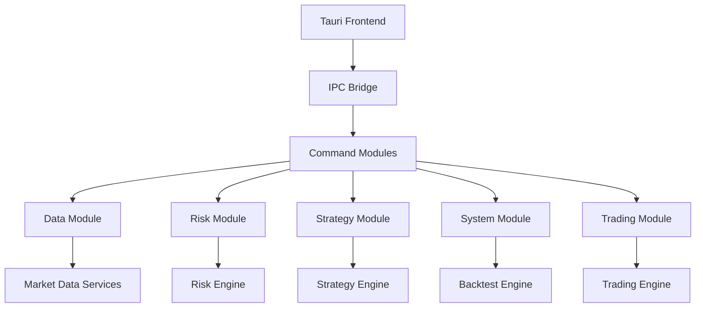
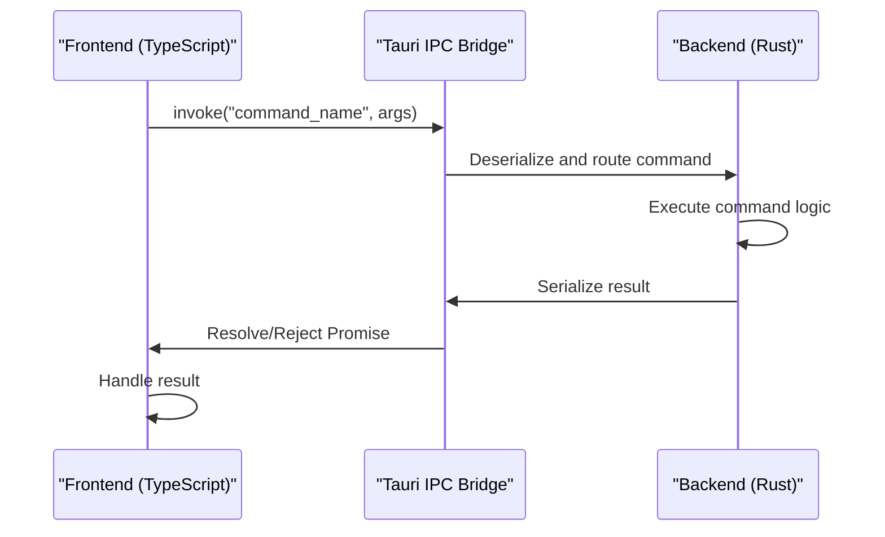
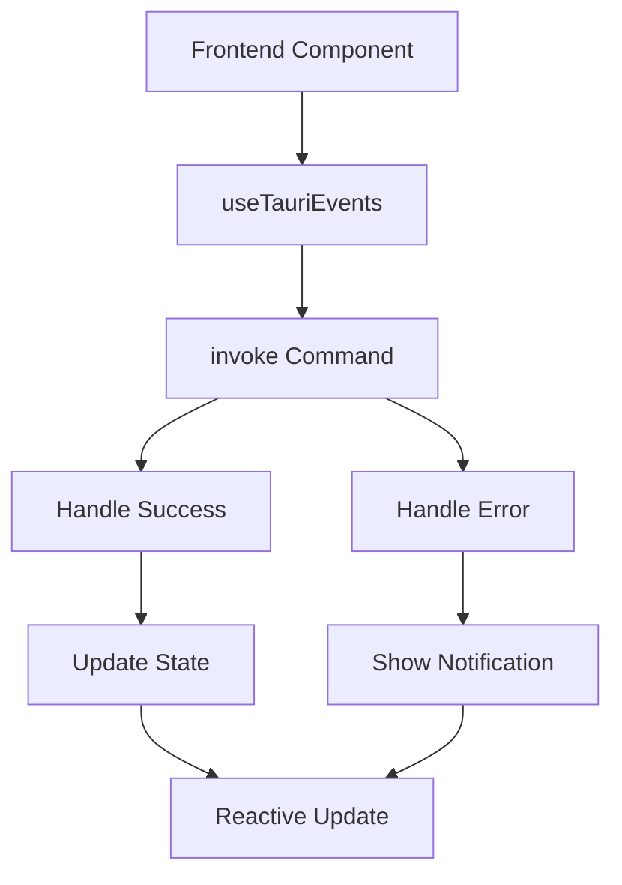
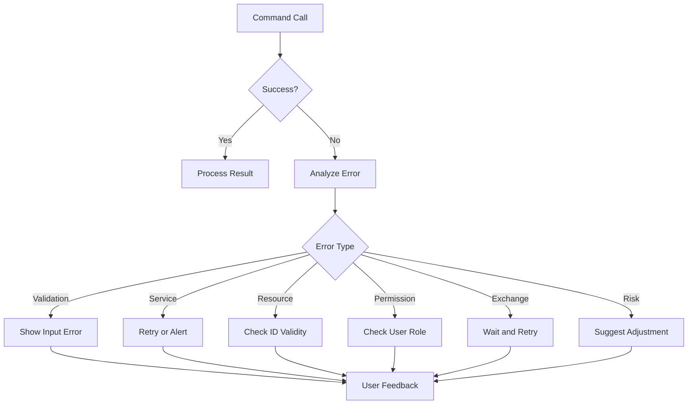

# API Reference

<cite>
**Referenced Files in This Document**   
- [data.rs](file://src-tauri/src/commands/data.rs)
- [risk.rs](file://src-tauri/src/commands/risk.rs)
- [strategy.rs](file://src-tauri/src/commands/strategy.rs)
- [system.rs](file://src-tauri/src/commands/system.rs)
- [trading.rs](file://src-tauri/src/commands/trading.rs)
- [lib.rs](file://src-tauri/src/lib.rs)
- [main.rs](file://src-tauri/src/main.rs)
- [Cargo.toml](file://src-tauri/Cargo.toml)
- [useTauriEvents.ts](file://frontend/src/composables/useTauriEvents.ts)
</cite>

## Table of Contents
1. [Introduction](#introduction)
2. [Command Modules Overview](#command-modules-overview)
3. [Data Module](#data-module)
4. [Risk Module](#risk-module)
5. [Strategy Module](#strategy-module)
6. [System Module](#system-module)
7. [Trading Module](#trading-module)
8. [IPC Mechanism](#ipc-mechanism)
9. [Frontend Integration](#frontend-integration)
10. [Error Handling](#error-handling)
11. [Security Considerations](#security-considerations)
12. [Performance and Rate Limiting](#performance-and-rate-limiting)
13. [Versioning and Compatibility](#versioning-and-compatibility)

## Introduction

The Tauri command system in the EA OKX platform provides a secure and efficient API layer for communication between the frontend (TypeScript/Vue) and backend (Rust) components. This API reference documents all available commands across the data, risk, strategy, system, and trading modules, detailing their parameters, return values, error conditions, and usage patterns.

All commands are exposed through Tauri's invoke system, enabling asynchronous communication between the web frontend and native backend. The API is designed to support quantitative trading workflows including strategy management, risk assessment, market data access, order execution, and system monitoring.

**Section sources**
- [lib.rs](file://src-tauri/src/lib.rs#L1-L59)
- [Cargo.toml](file://src-tauri/Cargo.toml#L1-L34)

## Command Modules Overview

The Tauri command system is organized into five primary modules, each responsible for a specific domain of functionality:

- **Data Module**: Market data subscription and retrieval
- **Risk Module**: Risk limit management and Value-at-Risk calculations
- **Strategy Module**: Strategy lifecycle management and performance metrics
- **System Module**: System health monitoring and backtesting operations
- **Trading Module**: Order execution and position management

These modules are defined in the `src-tauri/src/commands` directory and exposed through the Tauri invoke handler in `lib.rs`.



**Diagram sources**
- [mod.rs](file://src-tauri/src/commands/mod.rs#L1-L8)
- [lib.rs](file://src-tauri/src/lib.rs#L3-L9)

**Section sources**
- [mod.rs](file://src-tauri/src/commands/mod.rs#L1-L8)

## Data Module

The Data module provides access to market data from the OKX exchange, including real-time price updates, candlestick data, and market subscriptions.

### subscribe_market_data

Subscribes to real-time market data for specified symbols.

**Parameters**
- `symbols`: Array of symbol strings (e.g., "BTC-USDT", "ETH-USDT")

**Return Value**
- `Result<(), String>`: Ok on successful subscription, error message on failure

**Error Conditions**
- Invalid symbol format
- Connection issues with exchange

**Input Validation**
- At least one symbol must be provided
- Symbols must follow exchange format (base-quote)

**Section sources**
- [data.rs](file://src-tauri/src/commands/data.rs#L23-L29)

### get_latest_price

Retrieves the latest price for a specified symbol.

**Parameters**
- `symbol`: Symbol string (e.g., "BTC-USDT")

**Return Value**
- `Result<f64, String>`: Latest price on success, error message on failure

**Error Conditions**
- Symbol not found
- Exchange API error
- Network connectivity issues

**Input Validation**
- Symbol must not be empty
- Symbol must follow valid format

**Section sources**
- [data.rs](file://src-tauri/src/commands/data.rs#L31-L37)

### get_candles

Retrieves candlestick data for a specified symbol, interval, and limit.

**Parameters**
- `symbol`: Symbol string
- `interval`: Time interval ("1m", "5m", "1h", "1d")
- `limit`: Optional number of candles to retrieve (default: 100)

**Return Value**
- `Result<Vec<Candle>, String>`: Array of candle objects on success, error message on failure

**Candle Structure**
- `timestamp`: ISO 8601 timestamp
- `open`, `high`, `low`, `close`: Price values
- `volume`: Trading volume

**Error Conditions**
- Invalid interval format
- Symbol not available
- Data service unavailable

**Input Validation**
- Symbol must be valid
- Interval must be one of supported values
- Limit must be positive if provided

**Section sources**
- [data.rs](file://src-tauri/src/commands/data.rs#L39-L45)

## Risk Module

The Risk module handles risk management operations including risk limit configuration and Value-at-Risk calculations.

### get_risk_limits

Retrieves current risk limits for the trading account.

**Parameters**
- None

**Return Value**
- `Result<RiskLimits, String>`: Risk limits object on success, error message on failure

**RiskLimits Structure**
- `max_position_size`: Maximum position size in USD
- `max_leverage`: Maximum allowed leverage
- `daily_loss_limit`: Daily loss threshold in USD
- `max_concentration`: Maximum portfolio concentration
- `min_margin_ratio`: Minimum margin requirement

**Error Conditions**
- Risk service unavailable
- Configuration loading failure

**Section sources**
- [risk.rs](file://src-tauri/src/commands/risk.rs#L20-L31)

### update_risk_limits

Updates the current risk limits configuration.

**Parameters**
- `limits`: RiskLimits object with updated values

**Return Value**
- `Result<(), String>`: Ok on successful update, error message on failure

**Error Conditions**
- Invalid limit values (negative, unrealistic)
- Risk service unavailable
- Permission denied

**Input Validation**
- All numeric values must be positive
- Leverage must be reasonable (typically < 100)
- Daily loss limit must be positive

**Section sources**
- [risk.rs](file://src-tauri/src/commands/risk.rs#L33-L39)

### calculate_var

Calculates Value-at-Risk using specified confidence level and method.

**Parameters**
- `confidence`: Confidence level (0.95, 0.99)
- `method`: Calculation method ("Historical", "Parametric", "MonteCarlo")

**Return Value**
- `Result<VaRResult, String>`: VaR calculation results on success, error message on failure

**VaRResult Structure**
- `var_95`, `var_99`: VaR values at different confidence levels
- `cvar`: Conditional VaR (expected shortfall)
- `method`: Calculation method used

**Error Conditions**
- Invalid confidence level
- Unsupported method
- Insufficient historical data
- Calculation engine error

**Input Validation**
- Confidence must be between 0.9 and 0.999
- Method must be one of supported types
- Historical data availability

**Section sources**
- [risk.rs](file://src-tauri/src/commands/risk.rs#L41-L53)

## Strategy Module

The Strategy module manages the lifecycle of trading strategies including creation, modification, execution, and performance monitoring.

### get_strategies

Retrieves all available strategies.

**Parameters**
- None

**Return Value**
- `Result<Vec<Strategy>, String>`: Array of strategy objects on success, error message on failure

**Strategy Structure**
- `id`: Unique strategy identifier
- `name`: Strategy name
- `description`: Strategy description
- `status`: Current status (Draft, Active, Paused, etc.)
- `parameters`: Configuration parameters
- `created_at`, `updated_at`: Timestamps

**Error Conditions**
- Strategy service unavailable
- Database connection issues

**Section sources**
- [strategy.rs](file://src-tauri/src/commands/strategy.rs#L31-L49)

### get_strategy

Retrieves a specific strategy by ID.

**Parameters**
- `id`: Strategy identifier

**Return Value**
- `Result<Strategy, String>`: Strategy object on success, error message on failure

**Error Conditions**
- Strategy not found
- Invalid ID format
- Service unavailable

**Input Validation**
- ID must not be empty
- ID must match existing strategy

**Section sources**
- [strategy.rs](file://src-tauri/src/commands/strategy.rs#L51-L66)

### create_strategy

Creates a new trading strategy.

**Parameters**
- `request`: CreateStrategyRequest object containing name, description, and parameters

**Return Value**
- `Result<Strategy, String>`: Created strategy object on success, error message on failure

**CreateStrategyRequest Structure**
- `name`: Strategy name
- `description`: Strategy description
- `parameters`: Configuration parameters

**Error Conditions**
- Missing required fields
- Name conflicts
- Invalid parameter values
- Service unavailable

**Input Validation**
- Name must not be empty
- Name must be unique
- Parameters must be valid JSON

**Section sources**
- [strategy.rs](file://src-tauri/src/commands/strategy.rs#L68-L83)

### update_strategy

Updates an existing strategy.

**Parameters**
- `id`: Strategy identifier
- `request`: CreateStrategyRequest object with updated values

**Return Value**
- `Result<Strategy, String>`: Updated strategy object on success, error message on failure

**Error Conditions**
- Strategy not found
- Invalid ID
- Invalid update data
- Service unavailable

**Input Validation**
- ID must exist
- Request data must be valid

**Section sources**
- [strategy.rs](file://src-tauri/src/commands/strategy.rs#L85-L100)

### delete_strategy

Deletes a strategy.

**Parameters**
- `id`: Strategy identifier

**Return Value**
- `Result<(), String>`: Ok on successful deletion, error message on failure

**Error Conditions**
- Strategy not found
- Strategy is active and cannot be deleted
- Permission denied
- Service unavailable

**Input Validation**
- ID must exist
- Strategy must not be running

**Section sources**
- [strategy.rs](file://src-tauri/src/commands/strategy.rs#L102-L109)

### start_strategy

Starts execution of a strategy.

**Parameters**
- `id`: Strategy identifier

**Return Value**
- `Result<(), String>`: Ok on success, error message on failure

**Error Conditions**
- Strategy not found
- Strategy already running
- Validation failed
- Risk limits exceeded
- Service unavailable

**Input Validation**
- ID must exist
- Strategy must be in valid state (not already running)

**Section sources**
- [strategy.rs](file://src-tauri/src/commands/strategy.rs#L111-L118)

### stop_strategy

Stops execution of a running strategy.

**Parameters**
- `id`: Strategy identifier

**Return Value**
- `Result<(), String>`: Ok on success, error message on failure

**Error Conditions**
- Strategy not found
- Strategy not running
- Service unavailable

**Input Validation**
- ID must exist
- Strategy must be currently running

**Section sources**
- [strategy.rs](file://src-tauri/src/commands/strategy.rs#L120-L127)

### pause_strategy

Pauses a running strategy.

**Parameters**
- `id`: Strategy identifier

**Return Value**
- `Result<(), String>`: Ok on success, error message on failure

**Error Conditions**
- Strategy not found
- Strategy not running
- Service unavailable

**Input Validation**
- ID must exist
- Strategy must be currently running

**Section sources**
- [strategy.rs](file://src-tauri/src/commands/strategy.rs#L129-L136)

### get_strategy_metrics

Retrieves performance metrics for a strategy.

**Parameters**
- `id`: Strategy identifier

**Return Value**
- `Result<StrategyMetrics, String>`: Metrics object on success, error message on failure

**StrategyMetrics Structure**
- `total_trades`: Number of completed trades
- `win_rate`: Percentage of winning trades
- `total_pnl`: Total profit and loss
- `sharpe_ratio`: Risk-adjusted return
- `max_drawdown`: Maximum peak-to-trough decline

**Error Conditions**
- Strategy not found
- No trading history
- Calculation service unavailable

**Input Validation**
- ID must exist
- Strategy must have trading history

**Section sources**
- [strategy.rs](file://src-tauri/src/commands/strategy.rs#L138-L152)

## System Module

The System module provides system-level operations including health monitoring, alert management, and backtesting.

### get_system_metrics

Retrieves current system performance metrics.

**Parameters**
- None

**Return Value**
- `Result<SystemMetrics, String>`: Metrics object on success, error message on failure

**SystemMetrics Structure**
- `cpu_usage`: CPU utilization percentage
- `memory_usage`: Memory utilization percentage
- `network_latency`: Network round-trip time in ms
- `active_strategies`: Number of running strategies
- `total_orders`: Total order count

**Error Conditions**
- Monitoring service unavailable
- System metrics collection failure

**Section sources**
- [system.rs](file://src-tauri/src/commands/system.rs#L38-L49)

### get_alerts

Retrieves system alerts.

**Parameters**
- `limit`: Optional maximum number of alerts to return

**Return Value**
- `Result<Vec<Alert>, String>`: Array of alert objects on success, error message on failure

**Alert Structure**
- `id`: Alert identifier
- `level`: Severity level (INFO, WARNING, ERROR, CRITICAL)
- `message`: Alert description
- `timestamp`: ISO 8601 timestamp

**Error Conditions**
- Alert service unavailable
- Database connection issues

**Input Validation**
- Limit must be positive if provided

**Section sources**
- [system.rs](file://src-tauri/src/commands/system.rs#L51-L56)

### run_backtest

Initiates a backtest for a strategy.

**Parameters**
- `request`: BacktestRequest object containing strategy ID, symbol, date range, and capital

**Return Value**
- `Result<String, String>`: Backtest job ID on success, error message on failure

**BacktestRequest Structure**
- `strategy_id`: ID of strategy to test
- `symbol`: Trading symbol
- `start_date`: Start date (ISO 8601)
- `end_date`: End date (ISO 8601)
- `initial_capital`: Starting capital amount

**Error Conditions**
- Strategy not found
- Invalid date range
- Insufficient data
- Service unavailable

**Input Validation**
- All fields required
- Dates must be valid and in correct order
- Capital must be positive

**Section sources**
- [system.rs](file://src-tauri/src/commands/system.rs#L58-L65)

### get_backtest_results

Retrieves results of a completed backtest.

**Parameters**
- `backtest_id`: Backtest job identifier

**Return Value**
- `Result<BacktestResult, String>`: Results object on success, error message on failure

**BacktestResult Structure**
- `total_return`: Total return percentage
- `sharpe_ratio`: Risk-adjusted return
- `max_drawdown`: Maximum drawdown
- `win_rate`: Winning trade percentage
- `total_trades`: Number of trades executed

**Error Conditions**
- Backtest not found
- Backtest still running
- Results not available
- Service unavailable

**Input Validation**
- ID must exist
- Backtest must be completed

**Section sources**
- [system.rs](file://src-tauri/src/commands/system.rs#L67-L79)

## Trading Module

The Trading module handles order execution and position management operations.

### place_order

Places a new trading order.

**Parameters**
- `request`: PlaceOrderRequest object containing symbol, side, type, quantity, and price

**Return Value**
- `Result<Order, String>`: Created order object on success, error message on failure

**PlaceOrderRequest Structure**
- `symbol`: Trading symbol
- `side`: Buy or Sell
- `order_type`: Market, Limit, etc.
- `quantity`: Order quantity
- `price`: Optional limit price

**Order Structure**
- `id`: Order identifier
- `symbol`: Trading symbol
- `side`: Buy or Sell
- `order_type`: Order type
- `quantity`: Order quantity
- `price`: Limit price (None for market)
- `status`: Order status
- `filled_qty`: Filled quantity
- `created_at`: Creation timestamp

**Error Conditions**
- Invalid order parameters
- Insufficient funds
- Risk limits exceeded
- Exchange connectivity issues
- Service unavailable

**Input Validation**
- All required fields present
- Quantity positive
- Price positive if provided
- Valid order type

**Section sources**
- [trading.rs](file://src-tauri/src/commands/trading.rs#L36-L53)

### cancel_order

Cancels an existing order.

**Parameters**
- `order_id`: Order identifier

**Return Value**
- `Result<(), String>`: Ok on success, error message on failure

**Error Conditions**
- Order not found
- Order already filled/cancelled
- Exchange rejection
- Service unavailable

**Input Validation**
- ID must exist
- Order must be cancellable

**Section sources**
- [trading.rs](file://src-tauri/src/commands/trading.rs#L55-L62)

### get_open_orders

Retrieves all currently open orders.

**Parameters**
- None

**Return Value**
- `Result<Vec<Order>, String>`: Array of open orders on success, error message on failure

**Error Conditions**
- Order service unavailable
- Exchange API error

**Section sources**
- [trading.rs](file://src-tauri/src/commands/trading.rs#L64-L71)

### get_order_history

Retrieves historical order data.

**Parameters**
- `limit`: Optional maximum number of orders to return

**Return Value**
- `Result<Vec<Order>, String>`: Array of order objects on success, error message on failure

**Error Conditions**
- Order service unavailable
- Database connection issues

**Input Validation**
- Limit must be positive if provided

**Section sources**
- [trading.rs](file://src-tauri/src/commands/trading.rs#L73-L80)

### get_positions

Retrieves current trading positions.

**Parameters**
- None

**Return Value**
- `Result<Vec<Position>, String>`: Array of position objects on success, error message on failure

**Position Structure**
- `symbol`: Trading symbol
- `side`: Long or Short
- `quantity`: Position size
- `entry_price`: Average entry price
- `current_price`: Current market price
- `unrealized_pnl`: Unrealized profit/loss
- `realized_pnl`: Realized profit/loss

**Error Conditions**
- Position service unavailable
- Exchange API error

**Section sources**
- [trading.rs](file://src-tauri/src/commands/trading.rs#L82-L99)

### close_position

Closes a position for a specific symbol.

**Parameters**
- `symbol`: Symbol to close

**Return Value**
- `Result<(), String>`: Ok on success, error message on failure

**Error Conditions**
- No position exists for symbol
- Exchange rejection
- Service unavailable

**Input Validation**
- Symbol must have open position

**Section sources**
- [trading.rs](file://src-tauri/src/commands/trading.rs#L101-L108)

## IPC Mechanism

The Inter-Process Communication (IPC) mechanism between the frontend and backend is implemented using Tauri's invoke system, which provides a secure and type-safe way to call Rust functions from TypeScript.



**Diagram sources**
- [lib.rs](file://src-tauri/src/lib.rs#L24-L55)
- [main.rs](file://src-tauri/src/main.rs#L4-L6)

**Section sources**
- [lib.rs](file://src-tauri/src/lib.rs#L24-L55)

The IPC system uses the following pattern:
1. Frontend calls `invoke` with command name and serialized parameters
2. Tauri deserializes parameters and routes to appropriate command function
3. Command executes and returns result
4. Tauri serializes result and sends back to frontend
5. Frontend Promise resolves with result or rejects with error

All commands are asynchronous and return Promises, enabling non-blocking execution.

## Frontend Integration

Frontend TypeScript code calls Tauri commands using the `invoke` function from the `@tauri-apps/api` package.

```typescript
import { invoke } from '@tauri-apps/api/tauri';

// Example: Getting latest price
async function getLatestPrice(symbol: string): Promise<number> {
  try {
    const price: number = await invoke('get_latest_price', { symbol });
    return price;
  } catch (error) {
    console.error('Failed to get price:', error);
    throw error;
  }
}

// Example: Placing an order
async function placeOrder(orderRequest: PlaceOrderRequest): Promise<Order> {
  try {
    const order: Order = await invoke('place_order', { request: orderRequest });
    return order;
  } catch (error) {
    console.error('Failed to place order:', error);
    throw error;
  }
}
```

The `useTauriEvents` composable provides a convenient wrapper for common command patterns:



**Diagram sources**
- [useTauriEvents.ts](file://frontend/src/composables/useTauriEvents.ts)
- [trading.rs](file://src-tauri/src/commands/trading.rs#L36-L53)

**Section sources**
- [useTauriEvents.ts](file://frontend/src/composables/useTauriEvents.ts)

## Error Handling

The API uses a consistent error handling pattern across all commands, returning `Result<T, String>` where the error type is a descriptive string message.

### Error Response Format

All commands follow the same error response pattern:
- Success: `Ok(value)` with the expected return type
- Failure: `Err(String)` with a descriptive error message

### Common Error Types

| Error Type | Description | Example |
|-----------|-------------|---------|
| Validation Error | Invalid input parameters | "Invalid symbol format" |
| Service Unavailable | Backend service not responding | "Risk service unavailable" |
| Resource Not Found | Requested resource doesn't exist | "Strategy not found" |
| Permission Denied | Insufficient privileges | "Cannot modify active strategy" |
| Exchange Error | External exchange API failure | "OKX API rate limit exceeded" |
| Risk Violation | Operation violates risk limits | "Position size exceeds limit" |

### Error Handling Best Practices

1. Always wrap command calls in try-catch blocks
2. Provide user-friendly error messages
3. Log detailed errors for debugging
4. Implement appropriate retry logic for transient failures
5. Handle specific error types differently when needed



**Diagram sources**
- [strategy.rs](file://src-tauri/src/commands/strategy.rs)
- [trading.rs](file://src-tauri/src/commands/trading.rs)
- [risk.rs](file://src-tauri/src/commands/risk.rs)

**Section sources**
- [strategy.rs](file://src-tauri/src/commands/strategy.rs)
- [trading.rs](file://src-tauri/src/commands/trading.rs)

## Security Considerations

The Tauri command system implements several security measures to protect the trading platform.

### Authentication and Authorization

Currently, the system assumes local execution with trusted access. For production deployment, consider implementing:

- User authentication via JWT tokens
- Role-based access control (RBAC)
- Command-level permission checks
- Session management

### Input Validation

All commands perform strict input validation to prevent injection attacks and invalid operations:

- Type checking via serde serialization
- Range validation for numeric values
- Format validation for strings and identifiers
- Business rule validation (risk limits, etc.)

### Secure Communication

- Tauri's IPC channel is sandboxed and secure by default
- No network exposure of command endpoints
- All communication occurs within the same process boundary

### Risk Protection

- Risk limits enforced before trading operations
- Position size and leverage controls
- Daily loss limits
- Concentration risk monitoring

**Section sources**
- [risk.rs](file://src-tauri/src/commands/risk.rs)
- [trading.rs](file://src-tauri/src/commands/trading.rs)

## Performance and Rate Limiting

The API design considers performance implications and implements appropriate rate limiting.

### Performance Characteristics

| Command | Expected Latency | Frequency Limit |
|--------|------------------|-----------------|
| get_latest_price | < 100ms | High (real-time) |
| get_candles | < 500ms | Medium |
| place_order | < 200ms | Medium |
| run_backtest | Seconds to minutes | Low |
| get_strategy_metrics | < 300ms | Medium |

### Rate Limiting Strategy

The system should implement rate limiting to prevent abuse and ensure stability:

- Per-command rate limits
- Burst and sustained rate controls
- Priority queuing for critical operations
- Circuit breaker pattern for failing services

### Optimization Recommendations

1. Cache frequently accessed data (market prices, strategy lists)
2. Batch operations when possible
3. Use streaming for large data sets
4. Implement pagination for list operations
5. Optimize database queries for common access patterns

**Section sources**
- [data.rs](file://src-tauri/src/commands/data.rs)
- [system.rs](file://src-tauri/src/commands/system.rs)

## Versioning and Compatibility

The API follows semantic versioning principles to ensure backward compatibility.

### Versioning Strategy

- Major version: Breaking changes to command signatures
- Minor version: New commands or non-breaking additions
- Patch version: Bug fixes and performance improvements

### Backward Compatibility

The system maintains backward compatibility through:

- Stable command names and signatures
- Optional parameters for extensions
- Deprecation period before removal
- Version negotiation mechanism

### Migration Path

When breaking changes are necessary:
1. Introduce new command with version suffix
2. Mark old command as deprecated
3. Maintain both versions for one major release
4. Remove deprecated command in subsequent release

**Section sources**
- [Cargo.toml](file://src-tauri/Cargo.toml#L1-L34)
- [lib.rs](file://src-tauri/src/lib.rs#L1-L59)