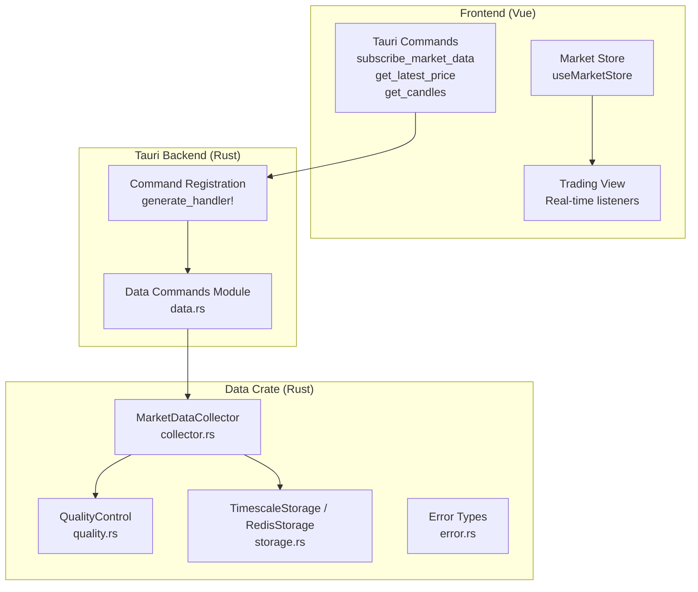
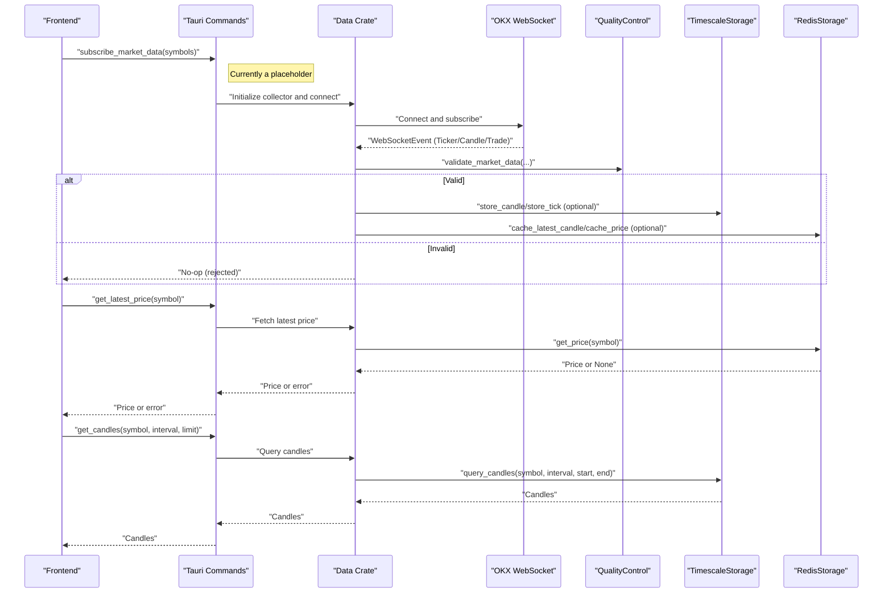
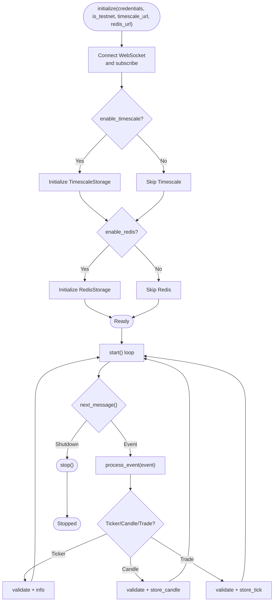
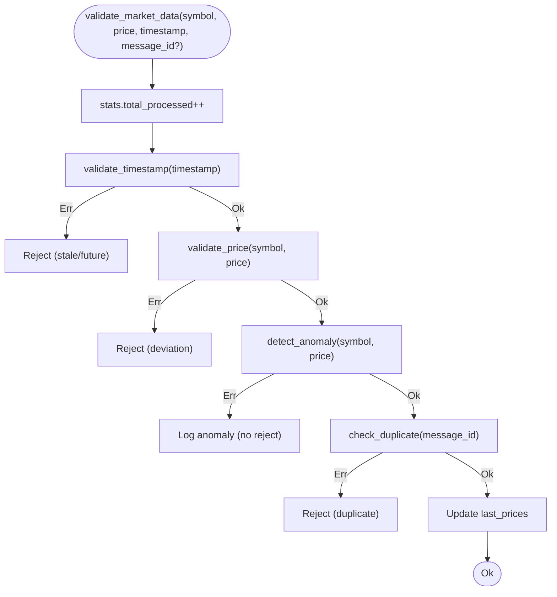
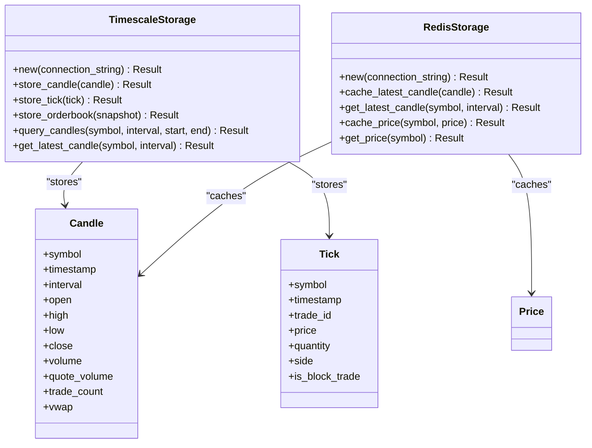
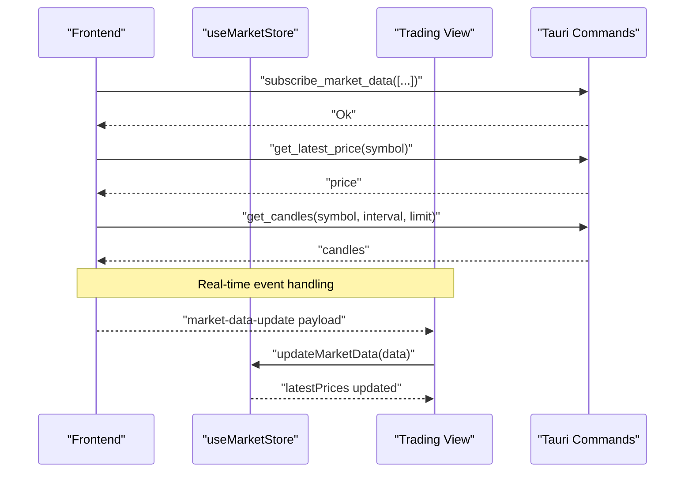
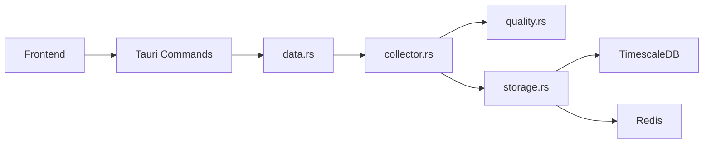

# Data API

<cite>
**Referenced Files in This Document**
- [lib.rs](file://crates/data/src/lib.rs)
- [collector.rs](file://crates/data/src/collector.rs)
- [storage.rs](file://crates/data/src/storage.rs)
- [quality.rs](file://crates/data/src/quality.rs)
- [error.rs](file://crates/data/src/error.rs)
- [data.rs](file://src-tauri/src/commands/data.rs)
- [lib.rs](file://src-tauri/src/lib.rs)
- [market.ts](file://frontend/src/stores/market.ts)
- [Trading.vue](file://frontend/src/views/Trading.vue)
</cite>

## Table of Contents
1. [Introduction](#introduction)
2. [Project Structure](#project-structure)
3. [Core Components](#core-components)
4. [Architecture Overview](#architecture-overview)
5. [Detailed Component Analysis](#detailed-component-analysis)
6. [Dependency Analysis](#dependency-analysis)
7. [Performance Considerations](#performance-considerations)
8. [Troubleshooting Guide](#troubleshooting-guide)
9. [Conclusion](#conclusion)
10. [Appendices](#appendices)

## Introduction
This document provides API documentation for the data module commands that power market data ingestion, quality control, and storage in the EA OKX quantitative trading system. It explains how the Tauri commands in the frontend integrate with the Rust data layer, including the market data collector, storage backends, and quality control mechanisms. It also covers how to request market data, subscribe to updates, and retrieve historical data from the frontend, along with validation, error handling, and performance considerations.

## Project Structure
The data API spans two layers:
- Rust backend (data crate): ingestion, quality control, and storage
- Tauri commands (frontend bridge): thin wrappers around backend functionality exposed to the Vue frontend

**Diagram sources**
- [lib.rs](file://src-tauri/src/lib.rs#L24-L56)
- [data.rs](file://src-tauri/src/commands/data.rs#L1-L46)
- [collector.rs](file://crates/data/src/collector.rs#L1-L120)
- [quality.rs](file://crates/data/src/quality.rs#L1-L120)
- [storage.rs](file://crates/data/src/storage.rs#L68-L144)
- [error.rs](file://crates/data/src/error.rs#L1-L45)

**Section sources**
- [lib.rs](file://src-tauri/src/lib.rs#L24-L56)
- [data.rs](file://src-tauri/src/commands/data.rs#L1-L46)

## Core Components
- MarketDataCollector: connects to OKX WebSocket, subscribes to channels, validates data via QualityControl, and writes to TimescaleDB and/or Redis.
- QualityControl: enforces timestamp validity, price deviation limits, anomaly detection, and duplicate detection.
- TimescaleStorage: persists OHLCV candles and ticks; supports querying historical candles and retrieving latest candle.
- RedisStorage: caches latest candles and prices for fast retrieval.
- Tauri Data Commands: expose subscribe_market_data, get_latest_price, and get_candles to the frontend.

**Section sources**
- [collector.rs](file://crates/data/src/collector.rs#L1-L120)
- [quality.rs](file://crates/data/src/quality.rs#L1-L120)
- [storage.rs](file://crates/data/src/storage.rs#L68-L144)
- [data.rs](file://src-tauri/src/commands/data.rs#L1-L46)

## Architecture Overview
The data flow begins with the frontend invoking Tauri commands. These commands currently act as placeholders and must be wired to the Rust data layer. The Rust data layer ingests WebSocket events, applies quality control, and stores data to TimescaleDB and/or Redis. The frontend listens for real-time events and retrieves historical data via the data commands.

**Diagram sources**
- [lib.rs](file://src-tauri/src/lib.rs#L24-L56)
- [data.rs](file://src-tauri/src/commands/data.rs#L1-L46)
- [collector.rs](file://crates/data/src/collector.rs#L127-L170)
- [quality.rs](file://crates/data/src/quality.rs#L241-L275)
- [storage.rs](file://crates/data/src/storage.rs#L185-L265)

## Detailed Component Analysis

### Tauri Data Commands (Frontend API)
The frontend exposes three data commands via Tauri. As implemented, they are placeholders and must be wired to the Rust data layer.

- subscribe_market_data(symbols: Vec<String>) -> Result<(), String>
  - Purpose: Request subscription to market data for the given symbols.
  - Parameters:
    - symbols: List of instrument IDs (e.g., BTC-USDT).
  - Return type: Unit result on success; string error on failure.
  - Error conditions:
    - Placeholder implementation logs and returns success; backend wiring required.
  - Notes: Integrates with WebSocket service once implemented.

- get_latest_price(symbol: String) -> Result<f64, String>
  - Purpose: Retrieve the latest cached price for a symbol.
  - Parameters:
    - symbol: Instrument ID.
  - Return type: Latest price as f64 on success; string error on failure.
  - Error conditions:
    - Placeholder returns mock price; backend should return Redis price or error.
  - Notes: Uses Redis cache for speed.

- get_candles(symbol: String, interval: String, limit: Option<usize>) -> Result<Vec<Candle>, String>
  - Purpose: Fetch historical OHLCV candles for a symbol and interval.
  - Parameters:
    - symbol: Instrument ID.
    - interval: Candle interval (e.g., 1m).
    - limit: Optional number of candles to return.
  - Return type: Vector of Candle records on success; string error on failure.
  - Error conditions:
    - Placeholder returns empty vector; backend should query TimescaleDB and return error on failure.
  - Notes: Uses TimescaleDB query_candles.

**Section sources**
- [data.rs](file://src-tauri/src/commands/data.rs#L1-L46)
- [lib.rs](file://src-tauri/src/lib.rs#L24-L56)

### MarketDataCollector (Backend Ingestion)
The collector manages WebSocket connectivity, subscription requests, and event processing. It applies quality control and writes to storage backends.

Key behaviors:
- Initialization:
  - Creates WebSocket client, connects, and subscribes to configured channels for each symbol.
  - Optionally initializes TimescaleDB and Redis backends based on configuration flags.
- Event processing:
  - Handles Ticker, Candle, and Trade events.
  - Applies QualityControl validation before storing.
  - Writes candles to TimescaleDB and ticks to TimescaleDB; caches latest candle/price to Redis if enabled.
- Lifecycle:
  - start loops on WebSocket messages until shutdown.
  - stop sends shutdown signal and disconnects WebSocket.

**Diagram sources**
- [collector.rs](file://crates/data/src/collector.rs#L76-L125)
- [collector.rs](file://crates/data/src/collector.rs#L127-L170)
- [collector.rs](file://crates/data/src/collector.rs#L172-L321)

**Section sources**
- [collector.rs](file://crates/data/src/collector.rs#L76-L125)
- [collector.rs](file://crates/data/src/collector.rs#L127-L170)
- [collector.rs](file://crates/data/src/collector.rs#L172-L321)

### QualityControl (Data Validation)
QualityControl enforces data quality across four dimensions:
- Timestamp validation: rejects future or stale data beyond configured tolerances.
- Price deviation validation: compares current price to last valid price per symbol.
- Anomaly detection: computes Z-score over a rolling window; logs anomalies but does not reject.
- Duplicate detection: tracks recent message IDs to prevent duplicates.

Statistics are maintained per-symbol and globally.

**Diagram sources**
- [quality.rs](file://crates/data/src/quality.rs#L105-L133)
- [quality.rs](file://crates/data/src/quality.rs#L135-L157)
- [quality.rs](file://crates/data/src/quality.rs#L159-L215)
- [quality.rs](file://crates/data/src/quality.rs#L217-L239)
- [quality.rs](file://crates/data/src/quality.rs#L241-L275)

**Section sources**
- [quality.rs](file://crates/data/src/quality.rs#L105-L133)
- [quality.rs](file://crates/data/src/quality.rs#L135-L157)
- [quality.rs](file://crates/data/src/quality.rs#L159-L215)
- [quality.rs](file://crates/data/src/quality.rs#L217-L239)
- [quality.rs](file://crates/data/src/quality.rs#L241-L275)

### Storage Interfaces (TimescaleDB and Redis)
- TimescaleStorage:
  - store_candle: inserts or updates OHLCV rows with conflict resolution.
  - store_tick: inserts trades with conflict resolution on trade_id.
  - store_orderbook: inserts order book snapshots (JSONB arrays).
  - query_candles: retrieves candles within a time range ordered by timestamp.
  - get_latest_candle: retrieves the most recent candle for a symbol and interval.
- RedisStorage:
  - cache_latest_candle: caches candle JSON with expiration.
  - get_latest_candle: retrieves cached candle.
  - cache_price: caches latest price with expiration.
  - get_price: retrieves cached price.

**Diagram sources**
- [storage.rs](file://crates/data/src/storage.rs#L68-L144)
- [storage.rs](file://crates/data/src/storage.rs#L185-L265)
- [storage.rs](file://crates/data/src/storage.rs#L267-L347)

**Section sources**
- [storage.rs](file://crates/data/src/storage.rs#L68-L144)
- [storage.rs](file://crates/data/src/storage.rs#L185-L265)
- [storage.rs](file://crates/data/src/storage.rs#L267-L347)

### Frontend Integration Patterns
- Real-time updates:
  - The Trading view listens for market-data-update events and updates the local market prices.
- State management:
  - The market store maintains a symbol-indexed map of market data and latest prices.
- Command invocation:
  - The frontend invokes Tauri commands to subscribe, fetch latest price, and retrieve candles.

**Diagram sources**
- [Trading.vue](file://frontend/src/views/Trading.vue#L418-L463)
- [market.ts](file://frontend/src/stores/market.ts#L1-L27)
- [data.rs](file://src-tauri/src/commands/data.rs#L1-L46)

**Section sources**
- [Trading.vue](file://frontend/src/views/Trading.vue#L418-L463)
- [market.ts](file://frontend/src/stores/market.ts#L1-L27)
- [data.rs](file://src-tauri/src/commands/data.rs#L1-L46)

## Dependency Analysis
- Tauri command registration wires the frontend commands to the backend handlers.
- Data commands depend on the data crate’s collector, quality control, and storage modules.
- Collector depends on WebSocket client, quality control, and storage backends.
- Storage backends depend on TimescaleDB and Redis clients.

**Diagram sources**
- [lib.rs](file://src-tauri/src/lib.rs#L24-L56)
- [data.rs](file://src-tauri/src/commands/data.rs#L1-L46)
- [collector.rs](file://crates/data/src/collector.rs#L1-L120)
- [storage.rs](file://crates/data/src/storage.rs#L68-L144)

**Section sources**
- [lib.rs](file://src-tauri/src/lib.rs#L24-L56)
- [collector.rs](file://crates/data/src/collector.rs#L1-L120)
- [storage.rs](file://crates/data/src/storage.rs#L68-L144)

## Performance Considerations
- WebSocket throughput: The collector processes events in a loop; ensure the event queue remains responsive under load.
- Quality control overhead: Anomaly detection uses a rolling window; tune window size and thresholds to balance sensitivity and CPU usage.
- Storage write patterns:
  - TimescaleDB: Batch writes and use conflict resolution to minimize duplicate writes.
  - Redis: Use short TTLs for frequently accessed keys (price) and longer TTLs for candles.
- Query performance:
  - TimescaleDB: Ensure appropriate indexing on symbol, interval, and timestamp columns.
  - Limit candle queries with explicit start/end ranges and reasonable limits.
- Frontend responsiveness:
  - Debounce frequent command invocations.
  - Use caching (Redis) for latest price and recent candles to reduce backend load.

[No sources needed since this section provides general guidance]

## Troubleshooting Guide
Common issues and resolutions:
- WebSocket connection failures:
  - Verify credentials and network connectivity; check subscription confirmations and error events.
- Stale or future data rejections:
  - Adjust max_data_age_secs and future_tolerance_secs in QualityConfig.
- Excessive price deviation rejections:
  - Increase max_price_deviation_pct cautiously; investigate potential data source issues.
- Duplicate message rejections:
  - Confirm deduplication is enabled and message IDs are unique per event.
- Database errors:
  - Inspect TimescaleDB connection string and schema; verify table existence and permissions.
- Redis errors:
  - Confirm Redis availability and connection string; check key TTLs and serialization.

**Section sources**
- [error.rs](file://crates/data/src/error.rs#L1-L45)
- [quality.rs](file://crates/data/src/quality.rs#L105-L133)
- [quality.rs](file://crates/data/src/quality.rs#L135-L157)
- [quality.rs](file://crates/data/src/quality.rs#L217-L239)
- [storage.rs](file://crates/data/src/storage.rs#L68-L144)

## Conclusion
The data API provides a robust foundation for real-time market data ingestion, quality control, and storage. The frontend currently exposes three Tauri commands as placeholders and must be wired to the Rust data layer to enable live subscriptions, price retrieval, and historical candle queries. By tuning quality control parameters, optimizing storage writes, and leveraging caching, the system can achieve reliable, high-performance market data delivery.

[No sources needed since this section summarizes without analyzing specific files]

## Appendices

### API Reference Summary

- subscribe_market_data(symbols: Vec<String>) -> Result<(), String>
  - Purpose: Subscribe to market data for symbols.
  - Parameters: symbols
  - Return: Unit result or error string.
  - Error conditions: Placeholder; backend integration required.

- get_latest_price(symbol: String) -> Result<f64, String>
  - Purpose: Retrieve latest cached price.
  - Parameters: symbol
  - Return: Price or error string.
  - Error conditions: Placeholder; backend integration required.

- get_candles(symbol: String, interval: String, limit: Option<usize>) -> Result<Vec<Candle>, String>
  - Purpose: Retrieve historical candles.
  - Parameters: symbol, interval, limit
  - Return: Vector of Candle or error string.
  - Error conditions: Placeholder; backend integration required.

**Section sources**
- [data.rs](file://src-tauri/src/commands/data.rs#L1-L46)