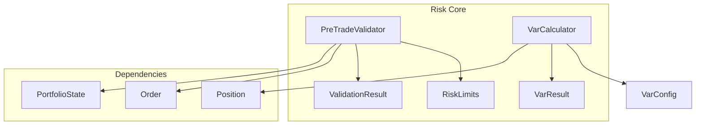
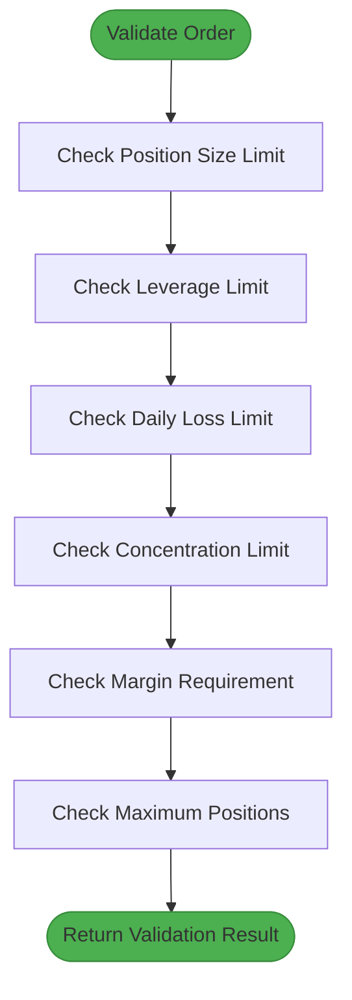
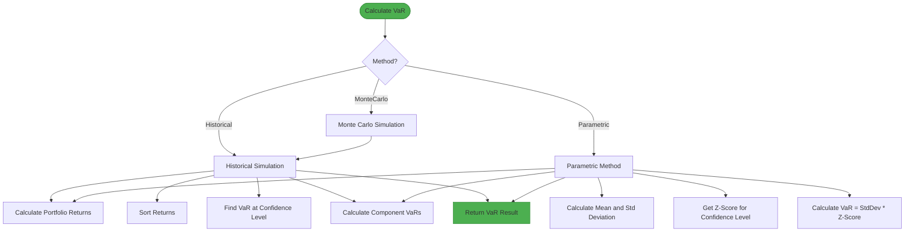
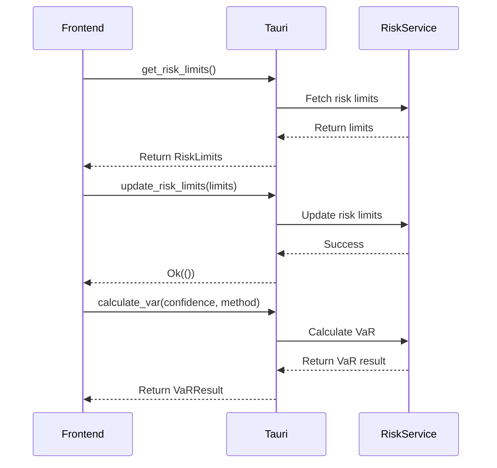
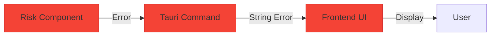
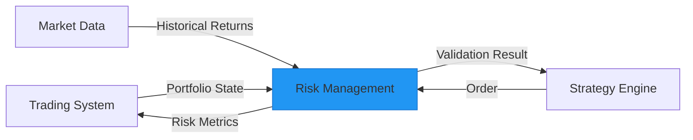

# Risk API

<cite>
**Referenced Files in This Document**   
- [risk.rs](file://crates/risk/src/lib.rs)
- [validators.rs](file://crates/risk/src/validators.rs)
- [var.rs](file://crates/risk/src/var.rs)
- [error.rs](file://crates/risk/src/error.rs)
- [risk.rs](file://src-tauri/src/commands/risk.rs)
- [order.rs](file://crates/core/src/models/order.rs)
- [position.rs](file://crates/core/src/models/position.rs)
</cite>

## Table of Contents
1. [Introduction](#introduction)
2. [Core Risk Management Components](#core-risk-management-components)
3. [Pre-Trade Validation System](#pre-trade-validation-system)
4. [Value at Risk (VaR) Calculation](#value-at-risk-var-calculation)
5. [Frontend Risk Commands](#frontend-risk-commands)
6. [Error Handling](#error-handling)
7. [Performance Considerations](#performance-considerations)
8. [Integration Points](#integration-points)

## Introduction
The Risk API provides comprehensive risk management functionality for the trading system, including pre-trade validation, Value at Risk (VaR) calculation, and risk limit management. This documentation details the core components, their interfaces, and how they work together to ensure safe trading operations.

The system consists of two main components: pre-trade validators that check orders before execution, and VaR calculators that assess portfolio-level risk exposure. These components are exposed to the frontend through Tauri commands, allowing users to validate trades, check risk limits, and retrieve risk metrics.

**Section sources**
- [risk.rs](file://crates/risk/src/lib.rs#L1-L11)

## Core Risk Management Components

The risk management system is organized into several key components that work together to provide comprehensive risk control. The main components include risk validators for pre-trade checks, VaR calculators for portfolio risk assessment, and supporting data structures for risk limits and validation results.



**Diagram sources**
- [risk.rs](file://crates/risk/src/lib.rs#L1-L11)
- [validators.rs](file://crates/risk/src/validators.rs#L10-L47)
- [var.rs](file://crates/risk/src/var.rs#L8-L36)

**Section sources**
- [risk.rs](file://crates/risk/src/lib.rs#L1-L11)
- [validators.rs](file://crates/risk/src/validators.rs#L1-L47)
- [var.rs](file://crates/risk/src/var.rs#L1-L36)

## Pre-Trade Validation System

The pre-trade validation system provides comprehensive checks before order execution to ensure compliance with risk limits. The `PreTradeValidator` performs multiple validation checks including position size limits, leverage limits, daily loss limits, concentration limits, margin requirements, and maximum position counts.

### RiskLimits Structure
The `RiskLimits` struct defines the risk parameters for the validation system:

| Field | Type | Description | Default Value |
|-------|------|-------------|---------------|
| max_position_size | HashMap<Symbol, Quantity> | Maximum position size per symbol | Empty HashMap |
| max_portfolio_value | Decimal | Maximum total portfolio value | 1,000,000.0 |
| max_leverage | Decimal | Maximum leverage allowed | 3.0x |
| daily_loss_limit | Decimal | Daily loss limit (absolute value) | 10,000.0 |
| max_concentration_pct | Decimal | Maximum concentration per symbol (%) | 25.0% |
| max_open_positions | usize | Maximum number of open positions | 10 |
| min_margin_ratio | Decimal | Minimum required margin ratio | 0.15 (15%) |

### PortfolioState Structure
The `PortfolioState` provides the current portfolio information needed for risk checks:

| Field | Type | Description |
|-------|------|-------------|
| total_equity | Decimal | Total portfolio equity |
| available_margin | Decimal | Available margin for new positions |
| positions | Vec<Position> | Current open positions |
| daily_pnl | Decimal | Daily profit and loss |

### Validation Process
The validation process follows a sequential check pattern, evaluating multiple risk factors before approving an order:



**Diagram sources**
- [validators.rs](file://crates/risk/src/validators.rs#L12-L47)
- [validators.rs](file://crates/risk/src/validators.rs#L49-L56)
- [validators.rs](file://crates/risk/src/validators.rs#L68-L131)

**Section sources**
- [validators.rs](file://crates/risk/src/validators.rs#L12-L47)
- [validators.rs](file://crates/risk/src/validators.rs#L49-L56)
- [validators.rs](file://crates/risk/src/validators.rs#L68-L131)
- [order.rs](file://crates/core/src/models/order.rs#L96-L150)
- [position.rs](file://crates/core/src/models/position.rs#L34-L76)

## Value at Risk (VaR) Calculation

The VaR calculation system provides portfolio risk assessment using multiple methodologies. The `VarCalculator` supports three calculation methods: Historical Simulation, Parametric (Variance-Covariance), and Monte Carlo Simulation.

### VarMethod Enum
The `VarMethod` enum defines the available VaR calculation methods:

| Method | Description |
|--------|-------------|
| Historical | Uses historical simulation based on past returns |
| Parametric | Uses variance-covariance method with normal distribution assumptions |
| MonteCarlo | Uses Monte Carlo simulation (currently uses historical simulation as approximation) |

### VarConfig Structure
The `VarConfig` struct defines the configuration parameters for VaR calculations:

| Field | Type | Description | Default Value |
|-------|------|-------------|---------------|
| confidence_level | f64 | Confidence level (e.g., 0.95, 0.99) | 0.95 |
| time_horizon_days | u32 | Time horizon in days | 1 |
| lookback_days | u32 | Historical lookback period in days | 252 (1 year) |
| method | VarMethod | Calculation method | Historical |
| monte_carlo_simulations | usize | Number of Monte Carlo simulations | 10,000 |

### VarResult Structure
The `VarResult` struct contains the output of VaR calculations:

| Field | Type | Description |
|-------|------|-------------|
| var_amount | Decimal | Value at Risk amount |
| var_percentage | Decimal | VaR as percentage of portfolio value |
| confidence_level | f64 | Confidence level used |
| method | VarMethod | Method used for calculation |
| component_vars | HashMap<String, Decimal> | Component VaRs by position |

### VaR Calculation Flow
The VaR calculation process follows different paths based on the selected method:



**Diagram sources**
- [var.rs](file://crates/risk/src/var.rs#L9-L17)
- [var.rs](file://crates/risk/src/var.rs#L21-L36)
- [var.rs](file://crates/risk/src/var.rs#L52-L67)
- [var.rs](file://crates/risk/src/var.rs#L79-L96)

**Section sources**
- [var.rs](file://crates/risk/src/var.rs#L9-L17)
- [var.rs](file://crates/risk/src/var.rs#L21-L36)
- [var.rs](file://crates/risk/src/var.rs#L52-L67)
- [var.rs](file://crates/risk/src/var.rs#L79-L96)

## Frontend Risk Commands

The frontend exposes risk management functionality through Tauri commands, allowing the UI to interact with the risk system. These commands provide a bridge between the user interface and the core risk components.

### get_risk_limits Command
Retrieves the current risk limits configuration.

**Parameters**: None

**Returns**: `Result<RiskLimits, String>`
- Success: `RiskLimits` object with current limits
- Error: Error message as string

**Example Usage**:
```typescript
const limits = await invoke('get_risk_limits');
console.log(`Max leverage: ${limits.max_leverage}`);
```

### update_risk_limits Command
Updates the risk limits configuration.

**Parameters**:
- `limits`: `RiskLimits` object with new limit values

**Returns**: `Result<(), String>`
- Success: Empty result
- Error: Error message as string

**Example Usage**:
```typescript
await invoke('update_risk_limits', {
  limits: {
    max_position_size: 150000.0,
    max_leverage: 2.5,
    daily_loss_limit: 7500.0,
    max_concentration: 0.3,
    min_margin_ratio: 0.2
  }
});
```

### calculate_var Command
Calculates Value at Risk for the portfolio.

**Parameters**:
- `confidence`: Confidence level (e.g., 0.95, 0.99)
- `method`: Calculation method as string ("Historical", "Parametric", "MonteCarlo")

**Returns**: `Result<VaRResult, String>`
- Success: `VaRResult` object with VaR values
- Error: Error message as string

**Example Usage**:
```typescript
const varResult = await invoke('calculate_var', {
  confidence: 0.95,
  method: 'Historical'
});
console.log(`95% VaR: ${varResult.var_95}`);
```



**Diagram sources**
- [risk.rs](file://src-tauri/src/commands/risk.rs#L20-L53)

**Section sources**
- [risk.rs](file://src-tauri/src/commands/risk.rs#L20-L53)

## Error Handling

The risk management system implements comprehensive error handling to provide clear feedback on validation failures and calculation errors. Errors are defined in the `Error` enum and categorized by their severity and type.

### Risk Error Types
The `Error` enum defines the following error types:

| Error Type | Description | Example Use Case |
|------------|-------------|------------------|
| CoreError | Errors from the core system | Underlying system failures |
| RiskLimitExceeded | Generic risk limit exceeded | Any risk limit violation |
| ValidationFailed | Validation process failed | General validation issues |
| InsufficientMargin | Insufficient margin for trade | Margin requirement not met |
| PositionLimitExceeded | Position size limit exceeded | Position too large |
| DailyLossLimitExceeded | Daily loss limit exceeded | Daily P&L too negative |
| LeverageLimitExceeded | Leverage limit exceeded | Too much leverage used |
| CalculationError | Error in risk calculation | VaR calculation failure |

### Violation Severity Levels
Risk violations are categorized by severity to help prioritize responses:

| Severity | Description | Action Required |
|----------|-------------|-----------------|
| Critical | Trade must be rejected | Block order execution |
| Warning | Trade can proceed with caution | Alert user, allow override |
| Info | Informational only | Display information |

### Error Propagation
Errors flow from the core risk components through the Tauri commands to the frontend:



**Diagram sources**
- [error.rs](file://crates/risk/src/error.rs#L4-L28)
- [validators.rs](file://crates/risk/src/validators.rs#L310-L315)

**Section sources**
- [error.rs](file://crates/risk/src/error.rs#L4-L28)
- [validators.rs](file://crates/risk/src/validators.rs#L310-L315)

## Performance Considerations

The risk management system is designed with performance in mind, balancing accuracy with execution speed. Several factors affect performance, particularly for VaR calculations which can be computationally intensive.

### VaR Calculation Performance
Different VaR methods have varying performance characteristics:

| Method | Time Complexity | Memory Usage | Accuracy | Use Case |
|--------|----------------|-------------|----------|----------|
| Historical | O(n log n) | O(n) | High | Normal market conditions |
| Parametric | O(n) | O(1) | Medium | Quick estimates, large portfolios |
| MonteCarlo | O(n*m) | O(n*m) | High | Stress testing, complex portfolios |

Where n is the number of historical data points and m is the number of simulations.

### Optimization Strategies
The system employs several optimization strategies:

1. **Caching**: Results of expensive calculations are cached when possible
2. **Batch Processing**: Multiple risk checks can be performed in a single operation
3. **Approximation**: Monte Carlo simulation currently uses historical simulation as a faster approximation
4. **Parallelization**: Independent risk checks can be performed in parallel

### Performance Recommendations
For optimal performance:

- Use parametric method for real-time risk checks
- Use historical method for end-of-day risk reporting
- Limit lookback period for historical data when possible
- Cache VaR results when market conditions are stable
- Perform intensive calculations during off-peak hours

## Integration Points

The risk management system integrates with several other components in the trading architecture, forming a critical part of the overall risk control framework.

### Core System Integration
The risk components are tightly integrated with the core trading system:



### Data Flow
The key data flows between components:

1. **Order Validation Flow**:
   - Strategy generates order
   - Order sent to PreTradeValidator with PortfolioState
   - Validator returns ValidationResult
   - Strategy proceeds based on validation result

2. **VaR Calculation Flow**:
   - System collects current positions
   - Historical return data retrieved
   - VarCalculator computes VaR
   - Results returned to requesting component

3. **Risk Limits Management**:
   - User updates limits via frontend
   - Tauri command updates RiskLimits
   - New limits used in subsequent validations

**Diagram sources**
- [risk.rs](file://crates/risk/src/lib.rs#L1-L11)
- [validators.rs](file://crates/risk/src/validators.rs#L68-L131)
- [var.rs](file://crates/risk/src/var.rs#L79-L96)

**Section sources**
- [risk.rs](file://crates/risk/src/lib.rs#L1-L11)
- [validators.rs](file://crates/risk/src/validators.rs#L68-L131)
- [var.rs](file://crates/risk/src/var.rs#L79-L96)
- [risk.rs](file://src-tauri/src/commands/risk.rs#L20-L53)