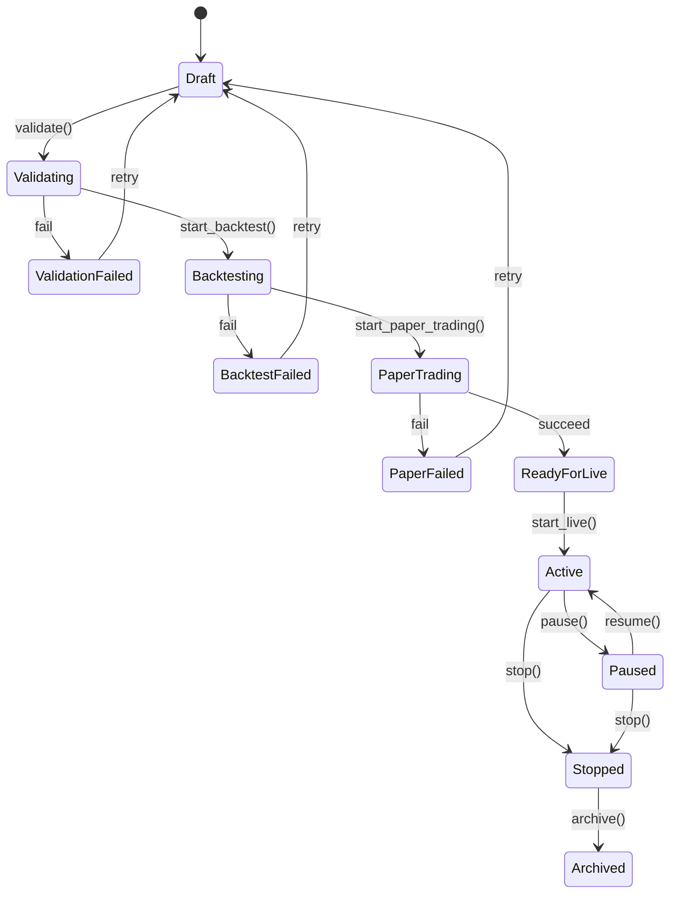
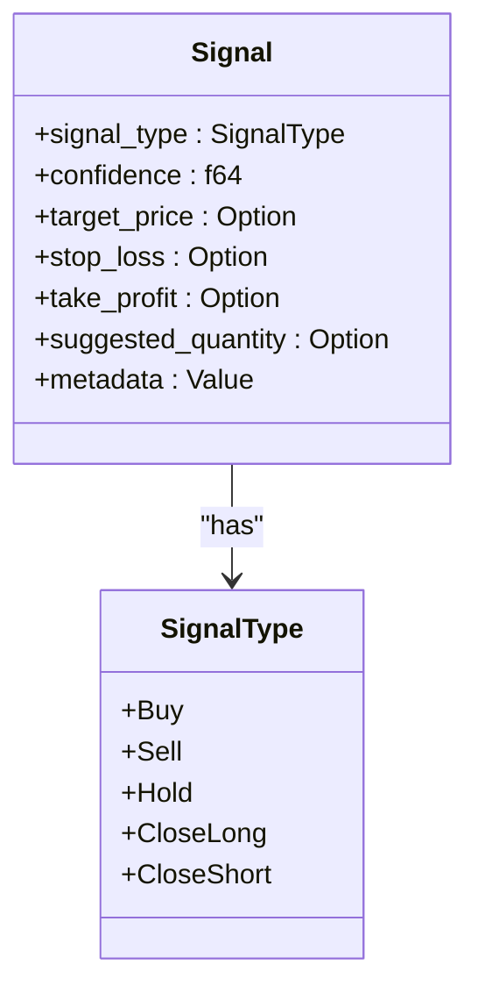
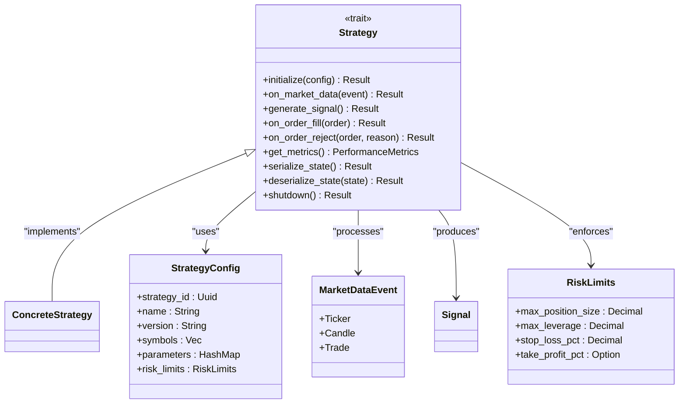
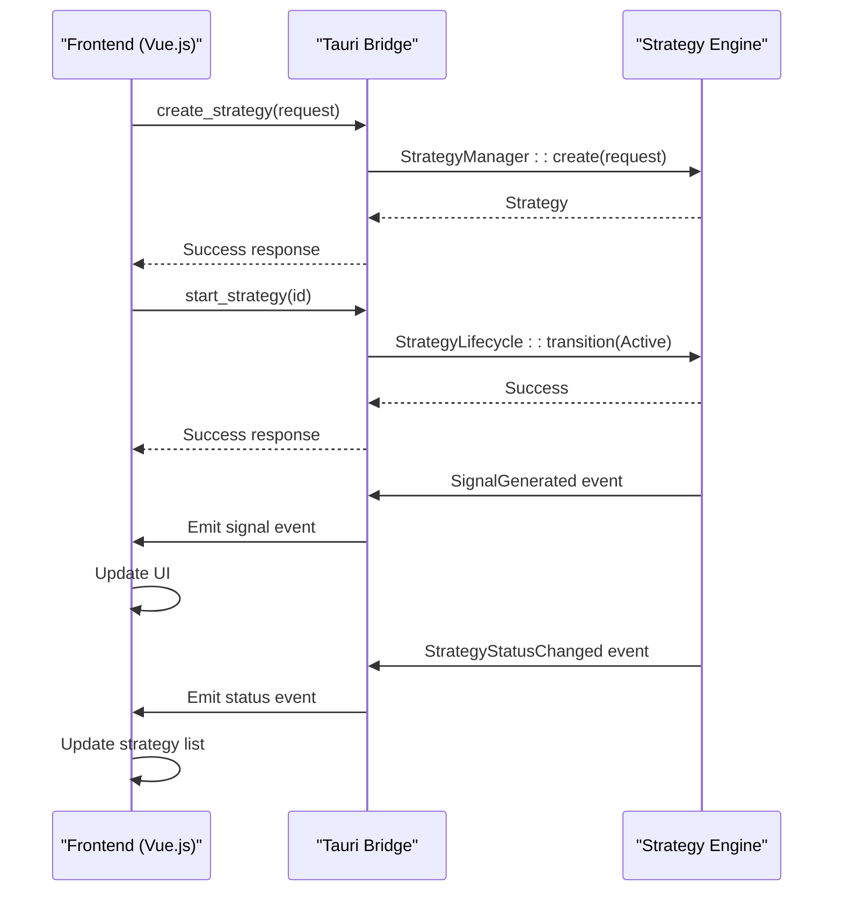
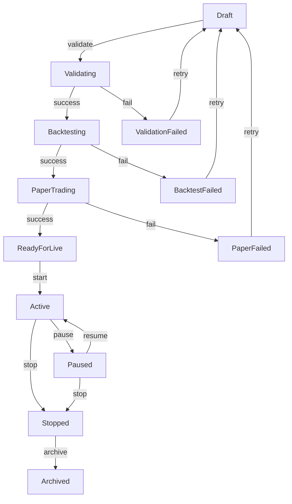
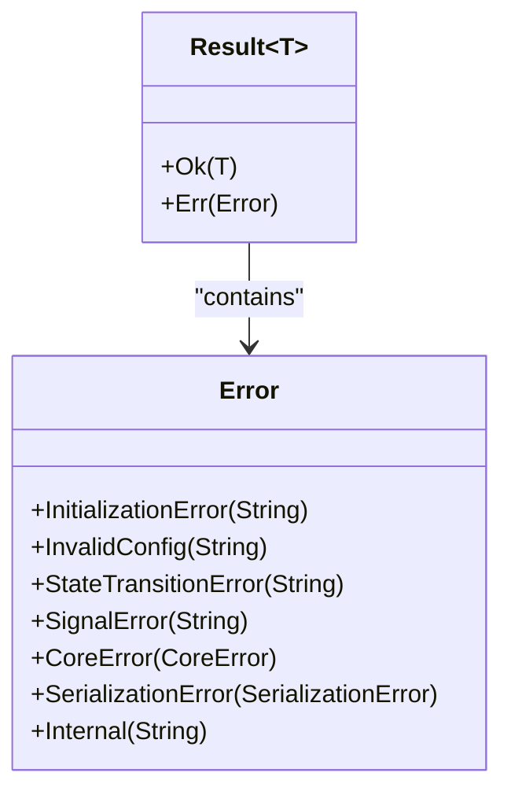

# Strategy API

<cite>
**Referenced Files in This Document**   
- [strategy.rs](file://crates/strategy/src/lib.rs)
- [lifecycle.rs](file://crates/strategy/src/lifecycle.rs)
- [signal.rs](file://crates/strategy/src/signal.rs)
- [traits.rs](file://crates/strategy/src/traits.rs)
- [error.rs](file://crates/strategy/src/error.rs)
- [strategy.rs](file://crates/core/src/models/strategy.rs)
- [strategy.rs](file://src-tauri/src/commands/strategy.rs)
- [simple_ma_crossover.rs](file://examples/simple_ma_crossover.rs)
- [rsi_strategy.rs](file://examples/rsi_strategy.rs)
</cite>

## Table of Contents
1. [Introduction](#introduction)
2. [Strategy Lifecycle Management](#strategy-lifecycle-management)
3. [Signal Generation System](#signal-generation-system)
4. [Core Strategy Interface](#core-strategy-interface)
5. [Strategy Commands API](#strategy-commands-api)
6. [Frontend Integration](#frontend-integration)
7. [State Transitions](#state-transitions)
8. [Error Handling](#error-handling)
9. [Performance Considerations](#performance-considerations)
10. [Example Implementations](#example-implementations)

## Introduction

The Strategy API provides a comprehensive framework for creating, managing, and executing trading strategies within the EA OKX Quantitative Trading System. This documentation details the command interface for strategy management, including lifecycle operations, signal generation, and integration with the frontend application.

The system is built around a trait-based architecture that enables pluggable strategy implementations while maintaining consistent state management, risk controls, and performance monitoring. Strategies progress through a well-defined state machine from creation to archival, with each state enforcing appropriate business rules and constraints.

**Section sources**
- [lib.rs](file://crates/strategy/src/lib.rs#L1-L25)
- [strategy.rs](file://crates/core/src/models/strategy.rs#L1-L306)

## Strategy Lifecycle Management

The strategy lifecycle is managed through a state machine that governs the progression of strategies from creation through various testing and production phases to eventual archival. The `StrategyLifecycle` struct enforces valid state transitions and maintains an audit trail of all state changes.

**Diagram sources**
- [lifecycle.rs](file://crates/strategy/src/lifecycle.rs#L7-L92)
- [strategy.rs](file://crates/core/src/models/strategy.rs#L14-L23)

**Section sources**
- [lifecycle.rs](file://crates/strategy/src/lifecycle.rs#L1-L129)
- [strategy.rs](file://crates/core/src/models/strategy.rs#L11-L23)

## Signal Generation System

The signal generation system provides a standardized interface for strategies to produce trading signals based on market conditions. Signals contain both the trading action and associated metadata that guides execution and risk management.

**Diagram sources**
- [signal.rs](file://crates/strategy/src/signal.rs#L6-L64)
- [traits.rs](file://crates/strategy/src/traits.rs#L18-L25)

**Section sources**
- [signal.rs](file://crates/strategy/src/signal.rs#L1-L65)

## Core Strategy Interface

The core strategy interface defines the contract that all trading strategies must implement. This trait-based approach enables polymorphic behavior while ensuring consistent initialization, market data processing, and lifecycle management across all strategy types.

**Diagram sources**
- [traits.rs](file://crates/strategy/src/traits.rs#L60-L89)
- [strategy.rs](file://crates/core/src/models/strategy.rs#L47-L66)

**Section sources**
- [traits.rs](file://crates/strategy/src/traits.rs#L1-L115)

## Strategy Commands API

The Tauri command API provides the bridge between the frontend application and the backend strategy engine. These async commands enable the frontend to manage strategies through their entire lifecycle.

### get_strategies
Retrieves all available strategies.

**Parameters**: None  
**Returns**: `Result<Vec<Strategy>, String>`  
**Error Conditions**: Backend service unavailable, database connection failure

### get_strategy
Retrieves a specific strategy by ID.

**Parameters**: 
- `id: String` - Strategy identifier  
**Returns**: `Result<Strategy, String>`  
**Error Conditions**: Strategy not found, invalid ID format

### create_strategy
Creates a new strategy with the specified configuration.

**Parameters**:
- `request: CreateStrategyRequest` - Strategy configuration  
**Returns**: `Result<Strategy, String>`  
**Error Conditions**: Invalid configuration, duplicate name, insufficient permissions

### update_strategy
Updates an existing strategy's configuration.

**Parameters**:
- `id: String` - Strategy identifier
- `request: CreateStrategyRequest` - Updated configuration  
**Returns**: `Result<Strategy, String>`  
**Error Conditions**: Strategy not found, invalid state for modification

### delete_strategy
Removes a strategy from the system.

**Parameters**:
- `id: String` - Strategy identifier  
**Returns**: `Result<(), String>`  
**Error Conditions**: Strategy in active state, insufficient permissions

### start_strategy
Activates a strategy, transitioning it to the Active state.

**Parameters**:
- `id: String` - Strategy identifier  
**Returns**: `Result<(), String>`  
**Error Conditions**: Strategy not in ReadyForLive state, validation failure

### stop_strategy
Stops an active strategy, transitioning it to the Stopped state.

**Parameters**:
- `id: String` - Strategy identifier  
**Returns**: `Result<(), String>`  
**Error Conditions**: Strategy not active, execution engine failure

### pause_strategy
Temporarily suspends an active strategy.

**Parameters**:
- `id: String` - Strategy identifier  
**Returns**: `Result<(), String>`  
**Error Conditions**: Strategy not active, state transition failure

### get_strategy_metrics
Retrieves performance metrics for a strategy.

**Parameters**:
- `id: String` - Strategy identifier  
**Returns**: `Result<StrategyMetrics, String>`  
**Error Conditions**: Strategy not found, metrics unavailable

**Section sources**
- [strategy.rs](file://src-tauri/src/commands/strategy.rs#L32-L152)

## Frontend Integration

The frontend integrates with the strategy system through Tauri commands and event listeners. The Vue.js application uses a store pattern to maintain strategy state and provides UI components for strategy management.

**Diagram sources**
- [strategy.rs](file://src-tauri/src/commands/strategy.rs#L68-L83)
- [strategy.rs](file://crates/strategy/src/lifecycle.rs#L52-L68)

**Section sources**
- [strategy.rs](file://src-tauri/src/commands/strategy.rs#L1-L152)

## State Transitions

The strategy state machine enforces a strict progression through development, testing, and production phases. Each transition validates business rules and updates audit timestamps.

**Diagram sources**
- [lifecycle.rs](file://crates/strategy/src/lifecycle.rs#L71-L92)
- [strategy.rs](file://crates/core/src/models/strategy.rs#L174-L188)

**Section sources**
- [lifecycle.rs](file://crates/strategy/src/lifecycle.rs#L52-L68)
- [strategy.rs](file://crates/core/src/models/strategy.rs#L174-L188)

## Error Handling

The strategy framework employs a comprehensive error handling system that categorizes failures by their source and severity. Errors are propagated through the Result type and translated to user-friendly messages in the frontend.

**Diagram sources**
- [error.rs](file://crates/strategy/src/error.rs#L5-L29)
- [traits.rs](file://crates/strategy/src/traits.rs#L3-L4)

**Section sources**
- [error.rs](file://crates/strategy/src/error.rs#L1-L32)

## Performance Considerations

The strategy framework is designed for high-performance trading with several optimization considerations:

1. **State Serialization**: Strategies implement hot-reload capability through efficient state serialization
2. **Event Processing**: Market data events are processed asynchronously to prevent blocking
3. **Memory Management**: Strategy state is kept minimal and optimized for fast serialization
4. **Concurrency**: Multiple strategies can run concurrently with isolated state

The system prioritizes low-latency signal generation while maintaining robust error handling and state consistency. Performance metrics are collected for each strategy to monitor efficiency and identify bottlenecks.

**Section sources**
- [traits.rs](file://crates/strategy/src/traits.rs#L81-L85)
- [lifecycle.rs](file://crates/strategy/src/lifecycle.rs#L24-L29)

## Example Implementations

The system includes example strategy implementations that demonstrate the framework's capabilities:

### Simple MA Crossover Strategy
A trend-following strategy using two moving averages (20 and 50 periods). Generates buy signals on golden crosses and sell signals on death crosses.

**Key Features**:
- Position sizing based on allocated capital
- Stop loss and take profit levels
- Entry/exit condition tracking

### RSI Mean Reversion Strategy
A mean-reversion strategy using Relative Strength Index (RSI) to identify overbought (>70) and oversold (<30) conditions.

**Key Features**:
- Dynamic RSI calculation
- Threshold-based signal generation
- Single position management

These examples illustrate how concrete strategies implement the core `Strategy` trait while encapsulating their specific trading logic and state management.

**Section sources**
- [simple_ma_crossover.rs](file://examples/simple_ma_crossover.rs#L1-L437)
- [rsi_strategy.rs](file://examples/rsi_strategy.rs#L1-L148)