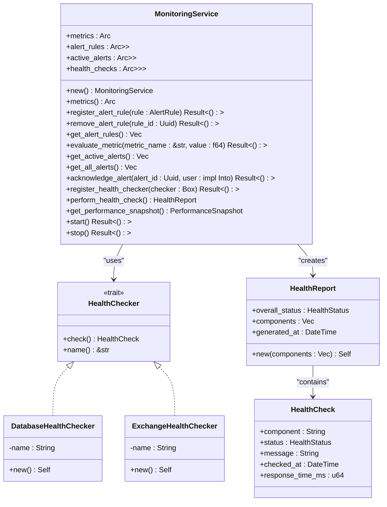
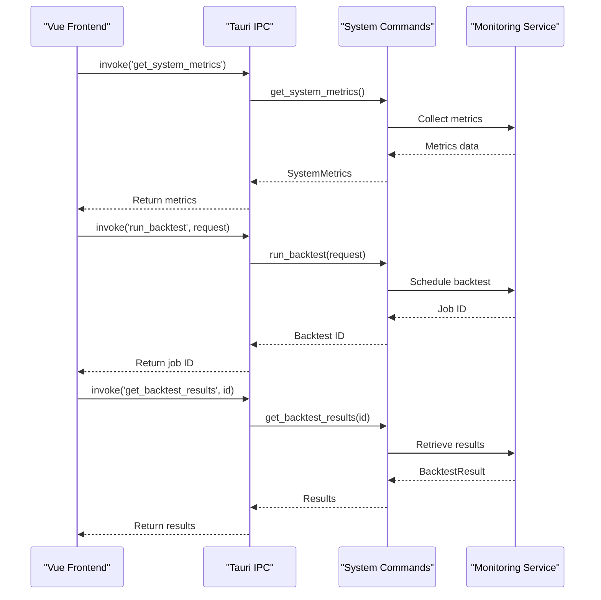

# System API

<cite>
**Referenced Files in This Document**   
- [system.rs](file://src-tauri/src/commands/system.rs)
- [service.rs](file://crates/monitoring/src/service.rs)
- [metrics.rs](file://crates/monitoring/src/metrics.rs)
- [lib.rs](file://src-tauri/src/lib.rs)
- [Settings.vue](file://src/views/Settings.vue)
- [useTauriEvents.ts](file://src/composables/useTauriEvents.ts)
</cite>

## Table of Contents
1. [Introduction](#introduction)
2. [System Commands API](#system-commands-api)
3. [Monitoring and Health Check Integration](#monitoring-and-health-check-integration)
4. [Frontend Integration and Usage](#frontend-integration-and-usage)
5. [Error Handling and Security Considerations](#error-handling-and-security-considerations)
6. [Performance Implications](#performance-implications)

## Introduction
The System API provides essential administrative and monitoring functionality for the EA OKX trading platform. This API enables users to retrieve system metrics, manage alerts, execute backtests, and monitor system health. The commands are implemented using Tauri's backend system and integrate with the monitoring crate to provide comprehensive system oversight capabilities.

**Section sources**
- [system.rs](file://src-tauri/src/commands/system.rs)
- [lib.rs](file://src-tauri/src/lib.rs)

## System Commands API

### get_system_metrics
Retrieves current system performance metrics including CPU usage, memory consumption, and trading activity.

**Parameters**: None

**Return Type**: `Result<SystemMetrics, String>`
- `SystemMetrics`: Contains CPU usage (f64), memory usage (f64), network latency (f64), active strategies (usize), and total orders (usize)

**Error Conditions**: Returns error string if metrics collection fails

**Section sources**
- [system.rs](file://src-tauri/src/commands/system.rs#L38-L49)

### get_alerts
Retrieves system alerts with optional limit parameter.

**Parameters**:
- `limit`: Optional usize parameter to limit the number of alerts returned

**Return Type**: `Result<Vec<Alert>, String>`
- `Alert`: Contains ID (String), level (String: INFO, WARNING, ERROR, CRITICAL), message (String), and timestamp (String)

**Error Conditions**: Returns error string if alert retrieval fails

**Section sources**
- [system.rs](file://src-tauri/src/commands/system.rs#L51-L56)

### run_backtest
Initiates a backtest execution for a specified strategy and time period.

**Parameters**:
- `request`: BacktestRequest containing strategy_id (String), symbol (String), start_date (String), end_date (String), and initial_capital (f64)

**Return Type**: `Result<String, String>`
- Returns backtest job ID as String on success

**Error Conditions**: Returns error string if backtest fails to start

**Section sources**
- [system.rs](file://src-tauri/src/commands/system.rs#L58-L65)

### get_backtest_results
Retrieves results for a completed backtest.

**Parameters**:
- `backtest_id`: String identifier for the backtest job

**Return Type**: `Result<BacktestResult, String>`
- `BacktestResult`: Contains total_return (f64), sharpe_ratio (f64), max_drawdown (f64), win_rate (f64), and total_trades (usize)

**Error Conditions**: Returns error string if results cannot be retrieved or backtest is not found

**Section sources**
- [system.rs](file://src-tauri/src/commands/system.rs#L67-L79)

## Monitoring and Health Check Integration

**Diagram sources**
- [service.rs](file://crates/monitoring/src/service.rs#L11-L374)
- [metrics.rs](file://crates/monitoring/src/metrics.rs#L1-L104)

The system commands interface with the monitoring infrastructure through the MonitoringService, which coordinates health checks, metrics collection, and alerting. The service implements the HealthChecker trait for various system components and generates comprehensive health reports.

**Section sources**
- [service.rs](file://crates/monitoring/src/service.rs#L1-L374)
- [metrics.rs](file://crates/monitoring/src/metrics.rs#L1-L104)

## Frontend Integration and Usage

**Diagram sources**
- [system.rs](file://src-tauri/src/commands/system.rs#L38-L79)
- [lib.rs](file://src-tauri/src/lib.rs#L24-L55)

The frontend integrates with system commands through Tauri's invoke pattern. The Settings.vue component demonstrates how system configuration and monitoring features are exposed to users, including notification preferences and system settings management.

**Section sources**
- [Settings.vue](file://src/views/Settings.vue#L271-L339)
- [useTauriEvents.ts](file://src/composables/useTauriEvents.ts)

## Error Handling and Security Considerations

The system commands implement robust error handling through Rust's Result type, returning descriptive error strings when operations fail. All commands are registered in the Tauri invoke handler, providing a secure interface between the frontend and backend.

Security considerations include:
- Command-level access control through Tauri's permission system
- Input validation for all parameters
- Error messages that don't expose sensitive system information
- Structured logging for audit trails

The architecture supports future implementation of authentication and authorization for sensitive operations.

**Section sources**
- [system.rs](file://src-tauri/src/commands/system.rs)
- [lib.rs](file://src-tauri/src/lib.rs#L24-L55)

## Performance Implications

System commands are designed for minimal performance impact:
- Asynchronous execution prevents UI blocking
- Lightweight metrics collection with configurable sampling
- Efficient data structures for alert management
- Caching mechanisms for frequently accessed data

The monitoring service is optimized for low overhead, with health checks executed on demand rather than continuously. Backtest operations are designed to run in the background without affecting real-time trading performance.

**Section sources**
- [system.rs](file://src-tauri/src/commands/system.rs)
- [service.rs](file://crates/monitoring/src/service.rs)