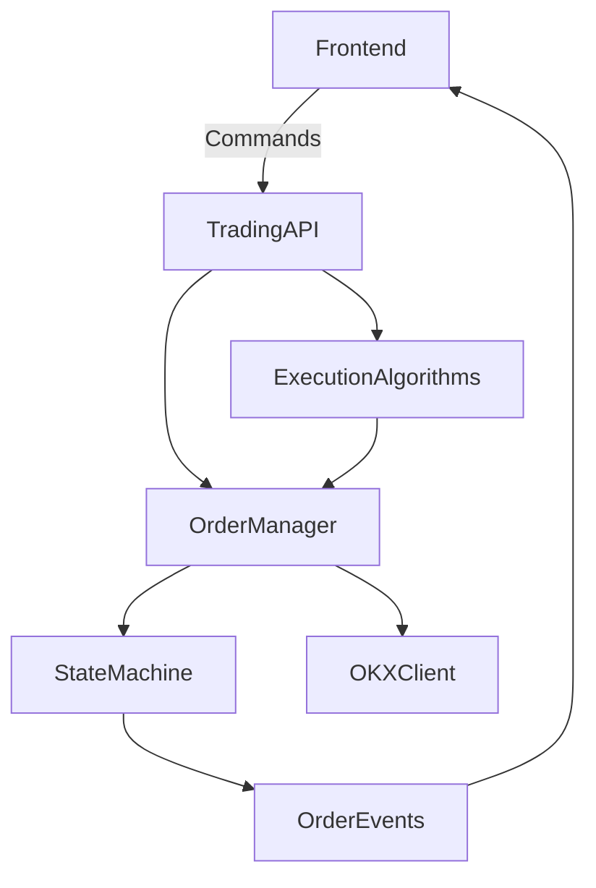
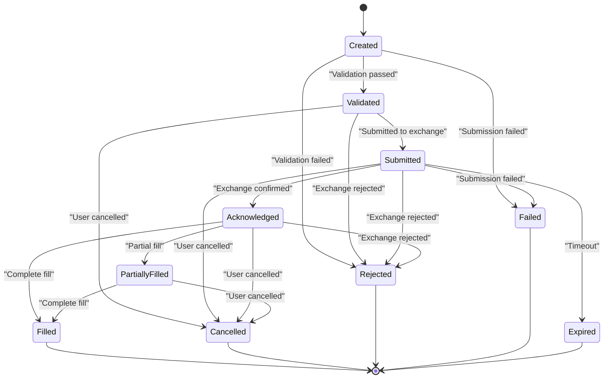
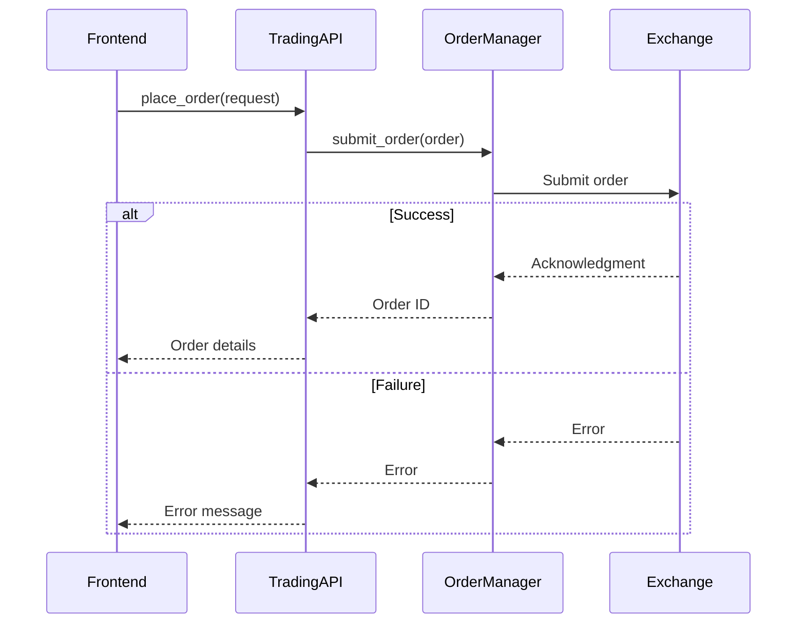

# Trading API

<cite>
**Referenced Files in This Document**   
- [trading.rs](file://src-tauri/src/commands/trading.rs)
- [order_manager.rs](file://crates/trading/src/order_manager.rs)
- [algorithms.rs](file://crates/trading/src/algorithms.rs)
- [state_machine.rs](file://crates/trading/src/state_machine.rs)
- [order.rs](file://crates/core/src/models/order.rs)
- [types.rs](file://crates/core/src/types.rs)
</cite>

## Table of Contents
1. [Introduction](#introduction)
2. [Core Components](#core-components)
3. [Order Management API](#order-management-api)
4. [Execution Algorithms](#execution-algorithms)
5. [Order State Management](#order-state-management)
6. [Frontend Integration](#frontend-integration)
7. [Error Handling](#error-handling)
8. [Performance Considerations](#performance-considerations)

## Introduction
The Trading API provides a comprehensive interface for managing orders, executing trading strategies, and monitoring positions within the EA OKX system. This documentation details the available commands, their parameters, return types, and error conditions. The API serves as the bridge between the frontend user interface and the backend trading execution components, enabling users to place orders, manage positions, and retrieve trading status.

The system is built around a robust order management architecture that handles order validation, state transitions, and reconciliation with the exchange. Execution algorithms such as TWAP and VWAP provide sophisticated order slicing capabilities to minimize market impact. The API is designed to be both powerful and accessible, supporting both simple market orders and complex algorithmic trading strategies.

**Section sources**
- [trading.rs](file://src-tauri/src/commands/trading.rs#L1-L109)

## Core Components
The trading module consists of several key components that work together to provide a complete trading solution. The Order Manager handles the lifecycle of orders from creation to completion, while the Execution Algorithms implement sophisticated order slicing strategies. The State Machine manages the state transitions of orders throughout their lifecycle, ensuring consistency and proper error handling.

These components are designed to be modular and extensible, allowing for the addition of new execution algorithms and trading strategies without modifying the core architecture. The system uses a publish-subscribe pattern for event notification, enabling real-time updates to the frontend and other components.



**Diagram sources**
- [order_manager.rs](file://crates/trading/src/order_manager.rs#L1-L374)
- [algorithms.rs](file://crates/trading/src/algorithms.rs#L1-L526)
- [state_machine.rs](file://crates/trading/src/state_machine.rs#L1-L271)

**Section sources**
- [order_manager.rs](file://crates/trading/src/order_manager.rs#L1-L374)
- [algorithms.rs](file://crates/trading/src/algorithms.rs#L1-L526)
- [state_machine.rs](file://crates/trading/src/state_machine.rs#L1-L271)

## Order Management API
The Order Management API provides functions for placing, canceling, and retrieving orders. These functions handle order validation, submission to the exchange, and state management throughout the order lifecycle.

### place_order
Submits a new order to the trading system.

**Parameters:**
- `symbol`: Trading pair symbol (e.g., "BTC-USDT")
- `side`: Order side ("Buy" or "Sell")
- `order_type`: Order type ("Market", "Limit", "PostOnly", etc.)
- `quantity`: Order quantity
- `price`: Limit price (optional, required for limit orders)

**Return Type:** `Result<Order, String>`
Returns the created order on success, or an error message on failure.

**Error Conditions:**
- Invalid symbol format
- Invalid order side
- Invalid order type
- Non-positive quantity
- Missing price for limit orders

**Section sources**
- [trading.rs](file://src-tauri/src/commands/trading.rs#L37-L53)

### cancel_order
Cancels an existing order.

**Parameters:**
- `order_id`: ID of the order to cancel

**Return Type:** `Result<(), String>`
Returns Ok on success, or an error message on failure.

**Error Conditions:**
- Order not found
- Order cannot be cancelled in current state (e.g., already filled)

**Section sources**
- [trading.rs](file://src-tauri/src/commands/trading.rs#L56-L62)

### get_open_orders
Retrieves all currently open orders.

**Return Type:** `Result<Vec<Order>, String>`
Returns a list of open orders on success, or an error message on failure.

**Error Conditions:**
- Backend service unavailable

**Section sources**
- [trading.rs](file://src-tauri/src/commands/trading.rs#L64-L71)

### get_order_history
Retrieves historical orders.

**Parameters:**
- `limit`: Maximum number of orders to return (optional)

**Return Type:** `Result<Vec<Order>, String>`
Returns a list of historical orders on success, or an error message on failure.

**Error Conditions:**
- Backend service unavailable

**Section sources**
- [trading.rs](file://src-tauri/src/commands/trading.rs#L73-L80)

## Execution Algorithms
The trading system includes sophisticated execution algorithms designed to minimize market impact and achieve optimal execution prices. These algorithms slice large orders into smaller pieces and execute them according to specific strategies.

### TWAP (Time-Weighted Average Price)
The TWAP algorithm executes an order by dividing it into equal slices and executing them at regular time intervals.

**Configuration Parameters:**
- `total_quantity`: Total quantity to execute
- `duration_minutes`: Duration of execution in minutes
- `slice_interval_seconds`: Interval between slices in seconds
- `randomization_pct`: Randomization percentage (0-25) to avoid predictability
- `order_type`: Order type for child orders
- `price_offset_bps`: Price offset in basis points
- `aggressive_on_final`: Use market order for final slice

**Return Type:** `Result<TwapResult, Error>`
Returns execution statistics including total executed quantity, average price, and slice details.

**Error Conditions:**
- Invalid configuration parameters
- Order submission failures
- Network connectivity issues

**Section sources**
- [algorithms.rs](file://crates/trading/src/algorithms.rs#L13-L344)

### VWAP (Volume-Weighted Average Price)
The VWAP algorithm executes an order based on historical volume patterns, allocating more volume during periods of higher market activity.

**Configuration Parameters:**
- `total_quantity`: Total quantity to execute
- `start_time`: Start time for execution
- `end_time`: End time for execution
- `volume_profile`: Historical volume profile (hour -> volume percentage)
- `min_slice_size`: Minimum slice size
- `price_offset_bps`: Price offset in basis points

**Return Type:** `Result<VwapResult, Error>`
Returns execution statistics including total executed quantity, average price, and VWAP deviation.

**Error Conditions:**
- Invalid configuration parameters
- Order submission failures
- Network connectivity issues

**Section sources**
- [algorithms.rs](file://crates/trading/src/algorithms.rs#L52-L507)

## Order State Management
The order state management system tracks the lifecycle of orders through various states, ensuring proper state transitions and providing visibility into order status.

### Order States
The system defines the following order states:
- **Created**: Order created but not validated
- **Validated**: Passed pre-trade validation
- **Submitted**: Submitted to exchange
- **Acknowledged**: Acknowledged by exchange
- **PartiallyFilled**: Partially filled
- **Filled**: Completely filled
- **Cancelled**: Cancelled by user/system
- **Rejected**: Rejected by exchange
- **Failed**: Failed to submit
- **Expired**: Expired due to timeout



**Diagram sources**
- [state_machine.rs](file://crates/trading/src/state_machine.rs#L8-L31)

**Section sources**
- [state_machine.rs](file://crates/trading/src/state_machine.rs#L8-L271)

## Frontend Integration
The frontend integrates with the trading API through Tauri commands, providing a user-friendly interface for trading activities. The integration follows a consistent pattern across all trading functions.

### Example: Placing an Order
```typescript
import { invoke } from '@tauri-apps/api/tauri';

interface PlaceOrderRequest {
  symbol: string;
  side: string;
  order_type: string;
  quantity: number;
  price?: number;
}

async function placeOrder(request: PlaceOrderRequest) {
  try {
    const order = await invoke('place_order', { request });
    console.log('Order placed:', order);
    return order;
  } catch (error) {
    console.error('Failed to place order:', error);
    throw error;
  }
}

// Usage
placeOrder({
  symbol: 'BTC-USDT',
  side: 'Buy',
  order_type: 'Limit',
  quantity: 0.01,
  price: 45000
});
```

### Example: Managing Positions
```typescript
import { invoke } from '@tauri-apps/api/tauri';

async function getPositions() {
  try {
    const positions = await invoke('get_positions');
    console.log('Current positions:', positions);
    return positions;
  } catch (error) {
    console.error('Failed to get positions:', error);
    throw error;
  }
}

async function closePosition(symbol: string) {
  try {
    await invoke('close_position', { symbol });
    console.log(`Position ${symbol} closed`);
  } catch (error) {
    console.error(`Failed to close position ${symbol}:`, error);
    throw error;
  }
}
```

**Section sources**
- [trading.rs](file://src-tauri/src/commands/trading.rs#L1-L109)

## Error Handling
The trading system implements comprehensive error handling to ensure reliability and provide meaningful feedback to users.

### Error Types
The system defines several error types:
- **InvalidStateTransition**: Attempted invalid state transition
- **OrderNotFound**: Order not found in the system
- **ReconciliationError**: Error during order reconciliation
- **TimeoutError**: Operation timed out
- **ExecutionError**: General execution error
- **CoreError**: Error from core components
- **ClientError**: Error from OKX client

### Error Propagation
Errors are propagated through the system using the Result type, allowing for proper handling at each level. The frontend receives error messages as strings, providing user-friendly error information.



**Diagram sources**
- [order_manager.rs](file://crates/trading/src/order_manager.rs#L1-L374)
- [error.rs](file://crates/trading/src/error.rs#L1-L31)

**Section sources**
- [error.rs](file://crates/trading/src/error.rs#L1-L31)
- [order_manager.rs](file://crates/trading/src/order_manager.rs#L1-L374)

## Performance Considerations
The trading system is designed with performance in mind, implementing several optimizations to ensure low latency and high throughput.

### Order Submission
Order submission is designed to be non-blocking, with the actual submission to the exchange handled asynchronously. This allows the system to accept orders quickly while handling the potentially slower exchange communication in the background.

### Reconciliation
The system performs periodic reconciliation of orders with the exchange to ensure state consistency. The reconciliation interval is configurable, allowing users to balance between real-time accuracy and system load.

### Caching
The system maintains an in-memory cache of active orders, providing fast access to order status without requiring database queries. This cache is updated in real-time as orders progress through their lifecycle.

### Scalability
The system is designed to handle multiple concurrent orders and users. The use of asynchronous programming and efficient data structures ensures that performance remains consistent even under heavy load.

**Section sources**
- [order_manager.rs](file://crates/trading/src/order_manager.rs#L278-L336)
- [algorithms.rs](file://crates/trading/src/algorithms.rs#L1-L526)