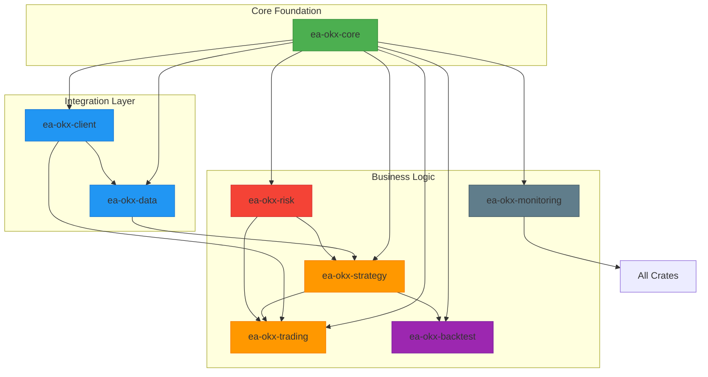
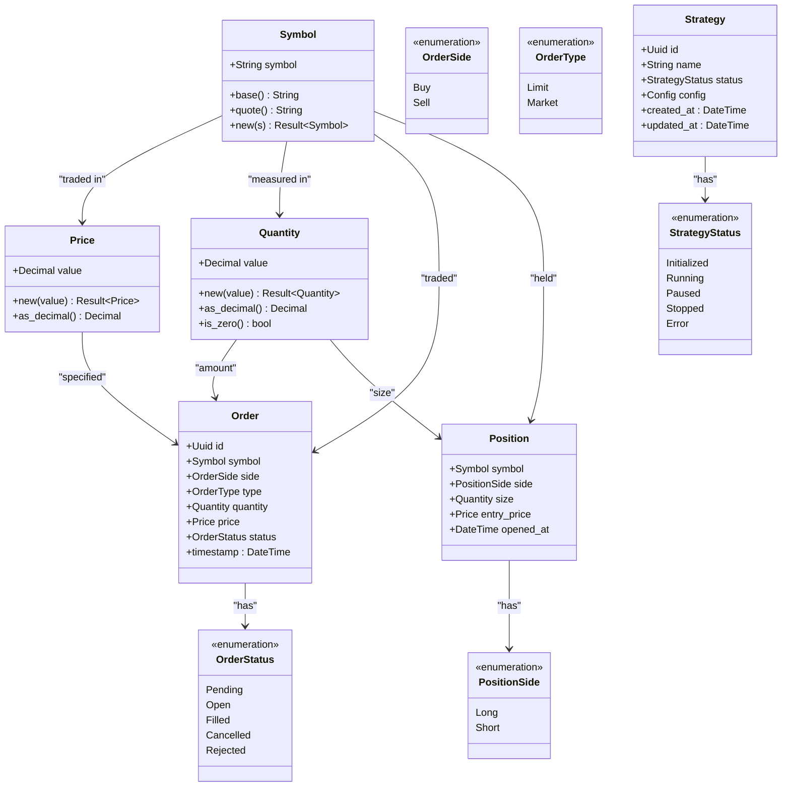
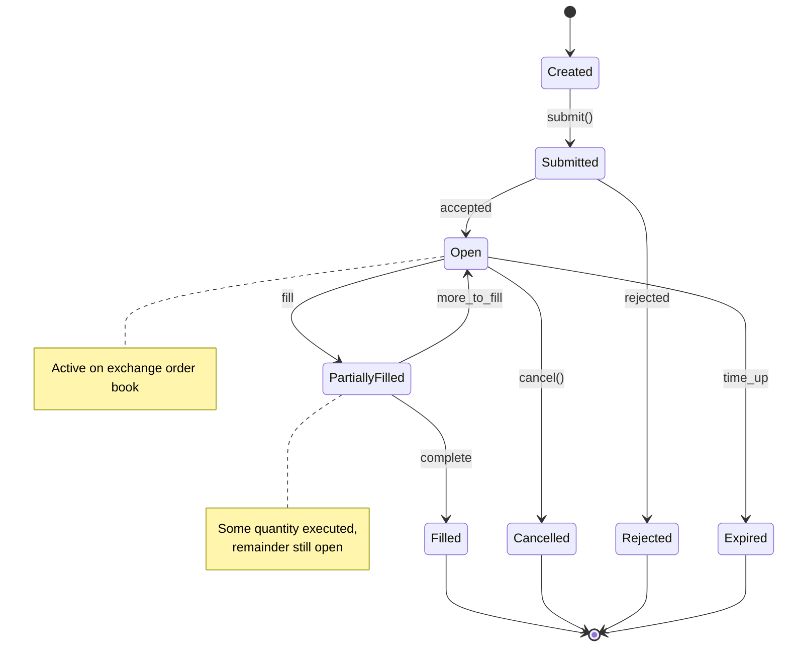

# Backend Architecture

<cite>
**Referenced Files in This Document**   
- [core/Cargo.toml](file://crates/core/Cargo.toml)
- [core/src/lib.rs](file://crates/core/src/lib.rs)
- [core/src/types.rs](file://crates/core/src/types.rs)
- [core/src/models/mod.rs](file://crates/core/src/models/mod.rs)
- [okx-client/Cargo.toml](file://crates/okx-client/Cargo.toml)
- [okx-client/src/lib.rs](file://crates/okx-client/src/lib.rs)
- [data/Cargo.toml](file://crates/data/Cargo.toml)
- [data/src/lib.rs](file://crates/data/src/lib.rs)
- [backtest/Cargo.toml](file://crates/backtest/Cargo.toml)
- [backtest/src/lib.rs](file://crates/backtest/src/lib.rs)
- [trading/Cargo.toml](file://crates/trading/Cargo.toml)
- [trading/src/lib.rs](file://crates/trading/src/lib.rs)
- [risk/Cargo.toml](file://crates/risk/Cargo.toml)
- [risk/src/lib.rs](file://crates/risk/src/lib.rs)
- [strategy/Cargo.toml](file://crates/strategy/Cargo.toml)
- [strategy/src/lib.rs](file://crates/strategy/src/lib.rs)
- [monitoring/Cargo.toml](file://crates/monitoring/Cargo.toml)
- [monitoring/src/lib.rs](file://crates/monitoring/src/lib.rs)
</cite>

## Table of Contents
1. [Introduction](#introduction)
2. [Modular Monorepo Architecture](#modular-monorepo-architecture)
3. [Core Models and Types](#core-models-and-types)
4. [OKX Client Integration](#okx-client-integration)
5. [Data Layer](#data-layer)
6. [Strategy Framework](#strategy-framework)
7. [Backtesting Engine](#backtesting-engine)
8. [Trading Execution System](#trading-execution-system)
9. [Risk Management](#risk-management)
10. [Monitoring System](#monitoring-system)
11. [Inter-Crate Dependencies and Communication](#inter-crate-dependencies-and-communication)

## Introduction
The EA OKX backend system is a modular monorepo architecture designed for quantitative trading on the OKX exchange. Built in Rust, it emphasizes type safety, performance, and maintainability through a crate-based modular design. The system integrates market data collection, strategy execution, risk management, backtesting, and monitoring into a cohesive platform for algorithmic trading.

## Modular Monorepo Architecture
The system follows a monorepo structure with independent crates for different functional concerns, enabling clear separation of responsibilities while maintaining shared type safety through the core crate. Each crate is independently testable and can evolve without affecting unrelated components.

**Diagram sources**
- [core/Cargo.toml](file://crates/core/Cargo.toml)
- [okx-client/Cargo.toml](file://crates/okx-client/Cargo.toml)
- [data/Cargo.toml](file://crates/data/Cargo.toml)
- [strategy/Cargo.toml](file://crates/strategy/Cargo.toml)
- [trading/Cargo.toml](file://crates/trading/Cargo.toml)
- [risk/Cargo.toml](file://crates/risk/Cargo.toml)
- [backtest/Cargo.toml](file://crates/backtest/Cargo.toml)
- [monitoring/Cargo.toml](file://crates/monitoring/Cargo.toml)

**Section sources**
- [core/Cargo.toml](file://crates/core/Cargo.toml)
- [okx-client/Cargo.toml](file://crates/okx-client/Cargo.toml)
- [data/Cargo.toml](file://crates/data/Cargo.toml)
- [backtest/Cargo.toml](file://crates/backtest/Cargo.toml)
- [trading/Cargo.toml](file://crates/trading/Cargo.toml)
- [risk/Cargo.toml](file://crates/risk/Cargo.toml)
- [strategy/Cargo.toml](file://crates/strategy/Cargo.toml)
- [monitoring/Cargo.toml](file://crates/monitoring/Cargo.toml)

## Core Models and Types
The `ea-okx-core` crate provides foundational domain models and types used across all system components. These types ensure consistency, precision, and validation throughout the trading system.

### Symbol, Price, and Quantity
The core types `Symbol`, `Price`, and `Quantity` provide type-safe representations of trading entities with built-in validation:

- **Symbol**: Represents trading pairs (e.g., BTC-USDT) with format validation and parsing
- **Price**: Wraps `rust_decimal::Decimal` with validation to ensure positive values
- **Quantity**: Represents position sizes with non-negative validation

These types enforce business rules at the type level, preventing invalid states from propagating through the system.

### Order and Position Models
The core crate defines comprehensive models for trading entities:

- **Order**: Represents buy/sell instructions with type (limit/market), side (buy/sell), status, and execution details
- **Position**: Tracks open positions with side (long/short), entry price, and current size
- **Trade**: Represents executed transactions with price, quantity, and timestamp

### Strategy Model
The `Strategy` model in the core crate defines the configuration and state for trading strategies, including parameters, risk limits, and operational status.

**Diagram sources**
- [core/src/lib.rs](file://crates/core/src/lib.rs)
- [core/src/types.rs](file://crates/core/src/types.rs)
- [core/src/models/mod.rs](file://crates/core/src/models/mod.rs)

**Section sources**
- [core/src/lib.rs](file://crates/core/src/lib.rs)
- [core/src/types.rs](file://crates/core/src/types.rs)
- [core/src/models/mod.rs](file://crates/core/src/models/mod.rs)

## OKX Client Integration
The `ea-okx-client` crate provides comprehensive integration with the OKX cryptocurrency exchange API, supporting both REST and WebSocket interfaces for market data and trading operations.

### REST API Client
The REST client (`OkxRestClient`) handles authenticated HTTP requests to the OKX API with:
- Automatic signature generation for private endpoints
- Rate limiting and retry logic
- Type-safe request and response models
- Comprehensive error handling

### WebSocket Client
The WebSocket client (`OkxWebSocketClient`) enables real-time market data streaming with:
- Connection management and reconnection logic
- Message parsing and deserialization
- Subscription management for multiple instruments
- Heartbeat monitoring and latency measurement

The client abstracts the complexities of the OKX API while providing a clean, idiomatic Rust interface for market data and order execution.

**Section sources**
- [okx-client/Cargo.toml](file://crates/okx-client/Cargo.toml)
- [okx-client/src/lib.rs](file://crates/okx-client/src/lib.rs)

## Data Layer
The `ea-okx-data` crate handles market data collection, quality control, and storage, forming the foundation for reliable trading decisions.

### Responsibilities
- **Collection**: Ingests market data from OKX WebSocket streams
- **Quality Control**: Validates data integrity, detects anomalies, and removes duplicates
- **Storage**: Persists data to TimescaleDB (PostgreSQL) and Redis for different access patterns
- **Enrichment**: Adds metadata and derived indicators to raw market data

The data layer ensures that downstream components receive clean, reliable, and timely market information.

**Section sources**
- [data/Cargo.toml](file://crates/data/Cargo.toml)
- [data/src/lib.rs](file://crates/data/src/lib.rs)

## Strategy Framework
The `ea-okx-strategy` crate provides a flexible framework for implementing trading strategies with a standardized interface and lifecycle management.

### Async Trait Interface
Strategies implement an async trait interface that defines methods for:
- Initialization and configuration
- Market data processing
- Signal generation
- Position management
- State persistence

This interface enables consistent integration with the execution and backtesting systems.

### 12-State Lifecycle
The strategy framework implements a comprehensive 12-state lifecycle that manages strategy execution from creation to termination, including states for:
- Initialization and configuration
- Warm-up and data collection
- Active trading
- Risk events and pauses
- Graceful shutdown

This lifecycle ensures proper resource management and state consistency across different operational scenarios.

**Section sources**
- [strategy/Cargo.toml](file://crates/strategy/Cargo.toml)
- [strategy/src/lib.rs](file://crates/strategy/src/lib.rs)

## Backtesting Engine
The `ea-okx-backtest` crate provides an event-driven simulation environment for evaluating trading strategies against historical data.

### Event-Driven Simulation
The engine processes a timeline of market events (price updates, trades) and strategy signals through an event loop that:
- Orders events chronologically
- Processes market data to update strategy state
- Executes simulated trades with realistic slippage and commission models
- Tracks portfolio performance and metrics

### Performance Metrics
The backtesting system calculates comprehensive performance metrics including:
- Return on investment (ROI)
- Sharpe ratio
- Maximum drawdown
- Win rate and profit factor
- Trade duration statistics

These metrics enable quantitative evaluation of strategy performance under historical market conditions.

**Section sources**
- [backtest/Cargo.toml](file://crates/backtest/Cargo.toml)
- [backtest/src/lib.rs](file://crates/backtest/src/lib.rs)

## Trading Execution System
The `ea-okx-trading` crate manages the execution of trading orders with sophisticated algorithms and state management.

### Order State Machine
The system implements a finite state machine for order lifecycle management with states including:
- Created
- Submitted
- Open
- Partially Filled
- Filled
- Cancelled
- Rejected
- Expired

This state machine ensures consistent order tracking and enables reliable execution monitoring.

### Execution Algorithms
The trading system includes algorithmic execution strategies such as:
- **TWAP (Time-Weighted Average Price)**: Splits large orders across time intervals
- **VWAP (Volume-Weighted Average Price)**: Schedules execution based on historical volume patterns

These algorithms minimize market impact when executing large orders.

**Diagram sources**
- [trading/src/lib.rs](file://crates/trading/src/lib.rs)

**Section sources**
- [trading/Cargo.toml](file://crates/trading/Cargo.toml)
- [trading/src/lib.rs](file://crates/trading/src/lib.rs)

## Risk Management
The `ea-okx-risk` crate provides comprehensive risk controls to protect trading capital and ensure regulatory compliance.

### Validators
The system implements pre-trade validation rules that check:
- Position size limits
- Concentration risk
- Volatility exposure
- Daily loss limits
- Strategy-specific constraints

These validators prevent orders that would violate risk parameters from being submitted.

### VaR Calculations
The risk system includes Value-at-Risk (VaR) calculations using multiple methods:
- Historical simulation
- Parametric (variance-covariance)
- Monte Carlo simulation

VaR metrics provide quantitative estimates of potential losses under normal market conditions.

**Section sources**
- [risk/Cargo.toml](file://crates/risk/Cargo.toml)
- [risk/src/lib.rs](file://crates/risk/src/lib.rs)

## Monitoring System
The `ea-okx-monitoring` crate provides observability through metrics collection and alerting capabilities.

### Metrics
The system exports comprehensive metrics including:
- System health (CPU, memory, latency)
- Trading performance (P&L, win rate)
- Market data quality (gap detection, latency)
- Strategy execution (order fill rates, slippage)

These metrics are exposed via Prometheus for visualization and alerting.

### Alerting
The monitoring system supports configurable alerts for:
- Abnormal market conditions
- Strategy performance degradation
- System health issues
- Risk limit breaches

Alerts can be routed to multiple destinations including email, Slack, and SMS.

**Section sources**
- [monitoring/Cargo.toml](file://crates/monitoring/Cargo.toml)
- [monitoring/src/lib.rs](file://crates/monitoring/src/lib.rs)

## Inter-Crate Dependencies and Communication
The system follows a dependency hierarchy where higher-level crates depend on lower-level ones, with the core crate serving as the foundation.

### Dependency Graph
- **core**: No dependencies; used by all other crates
- **okx-client**: Depends on core; used by data, trading, and strategy
- **data**: Depends on core and okx-client; used by strategy and backtest
- **strategy**: Depends on core; used by trading, backtest, and risk
- **trading**: Depends on core and okx-client; uses strategy and risk
- **risk**: Depends on core; used by trading and strategy
- **backtest**: Depends on core and strategy; uses data when enabled
- **monitoring**: Depends on core; used by all components

### Communication Patterns
Components communicate through:
- **Synchronous function calls** for direct dependencies
- **Event-driven messaging** for decoupled components
- **Shared state** (with appropriate concurrency controls) for real-time data
- **Configuration objects** for parameter passing

This architecture enables both tight integration where needed and loose coupling for independent evolution.

**Section sources**
- [core/Cargo.toml](file://crates/core/Cargo.toml)
- [okx-client/Cargo.toml](file://crates/okx-client/Cargo.toml)
- [data/Cargo.toml](file://crates/data/Cargo.toml)
- [backtest/Cargo.toml](file://crates/backtest/Cargo.toml)
- [trading/Cargo.toml](file://crates/trading/Cargo.toml)
- [risk/Cargo.toml](file://crates/risk/Cargo.toml)
- [strategy/Cargo.toml](file://crates/strategy/Cargo.toml)
- [monitoring/Cargo.toml](file://crates/monitoring/Cargo.toml)