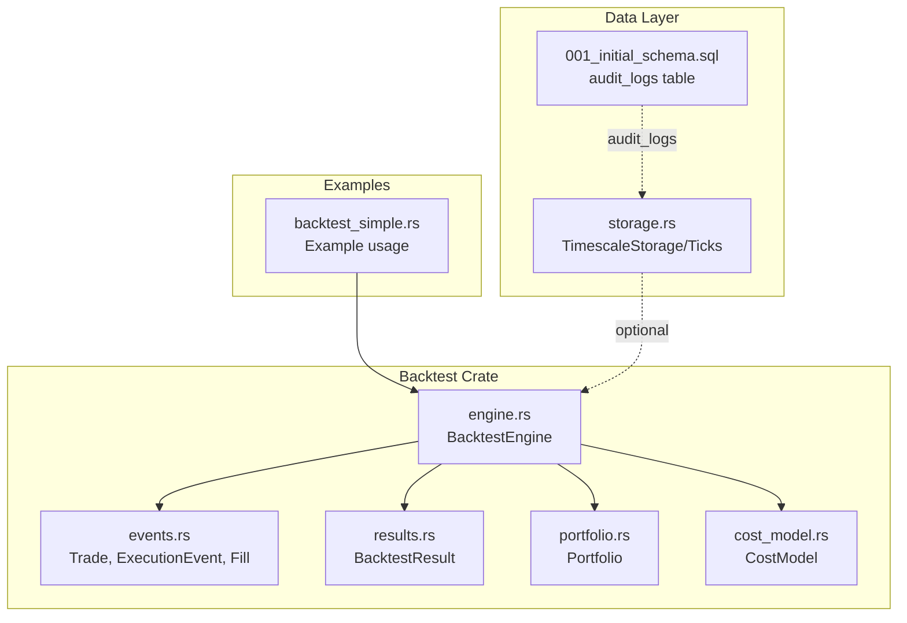
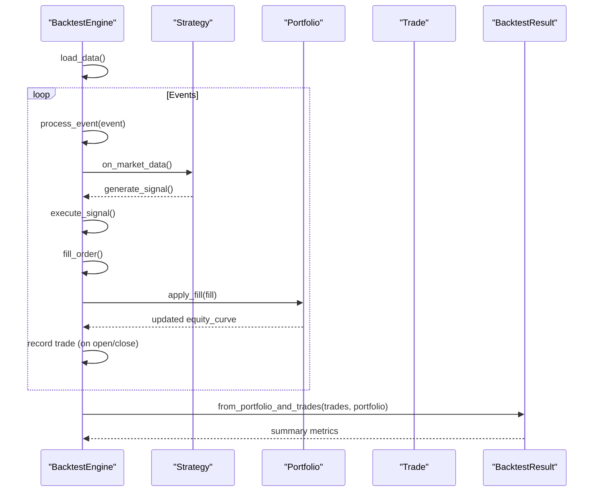
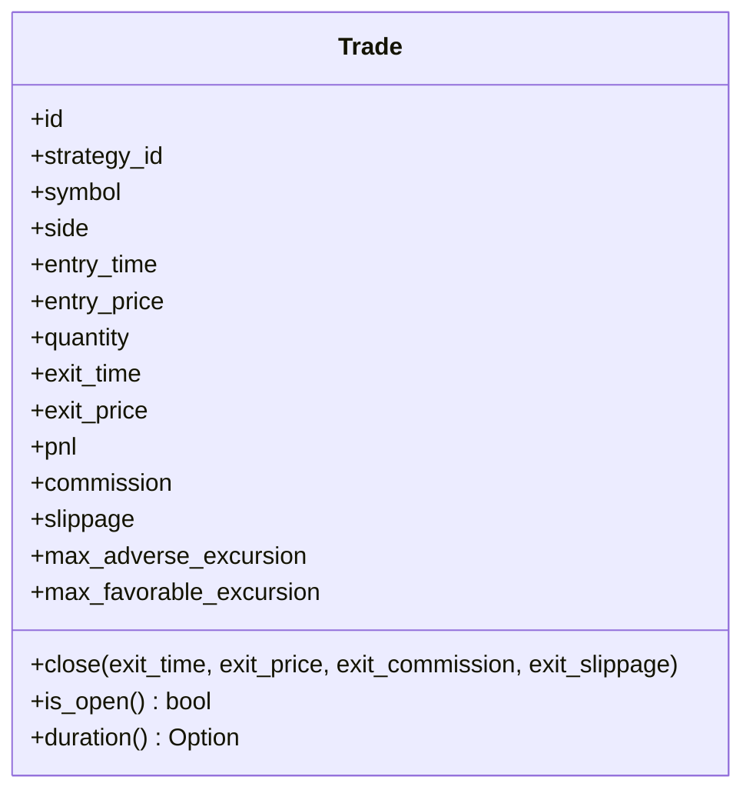
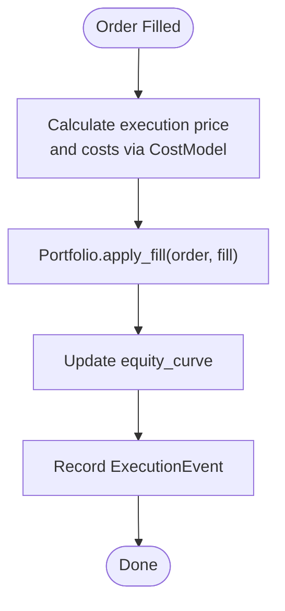
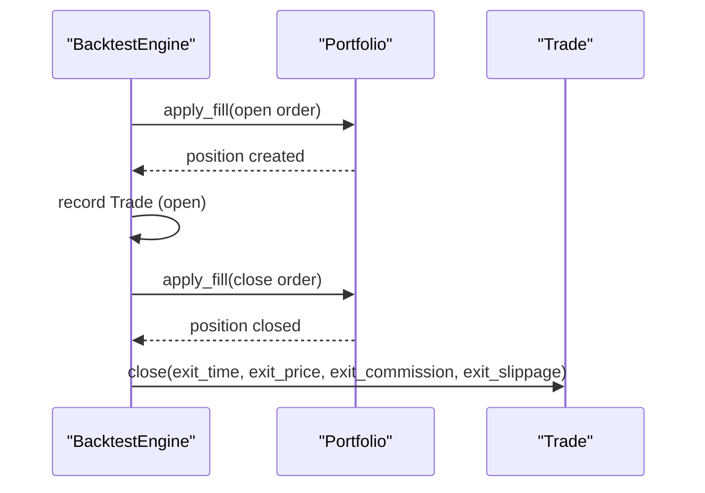
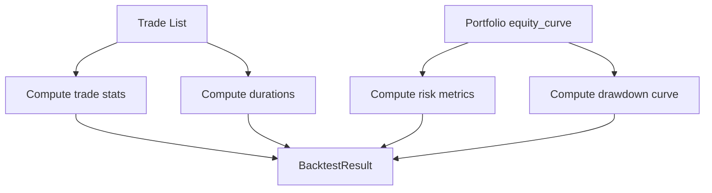
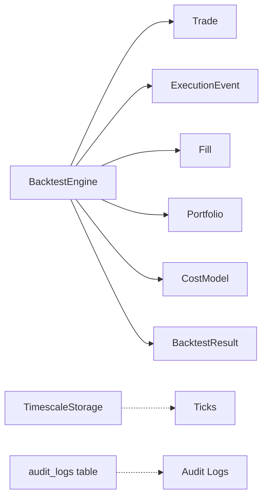

# Audit Trail

<cite>
**Referenced Files in This Document**
- [events.rs](file://crates/backtest/src/events.rs)
- [results.rs](file://crates/backtest/src/results.rs)
- [engine.rs](file://crates/backtest/src/engine.rs)
- [portfolio.rs](file://crates/backtest/src/portfolio.rs)
- [cost_model.rs](file://crates/backtest/src/cost_model.rs)
- [backtest_simple.rs](file://examples/backtest_simple.rs)
- [error.rs](file://crates/backtest/src/error.rs)
- [storage.rs](file://crates/data/src/storage.rs)
- [001_initial_schema.sql](file://migrations/001_initial_schema.sql)
</cite>

## Table of Contents
1. [Introduction](#introduction)
2. [Project Structure](#project-structure)
3. [Core Components](#core-components)
4. [Architecture Overview](#architecture-overview)
5. [Detailed Component Analysis](#detailed-component-analysis)
6. [Dependency Analysis](#dependency-analysis)
7. [Performance Considerations](#performance-considerations)
8. [Troubleshooting Guide](#troubleshooting-guide)
9. [Conclusion](#conclusion)
10. [Appendices](#appendices)

## Introduction
This document explains the trade-by-trade audit trail that powers transparent backtesting results. It covers the data structures used to record each trade event, how entries are created and closed, and how the detailed trade history enables deep analysis of strategy behavior. It also describes the relationship between the audit trail and performance metrics, configuration options for verbosity and storage, and practical guidance for avoiding data overload.

## Project Structure
The audit trail lives primarily in the backtest crate. The engine collects market events, executes orders, applies fills, and records trade events. The results module aggregates these events into performance metrics and equity curves. Supporting modules define cost modeling and portfolio accounting.

**Diagram sources**
- [events.rs](file://crates/backtest/src/events.rs#L1-L189)
- [results.rs](file://crates/backtest/src/results.rs#L1-L187)
- [engine.rs](file://crates/backtest/src/engine.rs#L1-L120)
- [portfolio.rs](file://crates/backtest/src/portfolio.rs#L1-L60)
- [cost_model.rs](file://crates/backtest/src/cost_model.rs#L1-L120)
- [backtest_simple.rs](file://examples/backtest_simple.rs#L150-L248)
- [storage.rs](file://crates/data/src/storage.rs#L1-L83)
- [001_initial_schema.sql](file://migrations/001_initial_schema.sql#L232-L272)

**Section sources**
- [events.rs](file://crates/backtest/src/events.rs#L1-L189)
- [results.rs](file://crates/backtest/src/results.rs#L1-L187)
- [engine.rs](file://crates/backtest/src/engine.rs#L1-L120)
- [portfolio.rs](file://crates/backtest/src/portfolio.rs#L1-L60)
- [cost_model.rs](file://crates/backtest/src/cost_model.rs#L1-L120)
- [backtest_simple.rs](file://examples/backtest_simple.rs#L150-L248)
- [storage.rs](file://crates/data/src/storage.rs#L1-L83)
- [001_initial_schema.sql](file://migrations/001_initial_schema.sql#L232-L272)

## Core Components
- Trade: The primary audit trail record capturing entry/exit timestamps, prices, quantities, realized PnL, and execution costs. It also tracks MAE/MFE for each trade.
- ExecutionEvent: Captures order fills and rejections for internal processing and optional logging.
- Fill: Encapsulates execution price, quantity, commission, and slippage for each fill.
- BacktestResult: Aggregates trade history into performance metrics, equity/drawdown curves, and ratios.
- BacktestEngine: Orchestrates market data ingestion, order execution, fill application, and trade recording.
- Portfolio: Tracks cash, positions, realized/unrealized PnL, and equity curve updates.
- CostModel: Computes realistic commission and slippage for simulated fills.

**Section sources**
- [events.rs](file://crates/backtest/src/events.rs#L110-L189)
- [results.rs](file://crates/backtest/src/results.rs#L1-L187)
- [engine.rs](file://crates/backtest/src/engine.rs#L391-L503)
- [portfolio.rs](file://crates/backtest/src/portfolio.rs#L1-L136)
- [cost_model.rs](file://crates/backtest/src/cost_model.rs#L152-L208)

## Architecture Overview
The audit trail is built around the Trade record and the BacktestEngine’s lifecycle. Market events are processed in chronological order. When orders are filled, the engine creates fills, applies them to the portfolio, and records trade events. At the end, BacktestResult computes derived metrics from the trade history.

**Diagram sources**
- [engine.rs](file://crates/backtest/src/engine.rs#L229-L283)
- [engine.rs](file://crates/backtest/src/engine.rs#L391-L503)
- [portfolio.rs](file://crates/backtest/src/portfolio.rs#L51-L136)
- [results.rs](file://crates/backtest/src/results.rs#L61-L187)

## Detailed Component Analysis

### Trade Data Model and Lifecycle
- Fields capture complete trade metadata: identifiers, symbol, side, entry/exit timestamps/prices, quantity, realized PnL, and execution costs.
- Methods support opening and closing trades, computing duration, and determining open/closed state.
- MAE/MFE are tracked on the trade record to enable excursion analysis.

**Diagram sources**
- [events.rs](file://crates/backtest/src/events.rs#L110-L189)

**Section sources**
- [events.rs](file://crates/backtest/src/events.rs#L110-L189)

### Execution and Fill Recording
- On order fill, the engine constructs a Fill with execution price, quantity, commission, and slippage.
- The portfolio applies the fill, updating cash, positions, realized PnL, and the equity curve.
- An ExecutionEvent is recorded for internal tracking and optional verbose logging.

**Diagram sources**
- [engine.rs](file://crates/backtest/src/engine.rs#L447-L503)
- [portfolio.rs](file://crates/backtest/src/portfolio.rs#L51-L136)
- [cost_model.rs](file://crates/backtest/src/cost_model.rs#L183-L208)

**Section sources**
- [engine.rs](file://crates/backtest/src/engine.rs#L447-L503)
- [portfolio.rs](file://crates/backtest/src/portfolio.rs#L51-L136)
- [cost_model.rs](file://crates/backtest/src/cost_model.rs#L183-L208)

### Trade Creation and Closure
- A Trade is created when a position opens, capturing entry metadata and initial costs.
- When the position closes, the trade is closed with exit metadata and realized PnL is computed.
- The engine ensures open positions are closed at the end of the backtest.

**Diagram sources**
- [engine.rs](file://crates/backtest/src/engine.rs#L447-L503)
- [portfolio.rs](file://crates/backtest/src/portfolio.rs#L51-L136)
- [events.rs](file://crates/backtest/src/events.rs#L158-L189)

**Section sources**
- [engine.rs](file://crates/backtest/src/engine.rs#L447-L503)
- [portfolio.rs](file://crates/backtest/src/portfolio.rs#L51-L136)
- [events.rs](file://crates/backtest/src/events.rs#L158-L189)

### Relationship Between Audit Trail and Performance Metrics
- BacktestResult derives high-level metrics from the trade list and equity curve:
  - Trade counts, win rate, gross profit/loss, profit factor, average win/loss, largest win/loss.
  - Risk metrics: max drawdown, Sharpe, Sortino, Calmar.
  - Cost analysis: total commission, slippage, total costs.
  - Time metrics: average/min/max trade duration.
- The equity curve and drawdown curve are computed from the portfolio’s equity updates.

**Diagram sources**
- [results.rs](file://crates/backtest/src/results.rs#L61-L187)
- [results.rs](file://crates/backtest/src/results.rs#L189-L331)
- [portfolio.rs](file://crates/backtest/src/portfolio.rs#L1-L60)

**Section sources**
- [results.rs](file://crates/backtest/src/results.rs#L61-L187)
- [results.rs](file://crates/backtest/src/results.rs#L189-L331)
- [portfolio.rs](file://crates/backtest/src/portfolio.rs#L1-L60)

### Configuration Options for Audit Trail Verbosity and Storage
- Verbose mode: When enabled, the engine logs periodic progress during event processing.
- Position sizing and limits: Control how many open positions exist and how much capital is risked per trade.
- Cost model: Configurable commission and slippage assumptions influence realized PnL and trade profitability.
- Data source: The engine loads historical candles and sorts them by timestamp for deterministic replay.

Practical guidance:
- Enable verbose mode only for short runs or when diagnosing performance issues.
- Use conservative cost models to reflect realistic trading conditions.
- Limit symbols and intervals to reduce memory footprint.

**Section sources**
- [engine.rs](file://crates/backtest/src/engine.rs#L77-L137)
- [engine.rs](file://crates/backtest/src/engine.rs#L229-L283)
- [cost_model.rs](file://crates/backtest/src/cost_model.rs#L1-L120)

### Concrete Examples from the Codebase
- Example backtest demonstrates configuring verbose mode, cost model, and saving results to JSON.
- The example prints a summary of performance metrics and saves detailed results.

**Section sources**
- [backtest_simple.rs](file://examples/backtest_simple.rs#L150-L248)

### Data Overload and Solutions
Common issues:
- Excessive trade count leading to large JSON outputs or memory pressure.
- Very verbose logging causing disk I/O overhead.
- High-frequency intervals increasing event volume.

Solutions:
- Reduce verbosity or disable it for long runs.
- Narrow the symbol list and increase the candle interval.
- Persist results periodically and stream to external systems if needed.
- Use conservative cost models to avoid unrealistic noise in PnL.

[No sources needed since this section provides general guidance]

## Dependency Analysis
The backtest engine depends on the trade/event models, portfolio accounting, and cost modeling. Results aggregation consumes trade and portfolio data. Optional data layer components (TimescaleStorage and audit_logs) can persist market ticks and system audit logs.

**Diagram sources**
- [engine.rs](file://crates/backtest/src/engine.rs#L1-L120)
- [events.rs](file://crates/backtest/src/events.rs#L1-L109)
- [portfolio.rs](file://crates/backtest/src/portfolio.rs#L1-L60)
- [cost_model.rs](file://crates/backtest/src/cost_model.rs#L152-L208)
- [results.rs](file://crates/backtest/src/results.rs#L1-L59)
- [storage.rs](file://crates/data/src/storage.rs#L1-L83)
- [001_initial_schema.sql](file://migrations/001_initial_schema.sql#L232-L272)

**Section sources**
- [engine.rs](file://crates/backtest/src/engine.rs#L1-L120)
- [events.rs](file://crates/backtest/src/events.rs#L1-L109)
- [portfolio.rs](file://crates/backtest/src/portfolio.rs#L1-L60)
- [cost_model.rs](file://crates/backtest/src/cost_model.rs#L152-L208)
- [results.rs](file://crates/backtest/src/results.rs#L1-L59)
- [storage.rs](file://crates/data/src/storage.rs#L1-L83)
- [001_initial_schema.sql](file://migrations/001_initial_schema.sql#L232-L272)

## Performance Considerations
- Event sorting and processing: The engine sorts events by timestamp before processing to ensure chronological correctness.
- Cost model computation: Slippage and commission calculations are performed per fill; keep models simple for speed.
- Equity curve updates: Frequent updates occur on fills; batch or throttle if needed for very high-frequency simulations.
- Memory footprint: Trade lists and equity curves grow linearly with events; consider downsampling or sampling strategies for extremely long runs.

[No sources needed since this section provides general guidance]

## Troubleshooting Guide
Common errors and remedies:
- Insufficient data: If no candles are found for the selected time window, the engine reports insufficient data and halts.
- Execution errors: Cash or position constraints can prevent fills; verify capital and position sizing.
- Serialization errors: When exporting results, ensure JSON serialization succeeds; validate field types and decimal precision.
- Database connectivity: TimescaleStorage requires a valid connection string; verify credentials and network access.

**Section sources**
- [engine.rs](file://crates/backtest/src/engine.rs#L188-L214)
- [portfolio.rs](file://crates/backtest/src/portfolio.rs#L51-L136)
- [error.rs](file://crates/backtest/src/error.rs#L1-L33)
- [storage.rs](file://crates/data/src/storage.rs#L57-L83)

## Conclusion
The trade-by-trade audit trail provides complete transparency into backtest outcomes by capturing every fill, computing realized PnL, and enabling deep analysis of strategy behavior. Together with the results aggregation pipeline, it yields robust performance metrics and risk measures. By tuning verbosity, cost models, and data scope, users can balance fidelity, performance, and storage needs.

## Appendices

### Appendix A: Trade Fields and Their Roles
- Identifiers: Unique trade and strategy identifiers for traceability.
- Market data: Symbol, side, entry/exit timestamps/prices, and quantity.
- Realized PnL: Computed on close using entry/exit prices, quantity, and total costs.
- Costs: Separate commission and slippage fields enable cost attribution and sensitivity analysis.
- Excursions: MAE/MFE track adverse/favorable price movements during the trade.

**Section sources**
- [events.rs](file://crates/backtest/src/events.rs#L110-L189)

### Appendix B: Equity Curve and Drawdown
- Equity curve: Timestamped equity snapshots updated on each fill.
- Drawdown curve: Computed from equity peaks to measure underwater periods.

**Section sources**
- [portfolio.rs](file://crates/backtest/src/portfolio.rs#L1-L60)
- [results.rs](file://crates/backtest/src/results.rs#L189-L219)

### Appendix C: Optional Persistence and Auditing
- Market ticks can be stored to TimescaleStorage for downstream analytics.
- System audit logs table schema supports general system auditing; separate from trade audit trail.

**Section sources**
- [storage.rs](file://crates/data/src/storage.rs#L1-L83)
- [001_initial_schema.sql](file://migrations/001_initial_schema.sql#L232-L272)