# Backtesting Engine

<cite>
**Referenced Files in This Document**
- [lib.rs](file://crates/backtest/src/lib.rs)
- [engine.rs](file://crates/backtest/src/engine.rs)
- [events.rs](file://crates/backtest/src/events.rs)
- [portfolio.rs](file://crates/backtest/src/portfolio.rs)
- [cost_model.rs](file://crates/backtest/src/cost_model.rs)
- [results.rs](file://crates/backtest/src/results.rs)
- [error.rs](file://crates/backtest/src/error.rs)
- [traits.rs](file://crates/strategy/src/traits.rs)
- [types.rs](file://crates/core/src/types.rs)
- [backtest_simple.rs](file://examples/backtest_simple.rs)
- [grid_trading.rs](file://examples/grid_trading.rs)
</cite>

## Table of Contents
1. [Introduction](#introduction)
2. [Project Structure](#project-structure)
3. [Core Components](#core-components)
4. [Architecture Overview](#architecture-overview)
5. [Detailed Component Analysis](#detailed-component-analysis)
6. [Dependency Analysis](#dependency-analysis)
7. [Performance Considerations](#performance-considerations)
8. [Troubleshooting Guide](#troubleshooting-guide)
9. [Conclusion](#conclusion)
10. [Appendices](#appendices)

## Introduction
This document describes the backtesting engine architecture that performs event-driven simulation of historical market data to evaluate trading strategies. It covers:
- Event-driven replay of historical candles and derived market events
- Portfolio simulation tracking cash, positions, and PnL over time
- Realistic cost modeling for slippage, commissions, and market impact
- Comprehensive performance metrics including Sharpe ratio, maximum drawdown, win rate, and profit factor
- Trade-by-trade audit trail for transparency
- Configuration options for backtest parameters
- Example execution and result analysis

## Project Structure
The backtesting engine is implemented as a standalone crate with clear separation of concerns:
- Event model and execution records
- Portfolio state and PnL tracking
- Cost model for realistic execution
- Engine orchestrating replay and strategy interaction
- Results aggregation and reporting
- Strategy trait definitions and core types

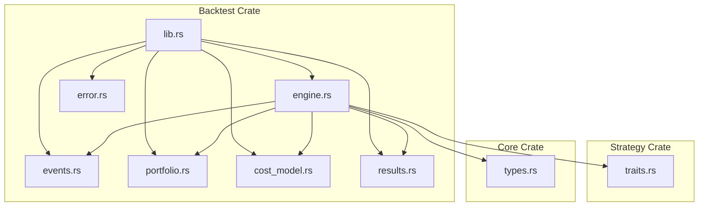

**Diagram sources**
- [lib.rs](file://crates/backtest/src/lib.rs#L1-L16)
- [engine.rs](file://crates/backtest/src/engine.rs#L1-L120)
- [events.rs](file://crates/backtest/src/events.rs#L1-L60)
- [portfolio.rs](file://crates/backtest/src/portfolio.rs#L1-L60)
- [cost_model.rs](file://crates/backtest/src/cost_model.rs#L1-L60)
- [results.rs](file://crates/backtest/src/results.rs#L1-L60)
- [traits.rs](file://crates/strategy/src/traits.rs#L1-L40)
- [types.rs](file://crates/core/src/types.rs#L1-L40)

**Section sources**
- [lib.rs](file://crates/backtest/src/lib.rs#L1-L16)

## Core Components
- BacktestEngine: Orchestrates loading historical data, processing events, executing strategy signals, applying fills, and generating results.
- MarketEvent: Encapsulates candles, trades, and order book snapshots for deterministic replay.
- Portfolio: Tracks cash, positions, realized/unrealized PnL, and equity curve.
- CostModel: Computes execution price, commission, and slippage for realistic simulation.
- BacktestResult: Aggregates performance metrics and equity/drawdown curves.
- Strategy trait: Defines the interface for strategies to receive market data, emit signals, and handle order notifications.

**Section sources**
- [engine.rs](file://crates/backtest/src/engine.rs#L139-L283)
- [events.rs](file://crates/backtest/src/events.rs#L1-L128)
- [portfolio.rs](file://crates/backtest/src/portfolio.rs#L1-L120)
- [cost_model.rs](file://crates/backtest/src/cost_model.rs#L152-L208)
- [results.rs](file://crates/backtest/src/results.rs#L1-L120)
- [traits.rs](file://crates/strategy/src/traits.rs#L60-L90)

## Architecture Overview
The engine runs a chronological loop over MarketEvent instances, updating portfolio prices, checking pending orders for fills, invoking the strategy’s on_market_data and generate_signal, and placing market orders when signals are produced. Fills update the portfolio and record execution/trade events. At completion, results are computed from portfolio and trade histories.

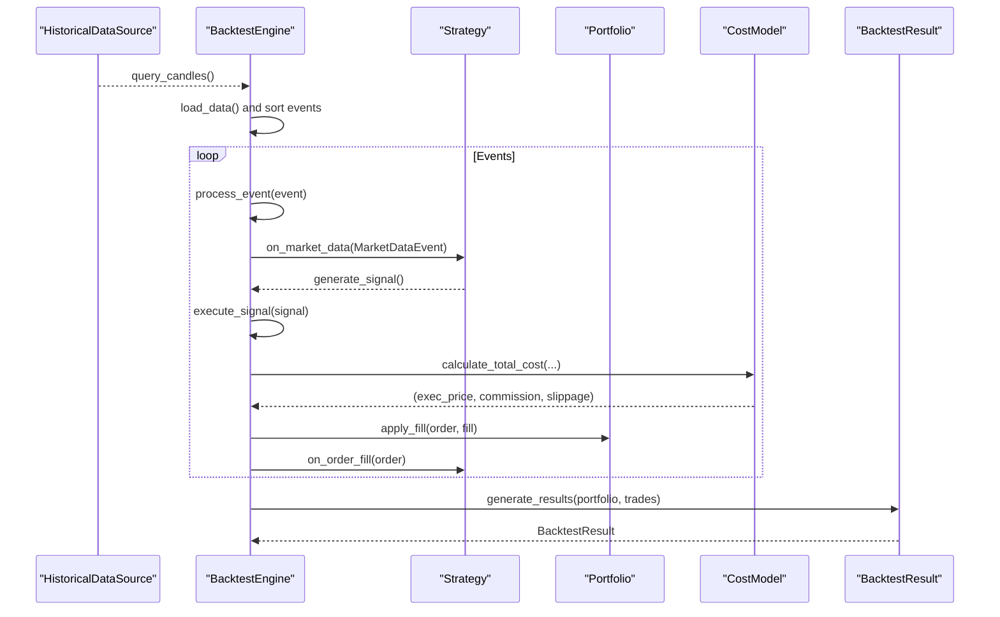

**Diagram sources**
- [engine.rs](file://crates/backtest/src/engine.rs#L187-L283)
- [engine.rs](file://crates/backtest/src/engine.rs#L285-L584)
- [cost_model.rs](file://crates/backtest/src/cost_model.rs#L183-L208)
- [portfolio.rs](file://crates/backtest/src/portfolio.rs#L50-L136)
- [results.rs](file://crates/backtest/src/results.rs#L61-L187)

## Detailed Component Analysis

### Event-Driven Simulation
- HistoricalDataSource abstraction enables loading candles from in-memory or persistent storage.
- MarketEvent supports candles, trades, and order book snapshots; the engine currently processes candles for strategy input.
- Events are sorted by timestamp and processed in chronological order.

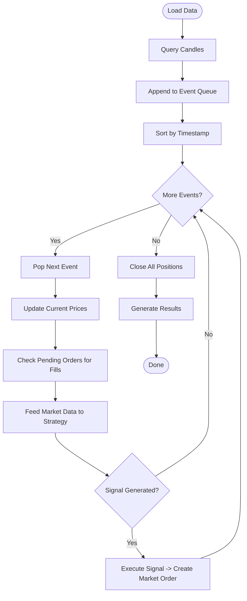

**Diagram sources**
- [engine.rs](file://crates/backtest/src/engine.rs#L187-L283)
- [engine.rs](file://crates/backtest/src/engine.rs#L285-L351)
- [events.rs](file://crates/backtest/src/events.rs#L1-L51)

**Section sources**
- [engine.rs](file://crates/backtest/src/engine.rs#L187-L283)
- [events.rs](file://crates/backtest/src/events.rs#L1-L51)

### Portfolio Simulation
- Portfolio maintains cash, positions, realized PnL, total commission/slippage, and an equity curve.
- apply_fill enforces cash availability for buys, updates position quantities and average entry price, calculates realized PnL on sells, and records equity timestamps.
- update_prices updates unrealized PnL based on current market prices.

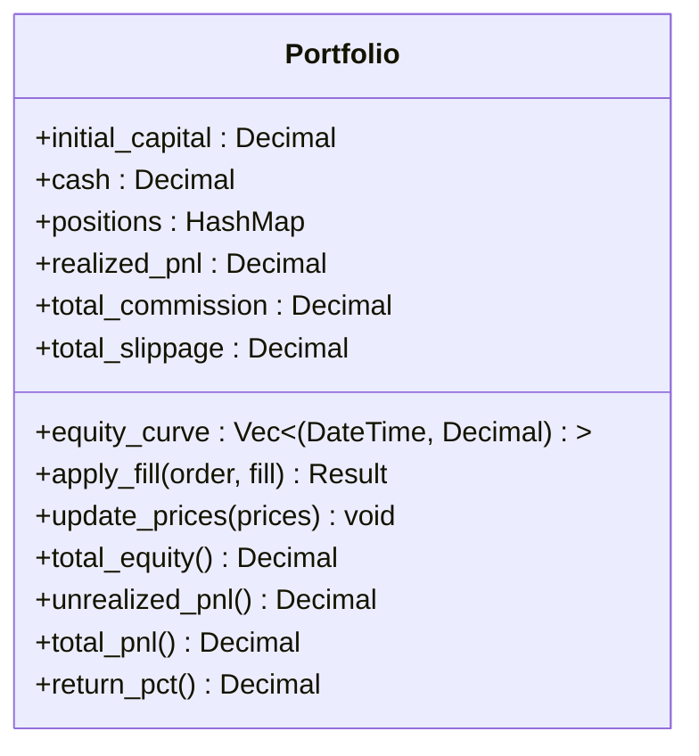

**Diagram sources**
- [portfolio.rs](file://crates/backtest/src/portfolio.rs#L1-L195)

**Section sources**
- [portfolio.rs](file://crates/backtest/src/portfolio.rs#L50-L195)

### Realistic Cost Model
- CommissionModel computes maker/taker fees based on order type and notional value, with configurable minimums.
- SlippageModel computes fixed and impact-based slippage for market orders and applies side-specific price adjustments.
- CostModel combines commission and slippage to produce execution price, commission, and slippage for each fill.

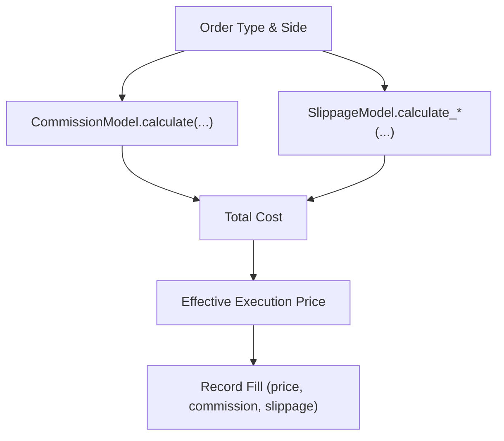

**Diagram sources**
- [cost_model.rs](file://crates/backtest/src/cost_model.rs#L47-L63)
- [cost_model.rs](file://crates/backtest/src/cost_model.rs#L106-L149)
- [cost_model.rs](file://crates/backtest/src/cost_model.rs#L183-L208)

**Section sources**
- [cost_model.rs](file://crates/backtest/src/cost_model.rs#L1-L208)

### Performance Metrics Calculation
- BacktestResult aggregates:
  - Trade stats: total, winners, losers, win rate
  - PnL metrics: gross profit/loss, profit factor, average win/loss, largest win/loss
  - Risk metrics: max drawdown and percent, Sharpe ratio, Sortino ratio, Calmar ratio
  - Cost analysis: total commission, slippage, total costs
  - Time metrics: average/max/min trade duration hours
  - Equity and drawdown curves
- Sharpe/Sortino use daily-like returns derived from equity curve and assume 252 trading days/year.

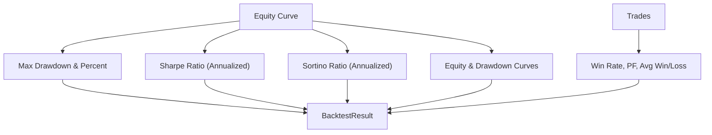

**Diagram sources**
- [results.rs](file://crates/backtest/src/results.rs#L61-L187)
- [results.rs](file://crates/backtest/src/results.rs#L189-L331)

**Section sources**
- [results.rs](file://crates/backtest/src/results.rs#L1-L413)

### Trade-by-Trade Audit Trail
- Trade records capture entry/exit timestamps/prices, quantity, side, PnL, and cumulative costs.
- Trade.close computes net PnL considering entry and exit commission and slippage.
- ExecutionEvent captures order fills, rejections, cancellations, and position open/close events.

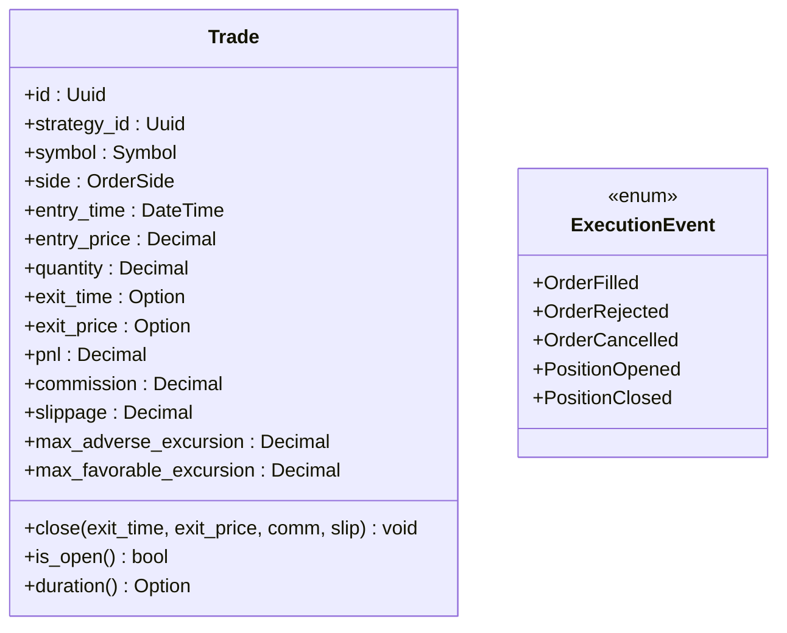

**Diagram sources**
- [events.rs](file://crates/backtest/src/events.rs#L110-L189)

**Section sources**
- [events.rs](file://crates/backtest/src/events.rs#L110-L189)

### Configuration Options
BacktestConfig defines:
- initial_capital: Starting cash balance
- start_time/end_time: Backtest window
- symbols: Instruments to trade
- interval: Candle timeframe
- cost_model: Commission and slippage settings
- verbose: Logging verbosity
- max_positions: Open position cap
- position_sizing: Fixed amount, percent of equity, or Kelly sizing

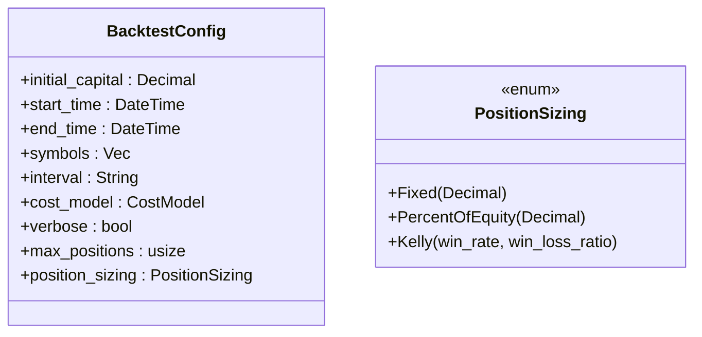

**Diagram sources**
- [engine.rs](file://crates/backtest/src/engine.rs#L77-L121)

**Section sources**
- [engine.rs](file://crates/backtest/src/engine.rs#L77-L137)

### Strategy Integration
- Strategy trait defines initialize, on_market_data, generate_signal, on_order_fill, on_order_reject, metrics, serialization, and shutdown hooks.
- BacktestEngine initializes a StrategyConfig and forwards MarketDataEvent::Candle to the strategy, then executes signals as market orders.

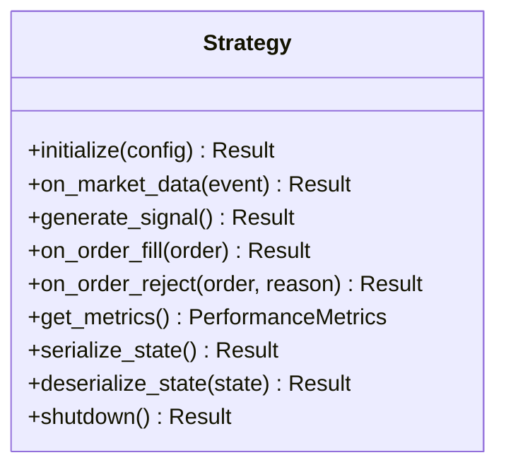

**Diagram sources**
- [traits.rs](file://crates/strategy/src/traits.rs#L60-L90)

**Section sources**
- [traits.rs](file://crates/strategy/src/traits.rs#L1-L115)
- [engine.rs](file://crates/backtest/src/engine.rs#L236-L351)

### Example Execution and Result Analysis
- The example demonstrates a simple MA crossover strategy, configuring a conservative spot cost model, percent-of-equity position sizing, and running a short backtest window.
- It prints a summary including returns, Sharpe/Sortino/Calmar ratios, and cost analysis, and saves results to JSON.

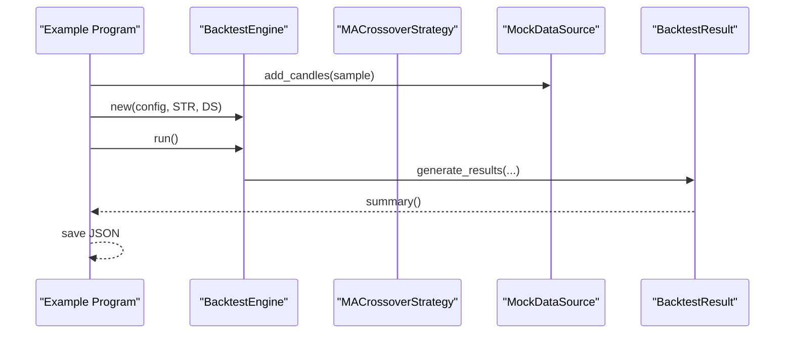

**Diagram sources**
- [backtest_simple.rs](file://examples/backtest_simple.rs#L150-L248)
- [engine.rs](file://crates/backtest/src/engine.rs#L236-L283)
- [results.rs](file://crates/backtest/src/results.rs#L333-L412)

**Section sources**
- [backtest_simple.rs](file://examples/backtest_simple.rs#L1-L248)

## Dependency Analysis
- BacktestEngine depends on Strategy trait, MarketEvent, Portfolio, CostModel, and BacktestResult.
- CostModel composes CommissionModel and SlippageModel.
- Portfolio uses core types for Symbol, Price, Quantity, and Position.
- BacktestResult consumes Portfolio and Trade records.

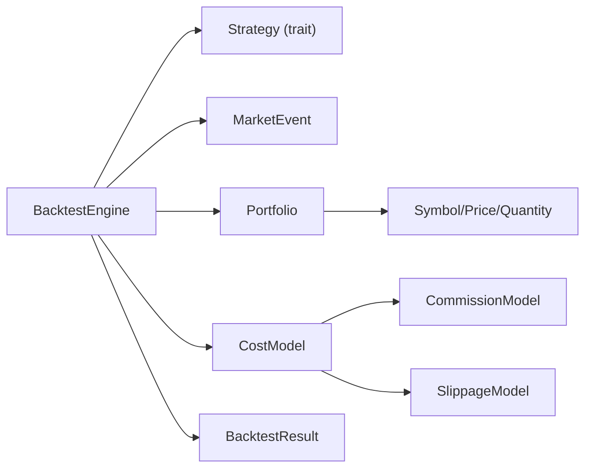

**Diagram sources**
- [engine.rs](file://crates/backtest/src/engine.rs#L1-L120)
- [cost_model.rs](file://crates/backtest/src/cost_model.rs#L152-L208)
- [portfolio.rs](file://crates/backtest/src/portfolio.rs#L1-L60)
- [types.rs](file://crates/core/src/types.rs#L1-L120)
- [traits.rs](file://crates/strategy/src/traits.rs#L60-L90)

**Section sources**
- [engine.rs](file://crates/backtest/src/engine.rs#L1-L120)
- [cost_model.rs](file://crates/backtest/src/cost_model.rs#L152-L208)
- [portfolio.rs](file://crates/backtest/src/portfolio.rs#L1-L60)
- [types.rs](file://crates/core/src/types.rs#L1-L120)
- [traits.rs](file://crates/strategy/src/traits.rs#L60-L90)

## Performance Considerations
- Event sorting and processing are O(N log N) due to timestamp sorting; ensure datasets are reasonably sized.
- Portfolio updates and fills are O(1) per event; overhead dominated by strategy computation.
- Cost calculations are constant-time per fill.
- Equity curve generation and drawdown/sharpe computations are linear in number of events.

[No sources needed since this section provides general guidance]

## Troubleshooting Guide
Common issues and diagnostics:
- Insufficient data: The engine checks for empty candle sets and returns an error if none are found.
- Execution errors: Cash or position constraints trigger execution errors when placing orders.
- Serialization errors: JSON serialization of results may fail if data is malformed.
- Strategy errors: Strategy initialization or signal generation failures are propagated.

Recommended actions:
- Verify HistoricalDataSource returns non-empty candle series for the requested symbols and interval.
- Confirm cost_model parameters align with exchange rates and expected slippage.
- Ensure position_sizing does not exceed available cash or max_positions.
- Review verbose logs for event processing progress and order fill details.

**Section sources**
- [engine.rs](file://crates/backtest/src/engine.rs#L187-L218)
- [portfolio.rs](file://crates/backtest/src/portfolio.rs#L50-L136)
- [error.rs](file://crates/backtest/src/error.rs#L1-L33)

## Conclusion
The backtesting engine provides a robust, event-driven framework for evaluating trading strategies against historical data. It integrates a realistic cost model, maintains a detailed audit trail, and computes comprehensive performance metrics. With flexible configuration and modular design, it supports rapid iteration and transparent analysis of strategy effectiveness.

[No sources needed since this section summarizes without analyzing specific files]

## Appendices

### Configuration Reference
- BacktestConfig fields and defaults:
  - initial_capital: default 100000.0
  - start_time: default 365 days ago
  - end_time: default now
  - symbols: default ["BTC-USDT"]
  - interval: default "1H"
  - cost_model: default spot with small slippage
  - verbose: default false
  - max_positions: default 5
  - position_sizing: default PercentOfEquity(0.1)

**Section sources**
- [engine.rs](file://crates/backtest/src/engine.rs#L123-L137)

### Example Strategy Implementations
- Simple MA Crossover strategy demonstrates signal generation and order fill handling.
- Grid Trading strategy illustrates structured order placement logic and active order tracking.

**Section sources**
- [backtest_simple.rs](file://examples/backtest_simple.rs#L1-L148)
- [grid_trading.rs](file://examples/grid_trading.rs#L1-L162)