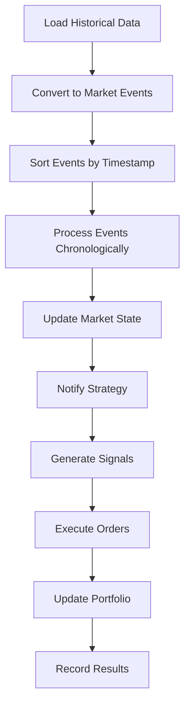
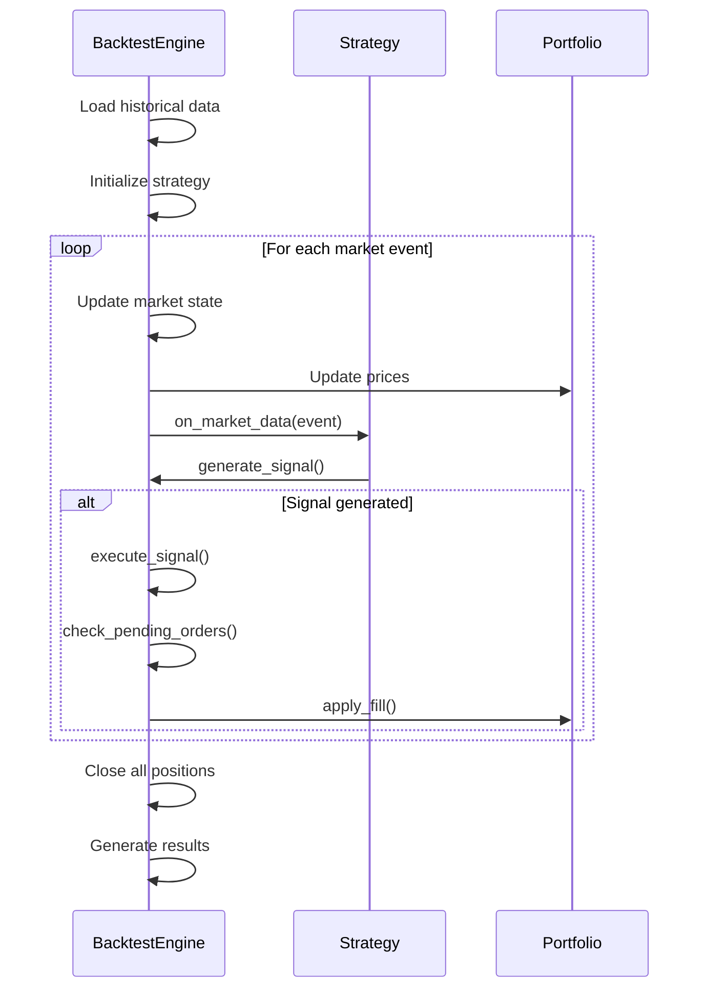
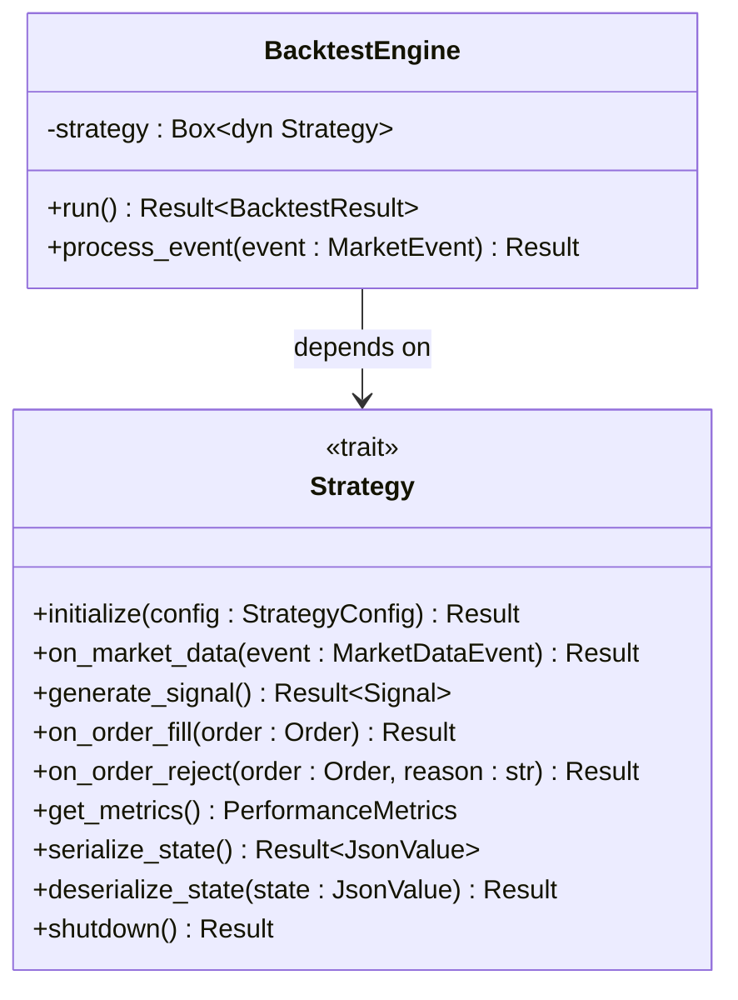
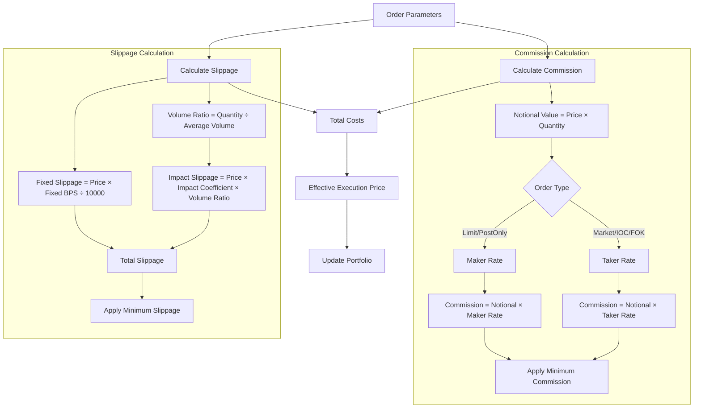
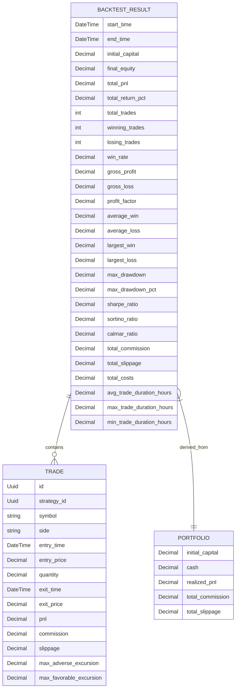

# Backtesting Simulation

<cite>
**Referenced Files in This Document**   
- [engine.rs](file://crates/backtest/src/engine.rs)
- [lib.rs](file://crates/backtest/src/lib.rs)
- [events.rs](file://crates/backtest/src/events.rs)
- [portfolio.rs](file://crates/backtest/src/portfolio.rs)
- [results.rs](file://crates/backtest/src/results.rs)
- [cost_model.rs](file://crates/backtest/src/cost_model.rs)
- [traits.rs](file://crates/strategy/src/traits.rs)
- [strategy.rs](file://crates/core/src/models/strategy.rs)
- [backtest_simple.rs](file://examples/backtest_simple.rs)
</cite>

## Table of Contents
1. [Introduction](#introduction)
2. [Event-Driven Architecture](#event-driven-architecture)
3. [Simulation Loop](#simulation-loop)
4. [Strategy Framework Integration](#strategy-framework-integration)
5. [Configuration Options](#configuration-options)
6. [Cost Modeling](#cost-modeling)
7. [Common Issues and Solutions](#common-issues-and-solutions)
8. [Example Implementation](#example-implementation)
9. [Results Analysis](#results-analysis)

## Introduction
The backtesting simulation component provides a comprehensive framework for evaluating trading strategies using historical market data. This system enables developers and traders to test strategy performance under realistic market conditions before deploying to live trading environments. The architecture is designed to be event-driven, processing market data chronologically to simulate real-time trading conditions accurately.

The simulation engine replays historical data at configurable speeds, allowing for thorough testing of strategy logic, risk management, and performance characteristics. By incorporating realistic cost models and market impact simulations, the backtesting system provides reliable performance metrics that closely approximate real-world trading results.

**Section sources**
- [engine.rs](file://crates/backtest/src/engine.rs#L1-L585)
- [lib.rs](file://crates/backtest/src/lib.rs#L1-L16)

## Event-Driven Architecture
The backtesting system employs an event-driven architecture that processes market data through a chronological event queue. This design accurately simulates real-time trading conditions by processing market events in temporal order, ensuring that strategies cannot access future information (preventing look-ahead bias).

The architecture consists of several key components:
- **Event Queue**: Stores market events sorted by timestamp
- **Event Processor**: Handles different types of market data
- **Strategy Interface**: Receives processed market data
- **Execution Engine**: Simulates order fills and updates portfolio

Market events are defined in the `MarketEvent` enum and include:
- **Candle events**: OHLCV data at specified intervals
- **Trade events**: Individual trade ticks
- **Order book events**: Market depth snapshots

The event processing flow begins with loading historical data from the data source, converting it to market events, and sorting them chronologically. The simulation engine then processes each event in sequence, updating market state and notifying the strategy.

**Diagram sources**
- [engine.rs](file://crates/backtest/src/engine.rs#L188-L227)
- [events.rs](file://crates/backtest/src/events.rs#L13-L33)

**Section sources**
- [engine.rs](file://crates/backtest/src/engine.rs#L188-L227)
- [events.rs](file://crates/backtest/src/events.rs#L13-L51)

## Simulation Loop
The simulation loop is the core of the backtesting engine, responsible for processing market events and coordinating strategy execution. The loop follows a sequential process that ensures realistic trading simulation:

1. **Data Loading**: Historical market data is retrieved from the configured data source
2. **Strategy Initialization**: The trading strategy is initialized with configuration parameters
3. **Event Processing**: Market events are processed chronologically
4. **State Updates**: Market prices and portfolio values are updated
5. **Signal Generation**: The strategy analyzes current market conditions
6. **Order Execution**: Generated signals are converted to orders and executed
7. **Result Generation**: Performance metrics are calculated

The main simulation loop in the `BacktestEngine::run` method processes events sequentially, ensuring that each event is handled in temporal order. This chronological processing prevents look-ahead bias and ensures that strategies only have access to information available at each point in time.

During event processing, the engine updates the current market state by extracting prices from market events and storing them in the `current_prices` map. The portfolio is then updated with these prices to reflect current market values. After state updates, the engine notifies the strategy of the new market data by calling the `on_market_data` method.

**Diagram sources**
- [engine.rs](file://crates/backtest/src/engine.rs#L230-L283)
- [engine.rs](file://crates/backtest/src/engine.rs#L286-L351)

**Section sources**
- [engine.rs](file://crates/backtest/src/engine.rs#L230-L283)
- [engine.rs](file://crates/backtest/src/engine.rs#L286-L351)

## Strategy Framework Integration
The backtesting engine integrates with the strategy framework through a well-defined interface that enables seamless communication between the simulation environment and trading strategies. The integration is based on the `Strategy` trait, which defines the contract between the backtesting engine and trading strategies.

The key integration points include:
- **Initialization**: The `initialize` method configures the strategy with parameters and risk limits
- **Market Data Processing**: The `on_market_data` method receives market events for analysis
- **Signal Generation**: The `generate_signal` method produces trading signals
- **Execution Feedback**: The `on_order_fill` method notifies the strategy of order executions

When the backtesting engine processes a market event, it converts the event to the appropriate `MarketDataEvent` type and calls the strategy's `on_market_data` method. This method allows the strategy to update its internal state based on the new market information. After processing the market data, the engine calls the strategy's `generate_signal` method to determine if any trading actions should be taken.

The strategy framework also supports state serialization through the `serialize_state` and `deserialize_state` methods, enabling hot-reload capabilities and state persistence across backtesting sessions. This feature is particularly useful for strategies that maintain complex internal state or require warm-up periods.

**Diagram sources**
- [traits.rs](file://crates/strategy/src/traits.rs#L62-L88)
- [engine.rs](file://crates/backtest/src/engine.rs#L142-L143)

**Section sources**
- [traits.rs](file://crates/strategy/src/traits.rs#L62-L88)
- [engine.rs](file://crates/backtest/src/engine.rs#L332-L348)

## Configuration Options
The backtesting system provides comprehensive configuration options that allow users to customize simulation parameters to match their specific requirements. The `BacktestConfig` struct defines all configurable parameters for the simulation.

Key configuration options include:

**Time Parameters**
- **Initial capital**: Starting capital for the simulation
- **Start time**: Beginning of the backtest period
- **End time**: End of the backtest period

**Market Parameters**
- **Symbols**: Trading pairs to include in the simulation
- **Interval**: Data frequency (e.g., "1H" for hourly candles)
- **Max positions**: Maximum number of concurrent positions

**Risk and Position Management**
- **Cost model**: Commission and slippage parameters
- **Position sizing**: Method for determining trade size
- **Verbose mode**: Enable detailed logging output

The position sizing configuration offers three modes:
- **Fixed**: Trade a fixed amount per position
- **PercentOfEquity**: Trade a percentage of current equity
- **Kelly**: Use Kelly criterion for optimal position sizing

These configuration options provide flexibility to test strategies under various market conditions and risk parameters, enabling thorough performance evaluation across different scenarios.

**Section sources**
- [engine.rs](file://crates/backtest/src/engine.rs#L78-L137)
- [engine.rs](file://crates/backtest/src/engine.rs#L109-L121)

## Cost Modeling
The backtesting system incorporates realistic cost modeling to simulate the impact of trading fees and market impact on strategy performance. The cost model consists of two primary components: commission calculation and slippage estimation.

The `CostModel` struct combines a `CommissionModel` and a `SlippageModel` to provide comprehensive cost simulation. The commission model supports different fee structures for maker and taker orders, with configurable rates for various exchange types (e.g., OKX spot and futures).

The slippage model includes both fixed and dynamic components:
- **Fixed component**: Based on basis points of the trade value
- **Dynamic component**: Based on order size relative to average market volume

The cost model calculates the total execution cost by combining commission and slippage, then applies this cost to determine the effective execution price. For buy orders, slippage increases the execution price; for sell orders, it decreases the execution price. This realistic cost simulation helps prevent over-optimistic performance estimates that could result from ignoring transaction costs.

**Diagram sources**
- [cost_model.rs](file://crates/backtest/src/cost_model.rs#L154-L207)
- [cost_model.rs](file://crates/backtest/src/cost_model.rs#L47-L62)

**Section sources**
- [cost_model.rs](file://crates/backtest/src/cost_model.rs#L154-L207)
- [cost_model.rs](file://crates/backtest/src/cost_model.rs#L47-L62)

## Common Issues and Solutions
The backtesting system addresses several common issues that can lead to inaccurate performance evaluation and unrealistic expectations.

**Look-Ahead Bias**
Look-ahead bias occurs when a strategy uses future information that would not be available in real-time trading. The backtesting engine prevents this by:
- Processing events strictly in chronological order
- Ensuring strategies only receive market data up to the current simulation time
- Using event queues sorted by timestamp

**Overfitting**
Overfitting happens when a strategy is excessively optimized for historical data and performs poorly on new data. The system mitigates this through:
- Out-of-sample testing capabilities
- Walk-forward analysis support
- Multiple market regime testing

**Survivorship Bias**
Survivorship bias occurs when backtests only include assets that have survived to the present, ignoring those that were delisted. The system addresses this by:
- Supporting configurable symbol lists
- Allowing historical symbol inclusion
- Providing data quality validation

**Transaction Cost Neglect**
Ignoring transaction costs can lead to overly optimistic performance estimates. The comprehensive cost model ensures realistic performance evaluation by:
- Simulating both commission and slippage
- Applying costs to every trade
- Tracking total cost impact on performance

The system also includes validation checks to ensure data quality and sufficient historical data for meaningful backtesting, preventing results based on inadequate or incomplete data.

**Section sources**
- [engine.rs](file://crates/backtest/src/engine.rs#L208-L212)
- [cost_model.rs](file://crates/backtest/src/cost_model.rs#L154-L207)

## Example Implementation
The example implementation demonstrates a simple moving average crossover strategy that illustrates the complete backtesting workflow. This example shows how to configure the backtesting engine, implement a trading strategy, and analyze results.

The example configures the backtest with:
- $100,000 initial capital
- 90-day backtest period
- BTC-USDT trading pair
- 1-hour candle interval
- Conservative cost model (OKX spot with higher slippage)

The MA Crossover strategy implements the `Strategy` trait with logic that:
- Calculates fast and slow moving averages
- Generates buy signals on golden crosses (fast MA crosses above slow MA)
- Generates sell signals on death crosses (fast MA crosses below slow MA)
- Manages position state and signal generation

The example also demonstrates result analysis, including performance metrics such as Sharpe ratio, Sortino ratio, and Calmar ratio, as well as cost analysis showing the impact of commissions and slippage on overall performance.

**Section sources**
- [backtest_simple.rs](file://examples/backtest_simple.rs#L1-L248)
- [backtest_simple.rs](file://examples/backtest_simple.rs#L158-L168)

## Results Analysis
The backtesting system generates comprehensive performance metrics through the `BacktestResult` struct, providing detailed analysis of strategy performance. These metrics enable thorough evaluation of strategy effectiveness, risk characteristics, and profitability.

Key performance metrics include:

**Capital and Return Metrics**
- Initial and final equity
- Total profit and loss
- Return percentage
- Equity curve over time

**Trade Statistics**
- Total number of trades
- Winning and losing trades
- Win rate percentage
- Average win and loss amounts

**Risk Metrics**
- Maximum drawdown (absolute and percentage)
- Sharpe ratio (annualized)
- Sortino ratio (annualized, downside deviation)
- Calmar ratio (return to max drawdown)

**Cost Analysis**
- Total commission paid
- Total slippage incurred
- Combined transaction costs

The results also include detailed trade records with entry and exit prices, profit and loss calculations, and duration metrics. The equity curve and drawdown curve provide visual representations of performance over time, helping identify periods of strength and weakness in the strategy.

The system provides a summary method that formats these metrics into a comprehensive report, making it easy to interpret and compare different strategy configurations.

**Diagram sources**
- [results.rs](file://crates/backtest/src/results.rs#L11-L58)
- [portfolio.rs](file://crates/backtest/src/portfolio.rs#L10-L34)
- [events.rs](file://crates/backtest/src/events.rs#L112-L127)

**Section sources**
- [results.rs](file://crates/backtest/src/results.rs#L62-L187)
- [portfolio.rs](file://crates/backtest/src/portfolio.rs#L36-L195)
- [events.rs](file://crates/backtest/src/events.rs#L129-L188)