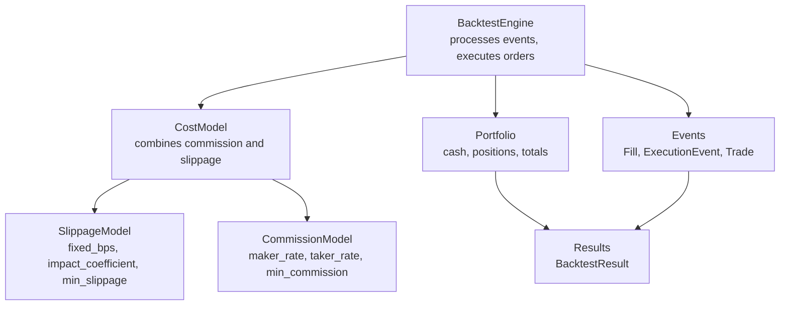
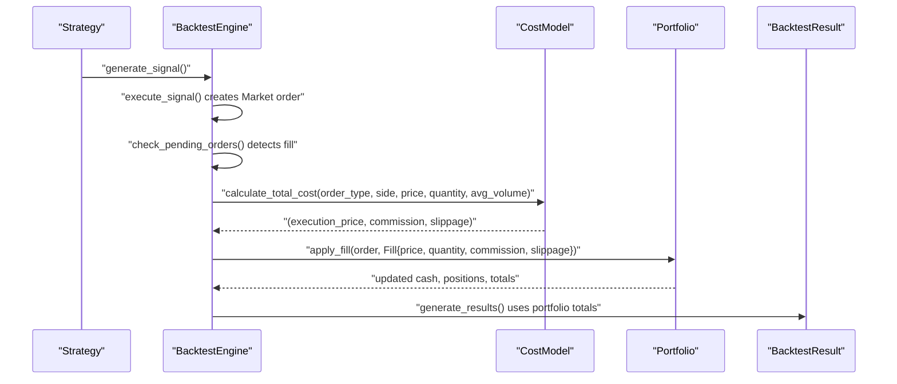
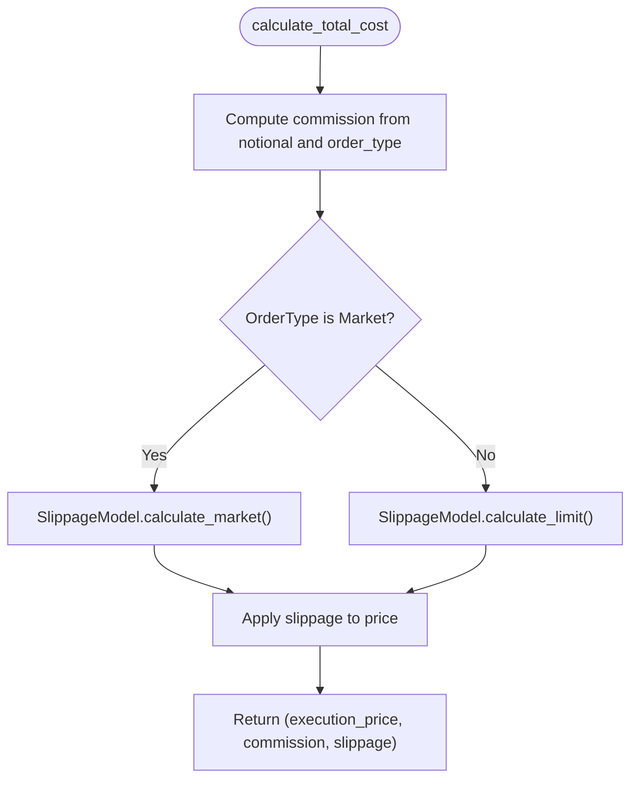
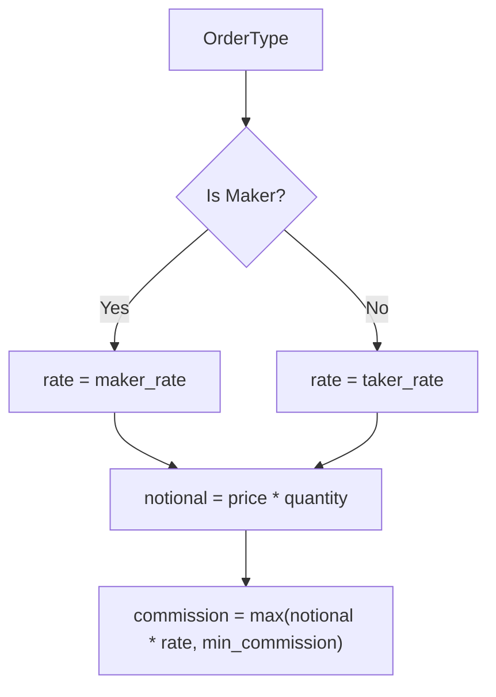
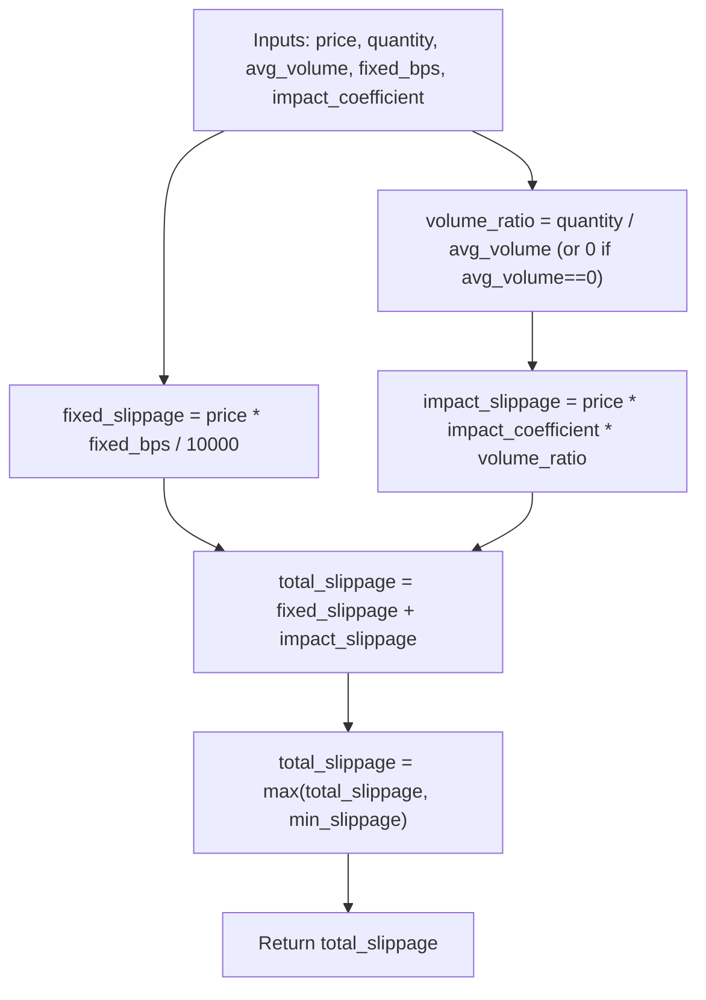
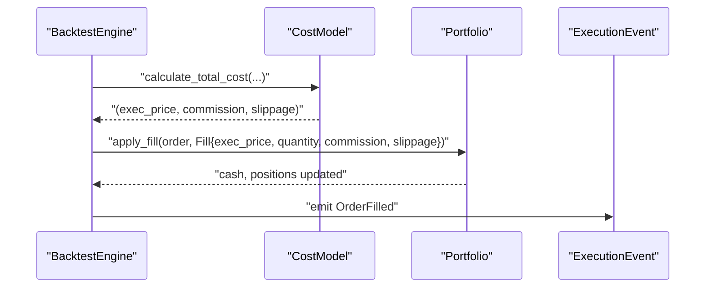
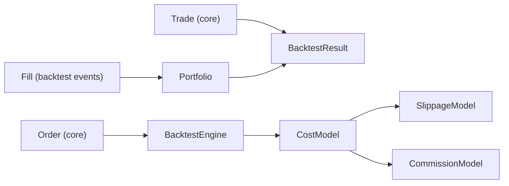

# Cost Modeling

<cite>
**Referenced Files in This Document**
- [cost_model.rs](file://crates/backtest/src/cost_model.rs)
- [engine.rs](file://crates/backtest/src/engine.rs)
- [portfolio.rs](file://crates/backtest/src/portfolio.rs)
- [events.rs](file://crates/backtest/src/events.rs)
- [results.rs](file://crates/backtest/src/results.rs)
- [order.rs](file://crates/core/src/models/order.rs)
- [trade.rs](file://crates/core/src/models/trade.rs)
- [backtest_simple.rs](file://examples/backtest_simple.rs)
</cite>

## Table of Contents
1. [Introduction](#introduction)
2. [Project Structure](#project-structure)
3. [Core Components](#core-components)
4. [Architecture Overview](#architecture-overview)
5. [Detailed Component Analysis](#detailed-component-analysis)
6. [Dependency Analysis](#dependency-analysis)
7. [Performance Considerations](#performance-considerations)
8. [Troubleshooting Guide](#troubleshooting-guide)
9. [Conclusion](#conclusion)
10. [Appendices](#appendices)

## Introduction
This document explains the realistic cost model used in the backtesting engine. It covers how slippage and commissions are modeled, how different order types are treated, and how costs are applied to trades before updating portfolio values. It also documents configuration options, their impact on strategy performance, and common pitfalls such as overestimating execution costs.

## Project Structure
The cost modeling lives in the backtest crate and integrates with the engine, portfolio, and event systems. The core building blocks are:
- CostModel: combines CommissionModel and SlippageModel
- SlippageModel: computes slippage for market and limit orders
- CommissionModel: computes exchange fees based on order type
- BacktestEngine: orchestrates order execution and applies costs
- Portfolio: updates cash, positions, and records total commission and slippage
- Events and results: define fill and trade structures and compute performance metrics

**Diagram sources**
- [cost_model.rs](file://crates/backtest/src/cost_model.rs#L1-L208)
- [engine.rs](file://crates/backtest/src/engine.rs#L448-L503)
- [portfolio.rs](file://crates/backtest/src/portfolio.rs#L51-L136)
- [events.rs](file://crates/backtest/src/events.rs#L99-L189)
- [results.rs](file://crates/backtest/src/results.rs#L1-L187)

**Section sources**
- [cost_model.rs](file://crates/backtest/src/cost_model.rs#L1-L208)
- [engine.rs](file://crates/backtest/src/engine.rs#L448-L503)
- [portfolio.rs](file://crates/backtest/src/portfolio.rs#L1-L136)
- [events.rs](file://crates/backtest/src/events.rs#L1-L189)
- [results.rs](file://crates/backtest/src/results.rs#L1-L187)

## Core Components
- CostModel: encapsulates both commission and slippage. It exposes factory presets for spot and futures and returns the effective execution price, commission, and slippage for a given order.
- SlippageModel: supports three modes:
  - Fixed component: price times fixed_bps/10000
  - Volume-based impact component: price times impact_coefficient times (order_size/avg_volume)
  - Limit orders: typically zero slippage when filled at the specified price or better
- CommissionModel: calculates notional times either maker_rate or taker_rate depending on order type, with a minimum commission floor.
- BacktestEngine: calculates execution price with costs, creates a Fill, updates Portfolio, and records ExecutionEvent.
- Portfolio: applies fills by deducting cost (price*quantity+commission+slippage) for buys and adding proceeds minus commission and slippage for sells, tracks totals, and maintains equity curve.

**Section sources**
- [cost_model.rs](file://crates/backtest/src/cost_model.rs#L1-L208)
- [engine.rs](file://crates/backtest/src/engine.rs#L448-L503)
- [portfolio.rs](file://crates/backtest/src/portfolio.rs#L51-L136)

## Architecture Overview
The cost model is invoked during order fill processing. The engine:
1. Retrieves current prices and average volumes
2. Calls CostModel.calculate_total_cost to compute execution price, commission, and slippage
3. Constructs a Fill and passes it to Portfolio.apply_fill
4. Portfolio updates cash, positions, and running totals for commission and slippage
5. Results aggregates totals for reporting

**Diagram sources**
- [engine.rs](file://crates/backtest/src/engine.rs#L391-L503)
- [cost_model.rs](file://crates/backtest/src/cost_model.rs#L183-L208)
- [portfolio.rs](file://crates/backtest/src/portfolio.rs#L51-L136)
- [results.rs](file://crates/backtest/src/results.rs#L61-L187)

## Detailed Component Analysis

### CostModel and SlippageModel
- SlippageModel:
  - Fixed component: price × (fixed_bps / 10000)
  - Impact component: price × impact_coefficient × (quantity / avg_volume)
  - Total slippage is the sum; always unfavorable (buy higher, sell lower)
  - Limit orders return zero slippage by default
- CostModel:
  - Uses CommissionModel.calculate to derive commission based on order type
  - Uses SlippageModel.calculate_market for market orders and calculate_limit for others
  - Applies slippage to the original price to produce execution_price

**Diagram sources**
- [cost_model.rs](file://crates/backtest/src/cost_model.rs#L183-L208)
- [cost_model.rs](file://crates/backtest/src/cost_model.rs#L105-L149)

**Section sources**
- [cost_model.rs](file://crates/backtest/src/cost_model.rs#L46-L149)
- [cost_model.rs](file://crates/backtest/src/cost_model.rs#L152-L208)

### CommissionModel
- Maker vs taker rates:
  - Maker orders (Limit, PostOnly) use maker_rate
  - Market, IOC, FOK, and conditional orders use taker_rate
- Notional = price × quantity
- Commission = max(notional × rate, min_commission)

**Diagram sources**
- [cost_model.rs](file://crates/backtest/src/cost_model.rs#L46-L63)

**Section sources**
- [cost_model.rs](file://crates/backtest/src/cost_model.rs#L6-L27)
- [cost_model.rs](file://crates/backtest/src/cost_model.rs#L46-L63)

### SlippageModel
- Fixed component: price × (fixed_bps / 10000)
- Impact component: price × impact_coefficient × (quantity / avg_volume)
- Limits: total slippage is at least min_slippage
- Limit orders: zero slippage when filled at or better than specified price

**Diagram sources**
- [cost_model.rs](file://crates/backtest/src/cost_model.rs#L105-L129)

**Section sources**
- [cost_model.rs](file://crates/backtest/src/cost_model.rs#L65-L149)

### Execution Simulation and Cost Application
- BacktestEngine.fill_order:
  - Computes execution price, commission, and slippage via CostModel
  - Builds a Fill with execution price, quantity, commission, and slippage
  - Calls Portfolio.apply_fill to update cash and positions
  - Emits an ExecutionEvent for audit
- Portfolio.apply_fill:
  - For Buy: checks cash ≥ (price×quantity) + commission + slippage, then deducts total cost and updates position
  - For Sell: calculates realized PnL as (proceeds − entry cost) − commission − slippage, adds net proceeds to cash, and reduces position
  - Tracks total_commission and total_slippage and appends equity to equity_curve

**Diagram sources**
- [engine.rs](file://crates/backtest/src/engine.rs#L448-L503)
- [portfolio.rs](file://crates/backtest/src/portfolio.rs#L51-L136)
- [events.rs](file://crates/backtest/src/events.rs#L54-L97)

**Section sources**
- [engine.rs](file://crates/backtest/src/engine.rs#L448-L503)
- [portfolio.rs](file://crates/backtest/src/portfolio.rs#L51-L136)
- [events.rs](file://crates/backtest/src/events.rs#L54-L97)

### Order Types and Cost Behavior
- Market, IOC, FOK, and conditional orders use taker rates and incur slippage when filled as market orders.
- Limit and PostOnly orders use maker rates and typically incur zero slippage when filled at or better than the limit price.
- The engine’s fill detection logic treats Market orders as immediately fillable and Limit orders as fillable when the current price crosses the limit threshold.

**Section sources**
- [cost_model.rs](file://crates/backtest/src/cost_model.rs#L46-L63)
- [engine.rs](file://crates/backtest/src/engine.rs#L353-L389)
- [order.rs](file://crates/core/src/models/order.rs#L31-L43)

### Configuration Options and Presets
- CostModel presets:
  - okx_spot_conservative(): uses OKX spot maker/taker rates with conservative slippage parameters
  - okx_futures_aggressive(): uses OKX futures maker/taker rates with aggressive slippage parameters
- SlippageModel defaults:
  - fixed_bps: 5.0 (0.05%)
  - impact_coefficient: 0.0001
  - min_slippage: 0.0
- CommissionModel defaults:
  - maker_rate: 0.1%
  - taker_rate: 0.15%
  - min_commission: 0.0
- Example usage sets CostModel::okx_spot_conservative() in the backtest configuration.

**Section sources**
- [cost_model.rs](file://crates/backtest/src/cost_model.rs#L169-L181)
- [cost_model.rs](file://crates/backtest/src/cost_model.rs#L183-L208)
- [backtest_simple.rs](file://examples/backtest_simple.rs#L158-L168)

### Concrete Examples from the Codebase
- Commission calculation examples:
  - Maker order (Limit): notional × 0.1% yields commission
  - Taker order (Market): notional × 0.15% yields commission
- Slippage calculation example:
  - Market buy with price 50000, quantity 0.1 BTC, avg_volume 1.0 BTC
  - Fixed component: 50000 × (5.0/10000) = 25
  - Impact component: 50000 × 0.0001 × (0.1/1.0) = 0.5
  - Total slippage ≈ 25.5
- Execution example:
  - CostModel.okx_spot_conservative() produces positive commission and slippage for a market buy, with execution price above the original price.

**Section sources**
- [cost_model.rs](file://crates/backtest/src/cost_model.rs#L211-L279)
- [backtest_simple.rs](file://examples/backtest_simple.rs#L158-L168)

## Dependency Analysis
- BacktestEngine depends on CostModel for realistic execution pricing and on Portfolio for account updates.
- Portfolio depends on Fill and Order models to enforce cash availability and position limits.
- Results consumes Portfolio totals to compute cost-related metrics.

**Diagram sources**
- [engine.rs](file://crates/backtest/src/engine.rs#L448-L503)
- [portfolio.rs](file://crates/backtest/src/portfolio.rs#L51-L136)
- [events.rs](file://crates/backtest/src/events.rs#L99-L189)
- [results.rs](file://crates/backtest/src/results.rs#L61-L187)
- [order.rs](file://crates/core/src/models/order.rs#L95-L151)
- [trade.rs](file://crates/core/src/models/trade.rs#L1-L108)

**Section sources**
- [engine.rs](file://crates/backtest/src/engine.rs#L448-L503)
- [portfolio.rs](file://crates/backtest/src/portfolio.rs#L51-L136)
- [events.rs](file://crates/backtest/src/events.rs#L99-L189)
- [results.rs](file://crates/backtest/src/results.rs#L61-L187)
- [order.rs](file://crates/core/src/models/order.rs#L95-L151)
- [trade.rs](file://crates/core/src/models/trade.rs#L1-L108)

## Performance Considerations
- Slippage computation is O(1) per fill; negligible overhead compared to market data processing.
- Using realistic slippage and commission improves backtest realism and helps avoid optimistic performance estimates.
- Aggressive slippage parameters can reduce profitability in simulations, reflecting real-world constraints.

[No sources needed since this section provides general guidance]

## Troubleshooting Guide
- Overestimation of execution costs:
  - Symptom: Backtest underperforms live trading due to overly aggressive slippage or high commission rates.
  - Solutions:
    - Lower fixed_bps and impact_coefficient in SlippageModel
    - Adjust CommissionModel maker/taker rates to match the venue
    - Use conservative presets for the target market (e.g., okx_spot_conservative)
- Insufficient cash errors on buy:
  - Cause: Portfolio.apply_fill enforces cash ≥ (price×quantity) + commission + slippage
  - Fix: Reduce position size or increase initial capital; ensure avg_volume is reasonable for impact slippage
- No slippage on limit orders:
  - Expected behavior: calculate_limit returns zero slippage; if you expect slippage, consider using Market or IOC/FOK orders
- Inconsistent equity curve:
  - Verify that total_commission and total_slippage are accumulating correctly in Portfolio and that BacktestResult sums them appropriately

**Section sources**
- [portfolio.rs](file://crates/backtest/src/portfolio.rs#L51-L136)
- [results.rs](file://crates/backtest/src/results.rs#L160-L187)
- [cost_model.rs](file://crates/backtest/src/cost_model.rs#L105-L149)

## Conclusion
The cost model provides a realistic simulation of trading costs by combining maker/taker commission rates with a linear slippage model that includes both fixed and volume-based components. BacktestEngine integrates these calculations into the execution pipeline, ensuring costs are applied before updating portfolio values. Proper configuration of cost parameters is essential to avoid overoptimistic backtest results and to align simulations with live trading conditions.

[No sources needed since this section summarizes without analyzing specific files]

## Appendices

### Configuration Reference
- CostModel presets:
  - okx_spot_conservative(): OKX spot rates with conservative slippage
  - okx_futures_aggressive(): OKX futures rates with aggressive slippage
- SlippageModel parameters:
  - fixed_bps: fixed slippage in basis points
  - impact_coefficient: price impact coefficient
  - min_slippage: minimum slippage amount
- CommissionModel parameters:
  - maker_rate: maker fee rate
  - taker_rate: taker fee rate
  - min_commission: minimum commission per trade

**Section sources**
- [cost_model.rs](file://crates/backtest/src/cost_model.rs#L169-L181)
- [cost_model.rs](file://crates/backtest/src/cost_model.rs#L65-L149)
- [cost_model.rs](file://crates/backtest/src/cost_model.rs#L6-L27)

### Example Usage
- Setting a conservative spot preset in a backtest configuration and running the engine to observe cost impacts in results.

**Section sources**
- [backtest_simple.rs](file://examples/backtest_simple.rs#L158-L168)
- [engine.rs](file://crates/backtest/src/engine.rs#L230-L283)
- [results.rs](file://crates/backtest/src/results.rs#L333-L412)