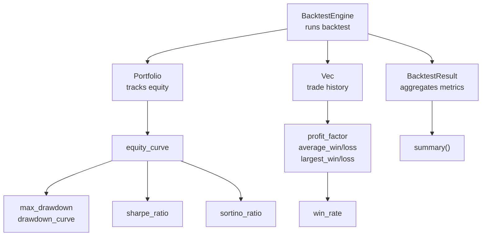
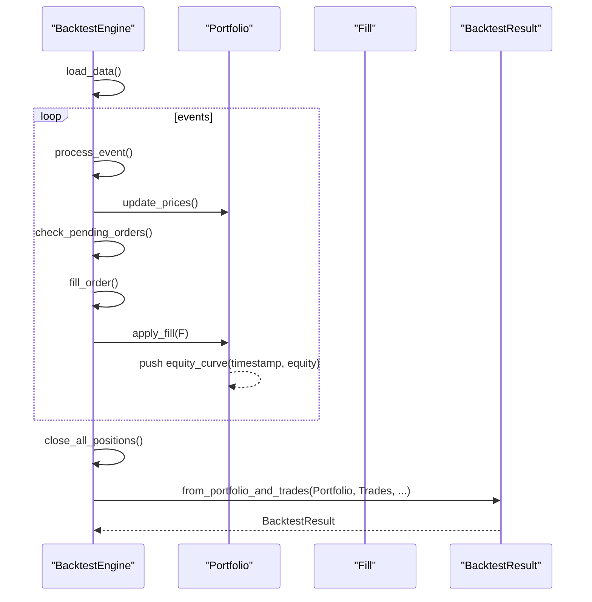
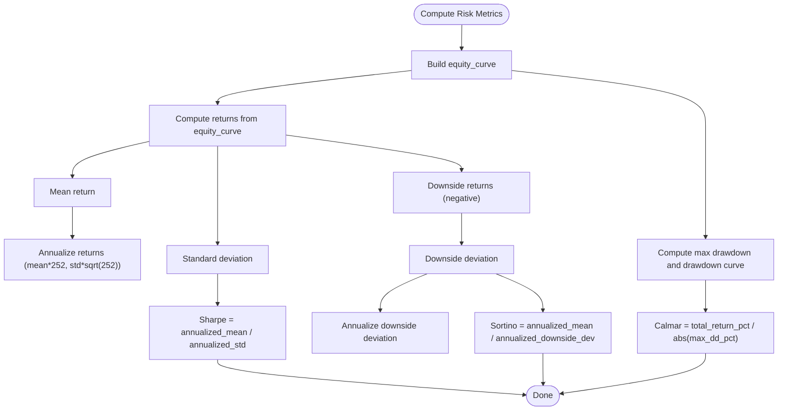
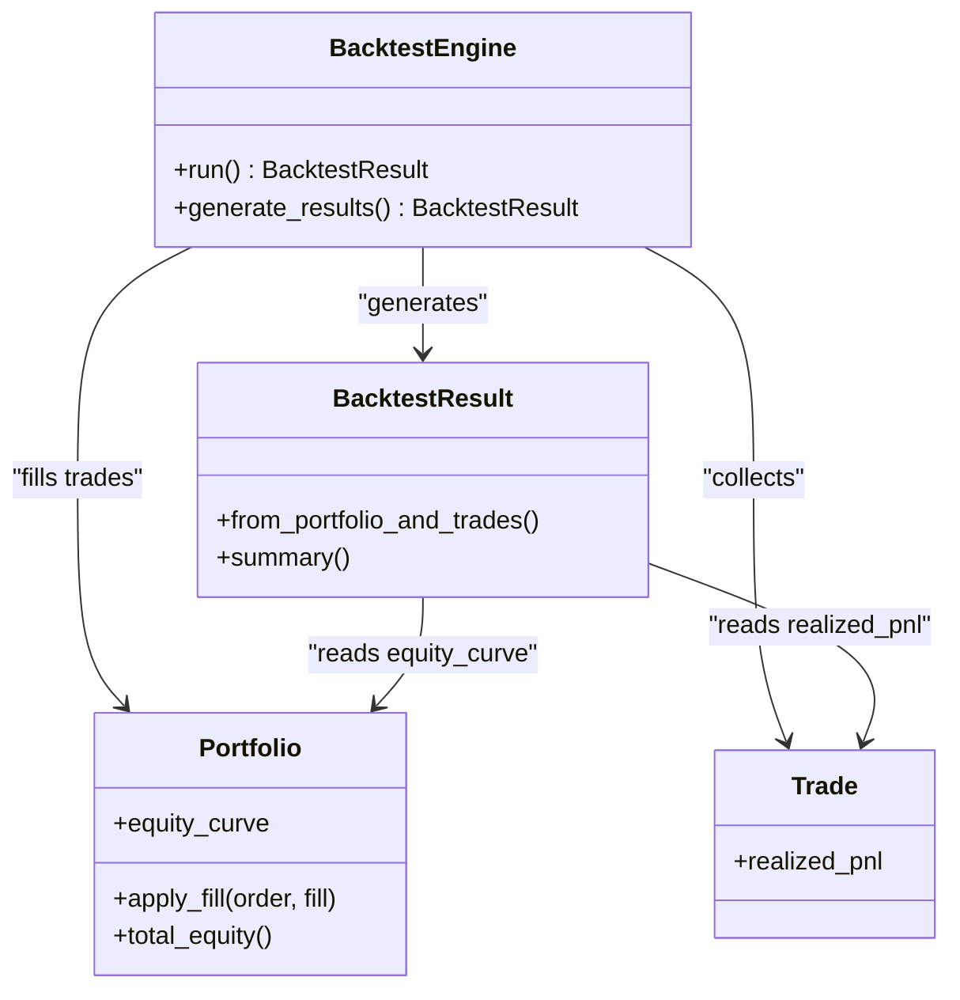
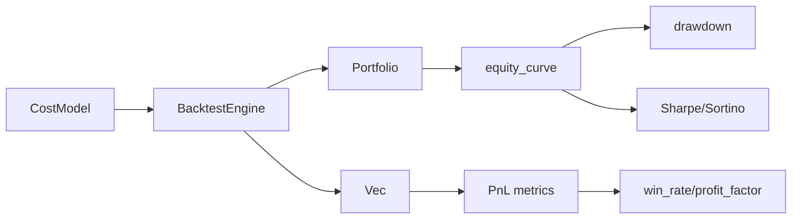

# Performance Metrics

<cite>
**Referenced Files in This Document**
- [results.rs](file://crates/backtest/src/results.rs)
- [portfolio.rs](file://crates/backtest/src/portfolio.rs)
- [trade.rs](file://crates/core/src/models/trade.rs)
- [engine.rs](file://crates/backtest/src/engine.rs)
- [cost_model.rs](file://crates/backtest/src/cost_model.rs)
- [metrics.rs](file://crates/strategy/src/metrics.rs)
- [Risk.vue](file://frontend/src/views/Risk.vue)
- [backtest_simple.rs](file://examples/backtest_simple.rs)
</cite>

## Table of Contents
1. [Introduction](#introduction)
2. [Project Structure](#project-structure)
3. [Core Components](#core-components)
4. [Architecture Overview](#architecture-overview)
5. [Detailed Component Analysis](#detailed-component-analysis)
6. [Dependency Analysis](#dependency-analysis)
7. [Performance Considerations](#performance-considerations)
8. [Troubleshooting Guide](#troubleshooting-guide)
9. [Conclusion](#conclusion)
10. [Appendices](#appendices)

## Introduction
This document explains the performance metrics component used in the backtesting system. It covers how key performance indicators are computed from trade-by-trade results and equity curves, including Sharpe ratio, maximum drawdown, win rate, profit factor, and annualized return. It also describes the data structures used to store backtest results, how metrics relate to the audit trail (individual trades), configuration options affecting metric computation, and practical considerations such as risk-free rate assumptions and survivorship bias.

## Project Structure
The performance metrics are primarily computed in the backtesting module and exposed through the engine and results. The core building blocks are:
- BacktestResult: aggregates all metrics and equity/drawdown curves
- Portfolio: tracks equity over time and realized PnL
- Trade: individual trade records with realized PnL
- Engine: orchestrates the backtest and produces BacktestResult
- CostModel: influences realized PnL via commission and slippage
- Strategy metrics: a separate metrics structure for strategy-level reporting

**Diagram sources**
- [engine.rs](file://crates/backtest/src/engine.rs#L574-L584)
- [portfolio.rs](file://crates/backtest/src/portfolio.rs#L1-L60)
- [results.rs](file://crates/backtest/src/results.rs#L1-L59)
- [trade.rs](file://crates/core/src/models/trade.rs#L1-L60)

**Section sources**
- [engine.rs](file://crates/backtest/src/engine.rs#L574-L584)
- [results.rs](file://crates/backtest/src/results.rs#L1-L59)

## Core Components
- BacktestResult: holds all computed metrics and time-series data (equity curve, drawdown curve). It is constructed from a Portfolio and a vector of Trade records.
- Portfolio: maintains cash, positions, realized PnL, total commission, total slippage, and the equity curve. It updates equity on each fill and records timestamps.
- Trade: captures realized PnL per trade, enabling per-trade aggregation metrics (gross profit/loss, average win/loss, largest win/loss).
- BacktestEngine: runs the backtest, applies fills, builds the equity curve, and generates BacktestResult.

Key metrics computed:
- Win rate: number of winning trades divided by total trades
- Profit factor: gross profit divided by gross loss
- Average win/loss: gross profit/loss divided by number of winning/losing trades
- Largest win/loss: extreme PnL values
- Maximum drawdown: peak-to-trough decline and percentage
- Sharpe ratio: annualized mean return divided by annualized standard deviation
- Sortino ratio: annualized mean return divided by downside deviation
- Calmar ratio: total return divided by maximum drawdown percentage

**Section sources**
- [results.rs](file://crates/backtest/src/results.rs#L49-L153)
- [portfolio.rs](file://crates/backtest/src/portfolio.rs#L1-L60)
- [trade.rs](file://crates/core/src/models/trade.rs#L1-L60)
- [engine.rs](file://crates/backtest/src/engine.rs#L574-L584)

## Architecture Overview
The backtest pipeline produces a BacktestResult containing both trade-level and time-series metrics. The equity curve drives drawdown and risk ratios; the trade list drives PnL and win rate metrics.

**Diagram sources**
- [engine.rs](file://crates/backtest/src/engine.rs#L229-L283)
- [engine.rs](file://crates/backtest/src/engine.rs#L447-L503)
- [portfolio.rs](file://crates/backtest/src/portfolio.rs#L120-L136)
- [results.rs](file://crates/backtest/src/results.rs#L61-L187)

## Detailed Component Analysis

### BacktestResult: Data Structures and Metric Computation
BacktestResult aggregates:
- Capital metrics: initial/final equity, total PnL, total return percentage
- Trade statistics: total/winning/losing trades, win rate
- PnL metrics: gross profit/loss, profit factor, average win/loss, largest win/loss
- Risk metrics: max drawdown, max drawdown percentage, Sharpe ratio, Sortino ratio, Calmar ratio
- Cost analysis: total commission, total slippage, total costs
- Time metrics: average/max/min trade duration hours
- Equity and drawdown curves

Metric computations:
- Win rate: winning_trades / total_trades
- Profit factor: gross_profit / gross_loss (special handling when gross_loss is zero)
- Average win/loss: gross_profit/winning_trades, gross_loss/losing_trades
- Largest win/loss: max/min of realized PnL across trades
- Maximum drawdown: track running peak and compute peak-to-trough percentage; store drawdown curve
- Sharpe ratio: compute periodic returns from equity curve, mean return, standard deviation, annualize using 252 trading days, then divide mean by std dev
- Sortino ratio: same as Sharpe but with downside deviation (only negative returns)
- Calmar ratio: total_return_pct / max_drawdown_pct (absolute value used)

**Diagram sources**
- [results.rs](file://crates/backtest/src/results.rs#L189-L219)
- [results.rs](file://crates/backtest/src/results.rs#L221-L273)
- [results.rs](file://crates/backtest/src/results.rs#L275-L331)

**Section sources**
- [results.rs](file://crates/backtest/src/results.rs#L49-L153)
- [results.rs](file://crates/backtest/src/results.rs#L189-L219)
- [results.rs](file://crates/backtest/src/results.rs#L221-L273)
- [results.rs](file://crates/backtest/src/results.rs#L275-L331)

### Relationship Between Performance Metrics and the Audit Trail
- Trade-level metrics rely on realized PnL stored in each Trade record. These enable gross profit/loss, average win/loss, profit factor, and largest win/loss.
- Time-series metrics rely on the equity curve recorded by the Portfolio during fills. These enable drawdown, Sharpe, Sortino, and Calmar.
- The engine collects trades and fills them into the Portfolio, which updates equity and records timestamps. BacktestResult consumes both to compute all metrics.

**Diagram sources**
- [engine.rs](file://crates/backtest/src/engine.rs#L447-L503)
- [engine.rs](file://crates/backtest/src/engine.rs#L574-L584)
- [portfolio.rs](file://crates/backtest/src/portfolio.rs#L120-L136)
- [results.rs](file://crates/backtest/src/results.rs#L61-L187)
- [trade.rs](file://crates/core/src/models/trade.rs#L1-L60)

**Section sources**
- [engine.rs](file://crates/backtest/src/engine.rs#L447-L503)
- [engine.rs](file://crates/backtest/src/engine.rs#L574-L584)
- [portfolio.rs](file://crates/backtest/src/portfolio.rs#L120-L136)
- [results.rs](file://crates/backtest/src/results.rs#L61-L187)
- [trade.rs](file://crates/core/src/models/trade.rs#L1-L60)

### Configuration Options for Metric Calculation
- BacktestConfig controls the period (start/end time), symbols, interval, and cost model. These indirectly influence metrics:
  - Period affects annualization scaling and return computation.
  - Cost model affects realized PnL and equity curve shape, thus drawdown and Sharpe/Sortino.
- Position sizing affects trade sizes and volatility, influencing Sharpe and Sortino.

Practical configuration highlights:
- Annualization factor: Sharpe/Sortino assume 252 trading days per year.
- Risk-free rate: Not included in Sharpe/Sortino computation; the code computes raw annualized returns and deviations without subtracting a risk-free rate.
- Drawdown: Computed from the equity curve; the period is determined by the backtest window.

**Section sources**
- [engine.rs](file://crates/backtest/src/engine.rs#L77-L137)
- [results.rs](file://crates/backtest/src/results.rs#L243-L273)
- [results.rs](file://crates/backtest/src/results.rs#L321-L331)

### Practical Examples from the Codebase
- Example usage prints a summary including Sharpe, Sortino, and Calmar ratios, demonstrating how BacktestResult exposes these metrics for reporting.
- Frontend displays Sharpe and volatility, indicating how metrics are surfaced to users.

**Section sources**
- [backtest_simple.rs](file://examples/backtest_simple.rs#L218-L247)
- [Risk.vue](file://frontend/src/views/Risk.vue#L220-L245)

## Dependency Analysis
- BacktestEngine depends on Portfolio and Trade to construct BacktestResult.
- BacktestResult depends on equity_curve and trade list to compute metrics.
- CostModel influences realized PnL and equity curve shape, indirectly affecting all risk metrics.

**Diagram sources**
- [cost_model.rs](file://crates/backtest/src/cost_model.rs#L152-L208)
- [engine.rs](file://crates/backtest/src/engine.rs#L447-L503)
- [portfolio.rs](file://crates/backtest/src/portfolio.rs#L120-L136)
- [results.rs](file://crates/backtest/src/results.rs#L61-L187)

**Section sources**
- [cost_model.rs](file://crates/backtest/src/cost_model.rs#L152-L208)
- [engine.rs](file://crates/backtest/src/engine.rs#L447-L503)
- [portfolio.rs](file://crates/backtest/src/portfolio.rs#L120-L136)
- [results.rs](file://crates/backtest/src/results.rs#L61-L187)

## Performance Considerations
- Equity curve granularity: Finer intervals increase computation time for returns and standard deviation but improve Sharpe/Sortino precision.
- Annualization: Assumes 252 trading days; mismatch with actual calendar days can distort ratios.
- Cost model sensitivity: Higher commission/slippage reduces realized PnL and increases drawdown magnitude, lowering Sharpe/Sortino and increasing Calmar.
- Data sufficiency: Fewer trades reduce reliability of profit factor and Sharpe; fewer equity points reduce drawdown stability.

[No sources needed since this section provides general guidance]

## Troubleshooting Guide
Common issues and resolutions:
- Sharpe/Sortino equal to zero or undefined:
  - Cause: Insufficient equity points or constant returns.
  - Resolution: Ensure sufficient equity points and non-zero returns; verify cost model is realistic.
- Profit factor infinite or zero:
  - Cause: Zero gross loss leads to division by zero; zero gross profit with positive gross loss yields zero.
  - Resolution: Check trade list completeness and realized PnL.
- Maximum drawdown appears flat:
  - Cause: Sparse equity curve or minimal volatility.
  - Resolution: Increase data frequency or adjust position sizing.
- Risk-free rate confusion:
  - Clarification: Sharpe/Sortino here are computed without subtracting a risk-free rate; if needed, adjust returns accordingly in downstream analytics.
- Survivorship bias mitigation:
  - Symptom: Overly optimistic Sharpe/Sortino due to only surviving assets.
  - Mitigation: Use universe-wide data, incorporate delisting/removal rules, and report drawdown curves to visualize worst-case scenarios.

**Section sources**
- [results.rs](file://crates/backtest/src/results.rs#L94-L136)
- [results.rs](file://crates/backtest/src/results.rs#L189-L219)
- [results.rs](file://crates/backtest/src/results.rs#L221-L273)
- [results.rs](file://crates/backtest/src/results.rs#L275-L331)

## Conclusion
The performance metrics component integrates trade-by-trade realized PnL with equity-time series to produce robust risk-adjusted and outcome measures. BacktestResult centralizes these computations, while Portfolio and Trade form the audit trail. Configuration choices around period, cost model, and position sizing significantly impact results. Awareness of assumptions (no risk-free rate subtraction, 252-day annualization) and potential biases (survivorship) ensures accurate interpretation.

[No sources needed since this section summarizes without analyzing specific files]

## Appendices

### Appendix A: Strategy-Level Metrics (Optional)
The strategy crate provides a separate PerformanceMetrics structure for strategy-level reporting. It includes win rate and profit factor computed from average win/loss and counts, and optionally a Sharpe ratio field.

**Section sources**
- [metrics.rs](file://crates/strategy/src/metrics.rs#L1-L70)

### Appendix B: Frontend Exposure of Metrics
The frontend displays Sharpe and volatility, reflecting how BacktestResult metrics are surfaced to users.

**Section sources**
- [Risk.vue](file://frontend/src/views/Risk.vue#L220-L245)