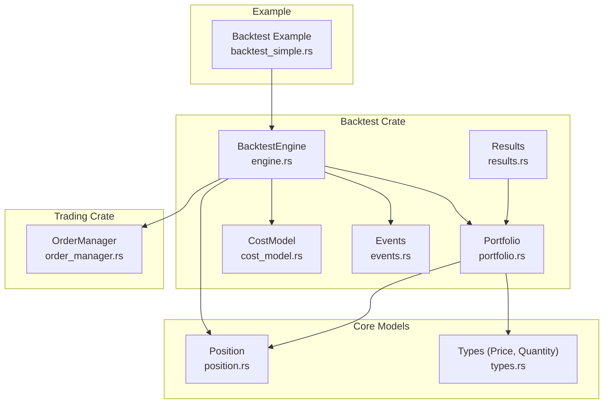
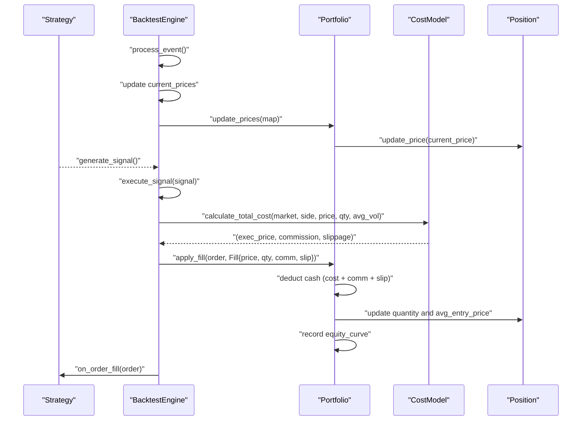
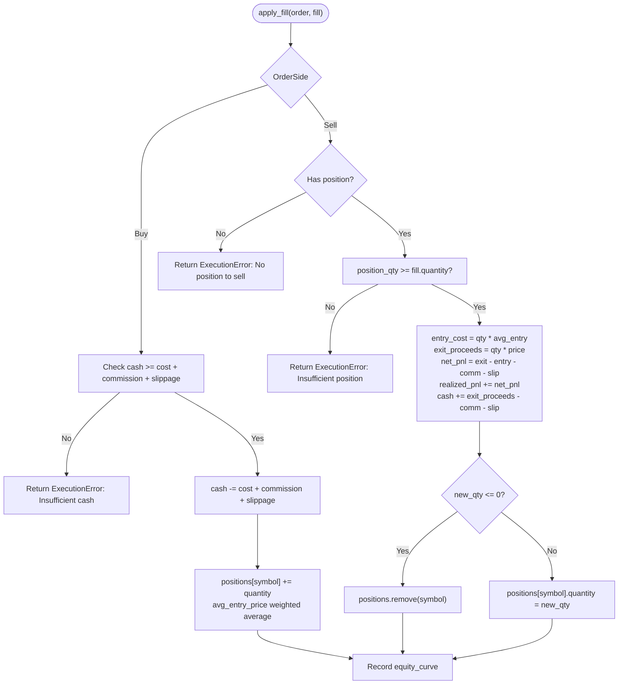
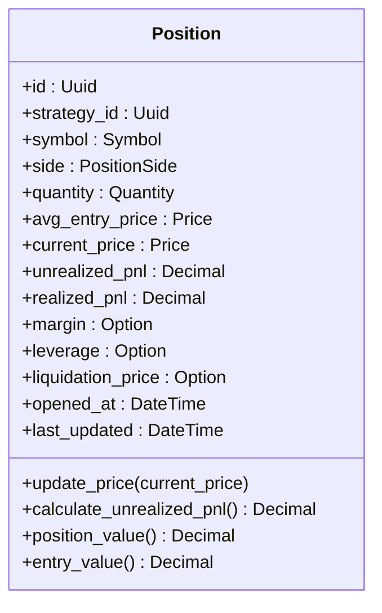
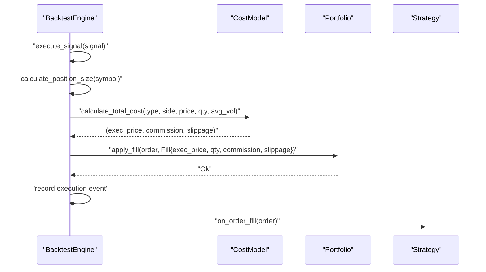
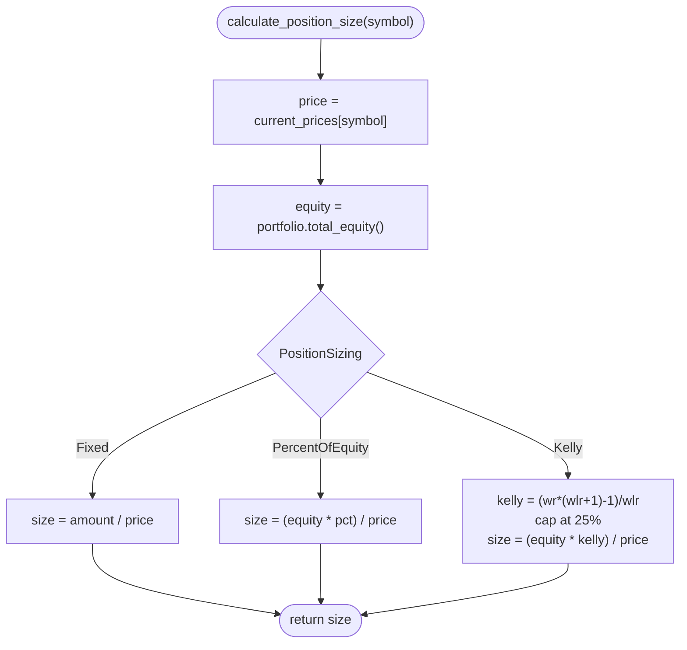
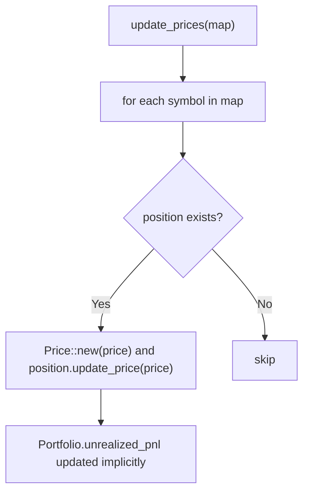
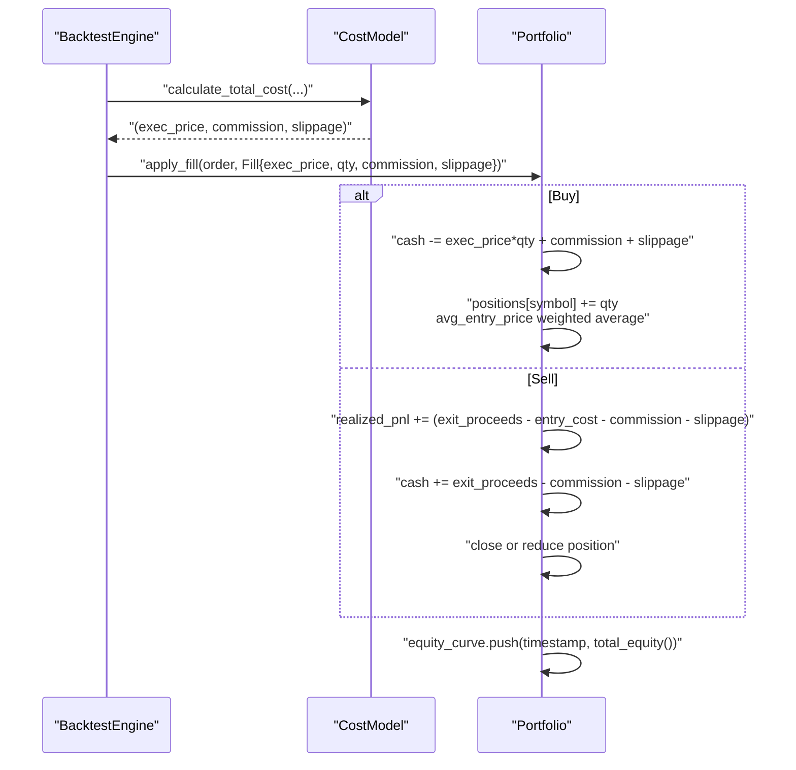
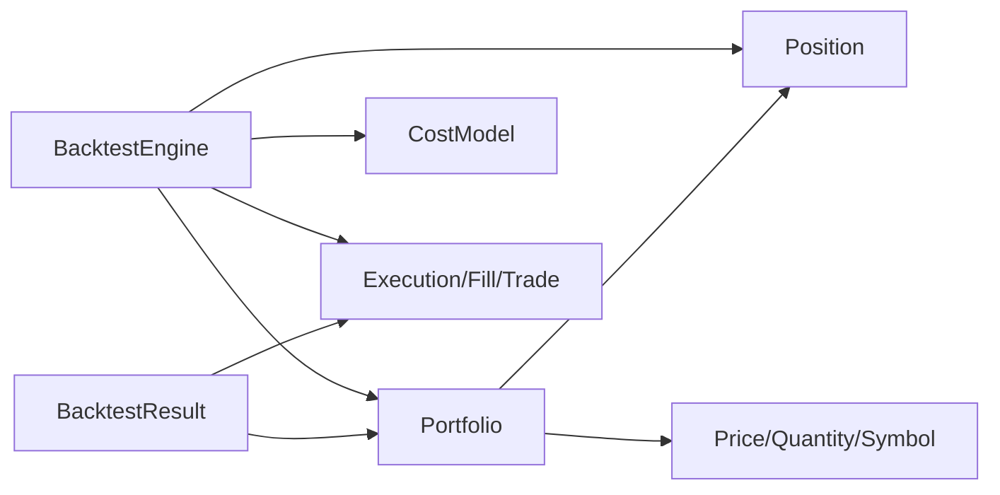

# Portfolio Simulation

<cite>
**Referenced Files in This Document**
- [portfolio.rs](file://crates/backtest/src/portfolio.rs)
- [engine.rs](file://crates/backtest/src/engine.rs)
- [position.rs](file://crates/core/src/models/position.rs)
- [cost_model.rs](file://crates/backtest/src/cost_model.rs)
- [events.rs](file://crates/backtest/src/events.rs)
- [results.rs](file://crates/backtest/src/results.rs)
- [order_manager.rs](file://crates/trading/src/order_manager.rs)
- [backtest_simple.rs](file://examples/backtest_simple.rs)
- [types.rs](file://crates/core/src/types.rs)
- [validators.rs](file://crates/risk/src/validators.rs)
- [001_initial_schema.sql](file://migrations/001_initial_schema.sql)
</cite>

## Table of Contents
1. [Introduction](#introduction)
2. [Project Structure](#project-structure)
3. [Core Components](#core-components)
4. [Architecture Overview](#architecture-overview)
5. [Detailed Component Analysis](#detailed-component-analysis)
6. [Dependency Analysis](#dependency-analysis)
7. [Performance Considerations](#performance-considerations)
8. [Troubleshooting Guide](#troubleshooting-guide)
9. [Conclusion](#conclusion)
10. [Appendices](#appendices)

## Introduction
This document explains the portfolio simulation component used in backtesting. It covers how positions, cash balance, and PnL are tracked over time, how trades are executed and reflected in portfolio state, and how the portfolio integrates with the order execution system. It also documents configuration options for initial capital, leverage, and position sizing, and addresses common issues such as margin calculations and their solutions.

## Project Structure
The portfolio simulation lives primarily in the backtest crate and interacts with shared core models and strategy interfaces. The example demonstrates a typical workflow from strategy signals to order execution and portfolio updates.

**Diagram sources**
- [engine.rs](file://crates/backtest/src/engine.rs#L140-L585)
- [portfolio.rs](file://crates/backtest/src/portfolio.rs#L1-L244)
- [cost_model.rs](file://crates/backtest/src/cost_model.rs#L1-L280)
- [events.rs](file://crates/backtest/src/events.rs#L1-L189)
- [results.rs](file://crates/backtest/src/results.rs#L1-L413)
- [position.rs](file://crates/core/src/models/position.rs#L1-L232)
- [types.rs](file://crates/core/src/types.rs#L1-L292)
- [order_manager.rs](file://crates/trading/src/order_manager.rs#L1-L374)
- [backtest_simple.rs](file://examples/backtest_simple.rs#L1-L248)

**Section sources**
- [engine.rs](file://crates/backtest/src/engine.rs#L140-L585)
- [portfolio.rs](file://crates/backtest/src/portfolio.rs#L1-L244)
- [position.rs](file://crates/core/src/models/position.rs#L1-L232)
- [cost_model.rs](file://crates/backtest/src/cost_model.rs#L1-L280)
- [events.rs](file://crates/backtest/src/events.rs#L1-L189)
- [results.rs](file://crates/backtest/src/results.rs#L1-L413)
- [order_manager.rs](file://crates/trading/src/order_manager.rs#L1-L374)
- [backtest_simple.rs](file://examples/backtest_simple.rs#L1-L248)
- [types.rs](file://crates/core/src/types.rs#L1-L292)

## Core Components
- Portfolio: Tracks cash, open positions, realized PnL, total commission, total slippage, and equity curve. Provides methods to apply fills, update prices, compute PnL, and return percentage.
- Position: Represents a single open position with side, quantity, entry price, current price, unrealized PnL, and optional leverage/margin/liquidation fields.
- BacktestEngine: Orchestrates loading market data, processing events, generating signals, placing orders, simulating fills, and updating the portfolio.
- CostModel: Computes commission and slippage for realistic execution pricing and records execution outcomes.
- Events: Defines market events, execution events, fills, and trade records used to track state transitions and PnL computation.
- Results: Aggregates portfolio and trade data into comprehensive backtest metrics.

**Section sources**
- [portfolio.rs](file://crates/backtest/src/portfolio.rs#L1-L244)
- [position.rs](file://crates/core/src/models/position.rs#L1-L232)
- [engine.rs](file://crates/backtest/src/engine.rs#L140-L585)
- [cost_model.rs](file://crates/backtest/src/cost_model.rs#L1-L280)
- [events.rs](file://crates/backtest/src/events.rs#L1-L189)
- [results.rs](file://crates/backtest/src/results.rs#L1-L413)

## Architecture Overview
The backtest engine loads historical candles, feeds them to the strategy, generates signals, calculates position sizes, creates market orders, simulates fills with costs, applies fills to the portfolio, and updates PnL and equity curves. The portfolio encapsulates all financial state and exposes methods to reflect realized and unrealized gains.

**Diagram sources**
- [engine.rs](file://crates/backtest/src/engine.rs#L285-L503)
- [portfolio.rs](file://crates/backtest/src/portfolio.rs#L50-L136)
- [cost_model.rs](file://crates/backtest/src/cost_model.rs#L183-L208)
- [position.rs](file://crates/core/src/models/position.rs#L107-L140)

## Detailed Component Analysis

### Portfolio State and Methods
- State fields:
  - initial_capital, cash, positions (HashMap<Symbol, Position>), realized_pnl, total_commission, total_slippage, equity_curve, current_prices.
- Key methods:
  - apply_fill(order, fill): Deducts funds for buys, updates position average entry price and quantity; for sells, computes realized PnL, adds proceeds minus commission and slippage to cash, and closes or reduces position.
  - update_prices(map): Updates current prices and recomputes unrealized PnL for each position.
  - total_equity(): Sum of cash plus value of open positions.
  - unrealized_pnl(): Sum of unrealized PnL across positions.
  - total_pnl(): realized_pnl + unrealized_pnl().
  - return_pct(): (total_equity() - initial_capital) / initial_capital.
  - get_position(symbol), position_count().

**Diagram sources**
- [portfolio.rs](file://crates/backtest/src/portfolio.rs#L50-L136)

**Section sources**
- [portfolio.rs](file://crates/backtest/src/portfolio.rs#L1-L244)

### Position Model and PnL
- Fields include id, strategy_id, symbol, side, quantity, avg_entry_price, current_price, unrealized_pnl, realized_pnl, margin, leverage, liquidation_price, timestamps.
- Methods:
  - update_price(current_price): Recompute unrealized PnL based on side and quantity.
  - calculate_unrealized_pnl(): Long: (current - entry) * qty; Short: (entry - current) * qty.
  - position_value(): current_price * quantity.
  - entry_value(): avg_entry_price * quantity.

**Diagram sources**
- [position.rs](file://crates/core/src/models/position.rs#L1-L232)

**Section sources**
- [position.rs](file://crates/core/src/models/position.rs#L1-L232)

### Order Execution and Portfolio Updates
- BacktestEngine executes signals by calculating position size, creating market orders, and simulating fills with cost model.
- On fill, it constructs a Fill with execution price, commission, and slippage, then calls portfolio.apply_fill.
- After applying fills, it records execution events and notifies the strategy.

**Diagram sources**
- [engine.rs](file://crates/backtest/src/engine.rs#L391-L503)
- [cost_model.rs](file://crates/backtest/src/cost_model.rs#L183-L208)
- [portfolio.rs](file://crates/backtest/src/portfolio.rs#L50-L136)

**Section sources**
- [engine.rs](file://crates/backtest/src/engine.rs#L391-L503)
- [cost_model.rs](file://crates/backtest/src/cost_model.rs#L183-L208)
- [portfolio.rs](file://crates/backtest/src/portfolio.rs#L50-L136)

### Position Sizing and Configuration
- BacktestConfig includes initial_capital, symbols, interval, cost_model, verbose, max_positions, and position_sizing.
- PositionSizing modes:
  - Fixed amount per trade.
  - Percentage of equity per trade.
  - Kelly criterion with win_rate and win_loss_ratio, capped at 25%.
- BacktestEngine.calculate_position_size determines size based on current price, equity, and selected mode.

**Diagram sources**
- [engine.rs](file://crates/backtest/src/engine.rs#L505-L529)

**Section sources**
- [engine.rs](file://crates/backtest/src/engine.rs#L77-L137)
- [engine.rs](file://crates/backtest/src/engine.rs#L505-L529)

### Unrealized PnL Calculation
- Portfolio.update_prices updates current_prices and calls Position.update_price, which recomputes unrealized PnL.
- Portfolio.unrealized_pnl sums unrealized PnL across all positions.

**Diagram sources**
- [portfolio.rs](file://crates/backtest/src/portfolio.rs#L138-L150)
- [position.rs](file://crates/core/src/models/position.rs#L107-L140)

**Section sources**
- [portfolio.rs](file://crates/backtest/src/portfolio.rs#L138-L150)
- [position.rs](file://crates/core/src/models/position.rs#L107-L140)

### Trade Execution and Filled Orders Impact
- BacktestEngine.fill_order computes execution price, commission, and slippage via CostModel, constructs a Fill, applies it to the portfolio, records execution events, and notifies the strategy.
- Portfolio.apply_fill enforces cash availability for buys and position availability for sells, updates quantities and average entry prices, accumulates realized PnL, and records equity curve.

**Diagram sources**
- [engine.rs](file://crates/backtest/src/engine.rs#L447-L503)
- [cost_model.rs](file://crates/backtest/src/cost_model.rs#L183-L208)
- [portfolio.rs](file://crates/backtest/src/portfolio.rs#L50-L136)

**Section sources**
- [engine.rs](file://crates/backtest/src/engine.rs#L447-L503)
- [portfolio.rs](file://crates/backtest/src/portfolio.rs#L50-L136)

### Example: Running a Backtest
- The example sets initial_capital, symbols, interval, cost_model, max_positions, and position_sizing.
- It creates a simple moving average crossover strategy, loads sample candles, runs the engine, and prints results.

**Section sources**
- [backtest_simple.rs](file://examples/backtest_simple.rs#L150-L248)

## Dependency Analysis
- BacktestEngine depends on Portfolio, CostModel, Position, and Strategy interfaces.
- Portfolio depends on Position and core types (Price, Quantity, Symbol).
- CostModel depends on OrderType and OrderSide to compute commission and slippage.
- Events define the data structures used to track fills and trades.
- Results aggregates portfolio and trade data into metrics.

**Diagram sources**
- [engine.rs](file://crates/backtest/src/engine.rs#L140-L585)
- [portfolio.rs](file://crates/backtest/src/portfolio.rs#L1-L244)
- [position.rs](file://crates/core/src/models/position.rs#L1-L232)
- [cost_model.rs](file://crates/backtest/src/cost_model.rs#L1-L280)
- [events.rs](file://crates/backtest/src/events.rs#L1-L189)
- [results.rs](file://crates/backtest/src/results.rs#L1-L413)
- [types.rs](file://crates/core/src/types.rs#L1-L292)

**Section sources**
- [engine.rs](file://crates/backtest/src/engine.rs#L140-L585)
- [portfolio.rs](file://crates/backtest/src/portfolio.rs#L1-L244)
- [position.rs](file://crates/core/src/models/position.rs#L1-L232)
- [cost_model.rs](file://crates/backtest/src/cost_model.rs#L1-L280)
- [events.rs](file://crates/backtest/src/events.rs#L1-L189)
- [results.rs](file://crates/backtest/src/results.rs#L1-L413)
- [types.rs](file://crates/core/src/types.rs#L1-L292)

## Performance Considerations
- Portfolio operations are O(n_positions) per price update; keep positions minimal or use symbol-keyed updates.
- CostModel computations are constant time per fill; ensure avg_volume is precomputed per symbol.
- Equity curve growth is linear in number of events; storing every timestamp is memory-intensive for long runs—consider downsampling if needed.
- Position sizing uses current price and equity; frequent recalculation is negligible compared to event processing.

[No sources needed since this section provides general guidance]

## Troubleshooting Guide
Common issues and resolutions:
- Insufficient cash for buy order:
  - Cause: cash < cost + commission + slippage.
  - Resolution: Increase initial_capital or reduce position size via position_sizing.
  - Evidence: Portfolio.apply_fill returns an execution error for insufficient funds.
- Insufficient position for sell order:
  - Cause: sell quantity exceeds current position.
  - Resolution: Ensure signals close positions before selling excess or adjust position sizing.
  - Evidence: Portfolio.apply_fill returns an execution error indicating no position to sell or insufficient position.
- No price available:
  - Cause: current_prices missing symbol.
  - Resolution: Ensure market data is loaded and current_prices populated before order execution.
  - Evidence: BacktestEngine.fill_order errors when price is unavailable.
- Excessive costs eroding returns:
  - Cause: high commission or slippage rates.
  - Resolution: Adjust CostModel (e.g., okx_spot_conservative vs aggressive), reduce position size, or increase spread tolerance.
  - Evidence: CostModel.calculate_total_cost returns higher commission/slippage.
- Equity curve anomalies:
  - Cause: missing fills or incorrect price updates.
  - Resolution: Verify event processing order and update_prices calls.
  - Evidence: BacktestEngine.process_event updates current_prices and calls portfolio.update_prices.

**Section sources**
- [portfolio.rs](file://crates/backtest/src/portfolio.rs#L50-L136)
- [engine.rs](file://crates/backtest/src/engine.rs#L447-L503)
- [cost_model.rs](file://crates/backtest/src/cost_model.rs#L183-L208)

## Conclusion
The portfolio simulation provides a robust foundation for backtesting by tracking cash, positions, and PnL, modeling realistic execution costs, and integrating seamlessly with the order execution pipeline. Configuration options enable flexible capital allocation and risk control, while the design cleanly separates concerns between engine orchestration, portfolio state, and cost modeling.

[No sources needed since this section summarizes without analyzing specific files]

## Appendices

### Configuration Options
- Initial capital:
  - BacktestConfig.initial_capital sets the starting cash balance.
- Leverage and margin:
  - Position includes leverage and margin fields; leverage and margin are optional and can be set by external risk validators or future extensions.
  - Risk limits include max_leverage and min_margin_ratio to constrain exposure.
- Position sizing:
  - PositionSizing modes: Fixed, PercentOfEquity, Kelly with capped fraction.

**Section sources**
- [engine.rs](file://crates/backtest/src/engine.rs#L77-L137)
- [position.rs](file://crates/core/src/models/position.rs#L1-L232)
- [validators.rs](file://crates/risk/src/validators.rs#L1-L47)

### Margin Calculations and Solutions
- Margin fields exist in Position but are not computed in the current backtest engine; they can be integrated by:
  - Extending Position with margin computation based on price, quantity, and leverage.
  - Adding risk checks in BacktestEngine before order placement to enforce margin ratios.
  - Storing margin and leverage in the database schema for persistence.
- Practical steps:
  - Compute margin = price * quantity / leverage when leverage is known.
  - Enforce margin >= min_margin_ratio * equity before opening new positions.
  - Track liquidation_price = avg_entry_price +/- spread depending on side.

**Section sources**
- [position.rs](file://crates/core/src/models/position.rs#L1-L232)
- [validators.rs](file://crates/risk/src/validators.rs#L1-L47)
- [001_initial_schema.sql](file://migrations/001_initial_schema.sql#L148-L173)