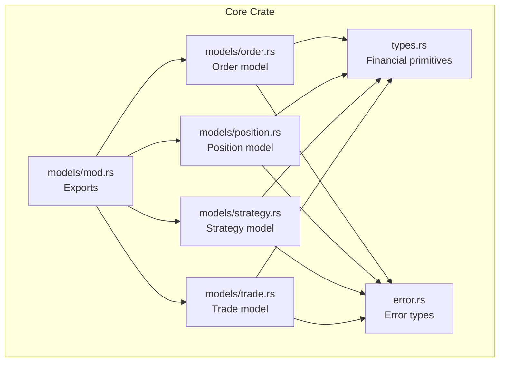
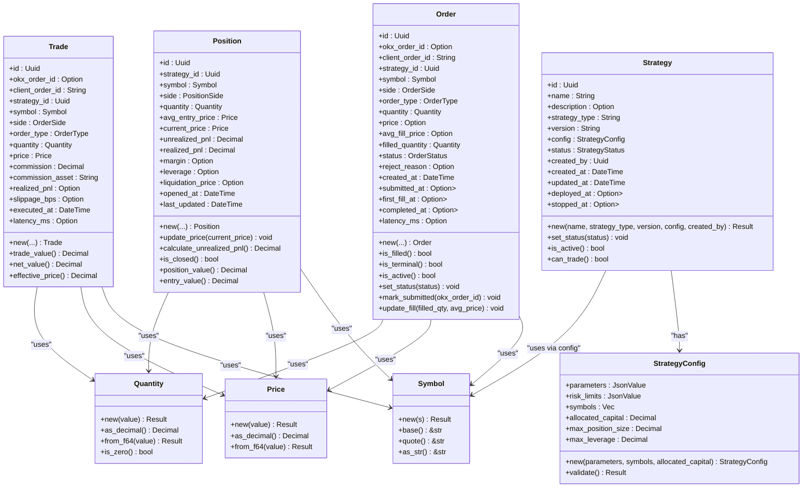
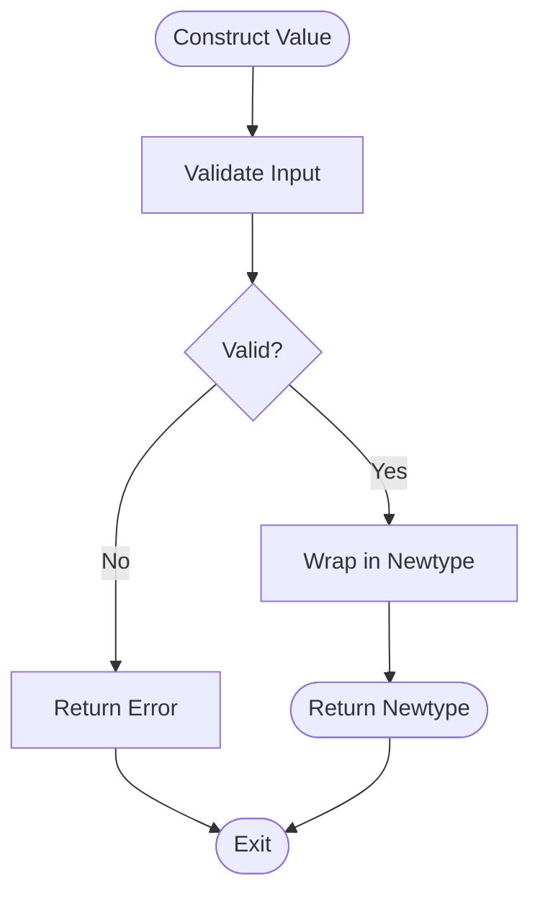
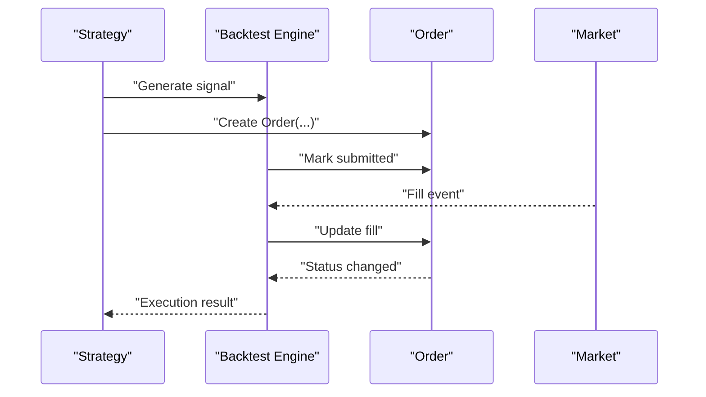
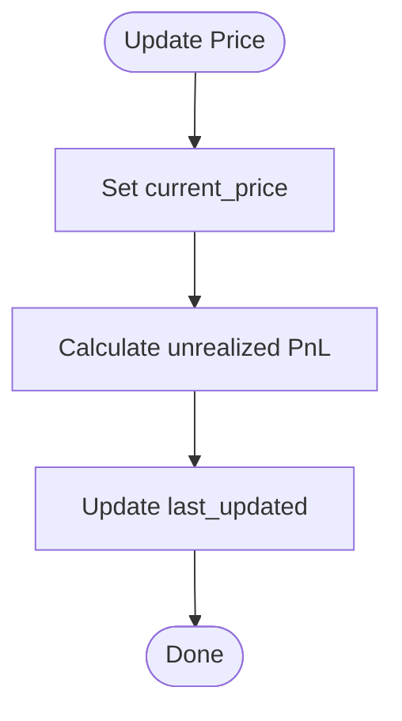
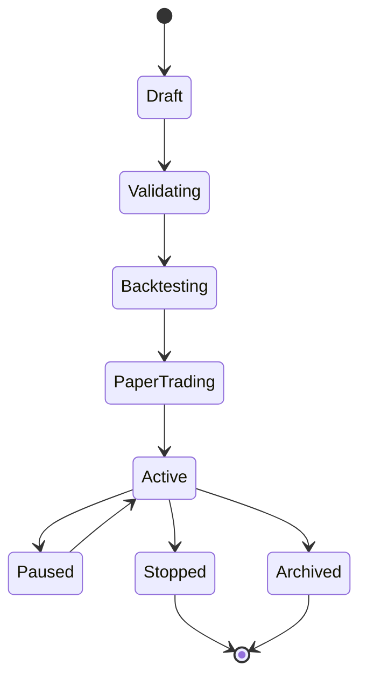
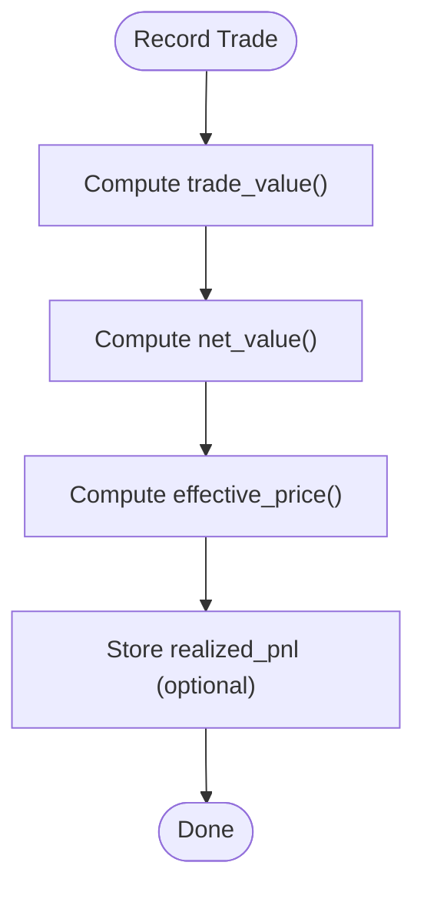
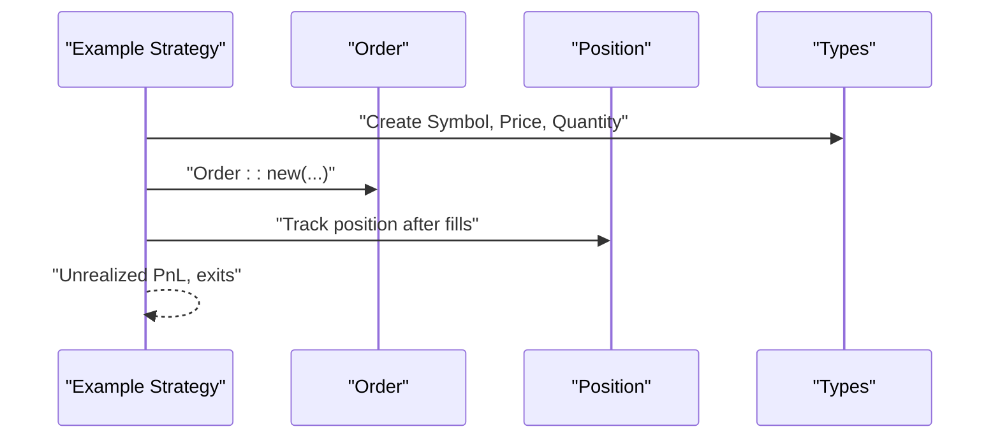
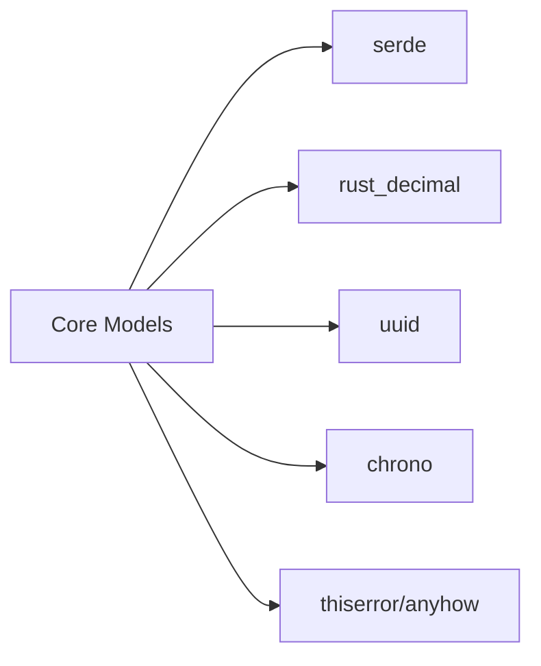

# Core Models

<cite>
**Referenced Files in This Document**
- [types.rs](file://crates/core/src/types.rs)
- [order.rs](file://crates/core/src/models/order.rs)
- [position.rs](file://crates/core/src/models/position.rs)
- [strategy.rs](file://crates/core/src/models/strategy.rs)
- [trade.rs](file://crates/core/src/models/trade.rs)
- [mod.rs](file://crates/core/src/models/mod.rs)
- [error.rs](file://crates/core/src/error.rs)
- [Cargo.toml](file://crates/core/Cargo.toml)
- [simple_ma_crossover.rs](file://examples/simple_ma_crossover.rs)
- [grid_trading.rs](file://examples/grid_trading.rs)
- [engine.rs](file://crates/backtest/src/engine.rs)
</cite>

## Table of Contents
1. [Introduction](#introduction)
2. [Project Structure](#project-structure)
3. [Core Components](#core-components)
4. [Architecture Overview](#architecture-overview)
5. [Detailed Component Analysis](#detailed-component-analysis)
6. [Dependency Analysis](#dependency-analysis)
7. [Performance Considerations](#performance-considerations)
8. [Troubleshooting Guide](#troubleshooting-guide)
9. [Conclusion](#conclusion)
10. [Appendices](#appendices)

## Introduction
This document provides comprehensive data model documentation for the core domain entities that form the foundation of the trading system. It covers the Symbol, Price, Quantity, Order, Position, Strategy, and Trade models. It explains the newtype pattern used for financial primitives to ensure type safety, details serialization/deserialization with serde, and describes business rules and constraints enforced by these models. It also illustrates how these models are used across different components and the design rationale behind the type-safe wrappers.

## Project Structure
The core domain models live under the core crate. The models are grouped into separate modules and re-exported via a central module for convenient imports. Financial primitives are defined in a dedicated module to encapsulate validation and formatting logic.

**Diagram sources**
- [mod.rs](file://crates/core/src/models/mod.rs#L1-L12)
- [types.rs](file://crates/core/src/types.rs#L1-L292)
- [order.rs](file://crates/core/src/models/order.rs#L1-L383)
- [position.rs](file://crates/core/src/models/position.rs#L1-L232)
- [strategy.rs](file://crates/core/src/models/strategy.rs#L1-L306)
- [trade.rs](file://crates/core/src/models/trade.rs#L1-L227)
- [error.rs](file://crates/core/src/error.rs#L1-L67)

**Section sources**
- [mod.rs](file://crates/core/src/models/mod.rs#L1-L12)
- [Cargo.toml](file://crates/core/Cargo.toml#L1-L20)

## Core Components
This section defines the core domain entities and their fields, data types, and validation rules. It also explains the newtype pattern and its benefits for financial calculations.

- Symbol
  - Purpose: Encapsulates trading pair identifiers with strict validation.
  - Fields: Internally holds a validated string in uppercase with base-quote format.
  - Validation rules:
    - Must contain exactly one hyphen separator.
    - Base and quote parts must be non-empty.
    - Stored in uppercase.
  - Methods: Construction with validation, base extraction, quote extraction, string display.
  - Serialization: Uses serde with string representation.

- Price
  - Purpose: Represents price values with decimal precision.
  - Fields: Internally holds a decimal value.
  - Validation rules:
    - Must be strictly greater than zero.
  - Methods: Construction with validation, decimal access, convenience constructors for testing, ordering support.
  - Serialization: Uses serde with decimal representation.

- Quantity
  - Purpose: Represents order/position quantities with decimal precision.
  - Fields: Internally holds a decimal value.
  - Validation rules:
    - Must be greater than or equal to zero.
  - Methods: Construction with validation, decimal access, convenience constructors for testing, zero-check utility.
  - Serialization: Uses serde with decimal representation.

- Order
  - Purpose: Represents a trading instruction with lifecycle tracking.
  - Fields:
    - Identity: id, okx_order_id, client_order_id, strategy_id.
    - Market: symbol, side, order_type, quantity, price.
    - Execution: avg_fill_price, filled_quantity, status, reject_reason.
    - Timing: created_at, submitted_at, first_fill_at, completed_at, latency_ms.
  - Validation rules:
    - Enforced indirectly via construction and updates (e.g., filled quantity compared to quantity determines terminal state).
  - Lifecycle methods: Status transitions, submission marking, fill updates, latency calculation.
  - Serialization: Uses serde with enums serialized as lowercase/snake_case.

- Position
  - Purpose: Tracks an open holding with PnL computation.
  - Fields:
    - Identity: id, strategy_id, symbol.
    - Side: side (Long, Short, Net).
    - Size: quantity, avg_entry_price, current_price.
    - PnL: unrealized_pnl, realized_pnl.
    - Risk: margin, leverage, liquidation_price.
    - Timing: opened_at, last_updated.
  - Computed methods: Unrealized PnL calculation, closing detection, position value, entry value.
  - Serialization: Uses serde with enums serialized as lowercase.

- Strategy
  - Purpose: Defines a trading strategy with configuration and lifecycle.
  - Fields:
    - Identity: id, name, description, strategy_type, version, created_by.
    - Config: parameters (JSON), risk_limits (JSON), symbols, allocated_capital, max_position_size, max_leverage.
    - Lifecycle: status, timestamps (created_at, updated_at, deployed_at, stopped_at).
  - Validation rules:
    - Allocated capital must be positive.
    - Leverage must be between 0 and 10.
    - At least one symbol is required.
  - Lifecycle methods: Status transitions, active checks, trading permission checks.
  - Serialization: Uses serde with enums serialized as lowercase.

- Trade
  - Purpose: Records a completed execution event with realized PnL and metrics.
  - Fields:
    - Identity: id, okx_order_id, client_order_id, strategy_id.
    - Market: symbol, side, order_type, quantity, price.
    - Fees: commission, commission_asset.
    - PnL: realized_pnl (optional).
    - Metrics: slippage_bps (optional), executed_at, latency_ms (optional).
  - Computed methods: Trade value, net value, effective price.
  - Serialization: Uses serde with enums serialized as lowercase/snake_case.

Benefits of the newtype pattern:
- Prevents mixing incompatible numeric types (e.g., price vs quantity).
- Centralizes validation logic for financial values.
- Ensures consistent formatting and serialization behavior.
- Enables safe arithmetic through explicit conversions and helpers.

**Section sources**
- [types.rs](file://crates/core/src/types.rs#L1-L292)
- [order.rs](file://crates/core/src/models/order.rs#L1-L383)
- [position.rs](file://crates/core/src/models/position.rs#L1-L232)
- [strategy.rs](file://crates/core/src/models/strategy.rs#L1-L306)
- [trade.rs](file://crates/core/src/models/trade.rs#L1-L227)

## Architecture Overview
The models are designed around a shared set of financial primitives and are consumed by strategies, backtesting engines, and trading components. The following diagram shows how the models relate to each other and to external dependencies.

**Diagram sources**
- [types.rs](file://crates/core/src/types.rs#L1-L292)
- [order.rs](file://crates/core/src/models/order.rs#L1-L383)
- [position.rs](file://crates/core/src/models/position.rs#L1-L232)
- [strategy.rs](file://crates/core/src/models/strategy.rs#L1-L306)
- [trade.rs](file://crates/core/src/models/trade.rs#L1-L227)

## Detailed Component Analysis

### Financial Primitives: Symbol, Price, Quantity
- Design pattern: Newtype over validated types.
- Validation ensures correctness at construction time.
- Serialization uses serde with string/decimal formats.
- Ordering is supported for Price and Quantity to enable comparisons.

**Diagram sources**
- [types.rs](file://crates/core/src/types.rs#L1-L292)

**Section sources**
- [types.rs](file://crates/core/src/types.rs#L1-L292)

### Order Model
- Lifecycle: Created → Submitted → Partial/Filled or Cancelled/Rejected/Failed.
- Fill tracking: filled_quantity and avg_fill_price update status accordingly.
- Latency measurement: computed from submission to first fill.
- Enum serialization: lowercase/snake_case for interoperability.

**Diagram sources**
- [order.rs](file://crates/core/src/models/order.rs#L1-L383)
- [engine.rs](file://crates/backtest/src/engine.rs#L1-L200)

**Section sources**
- [order.rs](file://crates/core/src/models/order.rs#L1-L383)

### Position Model
- PnL computation: Unrealized PnL depends on side (Long/Short/Net).
- Closing detection: Zero quantity indicates closed position.
- Value computations: Position value and entry value derived from current and entry prices.

**Diagram sources**
- [position.rs](file://crates/core/src/models/position.rs#L1-L232)

**Section sources**
- [position.rs](file://crates/core/src/models/position.rs#L1-L232)

### Strategy Model
- Configuration validation: Positive capital, bounded leverage, non-empty symbols.
- Lifecycle management: Status transitions and timestamps.
- Trading permissions: Active/PaperTrading allow trading.

**Diagram sources**
- [strategy.rs](file://crates/core/src/models/strategy.rs#L1-L306)

**Section sources**
- [strategy.rs](file://crates/core/src/models/strategy.rs#L1-L306)

### Trade Model
- Completed execution recording: quantity, price, fees, realized PnL.
- Metrics: trade value, net value, effective price, slippage, latency.

**Diagram sources**
- [trade.rs](file://crates/core/src/models/trade.rs#L1-L227)

**Section sources**
- [trade.rs](file://crates/core/src/models/trade.rs#L1-L227)

### Cross-Cutting Usage Examples
- Example strategies demonstrate usage of Orders, Positions, and Symbols in real scenarios.
- Grid trading creates limit orders across grid levels using Price and Quantity.
- MA crossover strategy constructs Orders and tracks Position state.

**Diagram sources**
- [simple_ma_crossover.rs](file://examples/simple_ma_crossover.rs#L1-L437)
- [grid_trading.rs](file://examples/grid_trading.rs#L1-L162)
- [order.rs](file://crates/core/src/models/order.rs#L1-L383)
- [position.rs](file://crates/core/src/models/position.rs#L1-L232)
- [types.rs](file://crates/core/src/types.rs#L1-L292)

**Section sources**
- [simple_ma_crossover.rs](file://examples/simple_ma_crossover.rs#L1-L437)
- [grid_trading.rs](file://examples/grid_trading.rs#L1-L162)

## Dependency Analysis
The core models depend on:
- serde for serialization/deserialization.
- rust_decimal for precise decimal arithmetic.
- uuid for unique identifiers.
- chrono for timestamps.
- thiserror/anyhow for error handling.

**Diagram sources**
- [Cargo.toml](file://crates/core/Cargo.toml#L1-L20)

**Section sources**
- [Cargo.toml](file://crates/core/Cargo.toml#L1-L20)

## Performance Considerations
- Prefer constructing values via new() to ensure validation overhead occurs once during creation.
- Use Decimal arithmetic consistently to avoid floating-point drift.
- Avoid unnecessary cloning of large structures; pass references where possible.
- Serialization/deserialization costs can be mitigated by batching and using compact formats when appropriate.

## Troubleshooting Guide
Common issues and resolutions:
- Invalid Symbol format: Ensure the symbol contains exactly one hyphen and non-empty base/quote parts.
- Invalid Price/Quantity: Ensure price is positive and quantity is non-negative.
- Order lifecycle errors: Verify status transitions and timing fields are updated correctly upon fills and submissions.
- Strategy configuration errors: Check allocated capital, leverage bounds, and symbol list.

Where to look:
- Error definitions and propagation.
- Model constructors and validation logic.
- Lifecycle methods and computed fields.

**Section sources**
- [error.rs](file://crates/core/src/error.rs#L1-L67)
- [types.rs](file://crates/core/src/types.rs#L1-L292)
- [order.rs](file://crates/core/src/models/order.rs#L1-L383)
- [position.rs](file://crates/core/src/models/position.rs#L1-L232)
- [strategy.rs](file://crates/core/src/models/strategy.rs#L1-L306)
- [trade.rs](file://crates/core/src/models/trade.rs#L1-L227)

## Conclusion
The core models establish a robust, type-safe foundation for financial calculations and trading workflows. The newtype pattern enforces correctness, while serde enables seamless persistence and communication. The Order, Position, Strategy, and Trade models capture essential lifecycle and state transitions, and the example strategies illustrate practical usage across components.

## Appendices

### Serialization/Desserialization Details
- All models derive serde Serialize/Deserialize.
- Enums are serialized using snake_case or lowercase variants as defined.
- Decimal values are serialized according to rust_decimal’s representation.
- Errors propagate from serde_json into the core Error type for unified error handling.

**Section sources**
- [order.rs](file://crates/core/src/models/order.rs#L1-L383)
- [position.rs](file://crates/core/src/models/position.rs#L1-L232)
- [strategy.rs](file://crates/core/src/models/strategy.rs#L1-L306)
- [trade.rs](file://crates/core/src/models/trade.rs#L1-L227)
- [error.rs](file://crates/core/src/error.rs#L1-L67)