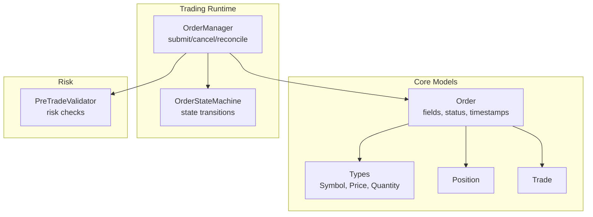
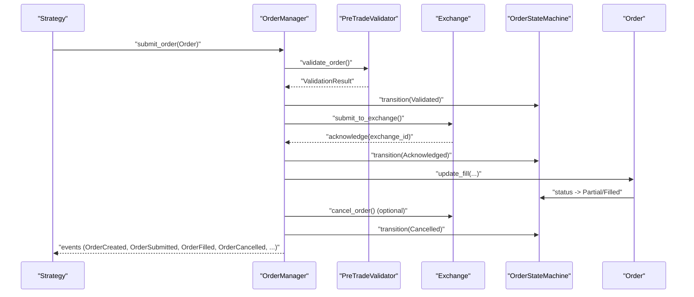
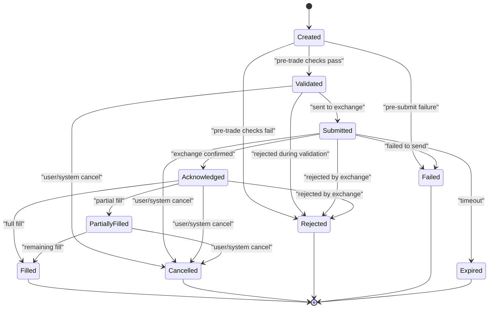
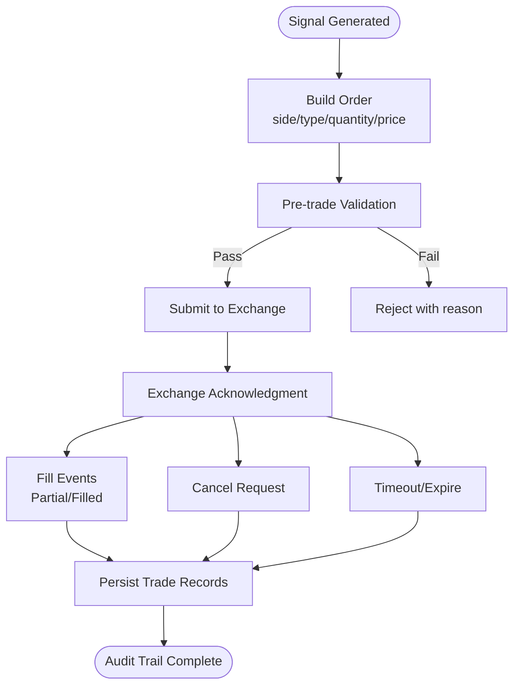
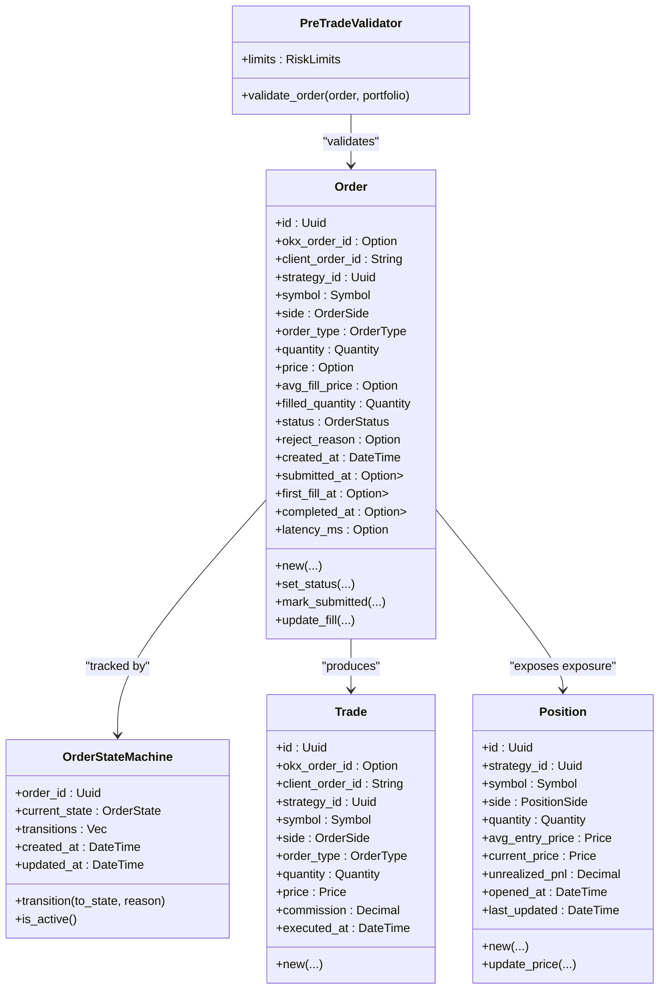

# Order Model

<cite>
**Referenced Files in This Document**
- [order.rs](file://crates/core/src/models/order.rs)
- [state_machine.rs](file://crates/trading/src/state_machine.rs)
- [order_manager.rs](file://crates/trading/src/order_manager.rs)
- [validators.rs](file://crates/risk/src/validators.rs)
- [types.rs](file://crates/core/src/types.rs)
- [position.rs](file://crates/core/src/models/position.rs)
- [trade.rs](file://crates/core/src/models/trade.rs)
- [grid_trading.rs](file://examples/grid_trading.rs)
</cite>

## Table of Contents
1. [Introduction](#introduction)
2. [Project Structure](#project-structure)
3. [Core Components](#core-components)
4. [Architecture Overview](#architecture-overview)
5. [Detailed Component Analysis](#detailed-component-analysis)
6. [Dependency Analysis](#dependency-analysis)
7. [Performance Considerations](#performance-considerations)
8. [Troubleshooting Guide](#troubleshooting-guide)
9. [Conclusion](#conclusion)

## Introduction
This document provides comprehensive data model documentation for the Order entity, covering field definitions, data types, validation rules, state machine behavior, relationships with Position and Trade, lifecycle examples, business rules, and serialization/deserialization with serde. It also explains how the Order model integrates with the broader trading system, including pre-trade risk validation and reconciliation workflows.

## Project Structure
The Order model is part of the core trading library and interacts with the trading runtime, risk validation, and state machine components. The following diagram shows the primary modules involved in the Order lifecycle.

**Diagram sources**
- [order.rs](file://crates/core/src/models/order.rs#L94-L265)
- [types.rs](file://crates/core/src/types.rs#L13-L179)
- [order_manager.rs](file://crates/trading/src/order_manager.rs#L110-L221)
- [state_machine.rs](file://crates/trading/src/state_machine.rs#L8-L31)
- [validators.rs](file://crates/risk/src/validators.rs#L69-L131)
- [position.rs](file://crates/core/src/models/position.rs#L33-L76)
- [trade.rs](file://crates/core/src/models/trade.rs#L10-L56)

**Section sources**
- [order.rs](file://crates/core/src/models/order.rs#L94-L265)
- [order_manager.rs](file://crates/trading/src/order_manager.rs#L110-L221)
- [state_machine.rs](file://crates/trading/src/state_machine.rs#L8-L31)
- [validators.rs](file://crates/risk/src/validators.rs#L69-L131)
- [types.rs](file://crates/core/src/types.rs#L13-L179)
- [position.rs](file://crates/core/src/models/position.rs#L33-L76)
- [trade.rs](file://crates/core/src/models/trade.rs#L10-L56)

## Core Components
- Order: The central entity representing a trading instruction with identity, identifiers, strategy association, instrument, side, type, quantities, pricing, fill metrics, status, timestamps, and latency.
- Types: Strongly typed wrappers for Symbol, Price, and Quantity with validation and serialization support.
- OrderStateMachine: A robust state machine with nine validated states and explicit transition rules.
- OrderManager: Orchestrates order submission, cancellation, reconciliation, and event emission.
- PreTradeValidator: Enforces risk limits and portfolio constraints prior to order execution.
- Position and Trade: Related models that capture realized outcomes and PnL.

**Section sources**
- [order.rs](file://crates/core/src/models/order.rs#L94-L265)
- [types.rs](file://crates/core/src/types.rs#L13-L179)
- [state_machine.rs](file://crates/trading/src/state_machine.rs#L8-L31)
- [order_manager.rs](file://crates/trading/src/order_manager.rs#L110-L221)
- [validators.rs](file://crates/risk/src/validators.rs#L69-L131)
- [position.rs](file://crates/core/src/models/position.rs#L33-L76)
- [trade.rs](file://crates/core/src/models/trade.rs#L10-L56)

## Architecture Overview
The Order lifecycle spans creation, pre-trade validation, submission, exchange acknowledgment, partial and full fills, cancellation, rejection, failure, and expiration. The Order entity tracks status and timestamps, while the OrderStateMachine enforces strict state transitions and records history. Risk checks occur before submission, and reconciliation periodically validates live state against expectations.

**Diagram sources**
- [order_manager.rs](file://crates/trading/src/order_manager.rs#L110-L221)
- [validators.rs](file://crates/risk/src/validators.rs#L69-L131)
- [state_machine.rs](file://crates/trading/src/state_machine.rs#L116-L151)
- [order.rs](file://crates/core/src/models/order.rs#L226-L265)

## Detailed Component Analysis

### Order Entity Data Model
- Identity and Identifiers
  - id: UUID (internal system identifier)
  - okx_order_id: Option<String> (exchange-assigned identifier)
  - client_order_id: String (client-generated identifier)
  - strategy_id: UUID (strategy ownership)
- Instrument and Direction
  - symbol: Symbol (validated trading pair)
  - side: OrderSide (Buy or Sell)
  - order_type: OrderType (Market, Limit, PostOnly, Ioc, Fok, StopLoss, TakeProfit, TrailingStop, Iceberg)
- Quantities and Pricing
  - quantity: Quantity (non-negative)
  - price: Option<Price> (positive; None for Market orders)
  - avg_fill_price: Option<Price> (average price across fills)
  - filled_quantity: Quantity (accumulated filled amount)
- Lifecycle Tracking
  - status: OrderStatus (Created, Submitted, Partial, Filled, Cancelled, Rejected, Failed)
  - reject_reason: Option<String> (reason for rejection)
  - created_at, submitted_at, first_fill_at, completed_at: DateTime<Utc>
  - latency_ms: Option<i64> (submission-to-first-fill latency in milliseconds)
- Methods
  - new(): constructs a new Order in Created state with defaults
  - is_filled(), is_terminal(), is_active(): convenience predicates
  - set_status(): updates status and completion timestamp when terminal
  - mark_submitted(): sets exchange ID and Submitted timestamp
  - update_fill(): updates filled quantity and average price, sets Partial/Filled, computes latency

Validation rules enforced by types:
- Symbol: Must contain exactly one hyphen and non-empty base/quote parts; normalized to uppercase.
- Price: Must be strictly positive.
- Quantity: Must be non-negative.

Serialization/deserialization:
- Order implements serde Serialize and Deserialize, enabling JSON persistence and audit trails.
- Enums (OrderSide, OrderType, OrderStatus) serialize to lowercase/snake_case variants.

Relationships:
- Order relates to Position via strategy_id and symbol for realized PnL and exposure.
- Order relates to Trade via client_order_id and okx_order_id for recorded executions.

**Section sources**
- [order.rs](file://crates/core/src/models/order.rs#L94-L265)
- [types.rs](file://crates/core/src/types.rs#L13-L179)
- [position.rs](file://crates/core/src/models/position.rs#L33-L76)
- [trade.rs](file://crates/core/src/models/trade.rs#L10-L56)

### Order Status vs. OrderStateMachine States
The Order entity maintains a high-level OrderStatus for external reporting and persistence. Internally, the OrderStateMachine defines nine validated states and strict transition rules. The conversion bridges OrderStatus to OrderStateMachine::OrderState for internal orchestration.

States:
- Created, Validated, Submitted, Acknowledged, PartiallyFilled, Filled, Cancelled, Rejected, Failed, Expired

Rules:
- Terminal states: Filled, Cancelled, Rejected, Failed, Expired
- Non-terminal (active): Created, Validated, Submitted, Acknowledged, PartiallyFilled
- Cancel permission: Created, Validated, Submitted, Acknowledged, PartiallyFilled
- Transitions are validated; attempting invalid transitions returns an error

**Diagram sources**
- [state_machine.rs](file://crates/trading/src/state_machine.rs#L8-L31)
- [state_machine.rs](file://crates/trading/src/state_machine.rs#L116-L151)
- [state_machine.rs](file://crates/trading/src/state_machine.rs#L163-L207)

**Section sources**
- [state_machine.rs](file://crates/trading/src/state_machine.rs#L8-L31)
- [state_machine.rs](file://crates/trading/src/state_machine.rs#L116-L151)
- [state_machine.rs](file://crates/trading/src/state_machine.rs#L163-L207)

### Business Rules and Validation
Pre-trade validation ensures compliance with risk limits before submission:
- Position Size Limit: New position after order must not exceed configured maximum for the symbol.
- Leverage Limit: Total exposure after order must not exceed maximum leverage.
- Daily Loss Limit: Portfolio daily PnL must not exceed the configured daily loss limit.
- Concentration Limit: Order value as percentage of portfolio equity must be within limits (warning).
- Margin Requirement: Available margin must cover minimum margin requirement for the order.
- Maximum Open Positions: Opening a new symbol position must respect maximum positions (warning).

Order lifecycle business rules:
- Execution guarantees: The system transitions to Acknowledged upon exchange confirmation, then progresses to PartiallyFilled and/or Filled based on reported fills.
- Reconciliation: Periodic reconciliation detects timeouts and marks orders as Expired; it also emits OrderExpired events.
- Cancellation: Orders can be cancelled only if in a cancellable state; attempting otherwise returns an error.
- Audit trails: StateMachine records transitions with timestamps and reasons; Order serialization enables persistence and replay.

**Section sources**
- [validators.rs](file://crates/risk/src/validators.rs#L69-L131)
- [validators.rs](file://crates/risk/src/validators.rs#L133-L271)
- [order_manager.rs](file://crates/trading/src/order_manager.rs#L223-L258)
- [order_manager.rs](file://crates/trading/src/order_manager.rs#L278-L336)
- [state_machine.rs](file://crates/trading/src/state_machine.rs#L116-L151)

### Serialization and Persistence
- Serde integration: Order, Trade, Position, and state machine types derive serde Serialize/Deserialize, enabling JSON serialization for persistence and audit logs.
- Audit trails: StateTransition captures from/to states, timestamps, and reasons; Order serialization preserves all fields for historical reconstruction.
- Persistence: Orders and trades can be stored as JSON; deserialization restores objects for reconciliation and reporting.

**Section sources**
- [order.rs](file://crates/core/src/models/order.rs#L94-L151)
- [trade.rs](file://crates/core/src/models/trade.rs#L10-L56)
- [position.rs](file://crates/core/src/models/position.rs#L33-L76)
- [state_machine.rs](file://crates/trading/src/state_machine.rs#L59-L99)

### Lifecycle Examples and Usage Patterns
- Grid Trading: Creates multiple limit orders across price bands and tracks active orders keyed by internal order IDs.
- Strategy Signals: Strategies generate signals and construct Orders with appropriate sides, types, and sizes; OrderManager handles submission and state transitions.

**Diagram sources**
- [grid_trading.rs](file://examples/grid_trading.rs#L79-L115)
- [order_manager.rs](file://crates/trading/src/order_manager.rs#L110-L221)
- [state_machine.rs](file://crates/trading/src/state_machine.rs#L116-L151)
- [trade.rs](file://crates/core/src/models/trade.rs#L10-L56)

**Section sources**
- [grid_trading.rs](file://examples/grid_trading.rs#L79-L115)
- [order_manager.rs](file://crates/trading/src/order_manager.rs#L110-L221)

## Dependency Analysis
- Order depends on Symbol, Price, Quantity, and chrono for timestamps.
- OrderManager composes Order, OrderStateMachine, and OkxRestClient; emits OrderEvent notifications.
- PreTradeValidator consumes Order and PortfolioState to enforce risk limits.
- Trade and Position models complement Order by capturing realized outcomes and exposure.

**Diagram sources**
- [order.rs](file://crates/core/src/models/order.rs#L94-L265)
- [state_machine.rs](file://crates/trading/src/state_machine.rs#L59-L99)
- [validators.rs](file://crates/risk/src/validators.rs#L69-L131)
- [trade.rs](file://crates/core/src/models/trade.rs#L10-L56)
- [position.rs](file://crates/core/src/models/position.rs#L33-L76)

**Section sources**
- [order.rs](file://crates/core/src/models/order.rs#L94-L265)
- [state_machine.rs](file://crates/trading/src/state_machine.rs#L59-L99)
- [validators.rs](file://crates/risk/src/validators.rs#L69-L131)
- [trade.rs](file://crates/core/src/models/trade.rs#L10-L56)
- [position.rs](file://crates/core/src/models/position.rs#L33-L76)

## Performance Considerations
- Decimal arithmetic: Using rust_decimal ensures precise financial calculations; avoid unnecessary conversions between float and Decimal.
- Serialization overhead: JSON serialization is straightforward; consider binary formats (e.g., bincode) for high-throughput persistence scenarios.
- Concurrency: OrderManager uses RwLock and async channels; ensure minimal contention by batching updates and avoiding frequent deep copies of Order objects.
- Reconciliation cadence: Tune reconciliation_interval_secs and order_timeout_secs to balance responsiveness and system load.

## Troubleshooting Guide
Common issues and resolutions:
- Invalid OrderSide/OrderType/OrderStatus: Ensure enums are parsed from lowercase/snake_case strings; errors indicate malformed inputs.
- Invalid Symbol: Verify format contains exactly one hyphen and non-empty base/quote parts; values are normalized to uppercase.
- Invalid Price/Quantity: Prices must be positive; quantities must be non-negative; negative values trigger validation errors.
- Invalid State Transition: Attempting to transition from a terminal state or skipping required intermediate states fails; consult OrderStateMachine rules.
- Reconciliation Timeout: Orders exceeding configured timeout are marked Expired; verify exchange connectivity and event delivery.
- Cancellation Failure: Cancelling in a non-cancellable state returns an error; confirm current state via OrderStateMachine.

**Section sources**
- [order.rs](file://crates/core/src/models/order.rs#L10-L92)
- [types.rs](file://crates/core/src/types.rs#L13-L179)
- [state_machine.rs](file://crates/trading/src/state_machine.rs#L116-L151)
- [order_manager.rs](file://crates/trading/src/order_manager.rs#L223-L258)

## Conclusion
The Order model provides a robust foundation for trading with strong typing, validation, lifecycle tracking, and serialization support. The OrderStateMachine enforces nine validated states and transitions, while PreTradeValidator ensures compliance with risk limits. Together with OrderManager’s reconciliation and eventing, the system supports reliable execution, auditability, and operational visibility across the order lifecycle.