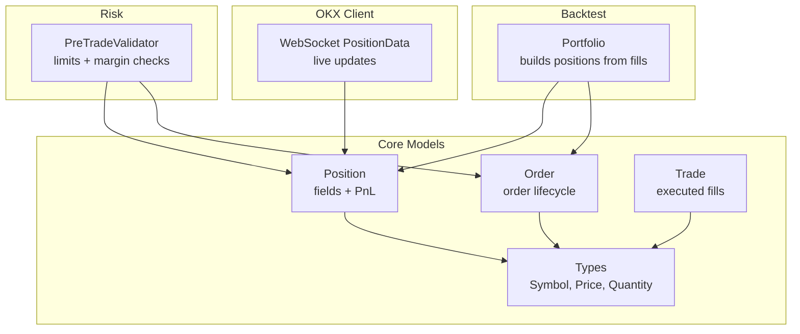
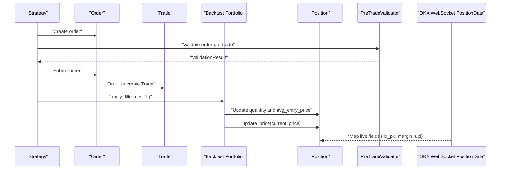
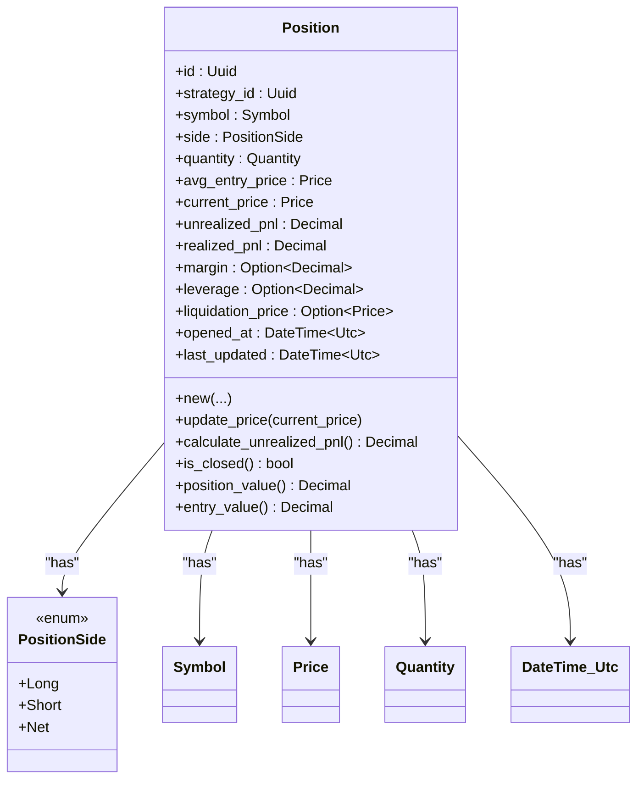
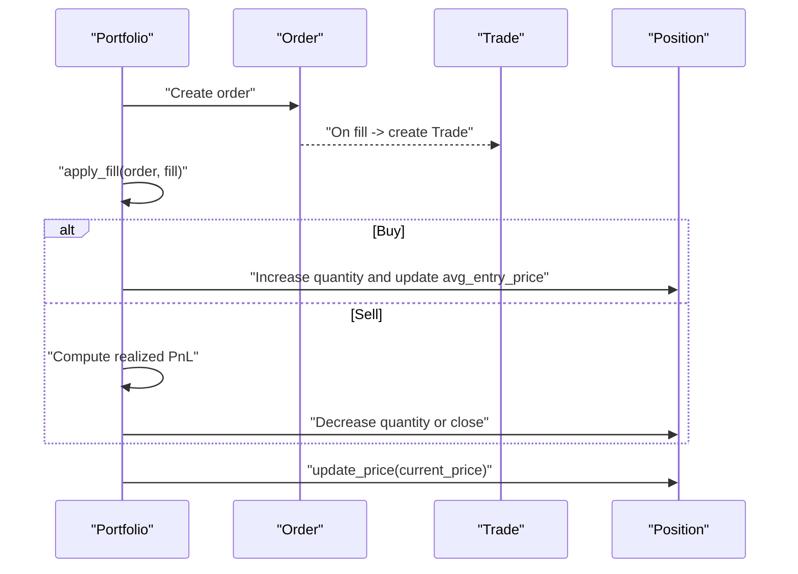
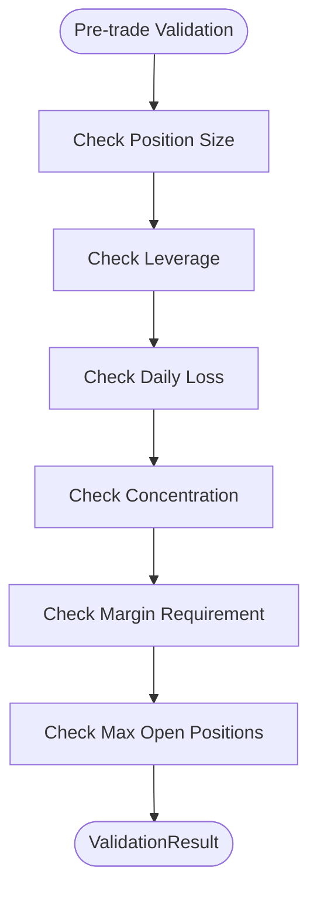
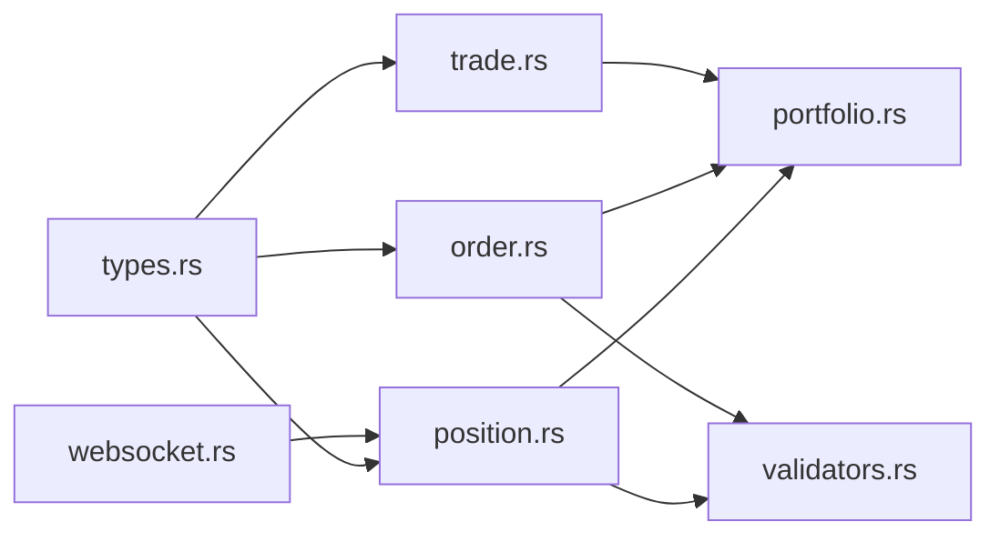

# Position Model

<cite>
**Referenced Files in This Document**
- [position.rs](file://crates/core/src/models/position.rs)
- [order.rs](file://crates/core/src/models/order.rs)
- [trade.rs](file://crates/core/src/models/trade.rs)
- [types.rs](file://crates/core/src/types.rs)
- [validators.rs](file://crates/risk/src/validators.rs)
- [portfolio.rs](file://crates/backtest/src/portfolio.rs)
- [websocket.rs](file://crates/okx-client/src/models/websocket.rs)
- [error.rs](file://crates/core/src/error.rs)
</cite>

## Table of Contents
1. [Introduction](#introduction)
2. [Project Structure](#project-structure)
3. [Core Components](#core-components)
4. [Architecture Overview](#architecture-overview)
5. [Detailed Component Analysis](#detailed-component-analysis)
6. [Dependency Analysis](#dependency-analysis)
7. [Performance Considerations](#performance-considerations)
8. [Troubleshooting Guide](#troubleshooting-guide)
9. [Conclusion](#conclusion)
10. [Appendices](#appendices)

## Introduction
This document provides comprehensive data model documentation for the Position entity in the trading system. It defines the field semantics, data types, and validation rules for open trading positions, including symbol, side, entry price, quantity, leverage, and PnL calculations. It explains how real-time PnL tracking is implemented and how margin-related fields are integrated. It also documents the relationships between Position, Order, and Trade models, showing how positions are constructed from executed trades. Finally, it covers risk management usage, strategy evaluation, performance reporting, business rules for position sizing and margin requirements, and the serialization/deserialization implementation with serde for persistence and recovery.

## Project Structure
The Position model resides in the core trading library and integrates with other models and risk/backtesting subsystems:
- Position model definition and PnL calculations
- Order and Trade models used to construct and close positions
- Types for Symbol, Price, and Quantity used across models
- Risk validators that enforce position sizing, leverage, and margin requirements
- Backtesting portfolio that builds positions from fills and updates PnL
- OKX WebSocket position data for live position updates

**Diagram sources**
- [position.rs](file://crates/core/src/models/position.rs#L1-L232)
- [order.rs](file://crates/core/src/models/order.rs#L1-L383)
- [trade.rs](file://crates/core/src/models/trade.rs#L1-L227)
- [types.rs](file://crates/core/src/types.rs#L1-L292)
- [validators.rs](file://crates/risk/src/validators.rs#L1-L393)
- [portfolio.rs](file://crates/backtest/src/portfolio.rs#L1-L244)
- [websocket.rs](file://crates/okx-client/src/models/websocket.rs#L461-L497)

**Section sources**
- [position.rs](file://crates/core/src/models/position.rs#L1-L232)
- [order.rs](file://crates/core/src/models/order.rs#L1-L383)
- [trade.rs](file://crates/core/src/models/trade.rs#L1-L227)
- [types.rs](file://crates/core/src/types.rs#L1-L292)
- [validators.rs](file://crates/risk/src/validators.rs#L1-L393)
- [portfolio.rs](file://crates/backtest/src/portfolio.rs#L1-L244)
- [websocket.rs](file://crates/okx-client/src/models/websocket.rs#L461-L497)

## Core Components
- Position: Represents an open trading position with symbol, side, quantity, entry price, current price, realized/unrealized PnL, optional margin and leverage, optional liquidation price, timestamps, and helper methods for PnL and valuation.
- Order: Defines order lifecycle, side, type, status, and fill tracking; used to generate trades and update positions.
- Trade: Records completed executions with symbol, side, order type, quantity, price, commission, realized PnL placeholder, and timestamps.
- Types: Provides validated Symbol, Price, and Quantity wrappers with serialization support and validation rules.
- Risk Validators: Enforce position sizing, leverage, daily loss, concentration, margin requirements, and open position caps.
- Backtest Portfolio: Builds positions from fills, updates PnL, tracks equity, and records performance metrics.
- OKX WebSocket PositionData: Live position snapshots containing fields like liquidation price, margin, leverage, and unrealized PnL.

**Section sources**
- [position.rs](file://crates/core/src/models/position.rs#L1-L232)
- [order.rs](file://crates/core/src/models/order.rs#L1-L383)
- [trade.rs](file://crates/core/src/models/trade.rs#L1-L227)
- [types.rs](file://crates/core/src/types.rs#L1-L292)
- [validators.rs](file://crates/risk/src/validators.rs#L1-L393)
- [portfolio.rs](file://crates/backtest/src/portfolio.rs#L1-L244)
- [websocket.rs](file://crates/okx-client/src/models/websocket.rs#L461-L497)

## Architecture Overview
The Position model sits at the center of the trading domain. Orders generate Trades upon fills; Trades feed into the Backtest Portfolio to build or reduce Positions. Risk validators inspect proposed Orders against Position state and limits before execution. Live updates from OKX WebSocket PositionData can be mapped to Position fields for real-time tracking.

**Diagram sources**
- [order.rs](file://crates/core/src/models/order.rs#L152-L265)
- [trade.rs](file://crates/core/src/models/trade.rs#L58-L107)
- [portfolio.rs](file://crates/backtest/src/portfolio.rs#L50-L150)
- [validators.rs](file://crates/risk/src/validators.rs#L68-L131)
- [websocket.rs](file://crates/okx-client/src/models/websocket.rs#L461-L497)

## Detailed Component Analysis

### Position Entity
The Position entity encapsulates all essential fields for an open trading position and provides methods for PnL computation and valuation.

- Fields and types
  - id: Uuid
  - strategy_id: Uuid
  - symbol: Symbol
  - side: PositionSide (Long, Short, Net)
  - quantity: Quantity
  - avg_entry_price: Price
  - current_price: Price
  - unrealized_pnl: Decimal
  - realized_pnl: Decimal
  - margin: Option<Decimal>
  - leverage: Option<Decimal>
  - liquidation_price: Option<Price>
  - opened_at: DateTime<Utc>
  - last_updated: DateTime<Utc>

- Methods
  - new(strategy_id, symbol, side, quantity, entry_price): initializes a new position with defaults for PnL/margin/leverage/liq price and timestamps
  - update_price(current_price): updates current_price and recomputes unrealized_pnl; sets last_updated
  - calculate_unrealized_pnl(): computes PnL based on side and price difference
  - is_closed(): true when quantity is zero
  - position_value(): current value (current_price * quantity)
  - entry_value(): entry value (avg_entry_price * quantity)

- Validation rules
  - Side parsing accepts lowercase variants and rejects invalid strings
  - Serialization/deserialization supported via serde with lowercase enum variants

- Real-time PnL tracking
  - update_price triggers recalculation of unrealized PnL using current_price and avg_entry_price
  - Backtest Portfolio updates positions via update_prices, mapping Symbol to Decimal prices

- Relationship with Order and Trade
  - Positions are built from executed fills (Order fills -> Trade records -> Portfolio apply_fill -> Position updates)
  - Backtest Portfolio maintains a map of Symbol to Position and updates PnL on price updates

- Business rules and risk integration
  - Risk validators check position size, leverage, daily loss, concentration, margin requirements, and open position caps against the current Position state and proposed Order
  - Margin and leverage fields are optional; risk checks compute required margin and exposure ratios

- Liquidation and margin fields
  - liquidation_price is optional; OKX WebSocket PositionData includes liq_px and mgn_ratio fields that can be mapped to Position
  - margin and leverage are optional; OKX WebSocket PositionData includes margin and imr fields that can be mapped

- Persistence and recovery
  - serde derives enable JSON serialization/deserialization for persistence and recovery
  - Tests demonstrate round-trip serialization for Order and Trade; Position follows the same pattern

**Diagram sources**
- [position.rs](file://crates/core/src/models/position.rs#L1-L232)
- [types.rs](file://crates/core/src/types.rs#L1-L292)

**Section sources**
- [position.rs](file://crates/core/src/models/position.rs#L1-L232)
- [portfolio.rs](file://crates/backtest/src/portfolio.rs#L138-L150)
- [validators.rs](file://crates/risk/src/validators.rs#L133-L271)
- [websocket.rs](file://crates/okx-client/src/models/websocket.rs#L461-L497)

### Order and Trade Integration
Positions are constructed and managed through Order lifecycles and Trade executions.

- Order lifecycle
  - Creation, submission, partial fills, and completion; maintains filled_quantity, avg_fill_price, and timestamps
  - Status transitions and latency measurement from submission to first fill

- Trade records
  - Captures executed quantity, price, commission, realized PnL placeholder, and timestamps
  - Supports net value and effective price computations

- Building positions from fills
  - Backtest Portfolio applies fills to update cash, realized PnL, and position quantity and average entry price
  - On sell fills, realized PnL is computed and cash adjusted accordingly

**Diagram sources**
- [order.rs](file://crates/core/src/models/order.rs#L152-L265)
- [trade.rs](file://crates/core/src/models/trade.rs#L58-L107)
- [portfolio.rs](file://crates/backtest/src/portfolio.rs#L50-L150)

**Section sources**
- [order.rs](file://crates/core/src/models/order.rs#L1-L383)
- [trade.rs](file://crates/core/src/models/trade.rs#L1-L227)
- [portfolio.rs](file://crates/backtest/src/portfolio.rs#L1-L244)

### Risk Management Usage
Risk validators enforce constraints before order execution using Position state and Order details.

- Position size checks: compares new position size against configured limits per symbol
- Leverage checks: computes total exposure and compares to maximum leverage
- Daily loss checks: enforces daily PnL limits
- Concentration checks: measures order value as percentage of total equity
- Margin checks: computes required margin and compares to available margin
- Open positions cap: warns when opening a new symbol would exceed maximum open positions

**Diagram sources**
- [validators.rs](file://crates/risk/src/validators.rs#L68-L131)

**Section sources**
- [validators.rs](file://crates/risk/src/validators.rs#L1-L393)

### Real-time PnL Tracking and Margin Calculations
- Real-time PnL
  - Position.update_price triggers recalculation of unrealized PnL using current_price and avg_entry_price
  - Backtest Portfolio updates positions on price updates and aggregates equity curve

- Margin and liquidation
  - Position fields include optional margin and leverage; liquidation_price is optional
  - OKX WebSocket PositionData includes liq_px, margin, and mgn_ratio fields suitable for mapping to Position
  - Risk validators compute required margin and leverage for enforcement

**Section sources**
- [position.rs](file://crates/core/src/models/position.rs#L107-L156)
- [portfolio.rs](file://crates/backtest/src/portfolio.rs#L138-L150)
- [validators.rs](file://crates/risk/src/validators.rs#L235-L271)
- [websocket.rs](file://crates/okx-client/src/models/websocket.rs#L461-L497)

### Serialization and Persistence
- serde support
  - Position derives Serialize and Deserialize
  - Enum variants serialized as lowercase strings
  - Types (Symbol, Price, Quantity) derive Serialize/Deserialize with validation

- Persistence and recovery
  - JSON serialization enables storing Position state for recovery
  - Tests demonstrate serde round-trips for Order and Trade; Position follows the same pattern

**Section sources**
- [position.rs](file://crates/core/src/models/position.rs#L1-L232)
- [types.rs](file://crates/core/src/types.rs#L1-L292)
- [error.rs](file://crates/core/src/error.rs#L1-L67)

## Dependency Analysis
- Position depends on:
  - Types for Symbol, Price, Quantity
  - chrono for timestamps
  - uuid for identifiers
  - serde for serialization

- Risk validators depend on:
  - Position and Order for state and proposed changes
  - RiskLimits configuration for thresholds

- Backtest Portfolio depends on:
  - Position for state tracking
  - Order for lifecycle and fills
  - Fill events for execution details

- OKX WebSocket PositionData provides live fields that map to Position fields for real-time updates

**Diagram sources**
- [position.rs](file://crates/core/src/models/position.rs#L1-L232)
- [order.rs](file://crates/core/src/models/order.rs#L1-L383)
- [trade.rs](file://crates/core/src/models/trade.rs#L1-L227)
- [types.rs](file://crates/core/src/types.rs#L1-L292)
- [validators.rs](file://crates/risk/src/validators.rs#L1-L393)
- [portfolio.rs](file://crates/backtest/src/portfolio.rs#L1-L244)
- [websocket.rs](file://crates/okx-client/src/models/websocket.rs#L461-L497)

**Section sources**
- [position.rs](file://crates/core/src/models/position.rs#L1-L232)
- [order.rs](file://crates/core/src/models/order.rs#L1-L383)
- [trade.rs](file://crates/core/src/models/trade.rs#L1-L227)
- [types.rs](file://crates/core/src/types.rs#L1-L292)
- [validators.rs](file://crates/risk/src/validators.rs#L1-L393)
- [portfolio.rs](file://crates/backtest/src/portfolio.rs#L1-L244)
- [websocket.rs](file://crates/okx-client/src/models/websocket.rs#L461-L497)

## Performance Considerations
- PnL calculations are O(1) per update_price call
- Portfolio updates iterate over positions to compute equity; keep position count reasonable
- Risk validations compute totals over positions; consider caching derived metrics if needed
- Serialization overhead is minimal for typical position counts

[No sources needed since this section provides general guidance]

## Troubleshooting Guide
- Invalid symbol format
  - Occurs when constructing Symbol with incorrect format; ensure base-quote structure and non-empty parts
- Invalid price or quantity
  - Prices must be positive; quantities must be non-negative
- Invalid position side
  - Side parsing accepts lowercase variants; ensure correct spelling
- Serialization errors
  - serde_json errors propagate as core Error::SerializationError
- Insufficient margin
  - Risk validator reports required vs available margin; adjust position size or increase collateral

**Section sources**
- [types.rs](file://crates/core/src/types.rs#L1-L292)
- [error.rs](file://crates/core/src/error.rs#L1-L67)
- [validators.rs](file://crates/risk/src/validators.rs#L235-L271)

## Conclusion
The Position model provides a robust foundation for managing open trading positions with validated types, real-time PnL tracking, and optional margin/leverage/liquidation fields. It integrates tightly with Order and Trade lifecycles, enabling construction and closure of positions from executed fills. Risk validators enforce position sizing, leverage, daily loss, concentration, and margin requirements, while Backtest Portfolio offers practical usage for strategy evaluation and performance reporting. Serde support ensures persistence and recovery for production deployments.

[No sources needed since this section summarizes without analyzing specific files]

## Appendices

### Field Definitions and Validation Rules
- Position fields
  - symbol: validated Symbol with uppercase normalization and base-quote format
  - side: PositionSide enum with lowercase serde serialization
  - quantity: Quantity with non-negative constraint
  - avg_entry_price/current_price: Price with positive constraint
  - unrealized_pnl/realized_pnl: Decimal
  - margin/leverage: optional Decimal
  - liquidation_price: optional Price
  - opened_at/last_updated: DateTime<Utc>

- Validation rules
  - Symbol.new validates separator count and emptiness
  - Price.new validates positivity
  - Quantity.new validates non-negativity
  - PositionSide.from_str parses lowercase variants

**Section sources**
- [position.rs](file://crates/core/src/models/position.rs#L1-L232)
- [types.rs](file://crates/core/src/types.rs#L1-L292)

### Examples of Position Usage
- Risk management
  - Pre-trade validation checks leverage, daily loss, concentration, and margin requirements against current Position state and proposed Order
- Strategy evaluation
  - Backtest Portfolio builds positions from fills, updates PnL, and computes equity curve for performance metrics
- Performance reporting
  - Portfolio exposes realized PnL, total PnL, and return percentage; Position provides unrealized PnL and valuation helpers

**Section sources**
- [validators.rs](file://crates/risk/src/validators.rs#L68-L131)
- [portfolio.rs](file://crates/backtest/src/portfolio.rs#L152-L195)
- [position.rs](file://crates/core/src/models/position.rs#L131-L156)

### Live Position Updates
- OKX WebSocket PositionData includes fields such as liq_px, margin, mgn_ratio, upl, and imr that can be mapped to Position fields for real-time tracking

**Section sources**
- [websocket.rs](file://crates/okx-client/src/models/websocket.rs#L461-L497)