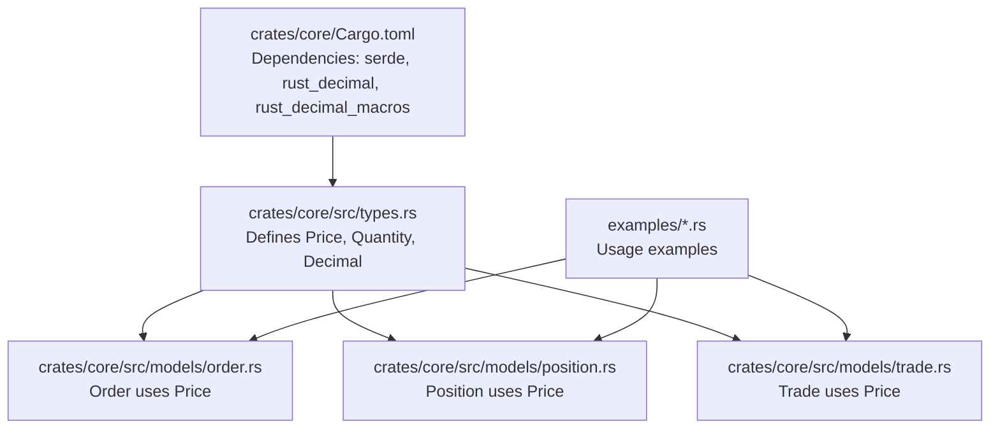
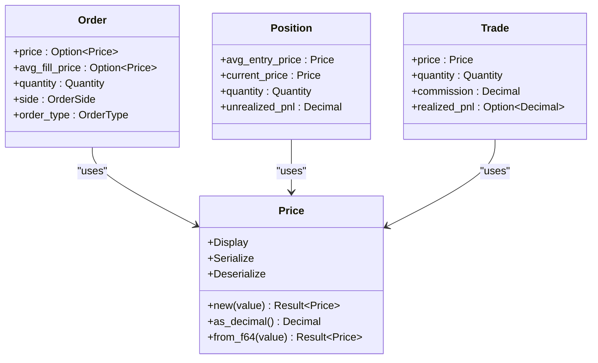
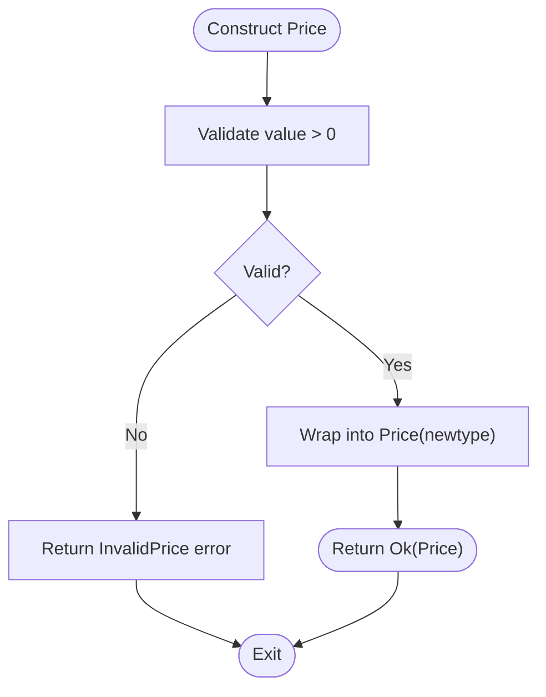
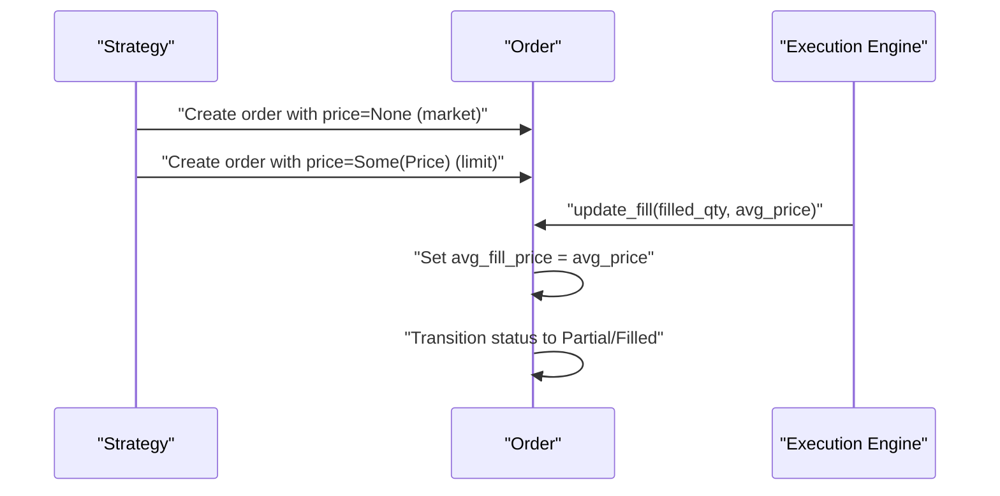
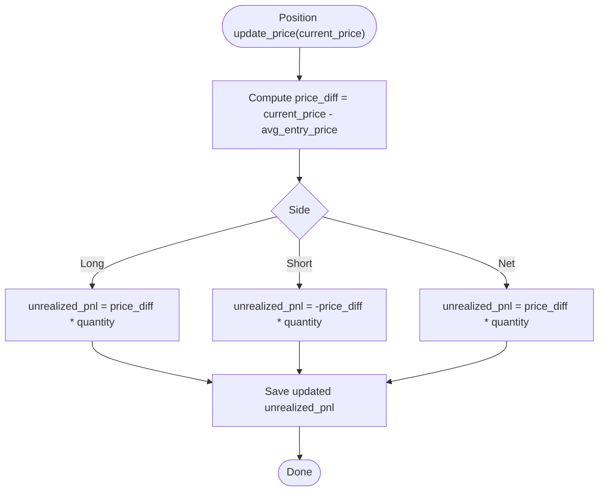
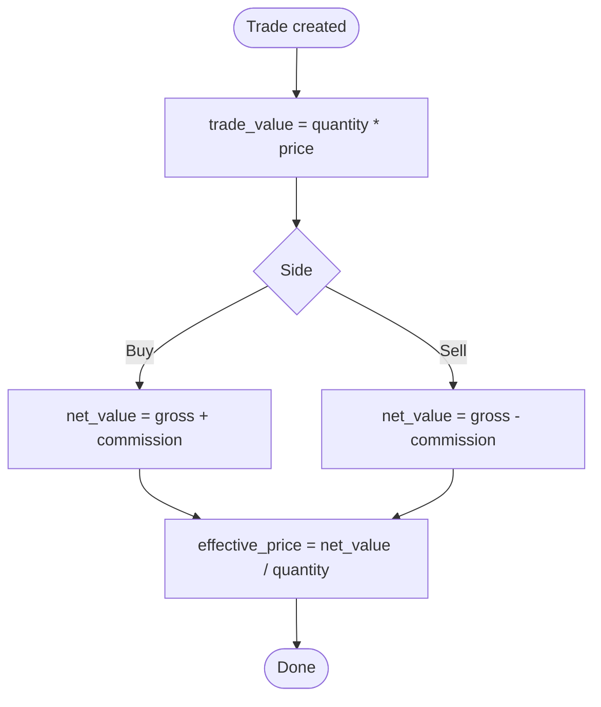
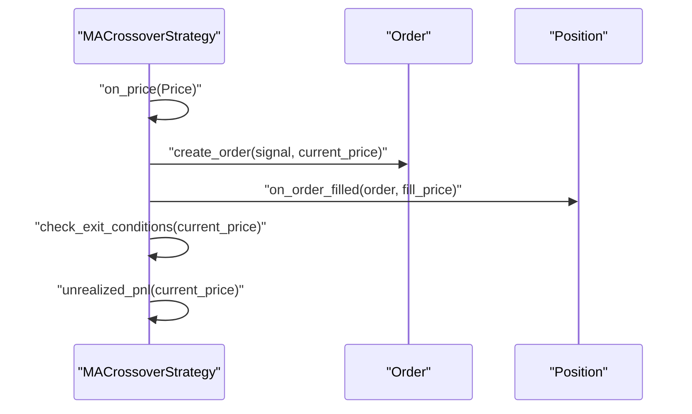
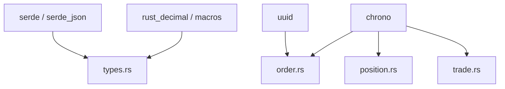

# Price Model

<cite>
**Referenced Files in This Document**
- [types.rs](file://crates/core/src/types.rs)
- [order.rs](file://crates/core/src/models/order.rs)
- [position.rs](file://crates/core/src/models/position.rs)
- [trade.rs](file://crates/core/src/models/trade.rs)
- [error.rs](file://crates/core/src/error.rs)
- [Cargo.toml](file://crates/core/Cargo.toml)
- [simple_ma_crossover.rs](file://examples/simple_ma_crossover.rs)
- [grid_trading.rs](file://examples/grid_trading.rs)
</cite>

## Table of Contents
1. [Introduction](#introduction)
2. [Project Structure](#project-structure)
3. [Core Components](#core-components)
4. [Architecture Overview](#architecture-overview)
5. [Detailed Component Analysis](#detailed-component-analysis)
6. [Dependency Analysis](#dependency-analysis)
7. [Performance Considerations](#performance-considerations)
8. [Troubleshooting Guide](#troubleshooting-guide)
9. [Conclusion](#conclusion)

## Introduction
This document provides comprehensive data model documentation for the Price entity used throughout the trading system. It explains the field definitions, data types, validation rules, and the implementation of the newtype pattern using rust_decimal::Decimal to ensure type safety and precision in financial calculations. It also covers validation logic for positive values, serialization/deserialization with serde, and practical usage in order pricing, position valuation, and PnL calculations. Finally, it addresses business rules around price precision in cryptocurrency trading and the importance of maintaining 8-decimal accuracy.

## Project Structure
The Price model is defined in the core crate and is consumed by multiple domain models:
- Price definition and validation live in the core types module.
- Order, Position, and Trade models use Price for pricing.
- Example strategies demonstrate real-world usage patterns.

**Diagram sources**
- [types.rs](file://crates/core/src/types.rs#L86-L123)
- [order.rs](file://crates/core/src/models/order.rs#L95-L151)
- [position.rs](file://crates/core/src/models/position.rs#L32-L76)
- [trade.rs](file://crates/core/src/models/trade.rs#L10-L57)
- [Cargo.toml](file://crates/core/Cargo.toml#L8-L17)

**Section sources**
- [types.rs](file://crates/core/src/types.rs#L86-L123)
- [order.rs](file://crates/core/src/models/order.rs#L95-L151)
- [position.rs](file://crates/core/src/models/position.rs#L32-L76)
- [trade.rs](file://crates/core/src/models/trade.rs#L10-L57)
- [Cargo.toml](file://crates/core/Cargo.toml#L8-L17)

## Core Components
- Price: A newtype wrapper around rust_decimal::Decimal with strict positivity validation and serde support.
- Decimal: A type alias for rust_decimal::Decimal to centralize decimal usage across the system.
- Validation rules:
  - Price must be strictly greater than zero.
  - Quantity can be zero or positive.
  - Negative values are rejected for both types.

Key implementation highlights:
- Price::new validates positivity and returns a typed Price instance.
- Price::from_f64 enables controlled construction from floating-point values for testing.
- Price implements Display and derives serde Serialize/Deserialize for JSON interchange.
- Tests confirm ordering, invalid inputs, and conversions.

**Section sources**
- [types.rs](file://crates/core/src/types.rs#L86-L123)
- [types.rs](file://crates/core/src/types.rs#L181-L291)
- [error.rs](file://crates/core/src/error.rs#L11-L16)

## Architecture Overview
Price participates in three primary domains:
- Orders: Limit price and average fill price are stored as Price.
- Positions: Average entry price and current price are stored as Price.
- Trades: Execution price is stored as Price.

**Diagram sources**
- [types.rs](file://crates/core/src/types.rs#L86-L123)
- [order.rs](file://crates/core/src/models/order.rs#L118-L126)
- [position.rs](file://crates/core/src/models/position.rs#L47-L54)
- [trade.rs](file://crates/core/src/models/trade.rs#L33-L37)

## Detailed Component Analysis

### Price Definition and Newtype Pattern
- Newtype pattern: Price wraps rust_decimal::Decimal to prevent accidental mixing with other numeric types.
- Serde integration: Price derives Serialize and Deserialize, enabling JSON serialization without custom logic.
- Validation: Positive-only constraint enforced in Price::new.
- Precision: Uses rust_decimal::Decimal for exact decimal arithmetic and string representation.

**Diagram sources**
- [types.rs](file://crates/core/src/types.rs#L102-L110)

**Section sources**
- [types.rs](file://crates/core/src/types.rs#L86-L123)
- [error.rs](file://crates/core/src/error.rs#L11-L16)

### Usage in Orders
- Limit price: Optional Price used for limit orders.
- Average fill price: Tracks the weighted average execution price after fills.
- Lifecycle updates: Order.update_fill sets avg_fill_price and transitions status accordingly.

**Diagram sources**
- [order.rs](file://crates/core/src/models/order.rs#L118-L126)
- [order.rs](file://crates/core/src/models/order.rs#L243-L264)

**Section sources**
- [order.rs](file://crates/core/src/models/order.rs#L95-L151)
- [order.rs](file://crates/core/src/models/order.rs#L243-L264)

### Usage in Positions
- Average entry price: The Price at which a position was opened.
- Current price: The latest market Price used to compute unrealized PnL.
- Unrealized PnL calculation: Depends on side (Long/Short/Net), price difference, and quantity.

**Diagram sources**
- [position.rs](file://crates/core/src/models/position.rs#L107-L124)

**Section sources**
- [position.rs](file://crates/core/src/models/position.rs#L32-L76)
- [position.rs](file://crates/core/src/models/position.rs#L107-L124)

### Usage in Trades
- Execution price: The Price at which a trade was executed.
- Trade value and net value: Computed from quantity and price, adjusted by commission depending on side.
- Effective price: Net value divided by quantity.

**Diagram sources**
- [trade.rs](file://crates/core/src/models/trade.rs#L89-L106)

**Section sources**
- [trade.rs](file://crates/core/src/models/trade.rs#L10-L57)
- [trade.rs](file://crates/core/src/models/trade.rs#L89-L106)

### Business Rules Around Price Precision
- Cryptocurrency markets often require high precision (e.g., 8 decimals) to avoid rounding errors and ensure fair execution.
- The rust_decimal::Decimal type preserves exact decimal representation and avoids floating-point rounding issues.
- The Price model enforces positivity to prevent invalid market states and ensures downstream calculations remain meaningful.
- Serialization/deserialization with serde preserves exact decimal values, preventing precision loss during transport.

**Section sources**
- [Cargo.toml](file://crates/core/Cargo.toml#L8-L17)
- [types.rs](file://crates/core/src/types.rs#L86-L123)

### Examples of Price Usage
- Moving Average Crossover Strategy:
  - Uses Price for entry/exit conditions and computes stop-loss/take-profit targets as Price values.
  - Computes unrealized PnL using Price differences and position quantities.
- Grid Trading Strategy:
  - Generates grid levels by stepping between lower and upper bound Prices.
  - Places limit orders at grid Prices.

**Diagram sources**
- [simple_ma_crossover.rs](file://examples/simple_ma_crossover.rs#L142-L279)
- [grid_trading.rs](file://examples/grid_trading.rs#L55-L115)

**Section sources**
- [simple_ma_crossover.rs](file://examples/simple_ma_crossover.rs#L142-L279)
- [grid_trading.rs](file://examples/grid_trading.rs#L55-L115)

## Dependency Analysis
- Dependencies:
  - serde and serde_json for serialization/deserialization.
  - rust_decimal and rust_decimal_macros for precise decimal arithmetic and macro support.
  - uuid and chrono for identifiers and timestamps.
- Coupling:
  - Price is widely used across Order, Position, and Trade, increasing cohesion within the financial domain.
  - No circular dependencies detected among core modules.

**Diagram sources**
- [Cargo.toml](file://crates/core/Cargo.toml#L8-L17)
- [order.rs](file://crates/core/src/models/order.rs#L1-L15)
- [position.rs](file://crates/core/src/models/position.rs#L1-L10)
- [trade.rs](file://crates/core/src/models/trade.rs#L1-L9)

**Section sources**
- [Cargo.toml](file://crates/core/Cargo.toml#L8-L17)

## Performance Considerations
- Using rust_decimal::Decimal ensures exact decimal arithmetic and avoids floating-point errors, which is critical for financial computations.
- The newtype pattern adds negligible overhead while providing strong type safety.
- Serde’s default Decimal serialization preserves precision without requiring custom logic.

[No sources needed since this section provides general guidance]

## Troubleshooting Guide
Common issues and resolutions:
- InvalidPrice errors occur when constructing Price with zero or negative values. Ensure all prices are strictly positive.
- DecimalError occurs when converting invalid f64 values to Decimal. Prefer constructing from Decimal literals or strings.
- Serialization errors indicate malformed JSON. Verify that Price values are serialized as numeric strings or numbers compatible with rust_decimal.

**Section sources**
- [error.rs](file://crates/core/src/error.rs#L11-L16)
- [error.rs](file://crates/core/src/error.rs#L29-L33)

## Conclusion
The Price model is a robust, type-safe representation of financial prices with 8-decimal precision. Its newtype design, strict validation, and serde integration ensure correctness and reliability across order pricing, position valuation, and PnL calculations. The examples demonstrate practical usage in trading strategies, reinforcing the importance of precision and positivity in cryptocurrency markets.