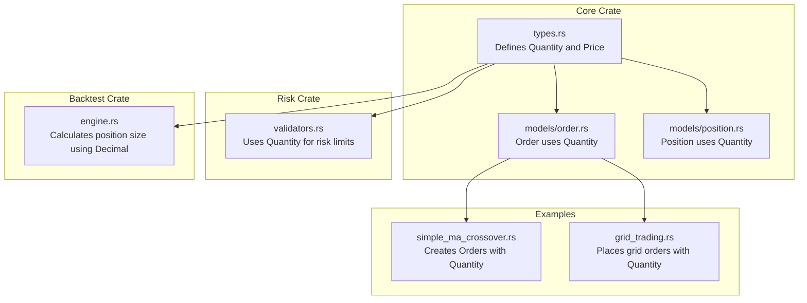
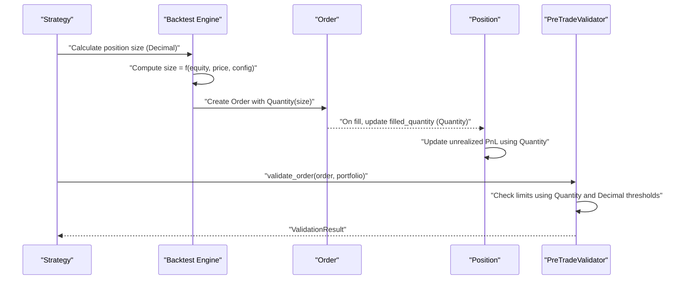
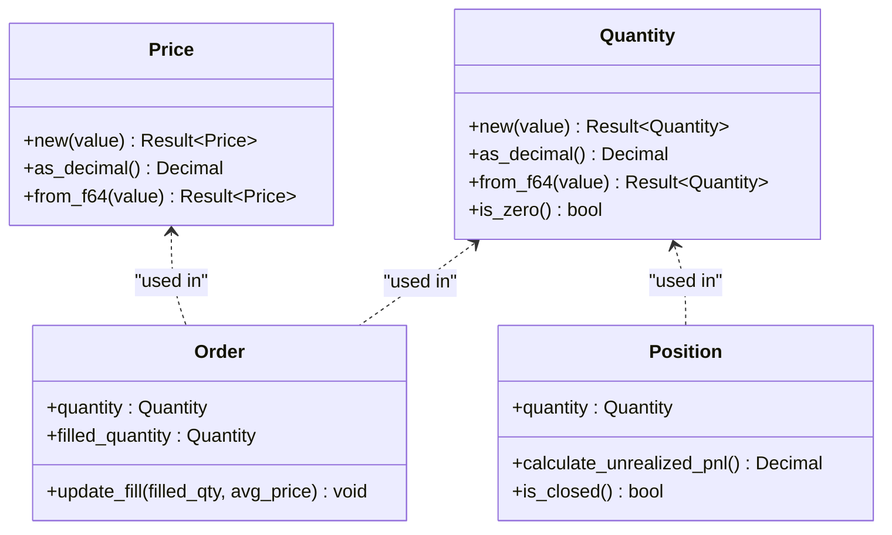
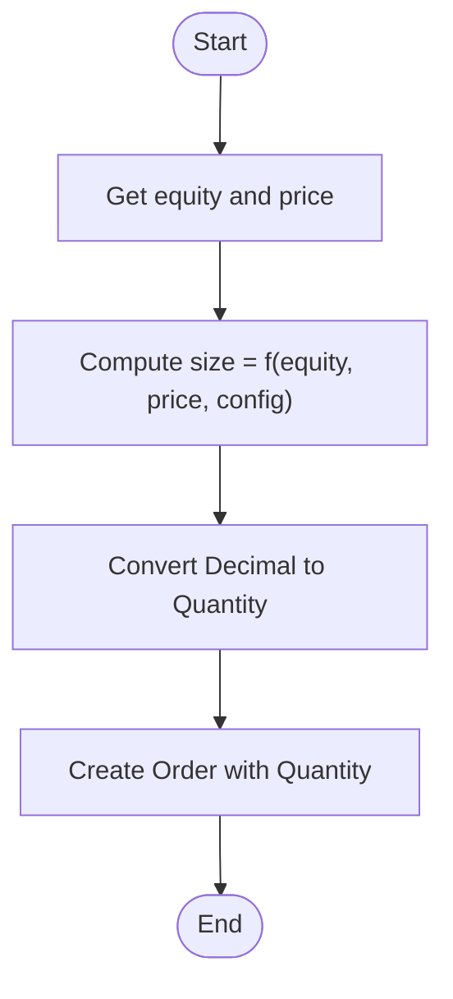
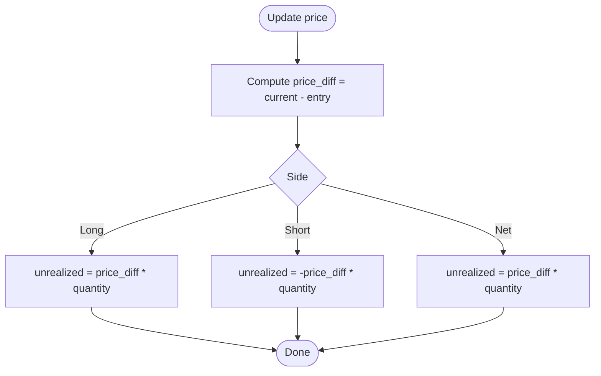
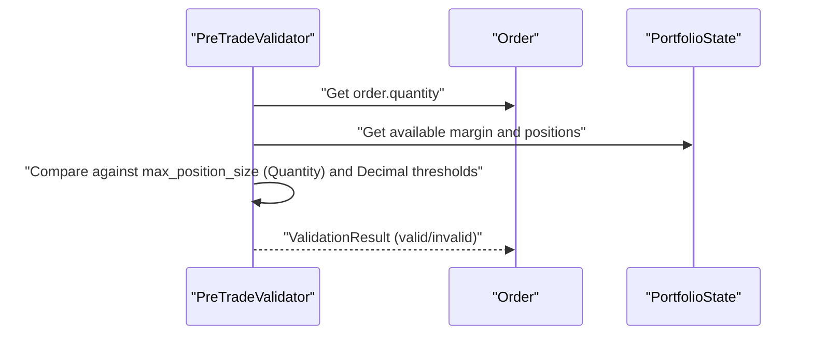
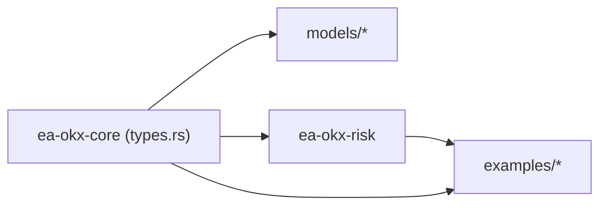

# Quantity Model

<cite>
**Referenced Files in This Document**
- [types.rs](file://crates/core/src/types.rs)
- [order.rs](file://crates/core/src/models/order.rs)
- [position.rs](file://crates/core/src/models/position.rs)
- [validators.rs](file://crates/risk/src/validators.rs)
- [engine.rs](file://crates/backtest/src/engine.rs)
- [simple_ma_crossover.rs](file://examples/simple_ma_crossover.rs)
- [grid_trading.rs](file://examples/grid_trading.rs)
- [Cargo.toml (core)](file://crates/core/Cargo.toml)
- [Cargo.toml (risk)](file://crates/risk/Cargo.toml)
</cite>

## Table of Contents
1. [Introduction](#introduction)
2. [Project Structure](#project-structure)
3. [Core Components](#core-components)
4. [Architecture Overview](#architecture-overview)
5. [Detailed Component Analysis](#detailed-component-analysis)
6. [Dependency Analysis](#dependency-analysis)
7. [Performance Considerations](#performance-considerations)
8. [Troubleshooting Guide](#troubleshooting-guide)
9. [Conclusion](#conclusion)

## Introduction
This document provides comprehensive data model documentation for the Quantity entity in the trading system. Quantity represents trade quantities as non-negative decimal values and enforces type safety using a newtype pattern around rust_decimal::Decimal. The document covers field definitions, validation rules, precision handling, serialization/deserialization with serde, and practical usage in order sizing, position management, and risk calculations. It also explains how Quantity integrates with business rules around instrument-specific precision and minimum order sizes.

## Project Structure
The Quantity model is defined in the core crate and consumed across models, risk validation, and example strategies. The core crate depends on rust_decimal and serde, while the risk crate depends on core and reuses Quantity for risk limits and validations.

**Diagram sources**
- [types.rs](file://crates/core/src/types.rs#L131-L173)
- [order.rs](file://crates/core/src/models/order.rs#L94-L151)
- [position.rs](file://crates/core/src/models/position.rs#L32-L76)
- [validators.rs](file://crates/risk/src/validators.rs#L1-L47)
- [engine.rs](file://crates/backtest/src/engine.rs#L488-L529)
- [simple_ma_crossover.rs](file://examples/simple_ma_crossover.rs#L203-L234)
- [grid_trading.rs](file://examples/grid_trading.rs#L80-L115)

**Section sources**
- [Cargo.toml (core)](file://crates/core/Cargo.toml#L8-L17)
- [Cargo.toml (risk)](file://crates/risk/Cargo.toml#L9-L21)

## Core Components
- Quantity: A newtype wrapper around rust_decimal::Decimal enforcing non-negativity. It exposes construction, inspection, and ordering semantics.
- Price: Also a newtype wrapper around rust_decimal::Decimal, but constrained to strictly positive values.
- Order: Contains a quantity field typed as Quantity and tracks filled_quantity similarly.
- Position: Tracks position quantity as Quantity and computes PnL using decimal arithmetic.
- Risk Limits: Uses Quantity for per-symbol maximum position sizes and other risk thresholds.

Key characteristics:
- Non-negative constraint: Quantity::new rejects negative values.
- Ordering: Quantity supports comparison operators for ordering and sorting.
- Serialization: Both Quantity and Price derive serde Serialize/Deserialize.
- Precision: Uses rust_decimal::Decimal for exact decimal arithmetic.

**Section sources**
- [types.rs](file://crates/core/src/types.rs#L131-L173)
- [types.rs](file://crates/core/src/types.rs#L86-L124)
- [order.rs](file://crates/core/src/models/order.rs#L94-L151)
- [position.rs](file://crates/core/src/models/position.rs#L32-L76)
- [validators.rs](file://crates/risk/src/validators.rs#L1-L47)

## Architecture Overview
Quantity participates in three primary flows:
- Order sizing: Strategies compute order quantities from capital, price, and risk parameters.
- Position management: Positions track holdings as Quantity and compute PnL using decimal arithmetic.
- Risk validation: Pre-trade validators enforce limits using Quantity and Decimal thresholds.

**Diagram sources**
- [engine.rs](file://crates/backtest/src/engine.rs#L488-L529)
- [order.rs](file://crates/core/src/models/order.rs#L152-L265)
- [position.rs](file://crates/core/src/models/position.rs#L78-L141)
- [validators.rs](file://crates/risk/src/validators.rs#L334-L392)

## Detailed Component Analysis

### Quantity Data Model
Quantity is defined as a newtype around rust_decimal::Decimal with explicit validation to prevent negative quantities. It supports:
- Construction via new(value) returning a Result for validation.
- Access to the underlying Decimal via as_decimal().
- Creation from f64 for testing via from_f64(value).
- Zero-check via is_zero().
- Ordering semantics (PartialOrd, Ord) for comparisons.

**Diagram sources**
- [types.rs](file://crates/core/src/types.rs#L131-L173)
- [types.rs](file://crates/core/src/types.rs#L86-L124)
- [order.rs](file://crates/core/src/models/order.rs#L94-L151)
- [position.rs](file://crates/core/src/models/position.rs#L32-L76)

**Section sources**
- [types.rs](file://crates/core/src/types.rs#L131-L173)

### Validation Logic and Business Rules
- Non-negativity: Quantity::new enforces value >= 0, preventing negative quantities.
- Positive constraint for Price: Price::new enforces value > 0, ensuring meaningful pricing.
- Ordering: Both Quantity and Price implement PartialOrd and Ord, enabling sorting and comparisons.
- Zero semantics: is_zero() provides a canonical way to check for zero quantity.

Precision and rounding:
- rust_decimal::Decimal preserves exact decimal arithmetic, avoiding floating-point rounding errors.
- The system relies on Decimal for all financial computations, including PnL calculations and risk thresholds.

Minimum order size constraints:
- The core Quantity model itself does not enforce minimum order sizes; such constraints are typically enforced at the exchange or strategy level.
- Risk validators and order routing logic can incorporate instrument-specific minimums and tick sizes when constructing orders.

**Section sources**
- [types.rs](file://crates/core/src/types.rs#L131-L173)
- [types.rs](file://crates/core/src/types.rs#L86-L124)
- [validators.rs](file://crates/risk/src/validators.rs#L1-L47)

### Serialization and Deserialization with serde
- Both Quantity and Price derive serde Serialize and Deserialize, enabling seamless JSON serialization across system boundaries.
- The core crate depends on serde and serde_json, and rust_decimal is included for decimal handling.
- Risk crate also depends on serde and serde_json, consuming Quantity in risk limit configurations.

Practical implications:
- When integrating with external systems, ensure consistent Decimal serialization settings to preserve precision.
- Use serde features compatible with rust_decimal to maintain exact decimal representation during transport.

**Section sources**
- [types.rs](file://crates/core/src/types.rs#L131-L173)
- [Cargo.toml (core)](file://crates/core/Cargo.toml#L8-L17)
- [Cargo.toml (risk)](file://crates/risk/Cargo.toml#L9-L21)

### Usage in Order Sizing
Quantity is central to order sizing across strategies:
- Backtest engine calculates position size as a Decimal and converts it to Quantity for order creation.
- Example strategies compute order quantities based on capital allocation and current price, then create Orders with Quantity.

**Diagram sources**
- [engine.rs](file://crates/backtest/src/engine.rs#L488-L529)
- [simple_ma_crossover.rs](file://examples/simple_ma_crossover.rs#L203-L234)

**Section sources**
- [engine.rs](file://crates/backtest/src/engine.rs#L488-L529)
- [simple_ma_crossover.rs](file://examples/simple_ma_crossover.rs#L203-L234)

### Usage in Position Management
Positions track holdings as Quantity and compute unrealized PnL using decimal arithmetic:
- Position::calculate_unrealized_pnl multiplies price differences by quantity.
- Position::is_closed checks whether quantity is zero.

**Diagram sources**
- [position.rs](file://crates/core/src/models/position.rs#L107-L141)

**Section sources**
- [position.rs](file://crates/core/src/models/position.rs#L78-L141)

### Usage in Risk Calculations
Risk validators use Quantity and Decimal thresholds to enforce limits:
- RiskLimits includes max_position_size keyed by Symbol and uses Quantity for per-symbol position caps.
- Pre-trade validation compares order quantities against portfolio constraints and limits.

**Diagram sources**
- [validators.rs](file://crates/risk/src/validators.rs#L1-L47)
- [validators.rs](file://crates/risk/src/validators.rs#L334-L392)

**Section sources**
- [validators.rs](file://crates/risk/src/validators.rs#L1-L47)
- [validators.rs](file://crates/risk/src/validators.rs#L334-L392)

## Dependency Analysis
- Core crate dependencies: serde, serde_json, rust_decimal, rust_decimal_macros, uuid, chrono, thiserror, anyhow.
- Risk crate dependencies: core, tokio, chrono, rust_decimal, rust_decimal_macros, serde, serde_json, thiserror, tracing, uuid.
- Quantity and Price are defined in core and consumed by models, risk, and examples.

**Diagram sources**
- [Cargo.toml (core)](file://crates/core/Cargo.toml#L8-L17)
- [Cargo.toml (risk)](file://crates/risk/Cargo.toml#L9-L21)

**Section sources**
- [Cargo.toml (core)](file://crates/core/Cargo.toml#L8-L17)
- [Cargo.toml (risk)](file://crates/risk/Cargo.toml#L9-L21)

## Performance Considerations
- Decimal arithmetic is precise but can be slower than primitive floats. Use Decimal for financial computations to avoid rounding errors.
- Prefer constructing Quantity from Decimal rather than f64 to avoid precision loss.
- When serializing across system boundaries, ensure serde configuration preserves Decimal fidelity.

## Troubleshooting Guide
Common issues and resolutions:
- Negative quantity errors: Creating a Quantity with a negative value returns an error. Ensure all inputs are validated before construction.
- Zero quantity checks: Use is_zero() to detect closed positions or zero-sized orders.
- Serialization failures: If deserializing Decimal values fails, verify serde configuration and ensure consistent Decimal serialization settings.

**Section sources**
- [types.rs](file://crates/core/src/types.rs#L131-L173)
- [error.rs](file://crates/core/src/error.rs#L1-L47)

## Conclusion
Quantity is a foundational type in the trading system, enforcing non-negative trade sizes through a robust newtype pattern built on rust_decimal::Decimal. It integrates seamlessly with Order and Position models, supports precise financial arithmetic, and enables safe serialization across system boundaries. While the core model does not enforce minimum order sizes, downstream components such as risk validators and strategies can apply instrument-specific constraints. Proper use of Quantity ensures correctness, reliability, and consistency in order sizing, position management, and risk calculations.