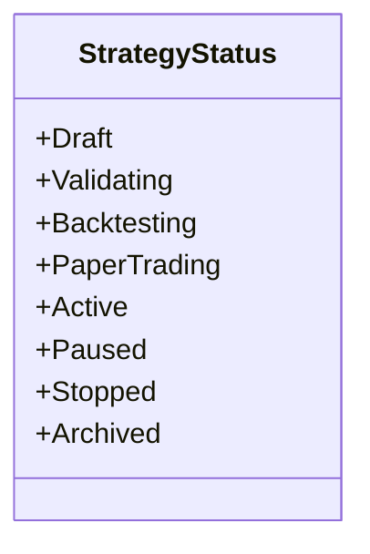
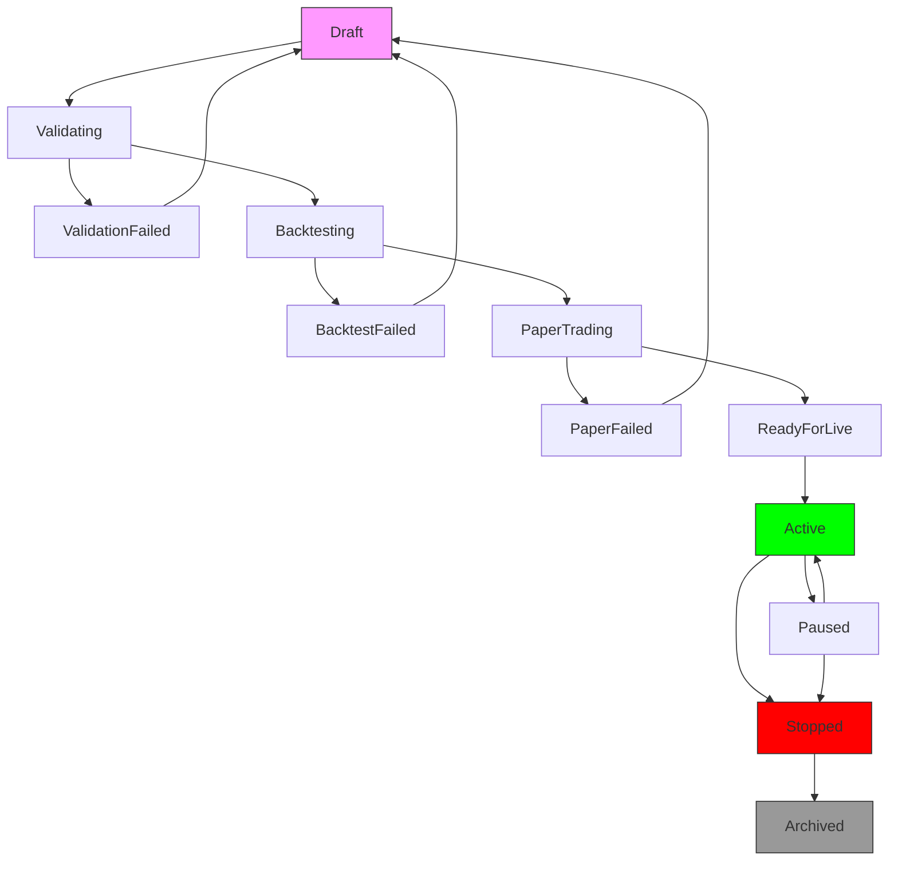
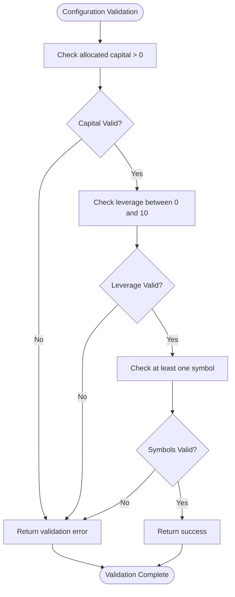
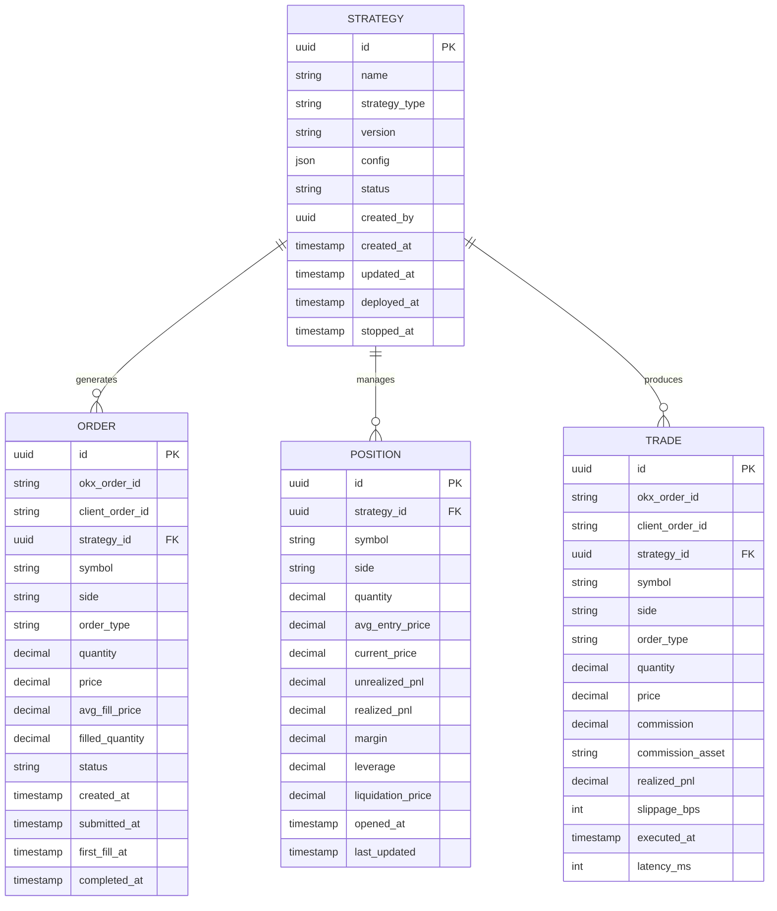
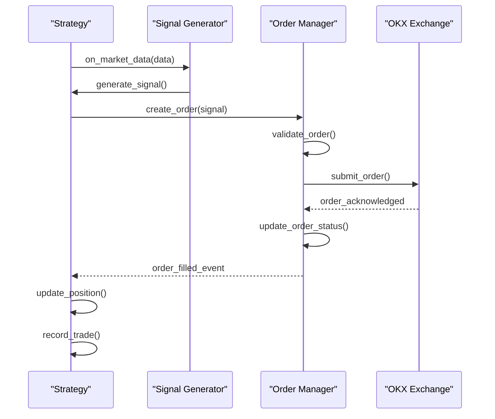

# Strategy Model

<cite>
**Referenced Files in This Document**   
- [strategy.rs](file://crates/core/src/models/strategy.rs)
- [lifecycle.rs](file://crates/strategy/src/lifecycle.rs)
- [signal.rs](file://crates/strategy/src/signal.rs)
- [metrics.rs](file://crates/strategy/src/metrics.rs)
- [order.rs](file://crates/core/src/models/order.rs)
- [position.rs](file://crates/core/src/models/position.rs)
- [trade.rs](file://crates/core/src/models/trade.rs)
- [types.rs](file://crates/core/src/types.rs)
</cite>

## Table of Contents
1. [Introduction](#introduction)
2. [Strategy Entity Structure](#strategy-entity-structure)
3. [Lifecycle Management](#lifecycle-management)
4. [Configuration and Validation](#configuration-and-validation)
5. [Relationships with Other Models](#relationships-with-other-models)
6. [Performance Metrics](#performance-metrics)
7. [Serialization and State Management](#serialization-and-state-management)
8. [Usage Examples](#usage-examples)
9. [Business Rules](#business-rules)
10. [Conclusion](#conclusion)

## Introduction
The Strategy model serves as the central entity in the EA OKX quantitative trading system, representing a complete trading strategy with its configuration, lifecycle state, and performance characteristics. This documentation provides a comprehensive overview of the Strategy entity, detailing its field definitions, data types, validation rules, and relationships with other core models. The Strategy model enables systematic strategy deployment, monitoring, and evaluation through a well-defined 12-state lifecycle management system and integration with order execution, position management, and performance tracking components.

## Strategy Entity Structure

The Strategy entity is defined in the core models module and represents a complete trading strategy with its configuration, state, and metadata. The structure includes essential fields for identification, configuration, and lifecycle tracking.

**Section sources**
- [strategy.rs](file://crates/core/src/models/strategy.rs#L105-L143)

### Field Definitions and Data Types

The Strategy model contains the following fields with their respective data types and descriptions:

| Field | Type | Description | Required |
|-------|------|-------------|----------|
| id | Uuid | Unique identifier for the strategy | Yes |
| name | String | Human-readable name of the strategy | Yes |
| description | Option<String> | Optional description providing additional context | No |
| strategy_type | String | Type/category of the strategy (e.g., "trend_following", "mean_reversion") | Yes |
| version | String | Semantic version of the strategy implementation | Yes |
| config | StrategyConfig | Configuration containing parameters, risk limits, and trading constraints | Yes |
| status | StrategyStatus | Current status in the strategy lifecycle | Yes |
| created_by | Uuid | ID of the user who created the strategy | Yes |
| created_at | DateTime<Utc> | Timestamp when the strategy was created | Yes |
| updated_at | DateTime<Utc> | Timestamp of the last update to the strategy | Yes |
| deployed_at | Option<DateTime<Utc>> | Timestamp when the strategy was first deployed to active trading | No |
| stopped_at | Option<DateTime<Utc>> | Timestamp when the strategy was stopped or archived | No |

### Strategy Status Enum

The StrategyStatus enum defines the current state of a strategy in its lifecycle, with eight possible states:

**Diagram sources**
- [strategy.rs](file://crates/core/src/models/strategy.rs#L12-L23)

## Lifecycle Management

The strategy lifecycle is managed through a comprehensive state machine that tracks the progression of a strategy from creation to retirement. The system implements a 12-state lifecycle with validated transitions between states, ensuring proper strategy management and auditability.

**Section sources**
- [lifecycle.rs](file://crates/strategy/src/lifecycle.rs#L8-L22)

### 12-State Lifecycle Model

The StrategyState enum defines the complete lifecycle with 12 distinct states:

| State | Description |
|-------|-------------|
| Draft | Strategy created but not yet validated |
| Validating | Strategy configuration is being validated |
| ValidationFailed | Strategy validation failed, requires modification |
| Backtesting | Strategy is undergoing backtesting on historical data |
| BacktestFailed | Backtesting failed, strategy needs adjustment |
| PaperTrading | Strategy is running in paper trading mode with simulated execution |
| PaperFailed | Paper trading failed, strategy needs refinement |
| ReadyForLive | Strategy has passed all tests and is ready for live trading |
| Active | Strategy is actively trading with real capital |
| Paused | Strategy is temporarily paused but can be resumed |
| Stopped | Strategy has been stopped and cannot be resumed |
| Archived | Strategy is permanently archived for historical reference |

### Valid State Transitions

The lifecycle enforces strict transition rules to ensure proper strategy progression. The following diagram illustrates the valid transitions between states:

**Diagram sources**
- [lifecycle.rs](file://crates/strategy/src/lifecycle.rs#L74-L92)

### Lifecycle Management Functions

The StrategyLifecycle struct provides methods for managing state transitions with proper validation:

- `transition(to_state, reason)`: Attempts to transition to a new state with a reason
- `current_state()`: Returns the current state of the strategy
- `is_valid_transition(to_state)`: Validates whether a transition is allowed
- State history is maintained through StateTransition records that capture from_state, to_state, timestamp, and reason

**Section sources**
- [lifecycle.rs](file://crates/strategy/src/lifecycle.rs#L26-L69)

## Configuration and Validation

The StrategyConfig struct encapsulates all configuration parameters for a trading strategy, including trading parameters, risk limits, and execution constraints.

**Section sources**
- [strategy.rs](file://crates/core/src/models/strategy.rs#L47-L66)

### Configuration Fields

| Field | Type | Description | Default Value |
|-------|------|-------------|---------------|
| parameters | JsonValue | Strategy-specific parameters in JSON format | None |
| risk_limits | JsonValue | Risk management constraints in JSON format | Empty object |
| symbols | Vec<Symbol> | Trading symbols permitted for this strategy | None |
| allocated_capital | Decimal | Capital allocated to this strategy | None |
| max_position_size | Decimal | Maximum position size allowed | 20% of allocated capital |
| max_leverage | Decimal | Maximum leverage allowed | 3x |

### Validation Rules

The StrategyConfig implements validation rules to ensure configuration integrity:

- Allocated capital must be positive
- Leverage must be between 0 and 10
- At least one trading symbol must be specified
- Configuration validation occurs when creating a new strategy instance

**Diagram sources**
- [strategy.rs](file://crates/core/src/models/strategy.rs#L81-L102)

## Relationships with Other Models

The Strategy entity serves as the central hub in the trading system, generating signals that lead to order execution, position management, and trade recording.

**Section sources**
- [strategy.rs](file://crates/core/src/models/strategy.rs#L107-L143)
- [order.rs](file://crates/core/src/models/order.rs#L96-L150)
- [position.rs](file://crates/core/src/models/position.rs#L34-L76)
- [trade.rs](file://crates/core/src/models/trade.rs#L11-L56)

### Data Model Relationships

**Diagram sources**
- [strategy.rs](file://crates/core/src/models/strategy.rs#L107-L143)
- [order.rs](file://crates/core/src/models/order.rs#L96-L150)
- [position.rs](file://crates/core/src/models/position.rs#L34-L76)
- [trade.rs](file://crates/core/src/models/trade.rs#L11-L56)

### Signal Generation and Execution Flow

The Strategy generates trading signals that trigger order execution through the trading system:

**Diagram sources**
- [signal.rs](file://crates/strategy/src/signal.rs#L18-L26)
- [order.rs](file://crates/core/src/models/order.rs#L96-L150)
- [position.rs](file://crates/core/src/models/position.rs#L34-L76)
- [trade.rs](file://crates/core/src/models/trade.rs#L11-L56)

## Performance Metrics

The PerformanceMetrics struct captures key performance indicators for strategy evaluation and optimization.

**Section sources**
- [metrics.rs](file://crates/strategy/src/metrics.rs#L8-L22)

### Performance Metrics Fields

| Metric | Type | Description |
|--------|------|-------------|
| total_trades | u64 | Total number of trades executed |
| winning_trades | u64 | Number of profitable trades |
| losing_trades | u64 | Number of loss-making trades |
| total_pnl | Decimal | Total profit and loss |
| total_commission | Decimal | Total commission paid |
| net_pnl | Decimal | Net profit after commissions |
| win_rate | f64 | Percentage of winning trades |
| avg_win | Decimal | Average profit on winning trades |
| avg_loss | Decimal | Average loss on losing trades |
| profit_factor | f64 | Ratio of gross profit to gross loss |
| sharpe_ratio | Option<f64> | Risk-adjusted return metric |
| max_drawdown | f64 | Maximum peak-to-trough decline |
| total_volume | Decimal | Total trading volume |

### Metrics Calculation

The PerformanceMetrics struct provides methods for calculating derived metrics:

- `calculate_win_rate()`: Computes the percentage of winning trades
- `calculate_profit_factor()`: Calculates the ratio of gross profit to gross loss
- Metrics are updated as trades are executed and closed

**Section sources**
- [metrics.rs](file://crates/strategy/src/metrics.rs#L49-L68)

## Serialization and State Management

The Strategy model implements serialization and deserialization through the serde framework, enabling persistence and state recovery.

**Section sources**
- [strategy.rs](file://crates/core/src/models/strategy.rs#L106-L107)
- [lifecycle.rs](file://crates/strategy/src/lifecycle.rs#L25-L26)

### Serialization Implementation

The Strategy and related components implement serde serialization to support:

- Strategy persistence to database
- State recovery after system restart
- Configuration export/import
- Audit logging and historical analysis

The serialization includes:
- Complete strategy configuration
- Current lifecycle state
- Performance metrics
- Timestamps for audit purposes

### Hot-Reload Capabilities

The system supports hot-reload of strategy configurations while preserving state:

- Configuration changes can be applied without stopping the strategy
- State is preserved during configuration updates
- Validation ensures new configurations are safe before application
- Rollback mechanisms for failed configuration updates

**Section sources**
- [strategy.rs](file://crates/core/src/models/strategy.rs#L6-L7)
- [lifecycle.rs](file://crates/strategy/src/lifecycle.rs#L5-L6)

## Usage Examples

The Strategy model is used in various contexts throughout the trading system, from deployment to monitoring and evaluation.

**Section sources**
- [rsi_strategy.rs](file://examples/rsi_strategy.rs#L23-L34)
- [grid_trading.rs](file://examples/grid_trading.rs#L33-L42)

### Strategy Deployment

When deploying a new strategy:

1. Create StrategyConfig with parameters and constraints
2. Validate configuration using StrategyConfig::validate()
3. Create Strategy instance with Strategy::new()
4. Transition through lifecycle states (Validating → Backtesting → PaperTrading → Active)

### Strategy Monitoring

During active trading, the system monitors:

- Strategy status and lifecycle state
- Performance metrics and risk exposure
- Order execution quality and latency
- Position sizing and leverage usage

### Performance Evaluation

After a trading period, strategies are evaluated using:

- Backtesting results on historical data
- Paper trading performance in simulated conditions
- Live trading performance with real capital
- Risk-adjusted return metrics

## Business Rules

The Strategy model enforces several business rules to ensure proper operation and risk management.

**Section sources**
- [strategy.rs](file://crates/core/src/models/strategy.rs#L146-L188)
- [lifecycle.rs](file://crates/strategy/src/lifecycle.rs#L53-L58)

### State Management Rules

- Only strategies in Active or PaperTrading states can generate trading signals
- Strategies cannot transition directly from Draft to Active; must pass through validation and testing phases
- When a strategy transitions to Active, deployed_at is set to current timestamp
- When a strategy transitions to Stopped or Archived, stopped_at is set to current timestamp

### Configuration Validation Rules

- All configuration changes must pass validation before being applied
- Capital allocation must be positive
- Leverage limits are capped at 10x to prevent excessive risk
- At least one trading symbol must be specified

### Hot-Reload Rules

- Configuration updates are validated before application
- State is preserved during configuration reload
- Failed configuration updates trigger rollback to previous configuration
- Configuration changes are logged for audit purposes

## Conclusion

The Strategy model provides a comprehensive framework for managing trading strategies in the EA OKX system. With its well-defined structure, 12-state lifecycle management, and integration with execution and performance tracking components, the Strategy entity enables systematic strategy development, deployment, and evaluation. The implementation of serde serialization supports persistence and state recovery, while the hot-reload capabilities allow for dynamic configuration updates without service interruption. The model's relationships with Order, Position, and Trade entities create a cohesive trading system that captures the complete lifecycle of strategy execution from signal generation to performance evaluation.