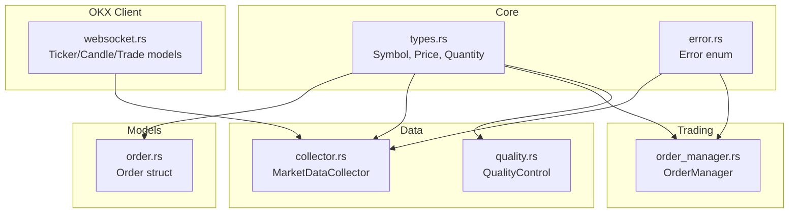
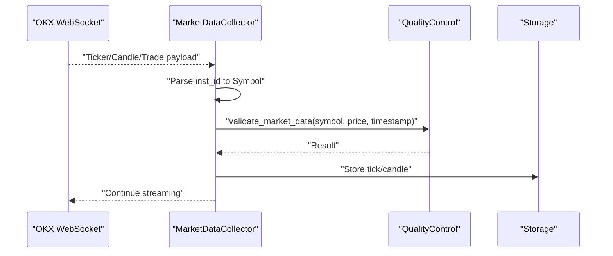
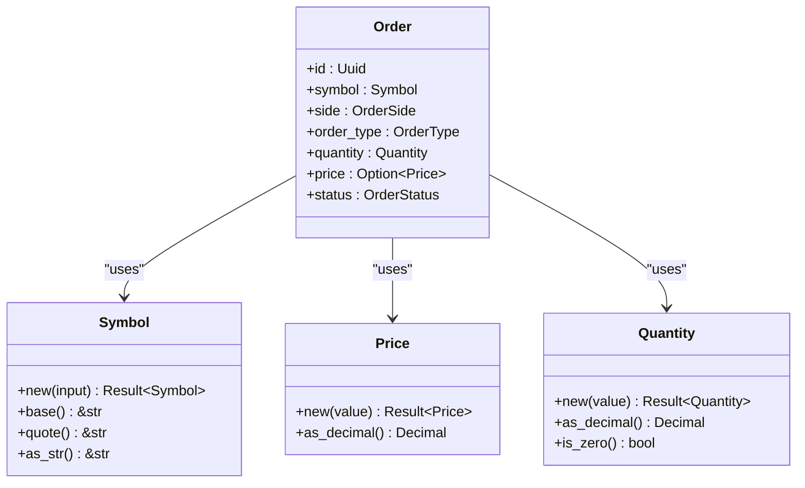
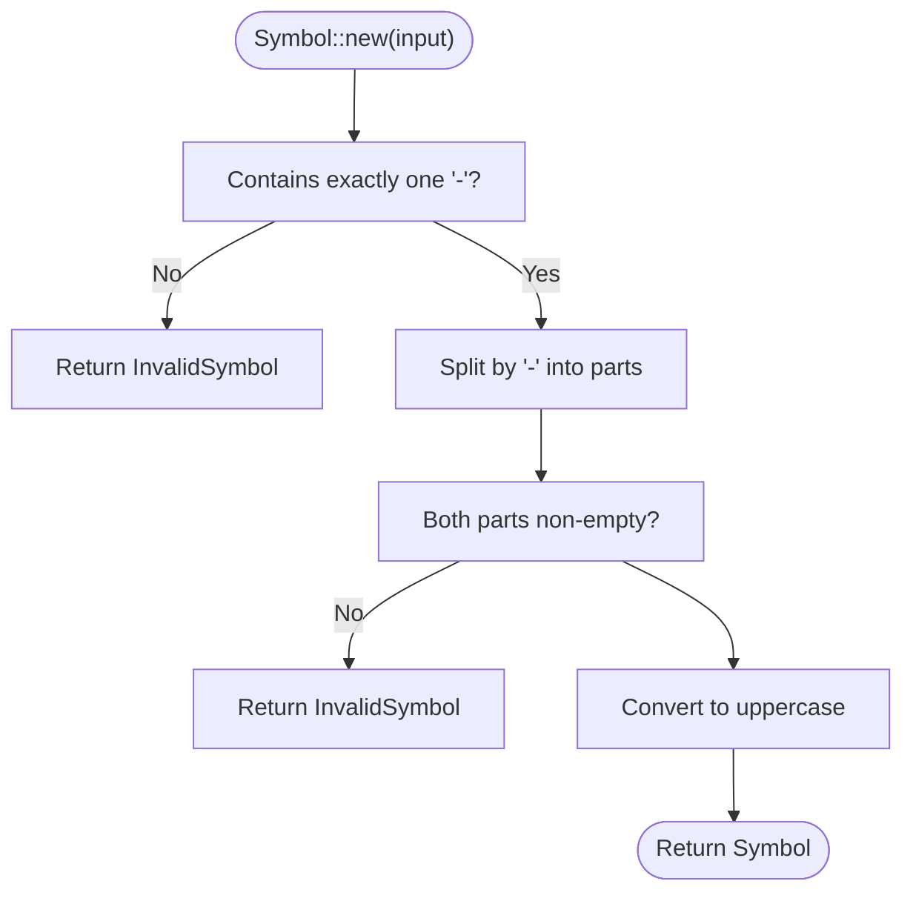
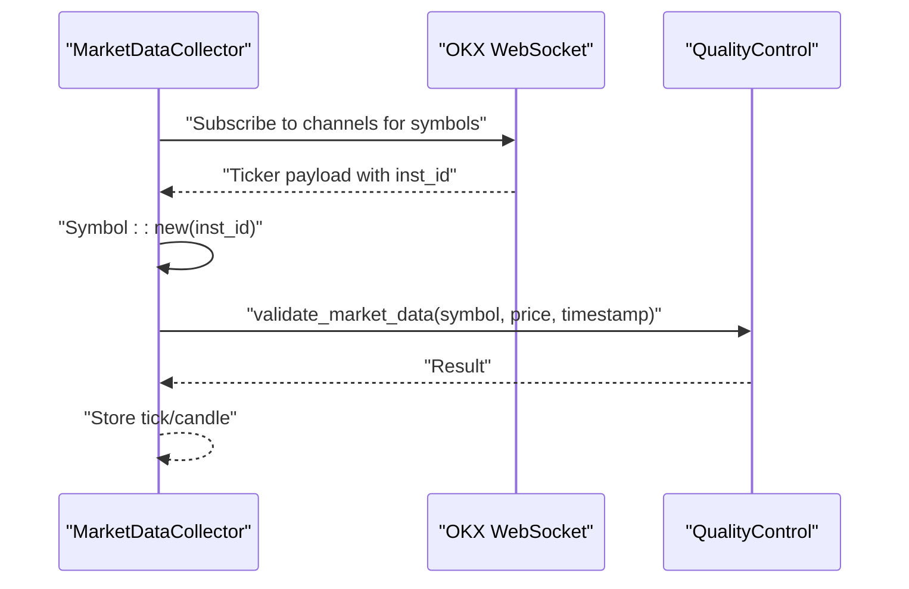
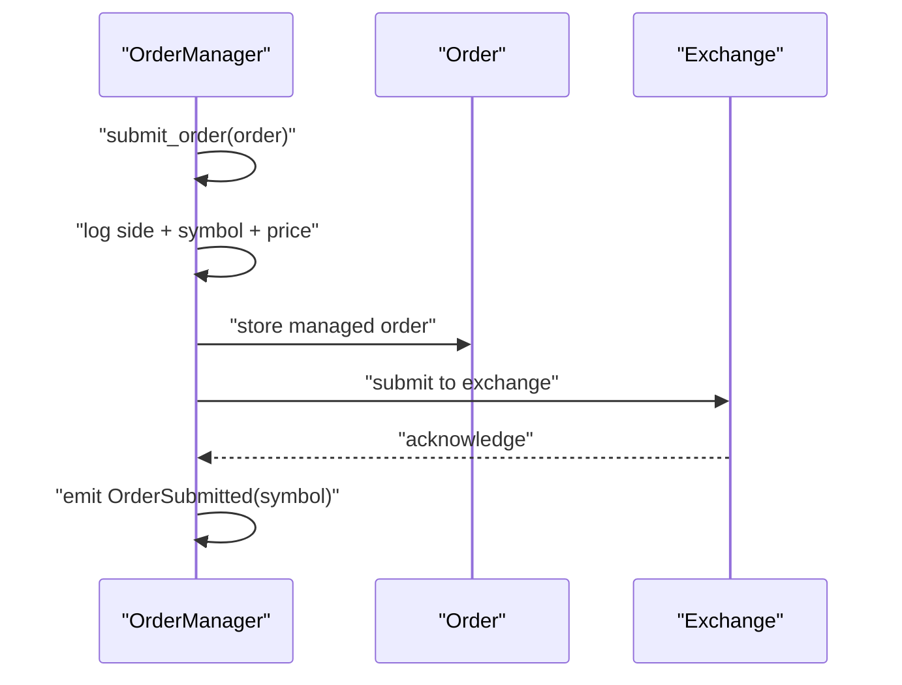
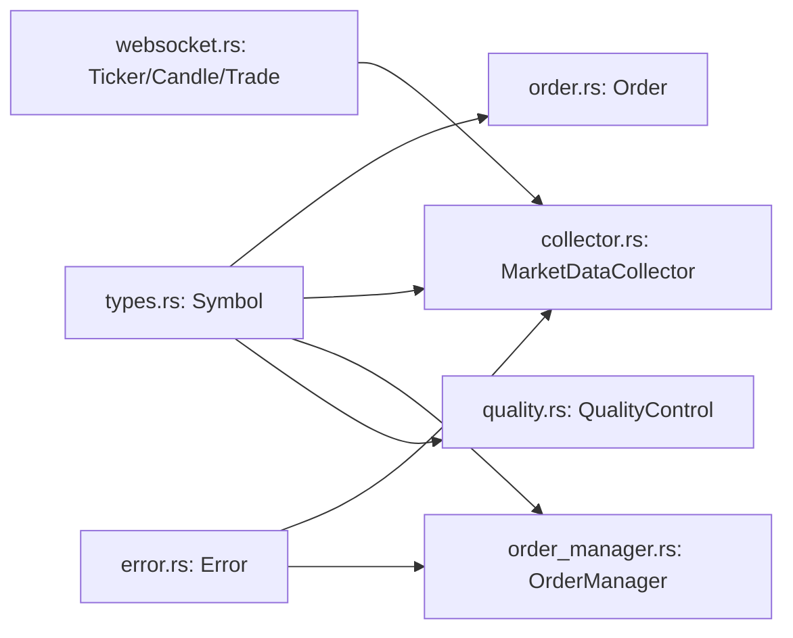

# Symbol Model

<cite>
**Referenced Files in This Document**
- [types.rs](file://crates/core/src/types.rs)
- [order.rs](file://crates/core/src/models/order.rs)
- [collector.rs](file://crates/data/src/collector.rs)
- [order_manager.rs](file://crates/trading/src/order_manager.rs)
- [error.rs](file://crates/core/src/error.rs)
- [websocket.rs](file://crates/okx-client/src/models/websocket.rs)
- [quality.rs](file://crates/data/src/quality.rs)
</cite>

## Table of Contents
1. [Introduction](#introduction)
2. [Project Structure](#project-structure)
3. [Core Components](#core-components)
4. [Architecture Overview](#architecture-overview)
5. [Detailed Component Analysis](#detailed-component-analysis)
6. [Dependency Analysis](#dependency-analysis)
7. [Performance Considerations](#performance-considerations)
8. [Troubleshooting Guide](#troubleshooting-guide)
9. [Conclusion](#conclusion)

## Introduction
This document provides comprehensive data model documentation for the Symbol entity used to represent trading pairs in the BTC-USDT format. It explains the field definitions, data types, validation rules, and the newtype pattern used to ensure type safety. It also covers the serialization/deserialization implementation with serde, validation logic for format and character constraints, and practical usage patterns across market data collection and order execution. Business rules around symbol naming conventions and their importance in exchange integration are addressed, along with examples of how Symbol instances are created and used throughout the system.

## Project Structure
The Symbol model is defined in the core crate and is consumed by multiple subsystems:
- Core types define the Symbol newtype and validation rules
- Order model uses Symbol to identify trading pairs
- Market data collector uses Symbol to tag incoming market data
- Order manager logs and tracks orders using Symbol
- OKX client models expose instrument identifiers that are converted to Symbol
- Quality control validates market data against Symbol

**Diagram sources**
- [types.rs](file://crates/core/src/types.rs#L1-L120)
- [order.rs](file://crates/core/src/models/order.rs#L90-L150)
- [collector.rs](file://crates/data/src/collector.rs#L1-L120)
- [order_manager.rs](file://crates/trading/src/order_manager.rs#L110-L140)
- [error.rs](file://crates/core/src/error.rs#L1-L47)
- [websocket.rs](file://crates/okx-client/src/models/websocket.rs#L267-L319)
- [quality.rs](file://crates/data/src/quality.rs#L238-L296)

**Section sources**
- [types.rs](file://crates/core/src/types.rs#L1-L120)
- [order.rs](file://crates/core/src/models/order.rs#L90-L150)
- [collector.rs](file://crates/data/src/collector.rs#L1-L120)
- [order_manager.rs](file://crates/trading/src/order_manager.rs#L110-L140)
- [error.rs](file://crates/core/src/error.rs#L1-L47)
- [websocket.rs](file://crates/okx-client/src/models/websocket.rs#L267-L319)
- [quality.rs](file://crates/data/src/quality.rs#L238-L296)

## Core Components
- Symbol: A newtype wrapper around String representing trading pairs in BASE-QUOTE format. It enforces validation during construction and exposes convenience methods to access base and quote components. It derives serialization/deserialization support for safe transport across systems.
- Price and Quantity: Newtype wrappers for precise numeric values used in pricing and sizing, complementing Symbol in the order model.

Key characteristics:
- Type safety: Prevents misuse of raw strings as trading symbols
- Validation: Ensures correct format and non-empty parts
- Normalization: Converts to uppercase for consistent representation
- Interoperability: Derives serde traits for JSON serialization/deserialization

**Section sources**
- [types.rs](file://crates/core/src/types.rs#L1-L120)

## Architecture Overview
Symbol participates in two primary workflows:
- Market data ingestion: Incoming instrument identifiers from OKX are parsed into Symbol, validated, and tagged onto market data records
- Order lifecycle: Orders carry a Symbol to identify the trading pair; logging and state transitions reference the Symbol

**Diagram sources**
- [collector.rs](file://crates/data/src/collector.rs#L198-L220)
- [collector.rs](file://crates/data/src/collector.rs#L222-L269)
- [collector.rs](file://crates/data/src/collector.rs#L272-L319)
- [quality.rs](file://crates/data/src/quality.rs#L238-L296)
- [websocket.rs](file://crates/okx-client/src/models/websocket.rs#L267-L319)

## Detailed Component Analysis

### Symbol Data Model
Symbol is a newtype struct wrapping a String. It encapsulates:
- Construction with validation
- Accessors for base and quote parts
- Display and parsing from string

Implementation highlights:
- Validation rules enforced on creation:
  - Must contain exactly one hyphen separator
  - Base and quote parts must be non-empty
  - Normalized to uppercase for consistency
- Accessors:
  - base(): returns the base currency part
  - quote(): returns the quote currency part
  - as_str(): returns the normalized symbol string
- Parsing:
  - Implements FromStr to parse from string slices
- Serialization:
  - Derives Serialize/Deserialize for JSON interchange

**Diagram sources**
- [types.rs](file://crates/core/src/types.rs#L1-L120)
- [order.rs](file://crates/core/src/models/order.rs#L90-L150)

**Section sources**
- [types.rs](file://crates/core/src/types.rs#L1-L120)

### Validation Logic and Rules
Validation occurs during Symbol::new:
- Format: Must contain exactly one hyphen
- Parts: Both base and quote must be non-empty
- Normalization: Converted to uppercase

Errors are surfaced as InvalidSymbol variants in the Error enum.

**Diagram sources**
- [types.rs](file://crates/core/src/types.rs#L27-L54)
- [error.rs](file://crates/core/src/error.rs#L1-L47)

**Section sources**
- [types.rs](file://crates/core/src/types.rs#L27-L54)
- [error.rs](file://crates/core/src/error.rs#L1-L47)

### Serialization and Deserialization with serde
Symbol derives Serialize and Deserialize, enabling safe transport across network boundaries and persistence layers. The OKX client models expose instrument identifiers as strings, which are parsed into Symbol during data ingestion.

Practical implications:
- JSON payloads containing inst_id can be mapped to Symbol
- Consistent uppercase representation prevents case mismatches
- Parsing failures surface as InvalidSymbol errors

**Section sources**
- [types.rs](file://crates/core/src/types.rs#L1-L120)
- [collector.rs](file://crates/data/src/collector.rs#L198-L220)
- [collector.rs](file://crates/data/src/collector.rs#L272-L319)
- [websocket.rs](file://crates/okx-client/src/models/websocket.rs#L267-L319)

### Usage Patterns Across the System

#### Market Data Collection
- Collector subscribes to channels for configured symbols
- Incoming WebSocket events include instrument identifiers
- These identifiers are parsed into Symbol and validated before downstream processing
- Quality control validates price/timestamp and deduplicates messages using Symbol

**Diagram sources**
- [collector.rs](file://crates/data/src/collector.rs#L90-L110)
- [collector.rs](file://crates/data/src/collector.rs#L198-L220)
- [collector.rs](file://crates/data/src/collector.rs#L222-L269)
- [collector.rs](file://crates/data/src/collector.rs#L272-L319)
- [quality.rs](file://crates/data/src/quality.rs#L238-L296)
- [websocket.rs](file://crates/okx-client/src/models/websocket.rs#L267-L319)

**Section sources**
- [collector.rs](file://crates/data/src/collector.rs#L90-L110)
- [collector.rs](file://crates/data/src/collector.rs#L198-L220)
- [collector.rs](file://crates/data/src/collector.rs#L222-L269)
- [collector.rs](file://crates/data/src/collector.rs#L272-L319)
- [quality.rs](file://crates/data/src/quality.rs#L238-L296)
- [websocket.rs](file://crates/okx-client/src/models/websocket.rs#L267-L319)

#### Order Execution
- Orders carry a Symbol to identify the trading pair
- Logging and state machines reference Symbol for context
- Order manager emits events carrying Symbol for visibility

**Diagram sources**
- [order_manager.rs](file://crates/trading/src/order_manager.rs#L110-L140)
- [order.rs](file://crates/core/src/models/order.rs#L90-L150)

**Section sources**
- [order_manager.rs](file://crates/trading/src/order_manager.rs#L110-L140)
- [order.rs](file://crates/core/src/models/order.rs#L90-L150)

### Business Rules and Exchange Integration
- Naming convention: BASE-QUOTE format with uppercase base and quote components
- Exchange integration: OKX instruments expose identifiers that are parsed into Symbol; consistent uppercase ensures alignment with exchange conventions
- Operational impact:
  - Prevents runtime ambiguity caused by mixed-case or malformed identifiers
  - Enables reliable routing of market data and orders to the correct trading pair
  - Facilitates deterministic storage and querying by symbol

**Section sources**
- [types.rs](file://crates/core/src/types.rs#L27-L54)
- [collector.rs](file://crates/data/src/collector.rs#L198-L220)
- [collector.rs](file://crates/data/src/collector.rs#L272-L319)
- [websocket.rs](file://crates/okx-client/src/models/websocket.rs#L267-L319)

## Dependency Analysis
Symbol is consumed by:
- Order model: central to order identity and reporting
- MarketDataCollector: to tag and route market data
- OrderManager: for logging and event emission
- QualityControl: to validate and deduplicate market data keyed by symbol

**Diagram sources**
- [types.rs](file://crates/core/src/types.rs#L1-L120)
- [order.rs](file://crates/core/src/models/order.rs#L90-L150)
- [collector.rs](file://crates/data/src/collector.rs#L1-L120)
- [order_manager.rs](file://crates/trading/src/order_manager.rs#L110-L140)
- [quality.rs](file://crates/data/src/quality.rs#L238-L296)
- [websocket.rs](file://crates/okx-client/src/models/websocket.rs#L267-L319)
- [error.rs](file://crates/core/src/error.rs#L1-L47)

**Section sources**
- [types.rs](file://crates/core/src/types.rs#L1-L120)
- [order.rs](file://crates/core/src/models/order.rs#L90-L150)
- [collector.rs](file://crates/data/src/collector.rs#L1-L120)
- [order_manager.rs](file://crates/trading/src/order_manager.rs#L110-L140)
- [quality.rs](file://crates/data/src/quality.rs#L238-L296)
- [websocket.rs](file://crates/okx-client/src/models/websocket.rs#L267-L319)
- [error.rs](file://crates/core/src/error.rs#L1-L47)

## Performance Considerations
- Parsing overhead: Symbol::new performs a single split operation and basic checks; negligible compared to network and database operations
- Memory: Symbol wraps a String; cloning is inexpensive for short identifiers
- Serialization: serde derives minimize boilerplate and reduce risk of misconfiguration
- Recommendations:
  - Prefer constructing Symbol once per message and reuse
  - Avoid repeated parsing of the same instrument identifier
  - Normalize identifiers early to prevent redundant conversions

[No sources needed since this section provides general guidance]

## Troubleshooting Guide
Common issues and resolutions:
- Invalid symbol format:
  - Cause: Missing or multiple separators, empty parts
  - Resolution: Ensure BASE-QUOTE format with non-empty base and quote
  - Reference: [types.rs](file://crates/core/src/types.rs#L27-L54), [error.rs](file://crates/core/src/error.rs#L1-L47)
- Parsing errors in market data:
  - Cause: Unexpected instrument identifier format from exchange
  - Resolution: Validate inst_id before Symbol::new; handle InvalidSymbol gracefully
  - Reference: [collector.rs](file://crates/data/src/collector.rs#L198-L220), [collector.rs](file://crates/data/src/collector.rs#L272-L319)
- Serialization/deserialization failures:
  - Cause: Malformed JSON payloads
  - Resolution: Ensure serde derives are present and payload conforms to expected shape
  - Reference: [types.rs](file://crates/core/src/types.rs#L1-L120), [error.rs](file://crates/core/src/error.rs#L1-L47)

**Section sources**
- [types.rs](file://crates/core/src/types.rs#L27-L54)
- [error.rs](file://crates/core/src/error.rs#L1-L47)
- [collector.rs](file://crates/data/src/collector.rs#L198-L220)
- [collector.rs](file://crates/data/src/collector.rs#L272-L319)

## Conclusion
Symbol is a foundational type that enforces correct trading pair representation and prevents invalid usage across the system. Its newtype pattern, validation rules, and serde support ensure robustness in market data ingestion and order execution. By adhering to the BASE-QUOTE naming convention and leveraging Symbol consistently, the system achieves predictable behavior, improved reliability, and clearer operational semantics.