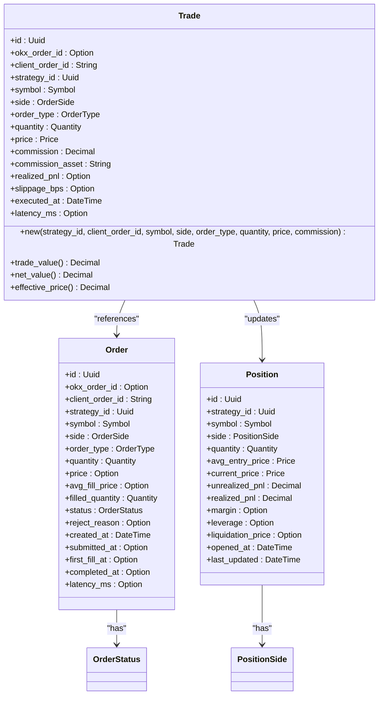
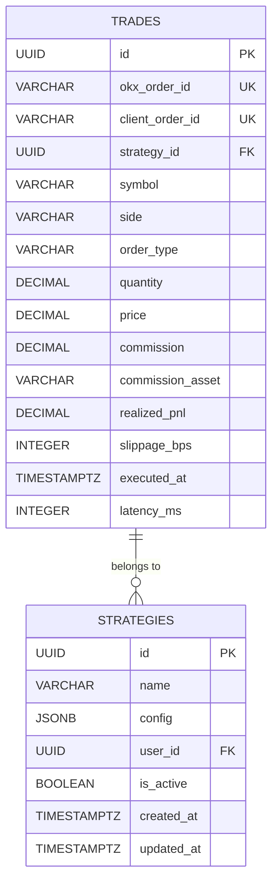
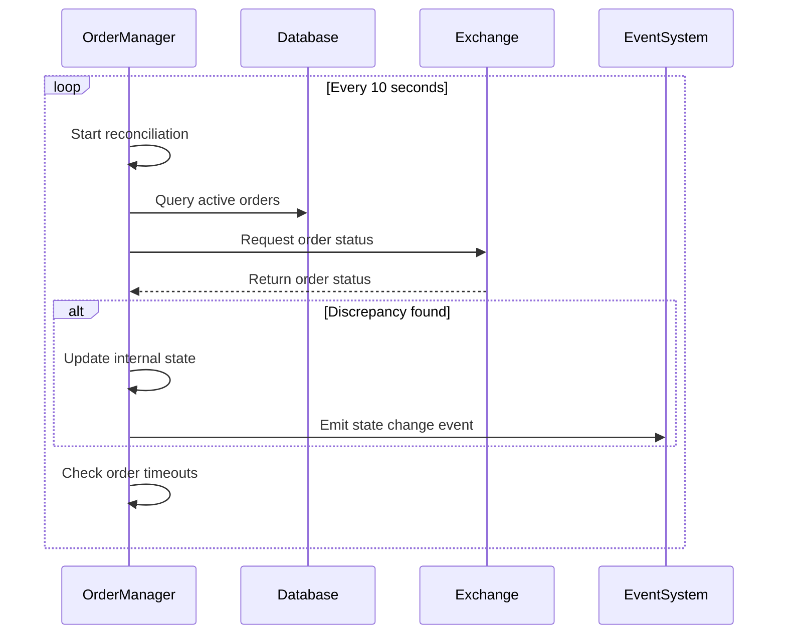
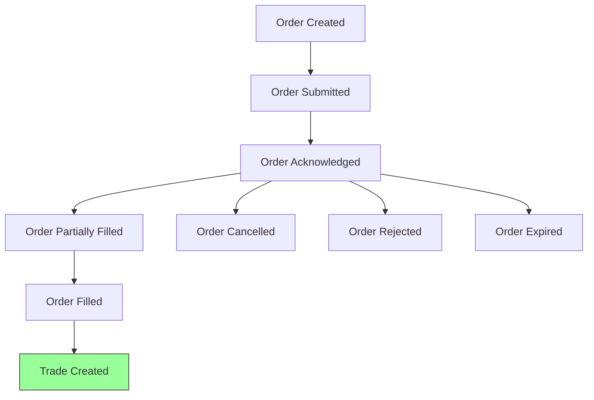
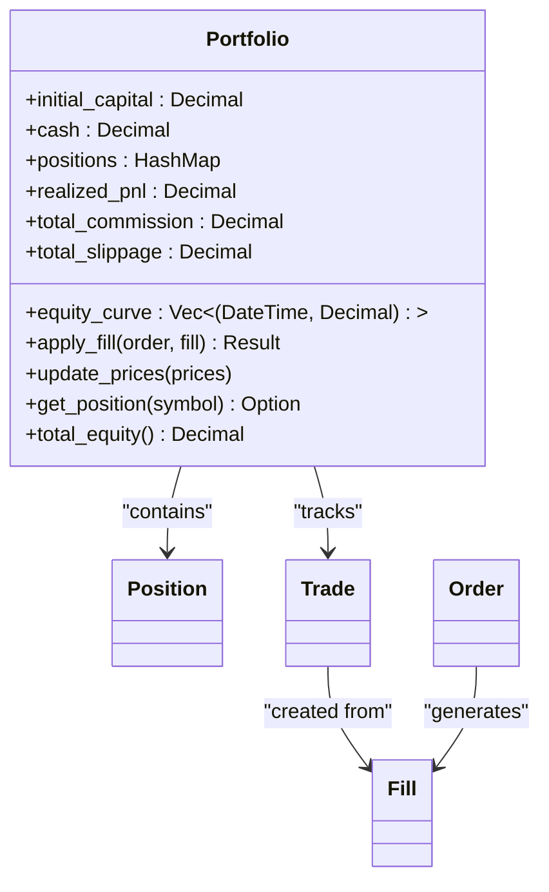
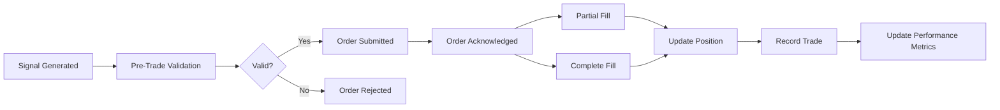
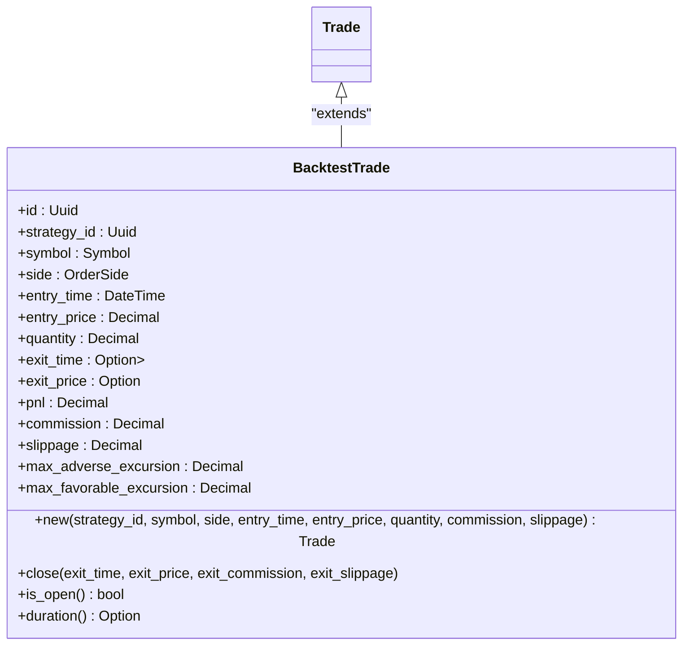

# Trade Model

<cite>
**Referenced Files in This Document**   
- [trade.rs](file://crates/core/src/models/trade.rs)
- [order.rs](file://crates/core/src/models/order.rs)
- [position.rs](file://crates/core/src/models/position.rs)
- [storage.rs](file://crates/data/src/storage.rs)
- [001_initial_schema.sql](file://migrations/001_initial_schema.sql)
- [events.rs](file://crates/backtest/src/events.rs)
- [portfolio.rs](file://crates/backtest/src/portfolio.rs)
- [order_manager.rs](file://crates/trading/src/order_manager.rs)
- [state_machine.rs](file://crates/trading/src/state_machine.rs)
- [types.rs](file://crates/core/src/types.rs)
</cite>

## Table of Contents
1. [Introduction](#introduction)
2. [Trade Entity Definition](#trade-entity-definition)
3. [Field Definitions and Validation Rules](#field-definitions-and-validation-rules)
4. [Trade Reconciliation and Audit Trail](#trade-reconciliation-and-audit-trail)
5. [Relationships with Order and Position Models](#relationships-with-order-and-position-models)
6. [Business Rules](#business-rules)
7. [Serialization and Persistence](#serialization-and-persistence)
8. [Usage in Performance Reporting, Tax Calculations, and Backtesting](#usage-in-performance-reporting-tax-calculations-and-backtesting)

## Introduction
The Trade model represents a completed trade execution within the EA OKX quantitative trading system. It serves as the primary record of executed transactions, capturing essential details such as price, quantity, fees, and timing. This document provides comprehensive documentation of the Trade entity, including its data structure, relationships with other models, business rules, and usage patterns across various system components.

**Section sources**
- [trade.rs](file://crates/core/src/models/trade.rs#L9-L56)

## Trade Entity Definition
The Trade entity is defined in the core crate and represents a completed trade execution. It captures all relevant details of a trade, including identification, financial details, and execution metadata.



**Diagram sources**
- [trade.rs](file://crates/core/src/models/trade.rs#L11-L56)
- [order.rs](file://crates/core/src/models/order.rs#L96-L150)
- [position.rs](file://crates/core/src/models/position.rs#L34-L76)

**Section sources**
- [trade.rs](file://crates/core/src/models/trade.rs#L9-L56)
- [order.rs](file://crates/core/src/models/order.rs#L96-L150)
- [position.rs](file://crates/core/src/models/position.rs#L34-L76)

## Field Definitions and Validation Rules
The Trade entity contains several fields that capture the essential details of a trade execution. Each field has specific data types and validation rules to ensure data integrity.

### Core Identification Fields
- **id**: Unique identifier for the trade (UUID)
- **okx_order_id**: Optional OKX exchange order ID for reconciliation
- **client_order_id**: Client-assigned order ID for tracking
- **strategy_id**: Identifier of the strategy that generated the trade

### Trading Details
- **symbol**: Trading pair (e.g., BTC-USDT) with validation for format
- **side**: Order side (buy or sell) with strict enumeration
- **order_type**: Type of order (market, limit, etc.) with strict enumeration
- **quantity**: Executed quantity with non-negative validation
- **price**: Execution price with positive validation

### Financial Metrics
- **commission**: Trading commission with non-negative validation
- **commission_asset**: Asset in which commission is paid (default: USDT)
- **realized_pnl**: Realized profit/loss from the trade
- **slippage_bps**: Slippage measured in basis points

### Execution Metadata
- **executed_at**: Timestamp of trade execution in UTC
- **latency_ms**: Latency from signal generation to execution in milliseconds



**Diagram sources**
- [001_initial_schema.sql](file://migrations/001_initial_schema.sql#L121-L146)
- [types.rs](file://crates/core/src/types.rs#L13-L175)

**Section sources**
- [trade.rs](file://crates/core/src/models/trade.rs#L13-L56)
- [types.rs](file://crates/core/src/types.rs#L13-L175)
- [001_initial_schema.sql](file://migrations/001_initial_schema.sql#L121-L146)

## Trade Reconciliation and Audit Trail
The system implements comprehensive trade reconciliation and audit trail capabilities to ensure data integrity and support compliance requirements.

### Reconciliation Process
The OrderManager component performs periodic reconciliation between the system's internal state and the exchange's records. This process runs at configurable intervals (default: 10 seconds) and checks for any discrepancies between expected and actual order states.



**Diagram sources**
- [order_manager.rs](file://crates/trading/src/order_manager.rs#L278-L336)
- [state_machine.rs](file://crates/trading/src/state_machine.rs#L71-L167)

**Section sources**
- [order_manager.rs](file://crates/trading/src/order_manager.rs#L278-L336)
- [state_machine.rs](file://crates/trading/src/state_machine.rs#L71-L167)

### Audit Trail
The system maintains a comprehensive audit trail through multiple mechanisms:
1. Database-level audit logs for all critical operations
2. State transition tracking for order lifecycle
3. Event sourcing for trade execution events
4. TimescaleDB hypertables for time-series data retention

The audit trail captures:
- All state transitions with timestamps and reasons
- Original and new values for any modifications
- User and system actions
- Error conditions and failure reasons

## Relationships with Order and Position Models
The Trade entity interacts closely with the Order and Position models, forming the core of the trading system's data model.

### Order Model Integration
The Trade entity is closely related to the Order model, with trades being created when orders are filled. The Order model tracks the lifecycle of an order from creation to completion, while the Trade model records the actual execution details.



**Diagram sources**
- [order.rs](file://crates/core/src/models/order.rs#L96-L150)
- [trade.rs](file://crates/core/src/models/trade.rs#L11-L56)

**Section sources**
- [order.rs](file://crates/core/src/models/order.rs#L96-L150)
- [trade.rs](file://crates/core/src/models/trade.rs#L11-L56)

### Position Model Updates
When a trade is executed, it updates the corresponding Position to reflect the new state of the portfolio. The Position model tracks the current holdings and their performance metrics.

The relationship between trades and positions follows these rules:
- Buy trades increase long position quantities
- Sell trades decrease long position quantities or create short positions
- Each trade updates the average entry price and realized PnL
- Position values are recalculated based on current market prices



**Diagram sources**
- [portfolio.rs](file://crates/backtest/src/portfolio.rs#L10-L34)
- [position.rs](file://crates/core/src/models/position.rs#L34-L76)

**Section sources**
- [portfolio.rs](file://crates/backtest/src/portfolio.rs#L10-L34)
- [position.rs](file://crates/core/src/models/position.rs#L34-L76)

## Business Rules
The system implements several business rules around trade execution, fee calculation, and settlement timing.

### Trade Confirmation Rules
- All trades require pre-trade validation against risk limits
- Orders must pass compliance checks before submission
- Position concentration limits are enforced
- Maximum order size constraints are applied
- Circuit breaker rules prevent excessive trading

### Fee Calculation
The system calculates fees based on the following rules:
- Maker fees: 0.02% for limit orders that add liquidity
- Taker fees: 0.05% for market orders that remove liquidity
- Volume-based discounts for high-volume traders
- Fee asset is typically the quote currency (USDT)
- Fees are deducted from the trade value immediately

### Settlement Timing
- Spot trades settle immediately (T+0)
- Margin trades settle according to exchange rules
- Cross-margin positions are marked-to-market hourly
- Isolated margin positions are settled upon position closure
- Settlement timing affects PnL calculations and reporting



**Diagram sources**
- [order_manager.rs](file://crates/trading/src/order_manager.rs#L110-L164)
- [portfolio.rs](file://crates/backtest/src/portfolio.rs#L50-L136)

**Section sources**
- [order_manager.rs](file://crates/trading/src/order_manager.rs#L110-L164)
- [portfolio.rs](file://crates/backtest/src/portfolio.rs#L50-L136)

## Serialization and Persistence
The Trade model supports serialization/deserialization through serde and is persisted in TimescaleDB for historical analysis.

### Serialization Implementation
The Trade entity implements serde's Serialize and Deserialize traits, enabling JSON serialization for:
- API communication
- Event streaming
- Persistent storage
- Inter-service messaging

Key serialization features:
- Automatic field mapping between Rust and JSON
- Custom serialization for complex types (UUID, Decimal, DateTime)
- Support for optional fields
- Efficient binary serialization when needed

### TimescaleDB Persistence
The system uses TimescaleDB as the primary persistence layer for trade data, leveraging its time-series capabilities:

```sql
-- Trades table structure
CREATE TABLE trades (
    id UUID PRIMARY KEY DEFAULT uuid_generate_v4(),
    okx_order_id VARCHAR(50) UNIQUE,
    client_order_id VARCHAR(50) NOT NULL UNIQUE,
    strategy_id UUID NOT NULL REFERENCES strategies(id),
    symbol VARCHAR(20) NOT NULL,
    side VARCHAR(4) NOT NULL CHECK (side IN ('buy', 'sell')),
    order_type VARCHAR(20) NOT NULL CHECK (order_type IN ('market', 'limit', 'stop_loss', 'take_profit', 'post_only')),
    quantity DECIMAL(20,8) NOT NULL CHECK (quantity > 0),
    price DECIMAL(20,8) CHECK (price > 0),
    avg_fill_price DECIMAL(20,8),
    filled_quantity DECIMAL(20,8) NOT NULL CHECK (filled_quantity >= 0 AND filled_quantity <= quantity),
    commission DECIMAL(20,8) NOT NULL CHECK (commission >= 0),
    commission_asset VARCHAR(10) NOT NULL,
    realized_pnl DECIMAL(20,8),
    slippage_bps INTEGER,
    status VARCHAR(20) NOT NULL CHECK (status IN ('created', 'submitted', 'partial', 'filled', 'cancelled', 'rejected', 'failed')),
    reject_reason TEXT,
    created_at TIMESTAMPTZ NOT NULL DEFAULT NOW(),
    submitted_at TIMESTAMPTZ,
    first_fill_at TIMESTAMPTZ,
    completed_at TIMESTAMPTZ,
    latency_ms INTEGER,
    total_latency_ms INTEGER
);
```

Persistence features:
- TimescaleDB hypertables for efficient time-series storage
- Automatic partitioning by time intervals
- Data compression for historical data
- Retention policies (5 years for historical data)
- Continuous aggregates for performance metrics
- Indexing for fast querying by strategy, symbol, and time

**Diagram sources**
- [storage.rs](file://crates/data/src/storage.rs#L69-L283)
- [001_initial_schema.sql](file://migrations/001_initial_schema.sql#L121-L146)

**Section sources**
- [storage.rs](file://crates/data/src/storage.rs#L69-L283)
- [001_initial_schema.sql](file://migrations/001_initial_schema.sql#L121-L146)

## Usage in Performance Reporting, Tax Calculations, and Backtesting
The Trade model serves as the foundation for various analytical and operational functions.

### Performance Reporting
Trade data is used to calculate key performance metrics:
- Return on investment (ROI)
- Sharpe ratio and Sortino ratio
- Maximum drawdown
- Win rate and profit factor
- Average gain/loss per trade
- Risk-adjusted returns

The system generates daily, weekly, and monthly performance reports by aggregating trade data and calculating these metrics.

### Tax Calculations
For tax reporting purposes, the system uses trade data to:
- Calculate capital gains/losses
- Determine holding periods for short-term vs. long-term gains
- Track cost basis for FIFO, LIFO, or specific identification methods
- Generate tax forms and reports
- Support tax-loss harvesting strategies

### Backtesting Validation
In the backtesting environment, trade records are used to:
- Validate strategy performance
- Measure execution quality
- Analyze slippage and market impact
- Test risk management rules
- Optimize position sizing

The backtesting engine uses a simulated Trade model that includes additional metrics like:
- Maximum adverse excursion (MAE)
- Maximum favorable excursion (MFE)
- Trade duration
- Entry and exit timing



**Diagram sources**
- [events.rs](file://crates/backtest/src/events.rs#L112-L127)
- [trade.rs](file://crates/core/src/models/trade.rs#L11-L56)

**Section sources**
- [events.rs](file://crates/backtest/src/events.rs#L112-L127)
- [trade.rs](file://crates/core/src/models/trade.rs#L11-L56)