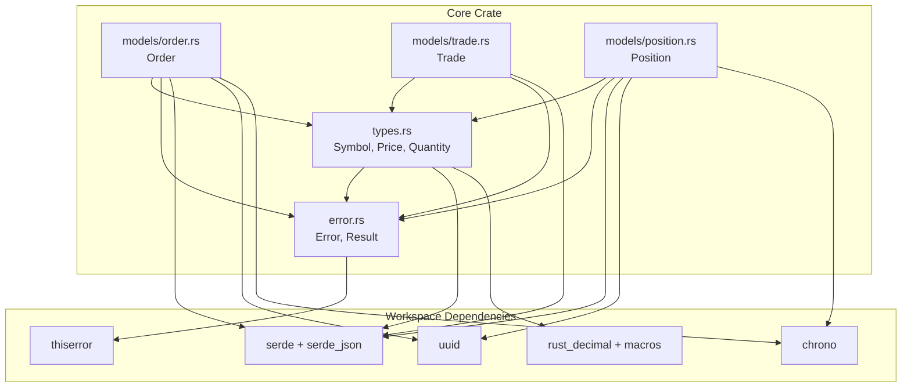
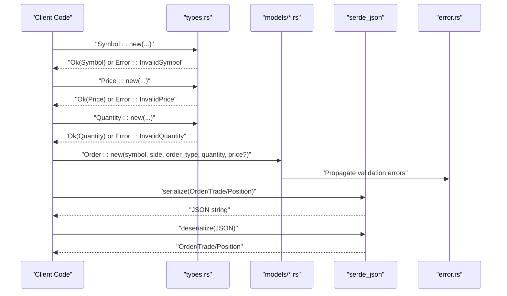
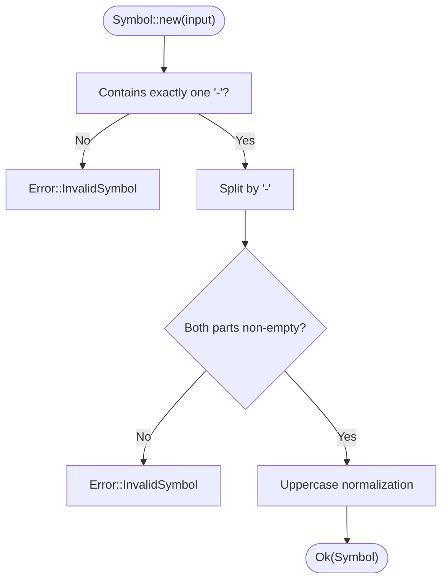
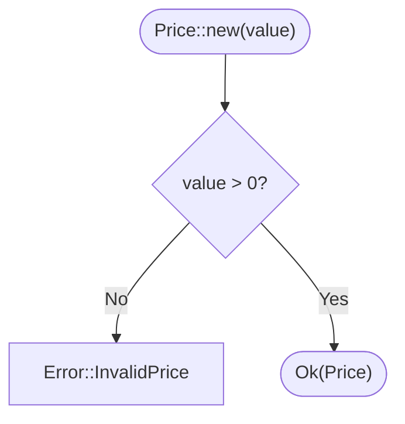
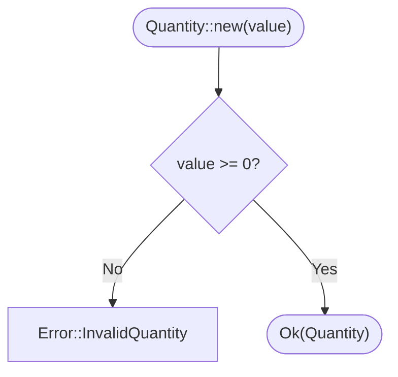
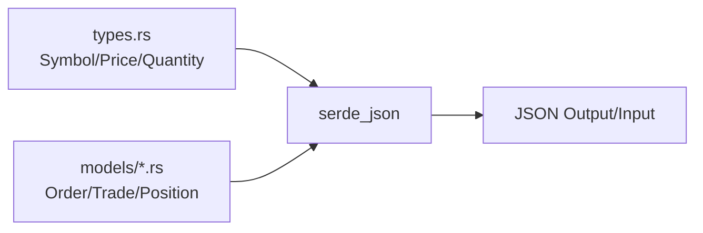
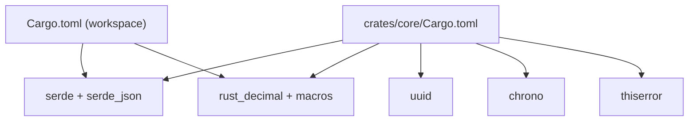

# Type Safety and Validation

<cite>
**Referenced Files in This Document**
- [types.rs](file://crates/core/src/types.rs)
- [error.rs](file://crates/core/src/error.rs)
- [order.rs](file://crates/core/src/models/order.rs)
- [trade.rs](file://crates/core/src/models/trade.rs)
- [position.rs](file://crates/core/src/models/position.rs)
- [Cargo.toml](file://Cargo.toml)
- [core/Cargo.toml](file://crates/core/Cargo.toml)
- [simple_ma_crossover.rs](file://examples/simple_ma_crossover.rs)
- [grid_trading.rs](file://examples/grid_trading.rs)
</cite>

## Table of Contents
1. [Introduction](#introduction)
2. [Project Structure](#project-structure)
3. [Core Components](#core-components)
4. [Architecture Overview](#architecture-overview)
5. [Detailed Component Analysis](#detailed-component-analysis)
6. [Dependency Analysis](#dependency-analysis)
7. [Performance Considerations](#performance-considerations)
8. [Troubleshooting Guide](#troubleshooting-guide)
9. [Conclusion](#conclusion)

## Introduction
This document explains the type safety and validation system used across the financial primitives in the system. It focuses on the newtype pattern implementation for Symbol, Price, and Quantity to prevent type errors and enforce domain correctness. It details validation rules at construction time, error handling strategy with custom error types, and how the validation integrates with serde for secure serialization/deserialization. Practical examples demonstrate how the type system prevents common programming mistakes such as mixing up price and quantity or using invalid symbols.

## Project Structure
The type safety and validation system is centered in the core crate’s types and models modules. The core crate defines:
- Fundamental financial types (Symbol, Price, Quantity) with strict validation
- Domain models (Order, Trade, Position) that embed these types
- A unified error type for validation failures



**Diagram sources**
- [types.rs](file://crates/core/src/types.rs#L1-L180)
- [error.rs](file://crates/core/src/error.rs#L1-L66)
- [order.rs](file://crates/core/src/models/order.rs#L1-L150)
- [trade.rs](file://crates/core/src/models/trade.rs#L1-L60)
- [position.rs](file://crates/core/src/models/position.rs#L1-L76)
- [Cargo.toml](file://Cargo.toml#L42-L51)
- [core/Cargo.toml](file://crates/core/Cargo.toml#L8-L17)

**Section sources**
- [types.rs](file://crates/core/src/types.rs#L1-L180)
- [error.rs](file://crates/core/src/error.rs#L1-L66)
- [order.rs](file://crates/core/src/models/order.rs#L1-L150)
- [trade.rs](file://crates/core/src/models/trade.rs#L1-L60)
- [position.rs](file://crates/core/src/models/position.rs#L1-L76)
- [Cargo.toml](file://Cargo.toml#L42-L51)
- [core/Cargo.toml](file://crates/core/Cargo.toml#L8-L17)

## Core Components
- Symbol: A validated trading pair identifier with uppercase normalization and strict format checks.
- Price: A validated positive decimal with 8-decimal precision semantics.
- Quantity: A validated non-negative decimal with zero as a valid value.
- Unified Error type: Centralized error enumeration for validation failures and conversions.
- Domain models: Order, Trade, Position embed these types to enforce correctness at the model boundary.

Key implementation references:
- [Symbol::new](file://crates/core/src/types.rs#L27-L54)
- [Price::new](file://crates/core/src/types.rs#L102-L110)
- [Quantity::new](file://crates/core/src/types.rs#L147-L155)
- [Error variants](file://crates/core/src/error.rs#L7-L28)
- [Order fields using Symbol/Price/Quantity](file://crates/core/src/models/order.rs#L110-L123)
- [Trade fields using Symbol/Price/Quantity](file://crates/core/src/models/trade.rs#L24-L38)
- [Position fields using Symbol/Price/Quantity](file://crates/core/src/models/position.rs#L41-L51)

**Section sources**
- [types.rs](file://crates/core/src/types.rs#L27-L173)
- [error.rs](file://crates/core/src/error.rs#L1-L66)
- [order.rs](file://crates/core/src/models/order.rs#L110-L123)
- [trade.rs](file://crates/core/src/models/trade.rs#L24-L38)
- [position.rs](file://crates/core/src/models/position.rs#L41-L51)

## Architecture Overview
The type safety architecture enforces domain correctness at construction time and propagates validation errors through a unified error type. Serialization/deserialization is supported via serde, enabling secure JSON interchange.



**Diagram sources**
- [types.rs](file://crates/core/src/types.rs#L27-L173)
- [order.rs](file://crates/core/src/models/order.rs#L154-L203)
- [trade.rs](file://crates/core/src/models/trade.rs#L1-L60)
- [position.rs](file://crates/core/src/models/position.rs#L1-L76)
- [error.rs](file://crates/core/src/error.rs#L1-L66)

## Detailed Component Analysis

### Symbol Validation
- Construction rule: Must contain exactly one hyphen separator and neither part can be empty. Normalizes to uppercase.
- Validation ensures domain correctness for trading pairs and prevents malformed identifiers.
- Parsing from string is supported via FromStr.



**Diagram sources**
- [types.rs](file://crates/core/src/types.rs#L27-L54)

**Section sources**
- [types.rs](file://crates/core/src/types.rs#L27-L54)

### Price Validation
- Construction rule: Must be strictly positive (greater than zero).
- Provides helpers to construct from f64 with controlled conversion and zero/negative rejection.



**Diagram sources**
- [types.rs](file://crates/core/src/types.rs#L102-L110)

**Section sources**
- [types.rs](file://crates/core/src/types.rs#L102-L123)

### Quantity Validation
- Construction rule: Must be non-negative (zero is valid).
- Provides helpers to construct from f64 with controlled conversion and negative rejection.



**Diagram sources**
- [types.rs](file://crates/core/src/types.rs#L147-L155)

**Section sources**
- [types.rs](file://crates/core/src/types.rs#L147-L173)

### Error Handling Strategy
- Centralized Error enum covers invalid symbol, price, quantity, order-related, position-side, serialization, decimal conversion, validation, configuration, and internal errors.
- Result type alias simplifies propagation across modules.
- Serde JSON errors are converted into Error::SerializationError.

```mermaid
classDiagram
class Error {
+InvalidSymbol(String)
+InvalidPrice(String)
+InvalidQuantity(String)
+InvalidOrderType(String)
+InvalidOrderSide(String)
+InvalidOrderStatus(String)
+InvalidPositionSide(String)
+SerializationError(serde_json : : Error)
+DecimalError(String)
+ValidationError(String)
+ConfigError(String)
+Internal(String)
}
class Result~T~ {
<<alias>>
}
Error <.. Result : "Error : : "
```

**Diagram sources**
- [error.rs](file://crates/core/src/error.rs#L7-L28)

**Section sources**
- [error.rs](file://crates/core/src/error.rs#L1-L66)

### Integration with Serde
- All primitive types derive Serialize/Deserialize.
- The workspace enables serde features including serde_json and rust_decimal with serde support.
- This allows secure serialization/deserialization of financial primitives without losing precision.



**Diagram sources**
- [types.rs](file://crates/core/src/types.rs#L12-L18)
- [order.rs](file://crates/core/src/models/order.rs#L95-L150)
- [trade.rs](file://crates/core/src/models/trade.rs#L1-L11)
- [position.rs](file://crates/core/src/models/position.rs#L32-L76)
- [Cargo.toml](file://Cargo.toml#L42-L51)

**Section sources**
- [types.rs](file://crates/core/src/types.rs#L12-L18)
- [order.rs](file://crates/core/src/models/order.rs#L95-L150)
- [trade.rs](file://crates/core/src/models/trade.rs#L1-L11)
- [position.rs](file://crates/core/src/models/position.rs#L32-L76)
- [Cargo.toml](file://Cargo.toml#L42-L51)

### Preventing Common Programming Errors
- Mixing up price and quantity: The distinct types ensure compile-time prevention of accidental swaps. Using Price where Quantity is expected yields a type error.
- Invalid symbols: Symbol::new rejects malformed formats, preventing runtime errors downstream.
- Negative quantities: Quantity::new rejects negatives, avoiding invalid positions.
- Zero/negative prices: Price::new rejects zero/negatives, preventing invalid order pricing.

Practical usage examples in the codebase:
- Creating orders with validated types: [Order::new](file://crates/core/src/models/order.rs#L154-L203)
- Constructing trades with validated types: [Trade::new](file://crates/core/src/models/trade.rs#L60-L87)
- Building positions with validated types: [Position::new](file://crates/core/src/models/position.rs#L80-L105)

**Section sources**
- [order.rs](file://crates/core/src/models/order.rs#L154-L203)
- [trade.rs](file://crates/core/src/models/trade.rs#L60-L87)
- [position.rs](file://crates/core/src/models/position.rs#L80-L105)

### Examples Demonstrating Type Safety
- Moving average crossover strategy constructs orders using validated types and avoids mixing price and quantity: [MACrossoverStrategy::create_order](file://examples/simple_ma_crossover.rs#L203-L234)
- Grid trading strategy builds orders with validated price and quantity: [GridTradingStrategy::initialize_grid](file://examples/grid_trading.rs#L80-L115)

**Section sources**
- [simple_ma_crossover.rs](file://examples/simple_ma_crossover.rs#L203-L234)
- [grid_trading.rs](file://examples/grid_trading.rs#L80-L115)

## Dependency Analysis
- Core crate depends on serde, serde_json, rust_decimal, uuid, chrono, and thiserror.
- Workspace enables serde features and rust_decimal with serde support.
- The type system relies on rust_decimal for precise decimal arithmetic and serde for serialization.



**Diagram sources**
- [core/Cargo.toml](file://crates/core/Cargo.toml#L8-L17)
- [Cargo.toml](file://Cargo.toml#L42-L51)

**Section sources**
- [core/Cargo.toml](file://crates/core/Cargo.toml#L8-L17)
- [Cargo.toml](file://Cargo.toml#L42-L51)

## Performance Considerations
- Runtime validation cost: Construction-time validation for Symbol, Price, and Quantity is minimal and occurs only during object creation. The primary overhead is string splitting and comparison for Symbol and numeric comparisons for Price/Quantity.
- Precision and safety: Using rust_decimal ensures precise decimal arithmetic and avoids floating-point rounding issues, which is essential for financial computations.
- Serialization overhead: serde_json serialization/deserialization is efficient and preserves precision. The workspace enables serde features that support robust decimal handling.
- Compile-time vs runtime: The newtype pattern provides compile-time guarantees that catch misuse early, reducing runtime errors and defensive checks elsewhere in the system.

[No sources needed since this section provides general guidance]

## Troubleshooting Guide
Common validation failures and their causes:
- Invalid symbol format: Missing or multiple separators, empty parts, or incorrect casing. See [Symbol::new](file://crates/core/src/types.rs#L27-L54).
- Invalid price: Zero or negative values. See [Price::new](file://crates/core/src/types.rs#L102-L110).
- Invalid quantity: Negative values. See [Quantity::new](file://crates/core/src/types.rs#L147-L155).
- Serialization errors: JSON parse failures are converted to Error::SerializationError. See [Error::SerializationError](file://crates/core/src/error.rs#L19-L22).

Debugging tips:
- Prefer constructing types via new() to trigger validation immediately.
- Use from_f64 helpers for testing to validate float-to-decimal conversion safely.
- When deserializing, wrap serde_json::from_str in a Result and propagate Error::SerializationError.

**Section sources**
- [types.rs](file://crates/core/src/types.rs#L27-L173)
- [error.rs](file://crates/core/src/error.rs#L1-L66)

## Conclusion
The type safety and validation system leverages the newtype pattern to enforce domain correctness for Symbol, Price, and Quantity. Construction-time validation, a centralized Error type, and serde integration provide robust protection against common programming errors and ensure secure, precise serialization. The examples demonstrate practical usage across strategies, reinforcing the benefits of compile-time safety and runtime validation.