# Data Collection

<cite>
**Referenced Files in This Document**
- [collector.rs](file://crates/data/src/collector.rs)
- [websocket.rs](file://crates/okx-client/src/websocket.rs)
- [websocket_models.rs](file://crates/okx-client/src/models/websocket.rs)
- [auth.rs](file://crates/okx-client/src/auth.rs)
- [storage.rs](file://crates/data/src/storage.rs)
- [quality.rs](file://crates/data/src/quality.rs)
- [types.rs](file://crates/core/src/types.rs)
- [error.rs](file://crates/data/src/error.rs)
- [websocket_ticker.rs](file://examples/websocket_ticker.rs)
</cite>

## Table of Contents
1. [Introduction](#introduction)
2. [Project Structure](#project-structure)
3. [Core Components](#core-components)
4. [Architecture Overview](#architecture-overview)
5. [Detailed Component Analysis](#detailed-component-analysis)
6. [Dependency Analysis](#dependency-analysis)
7. [Performance Considerations](#performance-considerations)
8. [Troubleshooting Guide](#troubleshooting-guide)
9. [Conclusion](#conclusion)

## Introduction
This document explains the data collection sub-component responsible for real-time market data ingestion from OKX via WebSocket. It covers how the MarketDataCollector establishes and maintains connections to OKX public and private channels, subscribes to various data feeds (tickers, candles, trades, order books), parses incoming messages into domain models, applies quality control, and persists data to TimescaleDB and Redis. It also describes connection handling, reconnection strategies, authentication for private channels, and common operational concerns such as timeouts, rate limits, and multi-symbol synchronization.

## Project Structure
The data collection feature spans several crates:
- Data layer: MarketDataCollector orchestrates WebSocket ingestion, quality control, and storage.
- OKX client: Provides the WebSocket client, authentication, and message parsing.
- Core types: Defines Symbol, Price, Quantity used across the system.
- Storage: TimescaleDB and Redis persistence for candles and ticks.
- Quality control: Validates timestamps, detects duplicates, and flags anomalies.

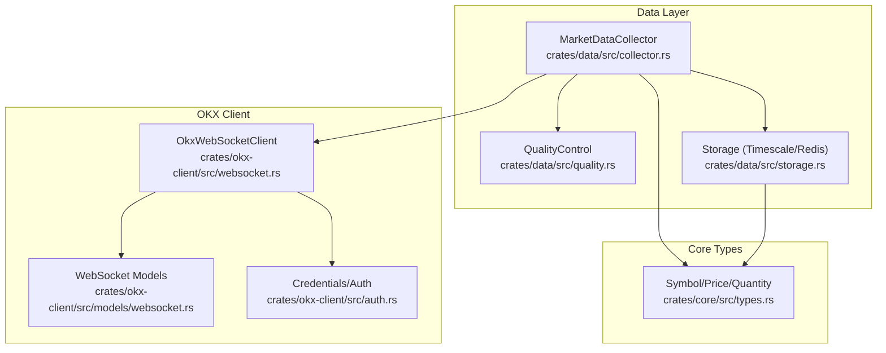

**Diagram sources**
- [collector.rs](file://crates/data/src/collector.rs#L51-L125)
- [websocket.rs](file://crates/okx-client/src/websocket.rs#L112-L170)
- [websocket_models.rs](file://crates/okx-client/src/models/websocket.rs#L126-L152)
- [auth.rs](file://crates/okx-client/src/auth.rs#L12-L20)
- [storage.rs](file://crates/data/src/storage.rs#L29-L67)
- [quality.rs](file://crates/data/src/quality.rs#L58-L74)
- [types.rs](file://crates/core/src/types.rs#L13-L179)

**Section sources**
- [collector.rs](file://crates/data/src/collector.rs#L1-L50)
- [websocket.rs](file://crates/okx-client/src/websocket.rs#L1-L60)
- [websocket_models.rs](file://crates/okx-client/src/models/websocket.rs#L1-L45)
- [auth.rs](file://crates/okx-client/src/auth.rs#L1-L40)
- [storage.rs](file://crates/data/src/storage.rs#L1-L40)
- [quality.rs](file://crates/data/src/quality.rs#L1-L40)
- [types.rs](file://crates/core/src/types.rs#L1-L40)

## Core Components
- MarketDataCollector: Initializes WebSocket connections, subscribes to channels, processes events, applies quality control, and writes to storage backends.
- OkxWebSocketClient: Manages public/private WebSocket connections, handles authentication, subscription/unsubscription, heartbeat, and message parsing.
- WebSocket Models: Defines Channel enumeration, SubscriptionRequest, and WebSocketEvent variants with JSON parsing.
- Credentials/Auth: Provides signing utilities for private channel authentication.
- Storage: TimescaleStorage and RedisStorage for persistent and cached market data.
- QualityControl: Enforces timestamp validity, duplicate detection, price-range checks, and anomaly detection.
- Core Types: Symbol, Price, Quantity used throughout the system.

**Section sources**
- [collector.rs](file://crates/data/src/collector.rs#L51-L125)
- [websocket.rs](file://crates/okx-client/src/websocket.rs#L112-L222)
- [websocket_models.rs](file://crates/okx-client/src/models/websocket.rs#L126-L152)
- [auth.rs](file://crates/okx-client/src/auth.rs#L12-L20)
- [storage.rs](file://crates/data/src/storage.rs#L69-L121)
- [quality.rs](file://crates/data/src/quality.rs#L58-L105)
- [types.rs](file://crates/core/src/types.rs#L13-L179)

## Architecture Overview
The data collection pipeline integrates the MarketDataCollector with the OKX WebSocket client and storage backends. The client manages two separate WebSocket streams (public and private), authenticates the private stream, and dispatches parsed events to the collector. The collector validates and enriches the data, then persists it to TimescaleDB and/or Redis.

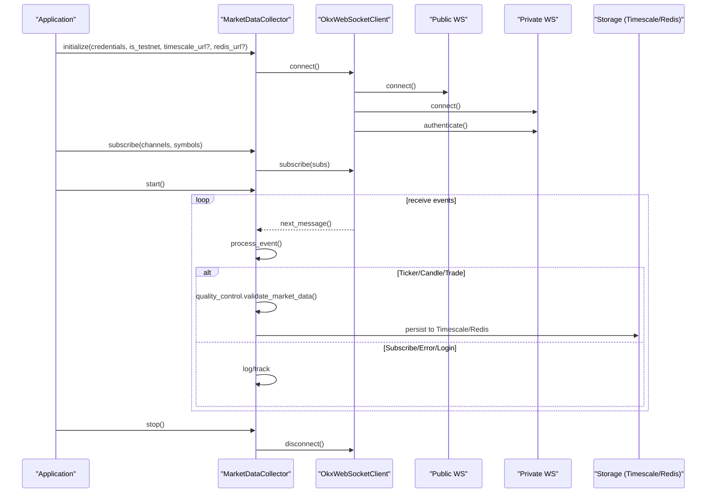

**Diagram sources**
- [collector.rs](file://crates/data/src/collector.rs#L76-L170)
- [websocket.rs](file://crates/okx-client/src/websocket.rs#L169-L222)
- [websocket_models.rs](file://crates/okx-client/src/models/websocket.rs#L126-L152)

## Detailed Component Analysis

### MarketDataCollector
Responsibilities:
- Initialize WebSocket client and subscribe to configured channels/symbols.
- Start a loop to receive and process WebSocket events.
- Apply quality control and persist data to storage backends.
- Graceful shutdown with signal handling and connection cleanup.

Key behaviors:
- Initialization builds subscriptions for each symbol/channel combination and subscribes to both public and private channels via the client.
- Event processing routes to dedicated handlers for tickers, candles, and trades; logs subscription confirmations and errors.
- Quality control runs timestamp validation, price-range checks, anomaly detection, and optional duplicate detection.
- Persistence writes candles to TimescaleDB and ticks to TimescaleDB; optional Redis caching is supported.

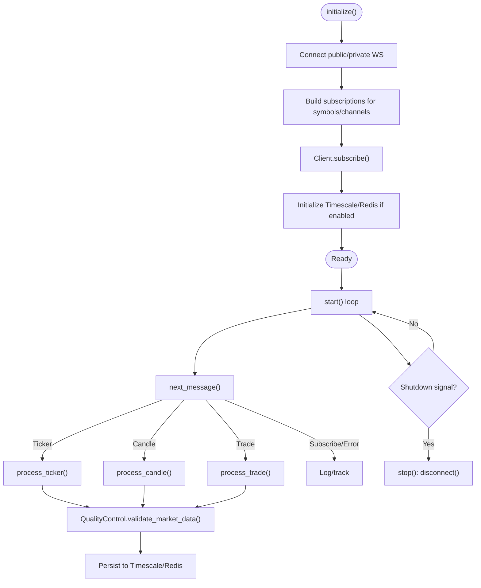

**Diagram sources**
- [collector.rs](file://crates/data/src/collector.rs#L76-L170)
- [quality.rs](file://crates/data/src/quality.rs#L241-L275)
- [storage.rs](file://crates/data/src/storage.rs#L85-L144)

**Section sources**
- [collector.rs](file://crates/data/src/collector.rs#L51-L170)
- [collector.rs](file://crates/data/src/collector.rs#L172-L341)
- [quality.rs](file://crates/data/src/quality.rs#L241-L275)
- [storage.rs](file://crates/data/src/storage.rs#L85-L144)

### OkxWebSocketClient
Responsibilities:
- Manage public and private WebSocket connections.
- Authenticate private channel using signed login.
- Handle subscription/unsubscription for public and private channels.
- Maintain heartbeat with ping/pong and detect timeouts.
- Parse incoming messages into WebSocketEvent variants and dispatch to consumers.

Key behaviors:
- connect() establishes public and private streams and triggers authentication for private.
- subscribe() partitions requests by public/private and sends appropriate subscription messages.
- start_heartbeat() periodically pings both channels and transitions to reconnecting on pong timeout.
- start_message_processor() spawns tasks to read from both streams, parse messages, and emit events.

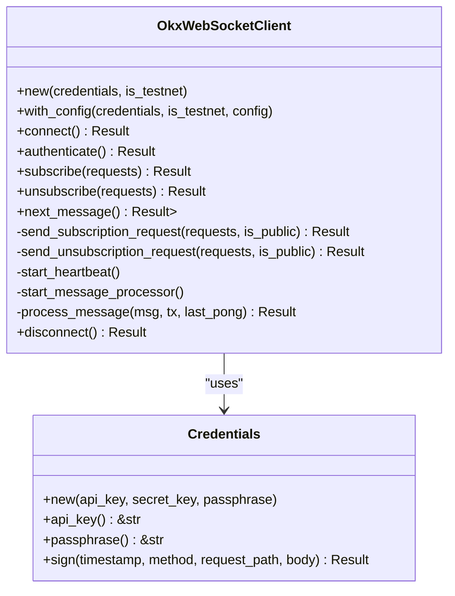

**Diagram sources**
- [websocket.rs](file://crates/okx-client/src/websocket.rs#L112-L222)
- [websocket.rs](file://crates/okx-client/src/websocket.rs#L224-L252)
- [websocket.rs](file://crates/okx-client/src/websocket.rs#L254-L304)
- [websocket.rs](file://crates/okx-client/src/websocket.rs#L370-L418)
- [websocket.rs](file://crates/okx-client/src/websocket.rs#L420-L491)
- [websocket.rs](file://crates/okx-client/src/websocket.rs#L493-L553)
- [auth.rs](file://crates/okx-client/src/auth.rs#L12-L20)

**Section sources**
- [websocket.rs](file://crates/okx-client/src/websocket.rs#L169-L222)
- [websocket.rs](file://crates/okx-client/src/websocket.rs#L224-L252)
- [websocket.rs](file://crates/okx-client/src/websocket.rs#L254-L304)
- [websocket.rs](file://crates/okx-client/src/websocket.rs#L370-L418)
- [websocket.rs](file://crates/okx-client/src/websocket.rs#L420-L491)
- [websocket.rs](file://crates/okx-client/src/websocket.rs#L493-L553)
- [auth.rs](file://crates/okx-client/src/auth.rs#L12-L20)

### WebSocket Models and Message Parsing
- Channel enumeration defines public and private channels, including tickers, candles, trades, order books, and account/position/order channels.
- SubscriptionRequest encapsulates channel and instrument selection and serializes to the required JSON structure.
- WebSocketEvent parses incoming JSON into structured variants and routes to the appropriate handler in the collector.

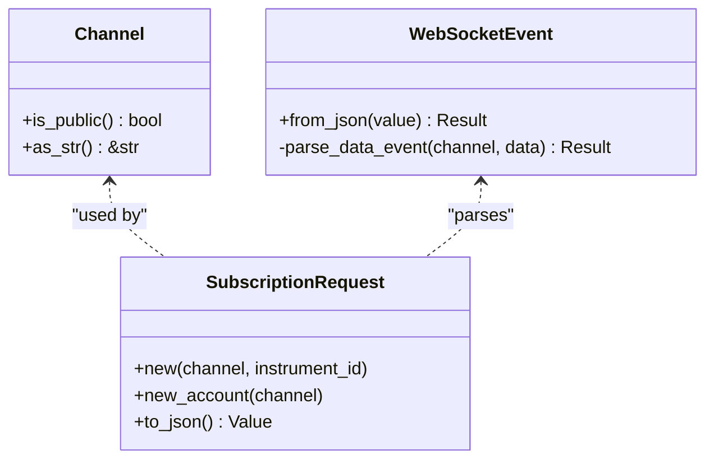

**Diagram sources**
- [websocket_models.rs](file://crates/okx-client/src/models/websocket.rs#L12-L75)
- [websocket_models.rs](file://crates/okx-client/src/models/websocket.rs#L77-L114)
- [websocket_models.rs](file://crates/okx-client/src/models/websocket.rs#L126-L152)
- [websocket_models.rs](file://crates/okx-client/src/models/websocket.rs#L153-L265)

**Section sources**
- [websocket_models.rs](file://crates/okx-client/src/models/websocket.rs#L12-L75)
- [websocket_models.rs](file://crates/okx-client/src/models/websocket.rs#L77-L114)
- [websocket_models.rs](file://crates/okx-client/src/models/websocket.rs#L153-L265)

### Storage Backends
- TimescaleStorage: Provides async persistence for candles and ticks, with conflict handling and query helpers.
- RedisStorage: Offers caching for latest candles and prices with TTL.

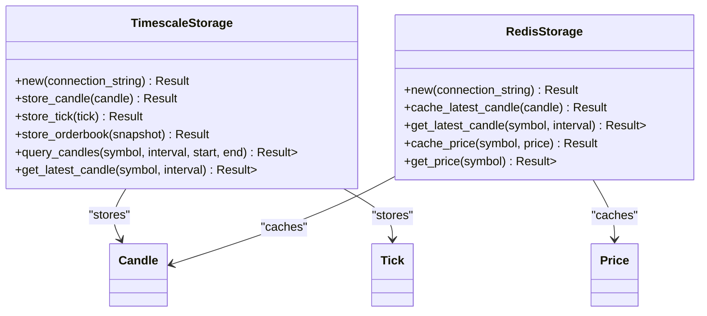

**Diagram sources**
- [storage.rs](file://crates/data/src/storage.rs#L69-L121)
- [storage.rs](file://crates/data/src/storage.rs#L122-L184)
- [storage.rs](file://crates/data/src/storage.rs#L267-L347)

**Section sources**
- [storage.rs](file://crates/data/src/storage.rs#L69-L121)
- [storage.rs](file://crates/data/src/storage.rs#L122-L184)
- [storage.rs](file://crates/data/src/storage.rs#L267-L347)

### Quality Control Pipeline
- Validates timestamps against current time with tolerance and staleness thresholds.
- Compares price changes against last known price per symbol.
- Uses a sliding window to compute Z-scores for anomaly detection.
- Tracks duplicates via a rolling set of message IDs.
- Updates last valid price after successful validation.

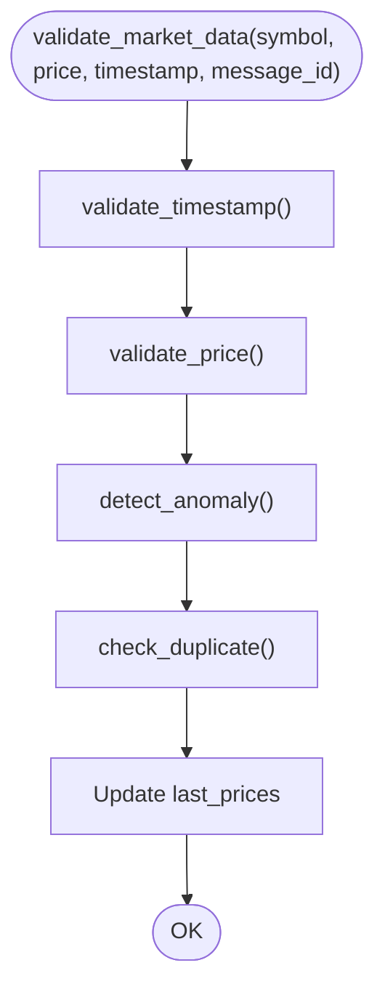

**Diagram sources**
- [quality.rs](file://crates/data/src/quality.rs#L105-L133)
- [quality.rs](file://crates/data/src/quality.rs#L135-L157)
- [quality.rs](file://crates/data/src/quality.rs#L159-L215)
- [quality.rs](file://crates/data/src/quality.rs#L217-L239)
- [quality.rs](file://crates/data/src/quality.rs#L241-L275)

**Section sources**
- [quality.rs](file://crates/data/src/quality.rs#L105-L215)
- [quality.rs](file://crates/data/src/quality.rs#L241-L275)

### Integration with OKX Client Library and Private Authentication
- Private channel authentication is performed by sending a signed login payload to the private WebSocket URL.
- The client signs a timestamp with the API secret and sends the signature along with credentials.
- Public and private channels are maintained on separate streams; subscriptions are partitioned accordingly.

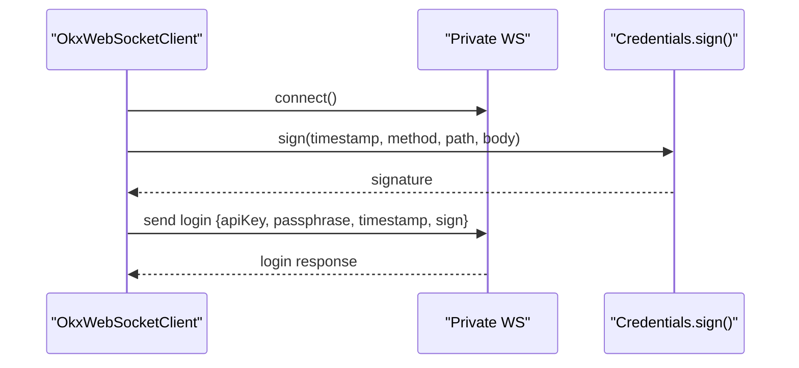

**Diagram sources**
- [websocket.rs](file://crates/okx-client/src/websocket.rs#L191-L211)
- [websocket.rs](file://crates/okx-client/src/websocket.rs#L224-L252)
- [auth.rs](file://crates/okx-client/src/auth.rs#L57-L84)

**Section sources**
- [websocket.rs](file://crates/okx-client/src/websocket.rs#L191-L211)
- [websocket.rs](file://crates/okx-client/src/websocket.rs#L224-L252)
- [auth.rs](file://crates/okx-client/src/auth.rs#L57-L84)

### Subscription Mechanisms and Supported Data Types
- Channels supported include tickers, candles (1m, 5m, 15m, 1h, 4h, 1d), trades, order books (top 5 and 50 levels, level 2 tick-by-tick), and private account/positions/orders channels.
- SubscriptionRequest serializes to the required JSON with channel and instrument ID fields.
- The collector subscribes to all combinations of symbols and channels during initialization.

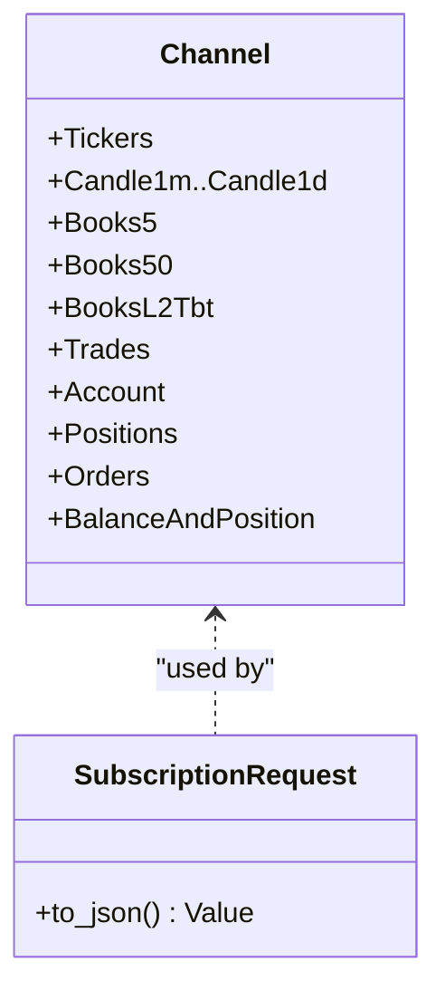

**Diagram sources**
- [websocket_models.rs](file://crates/okx-client/src/models/websocket.rs#L12-L75)
- [websocket_models.rs](file://crates/okx-client/src/models/websocket.rs#L77-L114)
- [collector.rs](file://crates/data/src/collector.rs#L92-L103)

**Section sources**
- [websocket_models.rs](file://crates/okx-client/src/models/websocket.rs#L12-L75)
- [websocket_models.rs](file://crates/okx-client/src/models/websocket.rs#L77-L114)
- [collector.rs](file://crates/data/src/collector.rs#L92-L103)

### Message Parsing Pipeline
- Incoming WebSocket messages are parsed into WebSocketEvent variants.
- Data events are routed by channel type to the appropriate domain model (TickerData, CandleData, TradeData, etc.).
- The collector’s process_event delegates to specialized handlers for each event type.

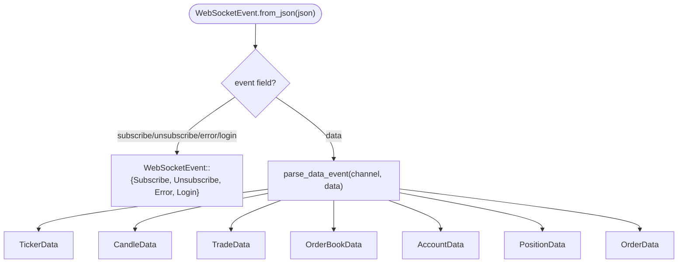

**Diagram sources**
- [websocket_models.rs](file://crates/okx-client/src/models/websocket.rs#L153-L265)
- [websocket_models.rs](file://crates/okx-client/src/models/websocket.rs#L267-L543)

**Section sources**
- [websocket_models.rs](file://crates/okx-client/src/models/websocket.rs#L153-L265)
- [websocket_models.rs](file://crates/okx-client/src/models/websocket.rs#L267-L543)
- [collector.rs](file://crates/data/src/collector.rs#L172-L196)

### Connection Handling, Reconnection, and Heartbeat
- Heartbeat: Periodic ping messages are sent to both public and private channels; pong responses update the last pong timestamp.
- Timeout detection: If no pong is received within the configured timeout, the client transitions to a reconnecting state.
- The example demonstrates configuring heartbeat and timeout parameters.

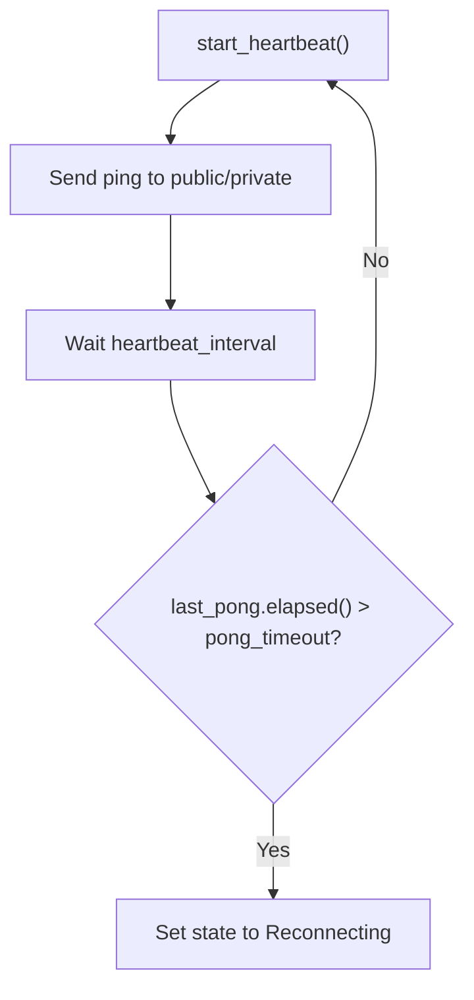

**Diagram sources**
- [websocket.rs](file://crates/okx-client/src/websocket.rs#L376-L418)
- [websocket.rs](file://crates/okx-client/src/websocket.rs#L493-L513)
- [websocket_ticker.rs](file://examples/websocket_ticker.rs#L46-L53)

**Section sources**
- [websocket.rs](file://crates/okx-client/src/websocket.rs#L376-L418)
- [websocket.rs](file://crates/okx-client/src/websocket.rs#L493-L513)
- [websocket_ticker.rs](file://examples/websocket_ticker.rs#L46-L53)

### Practical Usage and Examples
- The example demonstrates connecting to OKX WebSocket, subscribing to tickers and candles, and processing messages until a limit is reached.
- It shows how to configure the client with custom heartbeat and timeout settings.

**Section sources**
- [websocket_ticker.rs](file://examples/websocket_ticker.rs#L1-L149)

## Dependency Analysis
- MarketDataCollector depends on OkxWebSocketClient, WebSocketEvent, and domain types (Symbol, Price, Quantity).
- OkxWebSocketClient depends on Credentials for authentication and WebSocketEvent for message parsing.
- Storage backends depend on core types for typed values and SQLX/Redis clients.
- QualityControl depends on core types and maintains internal state for anomaly detection and deduplication.

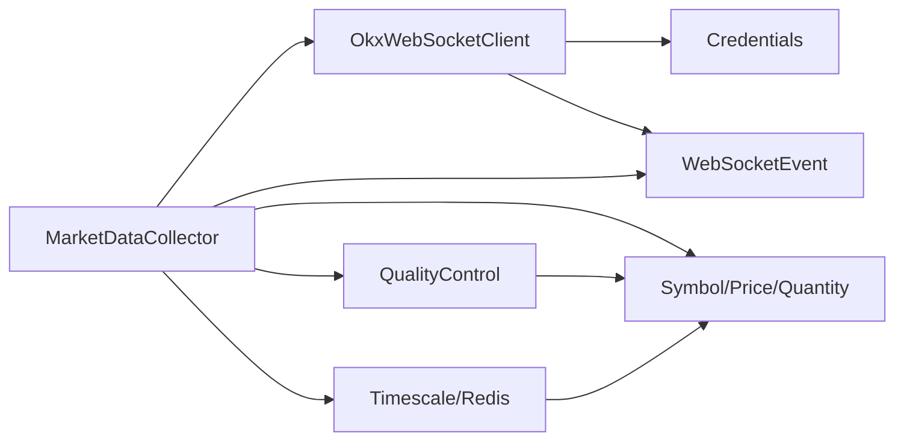

**Diagram sources**
- [collector.rs](file://crates/data/src/collector.rs#L51-L125)
- [websocket.rs](file://crates/okx-client/src/websocket.rs#L112-L170)
- [websocket_models.rs](file://crates/okx-client/src/models/websocket.rs#L126-L152)
- [auth.rs](file://crates/okx-client/src/auth.rs#L12-L20)
- [storage.rs](file://crates/data/src/storage.rs#L69-L121)
- [quality.rs](file://crates/data/src/quality.rs#L58-L105)
- [types.rs](file://crates/core/src/types.rs#L13-L179)

**Section sources**
- [collector.rs](file://crates/data/src/collector.rs#L51-L125)
- [websocket.rs](file://crates/okx-client/src/websocket.rs#L112-L170)
- [websocket_models.rs](file://crates/okx-client/src/models/websocket.rs#L126-L152)
- [auth.rs](file://crates/okx-client/src/auth.rs#L12-L20)
- [storage.rs](file://crates/data/src/storage.rs#L69-L121)
- [quality.rs](file://crates/data/src/quality.rs#L58-L105)
- [types.rs](file://crates/core/src/types.rs#L13-L179)

## Performance Considerations
- Message throughput: The collector processes messages in a loop with select handling; ensure storage operations are efficient and consider batching where appropriate.
- Quality control overhead: Timestamp validation, price comparisons, and anomaly detection add CPU overhead; tune thresholds and window sizes to balance accuracy and performance.
- Storage latency: TimescaleDB writes and Redis caching introduce network latency; monitor and adjust connection pools and cache TTLs.
- Concurrency: The WebSocket client uses separate tasks for public and private streams and message processing; keep subscriptions minimal to reduce bandwidth and parsing costs.

[No sources needed since this section provides general guidance]

## Troubleshooting Guide
Common issues and resolutions:
- Connection failures:
  - Verify credentials and testnet flag; ensure correct URLs for public/private/testnet.
  - Check network connectivity and firewall rules.
- Authentication failures:
  - Confirm API key, secret, and passphrase are correct and not expired.
  - Ensure the signing process produces a valid signature and that the timestamp is current.
- Timeouts and heartbeats:
  - Adjust heartbeat interval and pong timeout to match network conditions.
  - Monitor logs for “pong timeout exceeded” and “connection may be dead.”
- Rate limiting:
  - Reduce subscription count or intervals; spread subscriptions across multiple connections if necessary.
  - Respect exchange rate limits by throttling new subscriptions and avoiding excessive reconnections.
- Data quality rejections:
  - Review QualityConfig thresholds; adjust max price deviation and anomaly detection parameters.
  - Investigate duplicate message IDs and stale data timestamps.
- Multi-symbol synchronization:
  - Ensure each symbol is subscribed to desired channels; verify symbol formatting and case.
  - Use quality control to detect gaps and anomalies across symbols.

**Section sources**
- [websocket.rs](file://crates/okx-client/src/websocket.rs#L376-L418)
- [websocket.rs](file://crates/okx-client/src/websocket.rs#L493-L513)
- [quality.rs](file://crates/data/src/quality.rs#L105-L133)
- [quality.rs](file://crates/data/src/quality.rs#L135-L157)
- [quality.rs](file://crates/data/src/quality.rs#L159-L215)
- [error.rs](file://crates/data/src/error.rs#L1-L45)

## Conclusion
The data collection sub-component provides a robust, modular pipeline for ingesting real-time market data from OKX. It separates concerns between connection management, message parsing, quality control, and storage, enabling extensibility and reliability. By leveraging the OKX client’s authentication and heartbeat mechanisms, and applying configurable quality checks, the system delivers clean, synchronized market data suitable for downstream analytics and trading strategies.