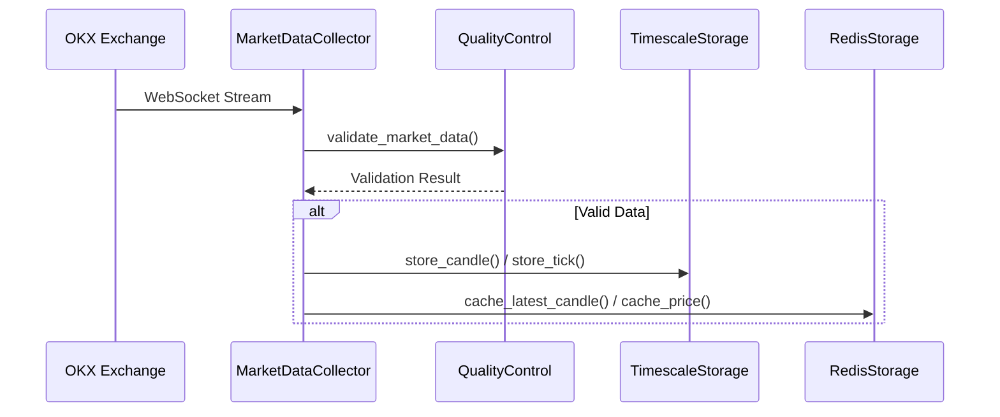
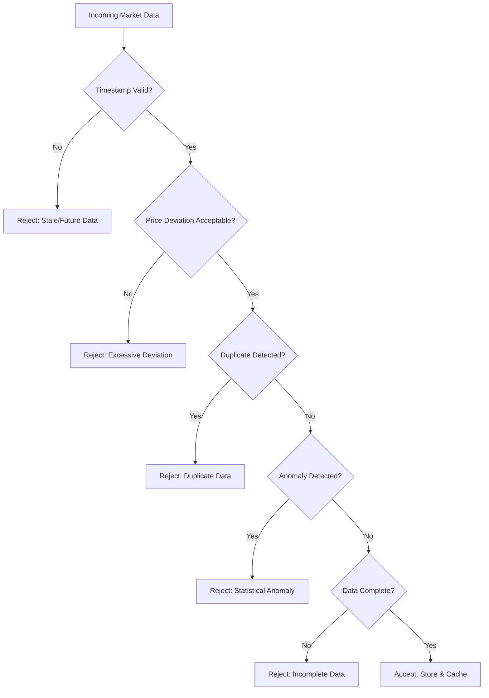
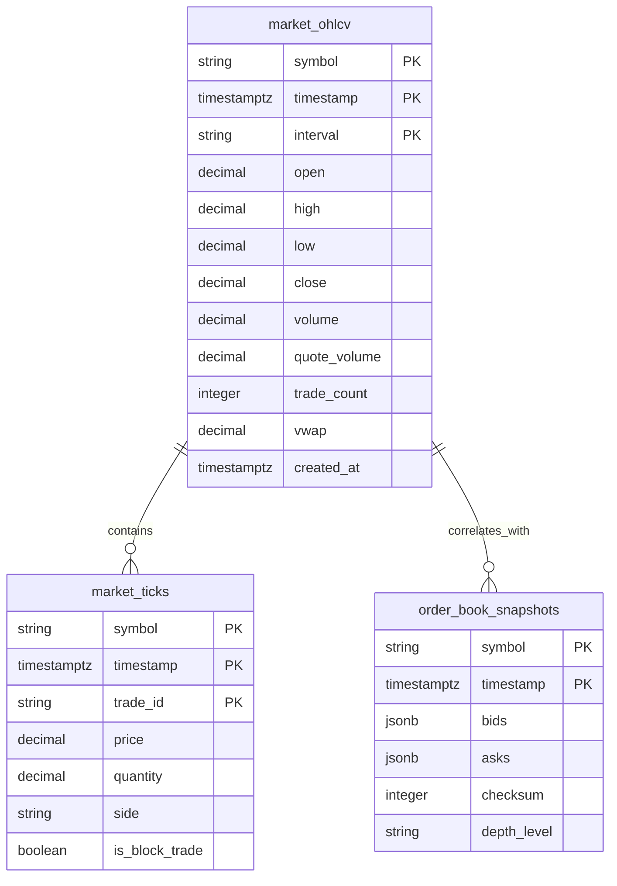
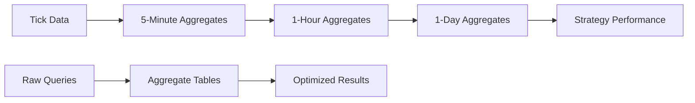
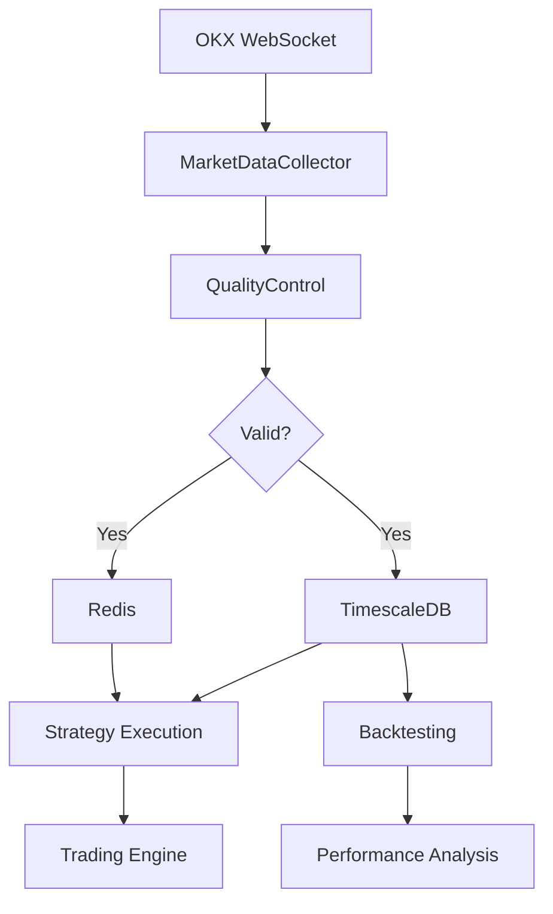

# Data Layer

<cite>
**Referenced Files in This Document**   
- [collector.rs](file://crates/data/src/collector.rs)
- [quality.rs](file://crates/data/src/quality.rs)
- [storage.rs](file://crates/data/src/storage.rs)
- [001_initial_schema.sql](file://migrations/001_initial_schema.sql)
- [002_continuous_aggregates.sql](file://migrations/002_continuous_aggregates.sql)
- [websocket.rs](file://crates/okx-client/src/websocket.rs)
- [engine.rs](file://crates/backtest/src/engine.rs)
- [lib.rs](file://crates/data/src/lib.rs)
</cite>

## Table of Contents
1. [Introduction](#introduction)
2. [Market Data Collector](#market-data-collector)
3. [Five-Layer Quality Control Pipeline](#five-layer-quality-control-pipeline)
4. [Storage Implementation](#storage-implementation)
5. [Data Access Patterns and Query Optimization](#data-access-patterns-and-query-optimization)
6. [Data Retention and Aggregation](#data-retention-and-aggregation)
7. [Data Layer Integration with Strategy Execution and Backtesting](#data-layer-integration-with-strategy-execution-and-backtesting)
8. [Data Flow Example](#data-flow-example)
9. [Conclusion](#conclusion)

## Introduction
The data layer of the EA OKX Quantitative Trading System is responsible for ingesting, validating, storing, and serving real-time market data from the OKX exchange. This documentation provides a comprehensive overview of the architecture, focusing on the market data collector, the five-layer quality control pipeline, storage implementation using TimescaleDB and Redis, data access patterns, retention policies, and its role in supporting strategy execution and backtesting.

**Section sources**
- [lib.rs](file://crates/data/src/lib.rs#L1-L22)

## Market Data Collector
The MarketDataCollector is the primary component responsible for ingesting real-time market data from the OKX WebSocket API. It establishes connections to both public and private WebSocket endpoints, subscribes to specified channels (such as tickers, candles, and trades), and processes incoming messages. The collector is configured to handle multiple symbols and channels simultaneously, ensuring comprehensive data coverage.

The collector's responsibilities include:
- Establishing and maintaining WebSocket connections with automatic reconnection capabilities
- Managing subscriptions to various market data channels
- Processing incoming WebSocket events (tickers, candles, trades)
- Applying quality control checks before data storage
- Storing validated data in TimescaleDB and caching key metrics in Redis

The collector operates as an event-driven system, continuously polling for new messages and processing them through the quality control and storage pipelines.

**Diagram sources**
- [collector.rs](file://crates/data/src/collector.rs#L51-L341)
- [websocket.rs](file://crates/okx-client/src/websocket.rs#L112-L564)

**Section sources**
- [collector.rs](file://crates/data/src/collector.rs#L1-L361)

## Five-Layer Quality Control Pipeline
The data layer implements a comprehensive five-layer quality control pipeline to ensure data integrity and reliability. This pipeline validates incoming market data through a series of checks that address timestamp consistency, price deviation, duplicate detection, anomaly filtering, and data completeness.

### 1. Timestamp Consistency Validation
The first layer validates the temporal integrity of incoming data by checking for stale or future timestamps. Data is rejected if it exceeds the maximum allowed age (configurable, default 5 seconds) or if it is projected too far into the future (with a configurable tolerance, default 1 second). This ensures that the system operates on timely and chronologically consistent data.

### 2. Price Deviation Validation
The second layer checks for excessive price deviations from the last known valid price. Using a configurable percentage threshold (default 10%), this validation prevents erroneous price spikes or drops from contaminating the dataset. The system maintains a record of the last valid price for each symbol to serve as a reference point for deviation calculations.

### 3. Duplicate Detection
The third layer implements duplicate detection by maintaining a sliding window of recently processed message IDs. Before accepting new data, the system checks whether the message ID already exists in this window. If a duplicate is detected, the data is rejected to prevent double-counting and ensure data uniqueness.

### 4. Anomaly Filtering
The fourth layer employs statistical anomaly detection using Z-score analysis. For each symbol, the system maintains a rolling window of price history and calculates the mean and standard deviation. When new data arrives, it computes the Z-score (number of standard deviations from the mean) and rejects data that exceeds a configurable threshold (default 3.0). This helps identify and filter out statistical outliers that may indicate data corruption or market manipulation.

### 5. Data Completeness Validation
The fifth layer ensures that all required fields are present and valid in incoming data. This includes checking for missing values, invalid formats, and out-of-range values. The system validates that essential fields such as price, volume, and timestamp are properly formatted and within reasonable bounds.

**Diagram sources**
- [quality.rs](file://crates/data/src/quality.rs#L58-L285)
- [collector.rs](file://crates/data/src/collector.rs#L209-L216)

**Section sources**
- [quality.rs](file://crates/data/src/quality.rs#L1-L373)

## Storage Implementation
The data layer uses a dual-storage architecture combining TimescaleDB for persistent time-series storage and Redis for high-speed caching.

### TimescaleDB Hypertables
The system implements three primary hypertables for different types of market data:

1. **market_ohlcv**: Stores OHLCV (Open, High, Low, Close, Volume) candle data with configurable intervals (1m, 5m, 15m, 1h, 4h, 1d). This hypertable is partitioned by time with 7-day chunks and includes compression policies after 30 days and retention policies for 5 years.

2. **market_ticks**: Stores individual trade tick data with millisecond precision. This hypertable uses 1-day chunks with compression after 7 days and retention for 90 days.

3. **order_book_snapshots**: Stores periodic order book snapshots with configurable depth levels. This hypertable uses 1-day chunks with compression after 3 days and retention for 7 days.

### Redis Caching
Redis is used to cache frequently accessed data to reduce database load and improve response times. The system caches:
- Latest candle data for each symbol and interval (1-hour expiry)
- Latest price for each symbol (1-minute expiry)
- Key market metrics and indicators

**Diagram sources**
- [storage.rs](file://crates/data/src/storage.rs#L68-L347)
- [001_initial_schema.sql](file://migrations/001_initial_schema.sql#L52-L118)

**Section sources**
- [storage.rs](file://crates/data/src/storage.rs#L1-L393)
- [001_initial_schema.sql](file://migrations/001_initial_schema.sql#L1-L273)

## Data Access Patterns and Query Optimization
The data layer implements optimized access patterns and query strategies to support efficient data retrieval for trading strategies and analytics.

### Query Patterns
The system supports several key query patterns:
- Time-range queries for historical data analysis
- Latest value queries for real-time decision making
- Aggregation queries for performance reporting
- Correlation queries for multi-symbol analysis

### Indexing Strategy
The database employs a comprehensive indexing strategy to optimize query performance:
- Composite indexes on symbol and timestamp for time-series queries
- Partial indexes on active strategies and positions
- GIN indexes on JSONB columns for flexible parameter queries
- Unique constraints on critical fields to ensure data integrity

### Continuous Aggregates
The system implements a hierarchy of continuous aggregates to optimize performance:
- 5-minute OHLCV aggregates from tick data
- 1-hour OHLCV aggregates from 5-minute data
- 1-day OHLCV aggregates from 1-hour data
- Daily strategy performance aggregates from trade data

These aggregates are automatically refreshed according to configurable policies, ensuring up-to-date summary data while reducing the computational cost of real-time aggregations.

**Diagram sources**
- [002_continuous_aggregates.sql](file://migrations/002_continuous_aggregates.sql#L1-L105)
- [storage.rs](file://crates/data/src/storage.rs#L185-L264)

**Section sources**
- [002_continuous_aggregates.sql](file://migrations/002_continuous_aggregates.sql#L1-L105)

## Data Retention and Aggregation Mechanisms
The data layer implements comprehensive retention and aggregation policies to balance storage costs with analytical requirements.

### Retention Policies
The system employs tiered retention policies based on data granularity and importance:
- Tick data: 90 days retention with 7-day compression
- 1-minute candles: 5 years retention with 30-day compression
- Order book snapshots: 7 days retention with 3-day compression
- System metrics: 180 days retention with 14-day compression

These policies ensure that high-frequency data is retained for shorter periods while preserving longer-term historical data at lower granularities.

### Aggregation Mechanisms
The system implements a multi-level aggregation hierarchy:
1. **Real-time aggregation**: Incoming tick data is aggregated into 1-minute candles in real-time
2. **Scheduled aggregation**: Continuous aggregates generate higher-interval candles (5m, 1h, 1d) on scheduled intervals
3. **On-demand aggregation**: Complex aggregations for strategy performance and risk metrics are computed as needed

The aggregation system uses TimescaleDB's continuous aggregate feature with configurable refresh policies to ensure data freshness while minimizing computational overhead.

**Section sources**
- [001_initial_schema.sql](file://migrations/001_initial_schema.sql#L76-L80)
- [002_continuous_aggregates.sql](file://migrations/002_continuous_aggregates.sql#L1-L105)

## Data Layer Integration with Strategy Execution and Backtesting
The data layer serves as the foundation for both real-time strategy execution and historical backtesting.

### Strategy Execution
For real-time trading, the data layer provides:
- Low-latency market data feeds through WebSocket connections
- High-availability caching via Redis for critical metrics
- Reliable persistence through TimescaleDB for audit and analysis
- Quality-controlled data to prevent erroneous trading decisions

Strategies subscribe to market data events through the data layer, which delivers validated and enriched data in a consistent format.

### Backtesting Framework
For historical analysis, the data layer supports backtesting through:
- Comprehensive historical data storage with multiple time intervals
- Efficient time-range queries for loading historical datasets
- Mock data source interface for testing without live connections
- Integration with the backtesting engine for realistic simulation

The backtesting system can load historical candle data and simulate market conditions, allowing strategies to be tested against past market behavior.

**Diagram sources**
- [engine.rs](file://crates/backtest/src/engine.rs#L31-L41)
- [collector.rs](file://crates/data/src/collector.rs#L51-L341)

**Section sources**
- [engine.rs](file://crates/backtest/src/engine.rs#L1-L585)
- [backtest_simple.rs](file://examples/backtest_simple.rs#L1-L248)

## Data Flow Example
The following example illustrates the complete data flow from ingestion to consumption:

1. **Ingestion**: The MarketDataCollector connects to OKX WebSocket and subscribes to tick, candle, and trade channels for BTC-USDT and other configured symbols.

2. **Quality Control**: Incoming data passes through the five-layer quality control pipeline, where it is validated for timestamp consistency, price deviation, duplicates, anomalies, and completeness.

3. **Storage**: Validated data is stored in TimescaleDB hypertables (market_ticks, market_ohlcv) and key metrics are cached in Redis.

4. **Aggregation**: Continuous aggregates automatically generate higher-interval candles (5m, 1h, 1d) from the raw data.

5. **Consumption**: Trading strategies access the data through the data layer API, receiving either real-time streams or historical datasets for analysis and decision making.

This end-to-end flow ensures that high-quality, reliable data is available for both real-time trading decisions and historical analysis.

**Section sources**
- [collector.rs](file://crates/data/src/collector.rs#L127-L169)
- [quality.rs](file://crates/data/src/quality.rs#L242-L273)
- [storage.rs](file://crates/data/src/storage.rs#L85-L143)