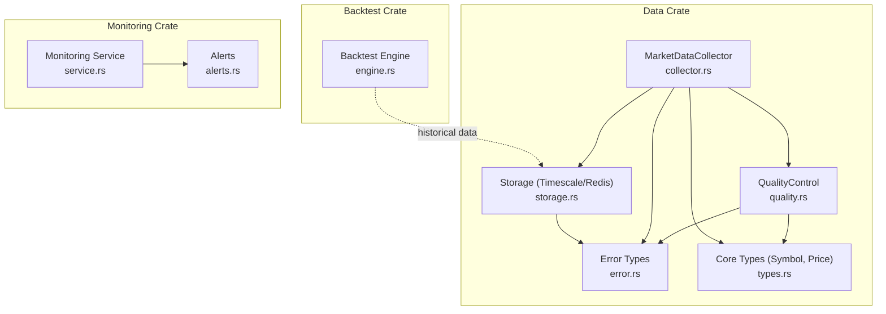
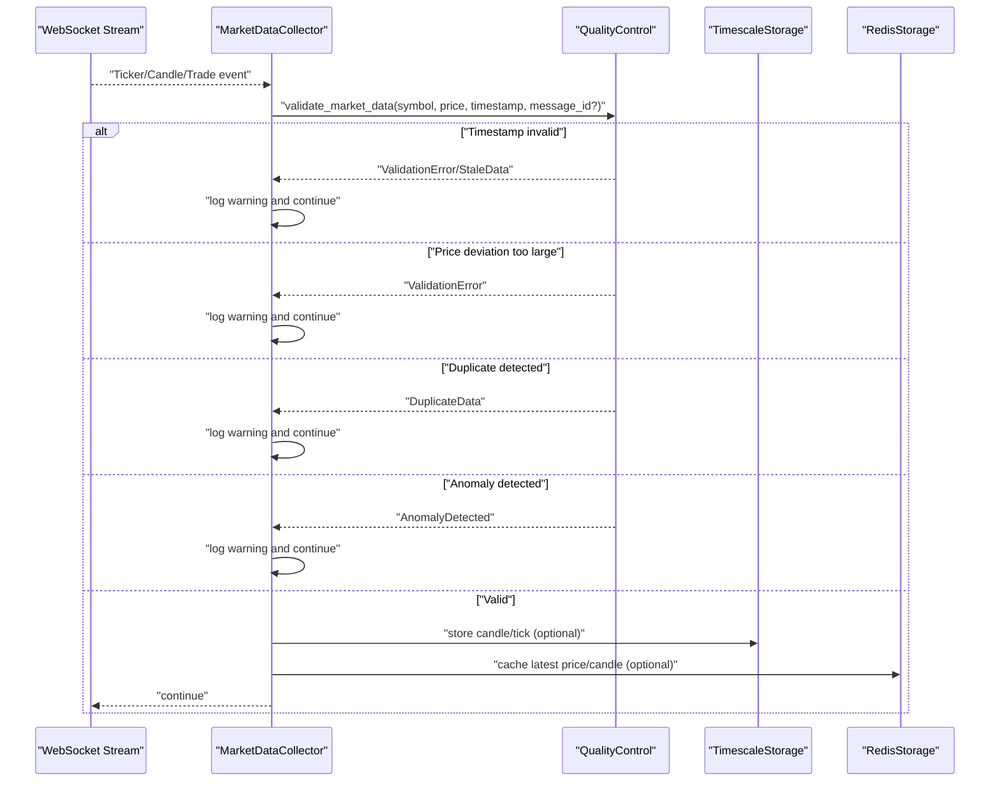
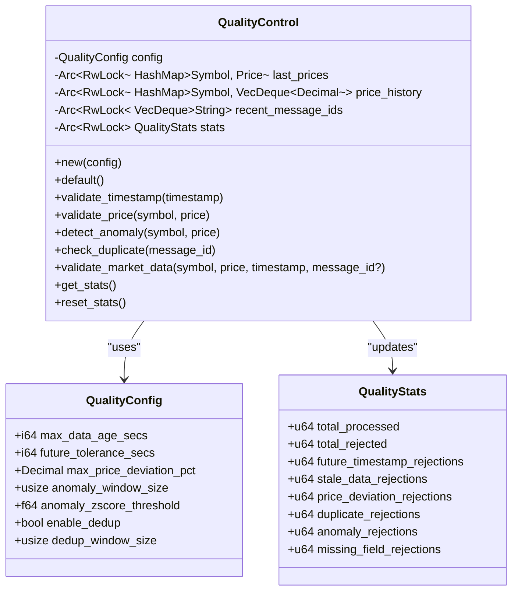
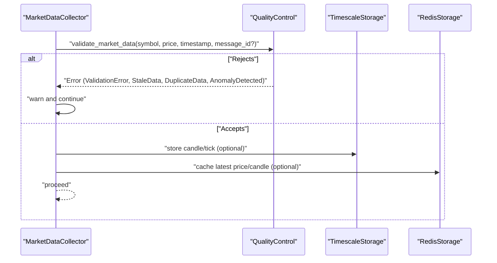
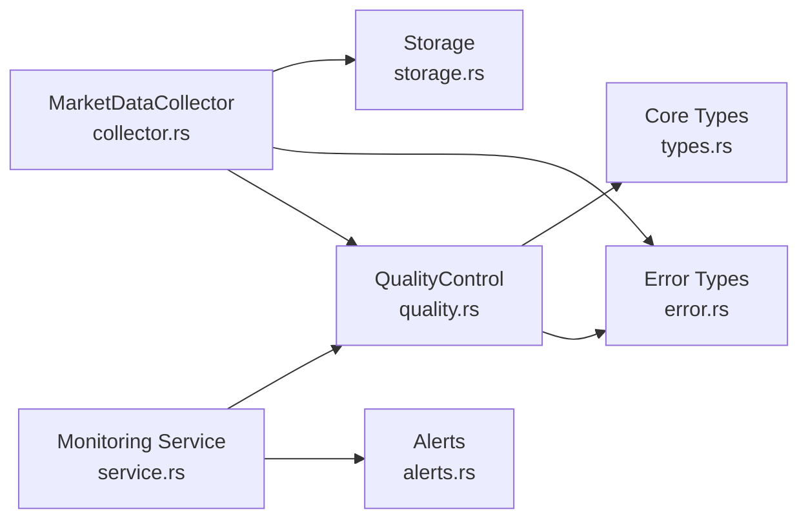

# Data Quality Control

<cite>
**Referenced Files in This Document**
- [quality.rs](file://crates/data/src/quality.rs)
- [collector.rs](file://crates/data/src/collector.rs)
- [storage.rs](file://crates/data/src/storage.rs)
- [error.rs](file://crates/data/src/error.rs)
- [types.rs](file://crates/core/src/types.rs)
- [engine.rs](file://crates/backtest/src/engine.rs)
- [service.rs](file://crates/monitoring/src/service.rs)
- [alerts.rs](file://crates/monitoring/src/alerts.rs)
- [PROJECT_SUMMARY.md](file://PROJECT_SUMMARY.md)
</cite>

## Table of Contents
1. [Introduction](#introduction)
2. [Project Structure](#project-structure)
3. [Core Components](#core-components)
4. [Architecture Overview](#architecture-overview)
5. [Detailed Component Analysis](#detailed-component-analysis)
6. [Dependency Analysis](#dependency-analysis)
7. [Performance Considerations](#performance-considerations)
8. [Troubleshooting Guide](#troubleshooting-guide)
9. [Conclusion](#conclusion)
10. [Appendices](#appendices)

## Introduction
This document explains the data quality control sub-component that ensures data integrity across the system. It details the five-layer validation pipeline:
1) Timestamp consistency checking for monotonic progression
2) Price deviation detection using configurable thresholds
3) Duplicate message filtering based on sequence numbers
4) Anomaly detection for outliers and spikes
5) Data completeness verification

It also documents the QualityControl service, its integration with the data collection pipeline, configuration options for sensitivity tuning, logging and error handling, and the impact on downstream components such as strategy execution and backtesting. Finally, it addresses performance considerations for high-frequency data streams.

## Project Structure
The data quality control lives in the data crate and integrates with the collector, storage, and core types. Monitoring and alerts provide operational insights.

**Diagram sources**
- [quality.rs](file://crates/data/src/quality.rs#L1-L120)
- [collector.rs](file://crates/data/src/collector.rs#L51-L120)
- [storage.rs](file://crates/data/src/storage.rs#L1-L120)
- [error.rs](file://crates/data/src/error.rs#L1-L42)
- [types.rs](file://crates/core/src/types.rs#L1-L120)
- [engine.rs](file://crates/backtest/src/engine.rs#L1-L120)
- [service.rs](file://crates/monitoring/src/service.rs#L1-L120)
- [alerts.rs](file://crates/monitoring/src/alerts.rs#L1-L120)

**Section sources**
- [quality.rs](file://crates/data/src/quality.rs#L1-L120)
- [collector.rs](file://crates/data/src/collector.rs#L51-L120)
- [storage.rs](file://crates/data/src/storage.rs#L1-L120)
- [error.rs](file://crates/data/src/error.rs#L1-L42)
- [types.rs](file://crates/core/src/types.rs#L1-L120)
- [engine.rs](file://crates/backtest/src/engine.rs#L1-L120)
- [service.rs](file://crates/monitoring/src/service.rs#L1-L120)
- [alerts.rs](file://crates/monitoring/src/alerts.rs#L1-L120)

## Core Components
- QualityControl: Implements the five-layer validation pipeline and maintains statistics.
- MarketDataCollector: Applies QualityControl during ingestion and persists clean data.
- Storage: Provides TimescaleDB and Redis persistence for candles and ticks.
- Core Types: Defines Symbol and Price used throughout validation and storage.
- Error Types: Standardizes validation, duplicate, stale, anomaly, and other errors.
- Monitoring and Alerts: Provide operational visibility into quality control performance.

**Section sources**
- [quality.rs](file://crates/data/src/quality.rs#L88-L120)
- [collector.rs](file://crates/data/src/collector.rs#L172-L341)
- [storage.rs](file://crates/data/src/storage.rs#L1-L120)
- [types.rs](file://crates/core/src/types.rs#L12-L120)
- [error.rs](file://crates/data/src/error.rs#L1-L42)
- [service.rs](file://crates/monitoring/src/service.rs#L1-L120)
- [alerts.rs](file://crates/monitoring/src/alerts.rs#L1-L120)

## Architecture Overview
The data collection pipeline integrates QualityControl at runtime. On each incoming message, the collector validates timestamp, price deviation, deduplicates (when applicable), and logs anomalies without rejecting the message. Clean data is stored to TimescaleDB and/or cached in Redis. Downstream consumers (live trading and backtesting) rely on the integrity of validated data.

**Diagram sources**
- [collector.rs](file://crates/data/src/collector.rs#L172-L341)
- [quality.rs](file://crates/data/src/quality.rs#L105-L236)
- [storage.rs](file://crates/data/src/storage.rs#L85-L144)

## Detailed Component Analysis

### QualityControl Service
QualityControl encapsulates:
- Configuration: max age, future tolerance, price deviation threshold, anomaly window and z-score threshold, dedup toggle and window.
- State: last valid prices per symbol, price history per symbol, recent message IDs, and statistics counters.
- Validation pipeline: timestamp, price deviation, anomaly detection, duplicate detection, and update of last valid price.

**Diagram sources**
- [quality.rs](file://crates/data/src/quality.rs#L19-L86)
- [quality.rs](file://crates/data/src/quality.rs#L88-L120)
- [quality.rs](file://crates/data/src/quality.rs#L105-L236)
- [quality.rs](file://crates/data/src/quality.rs#L238-L296)

Key behaviors:
- Timestamp validation rejects future timestamps beyond tolerance and stale data older than max age.
- Price deviation validation compares current price to last valid price for the same symbol using a percentage threshold.
- Anomaly detection computes mean and standard deviation over a sliding window and flags outliers via Z-score.
- Duplicate detection maintains a bounded set of recent message IDs and rejects duplicates.
- Anomaly detection does not reject on failure; it logs a warning and continues, preserving throughput for high-frequency streams.

**Section sources**
- [quality.rs](file://crates/data/src/quality.rs#L105-L236)
- [quality.rs](file://crates/data/src/quality.rs#L238-L296)

### Integration with MarketDataCollector
MarketDataCollector initializes QualityControl and applies it to each incoming message:
- Ticker: Validates timestamp and price; logs warnings on QC failures; proceeds without storing.
- Candle: Skips unconfirmed candles; validates timestamp and price; stores confirmed candles to TimescaleDB.
- Trade: Validates timestamp, price, and deduplicates using trade_id; stores ticks to TimescaleDB.

**Diagram sources**
- [collector.rs](file://crates/data/src/collector.rs#L172-L341)
- [quality.rs](file://crates/data/src/quality.rs#L105-L236)

**Section sources**
- [collector.rs](file://crates/data/src/collector.rs#L172-L341)

### Data Completeness Verification
The current implementation focuses on timestamp, price deviation, duplication, and anomaly detection. There is no explicit “missing field” validation in the provided code. If completeness checks are required, they can be added to the validation pipeline by extending the validation stages and adding appropriate fields to the data structures.

**Section sources**
- [quality.rs](file://crates/data/src/quality.rs#L1-L20)
- [quality.rs](file://crates/data/src/quality.rs#L238-L296)

### Impact on Downstream Components
- Strategy execution: The collector logs QC failures but does not propagate them to strategies. This preserves strategy responsiveness under noisy feeds. Strategies receive clean, validated data from storage backends.
- Backtesting: Historical data is persisted to TimescaleDB. Backtest engines query clean candles from storage, unaffected by real-time QC rejections. The backtest engine’s internal data structures and mock storage are separate from real-time QC.

**Section sources**
- [collector.rs](file://crates/data/src/collector.rs#L172-L341)
- [engine.rs](file://crates/backtest/src/engine.rs#L1-L120)
- [storage.rs](file://crates/data/src/storage.rs#L85-L144)

## Dependency Analysis
QualityControl depends on core types for Symbol and Price, and uses error types for standardized reporting. MarketDataCollector composes QualityControl and storage backends. Monitoring and alerts provide operational feedback.

**Diagram sources**
- [quality.rs](file://crates/data/src/quality.rs#L1-L42)
- [collector.rs](file://crates/data/src/collector.rs#L51-L120)
- [storage.rs](file://crates/data/src/storage.rs#L1-L120)
- [error.rs](file://crates/data/src/error.rs#L1-L42)
- [types.rs](file://crates/core/src/types.rs#L1-L120)
- [service.rs](file://crates/monitoring/src/service.rs#L1-L120)
- [alerts.rs](file://crates/monitoring/src/alerts.rs#L1-L120)

**Section sources**
- [quality.rs](file://crates/data/src/quality.rs#L1-L42)
- [collector.rs](file://crates/data/src/collector.rs#L51-L120)
- [storage.rs](file://crates/data/src/storage.rs#L1-L120)
- [error.rs](file://crates/data/src/error.rs#L1-L42)
- [types.rs](file://crates/core/src/types.rs#L1-L120)
- [service.rs](file://crates/monitoring/src/service.rs#L1-L120)
- [alerts.rs](file://crates/monitoring/src/alerts.rs#L1-L120)

## Performance Considerations
- Latency targets indicate sub-millisecond validation latency for real-time streams.
- Anomaly detection uses a sliding window; tune anomaly_window_size to balance sensitivity vs. memory usage.
- Deduplication maintains a bounded queue; tune dedup_window_size to match expected message rates.
- Timestamp and price deviation checks are O(1) per message; anomaly detection is O(n) over the window.
- For high-frequency data, consider batching storage writes and minimizing contention on shared state.

[No sources needed since this section provides general guidance]

## Troubleshooting Guide
Common scenarios and handling:
- Future timestamp detected: Adjust future_tolerance_secs or synchronize clocks.
- Stale data rejected: Increase max_data_age_secs or investigate upstream delays.
- Price deviation too large: Reduce max_price_deviation_pct or investigate feed quality.
- Duplicate message detected: Verify message_id uniqueness and adjust dedup_window_size.
- Anomaly detected: Review anomaly_zscore_threshold and anomaly_window_size; consider feed calibration.

Operational visibility:
- Use MonitoringService and AlertRule to define thresholds for quality metrics (e.g., rejection rates).
- Acknowledge alerts to prevent repeated notifications.

**Section sources**
- [quality.rs](file://crates/data/src/quality.rs#L105-L236)
- [error.rs](file://crates/data/src/error.rs#L1-L42)
- [service.rs](file://crates/monitoring/src/service.rs#L60-L120)
- [alerts.rs](file://crates/monitoring/src/alerts.rs#L1-L120)

## Conclusion
The five-layer validation pipeline in QualityControl provides robust data integrity for real-time feeds. By separating QC from downstream strategy logic and persisting only validated data, the system maintains reliability and performance. Operators can tune sensitivity via configuration and monitor quality through alerts and statistics.

[No sources needed since this section summarizes without analyzing specific files]

## Appendices

### Configuration Options for Sensitivity Tuning
- max_data_age_secs: Maximum acceptable age of incoming data (seconds).
- future_tolerance_secs: Allowable future timestamp tolerance (seconds).
- max_price_deviation_pct: Maximum percentage change from last valid price.
- anomaly_window_size: Number of recent prices used to compute mean/stddev for Z-score.
- anomaly_zscore_threshold: Threshold for flagging outliers.
- enable_dedup: Toggle duplicate detection.
- dedup_window_size: Size of the recent message ID buffer.

**Section sources**
- [quality.rs](file://crates/data/src/quality.rs#L19-L86)

### Logging and Error Handling
- Errors are categorized and surfaced as ValidationError, StaleData, DuplicateData, AnomalyDetected, and others.
- Warnings are emitted for QC failures; the collector continues processing to preserve throughput.
- Statistics counters track total processed and rejections by category.

**Section sources**
- [error.rs](file://crates/data/src/error.rs#L1-L42)
- [collector.rs](file://crates/data/src/collector.rs#L172-L341)
- [quality.rs](file://crates/data/src/quality.rs#L238-L296)

### Impact on Strategy Execution and Backtesting
- Live trading: Collector logs QC failures but does not block strategy execution; strategies consume validated data from storage.
- Backtesting: Historical data is queried from TimescaleDB; QC rejections do not affect historical datasets.

**Section sources**
- [collector.rs](file://crates/data/src/collector.rs#L172-L341)
- [engine.rs](file://crates/backtest/src/engine.rs#L1-L120)
- [storage.rs](file://crates/data/src/storage.rs#L85-L144)

### Performance Targets
- Data quality validation latency target is less than 1 millisecond.
- System-wide reliability targets include data quality rate > 99.5%.

**Section sources**
- [PROJECT_SUMMARY.md](file://PROJECT_SUMMARY.md#L279-L304)