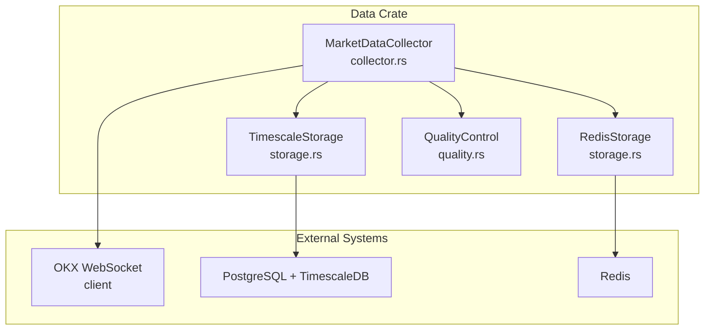
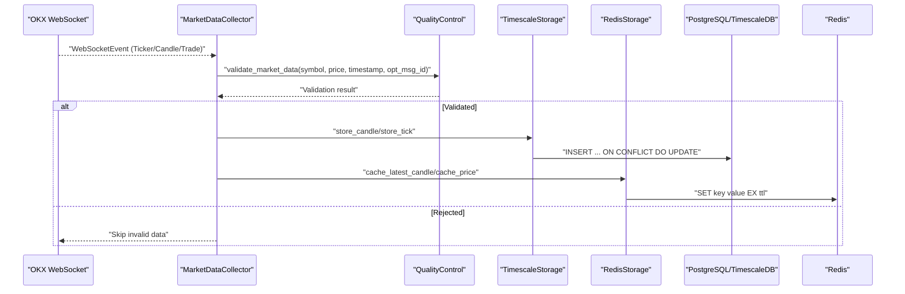
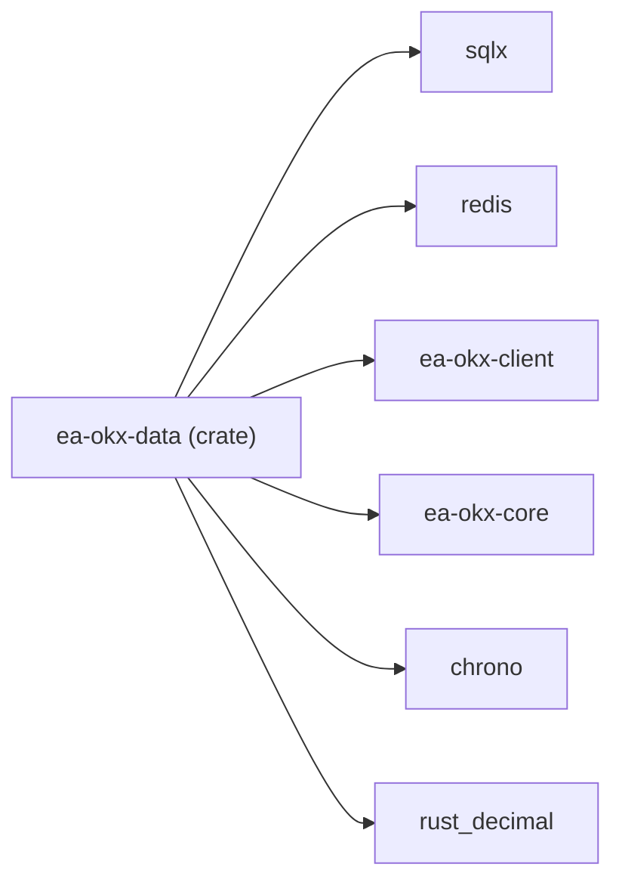
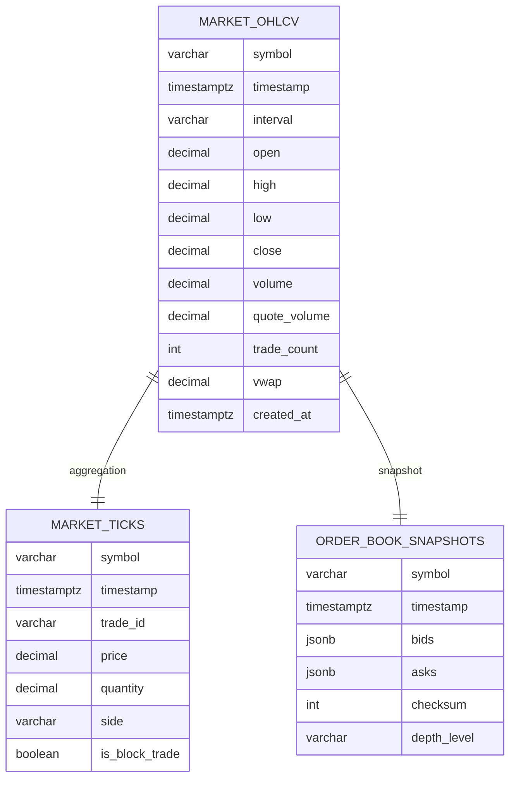
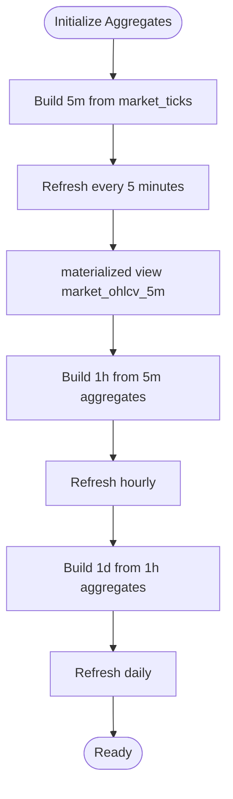

# Data Storage

<cite>
**Referenced Files in This Document**
- [storage.rs](file://crates/data/src/storage.rs)
- [collector.rs](file://crates/data/src/collector.rs)
- [quality.rs](file://crates/data/src/quality.rs)
- [error.rs](file://crates/data/src/error.rs)
- [Cargo.toml](file://crates/data/Cargo.toml)
- [001_initial_schema.sql](file://migrations/001_initial_schema.sql)
- [002_continuous_aggregates.sql](file://migrations/002_continuous_aggregates.sql)
- [README.md](file://config/README.md)
</cite>

## Table of Contents
1. [Introduction](#introduction)
2. [Project Structure](#project-structure)
3. [Core Components](#core-components)
4. [Architecture Overview](#architecture-overview)
5. [Detailed Component Analysis](#detailed-component-analysis)
6. [Dependency Analysis](#dependency-analysis)
7. [Performance Considerations](#performance-considerations)
8. [Troubleshooting Guide](#troubleshooting-guide)
9. [Conclusion](#conclusion)
10. [Appendices](#appendices)

## Introduction
This document explains the data storage sub-component responsible for ingesting, validating, persisting, and serving time-series market data. It covers:
- TimescaleDB hypertables for OHLCV, tick, and order book snapshots
- Continuous aggregates for efficient multi-interval summarization
- Redis caching for recent candles and prices
- Data access patterns, indexing strategies, retention and compression policies
- Integration with SQLx for type-safe Postgres operations and connection pooling configuration

## Project Structure
The data storage layer is implemented in the data crate and backed by TimescaleDB and Redis. The collector subscribes to OKX WebSocket feeds, validates data, and writes to both databases and caches.

**Diagram sources**
- [collector.rs](file://crates/data/src/collector.rs#L1-L120)
- [storage.rs](file://crates/data/src/storage.rs#L68-L120)
- [quality.rs](file://crates/data/src/quality.rs#L1-L80)

**Section sources**
- [collector.rs](file://crates/data/src/collector.rs#L1-L120)
- [storage.rs](file://crates/data/src/storage.rs#L68-L120)
- [quality.rs](file://crates/data/src/quality.rs#L1-L80)

## Core Components
- TimescaleStorage: Provides async operations to insert and query OHLCV candles, ticks, and order book snapshots using SQLx. It also exposes convenience methods to query candles by symbol/intervals and retrieve the latest candle.
- RedisStorage: Provides async operations to cache the latest candle per symbol/interval and the latest price per symbol, with short TTLs.
- MarketDataCollector: Orchestrates WebSocket ingestion, applies quality control, and persists validated data to TimescaleDB and Redis.
- QualityControl: Implements timestamp validation, price-range checks, anomaly detection via Z-score, and duplicate detection.

Key data models:
- Candle: OHLCV plus trade counts and VWAP
- Tick: Trade-level tick data
- OrderBookSnapshot: JSONB-encoded bids/asks with optional checksum and depth level

**Section sources**
- [storage.rs](file://crates/data/src/storage.rs#L1-L120)
- [storage.rs](file://crates/data/src/storage.rs#L121-L265)
- [storage.rs](file://crates/data/src/storage.rs#L267-L347)
- [collector.rs](file://crates/data/src/collector.rs#L1-L120)
- [quality.rs](file://crates/data/src/quality.rs#L1-L120)

## Architecture Overview
The system integrates real-time streaming with robust persistence and caching:

**Diagram sources**
- [collector.rs](file://crates/data/src/collector.rs#L172-L320)
- [quality.rs](file://crates/data/src/quality.rs#L241-L274)
- [storage.rs](file://crates/data/src/storage.rs#L82-L120)
- [storage.rs](file://crates/data/src/storage.rs#L279-L336)

## Detailed Component Analysis

### TimescaleDB Schema and Indexing
The initial schema defines three primary time-series tables and converts them into hypertables with compression and retention policies. Continuous aggregates are created for multi-interval OHLCV and daily strategy performance.

Tables and keys:
- market_ohlcv: composite primary key (symbol, interval, timestamp)
- market_ticks: composite primary key (symbol, timestamp, id)
- order_book_snapshots: composite primary key (symbol, timestamp, id)
- trades: UUID primary key
- positions: UUID primary key with unique constraint (strategy_id, symbol)

Indexes:
- market_ohlcv: index on (symbol, timestamp DESC)
- market_ticks: index on (symbol, timestamp DESC)
- trades: indexes on (strategy_id, created_at DESC), (symbol, created_at DESC), (status) filtered, (created_at DESC)
- positions: indexes on (strategy_id), (symbol)
- Additional GIN indexes on JSONB columns for strategies and system metrics

Compression and retention:
- market_ohlcv: compression after 30 days, retention 5 years
- market_ticks: compression after 7 days, retention 90 days
- order_book_snapshots: compression after 3 days, retention 7 days
- system_metrics: compression after 14 days, retention 180 days

Continuous aggregates:
- market_ohlcv_5m: built from ticks, refreshed every 5 minutes
- market_ohlcv_1h: built from 5m aggregates, refreshed hourly
- market_ohlcv_1d: built from 1h aggregates, refreshed daily
- strategy_performance_daily: built from filled trades, refreshed hourly

**Section sources**
- [001_initial_schema.sql](file://migrations/001_initial_schema.sql#L52-L118)
- [001_initial_schema.sql](file://migrations/001_initial_schema.sql#L120-L235)
- [002_continuous_aggregates.sql](file://migrations/002_continuous_aggregates.sql#L1-L68)
- [002_continuous_aggregates.sql](file://migrations/002_continuous_aggregates.sql#L70-L105)

### TimescaleStorage Implementation
Responsibilities:
- Connect to Postgres using SQLx PgPool
- Insert/update candles with ON CONFLICT DO UPDATE
- Insert ticks with unique trade_id and ignore duplicates
- Insert order book snapshots as JSONB arrays
- Query candles by symbol and interval within a time range
- Retrieve the latest candle per symbol/interval

Type safety and bindings:
- Uses typed Decimal and DateTime<Utc> via rust_decimal and chrono
- sqlx::query_as for mapping rows to Candle structs
- sqlx::query for parameterized inserts

Connection pooling:
- Pool created via sqlx::PgPool::connect
- No explicit pool size configuration shown in constructor; defaults apply

**Section sources**
- [storage.rs](file://crates/data/src/storage.rs#L68-L120)
- [storage.rs](file://crates/data/src/storage.rs#L121-L183)
- [storage.rs](file://crates/data/src/storage.rs#L184-L265)

### RedisStorage Implementation
Responsibilities:
- Cache latest candle per symbol/interval with 1-hour TTL
- Cache latest price per symbol with 1-minute TTL
- Retrieve cached candle and price by key

Key naming:
- candle:<symbol>:<interval>
- price:<symbol>

Async operations:
- Uses redis::Client with async connection
- SET with EX expiration

Cache invalidation:
- No explicit invalidation mechanism; relies on TTL expiry

**Section sources**
- [storage.rs](file://crates/data/src/storage.rs#L267-L347)

### MarketDataCollector and Data Flow
Responsibilities:
- Initialize WebSocket client and subscribe to channels
- Initialize TimescaleStorage and RedisStorage conditionally
- Process WebSocket events:
  - Ticker: validate and log
  - Candle: skip unconfirmed, validate, store candle
  - Trade: validate, store tick
- Graceful shutdown via channel signaling

Quality control integration:
- validate_market_data performs timestamp, price-range, anomaly, and duplicate checks
- On rejection, data is skipped without propagating QC errors upstream

**Section sources**
- [collector.rs](file://crates/data/src/collector.rs#L1-L120)
- [collector.rs](file://crates/data/src/collector.rs#L172-L320)
- [quality.rs](file://crates/data/src/quality.rs#L241-L274)

### Quality Control Pipeline
Features:
- Timestamp validation with future tolerance and max age
- Price deviation check against last valid price per symbol
- Anomaly detection using Z-score over a sliding window
- Duplicate detection via message ID ring buffer
- Statistics tracking for rejections

Behavior:
- Anomalies are logged but not necessarily rejected
- On successful validation, last valid price is updated

**Section sources**
- [quality.rs](file://crates/data/src/quality.rs#L1-L120)
- [quality.rs](file://crates/data/src/quality.rs#L120-L215)
- [quality.rs](file://crates/data/src/quality.rs#L216-L275)

### Data Access Patterns and Query Optimization
Common queries:
- Query candles by symbol and interval within a time range
- Get latest candle per symbol/interval
- Store candles and ticks with conflict handling

Indexing strategies:
- Primary time-series indexes on (symbol, timestamp DESC) for fast time-range scans
- Unique constraints on trade_id to prevent duplicates
- GIN indexes on JSONB columns for flexible querying
- Partial indexes on active statuses and recent timestamps

Continuous aggregates:
- Pre-aggregated materialized views reduce runtime aggregation costs for common intervals
- Refresh policies keep aggregates current with minimal overhead

**Section sources**
- [storage.rs](file://crates/data/src/storage.rs#L184-L265)
- [001_initial_schema.sql](file://migrations/001_initial_schema.sql#L74-L118)
- [002_continuous_aggregates.sql](file://migrations/002_continuous_aggregates.sql#L1-L68)

### Retention Policies and Compression
Retention:
- market_ohlcv: 5 years
- market_ticks: 90 days
- order_book_snapshots: 7 days
- system_metrics: 180 days

Compression:
- market_ohlcv: compress after 30 days
- market_ticks: compress after 7 days
- order_book_snapshots: compress after 3 days
- system_metrics: compress after 14 days

Benefits:
- Reduced storage footprint and improved scan performance
- Automatic pruning of older chunks according to retention

**Section sources**
- [001_initial_schema.sql](file://migrations/001_initial_schema.sql#L76-L118)

### Integration with SQLx and Connection Pooling
- SQLx is used for Postgres connectivity and type-safe queries
- Types mapped via FromRow and typed Decimal/DateTime
- No explicit pool sizing in constructor; defaults apply
- Configuration for pool size and SSL mode is available in application config

**Section sources**
- [Cargo.toml](file://crates/data/Cargo.toml#L16-L23)
- [README.md](file://config/README.md#L20-L32)

## Dependency Analysis
The data crate depends on:
- SQLx for Postgres operations
- Redis client for caching
- OKX client for WebSocket data
- Core types for Symbol, Price, Quantity
- Chrono for timestamps
- Rust Decimal for precise numeric values

**Diagram sources**
- [Cargo.toml](file://crates/data/Cargo.toml#L8-L29)

**Section sources**
- [Cargo.toml](file://crates/data/Cargo.toml#L8-L29)

## Performance Considerations
- Hypertables with time-based chunking improve query performance for time-series data.
- Continuous aggregates eliminate expensive runtime aggregations for common intervals.
- GIN indexes on JSONB fields support flexible filtering and tagging.
- Compression reduces I/O and storage costs while maintaining query performance.
- Connection pooling via SQLx improves throughput under concurrent loads.
- Redis caching reduces hot-path database reads for latest candles and prices.

[No sources needed since this section provides general guidance]

## Troubleshooting Guide
Common issues and resolutions:
- Database connectivity failures: Verify connection string and network access; check pool creation errors.
- Redis connectivity failures: Confirm Redis server availability and URL configuration.
- Stale or future data rejections: Adjust quality thresholds or clock synchronization.
- Duplicate trade entries: Ensure trade_id uniqueness and verify ON CONFLICT behavior.
- Missing latest candle in cache: Confirm key format and TTL; consider cache warming.

**Section sources**
- [error.rs](file://crates/data/src/error.rs#L1-L45)
- [quality.rs](file://crates/data/src/quality.rs#L100-L160)
- [storage.rs](file://crates/data/src/storage.rs#L119-L163)
- [storage.rs](file://crates/data/src/storage.rs#L279-L336)

## Conclusion
The data storage sub-component provides a robust, scalable foundation for time-series market data:
- TimescaleDB hypertables with continuous aggregates deliver efficient multi-interval analytics.
- Redis caching accelerates access to recent candles and prices.
- Quality control ensures data integrity and reliability.
- SQLx enables type-safe, maintainable database operations with connection pooling.

[No sources needed since this section summarizes without analyzing specific files]

## Appendices

### Database Schema Overview

**Diagram sources**
- [001_initial_schema.sql](file://migrations/001_initial_schema.sql#L52-L118)

### Continuous Aggregates Setup

**Diagram sources**
- [002_continuous_aggregates.sql](file://migrations/002_continuous_aggregates.sql#L1-L68)

### Redis Cache Keys and TTLs
- candle:<symbol>:<interval> with 1-hour TTL
- price:<symbol> with 1-minute TTL

**Section sources**
- [storage.rs](file://crates/data/src/storage.rs#L279-L336)