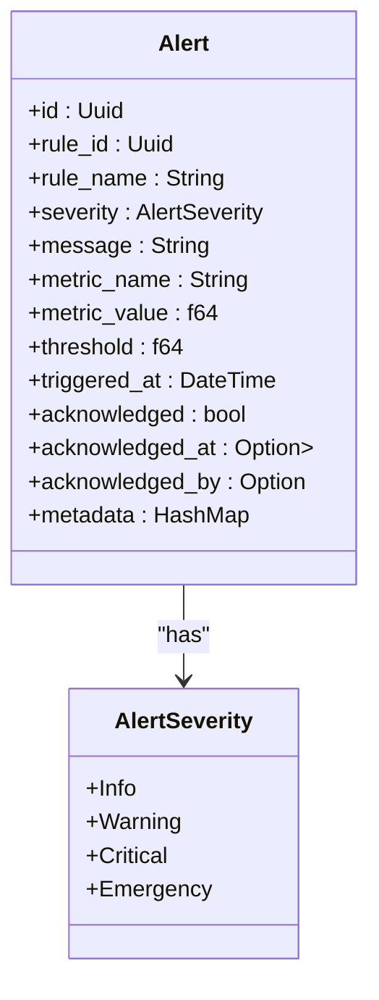
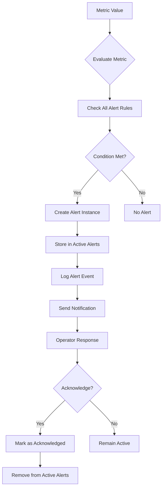
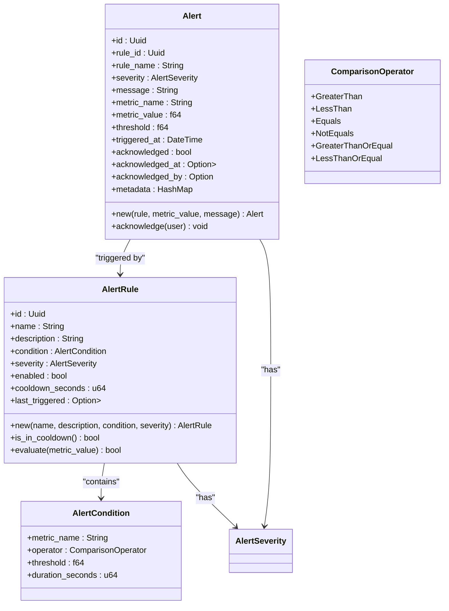
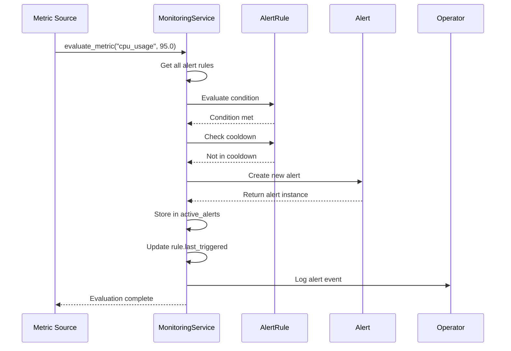
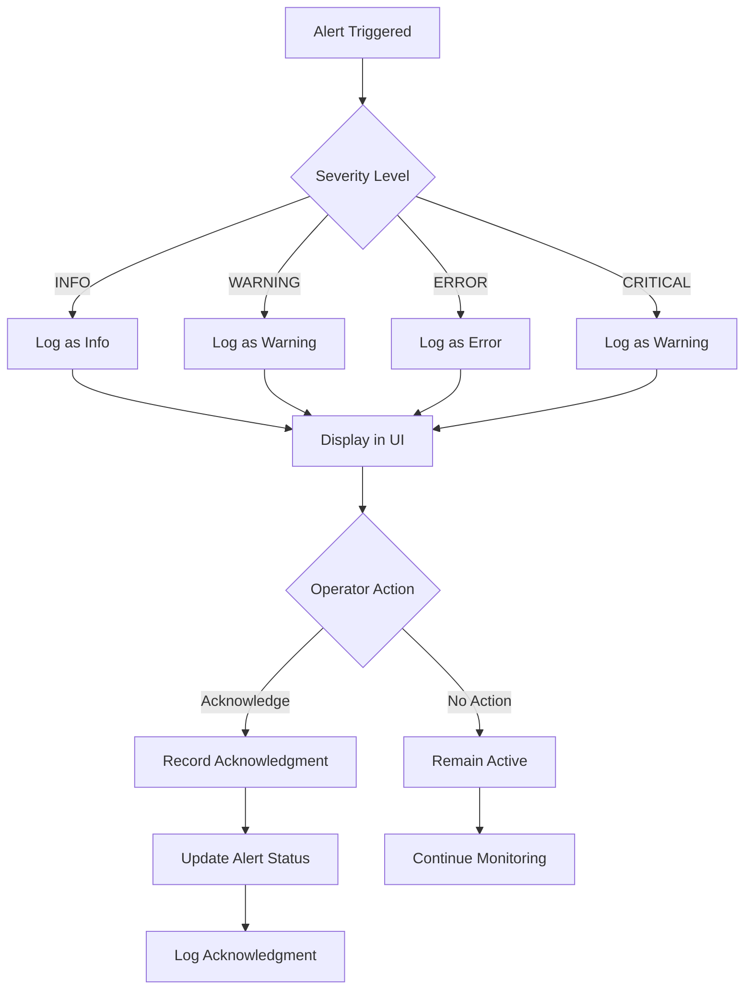
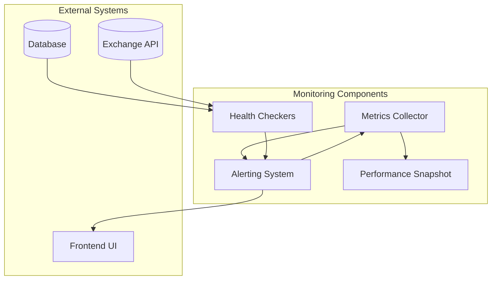

# Alerting System

<cite>
**Referenced Files in This Document**   
- [alerts.rs](file://crates/monitoring/src/alerts.rs)
- [service.rs](file://crates/monitoring/src/service.rs)
- [metrics.rs](file://crates/monitoring/src/metrics.rs)
- [lib.rs](file://crates/monitoring/src/lib.rs)
- [Dashboard.vue](file://src/views/Dashboard.vue)
- [Risk.vue](file://src/views/Risk.vue)
</cite>

## Table of Contents
1. [Introduction](#introduction)
2. [Severity Levels](#severity-levels)
3. [Alert Architecture](#alert-architecture)
4. [Data Structures](#data-structures)
5. [Alert Processing Flow](#alert-processing-flow)
6. [Notification Mechanisms](#notification-mechanisms)
7. [Relationship with Monitoring Components](#relationship-with-monitoring-components)
8. [Common Issues and Solutions](#common-issues-and-solutions)
9. [Common Alert Examples](#common-alert-examples)
10. [Conclusion](#conclusion)

## Introduction

The alerting system in the EA OKX trading platform provides a comprehensive mechanism for monitoring system health, performance metrics, and risk parameters. It enables real-time detection of critical conditions and timely notifications to operators. The system is designed to be configurable, reliable, and extensible, supporting various severity levels and alert conditions.

The core functionality is implemented in the monitoring crate, which coordinates metrics collection, health checks, and alerting. Alerts are triggered based on predefined rules that evaluate metric values against threshold conditions. The system includes mechanisms to prevent alert flooding through cooldown periods and supports acknowledgment of alerts by operators.

**Section sources**
- [lib.rs](file://crates/monitoring/src/lib.rs#L1-L11)
- [alerts.rs](file://crates/monitoring/src/alerts.rs#L1-L13)

## Severity Levels

The alerting system implements four severity levels that categorize alerts based on their criticality and required response time. These levels help prioritize responses and determine notification urgency.

### INFO
The INFO severity level is used for informational messages that do not require immediate action. These alerts typically indicate normal system operations, successful events, or status updates. Examples include strategy signals, order placements, and system startup notifications.

### WARNING
The WARNING severity level indicates potential issues that require attention but do not immediately impact system functionality. These alerts signal conditions that could lead to problems if not addressed, such as approaching risk limits, high resource utilization, or degraded performance.

### ERROR
The ERROR severity level represents significant issues that affect system functionality or performance. These alerts require prompt investigation and resolution. Examples include failed operations, connectivity issues, or violations of critical system parameters.

### CRITICAL
The CRITICAL severity level denotes severe problems that require immediate attention and may indicate system failure or significant financial risk. These alerts typically trigger urgent notifications and may initiate automated mitigation procedures. Examples include complete service outages, security breaches, or extreme market conditions.

The severity levels are defined in the `AlertSeverity` enum, which includes Info, Warning, Critical, and Emergency variants. The system uses these levels to prioritize alert handling and determine notification strategies.



**Diagram sources**
- [alerts.rs](file://crates/monitoring/src/alerts.rs#L7-L13)
- [alerts.rs](file://crates/monitoring/src/alerts.rs#L100-L114)

**Section sources**
- [alerts.rs](file://crates/monitoring/src/alerts.rs#L7-L13)
- [Dashboard.vue](file://src/views/Dashboard.vue#L137-L165)
- [Risk.vue](file://src/views/Risk.vue#L324-L387)

## Alert Architecture

The alerting system follows a modular architecture with clear separation of concerns. The core components work together to detect, process, and manage alerts throughout their lifecycle.

### Monitoring Service
The `MonitoringService` is the central coordinator that manages alert rules, evaluates metrics, and maintains active alerts. It uses thread-safe data structures to store alert rules and active alerts, allowing concurrent access from multiple components.

The service maintains three primary collections:
- `alert_rules`: HashMap of configured alert rules
- `active_alerts`: HashMap of currently active alerts
- `health_checks`: Vector of registered health checkers

These collections are wrapped in `Arc<RwLock<T>>` to enable safe concurrent access across asynchronous tasks.

### Alert Processing Pipeline
The alert processing pipeline consists of several stages:
1. Metric evaluation against registered alert rules
2. Alert rule evaluation and triggering
3. Alert creation and storage
4. Notification generation
5. Alert acknowledgment and lifecycle management

The pipeline is designed to be efficient and responsive, with minimal overhead during normal operation.



**Diagram sources**
- [service.rs](file://crates/monitoring/src/service.rs#L62-L90)
- [alerts.rs](file://crates/monitoring/src/alerts.rs#L78-L95)

**Section sources**
- [service.rs](file://crates/monitoring/src/service.rs#L12-L34)
- [service.rs](file://crates/monitoring/src/service.rs#L62-L90)

## Data Structures

The alerting system uses several key data structures to represent alert rules, conditions, and triggered alerts.

### AlertRule
The `AlertRule` structure defines a configurable alert condition with associated metadata. Each rule includes:
- Unique identifier (UUID)
- Name and description
- Trigger condition
- Severity level
- Enabled/disabled status
- Cooldown period
- Last triggered timestamp

Rules are created using the `new` constructor, which initializes default values such as a 5-minute cooldown period and enabled status.

### AlertCondition
The `AlertCondition` structure specifies the criteria for triggering an alert. It includes:
- Metric name to monitor
- Comparison operator (greater than, less than, etc.)
- Threshold value
- Duration requirement (in seconds)

The condition is evaluated against incoming metric values to determine if an alert should be triggered.

### Alert
The `Alert` structure represents a triggered alert instance. It contains:
- Unique identifier
- Reference to the triggering rule
- Severity level
- Message describing the alert
- Metric details (name, value, threshold)
- Timestamp of triggering
- Acknowledgment status and metadata

Alerts are created when a rule's condition is met and remain active until acknowledged.



**Diagram sources**
- [alerts.rs](file://crates/monitoring/src/alerts.rs#L37-L65)
- [alerts.rs](file://crates/monitoring/src/alerts.rs#L17-L22)
- [alerts.rs](file://crates/monitoring/src/alerts.rs#L100-L133)
- [alerts.rs](file://crates/monitoring/src/alerts.rs#L26-L33)

**Section sources**
- [alerts.rs](file://crates/monitoring/src/alerts.rs#L37-L65)
- [alerts.rs](file://crates/monitoring/src/alerts.rs#L17-L22)
- [alerts.rs](file://crates/monitoring/src/alerts.rs#L100-L133)

## Alert Processing Flow

The alert processing flow describes how alerts are triggered, evaluated, and managed within the system.

### Rule Evaluation
When a metric value is received, the system evaluates all registered alert rules that monitor that metric. The evaluation process checks if:
1. The rule is enabled
2. The rule is not in cooldown period
3. The metric value meets the condition criteria

If all conditions are met, an alert is triggered.

### Alert Creation
When a rule is triggered, a new `Alert` instance is created with details from the triggering rule and the current metric value. The alert includes contextual information such as the rule name, metric value, threshold, and a formatted message.

The alert is then stored in the active alerts collection, and the rule's last triggered timestamp is updated to enforce the cooldown period.

### Cooldown Mechanism
The cooldown mechanism prevents alert flooding by ensuring that a rule cannot trigger multiple alerts within a specified time window. By default, the cooldown period is set to 300 seconds (5 minutes). During this period, the rule will not trigger additional alerts, even if the condition continues to be met.



**Diagram sources**
- [service.rs](file://crates/monitoring/src/service.rs#L62-L87)
- [alerts.rs](file://crates/monitoring/src/alerts.rs#L68-L75)
- [alerts.rs](file://crates/monitoring/src/alerts.rs#L117-L133)

**Section sources**
- [service.rs](file://crates/monitoring/src/service.rs#L62-L87)
- [alerts.rs](file://crates/monitoring/src/alerts.rs#L68-L75)

## Notification Mechanisms

The alerting system provides multiple mechanisms for notifying operators of critical conditions.

### Logging and Tracing
All alerts are logged using the tracing framework with appropriate severity levels. Critical alerts are logged as warnings, while acknowledged alerts are logged as informational messages. This ensures that alerts are captured in system logs for auditing and analysis.

### Frontend Display
Alerts are displayed in the frontend user interface, where operators can view active alerts and acknowledge them. The Dashboard and Risk views show recent alerts with visual indicators based on severity level. The UI uses color coding to distinguish between different severity levels:
- INFO: Primary/blue
- WARNING: Warning/orange
- ERROR: Danger/red
- CRITICAL: Danger/red (more prominent)

### Acknowledgment System
The system supports alert acknowledgment, allowing operators to mark alerts as reviewed. When an alert is acknowledged, the system records:
- Acknowledgment status
- Timestamp of acknowledgment
- User who acknowledged the alert

This helps track response times and ensures accountability.



**Diagram sources**
- [service.rs](file://crates/monitoring/src/service.rs#L79-L85)
- [service.rs](file://crates/monitoring/src/service.rs#L114-L118)
- [Dashboard.vue](file://src/views/Dashboard.vue#L150-L165)
- [Risk.vue](file://src/views/Risk.vue#L370-L387)

**Section sources**
- [service.rs](file://crates/monitoring/src/service.rs#L79-L85)
- [service.rs](file://crates/monitoring/src/service.rs#L114-L118)
- [Dashboard.vue](file://src/views/Dashboard.vue#L150-L165)

## Relationship with Monitoring Components

The alerting system is integrated with other monitoring components to provide comprehensive system oversight.

### Metrics Collection
The alerting system works closely with the metrics collection subsystem. The `MetricsCollector` gathers performance data from various system components, which is then evaluated against alert rules. Key metrics that can trigger alerts include:
- Order latency
- Error rates
- CPU and memory usage
- Network connectivity
- Trading performance

### Health Checks
The system includes health checkers for critical components such as the database and exchange API. These checkers periodically verify component availability and performance, triggering alerts if issues are detected. The `DatabaseHealthChecker` and `ExchangeHealthChecker` classes implement the `HealthChecker` trait and are registered with the monitoring service.

### Performance Monitoring
The alerting system is part of a broader performance monitoring framework that tracks trading performance, system health, and operational metrics. It complements other monitoring features such as real-time performance snapshots and historical data analysis.



**Diagram sources**
- [service.rs](file://crates/monitoring/src/service.rs#L12-L17)
- [metrics.rs](file://crates/monitoring/src/metrics.rs#L97-L104)
- [service.rs](file://crates/monitoring/src/service.rs#L182-L253)

**Section sources**
- [service.rs](file://crates/monitoring/src/service.rs#L12-L17)
- [metrics.rs](file://crates/monitoring/src/metrics.rs#L97-L104)
- [service.rs](file://crates/monitoring/src/service.rs#L182-L253)

## Common Issues and Solutions

The alerting system addresses several common challenges in monitoring and alert management.

### Alert Fatigue
Alert fatigue occurs when operators are overwhelmed by too many alerts, leading to important alerts being ignored. The system mitigates this through:
- Cooldown periods that prevent repeated alerts
- Severity levels that prioritize critical issues
- Acknowledgment system that tracks response

### False Positives
False positives can erode trust in the alerting system. The system reduces false positives by:
- Requiring sustained conditions (duration parameter)
- Using appropriate thresholds based on historical data
- Allowing rule disabling for testing

### Escalation Procedures
The system supports escalation through:
- Severity-based notification priorities
- Automated alert grouping
- Integration with external notification systems (future enhancement)

### Best Practices
To optimize alert effectiveness:
- Set appropriate thresholds based on historical performance
- Use meaningful alert names and descriptions
- Regularly review and update alert rules
- Monitor alert frequency and adjust cooldown periods

**Section sources**
- [alerts.rs](file://crates/monitoring/src/alerts.rs#L68-L75)
- [alerts.rs](file://crates/monitoring/src/alerts.rs#L48-L64)
- [service.rs](file://crates/monitoring/src/service.rs#L41-L46)

## Common Alert Examples

The system supports various common alert scenarios that help maintain system health and trading performance.

### High Latency Alert
Triggers when order processing latency exceeds a threshold:
```rust
let condition = AlertCondition {
    metric_name: "order_latency".to_string(),
    operator: ComparisonOperator::GreaterThan,
    threshold: 100.0,
    duration_seconds: 60,
};
let rule = AlertRule::new(
    "High Order Latency",
    "Order latency exceeded 100ms",
    condition,
    AlertSeverity::Warning,
);
```

### High Error Rate Alert
Detects elevated error rates in system operations:
```rust
let condition = AlertCondition {
    metric_name: "error_rate".to_string(),
    operator: ComparisonOperator::GreaterThan,
    threshold: 0.01,
    duration_seconds: 60,
};
let rule = AlertRule::new(
    "High Error Rate",
    "Error rate exceeded 1%",
    condition,
    AlertSeverity::Critical,
);
```

### Resource Utilization Alert
Monitors system resource usage:
```rust
let condition = AlertCondition {
    metric_name: "cpu_usage".to_string(),
    operator: ComparisonOperator::GreaterThan,
    threshold: 80.0,
    duration_seconds: 30,
};
let rule = AlertRule::new(
    "High CPU Usage",
    "CPU usage exceeded 80%",
    condition,
    AlertSeverity::Warning,
);
```

**Section sources**
- [service.rs](file://crates/monitoring/src/service.rs#L29-L34)
- [service.rs](file://crates/monitoring/src/service.rs#L304-L318)
- [service.rs](file://crates/monitoring/src/service.rs#L272-L284)

## Conclusion

The alerting system in the EA OKX trading platform provides a robust framework for monitoring system health and performance. With its configurable severity levels, flexible rule system, and comprehensive notification mechanisms, it enables operators to maintain situational awareness and respond promptly to critical conditions.

The system's modular architecture allows for easy extension and integration with other monitoring components. By addressing common issues such as alert fatigue and false positives, it ensures that alerts remain meaningful and actionable.

For optimal effectiveness, operators should regularly review alert rules, adjust thresholds based on system performance, and use the acknowledgment system to track responses. The combination of automated monitoring and human oversight creates a resilient system capable of maintaining trading operations even under challenging conditions.