# Audit Trail

<cite>
**Referenced Files in This Document**   
- [audit_logs.sql](file://migrations/001_initial_schema.sql)
- [state_machine.rs](file://crates/trading/src/state_machine.rs)
- [lifecycle.rs](file://crates/strategy/src/lifecycle.rs)
- [events.rs](file://crates/backtest/src/events.rs)
- [service.rs](file://crates/monitoring/src/service.rs)
- [alerts.rs](file://crates/monitoring/src/alerts.rs)
- [metrics.rs](file://crates/monitoring/src/metrics.rs)
</cite>

## Table of Contents
1. [Introduction](#introduction)
2. [Audit Log Storage and Database Schema](#audit-log-storage-and-database-schema)
3. [Event Logging for System State Transitions](#event-logging-for-system-state-transitions)
4. [User Action and Configuration Change Auditing](#user-action-and-configuration-change-auditing)
5. [Data Structures and Interfaces for Audit Records](#data-structures-and-interfaces-for-audit-records)
6. [Audit Trail Integration with Monitoring Components](#audit-trail-integration-with-monitoring-components)
7. [Log Retention, Storage, and Compliance](#log-retention-storage-and-compliance)
8. [Conclusion](#conclusion)

## Introduction
The audit trail functionality in the EA OKX system provides comprehensive tracking of significant system events, including user actions, configuration changes, and system state transitions. This documentation details the implementation of event logging, the data structures used for audit record creation and storage, and the relationship between the audit trail and other monitoring components. The system is designed to ensure compliance with regulatory requirements while providing detailed insights into system operations for both beginners and experienced developers.

## Audit Log Storage and Database Schema
The audit trail functionality is implemented through a dedicated `audit_logs` table in the PostgreSQL database with TimescaleDB extension. This table captures all significant system events with comprehensive metadata for compliance and forensic analysis.

```mermaid
erDiagram
audit_logs {
BIGSERIAL id PK
UUID user_id FK
VARCHAR(100) action
VARCHAR(50) resource_type
VARCHAR(100) resource_id
JSONB old_value
JSONB new_value
INET ip_address
TEXT user_agent
BOOLEAN success
TEXT error_message
TIMESTAMPTZ created_at
}
users {
UUID id PK
VARCHAR(50) username
VARCHAR(255) email
VARCHAR(20) role
BOOLEAN is_active
TIMESTAMPTZ created_at
TIMESTAMPTZ updated_at
}
audit_logs ||--o{ users : "user_id → id"
```

**Diagram sources**
- [audit_logs.sql](file://migrations/001_initial_schema.sql#L236-L254)

**Section sources**
- [audit_logs.sql](file://migrations/001_initial_schema.sql#L236-L254)

The audit logs table includes essential fields for tracking events:
- **user_id**: References the user who performed the action (nullable for system-generated events)
- **action**: Describes the action performed (e.g., "create_strategy", "update_risk_limits")
- **resource_type**: Identifies the type of resource affected (e.g., "strategy", "order", "position")
- **resource_id**: Contains the identifier of the specific resource
- **old_value** and **new_value**: Store the JSONB representations of the resource state before and after the change
- **ip_address** and **user_agent**: Capture client information for security auditing
- **success**: Boolean indicating whether the action succeeded
- **error_message**: Contains error details if the action failed

Database triggers automatically update the `updated_at` timestamp for critical tables (users, strategies, positions) whenever changes occur, providing an additional layer of auditability.

## Event Logging for System State Transitions
The system implements detailed state transition logging for both trading orders and strategy lifecycle management. These state machines maintain complete histories of all state changes, providing a comprehensive audit trail of system behavior.

**Diagram sources**
- [state_machine.rs](file://crates/trading/src/state_machine.rs#L8-L31)
- [state_machine.rs](file://crates/trading/src/state_machine.rs#L59-L77)
- [state_machine.rs](file://crates/trading/src/state_machine.rs#L101-L112)

**Section sources**
- [state_machine.rs](file://crates/trading/src/state_machine.rs#L1-L271)

The order state machine tracks the complete lifecycle of trading orders through various states from creation to final disposition. Each state transition is recorded with a timestamp, reason, and optional metadata, creating a complete audit trail of order execution. The system enforces valid state transitions through the `is_valid_transition` method, preventing invalid state changes that could compromise audit integrity.

Similarly, the strategy lifecycle manager implements a state machine for strategy development and deployment:

**Diagram sources**
- [lifecycle.rs](file://crates/strategy/src/lifecycle.rs#L8-L22)
- [lifecycle.rs](file://crates/strategy/src/lifecycle.rs#L26-L28)
- [lifecycle.rs](file://crates/strategy/src/lifecycle.rs#L32-L38)

**Section sources**
- [lifecycle.rs](file://crates/strategy/src/lifecycle.rs#L1-L129)

The strategy lifecycle enforces a controlled progression from draft through validation, backtesting, paper trading, and finally to live deployment. Each transition is recorded with a timestamp and reason, providing a complete audit trail of strategy development and deployment decisions.

## User Action and Configuration Change Auditing
User actions and configuration changes are captured through both direct audit logging and state transition tracking. When users perform actions through the system, these are recorded in the audit logs table with complete context.

The system captures user actions such as:
- Strategy creation, modification, and deletion
- Risk limit configuration changes
- Order submission and cancellation
- Position management operations
- System configuration updates

For each action, the audit system records the user ID, IP address, user agent, action type, resource affected, and before/after states when applicable. This comprehensive logging enables reconstruction of any sequence of events for compliance or troubleshooting purposes.

Configuration changes are particularly well-audited, with the `old_value` and `new_value` fields in the audit logs table storing JSONB representations of the configuration before and after changes. This allows for precise tracking of configuration evolution over time and facilitates rollback to previous configurations if needed.

## Data Structures and Interfaces for Audit Records
The audit trail functionality relies on well-defined data structures and interfaces that ensure consistency and completeness of audit records across the system.

**Diagram sources**
- [events.rs](file://crates/backtest/src/events.rs#L110-L188)
- [events.rs](file://crates/backtest/src/events.rs#L54-L97)
- [events.rs](file://crates/backtest/src/events.rs#L11-L33)

**Section sources**
- [events.rs](file://crates/backtest/src/events.rs#L1-L189)

The `Trade` struct represents completed trades with comprehensive performance metrics, including profit and loss (PnL), commission, slippage, and excursion metrics. These trade records serve as audit trail entries for executed transactions, capturing all relevant details for performance analysis and compliance reporting.

The system uses event-driven architecture to propagate audit-relevant information across components. Execution events such as `OrderFilled`, `OrderRejected`, and `OrderCancelled` are generated by the trading system and can trigger audit logging. Similarly, market events like new candles, trades, and order book snapshots provide context for audit records.

## Audit Trail Integration with Monitoring Components
The audit trail is tightly integrated with the system's monitoring components, creating a comprehensive observability framework that combines audit logging with real-time monitoring and alerting.

**Diagram sources**
- [service.rs](file://crates/monitoring/src/service.rs#L1-L39)
- [alerts.rs](file://crates/monitoring/src/alerts.rs#L1-L46)
- [metrics.rs](file://crates/monitoring/src/metrics.rs#L1-L299)

**Section sources**
- [service.rs](file://crates/monitoring/src/service.rs#L1-L346)
- [alerts.rs](file://crates/monitoring/src/alerts.rs#L1-L215)
- [metrics.rs](file://crates/monitoring/src/metrics.rs#L1-L299)

The `MonitoringService` coordinates metrics collection, health checks, and alerting, consuming audit trail data to provide comprehensive system visibility. Alert rules can be configured to trigger based on patterns in audit logs or state transitions, enabling proactive detection of anomalous behavior.

For example, frequent order rejections or cancellations might trigger alerts indicating potential issues with trading strategies or market conditions. Similarly, unexpected strategy state transitions could trigger alerts for immediate investigation.

The monitoring service also generates performance snapshots that incorporate data from audit records, providing aggregated views of system performance over time. These snapshots include metrics such as orders submitted, filled, cancelled, and rejected, as well as trading performance metrics derived from completed trades.

## Log Retention, Storage, and Compliance
The audit trail system is designed with comprehensive retention policies and storage optimization to meet compliance requirements while managing storage costs effectively.

The database schema implements TimescaleDB hypertables with defined retention policies:
- **Audit logs**: Retained according to business requirements (not explicitly specified in current schema but implied by system design)
- **System metrics**: 180-day retention with 14-day compression policy
- **Market ticks**: 90-day retention with 7-day compression
- **Order book snapshots**: 7-day retention with 3-day compression
- **Market OHLCV data**: 5-year retention with 30-day compression

These retention policies ensure that audit data is preserved for sufficient periods to meet regulatory requirements while optimizing storage costs through compression of older data.

The system also implements comprehensive indexing strategies to ensure efficient querying of audit data:
- Index on `user_id` and `created_at` for user activity analysis
- Index on `resource_type` and `resource_id` for resource-specific auditing
- Index on `created_at` for time-based queries

For compliance purposes, the audit trail design ensures:
- **Immutability**: Once recorded, audit entries cannot be modified or deleted
- **Completeness**: All significant system events are captured with sufficient context
- **Traceability**: Every change can be traced to a specific user, time, and reason
- **Availability**: Audit data is stored in a reliable database with backup procedures

The system supports various compliance requirements by providing detailed records of user actions, configuration changes, and system state transitions. This enables organizations to demonstrate adherence to regulatory requirements and facilitates forensic analysis in case of incidents.

## Conclusion
The audit trail functionality in the EA OKX system provides a comprehensive framework for tracking significant system events, ensuring accountability, and supporting compliance requirements. Through a combination of database audit logging, state transition tracking, and integration with monitoring components, the system captures a complete picture of system operations.

Key strengths of the audit trail implementation include:
- Comprehensive coverage of user actions, configuration changes, and system state transitions
- Detailed data structures that capture sufficient context for each event
- Integration with monitoring and alerting systems for proactive issue detection
- Appropriate retention policies that balance compliance requirements with storage efficiency
- Efficient indexing for rapid querying and analysis of audit data

The system is well-designed to meet the needs of both beginners, who can use the audit trail for learning and troubleshooting, and experienced developers, who can leverage the detailed event data for performance optimization and compliance reporting.