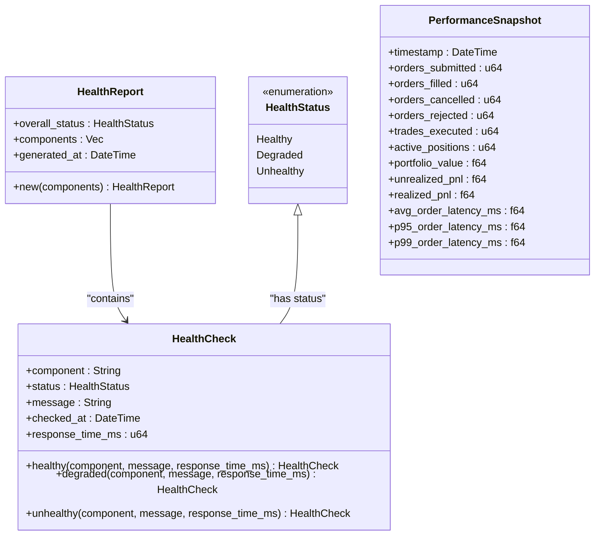
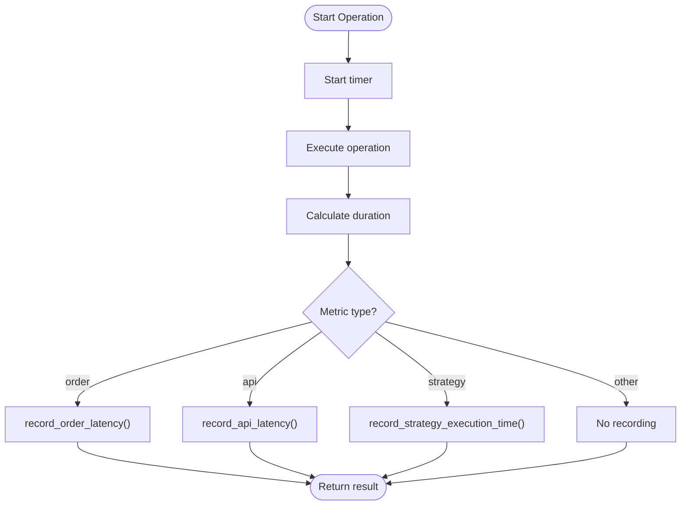
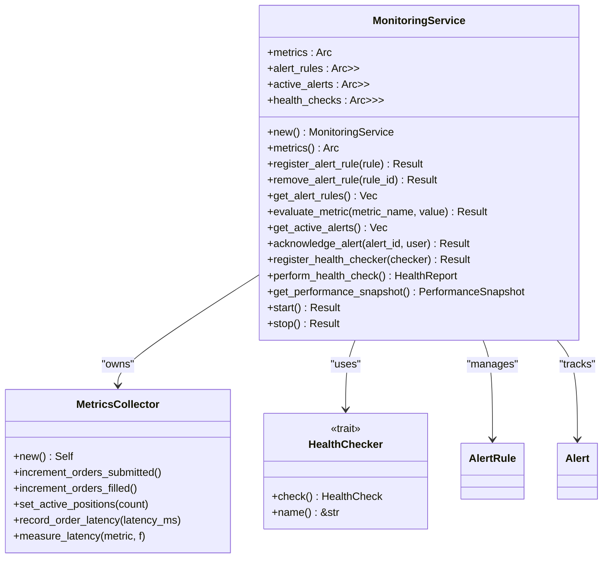
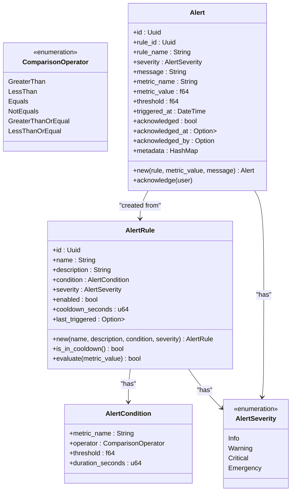
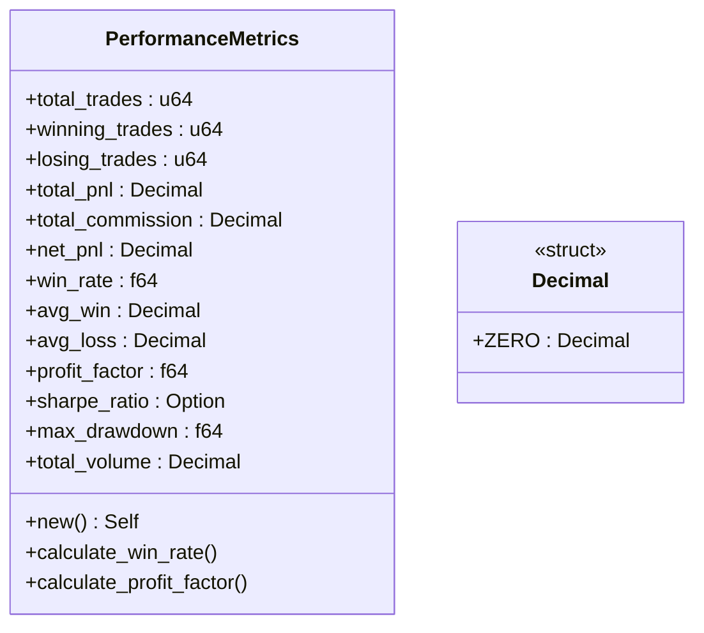
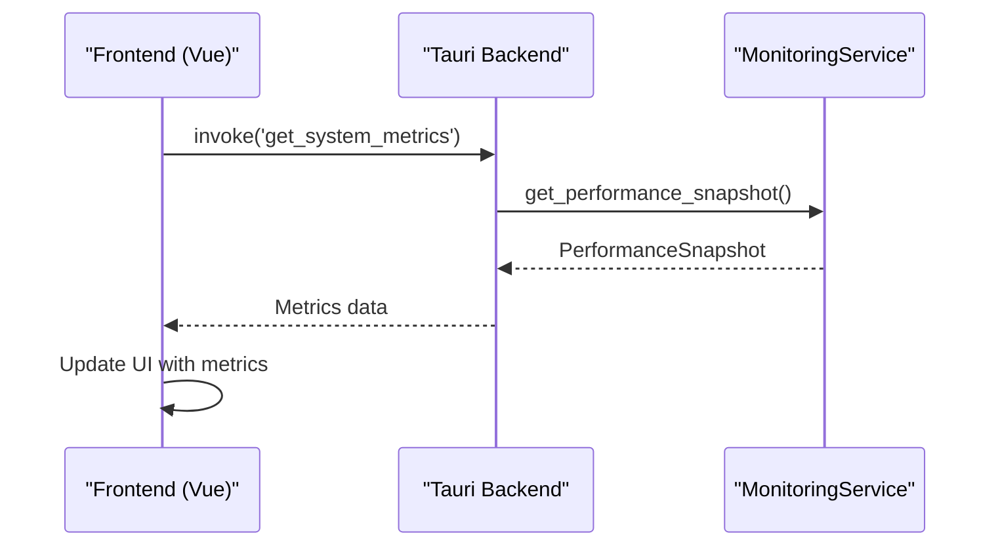

# Metrics Collection

<cite>
**Referenced Files in This Document**   
- [metrics.rs](file://crates/monitoring/src/metrics.rs)
- [service.rs](file://crates/monitoring/src/service.rs)
- [alerts.rs](file://crates/monitoring/src/alerts.rs)
- [order_manager.rs](file://crates/trading/src/order_manager.rs)
- [lifecycle.rs](file://crates/strategy/src/lifecycle.rs)
- [strategy/metrics.rs](file://crates/strategy/src/metrics.rs)
- [Dashboard.vue](file://frontend/src/views/Dashboard.vue)
</cite>

## Table of Contents
1. [Introduction](#introduction)
2. [Metrics Collection Framework](#metrics-collection-framework)
3. [Core Data Structures](#core-data-structures)
4. [Metrics Collection Implementation](#metrics-collection-implementation)
5. [Monitoring Service Architecture](#monitoring-service-architecture)
6. [Alerting System Integration](#alerting-system-integration)
7. [Performance Metrics Calculation](#performance-metrics-calculation)
8. [Frontend Integration](#frontend-integration)
9. [Best Practices and Considerations](#best-practices-and-considerations)

## Introduction
The metrics collection framework in the EA OKX trading system provides comprehensive monitoring of system performance, trading activity, and component health. This documentation details the implementation of system performance tracking including CPU usage, memory consumption, network latency, and event processing rates. The framework is designed to support real-time monitoring, historical analysis, and alerting capabilities essential for maintaining a reliable trading environment.

## Metrics Collection Framework
The metrics collection framework is implemented in the monitoring crate and provides a comprehensive system for tracking trading performance, system health, and operational metrics. The framework uses a modular approach with distinct components for metrics collection, health checks, and alerting. The core implementation uses tracing for logging metrics, with the capability to integrate with Prometheus or similar monitoring systems in production environments.

The framework supports three primary metric types:
- **Counters**: Monotonic increasing values for events like orders submitted or trades executed
- **Gauges**: Point-in-time measurements like active positions or portfolio value
- **Histograms**: Distribution measurements for latency tracking and performance analysis

**Section sources**
- [metrics.rs](file://crates/monitoring/src/metrics.rs#L96-L208)

## Core Data Structures
The metrics framework defines several key data structures for representing system state and performance data:

**Diagram sources**
- [metrics.rs](file://crates/monitoring/src/metrics.rs#L5-L94)

## Metrics Collection Implementation
The MetricsCollector struct provides methods for collecting various types of metrics across the trading system. Counter methods track discrete events such as order submissions and executions, while gauge methods capture current state values like portfolio value and active positions. Histogram methods record distribution data for performance analysis of order latency, API response times, and strategy execution duration.

A key feature of the implementation is the `measure_latency` method, which provides a convenient way to measure and record execution time for critical operations. This method accepts a metric type identifier and a closure, automatically measuring the execution time and recording it to the appropriate histogram metric.

**Diagram sources**
- [metrics.rs](file://crates/monitoring/src/metrics.rs#L101-L208)

**Section sources**
- [metrics.rs](file://crates/monitoring/src/metrics.rs#L101-L208)

## Monitoring Service Architecture
The MonitoringService coordinates metrics collection, health checks, and alerting across the system. It provides a centralized interface for accessing the metrics collector and managing alert rules. The service uses Arc<RwLock<T>> for thread-safe access to shared state, allowing concurrent access from multiple components while maintaining data consistency.

The service architecture follows a dependency injection pattern, with the metrics collector and other components passed through the service constructor. This design enables easy testing and configuration of the monitoring system. The service also implements health checking capabilities through the HealthChecker trait, allowing components to register custom health check implementations.

**Diagram sources**
- [service.rs](file://crates/monitoring/src/service.rs#L12-L179)

**Section sources**
- [service.rs](file://crates/monitoring/src/service.rs#L12-L179)

## Alerting System Integration
The alerting system integrates with the metrics collection framework to provide real-time notifications when system metrics exceed predefined thresholds. Alert rules are defined with conditions that specify the metric name, comparison operator, threshold value, and duration. The system supports multiple severity levels including Info, Warning, Critical, and Emergency.

Alert evaluation occurs when metrics are processed, with the system checking all registered rules against the incoming metric value. Alerts have a cooldown period to prevent notification spam, and can be acknowledged by users to indicate that the issue has been addressed. The system maintains both active and historical alerts for audit and analysis purposes.

**Diagram sources**
- [alerts.rs](file://crates/monitoring/src/alerts.rs#L6-L141)

**Section sources**
- [alerts.rs](file://crates/monitoring/src/alerts.rs#L6-L141)

## Performance Metrics Calculation
The strategy crate includes a dedicated metrics module for calculating performance metrics from trading activity. These metrics focus on strategy performance evaluation rather than system monitoring, providing insights into trading effectiveness and risk-adjusted returns.

The PerformanceMetrics struct captures key performance indicators including total trades, winning/losing trades, profit factor, Sharpe ratio, and maximum drawdown. These metrics are essential for evaluating strategy effectiveness during backtesting and live trading. The implementation uses precise decimal arithmetic to ensure accurate financial calculations.

**Diagram sources**
- [strategy/metrics.rs](file://crates/strategy/src/metrics.rs#L6-L69)

**Section sources**
- [strategy/metrics.rs](file://crates/strategy/src/metrics.rs#L6-L69)

## Frontend Integration
The metrics collection framework integrates with the frontend through the Tauri backend, exposing system metrics to the user interface for real-time monitoring. The Dashboard.vue component demonstrates this integration by loading system metrics and displaying them in a user-friendly format.

The frontend uses ECharts for visualizing metrics data, providing interactive charts and graphs for performance analysis. The integration follows a command pattern, with the frontend invoking Tauri commands to retrieve metrics data from the backend. This architecture ensures a clean separation between the UI and the underlying metrics collection system.

**Diagram sources**
- [Dashboard.vue](file://frontend/src/views/Dashboard.vue#L230-L245)
- [service.rs](file://crates/monitoring/src/service.rs#L144-L161)

**Section sources**
- [Dashboard.vue](file://frontend/src/views/Dashboard.vue#L230-L245)

## Best Practices and Considerations
When implementing metrics collection in trading systems, several best practices should be followed to ensure accuracy, reliability, and minimal performance impact:

1. **Metric Accuracy**: Ensure metrics are collected at appropriate points in the code to capture accurate data. For latency measurements, start timing as close to the actual operation as possible.

2. **Collection Frequency**: Balance the need for timely metrics with system performance. High-frequency metrics collection can impact system performance, so consider sampling or batching where appropriate.

3. **Performance Overhead**: The current implementation uses tracing for metrics collection, which has minimal overhead. In production, consider using dedicated metrics systems like Prometheus for better scalability.

4. **Error Handling**: Implement robust error handling in metrics collection to prevent failures from affecting core trading operations.

5. **Data Retention**: Plan for appropriate data retention policies based on regulatory requirements and business needs.

6. **Security**: Ensure metrics data containing sensitive information is properly secured and access-controlled.

7. **Testing**: Thoroughly test metrics collection and alerting logic to ensure reliable operation in production environments.

**Section sources**
- [metrics.rs](file://crates/monitoring/src/metrics.rs)
- [service.rs](file://crates/monitoring/src/service.rs)
- [alerts.rs](file://crates/monitoring/src/alerts.rs)