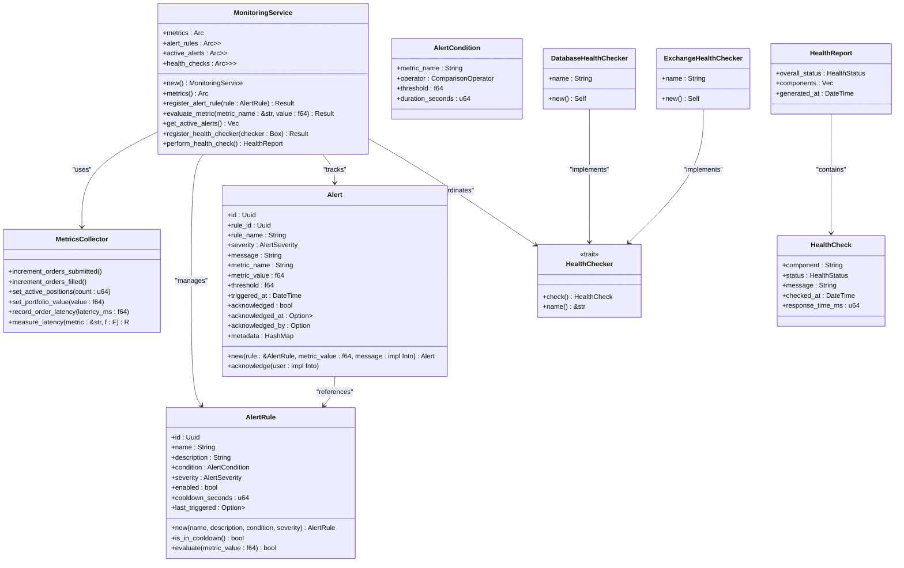
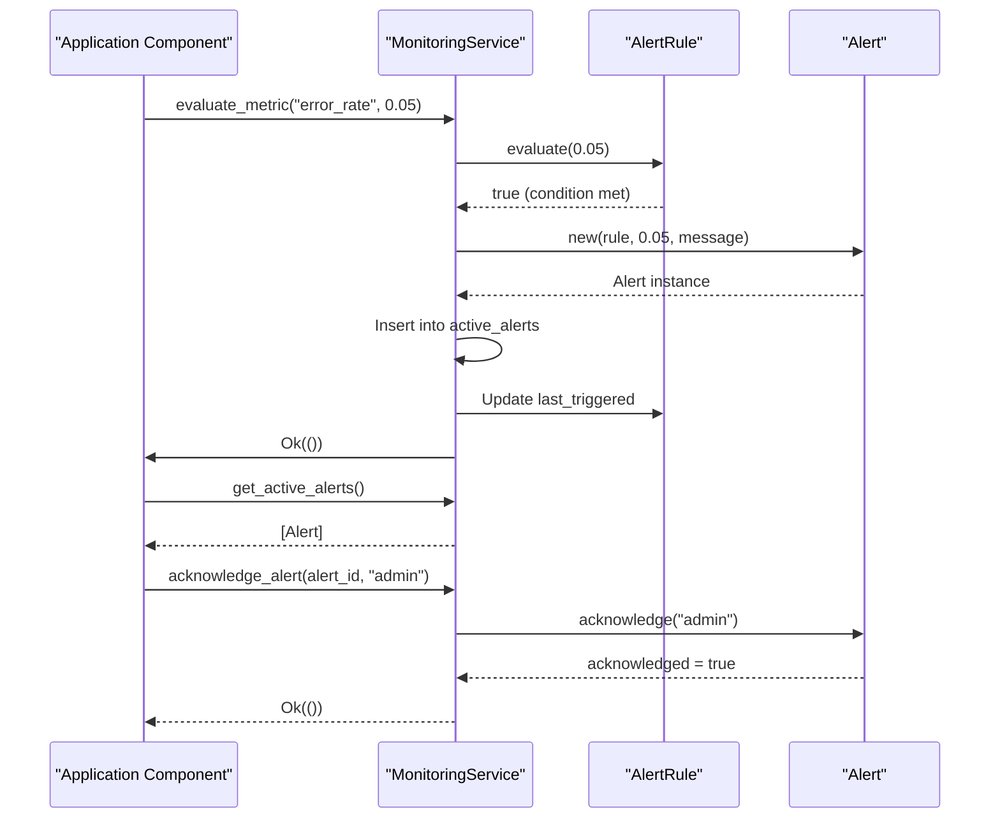

# Monitoring Service

<cite>
**Referenced Files in This Document**   
- [lib.rs](file://crates/monitoring/src/lib.rs)
- [service.rs](file://crates/monitoring/src/service.rs)
- [metrics.rs](file://crates/monitoring/src/metrics.rs)
- [alerts.rs](file://crates/monitoring/src/alerts.rs)
- [error.rs](file://crates/monitoring/src/error.rs)
- [Cargo.toml](file://crates/monitoring/Cargo.toml)
</cite>

## Table of Contents
1. [Introduction](#introduction)
2. [Core Components](#core-components)
3. [Service Architecture](#service-architecture)
4. [Metrics Collection](#metrics-collection)
5. [Alerting System](#alerting-system)
6. [Health Monitoring](#health-monitoring)
7. [Service Lifecycle](#service-lifecycle)
8. [Integration with External Systems](#integration-with-external-systems)
9. [Error Handling and Reliability](#error-handling-and-reliability)
10. [Configuration and Initialization](#configuration-and-initialization)

## Introduction
The Monitoring Service in the EA OKX trading system provides comprehensive observability for trading operations, system health, and performance metrics. This service acts as the central hub for monitoring, collecting metrics from various components, evaluating alert conditions, and performing health checks on critical system components. The service is designed to be highly reliable, with thread-safe data structures and asynchronous operations to handle concurrent access from multiple system components.

The monitoring service plays a crucial role in ensuring the stability and performance of the trading system by providing early warnings of potential issues, tracking key performance indicators, and maintaining an audit trail of system events. It is built with extensibility in mind, allowing new monitoring components to be easily integrated while maintaining a clean separation of concerns.

## Core Components

The monitoring service consists of several key components that work together to provide comprehensive monitoring capabilities. These components include the MonitoringService itself, which coordinates all monitoring activities, the MetricsCollector for tracking system metrics, the alerting system for detecting and managing alerts, and the health checking framework for monitoring component health.

The service uses a modular architecture with clearly defined interfaces, making it easy to extend and maintain. All components are designed to work asynchronously, ensuring that monitoring operations do not block critical trading operations. The use of Arc (Atomic Reference Counting) and RwLock (Read-Write Lock) ensures thread-safe access to shared data structures across multiple tasks and threads.

**Section sources**
- [lib.rs](file://crates/monitoring/src/lib.rs#L1-L56)
- [service.rs](file://crates/monitoring/src/service.rs#L1-L374)
- [metrics.rs](file://crates/monitoring/src/metrics.rs#L1-L299)
- [alerts.rs](file://crates/monitoring/src/alerts.rs#L1-L215)

## Service Architecture



**Diagram sources**
- [service.rs](file://crates/monitoring/src/service.rs#L12-L17)
- [metrics.rs](file://crates/monitoring/src/metrics.rs#L97-L100)
- [alerts.rs](file://crates/monitoring/src/alerts.rs#L37-L46)
- [service.rs](file://crates/monitoring/src/service.rs#L19-L24)

## Metrics Collection

The metrics collection system in the monitoring service provides a comprehensive framework for tracking key performance indicators and system metrics. The MetricsCollector class serves as the central component for collecting and recording various types of metrics, including counters, gauges, and histograms.

The service tracks trading performance metrics such as orders submitted, filled, cancelled, and rejected, as well as business metrics like trades executed, active positions, portfolio value, and profit and loss calculations. It also records latency metrics for critical operations like order processing and API calls, which are essential for monitoring system performance.

A key feature of the metrics system is the measure_latency method, which provides a convenient way to measure and record the execution time of code blocks. This method automatically calculates the duration of the operation and records it in the appropriate histogram based on the specified metric type (order, api, or strategy).

**Section sources**
- [metrics.rs](file://crates/monitoring/src/metrics.rs#L97-L232)
- [service.rs](file://crates/monitoring/src/service.rs#L13-L14)

## Alerting System



**Diagram sources**
- [alerts.rs](file://crates/monitoring/src/alerts.rs#L37-L96)
- [service.rs](file://crates/monitoring/src/service.rs#L62-L89)
- [alerts.rs](file://crates/monitoring/src/alerts.rs#L116-L141)

The alerting system in the monitoring service provides a flexible framework for detecting and managing critical conditions in the trading system. Alert rules are defined with specific conditions that trigger alerts when metrics exceed predefined thresholds. Each alert rule includes a metric name, comparison operator, threshold value, and duration requirement.

Alerts have configurable severity levels (Info, Warning, Critical, Emergency) that indicate the urgency of the condition. The system includes a cooldown mechanism to prevent alert spam, ensuring that the same alert cannot be triggered repeatedly within a specified time period. When an alert condition is met, the system creates an alert instance that includes detailed information about the triggering condition, including the metric value, threshold, and timestamp.

The alerting system supports acknowledgment of alerts, allowing operators to mark alerts as addressed. This helps track which issues have been responded to and provides an audit trail of incident management. Active alerts can be retrieved from the system, allowing monitoring interfaces to display current issues.

**Section sources**
- [alerts.rs](file://crates/monitoring/src/alerts.rs#L6-L141)
- [service.rs](file://crates/monitoring/src/service.rs#L42-L90)

## Health Monitoring

```mermaid
flowchart TD
A[Start Health Check] --> B{Get Health Checkers}
B --> C[DatabaseHealthChecker]
B --> D[ExchangeHealthChecker]
C --> E[Execute check()]
D --> F[Execute check()]
E --> G{Response Time < 50ms?}
G --> |Yes| H[Healthy]
G --> |No| I{Response Time < 100ms?}
I --> |Yes| J[Degraded]
I --> |No| K[Unhealthy]
F --> L{Response Time < 100ms?}
L --> |Yes| M[Healthy]
L --> |No| N[Degraded]
H --> O[Add to HealthReport]
J --> O
K --> O
M --> O
N --> O
O --> P{Determine Overall Status}
P --> Q[Max Severity]
Q --> R[Return HealthReport]
```

**Diagram sources**
- [service.rs](file://crates/monitoring/src/service.rs#L131-L142)
- [service.rs](file://crates/monitoring/src/service.rs#L197-L213)
- [service.rs](file://crates/monitoring/src/service.rs#L235-L248)
- [metrics.rs](file://crates/monitoring/src/metrics.rs#L75-L93)

The health monitoring system provides a framework for checking the status of critical components in the trading system. The system uses a pluggable architecture where health checkers can be registered for different components such as the database and exchange API.

Each health checker implements the HealthChecker trait, which defines a check method that returns a HealthCheck result. The HealthCheck includes the component name, status (Healthy, Degraded, or Unhealthy), a descriptive message, and the response time in milliseconds. The status is determined based on the response time, with different thresholds for healthy, degraded, and unhealthy states.

The MonitoringService coordinates health checks by calling the check method on all registered health checkers and aggregating the results into a HealthReport. The overall status of the system is determined by the worst status among all components, following the principle that the system is only as healthy as its weakest component.

**Section sources**
- [service.rs](file://crates/monitoring/src/service.rs#L19-L24)
- [service.rs](file://crates/monitoring/src/service.rs#L125-L142)
- [metrics.rs](file://crates/monitoring/src/metrics.rs#L5-L65)

## Service Lifecycle

The monitoring service follows a standard lifecycle with initialization, startup, and shutdown phases. The service is initialized using the new method, which creates the necessary data structures and initializes all components. The service uses Arc (Atomic Reference Counting) to allow shared ownership across multiple parts of the application, and RwLock (Read-Write Lock) to ensure thread-safe access to mutable data.

During startup, the service can be started asynchronously using the start method, which logs a startup message. Similarly, the stop method can be called to gracefully shut down the service, logging a shutdown message. These methods provide hooks for future expansion, such as starting background tasks for periodic metric collection or alert evaluation.

The service is designed to be long-lived and typically runs for the entire duration of the application. It can be easily integrated into the application's dependency injection system, allowing other components to obtain a reference to the monitoring service and use its functionality.

**Section sources**
- [service.rs](file://crates/monitoring/src/service.rs#L27-L34)
- [service.rs](file://crates/monitoring/src/service.rs#L164-L173)

## Integration with External Systems

The monitoring service is designed to integrate with external monitoring and observability tools through its dependency on the metrics and metrics-exporter-prometheus crates. Although the current implementation primarily uses tracing for logging metrics, it is structured to support integration with Prometheus for metrics collection and visualization.

The service's architecture allows for the addition of exporters that can send metrics and alerts to external systems such as Grafana, Alertmanager, or cloud monitoring platforms. The use of standard data formats and interfaces makes it relatively straightforward to add new exporters without modifying the core monitoring logic.

The service can be integrated with the application's logging system through the tracing crate, allowing monitoring events to be included in the application's log output. This provides a unified view of application events and monitoring alerts, making it easier to correlate issues and diagnose problems.

**Section sources**
- [Cargo.toml](file://crates/monitoring/Cargo.toml#L21-L22)
- [lib.rs](file://crates/monitoring/src/lib.rs#L7-L10)
- [service.rs](file://crates/monitoring/src/service.rs#L5)

## Error Handling and Reliability

The monitoring service implements a comprehensive error handling system to ensure reliability and provide meaningful error information when issues occur. The service uses a custom Error enum that defines several error types, including MetricError, AlertError, HealthCheckError, and ExporterError, each with a descriptive message.

The service uses the Result type for all operations that can fail, following Rust's idiomatic error handling patterns. This allows callers to handle errors appropriately and provides a consistent interface across all service methods. The error system also includes a catch-all Other variant that can wrap any error type from the anyhow crate, providing flexibility for handling unexpected errors.

The service is designed to be resilient to failures in individual components. For example, if a health check fails, it does not prevent other health checks from being performed, and the system continues to operate while recording the failure in the health report. Similarly, if an alert evaluation fails, it does not affect the evaluation of other alerts or the overall operation of the monitoring service.

**Section sources**
- [error.rs](file://crates/monitoring/src/error.rs#L1-L22)
- [service.rs](file://crates/monitoring/src/service.rs#L2-L3)

## Configuration and Initialization

The monitoring service is designed to be easily configurable and extensible. The service can be instantiated using the default constructor, which initializes all components with their default values. Additional configuration can be applied after instantiation by registering alert rules, health checkers, and other components.

The service's modular design allows for easy extension with custom health checkers and alert rules. Developers can create new health checkers by implementing the HealthChecker trait for specific components, and can define custom alert rules based on their specific monitoring requirements.

The service is integrated into the application through the workspace dependency system, allowing other crates to depend on it and use its functionality. The public API is carefully designed to provide a clean interface while hiding implementation details, making it easy for other components to use the monitoring service without needing to understand its internal workings.

**Section sources**
- [lib.rs](file://crates/monitoring/src/lib.rs#L47-L55)
- [service.rs](file://crates/monitoring/src/service.rs#L27-L34)
- [Cargo.toml](file://crates/monitoring/Cargo.toml#L1-L29)