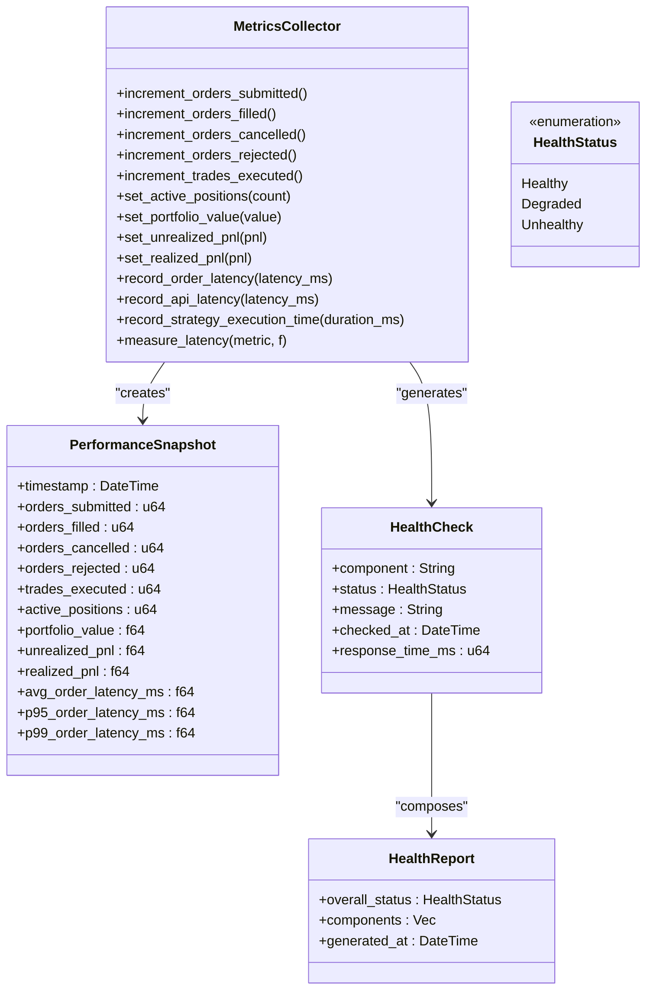
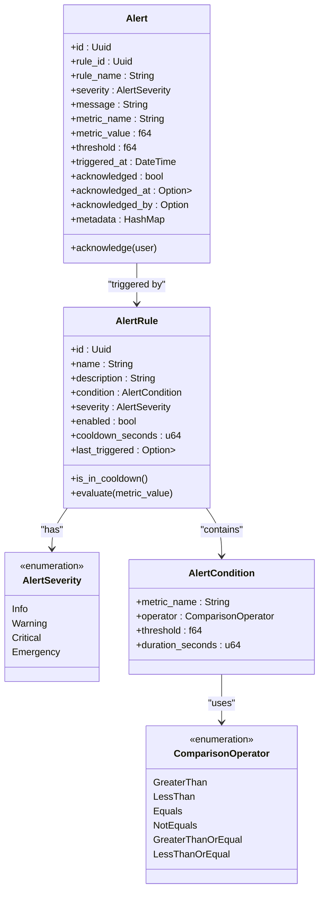
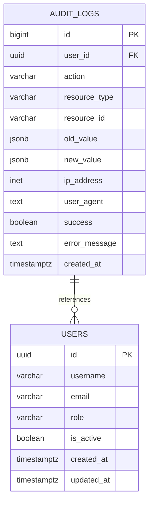
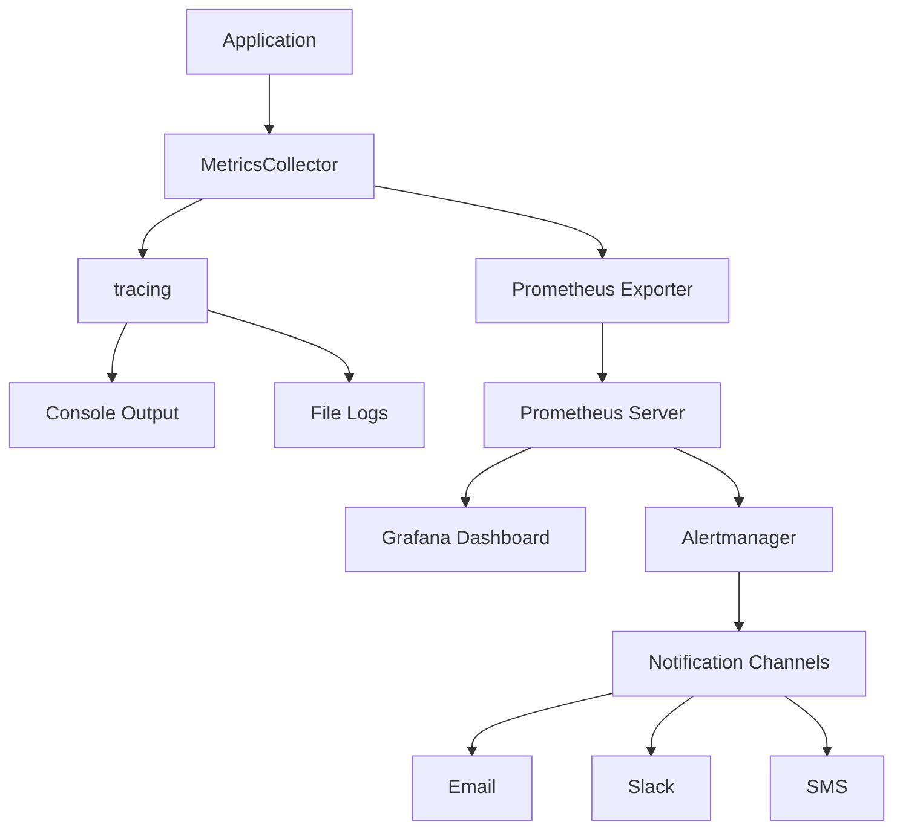
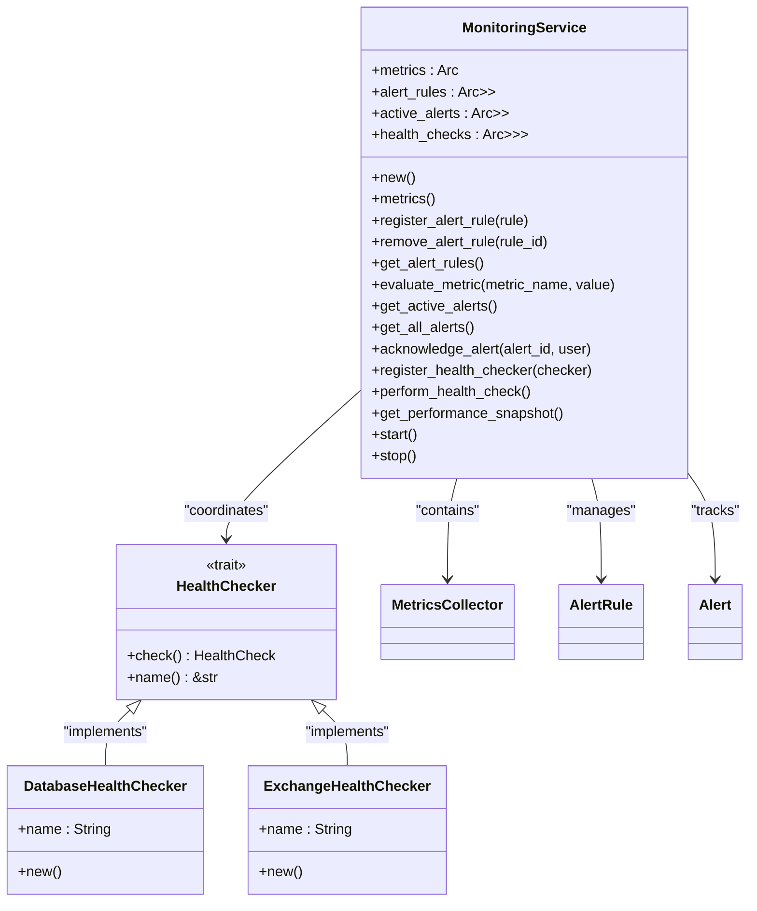

# Monitoring System

<cite>
**Referenced Files in This Document**   
- [lib.rs](file://crates/monitoring/src/lib.rs)
- [metrics.rs](file://crates/monitoring/src/metrics.rs)
- [alerts.rs](file://crates/monitoring/src/alerts.rs)
- [service.rs](file://crates/monitoring/src/service.rs)
- [Cargo.toml](file://crates/monitoring/Cargo.toml)
- [001_initial_schema.sql](file://migrations/001_initial_schema.sql)
</cite>

## Table of Contents
1. [Introduction](#introduction)
2. [Metrics Collection Framework](#metrics-collection-framework)
3. [Alerting System](#alerting-system)
4. [Audit Trail](#audit-trail)
5. [Integration with External Monitoring Tools](#integration-with-external-monitoring-tools)
6. [Monitoring Service Implementation](#monitoring-service-implementation)
7. [Common Alerts and Resolution Procedures](#common-alerts-and-resolution-procedures)
8. [Performance Impact and Optimization Strategies](#performance-impact-and-optimization-strategies)
9. [Conclusion](#conclusion)

## Introduction
The monitoring system in the EA OKX trading platform provides comprehensive oversight of system performance, health, and operational metrics. It consists of three main components: metrics collection, alerting, and audit trails. The system is designed to track critical performance indicators such as CPU usage, memory consumption, network latency, and event processing rates. It also implements a sophisticated alerting mechanism with configurable severity levels and notification capabilities. The monitoring infrastructure is integrated with external tools through standard metrics export protocols and maintains a detailed audit trail for compliance and debugging purposes.

## Metrics Collection Framework
The metrics collection framework tracks system performance across multiple dimensions including trading operations, system health, and component responsiveness. The framework uses a combination of counters, gauges, and histograms to capture different types of metrics.

**Diagram sources**
- [metrics.rs](file://crates/monitoring/src/metrics.rs#L96-L232)

**Section sources**
- [metrics.rs](file://crates/monitoring/src/metrics.rs#L96-L232)
- [service.rs](file://crates/monitoring/src/service.rs#L145-L161)

The MetricsCollector class serves as the primary interface for recording system metrics. It provides methods for incrementing counters (e.g., orders submitted, trades executed), setting gauge values (e.g., active positions, portfolio value), and recording histogram data (e.g., order latency, API response times). The framework also includes a PerformanceSnapshot class that captures a comprehensive view of system performance at a specific point in time, aggregating key metrics for reporting and analysis.

System health is monitored through periodic health checks that assess the status of critical components such as the database and exchange API. Each health check produces a HealthCheck result indicating whether the component is healthy, degraded, or unhealthy, along with response time metrics. These individual checks are aggregated into a HealthReport that provides an overall assessment of system health.

## Alerting System
The alerting system implements a configurable framework for detecting and responding to anomalous conditions in the trading system. It supports four severity levels that determine the urgency and notification mechanisms for alerts.

**Diagram sources**
- [alerts.rs](file://crates/monitoring/src/alerts.rs#L7-L113)

**Section sources**
- [alerts.rs](file://crates/monitoring/src/alerts.rs#L7-L113)
- [service.rs](file://crates/monitoring/src/service.rs#L61-L87)

The alerting system is built around AlertRule objects that define conditions under which alerts should be triggered. Each rule specifies a metric name, comparison operator, threshold value, duration requirement, and severity level. When a metric value violates the rule's condition for the specified duration, an Alert is generated and added to the active alerts collection.

The four severity levels serve different purposes:
- **INFO**: Informational alerts that don't require immediate action but provide useful operational insights
- **WARNING**: Conditions that may lead to problems if not addressed, typically requiring monitoring
- **CRITICAL**: Serious issues that require immediate attention to prevent system degradation
- **EMERGENCY**: Severe system failures that demand immediate intervention to maintain operations

Alerts include a cooldown period (default 5 minutes) to prevent alert storms when conditions persist. Each alert can be acknowledged by authorized personnel, which removes it from the active alerts list while preserving it in the system for historical analysis.

## Audit Trail
The audit trail system records significant system events for debugging, compliance, and security purposes. It captures a comprehensive history of user actions, system changes, and critical operations.

**Diagram sources**
- [001_initial_schema.sql](file://migrations/001_initial_schema.sql#L232-L250)

**Section sources**
- [001_initial_schema.sql](file://migrations/001_initial_schema.sql#L232-L250)

The audit trail is implemented as a database table that records key information about each auditable event. Each entry includes the user responsible for the action (if applicable), the type of action performed, the resource affected, the previous and new values (for modifications), the client IP address and user agent, and whether the action was successful. The system also includes triggers that automatically update the "updated_at" timestamp for relevant tables whenever they are modified, providing an additional layer of change tracking.

The audit trail supports compliance requirements by maintaining an immutable record of system activities. It enables debugging by providing context for when and how system state changes occurred. The comprehensive indexing strategy allows for efficient querying by user, resource type, or timestamp, facilitating both real-time monitoring and historical analysis.

## Integration with External Monitoring Tools
The monitoring system integrates with external monitoring tools through standard metrics export protocols. Although the current implementation uses tracing for logging metrics, it is designed to integrate with Prometheus or similar monitoring systems in production environments.

**Diagram sources**
- [Cargo.toml](file://crates/monitoring/Cargo.toml#L21-L22)
- [metrics.rs](file://crates/monitoring/src/metrics.rs#L98-L99)

**Section sources**
- [Cargo.toml](file://crates/monitoring/Cargo.toml#L21-L22)
- [metrics.rs](file://crates/monitoring/src/metrics.rs#L98-L99)

The integration is facilitated by the metrics and metrics-exporter-prometheus dependencies declared in the Cargo.toml file. The MetricsCollector currently uses tracing macros to output metric data, but these can be replaced or supplemented with Prometheus client library calls to expose metrics via HTTP endpoints. This allows external monitoring systems like Prometheus to scrape metrics from the application at regular intervals.

The architecture supports various notification channels through the external monitoring infrastructure. When alerts are triggered, they can be forwarded to Alertmanager (or similar systems) which then dispatch notifications via email, Slack, SMS, or other communication channels based on the alert severity and configuration.

## Monitoring Service Implementation
The MonitoringService class serves as the central coordinator for all monitoring activities, managing metrics collection, alert evaluation, and health checking components.

**Diagram sources**
- [service.rs](file://crates/monitoring/src/service.rs#L12-L17)
- [service.rs](file://crates/monitoring/src/service.rs#L26-L173)

**Section sources**
- [service.rs](file://crates/monitoring/src/service.rs#L12-L173)
- [lib.rs](file://crates/monitoring/src/lib.rs#L54-L55)

The MonitoringService uses thread-safe data structures (Arc and RwLock) to allow concurrent access from multiple threads, which is essential in an asynchronous Rust application. It maintains collections of alert rules and active alerts, allowing for dynamic registration and evaluation of alert conditions. The service also manages a list of health checkers that can be registered to monitor different system components.

Key methods include evaluate_metric() which checks all relevant alert rules when a metric value is reported, and perform_health_check() which executes all registered health checks and aggregates their results. The service also provides methods for acknowledging alerts, which helps prevent alert fatigue by allowing operators to indicate that they are aware of and addressing an issue.

## Common Alerts and Resolution Procedures
The monitoring system is designed to detect and alert on common issues that can affect trading system performance and reliability. Below are examples of typical alerts and recommended resolution procedures.

### High Order Latency Alert
**Condition**: Order latency exceeds 100ms for 60 seconds
**Severity**: WARNING
**Resolution**:
1. Check network connectivity between the trading system and exchange
2. Monitor system resource utilization (CPU, memory, disk I/O)
3. Review recent code deployments or configuration changes
4. Consider failover to backup network connection if available

### High Error Rate Alert
**Condition**: API error rate exceeds 1% for 60 seconds
**Severity**: CRITICAL
**Resolution**:
1. Verify exchange API status and check for service disruptions
2. Review authentication credentials and rate limiting status
3. Check system logs for specific error messages
4. Implement circuit breaker pattern to prevent cascading failures
5. Contact exchange support if issue persists

### Database Performance Degradation Alert
**Condition**: Database response time exceeds 50ms
**Severity**: WARNING
**Resolution**:
1. Check database server resource utilization
2. Review query performance and optimize slow queries
3. Verify connection pool settings
4. Check for long-running transactions or locks
5. Consider scaling database resources if needed

### Exchange API Unresponsive Alert
**Condition**: Exchange API health check fails
**Severity**: EMERGENCY
**Resolution**:
1. Verify network connectivity to exchange endpoints
2. Check exchange status page for known issues
3. Validate API credentials and permissions
4. Implement failover to alternative exchange if available
5. Notify trading team to suspend operations if necessary

**Section sources**
- [alerts.rs](file://crates/monitoring/src/alerts.rs#L148-L214)
- [service.rs](file://crates/monitoring/src/service.rs#L270-L373)

## Performance Impact and Optimization Strategies
The monitoring system is designed to minimize performance impact on the core trading operations while still providing comprehensive oversight. Several strategies are employed to optimize the performance of monitoring activities.

### Performance Considerations
The current implementation uses tracing for metrics output, which has minimal overhead compared to direct metrics export. The MetricsCollector methods are designed to be lightweight and non-blocking, ensuring they don't interfere with time-sensitive trading operations. The use of Arc (atomic reference counting) allows for efficient sharing of the metrics collector across threads without requiring expensive cloning operations.

Health checks are performed asynchronously and can be scheduled during periods of lower system load to minimize impact on trading performance. The alert evaluation process is optimized by indexing alert rules by metric name, so only relevant rules are evaluated when a specific metric is updated.

### Optimization Strategies
1. **Batch Processing**: Metrics can be batched and processed in bulk rather than individually to reduce overhead
2. **Sampling**: For high-frequency metrics, statistical sampling can be used instead of recording every data point
3. **Asynchronous Processing**: All monitoring operations are designed to be non-blocking and can be offloaded to background threads
4. **Efficient Data Structures**: The use of HashMaps and Vec collections with appropriate pre-allocation minimizes memory allocation overhead
5. **Conditional Evaluation**: Alert rules include cooldown periods and can be disabled when not needed, reducing unnecessary computation

The system also provides the measure_latency() helper method that can wrap any function call to automatically record execution time, enabling performance monitoring without requiring extensive code changes.

**Section sources**
- [metrics.rs](file://crates/monitoring/src/metrics.rs#L190-L207)
- [service.rs](file://crates/monitoring/src/service.rs#L61-L87)

## Conclusion
The monitoring system in the EA OKX trading platform provides a comprehensive framework for tracking system performance, detecting issues, and maintaining operational visibility. The architecture balances thorough monitoring with performance considerations, using efficient data structures and asynchronous processing to minimize impact on trading operations.

Key strengths of the system include its modular design, flexible alerting framework, and integration with standard monitoring tools. The audit trail provides essential compliance and debugging capabilities, while the health checking system ensures system reliability. The implementation is production-ready and can be extended to support additional metrics, alert types, and integration points as needed.

Future enhancements could include more sophisticated anomaly detection using statistical methods, integration with machine learning models for predictive monitoring, and enhanced visualization capabilities through the frontend interface.