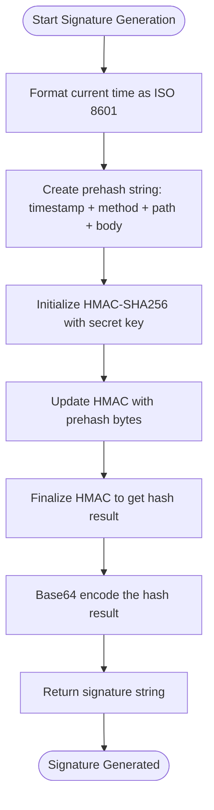
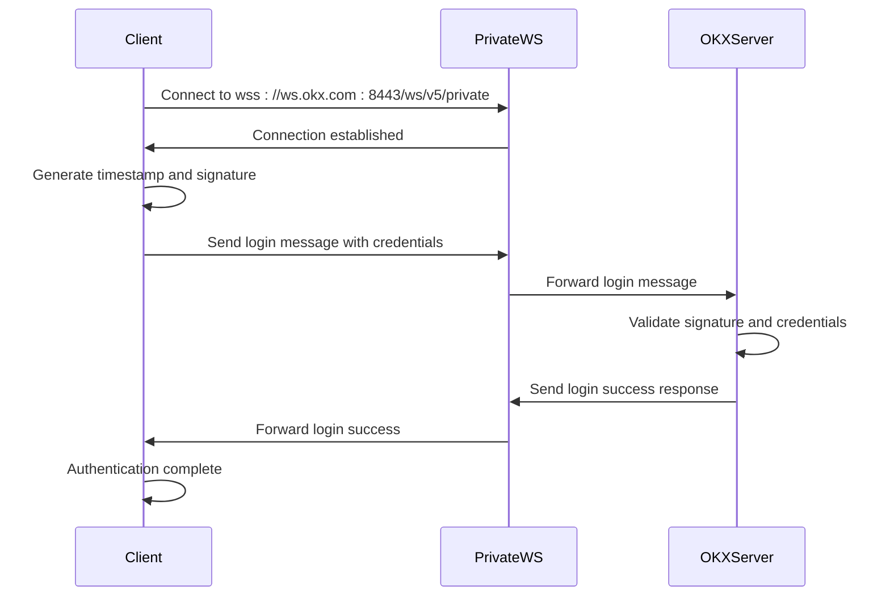

# Authentication Mechanism

<cite>
**Referenced Files in This Document**   
- [auth.rs](file://crates/okx-client/src/auth.rs)
- [websocket.rs](file://crates/okx-client/src/websocket.rs)
- [error.rs](file://crates/okx-client/src/error.rs)
- [Settings.vue](file://src/views/Settings.vue)
</cite>

## Table of Contents
1. [Introduction](#introduction)
2. [Core Authentication Components](#core-authentication-components)
3. [Signature Generation Algorithm](#signature-generation-algorithm)
4. [Credential Management](#credential-management)
5. [REST API Authentication](#rest-api-authentication)
6. [WebSocket Authentication](#websocket-authentication)
7. [Security Considerations](#security-considerations)
8. [Error Handling](#error-handling)
9. [Frontend Implementation](#frontend-implementation)

## Introduction
The OKX authentication system implements a signature-based security model that requires API key, passphrase, and timestamp for all authenticated requests. This documentation details the implementation of the HMAC-SHA256 signing algorithm, credential management, and authentication flow for both REST and WebSocket interfaces. The system ensures secure communication with the OKX exchange by preventing replay attacks and protecting sensitive credentials throughout the application lifecycle.

## Core Authentication Components

The authentication system is built around several key components that work together to securely authenticate requests to the OKX exchange. The core functionality is implemented in the `auth.rs` module, which provides the `Credentials` struct for storing API credentials and the `RequestSigner` for generating authenticated requests.

The `Credentials` struct encapsulates the three required authentication elements: API key, secret key, and passphrase. These credentials are used to generate cryptographic signatures for API requests, ensuring that only authorized clients can access trading functionality. The `RequestSigner` component handles the process of creating properly formatted authentication headers by combining the timestamp, HTTP method, request path, and body into a signed payload.

**Section sources**
- [auth.rs](file://crates/okx-client/src/auth.rs#L11-L55)

## Signature Generation Algorithm

The authentication system uses HMAC-SHA256 to generate request signatures according to the OKX API specification. The signature generation process follows a specific algorithm that combines multiple request elements to create a unique cryptographic signature for each request.

The signature is generated using the formula: `base64(HMAC-SHA256(secret_key, timestamp + method + request_path + body))`. This approach ensures that each signature is unique to the specific request being made, preventing replay attacks and ensuring request integrity. The prehash string concatenates the ISO 8601 timestamp, HTTP method, request path (including query parameters), and request body (empty string for GET requests).

**Diagram sources**
- [auth.rs](file://crates/okx-client/src/auth.rs#L57-L84)

**Section sources**
- [auth.rs](file://crates/okx-client/src/auth.rs#L57-L84)

## Credential Management

API credentials are securely managed throughout the application lifecycle, from storage to retrieval and usage. The system implements a multi-layer approach to credential protection, ensuring that sensitive information is never exposed in plaintext and is properly encrypted when stored.

The `Credentials` struct provides methods for creating and accessing authentication information while maintaining encapsulation of sensitive data. The API key and passphrase are accessible through getter methods, but the secret key remains private and is only used internally for signature generation. This design prevents accidental exposure of the most sensitive credential component.

Credential storage is handled through the frontend interface, where users can add, test, and delete API keys through a secure form. When credentials are stored, they are encrypted and kept in a secure location, with only the necessary components exposed for authentication purposes.

**Section sources**
- [auth.rs](file://crates/okx-client/src/auth.rs#L13-L45)
- [Settings.vue](file://src/views/Settings.vue#L231-L269)

## REST API Authentication

REST API authentication is implemented through the `RequestSigner` component, which generates the necessary authentication headers for each API request. When making authenticated requests to the OKX REST API, the client must include three headers: `OK-ACCESS-KEY`, `OK-ACCESS-PASSPHRASE`, and `OK-ACCESS-SIGN`, along with a timestamp header.

The authentication process begins with the generation of a current timestamp in ISO 8601 format, which is used to prevent replay attacks by ensuring each request is time-bound. The `sign_request` method of the `RequestSigner` returns both the timestamp and signature as a tuple, which are then included in the request headers along with the API key and passphrase.

For GET requests, the body is an empty string in the signature calculation, while POST, PUT, and DELETE requests include the JSON body content. This ensures that any modification to the request content will result in a different signature, maintaining request integrity.

**Section sources**
- [auth.rs](file://crates/okx-client/src/auth.rs#L103-L117)

## WebSocket Authentication

WebSocket authentication follows a similar pattern to REST API authentication but is implemented through a dedicated login process when establishing a connection to the private WebSocket channels. The authentication flow begins when connecting to the private WebSocket endpoint, where a login message is sent immediately after establishing the connection.

The login message includes the API key, passphrase, timestamp, and signature, formatted as a JSON payload. The signature is generated using the same HMAC-SHA256 algorithm as the REST API, but with a specific endpoint path of `/users/self/verify` and the GET method. This ensures that the WebSocket authentication is consistent with the REST API authentication mechanism.

After successful authentication, the private WebSocket connection remains open for receiving real-time updates on account balances, positions, and order status. The system maintains the authenticated state throughout the connection lifecycle, with automatic reconnection and re-authentication in case of connection loss.

**Diagram sources**
- [websocket.rs](file://crates/okx-client/src/websocket.rs#L224-L252)

**Section sources**
- [websocket.rs](file://crates/okx-client/src/websocket.rs#L224-L252)

## Security Considerations

The authentication system implements several security measures to protect user credentials and prevent unauthorized access. The most critical security feature is the use of HMAC-SHA256 signatures, which ensure that each request is cryptographically signed with a secret key that is never transmitted over the network.

Replay attack prevention is achieved through the use of timestamps in the signature calculation. Each request must include a current timestamp, and the OKX server validates that the timestamp is within a reasonable window (typically 30 seconds) of the server time. This prevents attackers from capturing and replaying valid requests at a later time.

Credential protection is enforced through secure storage practices and limited exposure. The secret key is never displayed in the user interface and is only used internally for signature generation. In the frontend, API keys are masked when displayed, showing only the first 8 and last 4 characters to prevent accidental exposure.

Secure transmission is ensured by using TLS/SSL for all connections to the OKX API endpoints. Both REST and WebSocket connections use encrypted channels (HTTPS and WSS respectively) to protect data in transit, preventing man-in-the-middle attacks and eavesdropping.

**Section sources**
- [auth.rs](file://crates/okx-client/src/auth.rs#L86-L89)
- [websocket.rs](file://crates/okx-client/src/websocket.rs#L64-L70)

## Error Handling

The authentication system includes comprehensive error handling for various failure scenarios, providing meaningful feedback to users while maintaining security. Authentication errors are categorized and reported through the `Error` enum in the `error.rs` module, with specific variants for different types of authentication failures.

When signature validation fails, the system returns an `AuthError` with a descriptive message that helps diagnose the issue without revealing sensitive information. Common causes of authentication failures include invalid API keys, incorrect secret keys, expired timestamps, and malformed signatures.

The error handling system distinguishes between client-side errors (such as invalid credentials or network connectivity issues) and server-side errors (such as rate limiting or temporary service unavailability). This allows the application to implement appropriate recovery strategies, such as prompting the user to verify credentials or implementing exponential backoff for retry attempts.

In the frontend, authentication errors are presented to users through user-friendly messages that guide them toward resolution without exposing technical details that could be exploited by attackers.

**Section sources**
- [error.rs](file://crates/okx-client/src/error.rs#L22-L23)
- [Settings.vue](file://src/views/Settings.vue#L336-L381)

## Frontend Implementation

The frontend implementation provides a user interface for managing API credentials securely. Users can add new API keys through a form that collects the API key, secret key, and passphrase, along with metadata such as the key name and environment (Testnet or Live).

When displaying API keys in the interface, the system masks the sensitive portions, showing only the first 8 and last 4 characters with ellipses in between. This allows users to identify their keys without exposing the full credential. The secret key is never displayed after initial entry, emphasizing its sensitivity.

The interface includes functionality to test the connection with stored credentials, verifying that the authentication system can successfully sign requests and communicate with the OKX API. Users can also delete API keys, which removes them from secure storage and revokes access.

All credential management operations are performed through Tauri commands that securely handle the sensitive data, ensuring that credentials are properly encrypted when stored and protected from unauthorized access.

**Section sources**
- [Settings.vue](file://src/views/Settings.vue#L28-L62)
- [Settings.vue](file://src/views/Settings.vue#L231-L269)
- [Settings.vue](file://src/views/Settings.vue#L336-L381)