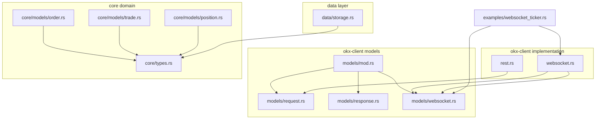
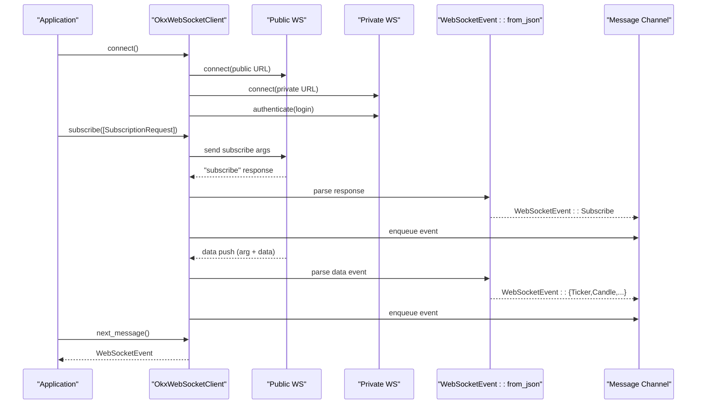
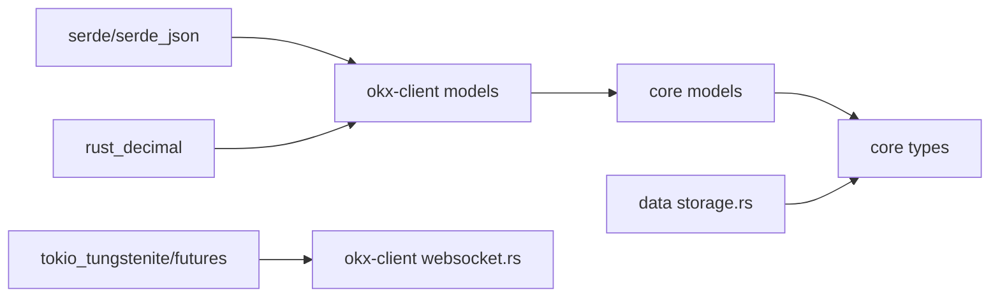

# Data Models

<cite>
**Referenced Files in This Document**
- [mod.rs](file://crates/okx-client/src/models/mod.rs)
- [request.rs](file://crates/okx-client/src/models/request.rs)
- [response.rs](file://crates/okx-client/src/models/response.rs)
- [websocket.rs](file://crates/okx-client/src/models/websocket.rs)
- [rest.rs](file://crates/okx-client/src/rest.rs)
- [websocket_impl.rs](file://crates/okx-client/src/websocket.rs)
- [error.rs](file://crates/okx-client/src/error.rs)
- [order.rs](file://crates/core/src/models/order.rs)
- [trade.rs](file://crates/core/src/models/trade.rs)
- [position.rs](file://crates/core/src/models/position.rs)
- [types.rs](file://crates/core/src/types.rs)
- [storage.rs](file://crates/data/src/storage.rs)
- [websocket_ticker_example.rs](file://examples/websocket_ticker.rs)
</cite>

## Table of Contents
1. [Introduction](#introduction)
2. [Project Structure](#project-structure)
3. [Core Components](#core-components)
4. [Architecture Overview](#architecture-overview)
5. [Detailed Component Analysis](#detailed-component-analysis)
6. [Dependency Analysis](#dependency-analysis)
7. [Performance Considerations](#performance-considerations)
8. [Troubleshooting Guide](#troubleshooting-guide)
9. [Conclusion](#conclusion)
10. [Appendices](#appendices)

## Introduction
This document provides comprehensive data model documentation for the OKX client. It covers REST and WebSocket request/response models, market data messages (tickers, candles, trades), order requests, account information, and private channel updates. It explains the mapping between OKX API specifications and Rust domain types, details serialization/deserialization using serde, and describes how incoming data is transformed into internal domain events. It also addresses type safety, error handling for malformed responses, and the relationship between these models and the core domain models in the system.

## Project Structure
The OKX client data models live under the okx-client crate and are organized into modules for request, response, and WebSocket message handling. The core domain models reside in the core crate and define the internal types used throughout the system.

**Diagram sources**
- [mod.rs](file://crates/okx-client/src/models/mod.rs#L1-L10)
- [request.rs](file://crates/okx-client/src/models/request.rs#L1-L48)
- [response.rs](file://crates/okx-client/src/models/response.rs#L1-L39)
- [websocket.rs](file://crates/okx-client/src/models/websocket.rs#L1-L648)
- [rest.rs](file://crates/okx-client/src/rest.rs#L1-L10)
- [websocket_impl.rs](file://crates/okx-client/src/websocket.rs#L1-L612)
- [order.rs](file://crates/core/src/models/order.rs#L1-L383)
- [trade.rs](file://crates/core/src/models/trade.rs#L1-L227)
- [position.rs](file://crates/core/src/models/position.rs#L1-L232)
- [types.rs](file://crates/core/src/types.rs#L1-L292)
- [storage.rs](file://crates/data/src/storage.rs#L1-L55)
- [websocket_ticker_example.rs](file://examples/websocket_ticker.rs#L1-L149)

**Section sources**
- [mod.rs](file://crates/okx-client/src/models/mod.rs#L1-L10)
- [websocket_impl.rs](file://crates/okx-client/src/websocket.rs#L1-L120)

## Core Components
- Request models: PlaceOrderRequest and CancelOrderRequest for REST order operations.
- Response models: ApiResponse wrapper and OrderResponse for REST responses.
- WebSocket models: Channel enumeration, SubscriptionRequest, WebSocketEvent, and data structures for tickers, candles, order book, trades, and private account/position/order updates.
- Core domain models: Order, Trade, Position, and shared types (Symbol, Price, Quantity, Decimal) used for internal representation and type safety.

Key characteristics:
- Serde-driven serialization/deserialization with explicit field naming and optional fields.
- Decimal-based numeric types for precise financial calculations.
- Strong typing for enums (OrderSide, OrderType, OrderStatus, PositionSide) with FromStr conversions.
- WebSocketEvent parsing with robust error handling for malformed messages.

**Section sources**
- [request.rs](file://crates/okx-client/src/models/request.rs#L1-L48)
- [response.rs](file://crates/okx-client/src/models/response.rs#L1-L39)
- [websocket.rs](file://crates/okx-client/src/models/websocket.rs#L1-L265)
- [order.rs](file://crates/core/src/models/order.rs#L1-L120)
- [trade.rs](file://crates/core/src/models/trade.rs#L1-L56)
- [position.rs](file://crates/core/src/models/position.rs#L1-L31)
- [types.rs](file://crates/core/src/types.rs#L1-L115)

## Architecture Overview
The OKX client exposes two primary integration surfaces:
- REST API: modeled by request/response wrappers and used for order placement/cancellation and other REST endpoints.
- WebSocket API: modeled by channel subscriptions and event parsing, delivering real-time market data and private updates.

**Diagram sources**
- [websocket_impl.rs](file://crates/okx-client/src/websocket.rs#L168-L252)
- [websocket_impl.rs](file://crates/okx-client/src/websocket.rs#L306-L368)
- [websocket_impl.rs](file://crates/okx-client/src/websocket.rs#L493-L536)
- [websocket.rs](file://crates/okx-client/src/models/websocket.rs#L153-L265)

## Detailed Component Analysis

### REST Request Models
- PlaceOrderRequest: Encapsulates instrument ID, trade mode, side, order type, size, optional price, and optional client order ID. Uses camelCase serialization and skips serializing absent optional fields.
- CancelOrderRequest: Encapsulates instrument ID and either order ID or client order ID (one required).

Usage:
- Construct request objects and serialize to JSON for REST endpoints.
- Client-side validation should ensure required fields are present before sending.

**Section sources**
- [request.rs](file://crates/okx-client/src/models/request.rs#L1-L48)

### REST Response Models
- ApiResponse<T>: Generic wrapper with code, msg, and data vector. Provides is_success() convenience method.
- OrderResponse: Describes order state returned by REST order endpoints.

Usage:
- Wrap REST responses with ApiResponse and check code before accessing data.
- Extract OrderResponse to update internal order state.

**Section sources**
- [response.rs](file://crates/okx-client/src/models/response.rs#L1-L39)

### WebSocket Models and Parsing
- Channel: Enumerates public and private channels (tickers, candles, books, trades, account, positions, orders, balance_and_position). Includes helpers to check public/private and convert to string names.
- SubscriptionRequest: Holds channel and optional instrument ID, with conversion to JSON for subscription/unsubscription.
- WebSocketEvent: Discriminated union of subscribe/unsubscribe/error/login responses and data events (ticker, candle, order book, trade, account, position, order). Includes from_json() parser that validates presence of event or arg/data and routes to appropriate deserialization.

Parsing logic highlights:
- Response events: subscribe, unsubscribe, error, login are parsed into structured variants with error handling for missing fields.
- Data events: arg.channel determines the data type; data is deserialized into the corresponding struct.
- Unknown channel or invalid JSON yields ParseError.

**Section sources**
- [websocket.rs](file://crates/okx-client/src/models/websocket.rs#L1-L152)
- [websocket.rs](file://crates/okx-client/src/models/websocket.rs#L153-L265)

### Market Data Messages
- TickerData: Fields include instrument type, instrument ID, last price/side sizes, bid/ask prices/sizes, 24h open/high/low, 24h volumes (currency and base), timestamps, and optional SOD fields.
- CandleData: Fields include timestamp (ms), OHLC, base/quote volumes, optional USD volume, and confirm flag. Includes parse() to produce ParsedCandle with typed values (i64 timestamp, Decimal prices/volumes, boolean is_confirmed).
- OrderBookData: Contains asks/bids arrays, timestamp, optional checksum, previous/sequence IDs.
- BookLevel: Tuple-like structure representing [price, quantity, deprecated, num_orders] with helper methods to parse Decimal price and quantity and u32 num_orders.
- TradeData: Fields include instrument ID, trade ID, price, quantity, side, timestamp, and optional count.

Transformation to internal domain:
- TickerData and CandleData are consumed by higher layers to construct internal market data records (e.g., Candle and Tick in the data layer).
- OrderBookData and TradeData feed order book and recent trade streams used by strategies and analytics.

**Section sources**
- [websocket.rs](file://crates/okx-client/src/models/websocket.rs#L267-L543)
- [storage.rs](file://crates/data/src/storage.rs#L1-L55)

### Private Channel Updates
- AccountData: Includes update time, total equity, optional ISO equity, adjusted equity, order frozen funds, initial/maintenance margins, notional USD, margin ratio, and details per currency.
- AccountDetail: Per-currency fields including available balances, frozen balances, order frozen, liabilities, unrealized PnL, interest, max loan, and more.
- PositionData: Instrument type/ID, margin mode, position ID, side, position size, available position, average price, unrealized PnL, ratios, notional USD, ADL, liquidation price, mark price, margins, interest, trade ID, opt val, pending close liabilities, timestamps.
- OrderData: Instrument type/ID, optional currency, order IDs, tag, price/size, fills (fill price/size, accumulated fill size, fill time, average fill price), state, trade mode, fees/rebates, category, timestamps, and optional fields for trailing stops and attachments.

Mapping to domain:
- These structures inform internal Order, Trade, and Position updates. For example, OrderData informs Order lifecycle transitions and fills; PositionData informs Position updates; AccountData informs account-level metrics.

**Section sources**
- [websocket.rs](file://crates/okx-client/src/models/websocket.rs#L418-L543)
- [order.rs](file://crates/core/src/models/order.rs#L94-L151)
- [trade.rs](file://crates/core/src/models/trade.rs#L1-L56)
- [position.rs](file://crates/core/src/models/position.rs#L32-L77)

### Relationship Between OKX Models and Core Domain Types
- Symbol: Represents trading pairs like BTC-USDT and enforces format validation.
- Price and Quantity: Strongly typed wrappers around Decimal with validation (positive price, non-negative quantity).
- Order, Trade, Position: Core domain entities enriched with timestamps, identifiers, and computed fields.

Mapping examples:
- OKX instrument IDs map to Symbol.
- OKX price/quantity strings are parsed into Price and Quantity for internal computations.
- OKX order states and sides/types are mapped to OrderStatus, OrderSide, OrderType enums.
- OKX position sides map to PositionSide.

**Section sources**
- [types.rs](file://crates/core/src/types.rs#L1-L115)
- [order.rs](file://crates/core/src/models/order.rs#L1-L93)
- [trade.rs](file://crates/core/src/models/trade.rs#L1-L56)
- [position.rs](file://crates/core/src/models/position.rs#L1-L31)

### Serialization/Demotion Implementation Using serde
- Request models: camelCase serialization and conditional omission of optional fields.
- Response models: camelCase deserialization and default handling for empty data arrays.
- WebSocket models: camelCase for data fields; kebab-case for channel names; rename-all for specific candle intervals; explicit field renames for ts/o/h/l/c/vol/volCcy/volCcyQuote/confirm.
- Parsing: from_json() performs event vs data routing and uses serde_json::from_value for typed deserialization, returning custom errors on failure.

Type safety:
- Enums derive FromStr with explicit error mapping for invalid values.
- Decimal-based types enforce non-negative quantities and positive prices.
- Optional fields are represented as Option<T> to handle missing data gracefully.

**Section sources**
- [request.rs](file://crates/okx-client/src/models/request.rs#L1-L48)
- [response.rs](file://crates/okx-client/src/models/response.rs#L1-L39)
- [websocket.rs](file://crates/okx-client/src/models/websocket.rs#L1-L152)
- [websocket.rs](file://crates/okx-client/src/models/websocket.rs#L153-L265)
- [types.rs](file://crates/core/src/types.rs#L86-L160)

### Examples of Incoming Data Transformation into Internal Domain Events
- WebSocket ticker example demonstrates receiving WebSocketEvent::Ticker and logging key fields. The example shows how to parse candle data via CandleData::parse() and log typed values.
- The client’s message processor converts raw WebSocket frames into WebSocketEvent and enqueues them for consumption by the application.

Practical transformation steps:
- Parse JSON payload into WebSocketEvent.
- Match on event type and extract typed data.
- Convert strings to Decimal/numeric types using helper methods or parse().
- Map OKX enums to core enums (e.g., OrderSide, OrderType).
- Construct internal domain entities (Order, Trade, Position) and publish domain events.

**Section sources**
- [websocket_ticker_example.rs](file://examples/websocket_ticker.rs#L83-L140)
- [websocket_impl.rs](file://crates/okx-client/src/websocket.rs#L493-L536)
- [websocket.rs](file://crates/okx-client/src/models/websocket.rs#L321-L365)

## Dependency Analysis
- okx-client models depend on serde and serde_json for serialization/deserialization and on rust_decimal for precise numeric handling.
- okx-client websocket implementation depends on tokio_tungstenite for WebSocket transport and futures for async stream handling.
- Core domain models depend on rust_decimal, chrono, uuid, and serde for type-safe numeric computation, time handling, identifiers, and serialization.
- Data layer models depend on core types for consistent representation of prices and quantities.

**Diagram sources**
- [websocket.rs](file://crates/okx-client/src/models/websocket.rs#L1-L648)
- [websocket_impl.rs](file://crates/okx-client/src/websocket.rs#L1-L120)
- [order.rs](file://crates/core/src/models/order.rs#L1-L93)
- [trade.rs](file://crates/core/src/models/trade.rs#L1-L56)
- [position.rs](file://crates/core/src/models/position.rs#L1-L31)
- [types.rs](file://crates/core/src/types.rs#L1-L115)
- [storage.rs](file://crates/data/src/storage.rs#L1-L55)

**Section sources**
- [websocket_impl.rs](file://crates/okx-client/src/websocket.rs#L1-L120)
- [order.rs](file://crates/core/src/models/order.rs#L1-L93)
- [trade.rs](file://crates/core/src/models/trade.rs#L1-L56)
- [position.rs](file://crates/core/src/models/position.rs#L1-L31)
- [types.rs](file://crates/core/src/types.rs#L1-L115)
- [storage.rs](file://crates/data/src/storage.rs#L1-L55)

## Performance Considerations
- Prefer Decimal arithmetic for financial computations to avoid floating-point drift.
- Minimize allocations by reusing buffers and avoiding unnecessary cloning of large structures.
- Use efficient parsing helpers (e.g., BookLevel methods) to convert strings to typed values.
- Batch WebSocket messages when appropriate and apply backpressure if the consumer cannot keep up.
- Avoid excessive reconnections by tuning heartbeat and pong timeouts.

[No sources needed since this section provides general guidance]

## Troubleshooting Guide
Common issues and remedies:
- Parse errors: WebSocketEvent::from_json() returns ParseError for invalid JSON, missing fields, or unknown channels. Validate message structure and ensure correct field names.
- Authentication failures: Login events with non-zero codes indicate authentication errors; check API keys, passphrase, and timestamp/signature generation.
- Subscription errors: Subscribe/unsubscribe responses with non-zero codes indicate subscription problems; verify channel names and instrument IDs.
- Malformed numeric strings: Use helper methods (e.g., BookLevel::price(), BookLevel::quantity(), CandleData::parse()) to convert strings to Decimal/u32; handle parse errors explicitly.
- Network connectivity: Monitor connection state and reconnection attempts; adjust WebSocketConfig for heartbeat and timeouts.

**Section sources**
- [error.rs](file://crates/okx-client/src/error.rs#L1-L62)
- [websocket_impl.rs](file://crates/okx-client/src/websocket.rs#L224-L252)
- [websocket.rs](file://crates/okx-client/src/models/websocket.rs#L153-L265)

## Conclusion
The OKX client data models provide a robust, type-safe foundation for integrating with OKX’s REST and WebSocket APIs. Serde-driven serialization/deserialization ensures compatibility with OKX’s field naming conventions, while strong typing and validation protect against malformed data. The models cleanly map to the core domain, enabling reliable transformation of market data and private updates into internal domain events. Proper error handling and configuration support resilience in production environments.

[No sources needed since this section summarizes without analyzing specific files]

## Appendices

### Appendix A: Channel Reference
- Public channels: tickers, candle1m/candle5m/candle15m/candle1h/candle4h/candle1d, books5, books50, books-l2-tbt, trades.
- Private channels: account, positions, orders, balance_and_position.

**Section sources**
- [websocket.rs](file://crates/okx-client/src/models/websocket.rs#L11-L75)

### Appendix B: Example Workflow: Ticker and Candle Processing
- Connect to WebSocket, authenticate private channel, subscribe to tickers and candles.
- Consume WebSocketEvent messages; parse candle data via CandleData::parse(); log typed values.

**Section sources**
- [websocket_ticker_example.rs](file://examples/websocket_ticker.rs#L55-L140)
- [websocket_impl.rs](file://crates/okx-client/src/websocket.rs#L168-L252)