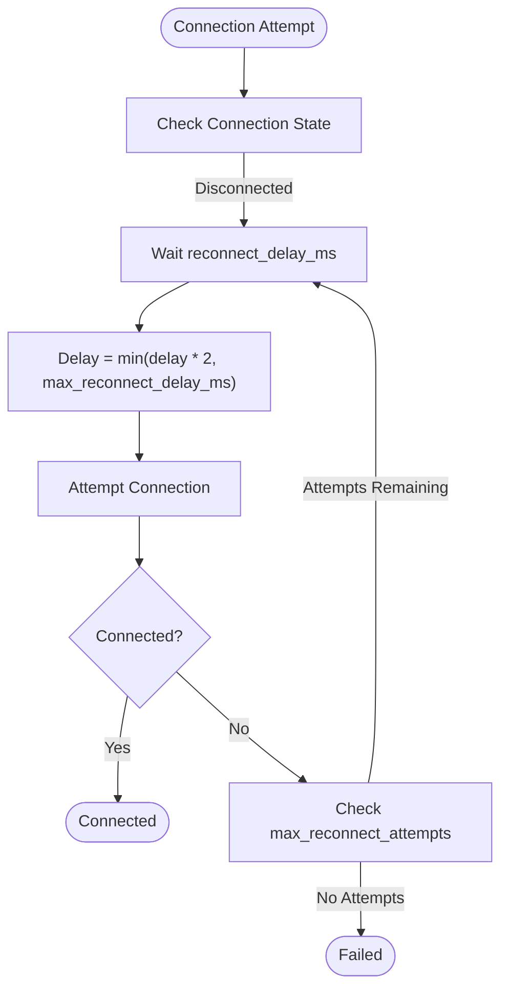
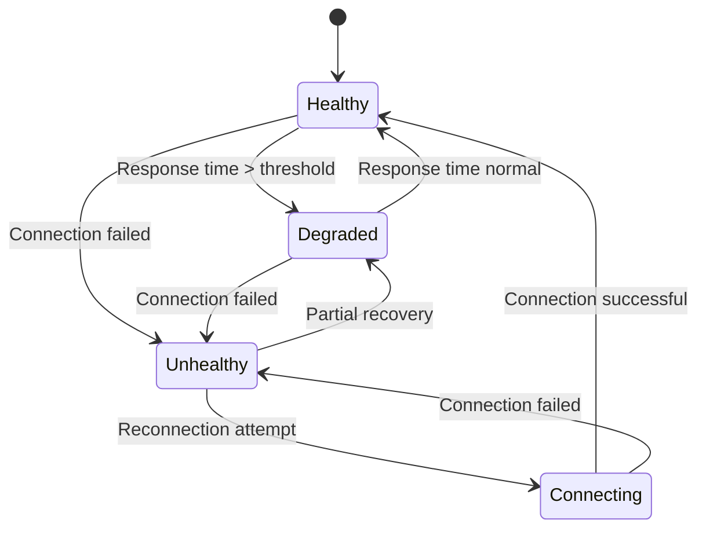
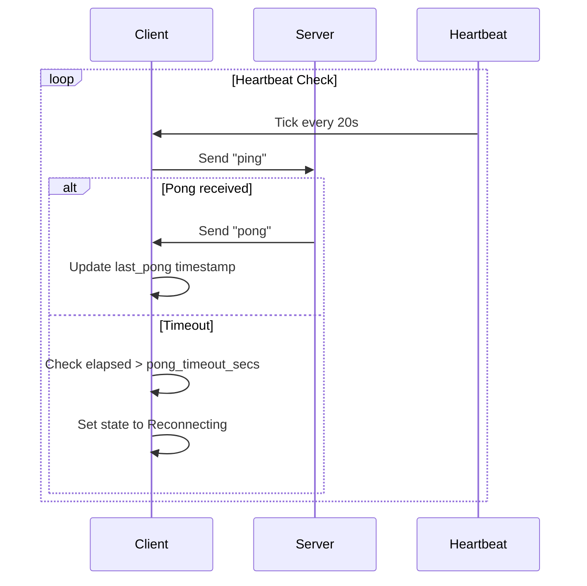
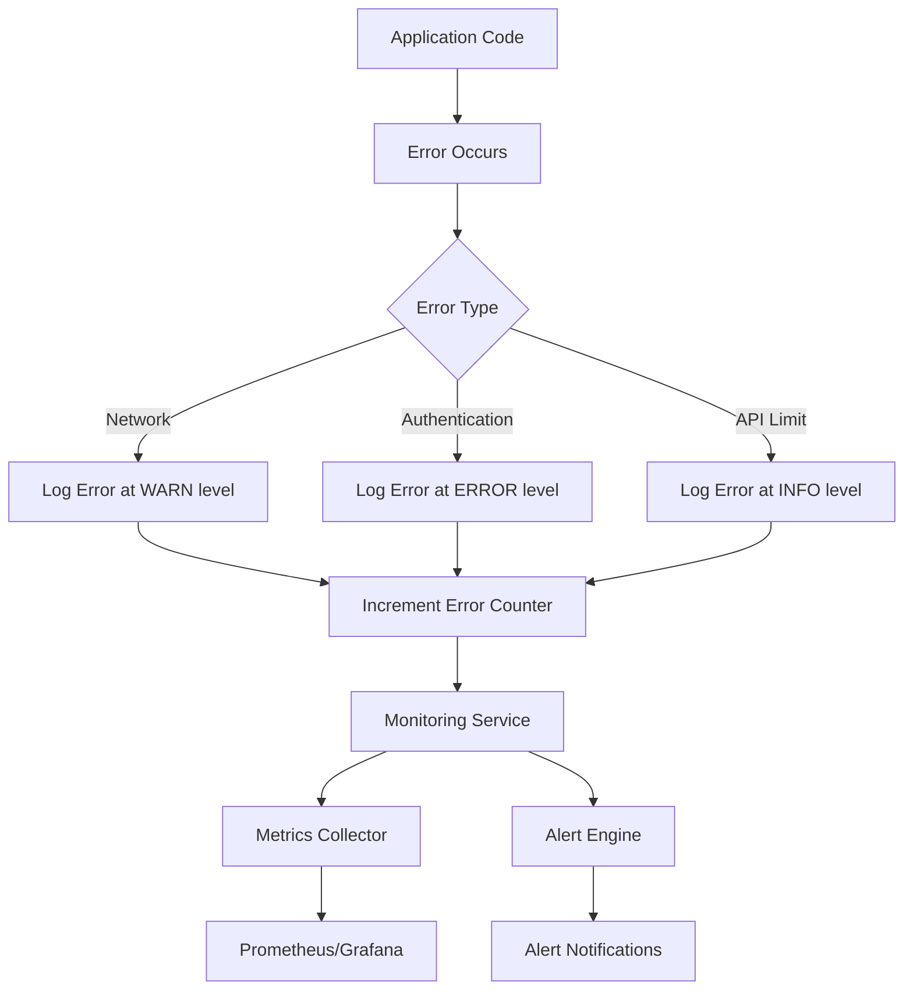

# Error Handling and Retry

<cite>
**Referenced Files in This Document**   
- [error.rs](file://crates/okx-client/src/error.rs)
- [websocket.rs](file://crates/okx-client/src/websocket.rs)
- [auth.rs](file://crates/okx-client/src/auth.rs)
- [rest.rs](file://crates/okx-client/src/rest.rs)
- [models/response.rs](file://crates/okx-client/src/models/response.rs)
- [monitoring/service.rs](file://crates/monitoring/src/service.rs)
- [monitoring/metrics.rs](file://crates/monitoring/src/metrics.rs)
- [order_manager.rs](file://crates/trading/src/order_manager.rs)
- [websocket_ticker.rs](file://examples/websocket_ticker.rs)
</cite>

## Table of Contents
1. [Introduction](#introduction)
2. [Error Types and Classification](#error-types-and-classification)
3. [Error Propagation Strategy](#error-propagation-strategy)
4. [Retry Mechanisms](#retry-mechanisms)
5. [Circuit Breaker Implementation](#circuit-breaker-implementation)
6. [WebSocket Error Handling](#websocket-error-handling)
7. [REST API Error Handling](#rest-api-error-handling)
8. [Logging and Monitoring Integration](#logging-and-monitoring-integration)
9. [Rate Limit and Service Unavailability Handling](#rate-limit-and-service-unavailability-handling)
10. [Best Practices](#best-practices)

## Introduction
The OKX client implements a comprehensive error handling and retry system designed to maintain reliability during exchange connectivity issues, network problems, and temporary service outages. This documentation details the various error types, propagation strategies, retry mechanisms, and monitoring integrations that ensure robust operation in volatile trading environments. The system is designed with resilience in mind, incorporating automatic reconnection, exponential backoff, and health monitoring to prevent cascading failures.

## Error Types and Classification
The OKX client defines a comprehensive error hierarchy in the `error.rs` file, categorizing errors into distinct types for appropriate handling. The `Error` enum includes network errors, protocol errors, authentication issues, and API-specific responses, enabling precise error handling throughout the system.

```mermaid
classDiagram
class Error {
+HttpError(reqwest : : Error)
+WebSocketError(String)
+WebSocketConnection(String)
+WebSocketSend(String)
+ParseError(String)
+AuthError(String)
+RateLimitExceeded(String)
+InvalidResponse(String)
+ApiError{code : String, message : String}
+SerializationError(serde_json : : Error)
+UrlError(url : : ParseError)
+Timeout(String)
+ConnectionError(String)
+Internal(String)
}
```

**Diagram sources**
- [error.rs](file://crates/okx-client/src/error.rs#L5-L48)

**Section sources**
- [error.rs](file://crates/okx-client/src/error.rs#L1-L62)

## Error Propagation Strategy
Errors propagate through the client layers from the transport level up to the application layer, maintaining context and type information. The error system uses the `thiserror` crate to provide transparent error conversion and rich error messages that preserve the original error context. This allows higher-level components to make informed decisions based on the specific error type encountered.

The propagation strategy follows a layered approach:
1. Low-level network and protocol errors are captured and wrapped in appropriate error types
2. API-specific errors are parsed from response bodies and converted to structured error types
3. Domain-specific errors are enriched with contextual information before propagation
4. Errors are exposed to the client code through the `Result<T, Error>` type alias

This approach ensures that error information is preserved throughout the call stack while providing a consistent interface for error handling.

**Section sources**
- [error.rs](file://crates/okx-client/src/error.rs#L50-L51)
- [auth.rs](file://crates/okx-client/src/auth.rs#L3-L4)
- [websocket.rs](file://crates/okx-client/src/websocket.rs#L49-L50)

## Retry Mechanisms
The OKX client implements sophisticated retry logic with configurable policies, exponential backoff, and jitter to handle transient failures. The WebSocket client includes built-in auto-reconnection with exponential backoff, while the trading components implement retry logic for order operations.

The WebSocket configuration includes parameters for controlling reconnection behavior:
- `auto_reconnect`: Enables automatic reconnection attempts
- `max_reconnect_attempts`: Limits the number of reconnection attempts (0 = unlimited)
- `reconnect_delay_ms`: Initial delay between reconnection attempts
- `max_reconnect_delay_ms`: Maximum delay between reconnection attempts



**Diagram sources**
- [websocket.rs](file://crates/okx-client/src/websocket.rs#L81-L108)
- [order_manager.rs](file://crates/trading/src/order_manager.rs#L1-L48)

**Section sources**
- [websocket.rs](file://crates/okx-client/src/websocket.rs#L100-L108)
- [order_manager.rs](file://crates/trading/src/order_manager.rs#L1-L48)

## Circuit Breaker Implementation
While the project documentation indicates circuit breakers are pending implementation, the monitoring system provides the foundation for circuit breaker patterns through health checking and status reporting. The `MonitoringService` coordinates health checks across system components, aggregating their status into a comprehensive health report.

The health checking system uses the `HealthChecker` trait to standardize health assessment across components. Each checker returns a `HealthCheck` with status (Healthy, Degraded, Unhealthy), response time, and diagnostic message. The overall system status is determined by the worst status among all components.



**Diagram sources**
- [service.rs](file://crates/monitoring/src/service.rs#L6-L11)
- [metrics.rs](file://crates/monitoring/src/metrics.rs#L6-L11)

**Section sources**
- [service.rs](file://crates/monitoring/src/service.rs#L1-L374)
- [metrics.rs](file://crates/monitoring/src/metrics.rs#L1-L299)

## WebSocket Error Handling
The WebSocket client implements comprehensive error handling for real-time market data streaming. It manages connection state through the `ConnectionState` enum (Disconnected, Connecting, Connected, Reconnecting, Failed) and handles various WebSocket-specific errors including connection failures, message parsing issues, and authentication problems.

The client implements a heartbeat mechanism with ping-pong messages every 20 seconds and a 30-second pong timeout. If no pong is received within the timeout period, the connection is considered dead and reconnection is initiated. The client also handles automatic reauthentication after reconnection to private channels.



**Diagram sources**
- [websocket.rs](file://crates/okx-client/src/websocket.rs#L71-L79)
- [websocket.rs](file://crates/okx-client/src/websocket.rs#L377-L417)

**Section sources**
- [websocket.rs](file://crates/okx-client/src/websocket.rs#L1-L612)

## REST API Error Handling
The REST client handles HTTP-level errors and API-specific responses through structured error types. The `ApiResponse<T>` model wraps all API responses with a code and message field, where code "0" indicates success. Non-zero codes represent various error conditions that are converted to appropriate error types in the client.

Authentication errors are handled through the `RequestSigner` which generates the required signatures for authenticated endpoints. The system handles rate limiting through the `RateLimitExceeded` error type, allowing client code to implement appropriate backoff strategies when rate limits are encountered.

The REST client follows a consistent pattern of:
1. Building the request with proper authentication headers
2. Sending the HTTP request and handling network-level errors
3. Parsing the JSON response and checking the response code
4. Converting API error codes to appropriate error types
5. Returning structured data or propagating errors to the caller

**Section sources**
- [rest.rs](file://crates/okx-client/src/rest.rs#L1-L10)
- [response.rs](file://crates/okx-client/src/models/response.rs#L5-L24)
- [auth.rs](file://crates/okx-client/src/auth.rs#L57-L84)

## Logging and Monitoring Integration
The OKX client integrates with the monitoring system through structured logging and metrics collection. The system uses `tracing` for logging with structured fields that can be easily processed by monitoring tools. Error events are logged with appropriate severity levels and contextual information.

The monitoring service collects metrics on API latency, order submission rates, and system health. It also supports alerting through configurable alert rules that can trigger notifications when metrics exceed thresholds. The health check system periodically evaluates component health and reports the overall system status.



**Diagram sources**
- [websocket_ticker.rs](file://examples/websocket_ticker.rs#L23-L24)
- [service.rs](file://crates/monitoring/src/service.rs#L1-L374)
- [metrics.rs](file://crates/monitoring/src/metrics.rs#L1-L299)

**Section sources**
- [websocket_ticker.rs](file://examples/websocket_ticker.rs#L23-L149)
- [service.rs](file://crates/monitoring/src/service.rs#L1-L374)

## Rate Limit and Service Unavailability Handling
The client handles rate limits and temporary service unavailability through a combination of error detection, retry logic, and backoff strategies. When a rate limit is encountered, the `RateLimitExceeded` error is returned, allowing the client to implement appropriate backoff before retrying the request.

For transient service unavailability, the system implements exponential backoff with jitter to prevent thundering herd problems when the service recovers. The WebSocket client automatically reconnects with increasing delays between attempts, while the order manager implements configurable retry policies for order operations.

Best practices for handling these conditions include:
- Implementing exponential backoff with jitter for retry attempts
- Using circuit breakers to prevent repeated attempts during extended outages
- Monitoring rate limit headers to proactively adjust request rates
- Implementing graceful degradation when non-critical services are unavailable
- Using health checks to determine system readiness before sending requests

**Section sources**
- [error.rs](file://crates/okx-client/src/error.rs#L25-L27)
- [order_manager.rs](file://crates/trading/src/order_manager.rs#L1-L48)
- [websocket.rs](file://crates/okx-client/src/websocket.rs#L81-L108)

## Best Practices
When handling errors and implementing retry logic in the OKX client, several best practices should be followed:

1. **Categorize errors appropriately**: Use the specific error types provided by the client to implement targeted error handling strategies for different error categories (network, authentication, rate limiting, etc.).

2. **Implement exponential backoff with jitter**: When retrying failed operations, use exponential backoff with random jitter to prevent overwhelming the server when it recovers from an outage.

3. **Monitor health status**: Regularly check the system health status through the monitoring service before initiating critical operations, especially after periods of instability.

4. **Handle rate limits proactively**: Monitor rate limit usage and adjust request frequency to stay within limits, falling back to cached data when appropriate.

5. **Use structured logging**: Ensure all error handling includes structured logging with sufficient context to diagnose issues without exposing sensitive information.

6. **Implement circuit breakers for critical paths**: For operations that are critical to system stability, implement circuit breakers to prevent cascading failures during extended outages.

7. **Graceful degradation**: Design systems to gracefully degrade functionality when non-critical services are unavailable, maintaining core functionality.

8. **Test error scenarios**: Include tests for various error conditions to ensure the system behaves correctly under failure conditions.

**Section sources**
- [websocket_ticker.rs](file://examples/websocket_ticker.rs#L58-L65)
- [service.rs](file://crates/monitoring/src/service.rs#L131-L142)
- [order_manager.rs](file://crates/trading/src/order_manager.rs#L1-L48)