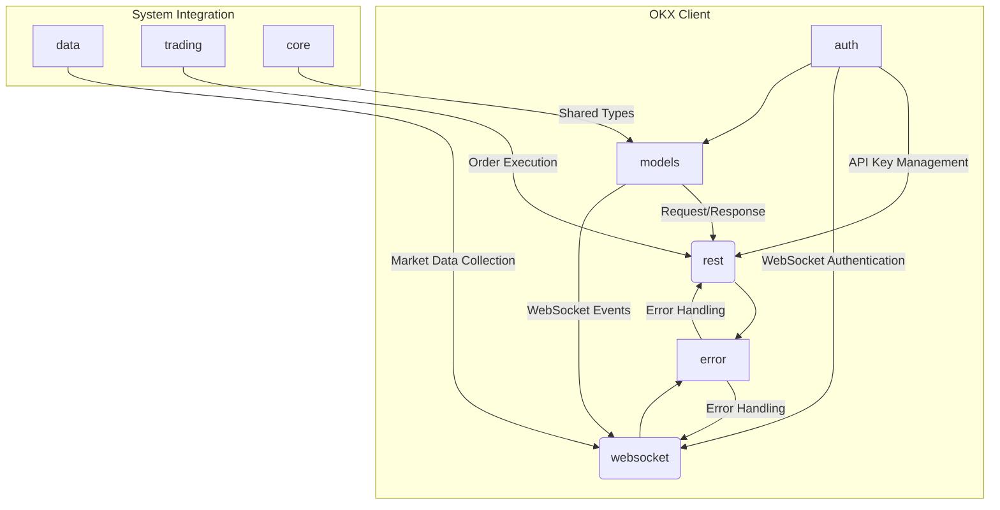
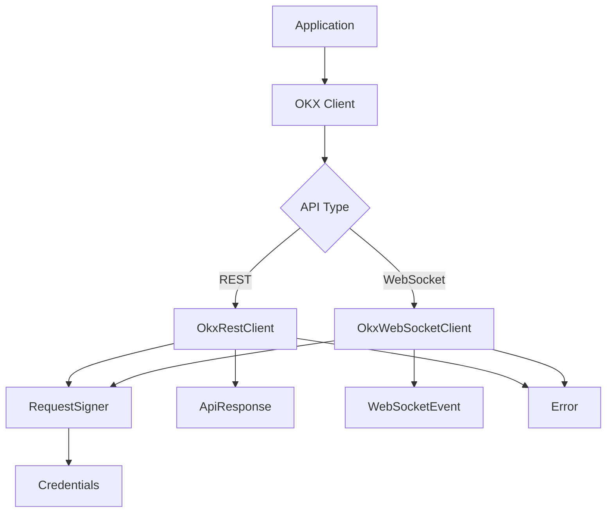
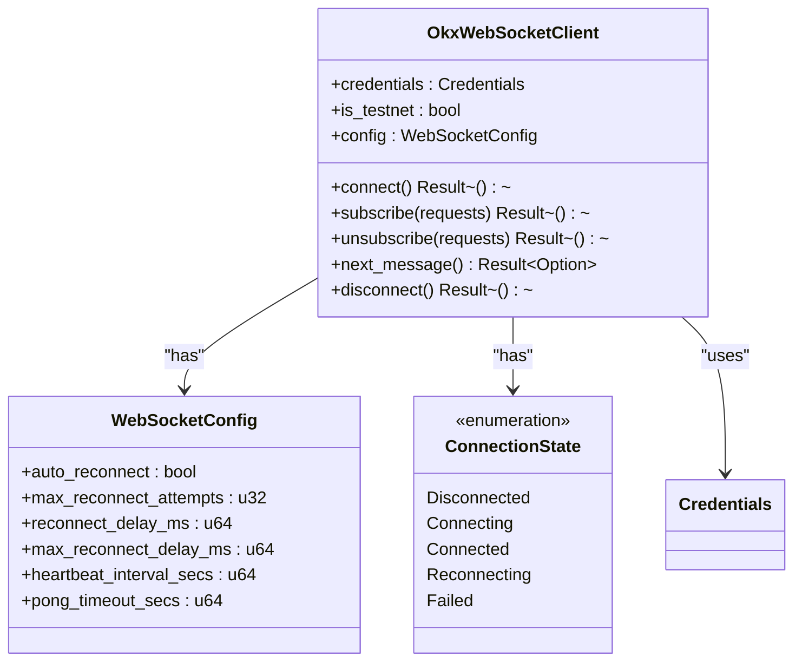
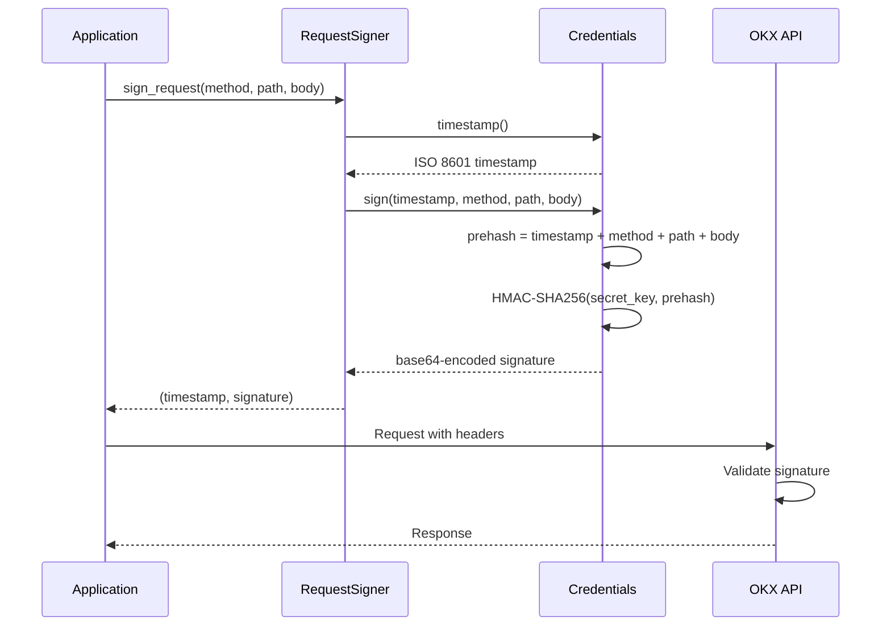
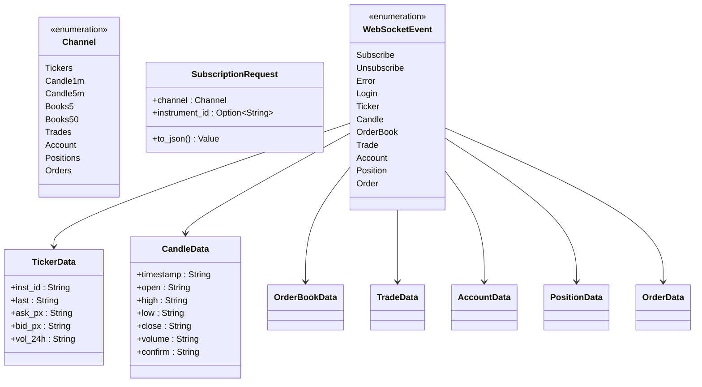
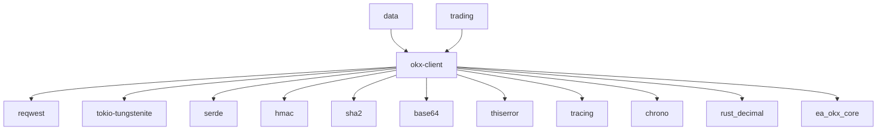

# OKX Client Integration

<cite>
**Referenced Files in This Document**   
- [lib.rs](file://crates/okx-client/src/lib.rs)
- [rest.rs](file://crates/okx-client/src/rest.rs)
- [websocket.rs](file://crates/okx-client/src/websocket.rs)
- [auth.rs](file://crates/okx-client/src/auth.rs)
- [request.rs](file://crates/okx-client/src/models/request.rs)
- [response.rs](file://crates/okx-client/src/models/response.rs)
- [websocket.rs](file://crates/okx-client/src/models/websocket.rs)
- [error.rs](file://crates/okx-client/src/error.rs)
- [websocket_ticker.rs](file://examples/websocket_ticker.rs)
- [lib.rs](file://crates/data/src/lib.rs)
- [collector.rs](file://crates/data/src/collector.rs)
- [lib.rs](file://crates/trading/src/lib.rs)
- [order_manager.rs](file://crates/trading/src/order_manager.rs)
- [types.rs](file://crates/core/src/types.rs)
</cite>

## Table of Contents
1. [Introduction](#introduction)
2. [Project Structure](#project-structure)
3. [Core Components](#core-components)
4. [Architecture Overview](#architecture-overview)
5. [Detailed Component Analysis](#detailed-component-analysis)
6. [Dependency Analysis](#dependency-analysis)
7. [Performance Considerations](#performance-considerations)
8. [Troubleshooting Guide](#troubleshooting-guide)
9. [Conclusion](#conclusion)

## Introduction
The OKX client integration provides a comprehensive Rust library for interacting with the OKX cryptocurrency exchange API. This documentation covers the implementation of both REST and WebSocket interfaces for account and trading operations, authentication mechanisms, request/response models, error handling, rate limiting, and integration with data collection and trading execution systems.

The client is designed as a modular component within a larger quantitative trading system, enabling real-time market data collection, order execution, and position management. It supports both public market data channels and private account channels requiring authentication.

**Section sources**
- [lib.rs](file://crates/okx-client/src/lib.rs#L1-L39)

## Project Structure
The OKX client is implemented as a Rust crate within a larger monorepo structure. The client resides in the `crates/okx-client` directory and follows a modular design with separate modules for authentication, REST API, WebSocket API, models, and error handling.

The client is integrated with other system components through the data collection layer (`crates/data`) and trading execution layer (`crates/trading`). The core domain models are defined in `crates/core`, providing shared types for symbols, prices, and quantities across the system.



**Diagram sources **
- [lib.rs](file://crates/okx-client/src/lib.rs#L29-L38)
- [lib.rs](file://crates/data/src/lib.rs#L19-L21)
- [lib.rs](file://crates/trading/src/lib.rs#L6-L11)
- [types.rs](file://crates/core/src/types.rs#L10-L14)

## Core Components
The OKX client consists of several core components that work together to provide a complete interface to the OKX exchange. The main entry points are the `OkxRestClient` for synchronous API calls and the `OkxWebSocketClient` for real-time data streaming.

The authentication system is built around API keys, secret keys, and passphrases, with signature generation following OKX's HMAC-SHA256 algorithm. The client handles both public endpoints that require no authentication and private endpoints that require signed requests.

The model layer provides type-safe representations of API requests and responses, ensuring data integrity and providing compile-time validation of API contracts. Error handling is comprehensive, with specific error types for different failure modes including network issues, authentication failures, and API-specific errors.

**Section sources**
- [lib.rs](file://crates/okx-client/src/lib.rs#L35-L38)
- [auth.rs](file://crates/okx-client/src/auth.rs#L13-L17)
- [error.rs](file://crates/okx-client/src/error.rs#L6-L48)

## Architecture Overview
The OKX client follows a layered architecture with clear separation of concerns between authentication, API clients, data models, and error handling. The client is designed to be used in both synchronous and asynchronous contexts, with async/await support for non-blocking operations.

The REST client provides a simple interface for making authenticated API calls to the OKX exchange, while the WebSocket client maintains persistent connections for real-time data streaming. Both clients share the same authentication mechanism and error handling infrastructure.



**Diagram sources **
- [lib.rs](file://crates/okx-client/src/lib.rs#L37-L38)
- [rest.rs](file://crates/okx-client/src/rest.rs#L3-L9)
- [websocket.rs](file://crates/okx-client/src/websocket.rs#L111-L149)
- [auth.rs](file://crates/okx-client/src/auth.rs#L13-L17)

## Detailed Component Analysis

### REST API Client Analysis
The REST API client provides a simple interface for making authenticated requests to the OKX exchange. It handles the construction of HTTP requests with proper headers, including the required signature authentication.

The client is initialized with credentials and a testnet flag, allowing it to connect to either the production or sandbox environment. While the current implementation shows the basic structure, it would be extended to include specific methods for different API endpoints such as account balance retrieval, order placement, and trade history.

**Section sources**
- [rest.rs](file://crates/okx-client/src/rest.rs#L3-L9)

### WebSocket Client Analysis
The WebSocket client is a sophisticated component that manages real-time data streaming from the OKX exchange. It handles connection lifecycle management, including automatic reconnection with exponential backoff, heartbeat monitoring, and subscription state tracking.



**Diagram sources **
- [websocket.rs](file://crates/okx-client/src/websocket.rs#L111-L149)
- [websocket.rs](file://crates/okx-client/src/websocket.rs#L72-L79)
- [websocket.rs](file://crates/okx-client/src/websocket.rs#L82-L96)

### Authentication Mechanism Analysis
The authentication system is implemented in the `auth` module and provides secure handling of API credentials and request signing. The `Credentials` struct stores the API key, secret key, and passphrase, while the `RequestSigner` handles the generation of signed requests.



**Diagram sources **
- [auth.rs](file://crates/okx-client/src/auth.rs#L13-L17)
- [auth.rs](file://crates/okx-client/src/auth.rs#L57-L84)
- [auth.rs](file://crates/okx-client/src/auth.rs#L93-L102)

### Request/Response Models Analysis
The model layer provides type-safe representations of API requests and responses, ensuring data integrity and providing compile-time validation of API contracts. The models are organized into request, response, and WebSocket-specific types.

```mermaid
classDiagram
class PlaceOrderRequest {
+inst_id : String
+td_mode : String
+side : String
+ord_type : String
+sz : String
+px : Option~String~
+cl_ord_id : Option~String~
}
class CancelOrderRequest {
+inst_id : String
+ord_id : Option~String~
+cl_ord_id : Option~String~
}
class ApiResponse~T~ {
+code : String
+msg : String
+data : Vec~T~
+is_success() bool
}
class OrderResponse {
+ord_id : String
+cl_ord_id : String
+state : String
}
ApiResponse~OrderResponse~ --> OrderResponse
ApiResponse~Vec~TradeData~~ --> TradeData
```

**Diagram sources **
- [request.rs](file://crates/okx-client/src/models/request.rs#L6-L47)
- [response.rs](file://crates/okx-client/src/models/response.rs#L7-L38)

### WebSocket Message Models Analysis
The WebSocket message models handle the parsing and serialization of real-time data from the OKX exchange. The system supports multiple channel types for different data streams, including tickers, candles, order books, trades, and private account data.



**Diagram sources **
- [websocket.rs](file://crates/okx-client/src/models/websocket.rs#L14-L44)
- [websocket.rs](file://crates/okx-client/src/models/websocket.rs#L78-L99)
- [websocket.rs](file://crates/okx-client/src/models/websocket.rs#L127-L151)
- [websocket.rs](file://crates/okx-client/src/models/websocket.rs#L268-L287)
- [websocket.rs](file://crates/okx-client/src/models/websocket.rs#L291-L319)

### Error Handling Analysis
The error handling system provides comprehensive error types for different failure modes, including network issues, authentication failures, parsing errors, and API-specific errors. The system uses the `thiserror` crate to provide descriptive error messages and source chaining.

```mermaid
classDiagram
class Error {
<<enumeration>>
HttpError
WebSocketError
WebSocketConnection
WebSocketSend
ParseError
AuthError
RateLimitExceeded
InvalidResponse
ApiError
SerializationError
UrlError
Timeout
ConnectionError
Internal
}
Error --> reqwest : : Error : "from"
Error --> serde_json : : Error : "from"
Error --> url : : ParseError : "from"
```

**Diagram sources **
- [error.rs](file://crates/okx-client/src/error.rs#L6-L48)

## Dependency Analysis
The OKX client has dependencies on several external crates for HTTP client functionality, WebSocket communication, JSON serialization, and cryptographic operations. These dependencies are managed through Cargo and are specified in the crate's `Cargo.toml` file.

The client integrates with the broader system through shared types from the `ea_okx_core` crate and is used by higher-level components such as the market data collector and order manager. The dependency graph shows a clear separation between the client implementation and its consumers.



**Diagram sources **
- [Cargo.toml](file://crates/okx-client/Cargo.toml)
- [lib.rs](file://crates/okx-client/src/lib.rs#L4-L5)
- [lib.rs](file://crates/data/src/lib.rs#L19)
- [lib.rs](file://crates/trading/src/lib.rs#L9)

## Performance Considerations
The OKX client is designed with performance in mind, using asynchronous I/O for non-blocking operations and efficient data structures for message parsing. The WebSocket client uses tokio's async runtime to handle multiple concurrent connections and message processing.

Connection management is optimized through the use of connection pooling and automatic reconnection with exponential backoff. The client minimizes memory allocations by reusing buffers and using efficient string handling.

Rate limiting is handled at the application level, with the client providing mechanisms to track request rates and implement appropriate delays. The system is designed to handle high-frequency trading scenarios with low latency requirements.

**Section sources**
- [websocket.rs](file://crates/okx-client/src/websocket.rs#L54-L57)
- [websocket.rs](file://crates/okx-client/src/websocket.rs#L118-L124)

## Troubleshooting Guide
When troubleshooting issues with the OKX client, consider the following common problems and solutions:

1. **Authentication failures**: Verify that API keys, secret keys, and passphrases are correct and have the necessary permissions. Check that the timestamp is within the allowed window (5 seconds).

2. **WebSocket connection issues**: Ensure that the firewall allows outbound connections to the OKX WebSocket servers. Check that the client is properly handling reconnection logic.

3. **Rate limiting**: Monitor API usage and implement appropriate delays between requests. Use the client's built-in rate limiting mechanisms.

4. **Data parsing errors**: Verify that the data models match the current API specification. Check for changes in the OKX API that may affect field names or data types.

5. **Memory leaks**: Monitor memory usage and ensure that subscriptions are properly cleaned up when no longer needed.

The client provides comprehensive logging through the `tracing` crate, which can be enabled to debug issues. The example code in `examples/websocket_ticker.rs` demonstrates proper error handling and logging practices.

**Section sources**
- [websocket_ticker.rs](file://examples/websocket_ticker.rs#L25-L148)
- [websocket.rs](file://crates/okx-client/src/websocket.rs#L61-L66)
- [error.rs](file://crates/okx-client/src/error.rs#L6-L48)

## Conclusion
The OKX client integration provides a robust and efficient interface to the OKX cryptocurrency exchange, supporting both REST and WebSocket APIs for comprehensive trading functionality. The client is well-structured with clear separation of concerns between authentication, API clients, data models, and error handling.

Key strengths of the implementation include:
- Comprehensive authentication support with secure signature generation
- Real-time data streaming through WebSocket with automatic reconnection
- Type-safe request/response models that ensure data integrity
- Comprehensive error handling with descriptive error messages
- Integration with the broader trading system through shared types and components

The client is designed to be extensible, allowing for the addition of new API endpoints and data streams as needed. It provides a solid foundation for building quantitative trading strategies that require reliable access to market data and order execution capabilities.

**Section sources**
- [lib.rs](file://crates/okx-client/src/lib.rs#L1-L39)
- [websocket_ticker.rs](file://examples/websocket_ticker.rs#L1-L149)