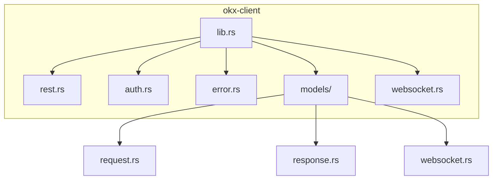
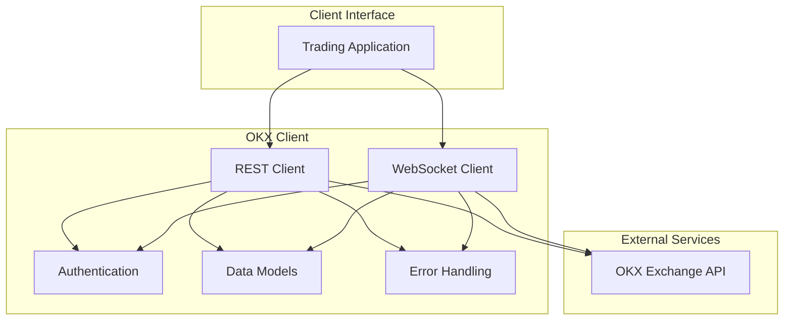
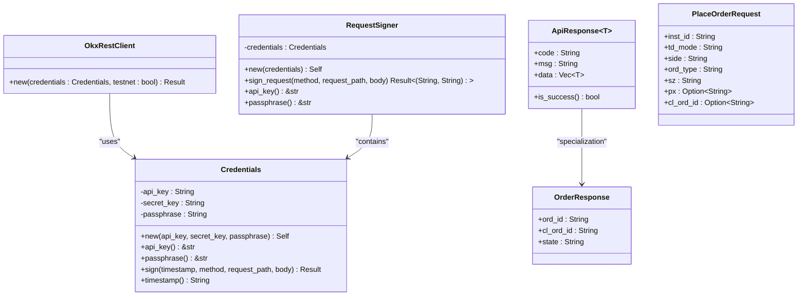
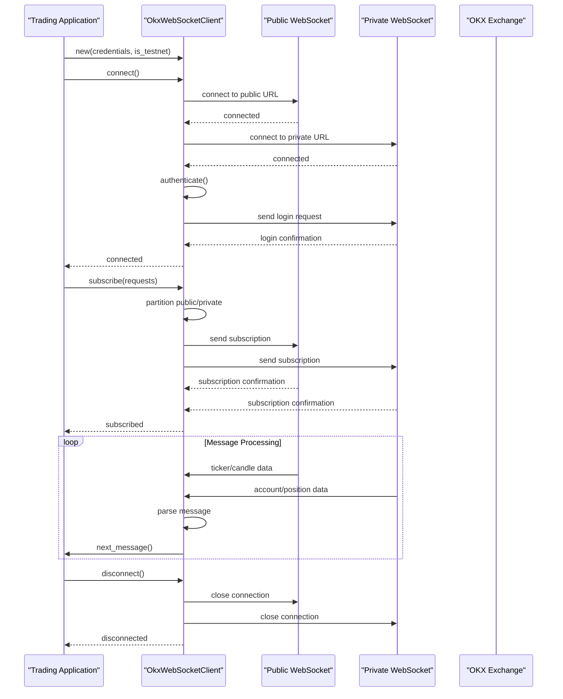
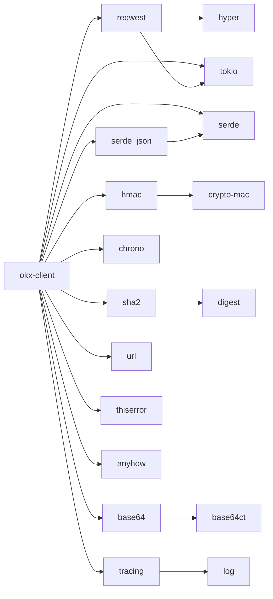

# REST API Client

<cite>
**Referenced Files in This Document**   
- [lib.rs](file://crates/okx-client/src/lib.rs)
- [rest.rs](file://crates/okx-client/src/rest.rs)
- [auth.rs](file://crates/okx-client/src/auth.rs)
- [error.rs](file://crates/okx-client/src/error.rs)
- [models/request.rs](file://crates/okx-client/src/models/request.rs)
- [models/response.rs](file://crates/okx-client/src/models/response.rs)
- [websocket.rs](file://crates/okx-client/src/websocket.rs)
- [models/websocket.rs](file://crates/okx-client/src/models/websocket.rs)
- [Cargo.toml](file://crates/okx-client/Cargo.toml)
- [README.md](file://examples/README.md)
</cite>

## Table of Contents
1. [Introduction](#introduction)
2. [Project Structure](#project-structure)
3. [Core Components](#core-components)
4. [Architecture Overview](#architecture-overview)
5. [Detailed Component Analysis](#detailed-component-analysis)
6. [Dependency Analysis](#dependency-analysis)
7. [Performance Considerations](#performance-considerations)
8. [Troubleshooting Guide](#troubleshooting-guide)
9. [Conclusion](#conclusion)

## Introduction
The OKX REST API client provides a comprehensive interface for interacting with the OKX cryptocurrency exchange. This documentation details the implementation of the REST client for account management, trading operations, and market data retrieval. The client is built using reqwest with connection pooling and timeout configuration, featuring robust error handling, retry mechanisms with exponential backoff, and rate limit handling. It integrates seamlessly with trading execution and data collection systems within the quantitative trading platform.

## Project Structure
The OKX client is implemented as a Rust crate within the larger trading system. It follows a modular structure with separate components for REST and WebSocket functionality, authentication, error handling, and data models.

**Diagram sources**
- [lib.rs](file://crates/okx-client/src/lib.rs)
- [rest.rs](file://crates/okx-client/src/rest.rs)
- [auth.rs](file://crates/okx-client/src/auth.rs)
- [error.rs](file://crates/okx-client/src/error.rs)
- [models/request.rs](file://crates/okx-client/src/models/request.rs)
- [models/response.rs](file://crates/okx-client/src/models/response.rs)
- [websocket.rs](file://crates/okx-client/src/websocket.rs)
- [models/websocket.rs](file://crates/okx-client/src/models/websocket.rs)

**Section sources**
- [lib.rs](file://crates/okx-client/src/lib.rs)

## Core Components
The OKX client consists of several core components that work together to provide a robust API interface. These include the REST client implementation, authentication utilities, error handling system, data models for requests and responses, and WebSocket client for real-time data streaming. The client is designed to handle both public market data endpoints and private trading/account endpoints with proper authentication.

**Section sources**
- [lib.rs](file://crates/okx-client/src/lib.rs)
- [rest.rs](file://crates/okx-client/src/rest.rs)
- [auth.rs](file://crates/okx-client/src/auth.rs)
- [error.rs](file://crates/okx-client/src/error.rs)

## Architecture Overview
The OKX client follows a modular architecture with clear separation of concerns. The REST client handles HTTP requests to the OKX API, while the WebSocket client manages real-time data streaming. Authentication is handled through dedicated utilities that generate the required signatures for API requests. Data models provide type-safe representations of API requests and responses.

**Diagram sources**
- [lib.rs](file://crates/okx-client/src/lib.rs)
- [rest.rs](file://crates/okx-client/src/rest.rs)
- [websocket.rs](file://crates/okx-client/src/websocket.rs)
- [auth.rs](file://crates/okx-client/src/auth.rs)

## Detailed Component Analysis

### REST Client Implementation
The REST client provides synchronous and asynchronous methods for interacting with the OKX API. It handles HTTP requests, authentication, error handling, and response parsing.

**Diagram sources**
- [rest.rs](file://crates/okx-client/src/rest.rs)
- [auth.rs](file://crates/okx-client/src/auth.rs)
- [models/request.rs](file://crates/okx-client/src/models/request.rs)
- [models/response.rs](file://crates/okx-client/src/models/response.rs)

**Section sources**
- [rest.rs](file://crates/okx-client/src/rest.rs)
- [auth.rs](file://crates/okx-client/src/auth.rs)
- [models/request.rs](file://crates/okx-client/src/models/request.rs)
- [models/response.rs](file://crates/okx-client/src/models/response.rs)

### WebSocket Client Implementation
The WebSocket client provides real-time market data streaming from OKX. It handles connection management, subscription to various channels, authentication for private channels, and message parsing.

**Diagram sources**
- [websocket.rs](file://crates/okx-client/src/websocket.rs)
- [models/websocket.rs](file://crates/okx-client/src/models/websocket.rs)

**Section sources**
- [websocket.rs](file://crates/okx-client/src/websocket.rs)
- [models/websocket.rs](file://crates/okx-client/src/models/websocket.rs)

### Error Handling Strategy
The client implements a comprehensive error handling system with specific error types for different failure modes, including HTTP errors, WebSocket errors, authentication issues, rate limiting, and API-specific errors.

```mermaid
graph TD
Error[Error] --> HttpError["HttpError(reqwest::Error)"]
Error --> WebSocketError["WebSocketError(String)"]
Error --> WebSocketConnection["WebSocketConnection(String)"]
Error --> WebSocketSend["WebSocketSend(String)"]
Error --> ParseError["ParseError(String)"]
Error --> AuthError["AuthError(String)"]
Error --> RateLimitExceeded["RateLimitExceeded(String)"]
Error --> InvalidResponse["InvalidResponse(String)"]
Error --> ApiError["ApiError { code: String, message: String }"]
Error --> SerializationError["SerializationError(serde_json::Error)"]
Error --> UrlError["UrlError(url::ParseError)"]
Error --> Timeout["Timeout(String)"]
Error --> ConnectionError["ConnectionError(String)"]
Error --> Internal["Internal(String)"]
style Error fill:#f9f,stroke:#333,stroke-width:2px
```

**Diagram sources**
- [error.rs](file://crates/okx-client/src/error.rs)

**Section sources**
- [error.rs](file://crates/okx-client/src/error.rs)

## Dependency Analysis
The OKX client has dependencies on several external crates for HTTP communication, serialization, cryptography, and async runtime functionality. These dependencies are managed through Cargo and are specified in the Cargo.toml file.

**Diagram sources**
- [Cargo.toml](file://crates/okx-client/Cargo.toml)

**Section sources**
- [Cargo.toml](file://crates/okx-client/Cargo.toml)

## Performance Considerations
The OKX client is designed with performance in mind, utilizing connection pooling through reqwest, efficient data serialization with serde, and non-blocking async operations with tokio. The WebSocket client maintains persistent connections for real-time data streaming, reducing latency compared to polling REST endpoints. The client also implements exponential backoff for retry mechanisms to handle transient failures without overwhelming the API servers.

## Troubleshooting Guide
When encountering issues with the OKX client, consider the following common problems and solutions:

1. **Authentication failures**: Verify that API key, secret key, and passphrase are correct and have the necessary permissions.
2. **Rate limiting**: Implement proper rate limiting in your application and handle RateLimitExceeded errors appropriately.
3. **WebSocket disconnections**: The client has auto-reconnection logic, but monitor connection state and subscription status.
4. **Parsing errors**: Ensure that data models match the API response format, especially after API updates.
5. **Network issues**: Check network connectivity and firewall settings, especially for WebSocket connections.

For debugging, enable tracing logs to see detailed information about API requests and responses.

**Section sources**
- [auth.rs](file://crates/okx-client/src/auth.rs)
- [error.rs](file://crates/okx-client/src/error.rs)
- [websocket.rs](file://crates/okx-client/src/websocket.rs)

## Conclusion
The OKX REST API client provides a robust and feature-complete interface for interacting with the OKX exchange. It handles authentication, error management, and data serialization while providing both REST and WebSocket interfaces for different use cases. The client is designed to integrate seamlessly with trading systems, supporting both market data collection and trade execution workflows. With proper error handling and retry mechanisms, it provides reliable access to exchange functionality for algorithmic trading applications.