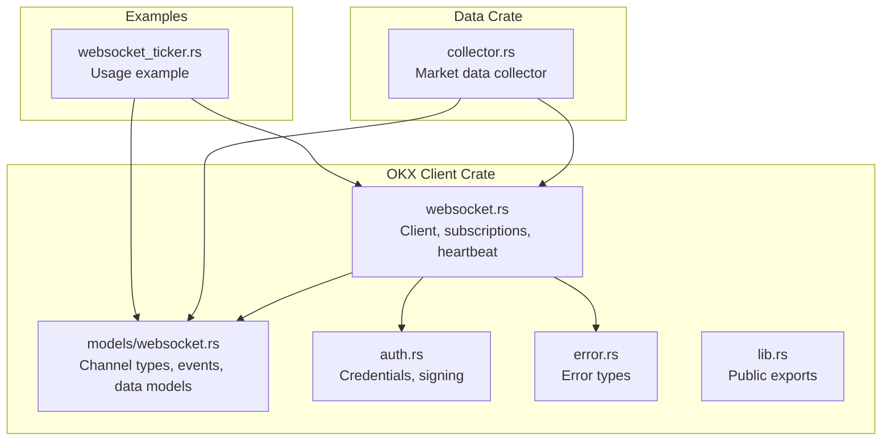
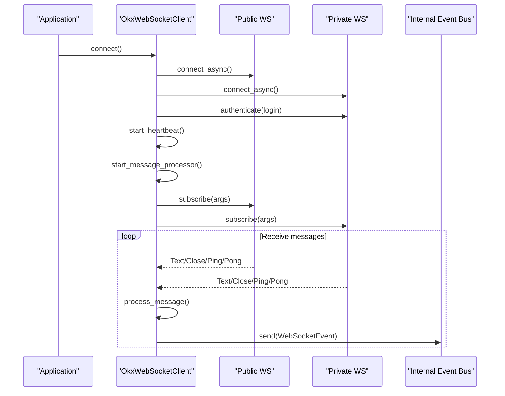
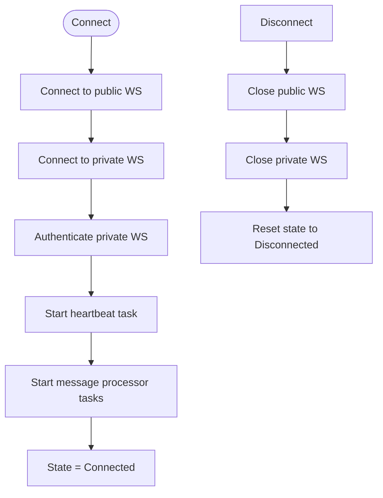
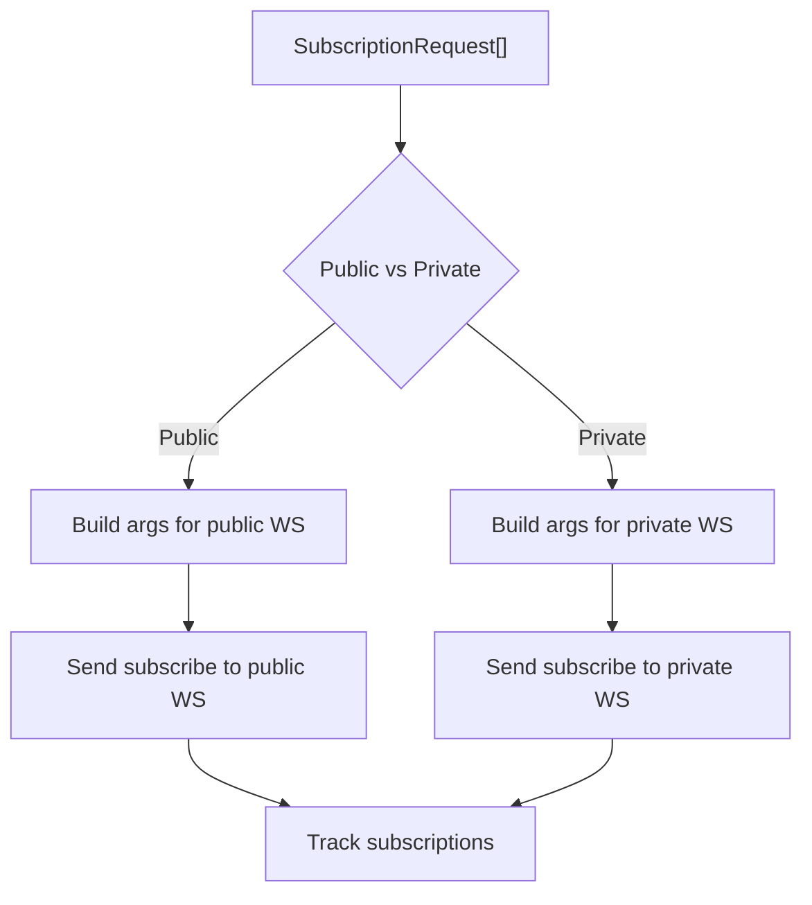
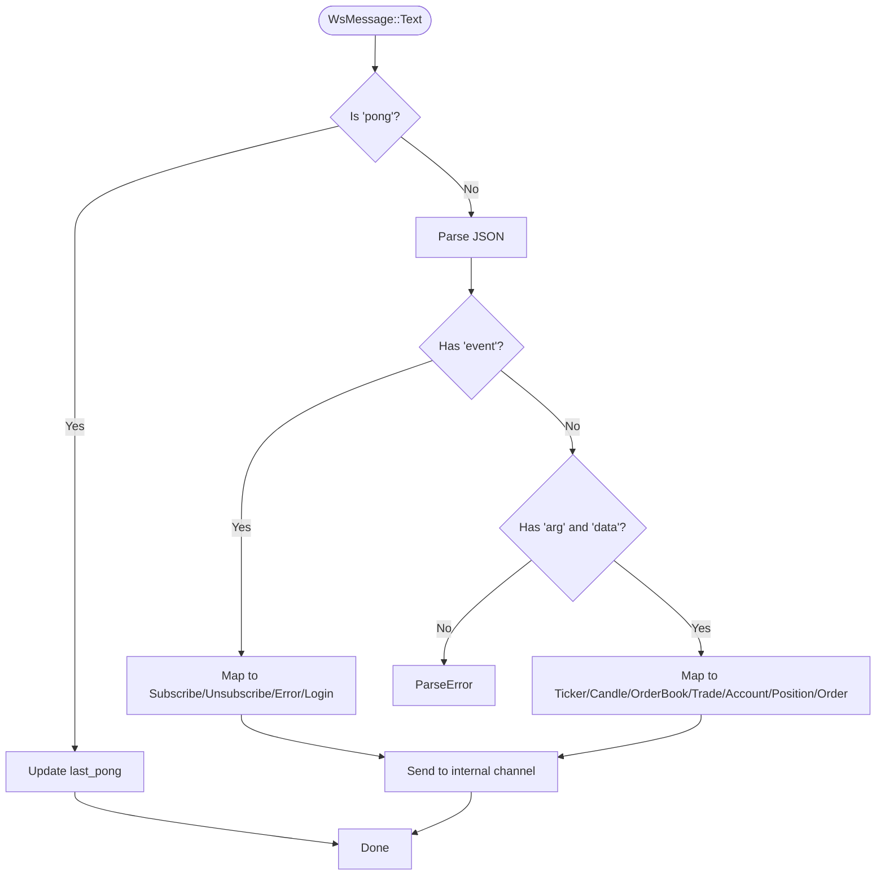
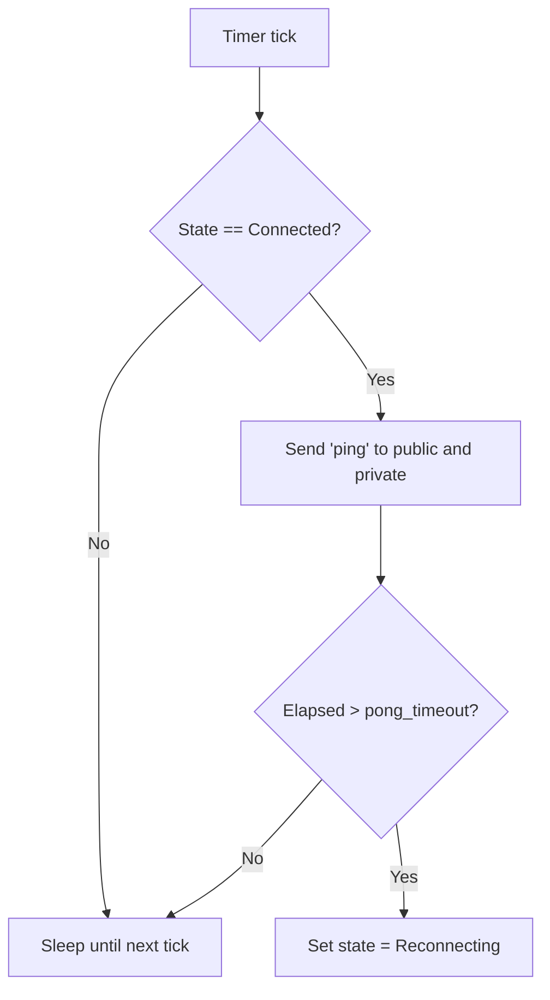
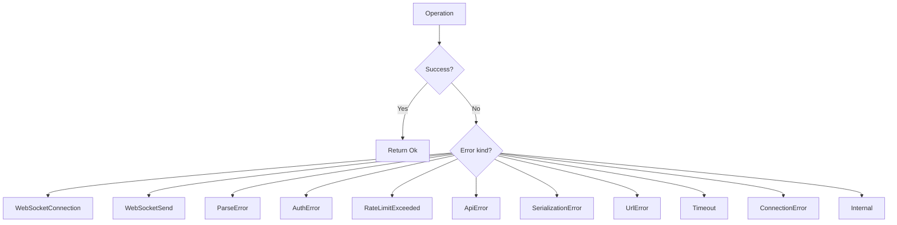
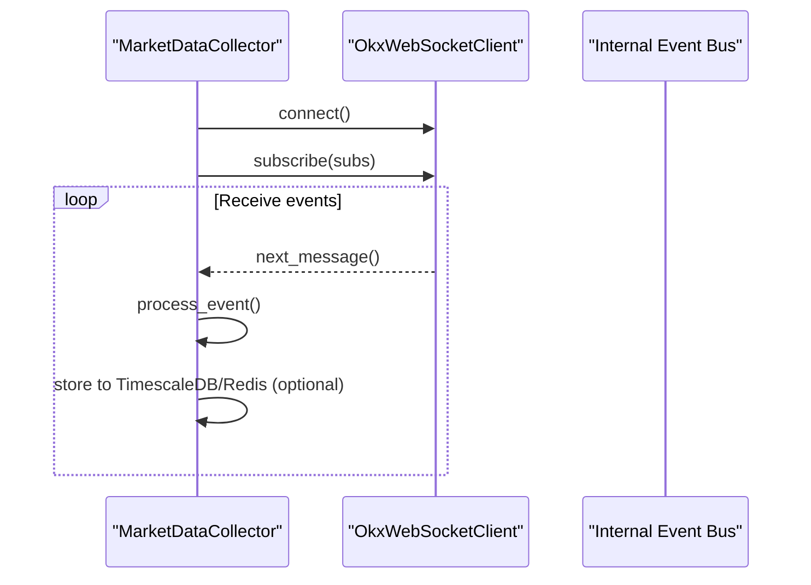
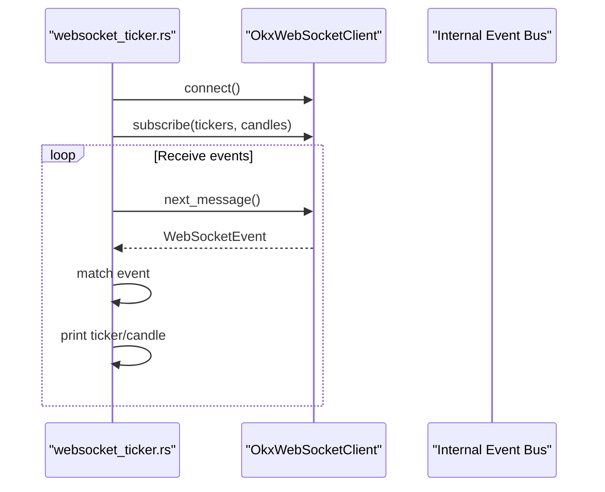
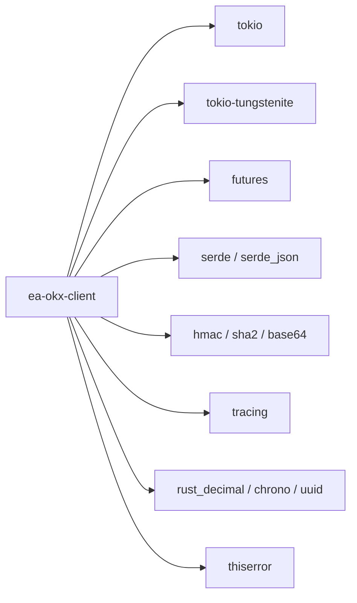

# WebSocket Client

<cite>
**Referenced Files in This Document**
- [websocket.rs](file://crates/okx-client/src/websocket.rs)
- [websocket_models.rs](file://crates/okx-client/src/models/websocket.rs)
- [auth.rs](file://crates/okx-client/src/auth.rs)
- [error.rs](file://crates/okx-client/src/error.rs)
- [lib.rs](file://crates/okx-client/src/lib.rs)
- [collector.rs](file://crates/data/src/collector.rs)
- [websocket_ticker.rs](file://examples/websocket_ticker.rs)
- [Cargo.toml](file://Cargo.toml)
- [okx-client Cargo.toml](file://crates/okx-client/Cargo.toml)
</cite>

## Table of Contents
1. [Introduction](#introduction)
2. [Project Structure](#project-structure)
3. [Core Components](#core-components)
4. [Architecture Overview](#architecture-overview)
5. [Detailed Component Analysis](#detailed-component-analysis)
6. [Dependency Analysis](#dependency-analysis)
7. [Performance Considerations](#performance-considerations)
8. [Troubleshooting Guide](#troubleshooting-guide)
9. [Conclusion](#conclusion)
10. [Appendices](#appendices)

## Introduction
This document describes the OKX WebSocket client implementation used to receive real-time market data and private account updates. It covers connection lifecycle management, subscription mechanisms for public and private channels, message parsing into domain events, heartbeat and ping/pong monitoring, error handling, and integration with the market data collector and strategy framework.

## Project Structure
The WebSocket client resides in the OKX client crate and integrates with the broader system via the data collector and strategy framework.

**Diagram sources**
- [websocket.rs](file://crates/okx-client/src/websocket.rs#L1-L120)
- [websocket_models.rs](file://crates/okx-client/src/models/websocket.rs#L1-L120)
- [auth.rs](file://crates/okx-client/src/auth.rs#L1-L60)
- [error.rs](file://crates/okx-client/src/error.rs#L1-L40)
- [lib.rs](file://crates/okx-client/src/lib.rs#L29-L39)
- [collector.rs](file://crates/data/src/collector.rs#L1-L60)
- [websocket_ticker.rs](file://examples/websocket_ticker.rs#L1-L40)

**Section sources**
- [Cargo.toml](file://Cargo.toml#L1-L20)
- [okx-client Cargo.toml](file://crates/okx-client/Cargo.toml#L1-L20)

## Core Components
- OkxWebSocketClient: Manages two WebSocket connections (public and private), handles authentication, subscriptions, heartbeat, and message processing.
- Channel and SubscriptionRequest: Define supported channels and subscription payload construction.
- WebSocketEvent: Unified event model for parsed messages (tickers, candles, trades, order book, account, positions, orders).
- Credentials and signing: Provides HMAC-SHA256 signature for private channel authentication.
- Error types: Centralized error enumeration for HTTP, WebSocket, parsing, authentication, rate limits, timeouts, and internal errors.

Key responsibilities:
- Connection lifecycle: connect, authenticate, disconnect.
- Subscription management: subscribe/unsubscribe to public and private channels.
- Message parsing: convert raw WebSocket messages into domain events.
- Health monitoring: periodic ping and pong tracking.
- Integration: feed parsed events to the internal event bus and downstream consumers.

**Section sources**
- [websocket.rs](file://crates/okx-client/src/websocket.rs#L111-L166)
- [websocket_models.rs](file://crates/okx-client/src/models/websocket.rs#L11-L75)
- [websocket_models.rs](file://crates/okx-client/src/models/websocket.rs#L116-L152)
- [auth.rs](file://crates/okx-client/src/auth.rs#L11-L45)
- [error.rs](file://crates/okx-client/src/error.rs#L1-L48)

## Architecture Overview
The client maintains separate WebSocket streams for public and private channels. It authenticates the private channel upon connection, manages subscriptions, and spawns tasks to:
- Send periodic ping messages.
- Receive and parse messages.
- Dispatch parsed events to an internal channel for consumers.

**Diagram sources**
- [websocket.rs](file://crates/okx-client/src/websocket.rs#L168-L222)
- [websocket.rs](file://crates/okx-client/src/websocket.rs#L224-L252)
- [websocket.rs](file://crates/okx-client/src/websocket.rs#L376-L418)
- [websocket.rs](file://crates/okx-client/src/websocket.rs#L420-L491)
- [websocket.rs](file://crates/okx-client/src/websocket.rs#L493-L536)

## Detailed Component Analysis

### Connection Lifecycle Management
- Connection: Establishes public and private WebSocket connections. On success, sets state to connected and starts heartbeat and message processing tasks.
- Authentication: Sends a login operation with signed credentials to the private channel.
- Disconnection: Explicitly closes both streams and resets state.

**Diagram sources**
- [websocket.rs](file://crates/okx-client/src/websocket.rs#L168-L222)
- [websocket.rs](file://crates/okx-client/src/websocket.rs#L224-L252)
- [websocket.rs](file://crates/okx-client/src/websocket.rs#L544-L564)

**Section sources**
- [websocket.rs](file://crates/okx-client/src/websocket.rs#L168-L222)
- [websocket.rs](file://crates/okx-client/src/websocket.rs#L224-L252)
- [websocket.rs](file://crates/okx-client/src/websocket.rs#L544-L564)

### Subscription Mechanism
- Public channels: tickers, candles, trades, books.
- Private channels: account, positions, orders, balance and position.
- Subscriptions are split by public/private and sent via separate WebSocket streams.
- Subscriptions are tracked to support reconnection scenarios.

**Diagram sources**
- [websocket.rs](file://crates/okx-client/src/websocket.rs#L254-L304)
- [websocket.rs](file://crates/okx-client/src/websocket.rs#L306-L368)
- [websocket_models.rs](file://crates/okx-client/src/models/websocket.rs#L11-L75)

**Section sources**
- [websocket.rs](file://crates/okx-client/src/websocket.rs#L254-L304)
- [websocket.rs](file://crates/okx-client/src/websocket.rs#L306-L368)
- [websocket_models.rs](file://crates/okx-client/src/models/websocket.rs#L11-L75)

### Message Parsing Pipeline
- Raw text messages are parsed as JSON.
- Response events: subscribe, unsubscribe, error, login.
- Data push events: tickers, candles, trades, order book, account, positions, orders.
- Pong handling updates last pong timestamp; ping messages are ignored.

**Diagram sources**
- [websocket.rs](file://crates/okx-client/src/websocket.rs#L493-L536)
- [websocket_models.rs](file://crates/okx-client/src/models/websocket.rs#L153-L265)

**Section sources**
- [websocket.rs](file://crates/okx-client/src/websocket.rs#L493-L536)
- [websocket_models.rs](file://crates/okx-client/src/models/websocket.rs#L153-L265)

### Heartbeat and Ping/Pong Mechanism
- Periodic ping sent to both public and private channels at configured intervals.
- Pong responses update last pong timestamp; if timeout exceeded, state transitions to reconnecting.
- Heartbeat task runs independently and checks connection state before sending pings.

**Diagram sources**
- [websocket.rs](file://crates/okx-client/src/websocket.rs#L376-L418)

**Section sources**
- [websocket.rs](file://crates/okx-client/src/websocket.rs#L376-L418)

### Error Handling Strategy
- WebSocket connection failures: logged and state set to failed; returned as connection errors.
- Send failures: mapped to WebSocket send errors.
- Parse errors: invalid JSON or malformed messages.
- Authentication errors: wrapped in auth errors.
- Rate limit and API errors: explicit variants for higher-level handling.
- Internal errors: generic internal errors for unexpected conditions.

**Diagram sources**
- [error.rs](file://crates/okx-client/src/error.rs#L1-L48)

**Section sources**
- [error.rs](file://crates/okx-client/src/error.rs#L1-L48)

### Integration with Market Data Collector and Strategy Framework
- Market data collector initializes the WebSocket client, subscribes to desired channels/symbols, and processes events in a loop.
- Events are parsed and validated; confirmed candles and trades are stored to TimescaleDB when enabled.
- The strategy framework defines a MarketDataEvent type for consumption by strategies; the collector does not directly publish to the strategy event bus in this codebase snapshot.

**Diagram sources**
- [collector.rs](file://crates/data/src/collector.rs#L76-L125)
- [collector.rs](file://crates/data/src/collector.rs#L137-L170)
- [collector.rs](file://crates/data/src/collector.rs#L172-L207)

**Section sources**
- [collector.rs](file://crates/data/src/collector.rs#L76-L125)
- [collector.rs](file://crates/data/src/collector.rs#L137-L170)
- [collector.rs](file://crates/data/src/collector.rs#L172-L207)

### Example: Market Data Events Published to Internal Event Bus
The example demonstrates connecting to WebSocket, subscribing to tickers and candles, and printing parsed events. While the example prints events locally, the internal event bus is represented by the client’s internal channel used by the collector.

**Diagram sources**
- [websocket_ticker.rs](file://examples/websocket_ticker.rs#L57-L140)
- [websocket.rs](file://crates/okx-client/src/websocket.rs#L370-L375)

**Section sources**
- [websocket_ticker.rs](file://examples/websocket_ticker.rs#L57-L140)
- [websocket.rs](file://crates/okx-client/src/websocket.rs#L370-L375)

## Dependency Analysis
External dependencies used by the OKX client:
- Async runtime and WebSocket: tokio, tokio-tungstenite, futures.
- Serialization: serde, serde_json.
- Cryptography: hmac, sha2, base64.
- Logging: tracing.
- Data types: rust_decimal, chrono, uuid.
- Error handling: thiserror.

**Diagram sources**
- [okx-client Cargo.toml](file://crates/okx-client/Cargo.toml#L1-L49)

**Section sources**
- [okx-client Cargo.toml](file://crates/okx-client/Cargo.toml#L1-L49)
- [Cargo.toml](file://Cargo.toml#L21-L86)

## Performance Considerations
- Asynchronous processing: message processing and heartbeat run concurrently using tasks.
- Minimal allocations: JSON parsing and event mapping are straightforward; consider batching subscriptions to reduce overhead.
- Backpressure: the internal channel is unbounded; monitor consumer throughput to prevent memory growth.
- Heartbeat tuning: adjust heartbeat interval and pong timeout to balance responsiveness and network load.

## Troubleshooting Guide
Common issues and resolutions:
- Connection failures: verify credentials and network connectivity; check logs for WebSocket connection errors.
- Authentication failures: ensure correct API key, passphrase, and secret; confirm timestamp and signature generation.
- Subscription errors: confirm channel names and instrument IDs; ensure private subscriptions are sent to the private stream.
- Pong timeouts: increase pong timeout or reduce network latency; inspect heartbeat task logs.
- Parse errors: validate message format and channel correctness; handle unknown channels gracefully.

**Section sources**
- [websocket.rs](file://crates/okx-client/src/websocket.rs#L168-L222)
- [websocket.rs](file://crates/okx-client/src/websocket.rs#L224-L252)
- [websocket.rs](file://crates/okx-client/src/websocket.rs#L376-L418)
- [websocket_models.rs](file://crates/okx-client/src/models/websocket.rs#L153-L265)
- [error.rs](file://crates/okx-client/src/error.rs#L1-L48)

## Conclusion
The OKX WebSocket client provides a robust foundation for real-time market data and private updates. It offers clear separation between public and private channels, structured subscription management, resilient message parsing, and health monitoring via heartbeat. The design cleanly integrates with the market data collector and can be extended to feed a broader strategy framework event bus.

## Appendices

### API and Model Reference
- Channels: tickers, candles (1m/5m/15m/1H/4H/1D), books (5/50/L2TBT), trades, account, positions, orders, balance and position.
- SubscriptionRequest: constructs channel arguments with optional instrument IDs.
- WebSocketEvent: unified event type covering response and data push events.

**Section sources**
- [websocket_models.rs](file://crates/okx-client/src/models/websocket.rs#L11-L75)
- [websocket_models.rs](file://crates/okx-client/src/models/websocket.rs#L77-L115)
- [websocket_models.rs](file://crates/okx-client/src/models/websocket.rs#L116-L152)

### Example Usage
- See the example that demonstrates connecting, subscribing to tickers and candles, and processing events.

**Section sources**
- [websocket_ticker.rs](file://examples/websocket_ticker.rs#L57-L140)