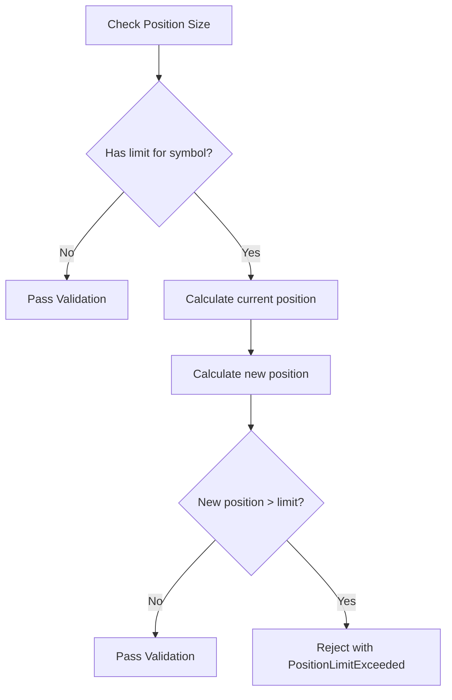
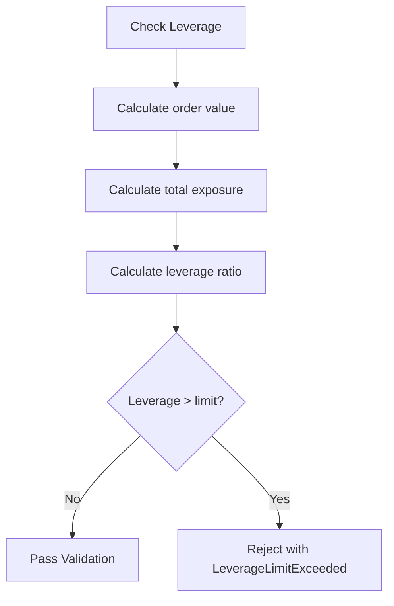
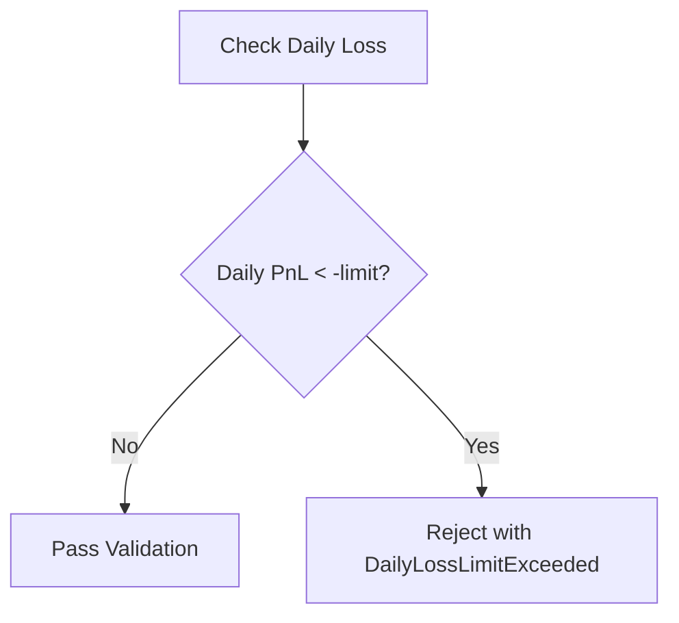
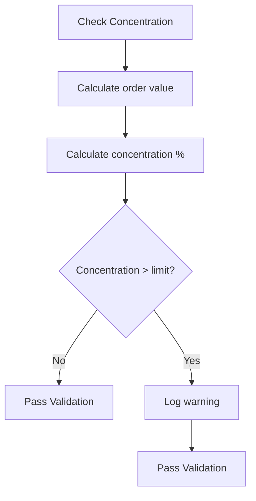
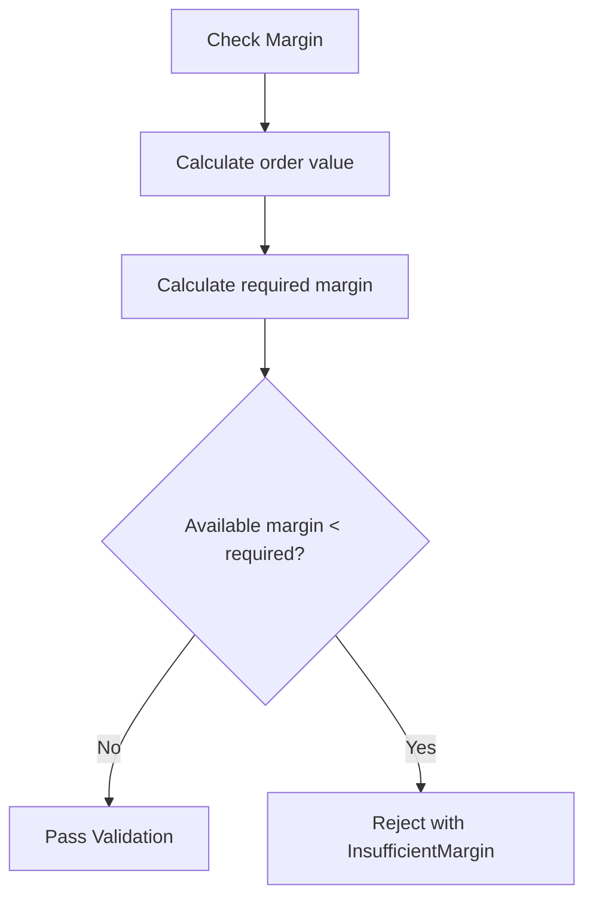
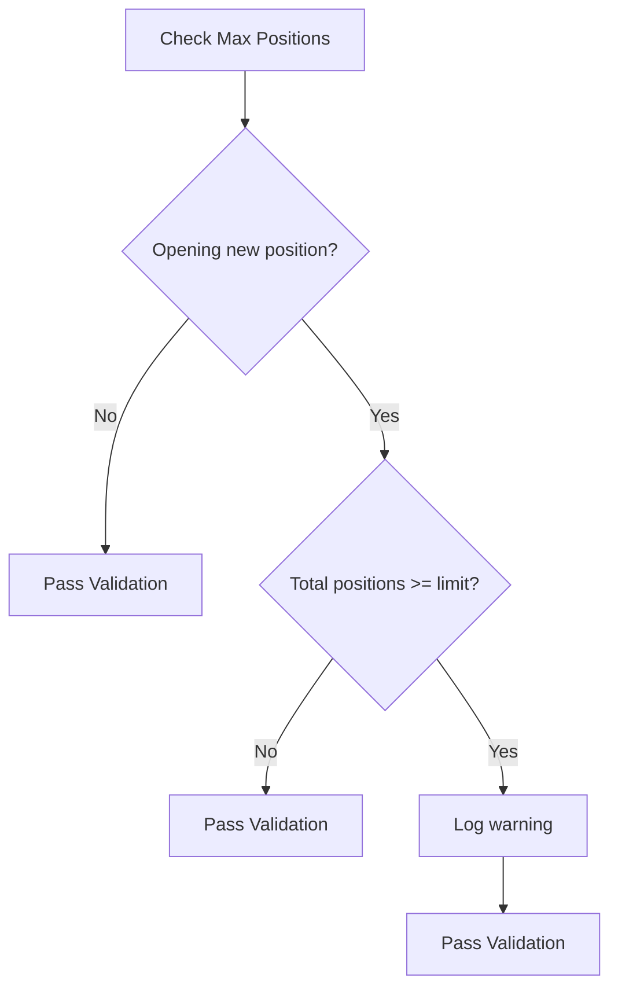
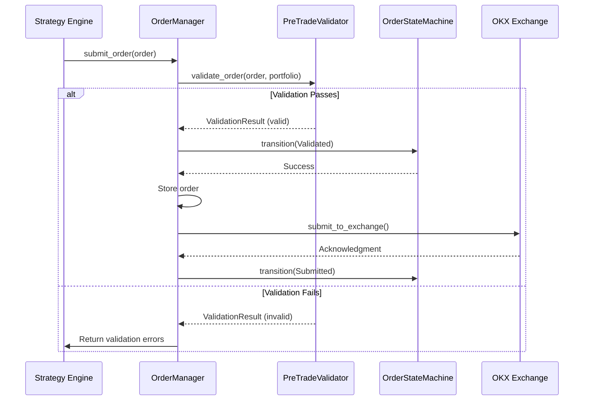
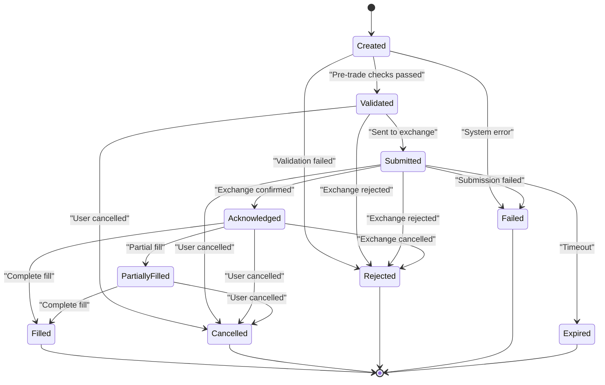
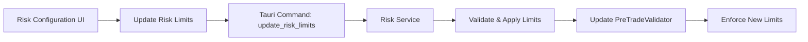

# Pre-Trade Validation

<cite>
**Referenced Files in This Document**   
- [validators.rs](file://crates/risk/src/validators.rs)
- [order_manager.rs](file://crates/trading/src/order_manager.rs)
- [state_machine.rs](file://crates/trading/src/state_machine.rs)
- [position.rs](file://crates/core/src/models/position.rs)
- [order.rs](file://crates/core/src/models/order.rs)
- [types.rs](file://crates/core/src/types.rs)
- [Risk.vue](file://src/views/Risk.vue)
- [risk.rs](file://src-tauri/src/commands/risk.rs)
</cite>

## Table of Contents
1. [Introduction](#introduction)
2. [Validation Rules Implementation](#validation-rules-implementation)
3. [Validator Interface and Integration](#validator-interface-and-integration)
4. [Configuration and Customization](#configuration-and-customization)
5. [Common Issues and Tuning Strategies](#common-issues-and-tuning-strategies)
6. [Conclusion](#conclusion)

## Introduction
The pre-trade validation system is a critical component of the trading platform that ensures all orders comply with predefined risk parameters before execution. This system acts as a safety gatekeeper, preventing trades that could expose the portfolio to excessive risk. The validation occurs at the boundary between strategy generation and order execution, analyzing each order against multiple risk dimensions including position size, leverage, daily loss limits, concentration risk, margin requirements, and maximum position count. The system is designed to be both comprehensive and flexible, allowing traders to customize risk thresholds while maintaining robust protection against catastrophic losses.

**Section sources**
- [validators.rs](file://crates/risk/src/validators.rs#L1-L393)

## Validation Rules Implementation

### Position Size Validation
The position size validation rule prevents orders from creating positions that exceed predefined limits for specific trading symbols. The system checks whether a new order would cause the position size for a given symbol to exceed its maximum allowed quantity. This check considers both existing positions and the proposed order quantity, with different calculations for buy and sell orders. For buy orders, the new position size is the sum of current holdings and the order quantity. For sell orders, it's the absolute difference between current holdings and the order quantity. This rule helps prevent overexposure to any single asset.



**Diagram sources**
- [validators.rs](file://crates/risk/src/validators.rs#L133-L162)

### Leverage Limit Validation
The leverage validation rule ensures that the total portfolio exposure does not exceed the maximum allowed leverage ratio. The system calculates leverage as the ratio of total exposure (sum of all position values plus the value of the new order) to total equity. For market orders where the price is not specified, the system would use the current market price to calculate order value. This validation prevents excessive borrowing and helps maintain portfolio stability during market volatility. The leverage check is particularly important in margin trading environments where high leverage can lead to rapid losses.



**Diagram sources**
- [validators.rs](file://crates/risk/src/validators.rs#L165-L194)

### Daily Loss Limit Validation
The daily loss limit rule acts as a circuit breaker that halts trading when losses for the current day exceed a predefined threshold. This validation checks the portfolio's daily profit and loss (PnL) against the daily loss limit configuration. If the daily PnL is more negative than the allowed limit, all new orders are rejected regardless of other factors. This rule implements a form of stop-loss at the portfolio level, preventing catastrophic drawdowns during adverse market conditions. It's particularly effective in preventing "revenge trading" where traders attempt to recover losses with increasingly risky positions.



**Diagram sources**
- [validators.rs](file://crates/risk/src/validators.rs#L197-L206)

### Concentration Risk Validation
The concentration risk validation monitors the percentage of total portfolio value allocated to any single position. This rule calculates the proposed order's value as a percentage of total equity and compares it to the maximum concentration limit. Unlike other validations, concentration violations are treated as warnings rather than critical failures, allowing traders to proceed with caution. This approach recognizes that strategic overweighting of certain positions may be part of a valid trading strategy while still providing visibility into concentration risk. The warning system enables traders to make informed decisions about portfolio diversification.



**Diagram sources**
- [validators.rs](file://crates/risk/src/validators.rs#L209-L232)

### Margin Requirement Validation
The margin requirement validation ensures that sufficient margin is available to support the proposed trade. The system calculates the required margin as the order value multiplied by the minimum margin ratio. This check prevents margin calls and ensures that the portfolio maintains adequate buffer against price movements. The validation uses the order price for limit orders or the current market price for market orders to calculate order value. By enforcing minimum margin requirements, this rule helps maintain portfolio stability and prevents forced liquidations during market volatility.



**Diagram sources**
- [validators.rs](file://crates/risk/src/validators.rs#L235-L253)

### Maximum Position Count Validation
The maximum position count validation limits the total number of open positions in the portfolio. This rule checks whether a new order would open a position in a symbol not currently held, and if so, whether the total number of positions would exceed the maximum allowed. Like concentration risk, this validation generates warnings rather than critical failures, allowing traders flexibility while providing risk visibility. This rule helps prevent portfolio fragmentation and ensures that traders can effectively monitor all their positions.



**Diagram sources**
- [validators.rs](file://crates/risk/src/validators.rs#L255-L269)

## Validator Interface and Integration

### PreTradeValidator Interface
The `PreTradeValidator` struct provides a clean interface for executing pre-trade validation through its `validate_order` method. This method takes an order and portfolio state as inputs and returns a `ValidationResult` containing any violations. The validator follows a sequential processing pattern, checking each rule in order and accumulating violations. Critical violations (such as margin requirements or daily loss limits) prevent order execution, while warnings (such as concentration risk) allow execution but provide feedback. The interface is designed to be stateless and idempotent, making it easy to test and integrate into different parts of the trading system.

```mermaid
classDiagram
class PreTradeValidator {
+validate_order(order : &Order, portfolio : &PortfolioState) Result<ValidationResult>
}
class RiskLimits {
+max_position_size : HashMap<Symbol, Quantity>
+max_portfolio_value : Decimal
+max_leverage : Decimal
+daily_loss_limit : Decimal
+max_concentration_pct : Decimal
+max_open_positions : usize
+min_margin_ratio : Decimal
}
class PortfolioState {
+total_equity : Decimal
+available_margin : Decimal
+positions : Vec<Position>
+daily_pnl : Decimal
}
class ValidationResult {
+violations : Vec<RiskViolation>
+is_valid() bool
+has_critical_violations() bool
+has_warnings() bool
}
class RiskViolation {
+severity : ViolationSeverity
+rule : String
+message : String
}
enum ViolationSeverity {
Critical
Warning
Info
}
PreTradeValidator --> RiskLimits : "has"
PreTradeValidator --> PortfolioState : "uses"
PreTradeValidator --> ValidationResult : "returns"
ValidationResult --> RiskViolation : "contains"
RiskViolation --> ViolationSeverity : "has"
```

**Diagram sources**
- [validators.rs](file://crates/risk/src/validators.rs#L58-L271)

### Trading Workflow Integration
The pre-trade validation system is tightly integrated into the trading execution workflow through the order state machine. When a new order is submitted, it immediately transitions to the "Validated" state, indicating that pre-trade checks have passed. This integration occurs in the `submit_order` method of the `OrderManager`, which creates an `OrderStateMachine` and transitions it to the Validated state before further processing. If validation fails, the order never reaches this state and is rejected early in the process. This design ensures that only compliant orders progress through the execution pipeline, providing a clear separation between risk assessment and order routing.



**Diagram sources**
- [order_manager.rs](file://crates/trading/src/order_manager.rs#L110-L141)
- [state_machine.rs](file://crates/trading/src/state_machine.rs#L93-L114)

### Order State Machine
The order state machine provides a structured lifecycle for order execution, with validation as the first critical step. Orders begin in the "Created" state and must transition to "Validated" before proceeding to execution. This state-based approach ensures that all orders pass through the same validation process, providing consistency and auditability. The state machine also defines which states allow cancellation, preventing invalid state transitions. For example, orders in terminal states (Filled, Cancelled, Rejected, Failed, Expired) cannot be cancelled, while orders in intermediate states can be cancelled by the user or system.



**Diagram sources**
- [state_machine.rs](file://crates/trading/src/state_machine.rs#L10-L30)

## Configuration and Customization

### Risk Limits Configuration
The risk validation system supports extensive customization through the `RiskLimits` struct, which defines all configurable risk parameters. These limits can be adjusted based on trading strategy, market conditions, or risk tolerance. The default configuration provides conservative values that can be modified as needed. The system allows for symbol-specific position size limits through a HashMap, enabling different limits for different assets based on their volatility or strategic importance. This flexibility allows traders to implement sophisticated risk management strategies while maintaining overall portfolio constraints.

```mermaid
erDiagram
RISK_LIMITS {
HashMap<Symbol, Quantity> max_position_size
Decimal max_portfolio_value
Decimal max_leverage
Decimal daily_loss_limit
Decimal max_concentration_pct
usize max_open_positions
Decimal min_margin_ratio
}
PORTFOLIO_STATE {
Decimal total_equity
Decimal available_margin
Vec<Position> positions
Decimal daily_pnl
}
VALIDATION_RESULT {
Vec<RiskViolation> violations
}
RISK_LIMITS ||--o{ VALIDATION_RESULT : "produces"
PORTFOLIO_STATE ||--o{ VALIDATION_RESULT : "inputs"
```

**Diagram sources**
- [validators.rs](file://crates/risk/src/validators.rs#L10-L47)

### Frontend Configuration Interface
The frontend provides a user-friendly interface for configuring risk limits through the Risk.vue component. This interface allows traders to adjust key parameters such as maximum position size, leverage, daily loss limits, concentration limits, and margin requirements. The configuration is persisted through Tauri commands that communicate with the backend risk service. The interface includes input validation and visual feedback, helping traders understand the implications of their risk settings. This integration between frontend and backend enables dynamic risk management that can be adjusted in real-time based on market conditions.



**Diagram sources**
- [Risk.vue](file://src/views/Risk.vue#L61-L97)
- [risk.rs](file://src-tauri/src/commands/risk.rs#L38-L52)

## Common Issues and Tuning Strategies

### False Positives in Validation
False positives in validation typically occur when risk thresholds are set too conservatively or when market conditions change rapidly. For example, a tight daily loss limit might trigger during normal market volatility, or a low leverage limit might prevent valid arbitrage opportunities. To address false positives, traders should analyze validation logs to identify patterns and adjust thresholds accordingly. The system's warning-based approach for concentration and position count limits helps reduce false positives by allowing discretion in borderline cases. Regular review of validation outcomes and adjustment of parameters based on historical performance can optimize the balance between risk protection and trading opportunity.

### Risk Parameter Tuning
Effective risk parameter tuning requires balancing protection against opportunity cost. Conservative parameters provide greater safety but may limit profitability, while aggressive parameters increase potential returns but also risk. Traders should start with default conservative values and gradually adjust based on performance and risk tolerance. Key tuning strategies include:
- Gradually increasing position size limits after consistent profitability
- Adjusting daily loss limits based on historical volatility
- Modifying leverage limits according to market regime
- Fine-tuning concentration limits to reflect portfolio diversification goals
- Regularly reviewing maximum position counts to ensure effective monitoring

The validation system's modular design allows for independent adjustment of each parameter, enabling precise risk calibration. Traders should document parameter changes and their rationale, creating an audit trail for risk management decisions.

## Conclusion
The pre-trade validation system provides a comprehensive framework for managing trading risk through multiple layers of protection. By validating orders against position size, leverage, daily loss, concentration, margin, and position count rules, the system prevents catastrophic losses while allowing strategic flexibility. The integration with the order state machine ensures that validation is an integral part of the trading workflow, with clear separation between risk assessment and execution. The configurable nature of the system enables traders to customize risk parameters to their specific strategies and risk tolerance. Through careful tuning and monitoring, traders can optimize the balance between risk protection and trading opportunity, creating a robust foundation for sustainable trading performance.