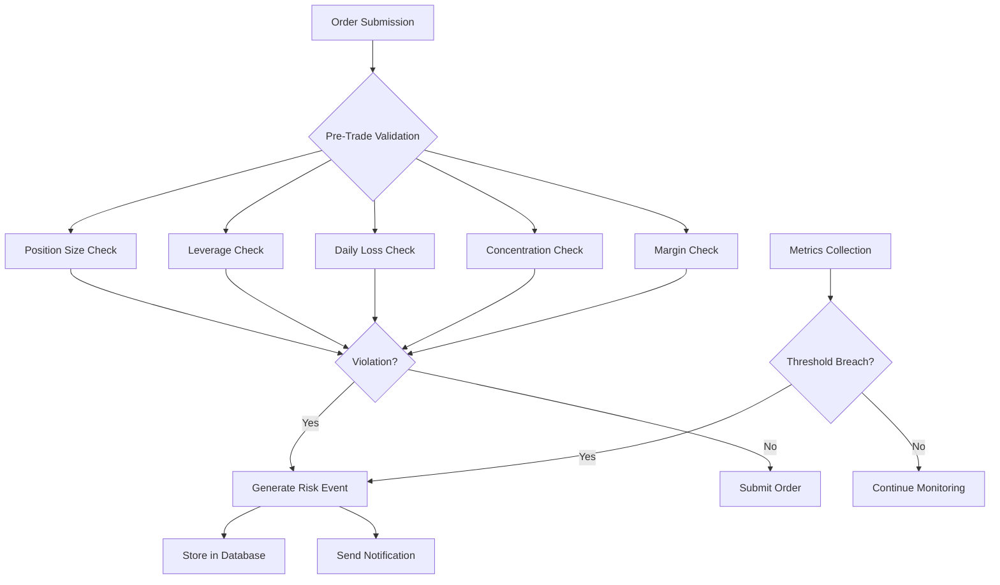
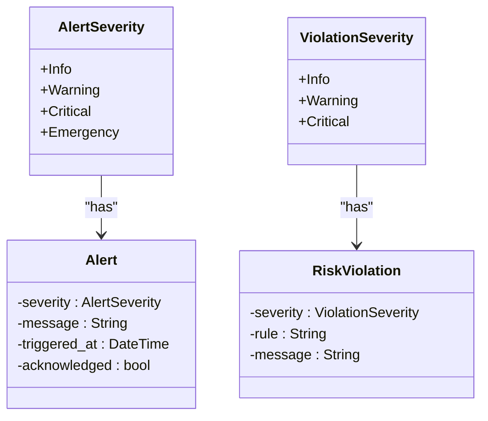
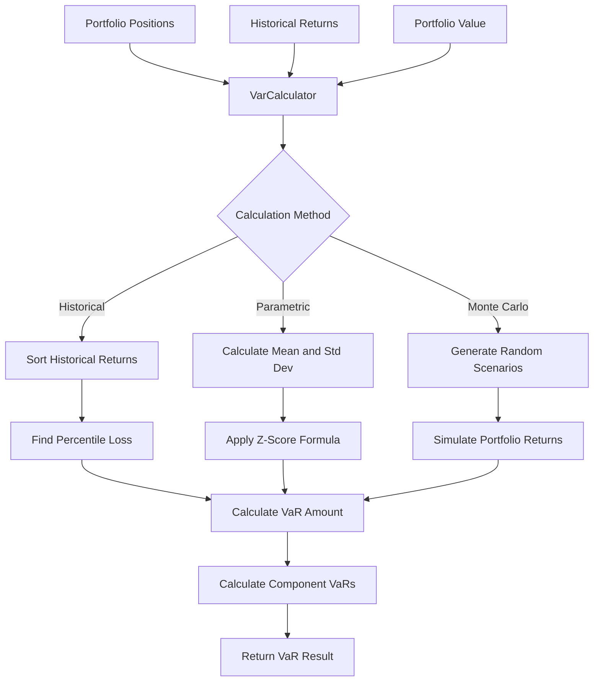
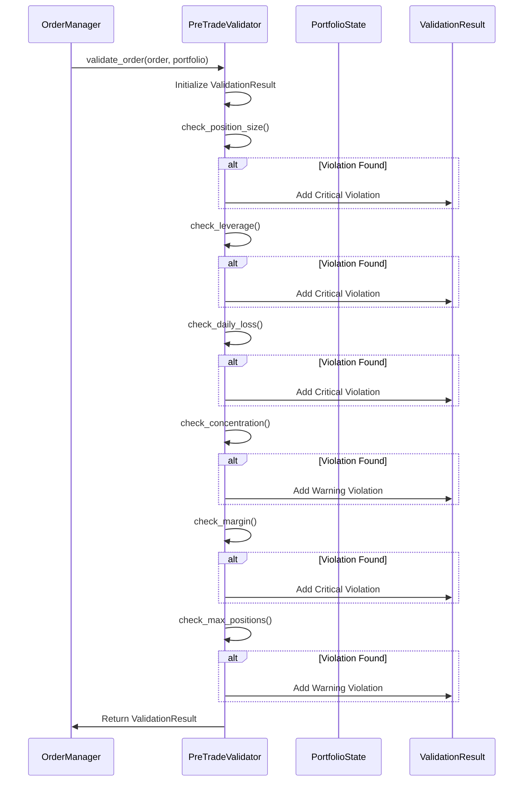
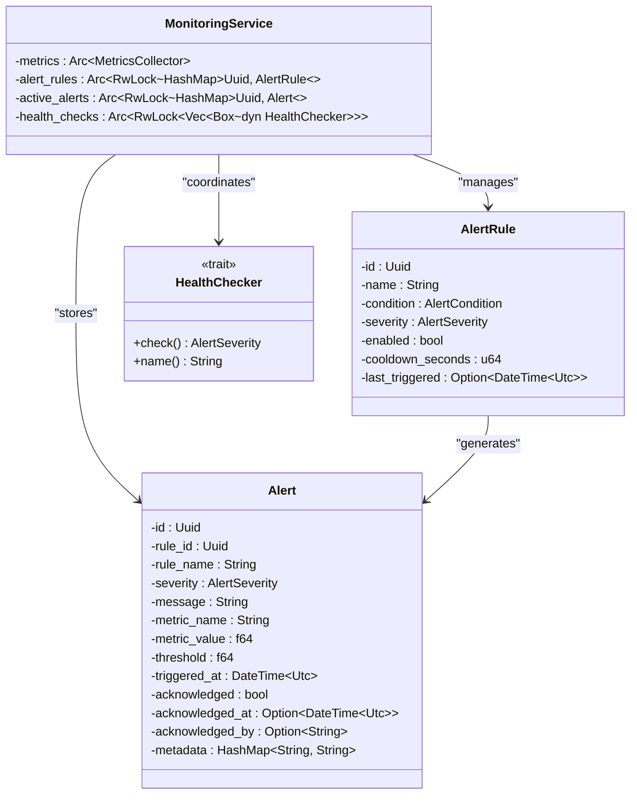
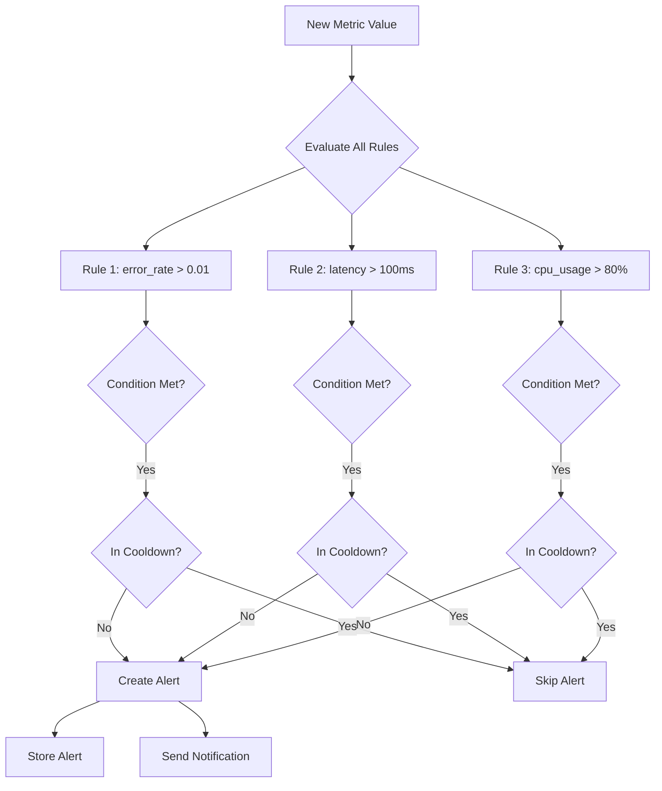
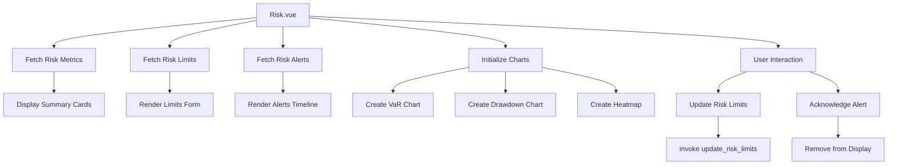
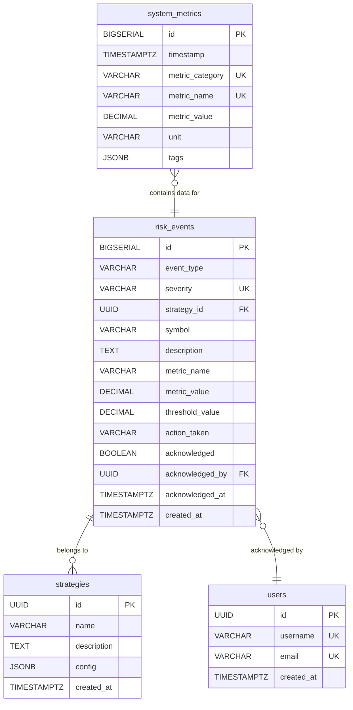

# Risk Alerting System

<cite>
**Referenced Files in This Document**   
- [var.rs](file://crates/risk/src/var.rs)
- [validators.rs](file://crates/risk/src/validators.rs)
- [alerts.rs](file://crates/monitoring/src/alerts.rs)
- [service.rs](file://crates/monitoring/src/service.rs)
- [Risk.vue](file://src/views/Risk.vue)
- [risk.rs](file://src-tauri/src/commands/risk.rs)
- [001_initial_schema.sql](file://migrations/001_initial_schema.sql)
</cite>

## Table of Contents
1. [Introduction](#introduction)
2. [Risk Event Generation and Categorization](#risk-event-generation-and-categorization)
3. [Alert Severity Levels](#alert-severity-levels)
4. [VaR Calculation and Risk Metrics](#var-calculation-and-risk-metrics)
5. [Pre-Trade Risk Validation](#pre-trade-risk-validation)
6. [Monitoring Service Integration](#monitoring-service-integration)
7. [Alert Rule Configuration](#alert-rule-configuration)
8. [Frontend Risk Visualization](#frontend-risk-visualization)
9. [Database Storage of Risk Events](#database-storage-of-risk-events)
10. [Conclusion](#conclusion)

## Introduction
The risk alerting system in the EA OKX platform provides comprehensive monitoring and alerting capabilities for trading risk management. This system integrates risk calculation, pre-trade validation, real-time monitoring, and alerting to ensure safe and controlled trading operations. The architecture combines backend risk calculation with frontend visualization, enabling users to monitor, configure, and respond to risk events effectively.

The system is built around several key components: Value at Risk (VaR) calculation, pre-trade risk validation, alert rule management, and a monitoring service that coordinates these functions. Risk events are generated based on various metrics and thresholds, categorized by severity, and escalated appropriately. The integration between the risk management system and monitoring components ensures timely alerts and notifications when risk thresholds are breached.

**Section sources**
- [var.rs](file://crates/risk/src/var.rs#L1-L354)
- [validators.rs](file://crates/risk/src/validators.rs#L1-L393)
- [alerts.rs](file://crates/monitoring/src/alerts.rs#L1-L215)

## Risk Event Generation and Categorization
Risk events are generated through multiple mechanisms within the system, primarily through pre-trade validation checks and ongoing monitoring of risk metrics. The system categorizes risk events based on their severity and impact on trading operations.

The risk event generation process begins with the `PreTradeValidator` which evaluates orders against configured risk limits before execution. When an order violates any risk rule, a risk violation is created with an appropriate severity level. These violations are then converted into risk events that can trigger alerts.

Additionally, the monitoring system continuously evaluates various metrics against configured alert rules. When a metric crosses a defined threshold for a specified duration, a risk event is generated. This allows for real-time monitoring of system health, trading performance, and risk exposure.

The system stores risk events in the database with comprehensive metadata, including the event type, severity, associated strategy, symbol, description, and action taken. This enables historical analysis of risk events and provides an audit trail for compliance purposes.

**Diagram sources**
- [validators.rs](file://crates/risk/src/validators.rs#L68-L131)
- [service.rs](file://crates/monitoring/src/service.rs#L62-L87)
- [001_initial_schema.sql](file://migrations/001_initial_schema.sql#L197-L230)

**Section sources**
- [validators.rs](file://crates/risk/src/validators.rs#L68-L131)
- [service.rs](file://crates/monitoring/src/service.rs#L62-L87)
- [001_initial_schema.sql](file://migrations/001_initial_schema.sql#L197-L230)

## Alert Severity Levels
The risk alerting system implements a four-tier severity classification system to prioritize and escalate risk events appropriately. Each severity level corresponds to different response requirements and notification channels.

The severity levels are defined in the `AlertSeverity` enum and include:

- **Info**: Informational events that require awareness but no immediate action
- **Warning**: Potential issues that should be monitored and may require intervention
- **Critical**: Serious issues that require immediate attention and may trigger automated responses
- **Emergency**: Severe system-wide issues that require immediate intervention and may trigger system-wide actions

The system uses these severity levels to determine notification channels, escalation procedures, and user interface presentation. Higher severity alerts are displayed more prominently in the frontend and may trigger additional notification methods such as email or mobile push notifications.

In the pre-trade validation system, violations are assigned severity levels based on their potential impact. Critical violations prevent order execution entirely, while warning-level violations allow execution but generate alerts for review. This tiered approach enables appropriate risk management without unnecessarily blocking trading activity.

**Diagram sources**
- [alerts.rs](file://crates/monitoring/src/alerts.rs#L7-L13)
- [validators.rs](file://crates/risk/src/validators.rs#L310-L315)
- [Risk.vue](file://src/views/Risk.vue#L379-L387)

**Section sources**
- [alerts.rs](file://crates/monitoring/src/alerts.rs#L7-L13)
- [validators.rs](file://crates/risk/src/validators.rs#L310-L315)

## VaR Calculation and Risk Metrics
The Value at Risk (VaR) calculation system provides quantitative risk assessment for the trading portfolio using multiple methodologies. The system implements three primary VaR calculation methods: Historical Simulation, Parametric (Variance-Covariance), and Monte Carlo Simulation.

The `VarCalculator` class is responsible for performing VaR calculations based on the configured method and parameters. The calculation takes into account the current portfolio positions, historical returns data, and portfolio value to determine the potential loss at a specified confidence level.

The system also calculates Expected Shortfall (ES), also known as Conditional VaR (CVaR), which measures the average loss beyond the VaR threshold. This provides a more comprehensive view of tail risk than VaR alone.

Key configuration parameters for VaR calculation include:
- Confidence level (e.g., 95%, 99%)
- Time horizon in days
- Historical lookback period
- Calculation method
- Number of Monte Carlo simulations

The VaR system integrates with the monitoring service to provide real-time risk metrics that can trigger alerts when risk thresholds are exceeded. This enables proactive risk management and helps prevent excessive exposure.

**Diagram sources**
- [var.rs](file://crates/risk/src/var.rs#L74-L97)
- [var.rs](file://crates/risk/src/var.rs#L99-L134)
- [var.rs](file://crates/risk/src/var.rs#L136-L174)

**Section sources**
- [var.rs](file://crates/risk/src/var.rs#L74-L300)

## Pre-Trade Risk Validation
The pre-trade risk validation system performs comprehensive checks on orders before they are submitted to the exchange. This proactive approach prevents risky trades from being executed and helps maintain portfolio stability.

The `PreTradeValidator` class implements multiple validation rules that are applied to each order:

1. **Position Size Check**: Ensures that opening a new position or increasing an existing one does not exceed predefined limits for each symbol.

2. **Leverage Check**: Validates that the proposed trade does not cause the portfolio's leverage to exceed the maximum allowed level.

3. **Daily Loss Limit**: Prevents trading when the portfolio has already incurred losses exceeding the daily threshold.

4. **Concentration Check**: Monitors the percentage of portfolio value allocated to a single symbol to prevent excessive concentration risk.

5. **Margin Requirement**: Ensures sufficient margin is available to support the proposed trade.

6. **Maximum Positions**: Limits the total number of open positions to prevent over-diversification.

Each validation rule returns a `RiskViolation` with an appropriate severity level. Critical violations prevent order execution, while warnings allow execution but generate alerts for review. The validation results are returned as a `ValidationResult` containing all detected violations.

**Diagram sources**
- [validators.rs](file://crates/risk/src/validators.rs#L68-L131)
- [validators.rs](file://crates/risk/src/validators.rs#L134-L270)

**Section sources**
- [validators.rs](file://crates/risk/src/validators.rs#L68-L270)

## Monitoring Service Integration
The monitoring service acts as the central coordination point for the risk alerting system, integrating risk calculation, health checking, and alert management. The `MonitoringService` class provides a unified interface for these functions and ensures they work together seamlessly.

The service maintains collections of alert rules and active alerts using thread-safe data structures, allowing concurrent access from multiple components. It exposes methods to register alert rules, evaluate metrics against these rules, and manage triggered alerts.

When a metric value is evaluated, the service checks all registered alert rules that monitor that metric. If a rule's condition is met and the alert is not in cooldown, a new alert is created and stored in the active alerts collection. The service also handles alert acknowledgment, allowing users to mark alerts as resolved.

The monitoring service integrates with health checking components that periodically assess the health of critical system components such as the database and exchange API. These health checks generate metrics that can trigger alerts if system performance degrades.

The service is designed to be extensible, allowing new health checkers and alert rules to be registered at runtime. This enables dynamic configuration of the monitoring system without requiring application restarts.

**Diagram sources**
- [service.rs](file://crates/monitoring/src/service.rs#L12-L33)
- [alerts.rs](file://crates/monitoring/src/alerts.rs#L37-L65)
- [alerts.rs](file://crates/monitoring/src/alerts.rs#L99-L133)

**Section sources**
- [service.rs](file://crates/monitoring/src/service.rs#L12-L173)

## Alert Rule Configuration
The alert rule system provides a flexible framework for defining conditions that trigger risk alerts. Alert rules are configured with specific conditions, severity levels, and operational parameters that determine when and how alerts are generated.

Each alert rule contains the following configuration elements:

- **Metric Name**: The specific metric to monitor (e.g., "error_rate", "latency", "cpu_usage")
- **Operator**: The comparison operator (GreaterThan, LessThan, Equals, etc.)
- **Threshold**: The value that triggers the alert when the condition is met
- **Duration**: The time period for which the condition must persist before triggering
- **Severity**: The alert severity level (Info, Warning, Critical, Emergency)
- **Enabled**: A flag to enable or disable the rule
- **Cooldown**: The minimum time between alert triggers for the same rule

The system includes built-in cooldown functionality to prevent alert storms when a condition persists. Once an alert is triggered, the rule enters a cooldown period during which it will not trigger additional alerts, even if the condition remains true. This prevents notification overload while still allowing for monitoring of ongoing issues.

Alert rules can be dynamically registered and removed at runtime, allowing for flexible configuration without requiring application restarts. The system validates rule conditions before registration to ensure they are properly configured.

**Diagram sources**
- [alerts.rs](file://crates/monitoring/src/alerts.rs#L17-L46)
- [alerts.rs](file://crates/monitoring/src/alerts.rs#L48-L81)
- [service.rs](file://crates/monitoring/src/service.rs#L62-L87)

**Section sources**
- [alerts.rs](file://crates/monitoring/src/alerts.rs#L17-L81)

## Frontend Risk Visualization
The frontend risk visualization component provides a user-friendly interface for monitoring and managing risk events. The Risk.vue component displays key risk metrics, VaR calculations, risk limits, and active alerts in an intuitive dashboard format.

The risk center is organized into several sections:

1. **Risk Summary Cards**: Display key risk metrics such as Portfolio VaR, Maximum Drawdown, Leverage, and Risk Score with visual indicators of their status.

2. **VaR Charts**: Visualize Value at Risk over time with configurable confidence levels (95%, 99%) and calculation methods (Historical, Parametric, Monte Carlo).

3. **Risk Limits Configuration**: Allow users to configure and update risk limits for position size, leverage, daily loss, and other parameters.

4. **Risk Heat Map**: Display a heatmap of risk exposure across different symbols and risk dimensions.

5. **Risk Alerts Timeline**: Show a chronological timeline of active risk alerts with filtering and acknowledgment capabilities.

The frontend communicates with the backend through Tauri commands, enabling seamless integration between the Rust-based risk engine and the Vue.js frontend. Users can update risk limits, acknowledge alerts, and trigger VaR calculations directly from the interface.

The visualization uses color coding and iconography to quickly convey risk status, with green indicating normal conditions, yellow for warnings, and red for critical issues. This allows users to quickly identify areas requiring attention.

**Diagram sources**
- [Risk.vue](file://src/views/Risk.vue#L1-L665)
- [risk.rs](file://src-tauri/src/commands/risk.rs#L21-L52)

**Section sources**
- [Risk.vue](file://src/views/Risk.vue#L1-L665)

## Database Storage of Risk Events
The system persists risk events in the database to provide a historical record and enable analysis of risk patterns over time. The risk_events table is specifically designed to store comprehensive information about each risk event.

The risk_events table schema includes the following key fields:

- **event_type**: Categorizes the type of risk event (e.g., "position_limit", "leverage_breach")
- **severity**: Stores the severity level (info, warning, critical, emergency)
- **strategy_id**: Links the event to a specific trading strategy
- **symbol**: Identifies the financial instrument involved
- **description**: Provides a detailed explanation of the event
- **metric_name** and **metric_value**: Records the specific metric that triggered the event
- **threshold_value**: Stores the threshold that was breached
- **action_taken**: Documents any automated or manual actions taken in response
- **acknowledged** and related fields: Track the acknowledgment status of the alert

The table includes indexes on severity and creation time for efficient querying of unacknowledged critical alerts. This enables quick identification of active issues that require attention. Additional indexes on strategy_id support analysis of risk patterns by strategy.

The system also maintains a system_metrics table that stores time-series data for various metrics, including risk-related metrics. This enables trend analysis and historical comparison of risk exposure over time.

**Diagram sources**
- [001_initial_schema.sql](file://migrations/001_initial_schema.sql#L197-L230)

**Section sources**
- [001_initial_schema.sql](file://migrations/001_initial_schema.sql#L197-L230)

## Conclusion
The risk alerting system in the EA OKX platform provides a comprehensive framework for identifying, categorizing, and responding to trading risks. By combining pre-trade validation, real-time monitoring, and historical analysis, the system enables proactive risk management that protects capital while allowing for effective trading.

The system's modular architecture separates concerns between risk calculation, validation, alerting, and visualization, making it maintainable and extensible. The integration between the Rust-based backend and Vue.js frontend provides both high performance and an intuitive user experience.

Key strengths of the system include its multi-layered approach to risk management, flexible alert configuration, and comprehensive historical record of risk events. The use of standardized severity levels ensures consistent handling of risk events across the platform.

For optimal use, traders should regularly review and adjust risk limits based on market conditions and trading strategy performance. The system's visualization tools make it easy to identify trends and potential issues before they become critical problems.

**Section sources**
- [var.rs](file://crates/risk/src/var.rs#L1-L354)
- [validators.rs](file://crates/risk/src/validators.rs#L1-L393)
- [alerts.rs](file://crates/monitoring/src/alerts.rs#L1-L215)
- [service.rs](file://crates/monitoring/src/service.rs#L1-L374)
- [Risk.vue](file://src/views/Risk.vue#L1-L665)