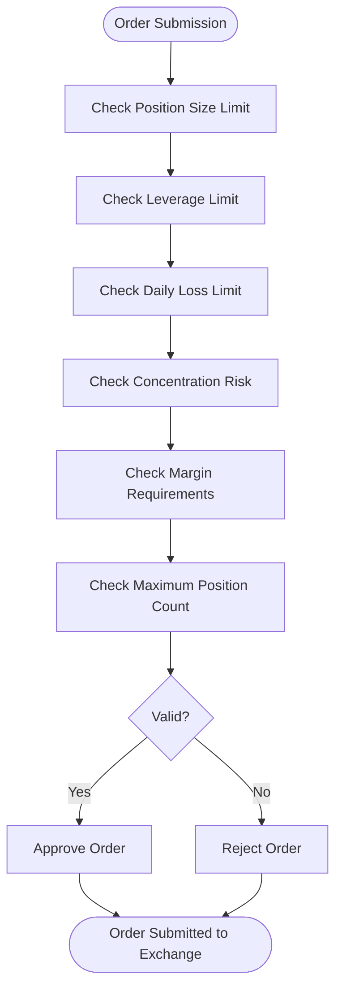
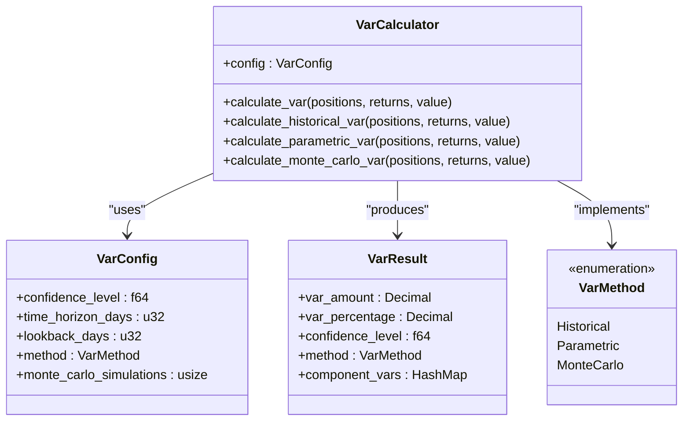
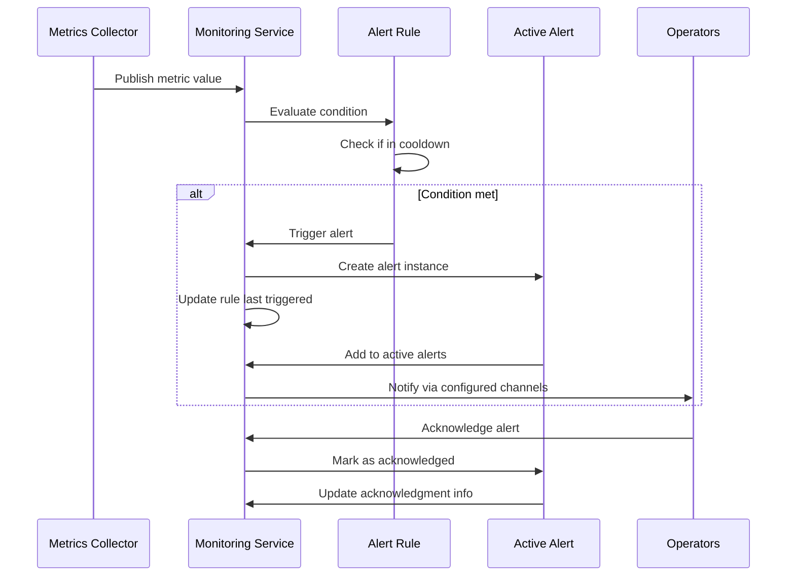
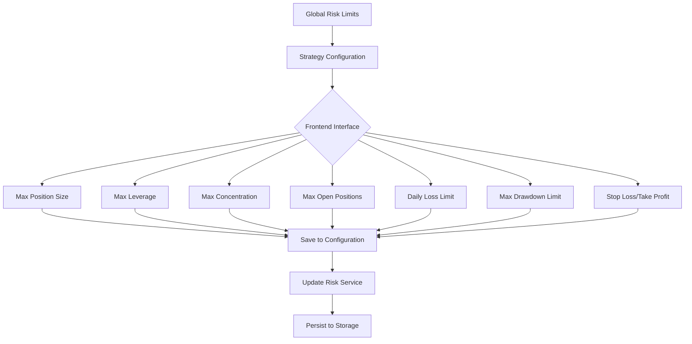
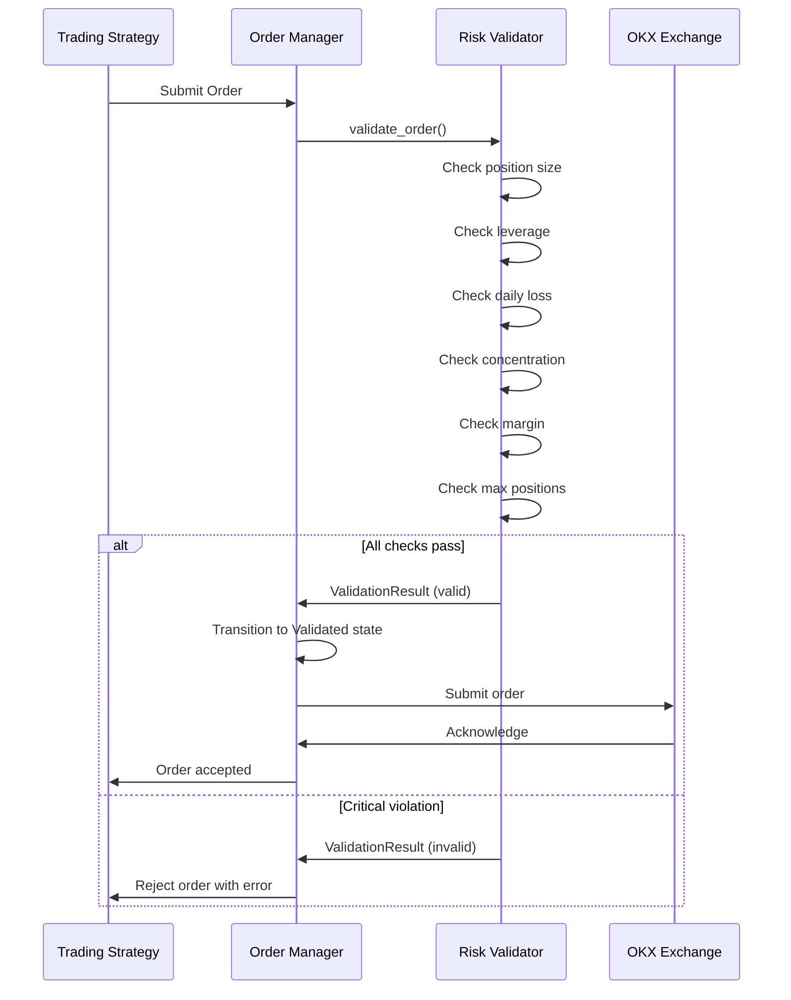

# Risk Management

<cite>
**Referenced Files in This Document**   
- [validators.rs](file://crates/risk/src/validators.rs)
- [var.rs](file://crates/risk/src/var.rs)
- [alerts.rs](file://crates/monitoring/src/alerts.rs)
- [service.rs](file://crates/monitoring/src/service.rs)
- [order_manager.rs](file://crates/trading/src/order_manager.rs)
- [order.rs](file://crates/core/src/models/order.rs)
- [position.rs](file://crates/core/src/models/position.rs)
- [Risk.vue](file://src/views/Risk.vue)
</cite>

## Table of Contents
1. [Introduction](#introduction)
2. [Pre-Trade Validation Framework](#pre-trade-validation-framework)
3. [Value-at-Risk Calculation](#value-at-risk-calculation)
4. [Risk Event Logging and Alerting System](#risk-event-logging-and-alerting-system)
5. [Risk Limits Configuration](#risk-limits-configuration)
6. [Integration with Trading Execution Workflow](#integration-with-trading-execution-workflow)
7. [Risk Validation Scenarios](#risk-validation-scenarios)
8. [Trade-Off Between Risk Protection and Execution Opportunities](#trade-off-between-risk-protection-and-execution-opportunities)
9. [Conclusion](#conclusion)

## Introduction
The risk management system provides comprehensive protection for trading operations through a multi-layered approach that includes pre-trade validation, Value-at-Risk (VaR) assessment, real-time monitoring, and alerting. This documentation details the architecture and implementation of the risk management framework, focusing on its core components and integration points within the trading system. The system is designed to prevent excessive risk exposure while allowing legitimate trading opportunities to proceed.

## Pre-Trade Validation Framework
The pre-trade validation framework performs comprehensive risk checks before any order is submitted to the exchange. Implemented in the `PreTradeValidator` struct, this system evaluates six key risk dimensions: position size, leverage, daily loss limits, concentration risk, margin requirements, and maximum position count.

The validation process begins when an order is submitted through the trading system. The `validate_order` method takes an order and the current portfolio state as inputs, then sequentially checks each risk parameter against configured limits. Critical violations (such as insufficient margin or excessive leverage) prevent order execution entirely, while warning-level violations (such as approaching concentration limits) allow execution but generate alerts for review.

**Diagram sources**
- [validators.rs](file://crates/risk/src/validators.rs#L68-L131)

**Section sources**
- [validators.rs](file://crates/risk/src/validators.rs#L58-L271)

## Value-at-Risk Calculation
The risk management system implements Value-at-Risk (VaR) calculation using three different methods to assess risk exposure: Historical Simulation, Parametric (Variance-Covariance), and Monte Carlo Simulation. The `VarCalculator` class provides a unified interface for these methods, allowing users to select the appropriate approach based on their risk assessment needs.

The Historical Simulation method uses actual historical returns data to calculate VaR by sorting portfolio returns and identifying the loss threshold at the specified confidence level. The Parametric method assumes normal distribution of returns and uses statistical parameters (mean and standard deviation) to calculate VaR, incorporating Z-scores for different confidence levels. The Monte Carlo method, currently implemented as a historical simulation approximation, provides a foundation for future enhancement with full stochastic modeling.

**Diagram sources**
- [var.rs](file://crates/risk/src/var.rs#L70-L300)

**Section sources**
- [var.rs](file://crates/risk/src/var.rs#L1-L354)

## Risk Event Logging and Alerting System
The risk event logging and alerting system provides real-time monitoring of risk metrics and generates alerts when thresholds are breached. Implemented in the `MonitoringService` class, this system coordinates between alert rules, active alerts, and health checks to provide comprehensive risk oversight.

Alert rules are defined with specific conditions including metric name, comparison operator, threshold value, and duration. Each rule has an associated severity level (Info, Warning, Critical, or Emergency) that determines the urgency of the response required. When a rule's condition is met, an alert is triggered and added to the active alerts collection. The system includes cooldown periods to prevent alert flooding and supports acknowledgment of alerts by operations personnel.

**Diagram sources**
- [service.rs](file://crates/monitoring/src/service.rs#L12-L173)
- [alerts.rs](file://crates/monitoring/src/alerts.rs#L6-L141)

**Section sources**
- [service.rs](file://crates/monitoring/src/service.rs#L1-L374)
- [alerts.rs](file://crates/monitoring/src/alerts.rs#L1-L215)

## Risk Limits Configuration
Risk limits are configured through both code-level defaults and runtime adjustable parameters. The `RiskLimits` struct defines the complete set of risk parameters with sensible default values that can be overridden based on specific trading strategy requirements.

The system supports both global risk limits and strategy-specific limits. Global limits are defined in the `RiskLimits` struct with default values such as 3.0x maximum leverage, 25% maximum concentration per symbol, and 15% minimum margin ratio. Strategy-specific limits can be configured through the frontend interface, allowing different strategies to operate under tailored risk parameters based on their market approach and risk tolerance.

**Diagram sources**
- [Risk.vue](file://src/views/Risk.vue#L61-L167)
- [validators.rs](file://crates/risk/src/validators.rs#L11-L33)

**Section sources**
- [validators.rs](file://crates/risk/src/validators.rs#L11-L47)
- [Risk.vue](file://src/views/Risk.vue#L61-L167)

## Integration with Trading Execution Workflow
The risk management system is tightly integrated into the trading execution workflow through the order management process. When a strategy generates a trade signal, the order is first passed to the pre-trade validator before being submitted to the exchange.

In the `OrderManager` class, orders are processed through a state machine that includes a "Validated" state, indicating successful risk checks. The `submit_order` method calls the risk validation framework before proceeding with exchange submission. If validation fails due to critical violations, the order is rejected and the appropriate error is returned to the strategy. This integration ensures that all trades are subject to risk checks without adding significant latency to the execution pipeline.

**Diagram sources**
- [order_manager.rs](file://crates/trading/src/order_manager.rs#L110-L164)
- [validators.rs](file://crates/risk/src/validators.rs#L68-L131)

**Section sources**
- [order_manager.rs](file://crates/trading/src/order_manager.rs#L1-L374)
- [validators.rs](file://crates/risk/src/validators.rs#L68-L131)

## Risk Validation Scenarios
The risk management system handles various validation scenarios that reflect real-world trading conditions. These scenarios demonstrate how the system balances risk protection with execution flexibility.

For example, when a large market order is submitted that would exceed the maximum position size limit, the system rejects the order with a "Position Limit Exceeded" error. Similarly, if a portfolio has already incurred significant daily losses approaching the daily loss limit, any new orders that would increase exposure are blocked to prevent further losses.

The system also handles warning-level conditions differently from critical violations. For instance, when opening a new position would exceed the maximum number of open positions, this generates a warning but does not block execution, recognizing that experienced operators may have valid reasons to exceed certain limits. Similarly, concentration risk warnings are generated when a single position approaches the maximum concentration threshold, allowing operators to make informed decisions about portfolio balance.

**Section sources**
- [validators.rs](file://crates/risk/src/validators.rs#L133-L270)
- [validators.rs](file://crates/risk/src/validators.rs#L318-L392)

## Trade-Off Between Risk Protection and Execution Opportunities
The risk management system is designed to balance the need for robust risk protection with the ability to capture legitimate trading opportunities. This balance is achieved through several mechanisms: tiered violation severity levels, configurable thresholds, and strategy-specific risk profiles.

Critical violations (such as insufficient margin or excessive leverage) are enforced as hard limits to prevent catastrophic losses. Warning-level violations provide guidance without blocking execution, allowing experienced operators to override certain limits when justified by market conditions. The system also supports different risk profiles for different strategies, recognizing that a high-frequency trading strategy may require different risk parameters than a long-term investment strategy.

This balanced approach ensures that the system prevents reckless trading while allowing skilled operators to make informed risk decisions. The logging and alerting system provides full transparency into all risk events, enabling post-trade analysis and continuous improvement of risk parameters.

**Section sources**
- [validators.rs](file://crates/risk/src/validators.rs#L30-L33)
- [validators.rs](file://crates/risk/src/validators.rs#L302-L315)

## Conclusion
The risk management system provides a comprehensive framework for protecting trading operations from excessive risk exposure. Through its pre-trade validation, VaR assessment, and real-time monitoring capabilities, the system ensures that all trades are evaluated against multiple risk dimensions before execution. The integration with the trading workflow is seamless, providing robust protection without introducing significant latency. By balancing hard limits for critical risks with flexible warnings for less severe conditions, the system supports both automated trading strategies and manual trading decisions while maintaining appropriate risk controls.