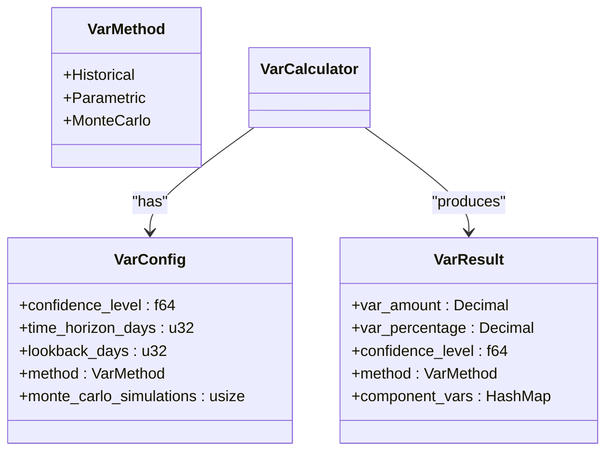
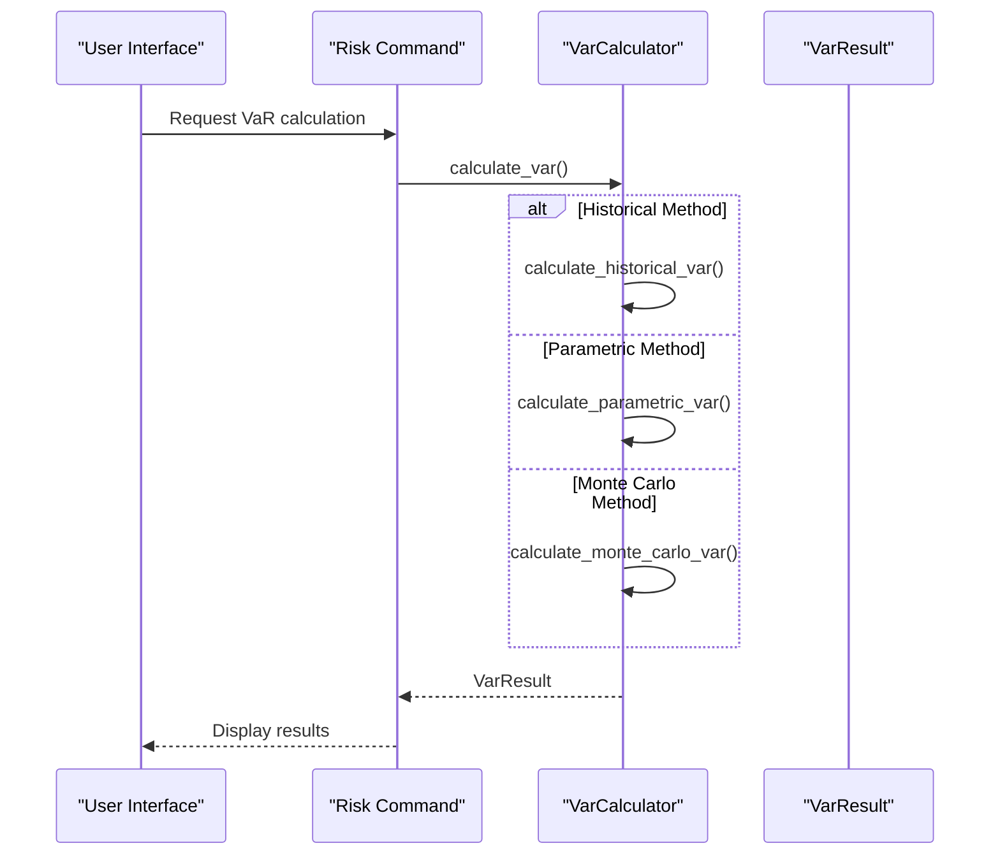
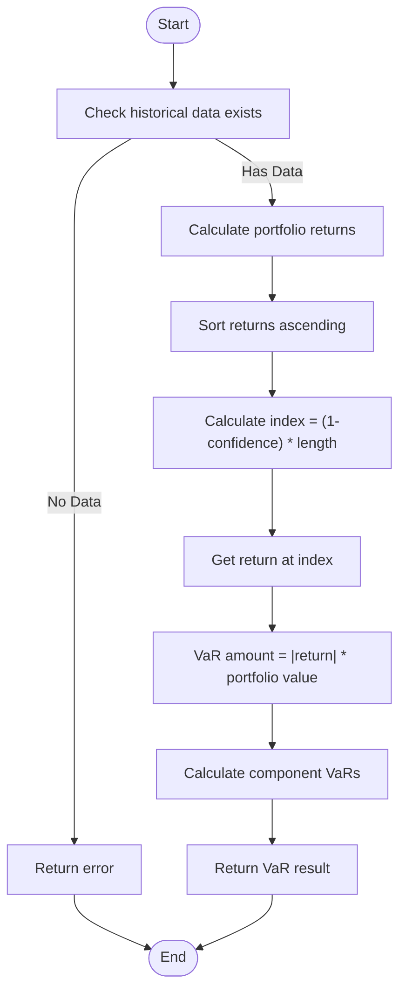
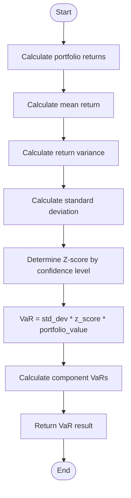
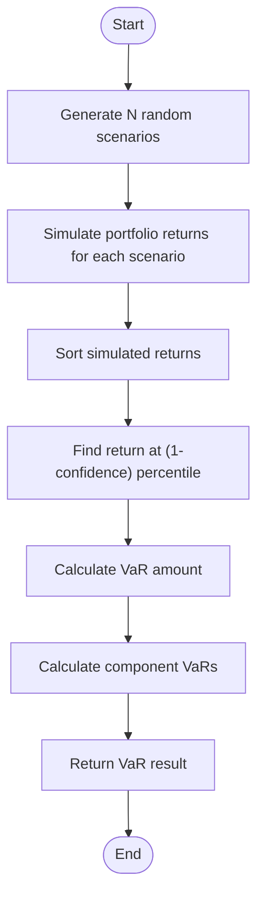
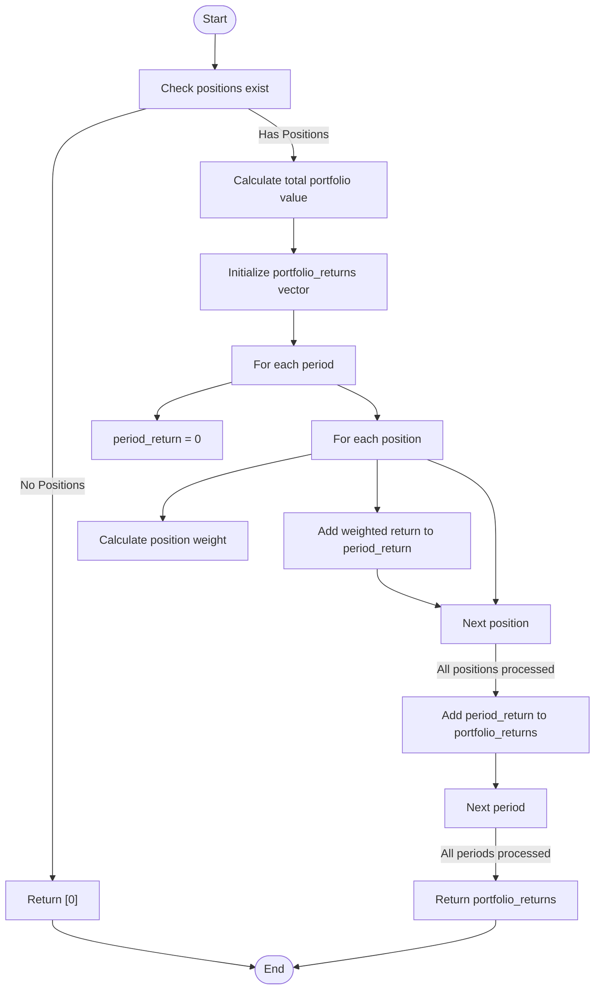
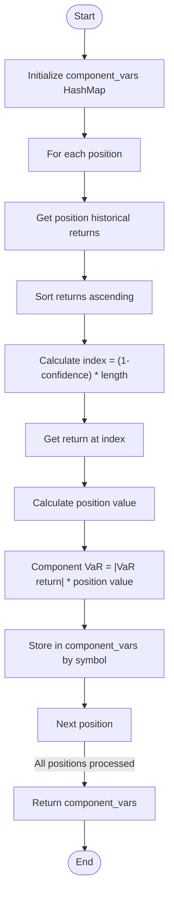
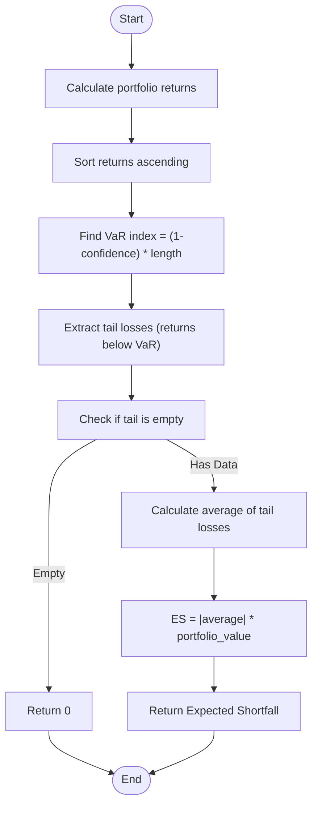
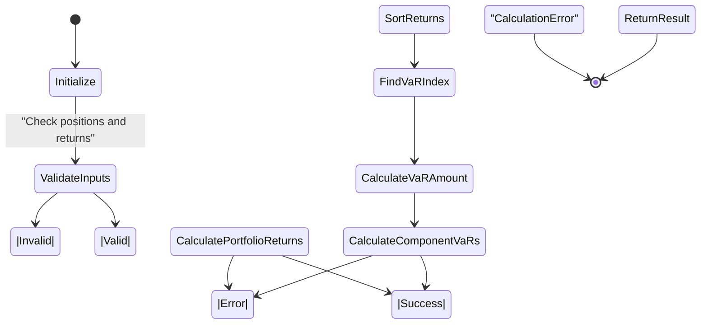

# Value-at-Risk (VaR) Calculation

<cite>
**Referenced Files in This Document**   
- [var.rs](file://crates/risk/src/var.rs)
- [validators.rs](file://crates/risk/src/validators.rs)
- [position.rs](file://crates/core/src/models/position.rs)
- [types.rs](file://crates/core/src/types.rs)
- [Risk.vue](file://src/views/Risk.vue)
- [risk.rs](file://src-tauri/src/commands/risk.rs)
</cite>

## Table of Contents
1. [Introduction](#introduction)
2. [VaR Configuration and Parameters](#var-configuration-and-parameters)
3. [VaR Calculation Methods](#var-calculation-methods)
4. [Historical Simulation Method](#historical-simulation-method)
5. [Parametric (Variance-Covariance) Method](#parametric-variance-covariance-method)
6. [Monte Carlo Simulation Method](#monte-carlo-simulation-method)
7. [Portfolio Return Calculation](#portfolio-return-calculation)
8. [Component VaR Analysis](#component-var-analysis)
9. [Expected Shortfall (CVaR)](#expected-shortfall-cvar)
10. [Frontend Implementation](#frontend-implementation)
11. [Configuration Options](#configuration-options)
12. [Error Handling and Validation](#error-handling-and-validation)
13. [Backtesting and Model Risk](#backtesting-and-model-risk)
14. [Conclusion](#conclusion)

## Introduction
The Value-at-Risk (VaR) calculation system provides a comprehensive framework for assessing risk exposure in the trading platform. VaR is a statistical technique used to measure and quantify the level of financial risk within a portfolio over a specific time frame. This documentation details the implementation of three different VaR methods: Historical Simulation, Parametric (Variance-Covariance), and Monte Carlo Simulation. The system is designed to help traders and risk managers understand potential losses under normal market conditions at a given confidence level.

The VaR system is implemented in the `risk` crate and integrates with the core trading models to provide real-time risk assessment. It calculates both portfolio-level VaR and component VaR for individual positions, enabling detailed risk analysis. The system also calculates Expected Shortfall (CVaR), which measures the average loss beyond the VaR threshold, providing additional insight into tail risk.

**Section sources**
- [var.rs](file://crates/risk/src/var.rs#L1-L57)

## VaR Configuration and Parameters
The VaR system is configured through the `VarConfig` struct, which defines key parameters for the calculation. The configuration includes the confidence level, time horizon, lookback period, calculation method, and Monte Carlo simulation count. The default configuration uses a 95% confidence level, 1-day time horizon, 252-day lookback period (representing one year of trading days), historical simulation method, and 10,000 Monte Carlo simulations.

The confidence level determines the statistical certainty of the VaR estimate, with common values being 90%, 95%, and 99%. The time horizon specifies the period over which risk is measured, typically 1 day for trading risk assessment. The lookback period defines the historical data window used for calculations, with longer periods providing more data but potentially including outdated market conditions.



**Diagram sources**
- [var.rs](file://crates/risk/src/var.rs#L21-L47)
- [var.rs](file://crates/risk/src/var.rs#L51-L67)

**Section sources**
- [var.rs](file://crates/risk/src/var.rs#L21-L47)

## VaR Calculation Methods
The VaR system implements three distinct calculation methods through the `VarMethod` enum: Historical, Parametric, and Monte Carlo. The `VarCalculator` struct provides a unified interface for calculating VaR using any of these methods. The calculation is performed by the `calculate_var` method, which dispatches to the appropriate implementation based on the configured method.

The system is designed to be extensible, allowing for additional VaR methods to be added in the future. Each method has its own strengths and weaknesses, and the choice of method depends on the specific requirements of the risk assessment. Historical simulation is non-parametric and makes no assumptions about return distributions, while the parametric method assumes normal distribution of returns. Monte Carlo simulation provides the most flexibility but requires significant computational resources.



**Diagram sources**
- [var.rs](file://crates/risk/src/var.rs#L80-L97)
- [risk.rs](file://src-tauri/src/commands/risk.rs)

**Section sources**
- [var.rs](file://crates/risk/src/var.rs#L80-L97)

## Historical Simulation Method
The historical simulation method calculates VaR by directly using historical return data without making assumptions about the distribution of returns. This non-parametric approach sorts historical portfolio returns and identifies the loss threshold at the specified confidence level. The method is particularly useful when return distributions are non-normal or when there is insufficient data to reliably estimate distribution parameters.

The implementation first calculates portfolio returns for each historical period by weighting individual position returns by their portfolio value. These portfolio returns are then sorted in ascending order, and the VaR is determined by selecting the return at the percentile corresponding to (1 - confidence level). For example, with a 95% confidence level, the 5th percentile return is used as the VaR threshold.



**Diagram sources**
- [var.rs](file://crates/risk/src/var.rs#L99-L134)

**Section sources**
- [var.rs](file://crates/risk/src/var.rs#L99-L134)

## Parametric (Variance-Covariance) Method
The parametric method, also known as the variance-covariance method, assumes that portfolio returns are normally distributed. This approach calculates VaR using the standard deviation of portfolio returns and a Z-score corresponding to the confidence level. The method is computationally efficient and provides a closed-form solution, but its accuracy depends on the validity of the normal distribution assumption.

The implementation first calculates the mean and variance of portfolio returns, then derives the standard deviation. The Z-score is determined based on the confidence level, with common values being 1.28 for 90%, 1.65 for 95%, and 2.33 for 99%. The VaR is calculated as the product of the standard deviation, Z-score, and portfolio value. This method is sensitive to the assumption of normality and may underestimate risk during periods of market stress when return distributions exhibit fat tails.



**Diagram sources**
- [var.rs](file://crates/risk/src/var.rs#L137-L185)

**Section sources**
- [var.rs](file://crates/risk/src/var.rs#L137-L185)

## Monte Carlo Simulation Method
The Monte Carlo simulation method estimates VaR by generating a large number of possible future scenarios based on statistical models of market behavior. In the current implementation, this method is simplified and uses historical simulation as an approximation, with plans to implement proper random number generation in production. This approach can capture complex relationships and non-linear risks that other methods might miss.

Monte Carlo simulation works by creating artificial return series through random sampling from a specified probability distribution. The number of simulations is configurable, with the default set to 10,000 to ensure statistical reliability. The simulated returns are then processed similarly to historical returns to determine the VaR threshold. This method is particularly useful for portfolios with non-linear instruments like options, where the relationship between underlying asset prices and portfolio value is complex.



**Diagram sources**
- [var.rs](file://crates/risk/src/var.rs#L187-L197)

**Section sources**
- [var.rs](file://crates/risk/src/var.rs#L187-L197)

## Portfolio Return Calculation
The portfolio return calculation is a critical component used by all VaR methods. It computes the weighted average return of all positions in the portfolio for each historical period. The weights are determined by the relative value of each position within the total portfolio value. This approach accounts for the diversification effects and correlations between different positions.

The implementation first calculates the total portfolio value by summing the value of all positions (quantity × current price). For each historical period, it then computes the weighted contribution of each position's return to the overall portfolio return. This weighted sum approach ensures that larger positions have a proportionally greater impact on the portfolio's risk profile. The resulting time series of portfolio returns is used as input for the VaR calculation.



**Diagram sources**
- [var.rs](file://crates/risk/src/var.rs#L200-L242)

**Section sources**
- [var.rs](file://crates/risk/src/var.rs#L200-L242)

## Component VaR Analysis
Component VaR analysis breaks down the total portfolio VaR into contributions from individual positions, providing insight into which positions contribute most to overall risk. This analysis helps identify concentration risk and informs diversification strategies. The implementation calculates component VaR by applying the same VaR methodology to each position individually, using its historical returns and current value.

For each position, the system sorts its historical returns and identifies the VaR threshold at the specified confidence level. The component VaR amount is then calculated as the product of the VaR return and the position's current value. These individual component VaRs can be aggregated to verify consistency with the portfolio VaR, although they may not sum exactly due to diversification effects and correlations between positions.



**Diagram sources**
- [var.rs](file://crates/risk/src/var.rs#L244-L270)

**Section sources**
- [var.rs](file://crates/risk/src/var.rs#L244-L270)

## Expected Shortfall (CVaR)
Expected Shortfall (ES), also known as Conditional VaR (CVaR), measures the average loss beyond the VaR threshold, providing information about the severity of losses in the tail of the distribution. Unlike VaR, which only specifies the minimum loss at a confidence level, CVaR quantifies the expected loss given that the loss exceeds the VaR threshold. This makes CVaR a more comprehensive risk measure, particularly for assessing tail risk.

The implementation calculates CVaR by first determining the VaR threshold, then computing the average of all returns that are worse than this threshold (the "tail losses"). This average is then converted to a monetary value by multiplying by the portfolio value. CVaR is considered a coherent risk measure, satisfying properties like subadditivity, which makes it suitable for portfolio optimization and regulatory capital calculations.



**Diagram sources**
- [var.rs](file://crates/risk/src/var.rs#L273-L298)

**Section sources**
- [var.rs](file://crates/risk/src/var.rs#L273-L298)

## Frontend Implementation
The frontend implementation provides a user-friendly interface for viewing VaR calculations and risk metrics. The Risk.vue component displays VaR values for different confidence levels and methods, allowing users to compare risk assessments. The interface includes interactive charts showing historical VaR values and drawdown analysis, helping users visualize risk trends over time.

The frontend allows users to select between different VaR methods (Historical, Parametric, Monte Carlo) and confidence levels (95%, 99%) through dropdown selectors. It displays both portfolio-level VaR and component VaRs for individual positions, with color-coded indicators for high-risk positions. The implementation uses ECharts for data visualization, providing interactive line charts that update in response to user selections.

```mermaid
graph TB
subgraph "Frontend"
UI[User Interface]
VarChart[VaR Chart]
DrawdownChart[Drawdown Chart]
Controls[Method and Confidence Controls]
end
subgraph "Backend"
API[API Server]
RiskCommand[Risk Command]
VarCalculator[VarCalculator]
end
Controls --> UI
UI --> RiskCommand: Request VaR data
RiskCommand --> VarCalculator: calculate_var()
VarCalculator --> RiskCommand: VarResult
RiskCommand --> API: Return results
API --> UI: VaR data
UI --> VarChart: Display VaR
UI --> DrawdownChart: Display drawdown
```

**Diagram sources**
- [Risk.vue](file://src/views/Risk.vue)
- [risk.rs](file://src-tauri/src/commands/risk.rs)

**Section sources**
- [Risk.vue](file://src/views/Risk.vue)
- [risk.rs](file://src-tauri/src/commands/risk.rs)

## Configuration Options
The VaR system provides several configuration options to customize risk assessment according to specific requirements. The `VarConfig` struct exposes parameters for confidence level, time horizon, lookback period, calculation method, and Monte Carlo simulation count. These options allow users to balance between statistical reliability, computational efficiency, and relevance to current market conditions.

The confidence level can be set to common values like 0.90, 0.95, or 0.99, representing 90%, 95%, or 99% confidence that losses will not exceed the VaR amount. The time horizon typically ranges from 1 day for trading risk to 10 days for regulatory capital calculations. The lookback period determines the historical data window, with longer periods providing more data points but potentially including outdated market regimes.

```mermaid
erDiagram
VARCONFIG {
f64 confidence_level
u32 time_horizon_days
u32 lookback_days
VarMethod method
usize monte_carlo_simulations
}
VARMETHOD {
Historical
Parametric
MonteCarlo
}
VARCONFIG ||--o{ VARMETHOD : "uses"
```

**Diagram sources**
- [var.rs](file://crates/risk/src/var.rs#L21-L36)

**Section sources**
- [var.rs](file://crates/risk/src/var.rs#L21-L36)

## Error Handling and Validation
The VaR system includes comprehensive error handling to manage various failure scenarios and data quality issues. Errors are defined in the `Error` enum and include specific cases for calculation errors, insufficient historical data, and invalid configurations. The system validates inputs before performing calculations and returns descriptive error messages to aid in troubleshooting.

When historical data is missing or insufficient, the system returns a `CalculationError` with an appropriate message. The implementation also checks for edge cases like empty position lists or zero portfolio values, handling them gracefully. Error handling is integrated throughout the calculation pipeline, ensuring that issues are caught early and propagated appropriately to the calling components.



**Diagram sources**
- [var.rs](file://crates/risk/src/var.rs#L106-L108)
- [error.rs](file://crates/risk/src/error.rs)

**Section sources**
- [var.rs](file://crates/risk/src/var.rs#L106-L108)
- [error.rs](file://crates/risk/src/error.rs)

## Backtesting and Model Risk
Backtesting is a critical process for validating the accuracy of VaR models by comparing predicted risk levels against actual outcomes. Model risk refers to the potential for losses due to errors in the model's assumptions, implementation, or application. The VaR system should be regularly backtested by comparing the predicted VaR against actual daily P&L to ensure the model is properly calibrated.

For a 95% confidence level VaR model, we would expect the actual loss to exceed the VaR estimate approximately 5% of the time. Significantly more frequent exceedances indicate the model is underestimating risk, while significantly fewer suggest it is overly conservative. The system could be enhanced with formal backtesting frameworks like Kupiec's proportion of failures test or Christoffersen's conditional coverage test to statistically validate model performance.

Common sources of model risk in VaR systems include:
- Assumption of normal return distributions when actual returns exhibit fat tails
- Use of historical correlations that may not hold during market stress
- Inadequate lookback periods that don't capture relevant market regimes
- Simplified Monte Carlo implementation that doesn't properly model market dynamics
- Failure to account for liquidity risk and position closing costs

Regular model validation, stress testing, and scenario analysis should complement VaR calculations to provide a more comprehensive risk assessment.

**Section sources**
- [var.rs](file://crates/risk/src/var.rs)
- [validators.rs](file://crates/risk/src/validators.rs)

## Conclusion
The Value-at-Risk system provides a robust framework for quantifying market risk in the trading platform. By implementing three different calculation methods—Historical Simulation, Parametric (Variance-Covariance), and Monte Carlo Simulation—the system offers flexibility to match different risk assessment needs and assumptions. The integration of component VaR analysis and Expected Shortfall calculations provides comprehensive risk insights beyond simple portfolio-level metrics.

The system is well-structured with clear separation of concerns, making it maintainable and extensible. The configuration options allow for customization to different risk management requirements, while the error handling ensures reliability. The frontend integration provides an intuitive interface for monitoring and analyzing risk metrics.

For production use, the Monte Carlo implementation should be enhanced with proper random number generation and more sophisticated market models. Additionally, implementing formal backtesting procedures and stress testing scenarios would further strengthen the risk management framework. The system serves as a solid foundation for quantitative risk assessment that can be extended with additional features like liquidity-adjusted VaR, multi-period VaR, and integration with stress testing frameworks.