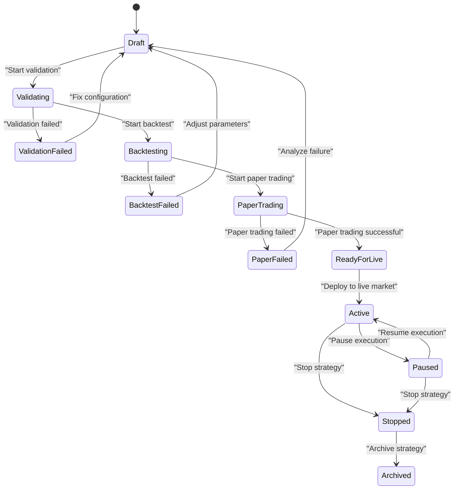
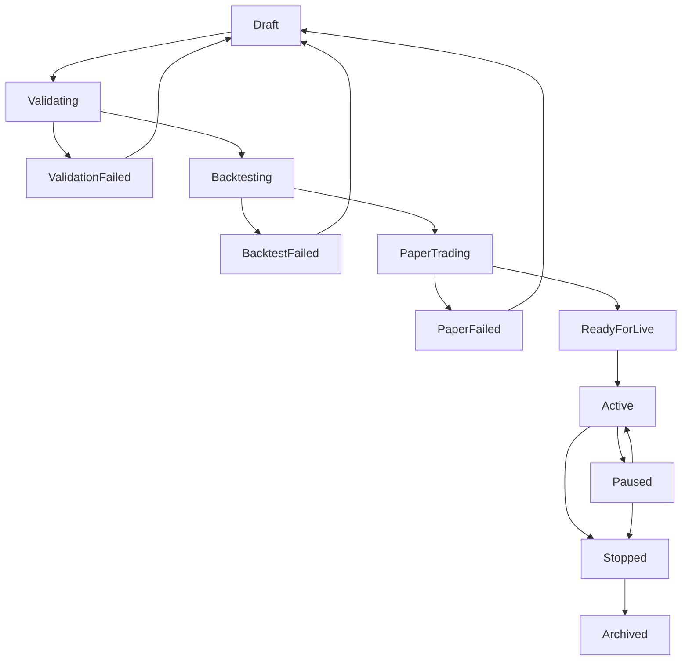
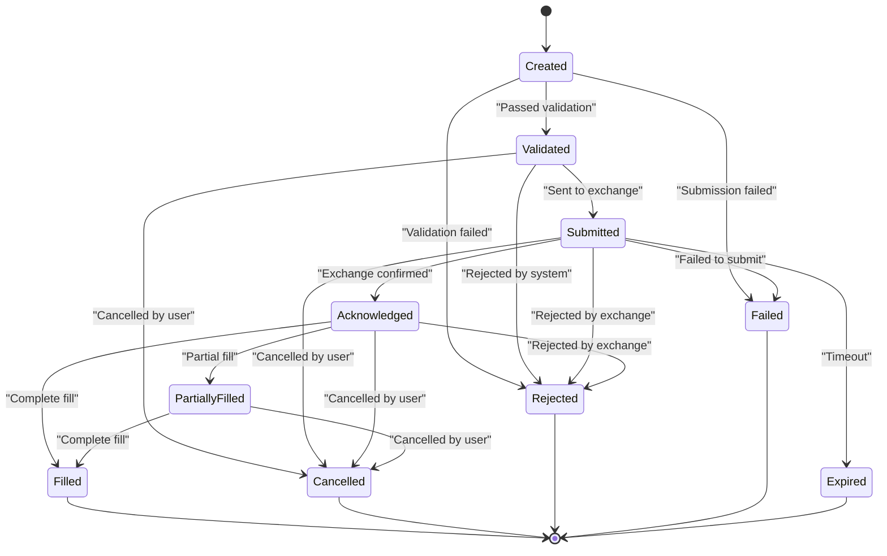

# Lifecycle Management

<cite>
**Referenced Files in This Document**   
- [lifecycle.rs](file://crates/strategy/src/lifecycle.rs)
- [strategy.rs](file://crates/core/src/models/strategy.rs)
- [state_machine.rs](file://crates/trading/src/state_machine.rs)
- [strategy.rs](file://src-tauri/src/commands/strategy.rs)
- [order_manager.rs](file://crates/trading/src/order_manager.rs)
</cite>

## Table of Contents
1. [Introduction](#introduction)
2. [Strategy Lifecycle States](#strategy-lifecycle-states)
3. [State Transition Rules](#state-transition-rules)
4. [Lifecycle Implementation](#lifecycle-implementation)
5. [Order State Machine](#order-state-machine)
6. [State Transition Examples](#state-transition-examples)
7. [Error Handling and Recovery](#error-handling-and-recovery)
8. [Termination and Cleanup](#termination-and-cleanup)
9. [Frontend Integration](#frontend-integration)
10. [Best Practices](#best-practices)

## Introduction
The strategy lifecycle management system provides a robust state machine for controlling the execution of trading strategies from creation to termination. This document details the 12-state lifecycle that governs strategy execution, including validation rules, transition logic, and integration with the trading system. The lifecycle ensures that strategies progress through well-defined states with proper validation and error handling at each step.

**Section sources**
- [lifecycle.rs](file://crates/strategy/src/lifecycle.rs#L1-L129)
- [strategy.rs](file://crates/core/src/models/strategy.rs#L1-L306)

## Strategy Lifecycle States
The strategy lifecycle consists of 12 distinct states that represent the various stages of a strategy's existence. Each state has specific characteristics and valid transitions to other states.



**Diagram sources**
- [lifecycle.rs](file://crates/strategy/src/lifecycle.rs#L8-L22)
- [lifecycle.rs](file://crates/strategy/src/lifecycle.rs#L74-L92)

### State Descriptions
Each state in the lifecycle serves a specific purpose in the strategy's journey:

**Draft**: Initial state when a strategy is created. In this state, the strategy configuration can be modified but no execution occurs.

**Validating**: The strategy is undergoing validation checks to ensure its configuration is correct and meets all requirements.

**ValidationFailed**: Validation identified issues with the strategy configuration. The strategy must be returned to Draft state for corrections.

**Backtesting**: The strategy is being tested against historical market data to evaluate its performance characteristics.

**BacktestFailed**: Backtesting encountered errors or the strategy failed to meet performance criteria.

**PaperTrading**: The strategy is running in a simulated environment with real-time market data but without actual fund allocation.

**PaperFailed**: Paper trading revealed issues with the strategy's performance or execution.

**ReadyForLive**: The strategy has successfully passed all testing phases and is ready for deployment to live markets.

**Active**: The strategy is actively executing trades in the live market environment.

**Paused**: The strategy has been temporarily suspended but can be resumed to continue execution.

**Stopped**: The strategy has been stopped and will not execute further trades.

**Archived**: The strategy has been permanently archived and is no longer available for execution.

**Section sources**
- [lifecycle.rs](file://crates/strategy/src/lifecycle.rs#L8-L22)

## State Transition Rules
The lifecycle enforces strict rules about valid state transitions to maintain system integrity and prevent invalid state changes.

### Valid Transitions
The following transitions are permitted according to the lifecycle rules:



**Diagram sources**
- [lifecycle.rs](file://crates/strategy/src/lifecycle.rs#L74-L92)

### Transition Validation
The `is_valid_transition` method implements the business logic that determines whether a state change is permitted:

```rust
fn is_valid_transition(&self, to_state: StrategyState) -> bool {
    use StrategyState::*;
    matches!(
        (self.current_state, to_state),
        (Draft, Validating)
            | (Validating, ValidationFailed)
            | (Validating, Backtesting)
            | (ValidationFailed, Draft)
            | (Backtesting, BacktestFailed)
            | (Backtesting, PaperTrading)
            | (BacktestFailed, Draft)
            | (PaperTrading, PaperFailed)
            | (PaperTrading, ReadyForLive)
            | (PaperFailed, Draft)
            | (ReadyForLive, Active)
            | (Active, Paused)
            | (Paused, Active)
            | (Active, Stopped)
            | (Paused, Stopped)
            | (Stopped, Archived)
    )
}
```

This implementation uses pattern matching to define all valid state transitions, ensuring that only approved paths are allowed.

**Section sources**
- [lifecycle.rs](file://crates/strategy/src/lifecycle.rs#L71-L92)

## Lifecycle Implementation
The lifecycle management system is implemented as a state machine with comprehensive tracking and validation.

### StrategyLifecycle Structure
The `StrategyLifecycle` struct manages the current state and transition history:

```rust
pub struct StrategyLifecycle {
    current_state: StrategyState,
    state_history: Vec<StateTransition>,
}
```

The `StateTransition` record captures details of each state change:

```rust
pub struct StateTransition {
    from_state: StrategyState,
    to_state: StrategyState,
    timestamp: DateTime<Utc>,
    reason: String,
}
```

**Section sources**
- [lifecycle.rs](file://crates/strategy/src/lifecycle.rs#L26-L38)

### Transition Method
The `transition` method handles state changes with validation and history tracking:

```rust
pub fn transition(&mut self, to_state: StrategyState, reason: impl Into<String>) -> Result<()> {
    if !self.is_valid_transition(to_state) {
        return Err(Error::StateTransitionError(format!(
            "Invalid transition from {:?} to {:?}",
            self.current_state, to_state
        )));
    }

    self.state_history.push(StateTransition {
        from_state: self.current_state,
        to_state,
        timestamp: Utc::now(),
        reason: reason.into(),
    });

    self.current_state = to_state;
    Ok(())
}
```

This method ensures that only valid transitions occur, records the transition in the history, and updates the current state.

**Section sources**
- [lifecycle.rs](file://crates/strategy/src/lifecycle.rs#L52-L68)

## Order State Machine
The trading system implements a complementary state machine for order execution that works in conjunction with the strategy lifecycle.



**Diagram sources**
- [state_machine.rs](file://crates/trading/src/state_machine.rs#L10-L31)

### Order State Validation
The order state machine includes validation to prevent invalid transitions:

```rust
fn is_valid_transition(&self, to_state: OrderState) -> bool {
    use OrderState::*;
    if self.current_state.is_terminal() {
        return false;
    }
    if self.current_state == to_state {
        return true;
    }
    matches!(
        (self.current_state, to_state),
        (Created, Validated)
            | (Created, Rejected)
            | (Created, Failed)
            | (Validated, Submitted)
            | (Validated, Rejected)
            | (Validated, Cancelled)
            | (Submitted, Acknowledged)
            | (Submitted, Rejected)
            | (Submitted, Failed)
            | (Submitted, Cancelled)
            | (Submitted, Expired)
            | (Acknowledged, PartiallyFilled)
            | (Acknowledged, Filled)
            | (Acknowledged, Cancelled)
            | (Acknowledged, Rejected)
            | (PartiallyFilled, Filled)
            | (PartiallyFilled, Cancelled)
    )
}
```

**Section sources**
- [state_machine.rs](file://crates/trading/src/state_machine.rs#L117-L150)

## State Transition Examples
The system provides concrete examples of state transitions in response to user actions and system events.

### Strategy Creation
When a new strategy is created, it starts in the Draft state:

```rust
impl StrategyLifecycle {
    pub fn new() -> Self {
        Self {
            current_state: StrategyState::Draft,
            state_history: vec![],
        }
    }
}
```

**Section sources**
- [lifecycle.rs](file://crates/strategy/src/lifecycle.rs#L41-L46)

### Starting Validation
To begin validation, the strategy transitions from Draft to Validating:

```rust
let mut lifecycle = StrategyLifecycle::new();
assert!(lifecycle
    .transition(StrategyState::Validating, "Start validation")
    .is_ok());
assert_eq!(lifecycle.current_state(), StrategyState::Validating);
```

**Section sources**
- [lifecycle.rs](file://crates/strategy/src/lifecycle.rs#L114-L118)

### Deploying to Live Market
After successful paper trading, a strategy can be deployed to live markets:

```rust
// Strategy progresses through testing phases
lifecycle.transition(StrategyState::PaperTrading, "Start paper trading")?;
lifecycle.transition(StrategyState::ReadyForLive, "Paper trading successful")?;
// Deploy to live market
lifecycle.transition(StrategyState::Active, "Deploy to production")?;
```

**Section sources**
- [lifecycle.rs](file://crates/strategy/src/lifecycle.rs#L84-L86)

### Pausing and Resuming
Active strategies can be temporarily paused and later resumed:

```rust
// Pause an active strategy
lifecycle.transition(StrategyState::Paused, "Temporary pause")?;
// Resume the strategy later
lifecycle.transition(StrategyState::Active, "Resume execution")?;
```

**Section sources**
- [lifecycle.rs](file://crates/strategy/src/lifecycle.rs#L87-L88)

## Error Handling and Recovery
The lifecycle system includes robust error handling to manage invalid transitions and recover from failures.

### Invalid Transition Prevention
The system prevents invalid state transitions and provides clear error messages:

```rust
#[test]
fn test_invalid_transition() {
    let mut lifecycle = StrategyLifecycle::new();
    assert!(lifecycle
        .transition(StrategyState::Active, "Invalid")
        .is_err());
}
```

When an invalid transition is attempted, the system returns a `StateTransitionError` with details about the invalid transition.

**Section sources**
- [lifecycle.rs](file://crates/strategy/src/lifecycle.rs#L122-L126)

### Recovery from Validation Failure
If validation fails, the strategy can be returned to Draft state for correction:

```rust
// After validation failure
lifecycle.transition(StrategyState::ValidationFailed, "Configuration error")?;
// Return to Draft to fix issues
lifecycle.transition(StrategyState::Draft, "Fix configuration")?;
```

This allows users to correct configuration issues and retry validation.

**Section sources**
- [lifecycle.rs](file://crates/strategy/src/lifecycle.rs#L77-L79)

## Termination and Cleanup
Proper termination and cleanup procedures ensure that resources are released and state is properly managed.

### Stopping a Strategy
Strategies can be stopped from either Active or Paused states:

```rust
// Stop an active strategy
lifecycle.transition(StrategyState::Stopped, "User requested stop")?;
// Or stop a paused strategy
lifecycle.transition(StrategyState::Paused, "Pause for maintenance")?;
lifecycle.transition(StrategyState::Stopped, "Stop permanently")?;
```

**Section sources**
- [lifecycle.rs](file://crates/strategy/src/lifecycle.rs#L89-L90)

### Archiving a Strategy
Once stopped, a strategy can be archived to remove it from active management:

```rust
lifecycle.transition(StrategyState::Stopped, "End strategy")?;
lifecycle.transition(StrategyState::Archived, "Archive completed strategy")?;
```

**Section sources**
- [lifecycle.rs](file://crates/strategy/src/lifecycle.rs#L91)

### Strategy Status Updates
The `Strategy` model includes methods to update status with proper timestamp management:

```rust
pub fn set_status(&mut self, status: StrategyStatus) {
    self.status = status;
    self.updated_at = Utc::now();
    if status == StrategyStatus::Active && self.deployed_at.is_none() {
        self.deployed_at = Some(Utc::now());
    }
    if matches!(status, StrategyStatus::Stopped | StrategyStatus::Archived)
        && self.stopped_at.is_none()
    {
        self.stopped_at = Some(Utc::now());
    }
}
```

**Section sources**
- [strategy.rs](file://crates/core/src/models/strategy.rs#L175-L187)

## Frontend Integration
The Tauri frontend commands provide an interface for controlling strategy lifecycle through the user interface.

### Command Handlers
The frontend exposes commands for common lifecycle operations:

```rust
/// Start strategy
#[tauri::command]
pub async fn start_strategy(id: String) -> Result<(), String> {
    log::info!("Starting strategy: {}", id);
    Ok(())
}

/// Stop strategy
#[tauri::command]
pub async fn stop_strategy(id: String) -> Result<(), String> {
    log::info!("Stopping strategy: {}", id);
    Ok(())
}

/// Pause strategy
#[tauri::command]
pub async fn pause_strategy(id: String) -> Result<(), String> {
    log::info!("Pausing strategy: {}", id);
    Ok(())
}
```

These commands will be integrated with the backend strategy service to control the lifecycle.

**Section sources**
- [strategy.rs](file://src-tauri/src/commands/strategy.rs#L111-L136)

## Best Practices
To ensure reliable operation of the strategy lifecycle system, follow these best practices:

### Use Descriptive Transition Reasons
Always provide meaningful reasons for state transitions to aid in debugging and auditing:

```rust
lifecycle.transition(StrategyState::Active, "Deploy after successful paper trading")?;
```

### Handle Errors Gracefully
Wrap lifecycle operations in error handling to manage invalid transitions:

```rust
match lifecycle.transition(StrategyState::Active, "Start live trading") {
    Ok(()) => log::info!("Strategy activated successfully"),
    Err(e) => log::error!("Failed to activate strategy: {}", e),
}
```

### Monitor State Changes
Subscribe to state change events to react to lifecycle transitions:

```rust
// The system could provide event notifications for state changes
// allowing other components to react appropriately
```

### Plan for All States
Ensure your strategy implementation handles all possible states appropriately, including error states and paused states.

**Section sources**
- [lifecycle.rs](file://crates/strategy/src/lifecycle.rs#L52-L68)
- [strategy.rs](file://src-tauri/src/commands/strategy.rs#L111-L136)