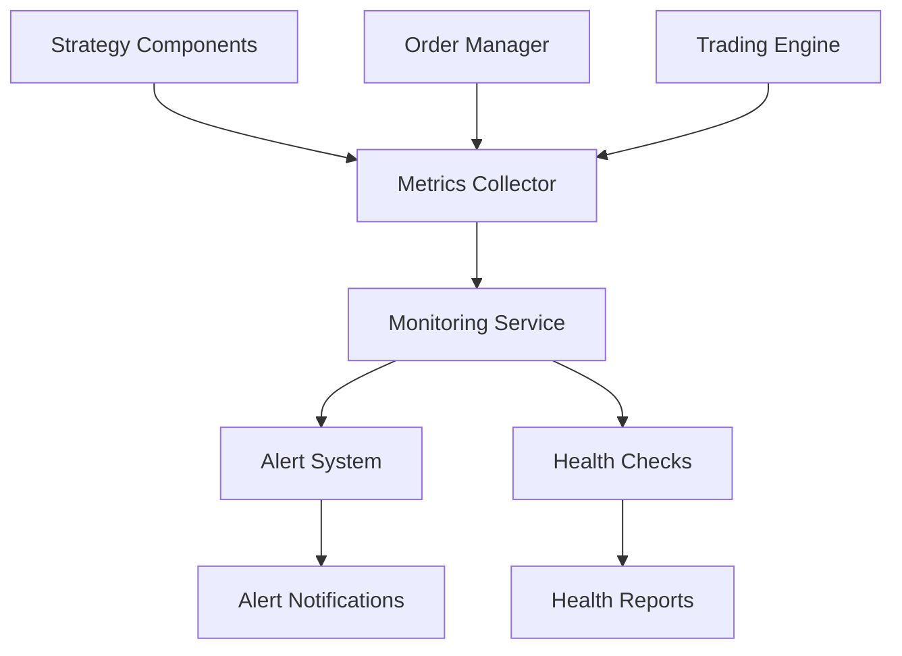
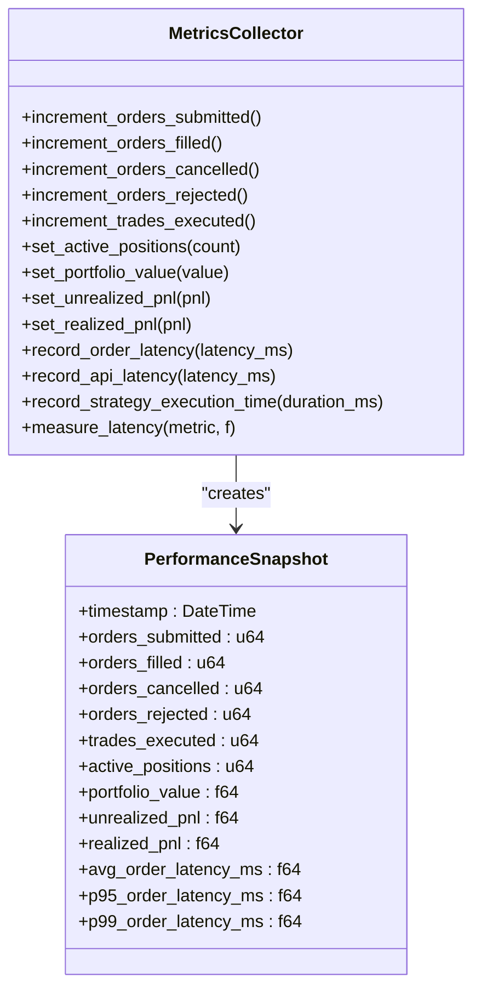
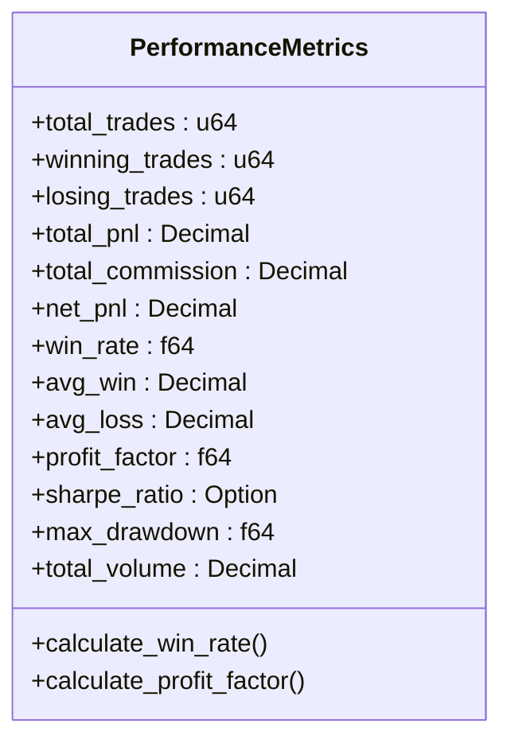
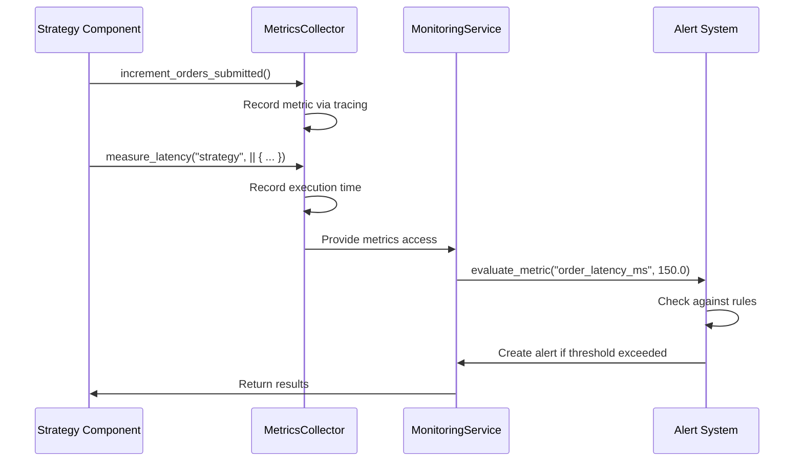
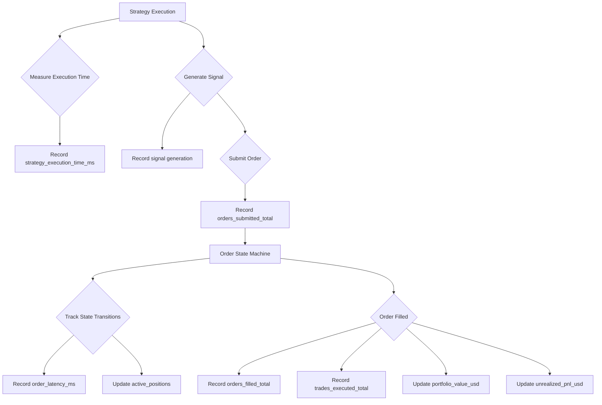

# Metrics Collection

<cite>
**Referenced Files in This Document**   
- [metrics.rs](file://crates/monitoring/src/metrics.rs)
- [service.rs](file://crates/monitoring/src/service.rs)
- [alerts.rs](file://crates/monitoring/src/alerts.rs)
- [strategy.rs](file://crates/core/src/models/strategy.rs)
- [lifecycle.rs](file://crates/strategy/src/lifecycle.rs)
- [signal.rs](file://crates/strategy/src/signal.rs)
- [state_machine.rs](file://crates/trading/src/state_machine.rs)
- [order_manager.rs](file://crates/trading/src/order_manager.rs)
- [rsi_strategy.rs](file://examples/rsi_strategy.rs)
- [grid_trading.rs](file://examples/grid_trading.rs)
</cite>

## Table of Contents
1. [Introduction](#introduction)
2. [Metrics Collection System Overview](#metrics-collection-system-overview)
3. [Core Metrics Types](#core-metrics-types)
4. [Metrics Collection Interface](#metrics-collection-interface)
5. [Strategy Performance Metrics](#strategy-performance-metrics)
6. [Integration with Monitoring Framework](#integration-with-monitoring-framework)
7. [Metrics Instrumentation in Strategy Components](#metrics-instrumentation-in-strategy-components)
8. [Common Issues and Best Practices](#common-issues-and-best-practices)
9. [Conclusion](#conclusion)

## Introduction

The metrics collection system provides comprehensive performance monitoring for trading strategies, enabling real-time assessment of system health and strategy effectiveness. This documentation explains how metrics are collected, exposed, and used for monitoring across the trading platform. The system captures key performance indicators such as execution latency, signal frequency, and state transition timing, providing valuable insights for both beginners and experienced developers.

**Section sources**
- [metrics.rs](file://crates/monitoring/src/metrics.rs#L1-L299)
- [service.rs](file://crates/monitoring/src/service.rs#L1-L374)

## Metrics Collection System Overview

The metrics collection system is built around the `MetricsCollector` struct in the monitoring crate, which serves as the central interface for collecting and recording performance data. The system uses a placeholder implementation with tracing for logging metrics, with plans to integrate with Prometheus or similar systems in production.

The architecture follows a modular design with three main components:
1. **Metrics Collector**: Handles the actual collection of metrics
2. **Monitoring Service**: Coordinates metrics collection, health checks, and alerting
3. **Alert System**: Evaluates metrics against defined rules to trigger alerts

The system captures metrics at various levels of the trading pipeline, from strategy execution to order processing and system health monitoring. This comprehensive approach enables detailed analysis of performance bottlenecks and system behavior under different market conditions.



**Diagram sources**
- [metrics.rs](file://crates/monitoring/src/metrics.rs#L96-L299)
- [service.rs](file://crates/monitoring/src/service.rs#L11-L174)

**Section sources**
- [metrics.rs](file://crates/monitoring/src/metrics.rs#L96-L299)
- [service.rs](file://crates/monitoring/src/service.rs#L11-L174)

## Core Metrics Types

The metrics collection system supports three primary types of metrics: counters, gauges, and histograms. Each type serves a specific purpose in monitoring different aspects of the trading system.

### Counter Metrics
Counters track the number of occurrences of specific events over time. The system implements several key counters:

- `orders_submitted_total`: Increments when an order is submitted to the exchange
- `orders_filled_total`: Increments when an order is completely filled
- `orders_cancelled_total`: Increments when an order is cancelled
- `orders_rejected_total`: Increments when an order is rejected by the exchange
- `trades_executed_total`: Increments when a trade is executed

These counters provide insight into the volume and success rate of trading activities.

### Gauge Metrics
Gauges represent instantaneous measurements of values that can go up and down. The system tracks several important gauges:

- `active_positions`: Current number of active positions
- `portfolio_value_usd`: Current portfolio value in USD
- `unrealized_pnl_usd`: Unrealized profit and loss in USD
- `realized_pnl_usd`: Realized profit and loss in USD

These gauges provide a real-time snapshot of the trading system's state and financial performance.

### Histogram Metrics
Histograms track the distribution of values, particularly useful for measuring latency and response times. The system records several key histograms:

- `order_latency_ms`: Latency of order execution in milliseconds
- `api_latency_ms`: Latency of API calls in milliseconds
- `strategy_execution_time_ms`: Time taken to execute strategy logic in milliseconds

These histograms help identify performance bottlenecks and ensure the system meets latency requirements.



**Diagram sources**
- [metrics.rs](file://crates/monitoring/src/metrics.rs#L96-L299)

**Section sources**
- [metrics.rs](file://crates/monitoring/src/metrics.rs#L106-L232)

## Metrics Collection Interface

The metrics collection interface is centered around the `MetricsCollector` struct, which provides methods for recording different types of metrics. The interface is designed to be simple and intuitive, allowing developers to easily instrument their code with minimal overhead.

### Counter Methods
The counter methods provide a straightforward way to track event occurrences:

```rust
pub fn increment_orders_submitted(&self) {
    tracing::debug!(
        metric = "orders_submitted_total",
        value = 1,
        "Increment counter"
    );
}
```

Similar methods exist for other counter metrics, following the same pattern of using structured logging to record metric events.

### Gauge Methods
Gauge methods allow setting the current value of a metric:

```rust
pub fn set_portfolio_value(&self, value: f64) {
    tracing::debug!(metric = "portfolio_value_usd", value = value, "Set gauge");
}
```

These methods are typically called when the underlying value changes, providing an up-to-date view of the system state.

### Histogram Methods
Histogram methods record the distribution of values, particularly useful for latency measurements:

```rust
pub fn record_order_latency(&self, latency_ms: f64) {
    tracing::debug!(
        metric = "order_latency_ms",
        value = latency_ms,
        "Record histogram"
    );
}
```

### Latency Measurement Helper
The system includes a convenient helper method for measuring and recording execution time:

```rust
pub fn measure_latency<F, R>(&self, metric: &str, f: F) -> R
where
    F: FnOnce() -> R,
{
    let start = Instant::now();
    let result = f();
    let duration = start.elapsed();
    let duration_ms = duration.as_secs_f64() * 1000.0;

    match metric {
        "order" => self.record_order_latency(duration_ms),
        "api" => self.record_api_latency(duration_ms),
        "strategy" => self.record_strategy_execution_time(duration_ms),
        _ => {}
    }

    result
}
```

This method simplifies the process of measuring execution time and recording it as a histogram metric.

**Section sources**
- [metrics.rs](file://crates/monitoring/src/metrics.rs#L106-L208)

## Strategy Performance Metrics

The strategy module includes a dedicated `PerformanceMetrics` struct for tracking the performance of trading strategies. This struct captures key performance indicators that are essential for evaluating strategy effectiveness.

### Performance Metrics Structure
The `PerformanceMetrics` struct includes the following fields:

- `total_trades`: Total number of trades executed
- `winning_trades`: Number of profitable trades
- `losing_trades`: Number of losing trades
- `total_pnl`: Total profit and loss
- `total_commission`: Total commission paid
- `net_pnl`: Net profit and loss after commissions
- `win_rate`: Percentage of winning trades
- `avg_win`: Average profit on winning trades
- `avg_loss`: Average loss on losing trades
- `profit_factor`: Ratio of gross profit to gross loss
- `sharpe_ratio`: Risk-adjusted return metric
- `max_drawdown`: Maximum peak-to-trough decline
- `total_volume`: Total trading volume

### Performance Calculation Methods
The struct includes methods for calculating derived metrics:

```rust
pub fn calculate_win_rate(&mut self) {
    if self.total_trades > 0 {
        self.win_rate = self.winning_trades as f64 / self.total_trades as f64;
    }
}

pub fn calculate_profit_factor(&mut self) {
    let total_wins: f64 = (self.avg_win * Decimal::new(self.winning_trades as i64, 0))
        .to_string()
        .parse()
        .unwrap_or(0.0);
    let total_losses: f64 = (self.avg_loss * Decimal::new(self.losing_trades as i64, 0))
        .to_string()
        .parse()
        .unwrap_or(0.0);

    if total_losses > 0.0 {
        self.profit_factor = total_wins / total_losses;
    }
}
```

These methods allow for dynamic calculation of performance metrics based on the raw trade data.



**Diagram sources**
- [metrics.rs](file://crates/strategy/src/metrics.rs#L6-L70)

**Section sources**
- [metrics.rs](file://crates/strategy/src/metrics.rs#L6-L70)

## Integration with Monitoring Framework

The metrics collection system is tightly integrated with the overall monitoring framework through the `MonitoringService` struct. This service acts as the central coordinator for metrics collection, health checks, and alerting.

### Monitoring Service Architecture
The `MonitoringService` struct contains the following components:

- `metrics`: Reference to the `MetricsCollector`
- `alert_rules`: Collection of alert rules
- `active_alerts`: Currently active alerts
- `health_checks`: Registered health checkers

The service provides methods for accessing the metrics collector and managing alert rules:

```rust
pub fn metrics(&self) -> Arc<MetricsCollector> {
    self.metrics.clone()
}

pub async fn register_alert_rule(&self, rule: AlertRule) -> Result<()> {
    let mut rules = self.alert_rules.write().await;
    rules.insert(rule.id, rule);
    Ok(())
}
```

### Alert System Integration
The alert system evaluates metrics against predefined rules to detect potential issues:

```rust
pub async fn evaluate_metric(&self, metric_name: &str, value: f64) -> Result<()> {
    let mut rules = self.alert_rules.write().await;
    let mut alerts = self.active_alerts.write().await;

    for rule in rules.values_mut() {
        if rule.condition.metric_name == metric_name && rule.evaluate(value) {
            let message = format!(
                "{}: {} (threshold: {})",
                rule.name, value, rule.condition.threshold
            );

            let alert = Alert::new(rule, value, message);
            alerts.insert(alert.id, alert.clone());

            // Update last triggered time
            rule.last_triggered = Some(Utc::now());

            tracing::warn!(
                rule_name = %rule.name,
                metric_name = %metric_name,
                value = %value,
                threshold = %rule.condition.threshold,
                "Alert triggered"
            );
        }
    }

    Ok(())
}
```

This integration allows for real-time monitoring of key metrics and immediate notification when thresholds are exceeded.

### Health Check Integration
The system also includes health check functionality to monitor the overall system status:

```rust
pub async fn perform_health_check(&self) -> HealthReport {
    let checkers = self.health_checks.read().await;

    let mut checks = Vec::new();
    for checker in checkers.iter() {
        let check = checker.check().await;
        checks.push(check);
    }

    HealthReport::new(checks)
}
```

Health checks are performed on registered components, and the results are aggregated into a comprehensive health report.



**Diagram sources**
- [service.rs](file://crates/monitoring/src/service.rs#L11-L174)
- [alerts.rs](file://crates/monitoring/src/alerts.rs#L35-L96)

**Section sources**
- [service.rs](file://crates/monitoring/src/service.rs#L11-L174)
- [alerts.rs](file://crates/monitoring/src/alerts.rs#L35-L96)

## Metrics Instrumentation in Strategy Components

The metrics collection system is integrated into various strategy components to provide comprehensive performance monitoring. This section examines how metrics are instrumented in key components.

### Strategy Lifecycle Monitoring
The strategy lifecycle is monitored to track state transitions and timing:

```rust
pub fn transition(&mut self, to_state: StrategyState, reason: impl Into<String>) -> Result<()> {
    if !self.is_valid_transition(to_state) {
        return Err(Error::StateTransitionError(format!(
            "Invalid transition from {:?} to {:?}",
            self.current_state, to_state
        )));
    }

    self.state_history.push(StateTransition {
        from_state: self.current_state,
        to_state,
        timestamp: Utc::now(),
        reason: reason.into(),
    });

    self.current_state = to_state;
    Ok(())
}
```

This instrumentation captures the timing and reasons for state transitions, providing valuable insights into strategy behavior.

### Signal Generation Monitoring
Trading signals are monitored to track signal frequency and confidence:

```rust
pub fn generate_signal(&self) -> Option<OrderSide> {
    let rsi = self.current_rsi?;

    if !self.in_position && rsi < self.oversold_threshold {
        Some(OrderSide::Buy)
    } else if self.in_position && rsi > self.overbought_threshold {
        Some(OrderSide::Sell)
    } else {
        None
    }
}
```

While the example doesn't show explicit metrics collection, in practice, each signal generation would be accompanied by metrics recording the signal type, confidence, and generation time.

### Order Management Integration
The order manager integrates with the metrics system to track order execution performance:

```rust
pub async fn submit_order(&self, order: Order) -> Result<Uuid> {
    let order_id = order.id;

    debug!(
        "Submitting order {}: {:?} {} @ {}",
        order_id,
        order.side,
        order.symbol.as_str(),
        price_str
    );

    // Create state machine
    let mut state_machine = OrderStateMachine::new(order_id);
    state_machine.transition(OrderState::Validated, "Pre-trade checks passed")?;

    // Store order
    let managed_order = ManagedOrder {
        order: order.clone(),
        state_machine,
        retry_count: 0,
        last_sync: Utc::now(),
    };

    self.orders.write().insert(order_id, managed_order);

    // Emit event
    let _ = self.event_tx.send(OrderEvent::OrderCreated(order_id));

    // Submit to exchange (async)
    let self_clone = Self {
        config: self.config.clone(),
        client: self.client.clone(),
        orders: self.orders.clone(),
        exchange_id_map: self.exchange_id_map.clone(),
        event_tx: self.event_tx.clone(),
        event_rx: self.event_rx.clone(),
    };

    tokio::spawn(async move {
        if let Err(e) = self_clone.submit_to_exchange(order_id).await {
            error!("Failed to submit order {}: {}", order_id, e);
            let _ = self_clone.event_tx.send(OrderEvent::OrderFailed {
                order_id,
                reason: e.to_string(),
            });
        }
    });

    Ok(order_id)
}
```

The order manager uses structured logging to record key events in the order lifecycle, which can be captured as metrics.



**Diagram sources**
- [lifecycle.rs](file://crates/strategy/src/lifecycle.rs#L7-L129)
- [order_manager.rs](file://crates/trading/src/order_manager.rs#L80-L374)
- [state_machine.rs](file://crates/trading/src/state_machine.rs#L8-L271)

**Section sources**
- [lifecycle.rs](file://crates/strategy/src/lifecycle.rs#L7-L129)
- [order_manager.rs](file://crates/trading/src/order_manager.rs#L80-L374)
- [state_machine.rs](file://crates/trading/src/state_machine.rs#L8-L271)

## Common Issues and Best Practices

### Metrics Accuracy Under High Load
One common challenge is maintaining metrics accuracy under high load conditions. The current implementation uses tracing for metrics collection, which may introduce overhead and potentially drop metrics under extreme load.

Best practices for addressing this issue include:
- Using asynchronous metrics collection to avoid blocking the main execution path
- Implementing metrics batching to reduce the overhead of individual metric recordings
- Using dedicated metrics collection threads to isolate the impact on main application performance
- Considering a production-grade metrics system like Prometheus for high-volume scenarios

### Proper Metric Labeling for Multi-Strategy Environments
In multi-strategy environments, proper metric labeling is crucial for distinguishing between different strategies. The current system could be enhanced with additional labels to support this:

```rust
// Example of enhanced metric with strategy labels
tracing::debug!(
    metric = "strategy_execution_time_ms",
    value = duration_ms,
    strategy_id = %strategy_id,
    strategy_type = %strategy_type,
    symbol = %symbol,
    "Record histogram"
);
```

Recommended labeling dimensions include:
- Strategy ID: Unique identifier for each strategy instance
- Strategy type: Type or category of the strategy
- Symbol: Trading pair being monitored
- Environment: Production, paper trading, or backtesting

### Performance Optimization
To optimize performance while maintaining comprehensive metrics collection:

1. Use the `measure_latency` helper method for consistent latency measurement
2. Batch related metrics to reduce the number of individual recordings
3. Implement sampling for high-frequency metrics
4. Use appropriate metric types (counters, gauges, histograms) for different use cases
5. Monitor the overhead of metrics collection and adjust as needed

### Testing and Validation
Ensure metrics are properly tested and validated:

```rust
#[test]
fn test_metrics_collector_creation() {
    let collector = MetricsCollector::new();

    // Test counter increments
    collector.increment_orders_submitted();
    collector.increment_orders_filled();

    // Test gauge updates
    collector.set_active_positions(5);
    collector.set_portfolio_value(100000.0);

    // Test histogram recordings
    collector.record_order_latency(25.5);
    collector.record_api_latency(50.0);
}
```

Include tests that verify:
- Metrics are recorded correctly
- Metric values are accurate
- No panics or errors during metrics collection
- Performance impact is within acceptable limits

**Section sources**
- [metrics.rs](file://crates/monitoring/src/metrics.rs#L235-L298)
- [service.rs](file://crates/monitoring/src/service.rs#L256-L373)

## Conclusion

The metrics collection system provides a comprehensive framework for monitoring the performance of trading strategies and the overall health of the trading platform. By capturing key metrics such as execution latency, signal frequency, and state transition timing, the system enables detailed analysis of strategy effectiveness and system performance.

The integration with the monitoring framework allows for real-time alerting and health checks, ensuring that potential issues are detected and addressed promptly. The system's modular design makes it easy to extend and adapt to different monitoring requirements.

For production use, the system should be enhanced with a dedicated metrics backend like Prometheus to ensure reliability and scalability under high load conditions. Additionally, implementing proper metric labeling will enable effective monitoring in multi-strategy environments.

By following the best practices outlined in this documentation, developers can effectively instrument their strategies and gain valuable insights into their performance and behavior.