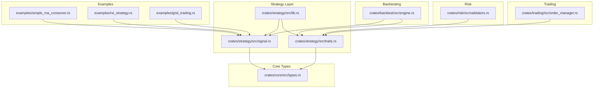
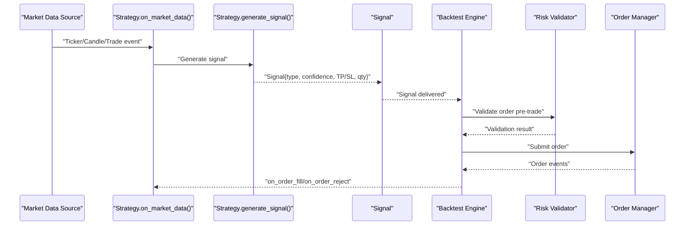
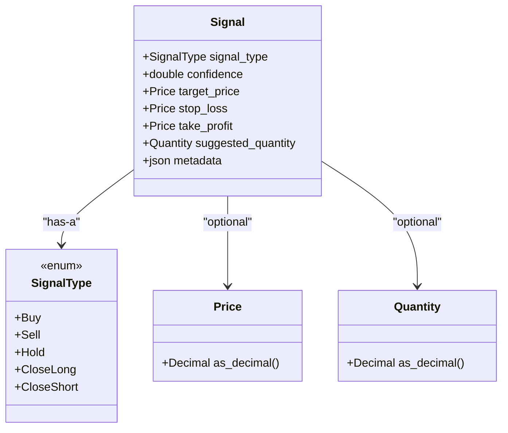
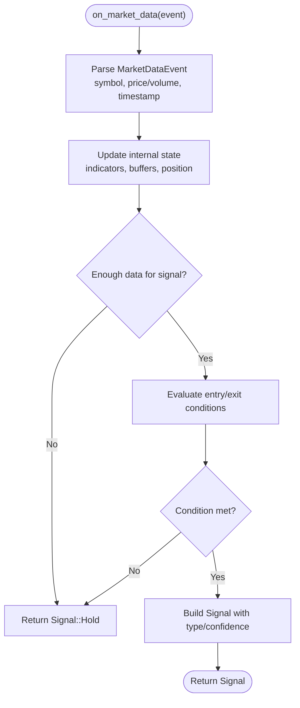
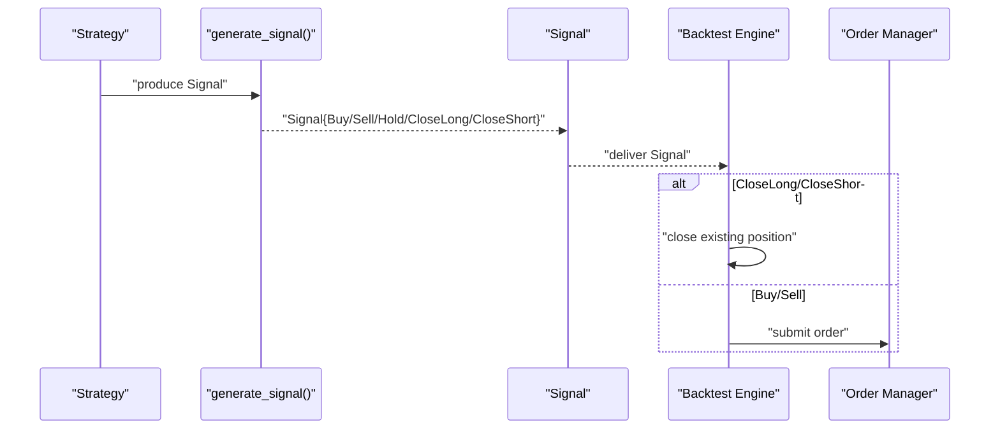
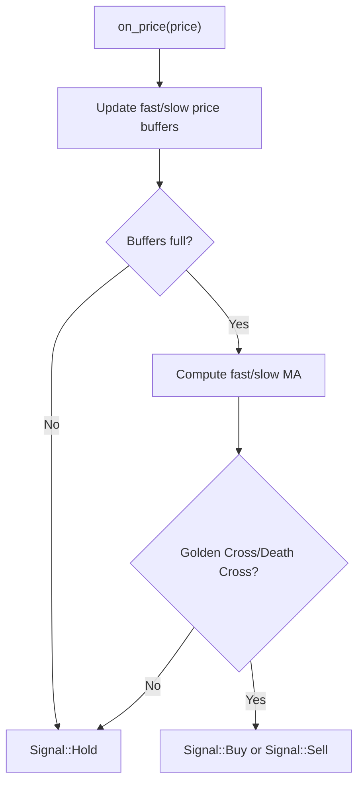
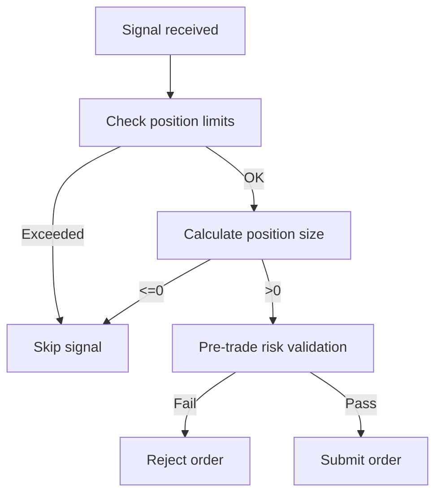
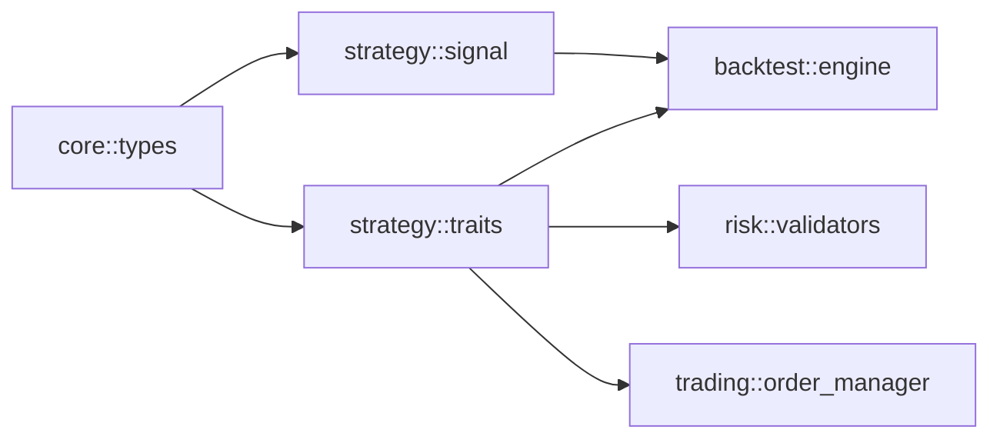

# Signal Generation

<cite>
**Referenced Files in This Document**
- [signal.rs](file://crates/strategy/src/signal.rs)
- [traits.rs](file://crates/strategy/src/traits.rs)
- [types.rs](file://crates/core/src/types.rs)
- [engine.rs](file://crates/backtest/src/engine.rs)
- [validators.rs](file://crates/risk/src/validators.rs)
- [order_manager.rs](file://crates/trading/src/order_manager.rs)
- [simple_ma_crossover.rs](file://examples/simple_ma_crossover.rs)
- [rsi_strategy.rs](file://examples/rsi_strategy.rs)
- [grid_trading.rs](file://examples/grid_trading.rs)
- [examples/README.md](file://examples/README.md)
</cite>

## Table of Contents
1. [Introduction](#introduction)
2. [Project Structure](#project-structure)
3. [Core Components](#core-components)
4. [Architecture Overview](#architecture-overview)
5. [Detailed Component Analysis](#detailed-component-analysis)
6. [Dependency Analysis](#dependency-analysis)
7. [Performance Considerations](#performance-considerations)
8. [Troubleshooting Guide](#troubleshooting-guide)
9. [Conclusion](#conclusion)
10. [Appendices](#appendices)

## Introduction
This document explains the signal generation system used by the EA OKX quantitative trading platform. It covers the domain model for signals, how market data triggers signal generation, and how actionable trading signals are produced and validated before execution. It also documents the five signal types (Buy, Sell, Hold, CloseLong, CloseShort) and provides concrete examples from the codebase showing how different market conditions produce signals. Finally, it addresses signal spam prevention and proper validation prior to order execution.

## Project Structure
The signal generation system spans several crates:
- Strategy framework defines the signal domain model and the Strategy trait contract.
- Core types define shared primitives like Price and Quantity.
- Backtesting engine consumes signals and executes orders.
- Risk validators enforce pre-trade constraints.
- Trading module manages order submission and lifecycle.
- Example strategies demonstrate practical signal generation logic.

**Diagram sources**
- [lib.rs](file://crates/strategy/src/lib.rs#L1-L25)
- [signal.rs](file://crates/strategy/src/signal.rs#L1-L65)
- [traits.rs](file://crates/strategy/src/traits.rs#L1-L115)
- [types.rs](file://crates/core/src/types.rs#L1-L292)
- [engine.rs](file://crates/backtest/src/engine.rs#L1-L200)
- [validators.rs](file://crates/risk/src/validators.rs#L49-L92)
- [order_manager.rs](file://crates/trading/src/order_manager.rs#L1-L120)
- [simple_ma_crossover.rs](file://examples/simple_ma_crossover.rs#L1-L200)
- [rsi_strategy.rs](file://examples/rsi_strategy.rs#L1-L148)
- [grid_trading.rs](file://examples/grid_trading.rs#L1-L162)

**Section sources**
- [lib.rs](file://crates/strategy/src/lib.rs#L1-L25)
- [signal.rs](file://crates/strategy/src/signal.rs#L1-L65)
- [traits.rs](file://crates/strategy/src/traits.rs#L1-L115)
- [types.rs](file://crates/core/src/types.rs#L1-L292)
- [engine.rs](file://crates/backtest/src/engine.rs#L1-L200)
- [validators.rs](file://crates/risk/src/validators.rs#L49-L92)
- [order_manager.rs](file://crates/trading/src/order_manager.rs#L1-L120)
- [simple_ma_crossover.rs](file://examples/simple_ma_crossover.rs#L1-L200)
- [rsi_strategy.rs](file://examples/rsi_strategy.rs#L1-L148)
- [grid_trading.rs](file://examples/grid_trading.rs#L1-L162)

## Core Components
- Signal domain model: SignalType enumerates supported actions and Signal carries metadata such as confidence, target/stop/take-profit, suggested quantity, and free-form metadata.
- Strategy trait: Defines on_market_data to ingest market data and generate_signal to produce a Signal.
- Core types: Price and Quantity are strongly typed numeric wrappers with validation.
- Backtesting engine: Consumes signals and executes orders respecting position limits and sizing rules.
- Risk validators: Enforce pre-trade constraints (size, leverage, margin, etc.) before order execution.
- Trading order manager: Manages order lifecycle and emits events for external consumers.

**Section sources**
- [signal.rs](file://crates/strategy/src/signal.rs#L1-L65)
- [traits.rs](file://crates/strategy/src/traits.rs#L60-L115)
- [types.rs](file://crates/core/src/types.rs#L86-L179)
- [engine.rs](file://crates/backtest/src/engine.rs#L1-L200)
- [validators.rs](file://crates/risk/src/validators.rs#L49-L92)
- [order_manager.rs](file://crates/trading/src/order_manager.rs#L1-L120)

## Architecture Overview
The signal generation pipeline connects market data ingestion to order execution with validation and risk controls.

**Diagram sources**
- [traits.rs](file://crates/strategy/src/traits.rs#L60-L115)
- [engine.rs](file://crates/backtest/src/engine.rs#L1-L200)
- [validators.rs](file://crates/risk/src/validators.rs#L49-L92)
- [order_manager.rs](file://crates/trading/src/order_manager.rs#L110-L221)

## Detailed Component Analysis

### Signal Domain Model and Data Structures
- SignalType: Buy, Sell, Hold, CloseLong, CloseShort.
- Signal: Encapsulates the action, confidence, optional target/stop/take-profit, optional suggested quantity, and metadata.

**Diagram sources**
- [signal.rs](file://crates/strategy/src/signal.rs#L1-L65)
- [types.rs](file://crates/core/src/types.rs#L86-L179)

**Section sources**
- [signal.rs](file://crates/strategy/src/signal.rs#L1-L65)
- [types.rs](file://crates/core/src/types.rs#L86-L179)

### Signal Types and Their Meaning
- Buy: Enter a long position.
- Sell: Enter a short position.
- Hold: No action; remain flat.
- CloseLong: Exit a long position.
- CloseShort: Exit a short position.

These types are consumed by the backtesting engine and trading execution to determine order direction and closing actions.

**Section sources**
- [signal.rs](file://crates/strategy/src/signal.rs#L6-L20)
- [engine.rs](file://crates/backtest/src/engine.rs#L400-L445)

### Market Data Triggers Signal Generation
The Strategy trait defines on_market_data to process incoming MarketDataEvent (Ticker, Candle, Trade). Strategies implement this method to update internal state and then call generate_signal to produce a Signal.

**Diagram sources**
- [traits.rs](file://crates/strategy/src/traits.rs#L13-L38)
- [traits.rs](file://crates/strategy/src/traits.rs#L60-L115)

**Section sources**
- [traits.rs](file://crates/strategy/src/traits.rs#L13-L38)
- [traits.rs](file://crates/strategy/src/traits.rs#L60-L115)

### How generate_signal Produces Actionable Signals
- generate_signal returns a Signal with signal_type and confidence.
- Backtesting engine translates SignalType into OrderSide and handles CloseLong/CloseShort by closing existing positions.
- Trading order manager validates and submits orders, emitting lifecycle events.

**Diagram sources**
- [traits.rs](file://crates/strategy/src/traits.rs#L69-L71)
- [engine.rs](file://crates/backtest/src/engine.rs#L400-L445)
- [order_manager.rs](file://crates/trading/src/order_manager.rs#L110-L221)

**Section sources**
- [traits.rs](file://crates/strategy/src/traits.rs#L69-L71)
- [engine.rs](file://crates/backtest/src/engine.rs#L400-L445)
- [order_manager.rs](file://crates/trading/src/order_manager.rs#L110-L221)

### Concrete Examples from the Codebase

#### Moving Average Crossover Strategy
- Uses Ticker/Candle events to compute moving averages and detect crossovers.
- Generates Buy/Sell signals and Hold until sufficient data.
- Demonstrates position sizing and stop-loss/take-profit computation.

**Diagram sources**
- [simple_ma_crossover.rs](file://examples/simple_ma_crossover.rs#L142-L201)

**Section sources**
- [simple_ma_crossover.rs](file://examples/simple_ma_crossover.rs#L142-L201)

#### RSI Mean Reversion Strategy
- Maintains price changes and computes RSI.
- Generates Buy when RSI < threshold and Sell when RSI > threshold.
- Provides a simpler example of condition-based signal generation.

**Section sources**
- [rsi_strategy.rs](file://examples/rsi_strategy.rs#L58-L117)

#### Grid Trading Strategy
- Places buy/sell limit orders across a predefined price range.
- While not strictly generating Buy/Sell signals, it demonstrates order placement logic that complements the signal-driven approach.

**Section sources**
- [grid_trading.rs](file://examples/grid_trading.rs#L79-L115)

### Signal Spam Prevention and Validation
- Backtesting engine enforces position limits and validates position size before submitting orders.
- Risk validators pre-check order feasibility against leverage, position size, and margin constraints.
- Order manager enforces order state transitions and timeouts to prevent stale orders.

**Diagram sources**
- [engine.rs](file://crates/backtest/src/engine.rs#L400-L445)
- [validators.rs](file://crates/risk/src/validators.rs#L49-L92)
- [order_manager.rs](file://crates/trading/src/order_manager.rs#L279-L336)

**Section sources**
- [engine.rs](file://crates/backtest/src/engine.rs#L400-L445)
- [validators.rs](file://crates/risk/src/validators.rs#L49-L92)
- [order_manager.rs](file://crates/trading/src/order_manager.rs#L279-L336)

## Dependency Analysis
- Strategy depends on core types for Price and Quantity.
- Backtesting engine depends on Strategy trait and Signal domain model.
- Risk validators depend on StrategyConfig/RiskLimits and Order models.
- Trading order manager depends on Strategy trait and Order models.

**Diagram sources**
- [types.rs](file://crates/core/src/types.rs#L86-L179)
- [signal.rs](file://crates/strategy/src/signal.rs#L1-L65)
- [traits.rs](file://crates/strategy/src/traits.rs#L60-L115)
- [engine.rs](file://crates/backtest/src/engine.rs#L1-L200)
- [validators.rs](file://crates/risk/src/validators.rs#L49-L92)
- [order_manager.rs](file://crates/trading/src/order_manager.rs#L1-L120)

**Section sources**
- [types.rs](file://crates/core/src/types.rs#L86-L179)
- [signal.rs](file://crates/strategy/src/signal.rs#L1-L65)
- [traits.rs](file://crates/strategy/src/traits.rs#L60-L115)
- [engine.rs](file://crates/backtest/src/engine.rs#L1-L200)
- [validators.rs](file://crates/risk/src/validators.rs#L49-L92)
- [order_manager.rs](file://crates/trading/src/order_manager.rs#L1-L120)

## Performance Considerations
- Signal generation should minimize look-ahead bias by relying only on available historical data.
- Backtesting position sizing and limits reduce unnecessary churn and improve realism.
- Risk validation and order state machines prevent excessive retries and timeouts.

[No sources needed since this section provides general guidance]

## Troubleshooting Guide
Common issues and remedies:
- No signal generated: Ensure on_market_data updates enough data buffers and generate_signal returns a non-Hold signal when conditions are met.
- Orders rejected: Verify pre-trade validation passes (leverage, position size, margin).
- Excessive orders: Enforce position limits and avoid frequent re-submissions by debouncing signals.
- Order timeouts/expirations: Configure reconciliation intervals and timeouts appropriately.

**Section sources**
- [engine.rs](file://crates/backtest/src/engine.rs#L400-L445)
- [validators.rs](file://crates/risk/src/validators.rs#L49-L92)
- [order_manager.rs](file://crates/trading/src/order_manager.rs#L279-L336)

## Conclusion
The signal generation system centers on a clear domain model (SignalType, Signal) and a Strategy trait contract that ingests market data and produces actionable signals. The backtesting engine and risk validators provide robust safeguards against excessive or invalid orders, while the order manager ensures lifecycle compliance. Practical examples illustrate how different market conditions trigger Buy, Sell, Hold, CloseLong, and CloseShort signals, enabling both beginners and experienced developers to implement reliable trading strategies.

[No sources needed since this section summarizes without analyzing specific files]

## Appendices

### Best Practices for Signal Generation
- Define explicit entry/exit conditions and avoid look-ahead bias.
- Use statistical/technical indicators consistently and document thresholds.
- Implement risk management (stop-loss, take-profit, position sizing).
- Validate signals before execution and avoid spam by limiting frequency.

**Section sources**
- [examples/README.md](file://examples/README.md#L122-L203)