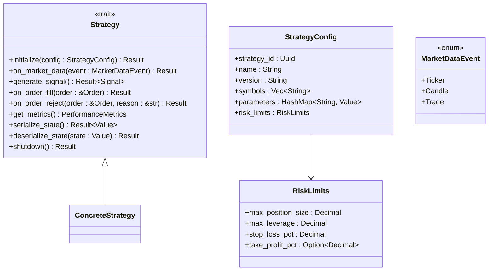
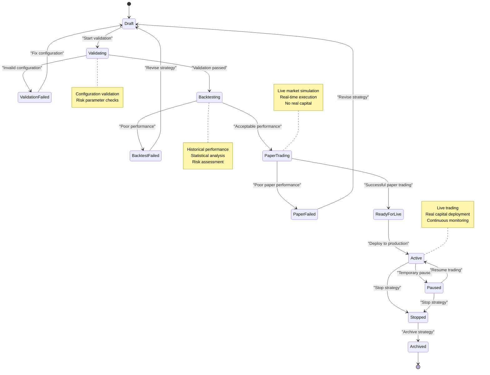
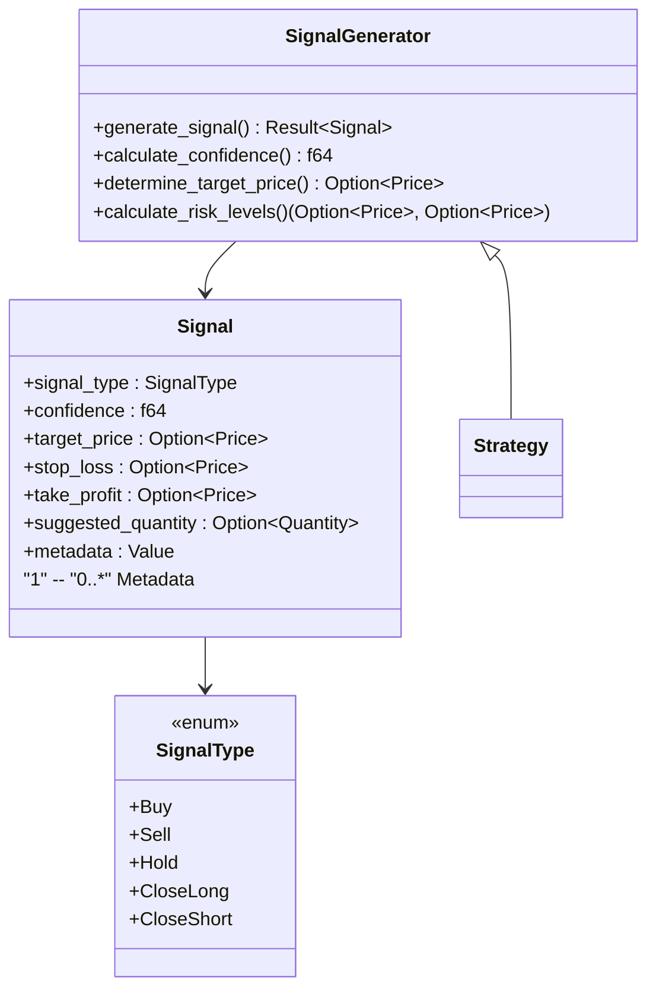
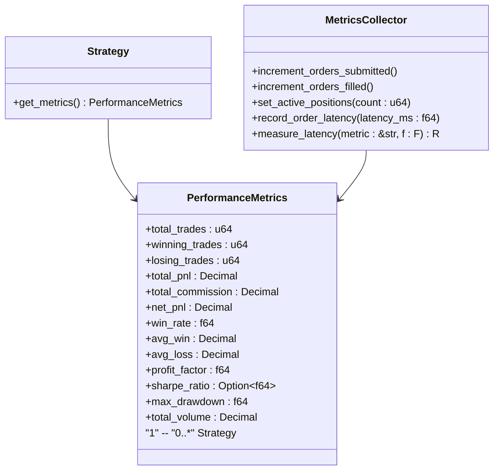
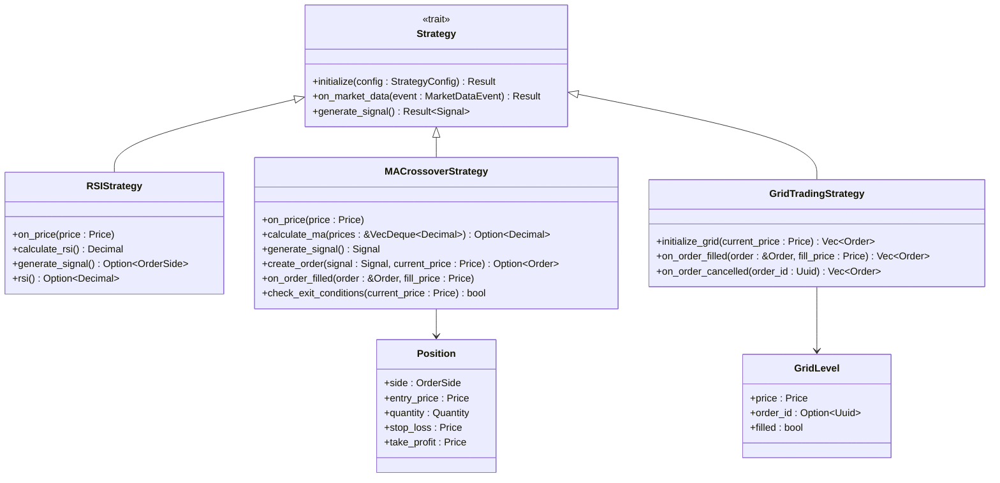

# Strategy Framework

<cite>
**Referenced Files in This Document**   
- [lib.rs](file://crates/strategy/src/lib.rs)
- [traits.rs](file://crates/strategy/src/traits.rs)
- [lifecycle.rs](file://crates/strategy/src/lifecycle.rs)
- [signal.rs](file://crates/strategy/src/signal.rs)
- [metrics.rs](file://crates/strategy/src/metrics.rs)
- [error.rs](file://crates/strategy/src/error.rs)
- [strategy.rs](file://crates/core/src/models/strategy.rs)
- [rsi_strategy.rs](file://examples/rsi_strategy.rs)
- [simple_ma_crossover.rs](file://examples/simple_ma_crossover.rs)
- [grid_trading.rs](file://examples/grid_trading.rs)
</cite>

## Table of Contents
1. [Introduction](#introduction)
2. [Strategy Contract Interface](#strategy-contract-interface)
3. [Lifecycle State Machine](#lifecycle-state-machine)
4. [Signal Generation System](#signal-generation-system)
5. [Performance Metrics Collection](#performance-metrics-collection)
6. [Hot-Reload and State Serialization](#hot-reload-and-state-serialization)
7. [Configuration and Parameter Management](#configuration-and-parameter-management)
8. [Strategy Implementation Examples](#strategy-implementation-examples)
9. [Conclusion](#conclusion)

## Introduction
The Strategy Framework provides a comprehensive architecture for implementing quantitative trading strategies within the EA OKX system. This framework defines a standardized interface for strategy development, ensuring consistency across different trading algorithms while providing robust lifecycle management, performance monitoring, and operational capabilities. The core design principles emphasize modularity, testability, and production readiness, enabling strategies to progress through a well-defined lifecycle from initial development to live trading.

The framework supports various trading paradigms including trend following, mean reversion, and market making through its flexible signal generation system. Strategies can be developed, backtested, and deployed with comprehensive monitoring and risk controls. The architecture enables hot-reloading of strategies without service interruption and provides detailed performance metrics for ongoing optimization.

**Section sources**
- [lib.rs](file://crates/strategy/src/lib.rs#L1-L25)

## Strategy Contract Interface
The strategy contract is defined by the `Strategy` trait, which establishes the asynchronous interface that all trading strategies must implement. This trait-based approach enables polymorphism and dependency injection, allowing the trading system to interact with different strategy implementations through a consistent interface.

The core methods of the strategy contract include initialization, market data processing, signal generation, and lifecycle management. The `initialize` method configures the strategy with its parameters and risk limits, setting up the initial state before trading begins. The `on_market_data` method processes incoming market events such as tickers, candles, and trades, allowing the strategy to update its internal state based on real-time market conditions.

Signal generation is handled by the `generate_signal` method, which produces trading signals based on the strategy's logic and current market state. The framework also includes methods for handling order execution feedback through `on_order_fill` and `on_order_reject`, enabling strategies to adapt to market conditions and execution outcomes.

The contract supports hot-reload functionality through the `serialize_state` and `deserialize_state` methods, allowing strategies to persist their internal state when being updated or restarted. This ensures continuity of trading operations during maintenance or strategy updates.

**Diagram sources**
- [traits.rs](file://crates/strategy/src/traits.rs#L60-L89)

**Section sources**
- [traits.rs](file://crates/strategy/src/traits.rs#L60-L89)

## Lifecycle State Machine
The strategy lifecycle is managed by a 12-state state machine that governs the progression of strategies from creation to termination. This state machine ensures that strategies follow a controlled and auditable path through their operational lifecycle, with validation at each transition to prevent invalid state changes.

The lifecycle begins in the `Draft` state, where strategies are initially created and configured. From there, strategies transition to `Validating` for configuration validation, then to `Backtesting` for historical performance evaluation. After successful backtesting, strategies move to `PaperTrading` for simulation in live market conditions without real capital.

The production states include `ReadyForLive`, `Active`, and `Paused`, allowing for controlled deployment and operation. The state machine enforces strict transition rules, preventing invalid state changes such as moving directly from development to live trading. Terminal states include `Stopped` and `Archived`, with comprehensive history tracking of all state transitions.

Each state transition is recorded with a timestamp, reason, and metadata, providing a complete audit trail of the strategy's operational history. This enables detailed analysis of strategy performance across different phases and facilitates compliance reporting.

**Diagram sources**
- [lifecycle.rs](file://crates/strategy/src/lifecycle.rs#L8-L22)

**Section sources**
- [lifecycle.rs](file://crates/strategy/src/lifecycle.rs#L8-L22)
- [strategy.rs](file://crates/core/src/models/strategy.rs#L14-L23)

## Signal Generation System
The signal generation system provides a standardized framework for producing trading signals across different strategy types. The system supports five primary signal types: Buy, Sell, Hold, CloseLong, and CloseShort, enabling strategies to express various trading intentions.

Signals are encapsulated in the `Signal` struct, which includes not only the signal type but also confidence levels, target prices, stop-loss and take-profit levels, suggested quantities, and additional metadata. This rich signal model allows for sophisticated trading logic and risk management, with strategies able to provide detailed execution guidance to the order management system.

The signal generation process is decoupled from market data processing, allowing strategies to maintain internal state and generate signals based on complex calculations. The system supports both discrete signals (generated at specific times) and continuous signals (updated with each market data event), accommodating different trading styles and frequency requirements.

Signal confidence scores enable portfolio-level risk management, with higher confidence signals potentially receiving larger position allocations. The metadata field allows strategies to include diagnostic information or rationale for signals, supporting post-trade analysis and strategy optimization.

**Diagram sources**
- [signal.rs](file://crates/strategy/src/signal.rs#L8-L14)

**Section sources**
- [signal.rs](file://crates/strategy/src/signal.rs#L8-L14)

## Performance Metrics Collection
The performance metrics system provides comprehensive tracking of strategy performance across multiple dimensions. The `PerformanceMetrics` struct captures key quantitative indicators including total trades, winning and losing trades, profit and loss metrics, win rate, average win/loss, profit factor, Sharpe ratio, maximum drawdown, and trading volume.

These metrics are automatically updated as trades are executed, providing real-time performance monitoring. The system calculates derived metrics such as win rate and profit factor, enabling strategies to self-assess their performance and potentially adjust their behavior based on recent results.

The metrics collection is integrated with the strategy lifecycle, allowing for performance comparison across different phases (backtesting, paper trading, live trading). This enables quantitative assessment of strategy degradation or improvement over time and supports data-driven decisions about strategy deployment and retirement.

The framework also integrates with the broader monitoring system, exposing metrics for alerting and dashboard visualization. This allows operations teams to monitor strategy performance in real-time and respond to anomalies or performance deterioration.

**Diagram sources**
- [metrics.rs](file://crates/strategy/src/metrics.rs#L8-L22)

**Section sources**
- [metrics.rs](file://crates/strategy/src/metrics.rs#L8-L22)

## Hot-Reload and State Serialization
The hot-reload capability enables strategy updates without service interruption, maintaining trading operations while updating strategy logic or parameters. This is achieved through state serialization, where the strategy's internal state is converted to a serializable format (JSON) that can be persisted and later restored.

The `serialize_state` and `deserialize_state` methods form the core of this functionality, allowing strategies to capture their complete internal state including indicator values, position tracking, and any other transient data. This ensures continuity of trading operations when deploying updated strategy versions or recovering from system restarts.

The serialization system uses JSON as the interchange format, providing human-readable state representation and compatibility with external monitoring and analysis tools. Strategies are responsible for implementing these methods to capture all necessary state information, with the framework handling the persistence and restoration mechanics.

This capability supports continuous deployment practices, allowing for incremental improvements to trading strategies without disrupting live trading operations. It also enables A/B testing of strategy variants and facilitates disaster recovery scenarios.

**Section sources**
- [traits.rs](file://crates/strategy/src/traits.rs#L81-L85)

## Configuration and Parameter Management
Strategy configuration is managed through the `StrategyConfig` structure, which provides a flexible system for defining strategy parameters, risk limits, and operational settings. The configuration system supports both static parameters (defined at initialization) and dynamic parameters (adjustable during operation).

The configuration includes essential elements such as the strategy ID, name, version, trading symbols, and a flexible parameters map that can accommodate strategy-specific settings. Risk limits are defined separately, specifying constraints on position size, leverage, stop-loss, and take-profit levels to ensure compliance with risk management policies.

The parameters system uses JSON values, enabling support for various data types including numbers, strings, arrays, and nested objects. This flexibility allows strategies to define complex parameter structures without requiring changes to the core framework.

Configuration validation is performed at initialization, ensuring that all parameters meet defined constraints before the strategy becomes active. This prevents operational issues due to invalid configurations and enforces risk management policies at the point of deployment.

**Section sources**
- [traits.rs](file://crates/strategy/src/traits.rs#L42-L58)
- [strategy.rs](file://crates/core/src/models/strategy.rs#L48-L66)

## Strategy Implementation Examples
The framework includes several example implementations that demonstrate different trading paradigms and implementation patterns. These examples serve as templates for developing new strategies and illustrate best practices for using the framework's features.

The RSI Mean Reversion Strategy implements a classic technical analysis approach, using the Relative Strength Index to identify overbought and oversold conditions. This strategy demonstrates stateful indicator calculation, with price history maintained to compute the RSI value over a specified period.

The Simple Moving Average Crossover Strategy exemplifies trend-following logic, using two moving averages of different periods to generate trading signals. This implementation shows how to manage position state, including entry price, stop-loss, and take-profit levels, and demonstrates risk management through position sizing and exit conditions.

The Grid Trading Strategy illustrates a market-making approach, placing buy and sell orders at regular price intervals within a defined range. This strategy demonstrates order management across multiple price levels and shows how to handle order fills to maintain the grid structure.

These examples highlight the framework's flexibility in supporting different trading styles while maintaining consistency in the core interface and operational characteristics.

**Diagram sources**
- [rsi_strategy.rs](file://examples/rsi_strategy.rs#L23-L34)
- [simple_ma_crossover.rs](file://examples/simple_ma_crossover.rs#L64-L91)
- [grid_trading.rs](file://examples/grid_trading.rs#L33-L42)

**Section sources**
- [rsi_strategy.rs](file://examples/rsi_strategy.rs#L23-L34)
- [simple_ma_crossover.rs](file://examples/simple_ma_crossover.rs#L64-L91)
- [grid_trading.rs](file://examples/grid_trading.rs#L33-L42)

## Conclusion
The Strategy Framework provides a robust and flexible architecture for developing, deploying, and managing quantitative trading strategies. By standardizing the strategy interface, lifecycle management, and operational capabilities, the framework enables consistent development practices and reliable production operations.

Key strengths of the framework include its comprehensive lifecycle state machine, which ensures controlled progression from development to live trading; its rich signal generation system, which supports sophisticated trading logic; and its hot-reload capability, which enables continuous improvement without service interruption.

The integration with performance metrics and monitoring systems provides comprehensive visibility into strategy operations, supporting both real-time oversight and long-term optimization. The examples provided demonstrate the framework's versatility in supporting different trading paradigms while maintaining operational consistency.

This architecture positions the EA OKX system for scalable growth, enabling the addition of new strategies with minimal integration effort while maintaining high standards of reliability, risk management, and operational excellence.