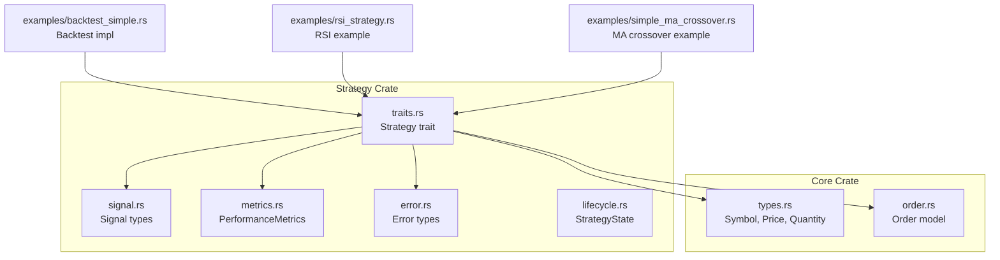
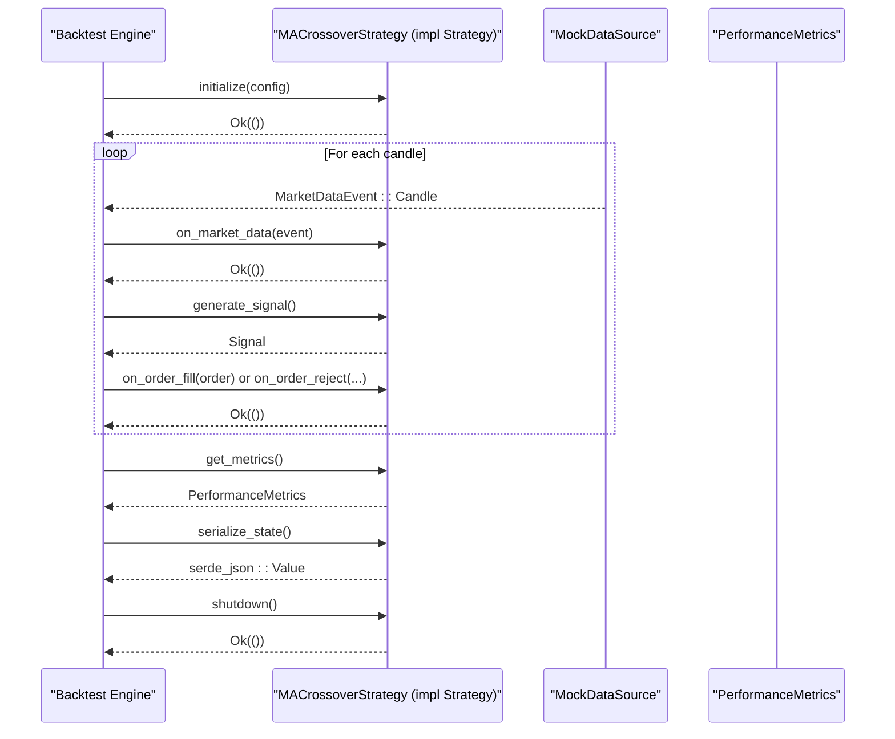
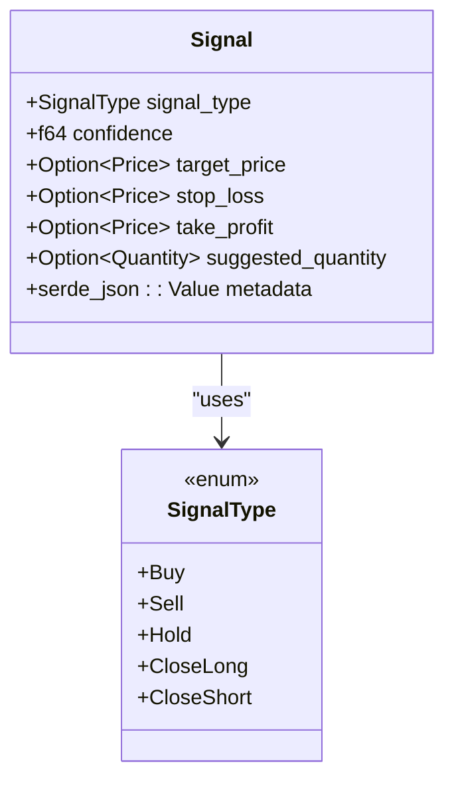
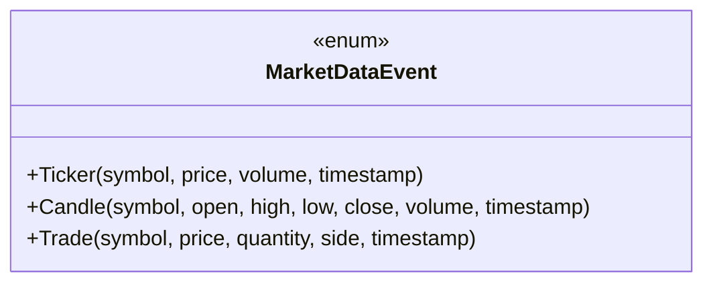
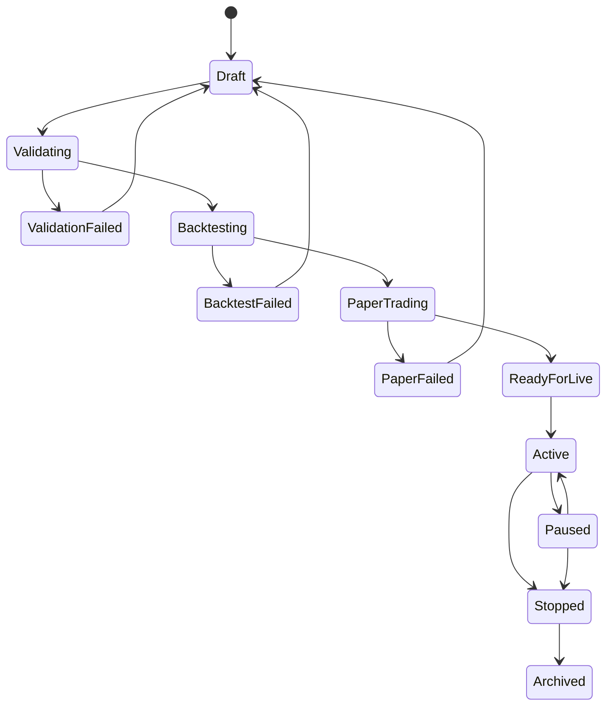
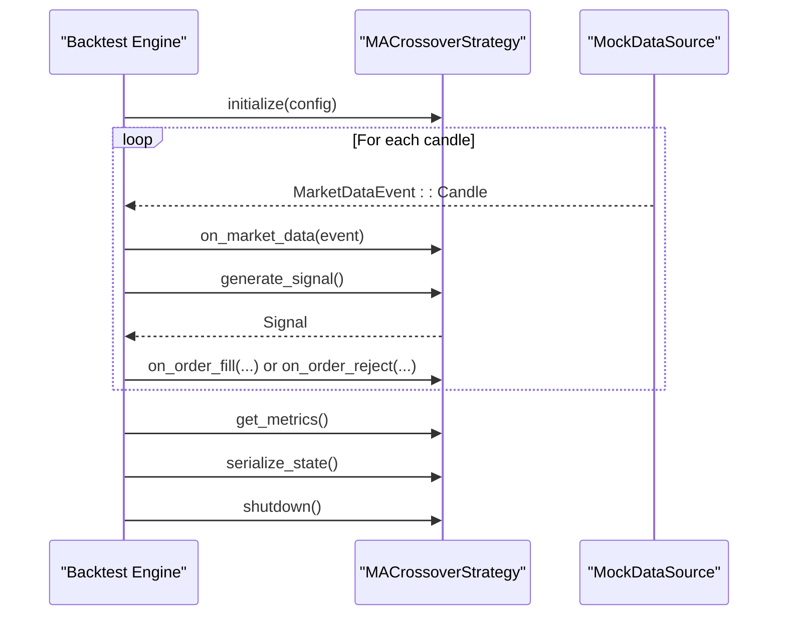
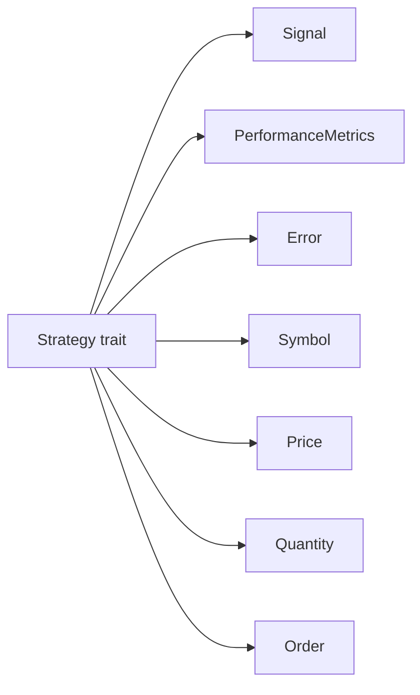

# Strategy Trait Interface

<cite>
**Referenced Files in This Document**
- [traits.rs](file://crates/strategy/src/traits.rs)
- [signal.rs](file://crates/strategy/src/signal.rs)
- [metrics.rs](file://crates/strategy/src/metrics.rs)
- [error.rs](file://crates/strategy/src/error.rs)
- [types.rs](file://crates/core/src/types.rs)
- [order.rs](file://crates/core/src/models/order.rs)
- [backtest_simple.rs](file://examples/backtest_simple.rs)
- [rsi_strategy.rs](file://examples/rsi_strategy.rs)
- [simple_ma_crossover.rs](file://examples/simple_ma_crossover.rs)
- [lifecycle.rs](file://crates/strategy/src/lifecycle.rs)
</cite>

## Table of Contents
1. [Introduction](#introduction)
2. [Project Structure](#project-structure)
3. [Core Components](#core-components)
4. [Architecture Overview](#architecture-overview)
5. [Detailed Component Analysis](#detailed-component-analysis)
6. [Dependency Analysis](#dependency-analysis)
7. [Performance Considerations](#performance-considerations)
8. [Troubleshooting Guide](#troubleshooting-guide)
9. [Conclusion](#conclusion)

## Introduction
This document explains the Strategy trait interface that defines the asynchronous contract for trading strategies in the EA OKX quantitative trading system. It covers the method signatures, parameters, return types, and expected behavior for initialize, on_market_data, and generate_signal, along with additional lifecycle hooks. It also demonstrates how strategies implement this interface using real examples from the codebase, explains the async/await pattern and Tokio runtime integration, and provides guidance on error handling and state management.

## Project Structure
The Strategy trait resides in the strategy crate and integrates with shared core types and models. The examples demonstrate how to implement the trait in practice.

**Diagram sources**
- [traits.rs](file://crates/strategy/src/traits.rs#L60-L89)
- [signal.rs](file://crates/strategy/src/signal.rs#L1-L65)
- [metrics.rs](file://crates/strategy/src/metrics.rs#L1-L70)
- [error.rs](file://crates/strategy/src/error.rs#L1-L32)
- [types.rs](file://crates/core/src/types.rs#L1-L292)
- [order.rs](file://crates/core/src/models/order.rs#L1-L383)
- [backtest_simple.rs](file://examples/backtest_simple.rs#L42-L148)
- [rsi_strategy.rs](file://examples/rsi_strategy.rs#L1-L148)
- [simple_ma_crossover.rs](file://examples/simple_ma_crossover.rs#L1-L280)

**Section sources**
- [traits.rs](file://crates/strategy/src/traits.rs#L60-L89)
- [types.rs](file://crates/core/src/types.rs#L1-L292)
- [order.rs](file://crates/core/src/models/order.rs#L1-L383)
- [backtest_simple.rs](file://examples/backtest_simple.rs#L42-L148)

## Core Components
- Strategy trait: Defines the async contract for strategy lifecycle and behavior.
- Signal: Encapsulates a trading decision with optional risk parameters and metadata.
- PerformanceMetrics: Aggregates strategy performance statistics.
- Error: Unified error type for strategy operations.
- Core types: Symbol, Price, Quantity used across the system.
- Order: Standardized order representation for lifecycle callbacks.

Key responsibilities:
- Strategy.initialize: Prepare internal state from configuration.
- Strategy.on_market_data: Process incoming market data events.
- Strategy.generate_signal: Produce a Signal for the trading engine.
- Strategy.on_order_fill/on_order_reject: React to order lifecycle events.
- Strategy.get_metrics/serialize_state/deserialize_state: Metrics and hot-reload support.
- Strategy.shutdown: Graceful cleanup.

**Section sources**
- [traits.rs](file://crates/strategy/src/traits.rs#L60-L89)
- [signal.rs](file://crates/strategy/src/signal.rs#L1-L65)
- [metrics.rs](file://crates/strategy/src/metrics.rs#L1-L70)
- [error.rs](file://crates/strategy/src/error.rs#L1-L32)
- [types.rs](file://crates/core/src/types.rs#L1-L292)
- [order.rs](file://crates/core/src/models/order.rs#L1-L383)

## Architecture Overview
The Strategy trait enables a plug-in architecture where strategies receive market data asynchronously, compute signals, and react to order outcomes. The backtesting example shows how a strategy implementing the trait is orchestrated by the engine.

**Diagram sources**
- [backtest_simple.rs](file://examples/backtest_simple.rs#L42-L148)
- [traits.rs](file://crates/strategy/src/traits.rs#L60-L89)
- [signal.rs](file://crates/strategy/src/signal.rs#L1-L65)
- [metrics.rs](file://crates/strategy/src/metrics.rs#L1-L70)

## Detailed Component Analysis

### Strategy Trait Contract
The Strategy trait defines the asynchronous interface that strategies must implement. Below are the method signatures, parameters, return types, and expected behavior.

- initialize(&mut self, config: StrategyConfig) -> Result<()>
  - Purpose: Initialize strategy state from StrategyConfig.
  - Parameters: StrategyConfig containing identifiers, symbols, parameters, and risk limits.
  - Returns: Ok(()) on success; otherwise an error variant.
  - Expected behavior: Validate and store configuration; allocate buffers or caches; prepare internal state.

- on_market_data(&mut self, event: MarketDataEvent) -> Result<()>
  - Purpose: Process incoming market data events (ticker, candle, trade).
  - Parameters: MarketDataEvent variant carrying symbol, price/volume/timestamp.
  - Returns: Ok(()) on successful processing; otherwise an error variant.
  - Expected behavior: Update internal indicators or state; do not emit orders here.

- generate_signal(&self) -> Result<Signal>
  - Purpose: Compute and return a trading Signal.
  - Parameters: None.
  - Returns: Signal with type, confidence, optional target/stop/take-profit, suggested quantity, and metadata.
  - Expected behavior: Return a meaningful signal based on current state; return Hold when no action is warranted.

- on_order_fill(&mut self, order: &Order) -> Result<()>
  - Purpose: Handle order fill notifications.
  - Parameters: Reference to Order that was filled.
  - Returns: Ok(()) on success; otherwise an error variant.
  - Expected behavior: Update internal position tracking, PnL, or trailing state.

- on_order_reject(&mut self, order: &Order, reason: &str) -> Result<()>
  - Purpose: Handle order rejection.
  - Parameters: Reference to rejected Order and rejection reason.
  - Returns: Ok(()) on success; otherwise an error variant.
  - Expected behavior: Log or adjust state; decide whether to retry or skip.

- get_metrics(&self) -> PerformanceMetrics
  - Purpose: Provide performance metrics snapshot.
  - Parameters: None.
  - Returns: PerformanceMetrics with counts, sums, rates, and ratios.
  - Expected behavior: Aggregate realized/unrealized metrics; ensure thread-safe reads.

- serialize_state(&self) -> Result<serde_json::Value>
  - Purpose: Serialize strategy state for hot-reload.
  - Parameters: None.
  - Returns: serde_json::Value representing internal state.
  - Expected behavior: Return a compact, deterministic serialization of state.

- deserialize_state(&mut self, state: serde_json::Value) -> Result<()>
  - Purpose: Restore strategy state from serialized form.
  - Parameters: serde_json::Value with previously serialized state.
  - Returns: Ok(()) on success; otherwise an error variant.
  - Expected behavior: Reconstruct internal buffers and positions; validate restored state.

- shutdown(&mut self) -> Result<()>
  - Purpose: Perform graceful shutdown.
  - Parameters: None.
  - Returns: Ok(()) on success; otherwise an error variant.
  - Expected behavior: Release resources, flush logs, persist state if needed.

Implementation notes:
- All methods except generate_signal are async to support I/O-bound operations (e.g., logging, persistence).
- The trait is marked Send + Sync to enable safe concurrent usage across tasks.
- MarketDataEvent variants align with core types for Symbol, Price, Quantity, and timestamps.

**Section sources**
- [traits.rs](file://crates/strategy/src/traits.rs#L60-L89)
- [signal.rs](file://crates/strategy/src/signal.rs#L1-L65)
- [metrics.rs](file://crates/strategy/src/metrics.rs#L1-L70)
- [types.rs](file://crates/core/src/types.rs#L1-L292)
- [order.rs](file://crates/core/src/models/order.rs#L1-L383)

### Signal Model
Signals carry the decision and optional risk parameters. They are produced by strategies and consumed by the trading engine.

**Diagram sources**
- [signal.rs](file://crates/strategy/src/signal.rs#L1-L65)

**Section sources**
- [signal.rs](file://crates/strategy/src/signal.rs#L1-L65)

### MarketDataEvent Variants
Strategies receive typed market data events to process.

**Diagram sources**
- [traits.rs](file://crates/strategy/src/traits.rs#L13-L38)

**Section sources**
- [traits.rs](file://crates/strategy/src/traits.rs#L13-L38)

### Strategy Lifecycle States
While not part of the Strategy trait itself, lifecycle states govern strategy transitions during development, backtesting, paper trading, and live operation.

**Diagram sources**
- [lifecycle.rs](file://crates/strategy/src/lifecycle.rs#L1-L94)

**Section sources**
- [lifecycle.rs](file://crates/strategy/src/lifecycle.rs#L1-L94)

### Real Implementation Examples

#### Backtesting Example: MACrossoverStrategy implementing Strategy
This example shows a minimal implementation of the Strategy trait for backtesting. It updates internal moving averages on candle events and generates signals accordingly.

**Diagram sources**
- [backtest_simple.rs](file://examples/backtest_simple.rs#L42-L148)
- [traits.rs](file://crates/strategy/src/traits.rs#L60-L89)

Implementation highlights:
- initialize prints configuration and returns Ok(()).
- on_market_data updates SMA series and determines crossovers to set current_signal.
- generate_signal returns a Signal with current_signal and metadata.
- on_order_fill/on_order_reject print outcomes.
- serialize_state returns a JSON object with periods for hot-reload.
- shutdown prints a message.

**Section sources**
- [backtest_simple.rs](file://examples/backtest_simple.rs#L42-L148)

#### RSI Strategy Example
This example demonstrates a pure-Rust strategy that computes RSI and generates signals without the async trait. It is useful for understanding indicator logic and signal generation patterns.

Key aspects:
- Maintains price changes deque and computes RSI after sufficient samples.
- Generates Buy/Sell signals when RSI crosses thresholds.
- Provides helpers for position tracking and PnL computation.

**Section sources**
- [rsi_strategy.rs](file://examples/rsi_strategy.rs#L1-L148)

#### Simple MA Crossover Example
This example shows a more complete strategy with position tracking, order creation, and exit condition checks.

Highlights:
- Uses MACrossoverParams for configuration.
- Tracks current position and stop-loss/take-profit levels.
- Creates orders based on generated signals and updates position on fills.
- Exposes helpers for checking exits and computing unrealized PnL.

**Section sources**
- [simple_ma_crossover.rs](file://examples/simple_ma_crossover.rs#L1-L280)

## Dependency Analysis
The Strategy trait depends on shared types and models to remain portable across environments.

**Diagram sources**
- [traits.rs](file://crates/strategy/src/traits.rs#L60-L89)
- [signal.rs](file://crates/strategy/src/signal.rs#L1-L65)
- [metrics.rs](file://crates/strategy/src/metrics.rs#L1-L70)
- [error.rs](file://crates/strategy/src/error.rs#L1-L32)
- [types.rs](file://crates/core/src/types.rs#L1-L292)
- [order.rs](file://crates/core/src/models/order.rs#L1-L383)

**Section sources**
- [traits.rs](file://crates/strategy/src/traits.rs#L60-L89)
- [signal.rs](file://crates/strategy/src/signal.rs#L1-L65)
- [metrics.rs](file://crates/strategy/src/metrics.rs#L1-L70)
- [error.rs](file://crates/strategy/src/error.rs#L1-L32)
- [types.rs](file://crates/core/src/types.rs#L1-L292)
- [order.rs](file://crates/core/src/models/order.rs#L1-L383)

## Performance Considerations
- Indicator computations: Keep rolling buffers bounded and avoid unnecessary allocations. Prefer fixed-capacity deques and reuse memory where possible.
- Event processing: Batch or throttle heavy computations; avoid blocking the async runtime with CPU-intensive work.
- Signal generation: Keep generate_signal synchronous and lightweight; defer heavy work to on_market_data.
- Metrics aggregation: Update metrics incrementally and avoid expensive recalculations on every tick.
- Serialization: Keep state small and deterministic for hot-reload; avoid serializing large datasets.

[No sources needed since this section provides general guidance]

## Troubleshooting Guide
Common issues and solutions:

- Async/await pitfalls
  - Problem: Blocking operations inside async methods.
  - Solution: Offload blocking work to a dedicated thread pool or use async I/O. Keep async methods non-blocking.

- Error propagation
  - Problem: Returning generic errors from async methods.
  - Solution: Use the unified Error enum to categorize failures (InitializationError, InvalidConfig, SignalError, etc.). Propagate core errors via from conversions.

- State consistency
  - Problem: Race conditions between on_market_data and generate_signal.
  - Solution: Guard shared state with locks or restructure logic so that generate_signal reads immutable snapshots derived from on_market_data.

- Serialization correctness
  - Problem: serialize_state returning inconsistent or invalid JSON.
  - Solution: Ensure deterministic serialization and validate deserialization in tests. Keep only essential state needed for hot-reload.

- Order lifecycle handling
  - Problem: Not updating position after fills or ignoring rejections.
  - Solution: Implement on_order_fill to update internal state and on_order_reject to log and adjust expectations.

- Shutdown safety
  - Problem: Leaking resources or failing to persist state.
  - Solution: Implement shutdown to release resources and persist state if applicable.

**Section sources**
- [error.rs](file://crates/strategy/src/error.rs#L1-L32)
- [backtest_simple.rs](file://examples/backtest_simple.rs#L42-L148)

## Conclusion
The Strategy trait defines a robust, asynchronous contract for building trading strategies in the EA OKX system. By adhering to the documented method signatures and expected behaviors, strategies can integrate seamlessly with the backtesting engine, trading pipeline, and lifecycle management. The included examples illustrate practical patterns for event processing, signal generation, and state management, while the error and metrics modules provide consistent mechanisms for reliability and observability.