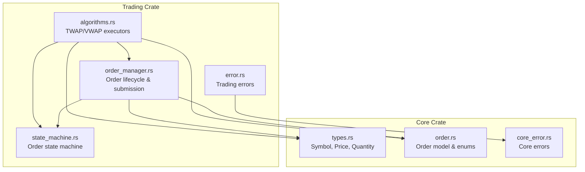
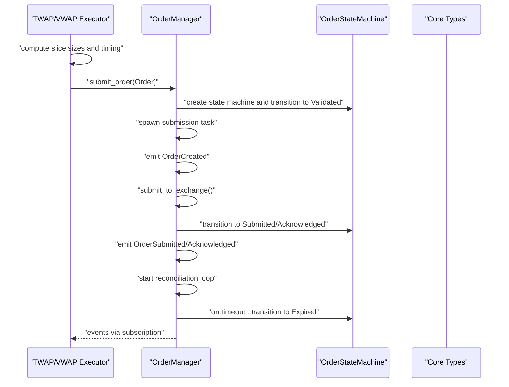
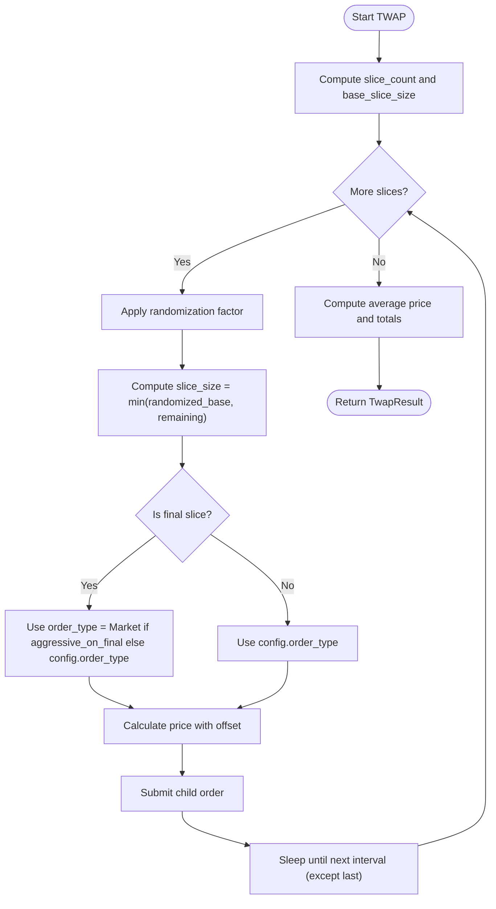
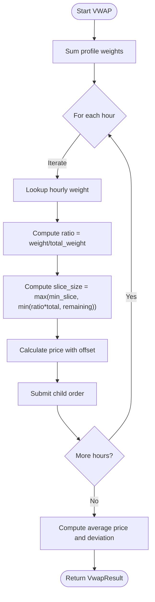
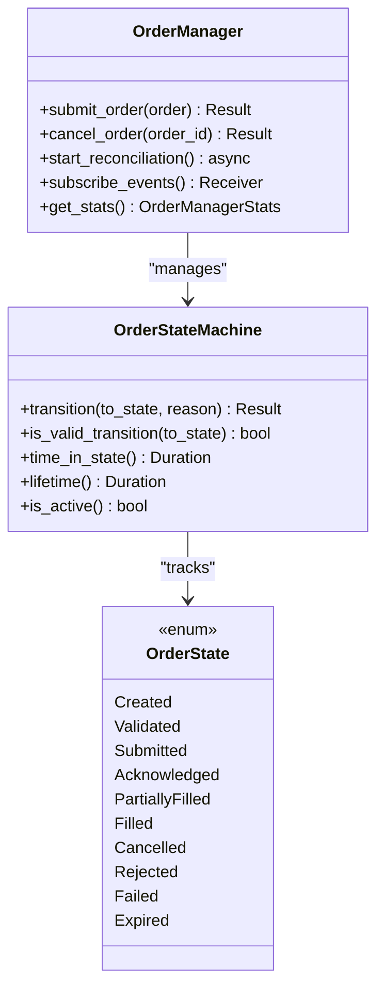
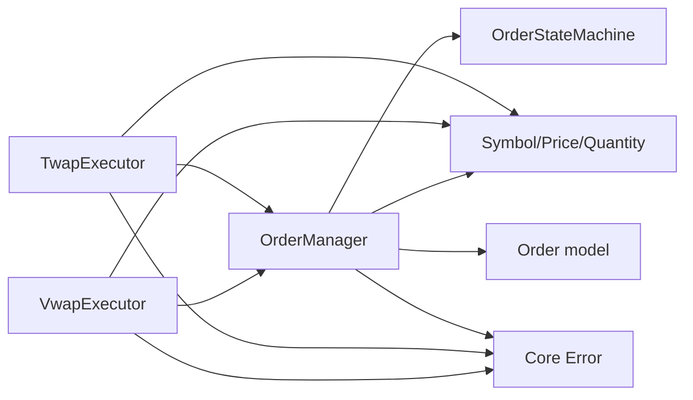

# Execution Algorithms

<cite>
**Referenced Files in This Document**
- [algorithms.rs](file://crates/trading/src/algorithms.rs)
- [order_manager.rs](file://crates/trading/src/order_manager.rs)
- [state_machine.rs](file://crates/trading/src/state_machine.rs)
- [order.rs](file://crates/core/src/models/order.rs)
- [types.rs](file://crates/core/src/types.rs)
- [error.rs](file://crates/trading/src/error.rs)
- [core_error.rs](file://crates/core/src/error.rs)
- [lib.rs](file://crates/trading/src/lib.rs)
</cite>

## Table of Contents
1. [Introduction](#introduction)
2. [Project Structure](#project-structure)
3. [Core Components](#core-components)
4. [Architecture Overview](#architecture-overview)
5. [Detailed Component Analysis](#detailed-component-analysis)
6. [Dependency Analysis](#dependency-analysis)
7. [Performance Considerations](#performance-considerations)
8. [Troubleshooting Guide](#troubleshooting-guide)
9. [Conclusion](#conclusion)
10. [Appendices](#appendices)

## Introduction
This document explains the execution algorithms module responsible for slicing large orders into smaller child orders to minimize market impact. It focuses on two canonical approaches:
- TWAP (Time-Weighted Average Price): executes orders evenly across a fixed time window.
- VWAP (Volume-Weighted Average Price): aligns slices with historical intraday volume profiles to reduce participation costs.

The module integrates tightly with the order manager and a state machine to manage lifecycle events, retries, timeouts, and reconciliation. It also documents configuration parameters, interfaces, and practical usage patterns, along with strategies for adapting to volatile market conditions.

## Project Structure
The execution algorithms live in the trading crate and rely on shared core types and models.

**Diagram sources**
- [algorithms.rs](file://crates/trading/src/algorithms.rs#L1-L120)
- [order_manager.rs](file://crates/trading/src/order_manager.rs#L1-L120)
- [state_machine.rs](file://crates/trading/src/state_machine.rs#L1-L80)
- [types.rs](file://crates/core/src/types.rs#L1-L120)
- [order.rs](file://crates/core/src/models/order.rs#L1-L120)
- [error.rs](file://crates/trading/src/error.rs#L1-L31)
- [core_error.rs](file://crates/core/src/error.rs#L1-L40)

**Section sources**
- [lib.rs](file://crates/trading/src/lib.rs#L1-L12)
- [algorithms.rs](file://crates/trading/src/algorithms.rs#L1-L120)
- [order_manager.rs](file://crates/trading/src/order_manager.rs#L1-L120)
- [state_machine.rs](file://crates/trading/src/state_machine.rs#L1-L80)
- [types.rs](file://crates/core/src/types.rs#L1-L120)
- [order.rs](file://crates/core/src/models/order.rs#L1-L120)
- [error.rs](file://crates/trading/src/error.rs#L1-L31)
- [core_error.rs](file://crates/core/src/error.rs#L1-L40)

## Core Components
- TWAP executor: Splits a large order into equal-sized slices over a configurable duration with optional randomization and price offsets. Final slice can be aggressive to finish quickly.
- VWAP executor: Slices based on a historical hourly volume profile, scaling slices proportionally to the profile weights and enforcing a minimum slice size.
- Order manager: Submits child orders, tracks state transitions, emits lifecycle events, reconciles with exchange, and enforces timeouts.
- State machine: Encodes valid state transitions and provides helpers to determine terminal states, cancellation eligibility, and time-in-state.
- Shared types: Symbol, Price, Quantity define the numeric and identity primitives used across the system.

Key configuration highlights:
- TWAPConfig: total quantity, duration in minutes, slice interval in seconds, randomization percentage, order type, price offset in basis points, and whether to use market orders on the final slice.
- VwapConfig: total quantity, start/end timestamps, hourly volume profile, minimum slice size, and price offset in basis points.

**Section sources**
- [algorithms.rs](file://crates/trading/src/algorithms.rs#L13-L113)
- [order_manager.rs](file://crates/trading/src/order_manager.rs#L14-L59)
- [state_machine.rs](file://crates/trading/src/state_machine.rs#L8-L31)
- [types.rs](file://crates/core/src/types.rs#L86-L179)
- [order.rs](file://crates/core/src/models/order.rs#L10-L44)

## Architecture Overview
The execution algorithms orchestrate order submission via the order manager, which manages lifecycle events and state transitions. The state machine ensures only valid transitions occur and provides safety guards against invalid operations.

**Diagram sources**
- [algorithms.rs](file://crates/trading/src/algorithms.rs#L170-L330)
- [order_manager.rs](file://crates/trading/src/order_manager.rs#L110-L221)
- [state_machine.rs](file://crates/trading/src/state_machine.rs#L80-L167)
- [types.rs](file://crates/core/src/types.rs#L86-L179)

## Detailed Component Analysis

### TWAP Algorithm
The TWAP executor divides the total quantity into a fixed number of slices computed from the duration and slice interval. It applies optional randomization around the base slice size to avoid front-running. The final slice can be submitted as a market order to accelerate completion. Price offsets adjust limit orders relative to the current market price.

Processing logic:
- Compute slice count from duration and interval.
- Compute base slice size and apply randomization factor.
- Determine if the current slice is the final one.
- Choose order type: limit or market for the final slice.
- Submit a child order via the order manager.
- Accumulate executed quantities and compute average price.
- Record per-slice details and finalize results.

**Diagram sources**
- [algorithms.rs](file://crates/trading/src/algorithms.rs#L170-L304)

**Section sources**
- [algorithms.rs](file://crates/trading/src/algorithms.rs#L136-L304)

### VWAP Algorithm
The VWAP executor slices the order according to an hourly volume profile. It computes the total weight of the profile, derives a ratio per hour, and scales the slice size accordingly while respecting a minimum size and remaining quantity. Price offsets are applied consistently.

Processing logic:
- Compute total volume weight from the profile.
- Iterate over hours in the configured window.
- Lookup hourly weight and compute slice ratio.
- Compute slice size with min/max bounds.
- Submit a child order via the order manager.
- Accumulate executed quantities and compute average price.
- Compute VWAP deviation in basis points relative to the current price.

**Diagram sources**
- [algorithms.rs](file://crates/trading/src/algorithms.rs#L370-L474)

**Section sources**
- [algorithms.rs](file://crates/trading/src/algorithms.rs#L52-L113)
- [algorithms.rs](file://crates/trading/src/algorithms.rs#L346-L474)

### Order Manager and State Machine
The order manager encapsulates order lifecycle and submission:
- Creation: validates and transitions to a validated state, stores managed order, and emits events.
- Submission: spawns a background task to submit to the exchange, updates state to submitted/acknowledged, and maps exchange IDs.
- Reconciliation: periodically checks timeouts and emits expiration events.
- Cancellation: enforces valid transitions and updates state accordingly.

The state machine defines valid transitions and provides helpers:
- Terminal states: filled, cancelled, rejected, failed, expired.
- Cancellable states: created, validated, submitted, acknowledged, partially filled.
- Utilities: time-in-state, lifetime, and activity checks.

**Diagram sources**
- [order_manager.rs](file://crates/trading/src/order_manager.rs#L110-L221)
- [state_machine.rs](file://crates/trading/src/state_machine.rs#L8-L31)
- [state_machine.rs](file://crates/trading/src/state_machine.rs#L80-L167)

**Section sources**
- [order_manager.rs](file://crates/trading/src/order_manager.rs#L110-L221)
- [state_machine.rs](file://crates/trading/src/state_machine.rs#L8-L31)
- [state_machine.rs](file://crates/trading/src/state_machine.rs#L80-L167)

### Algorithm Interfaces and Parameters
- TWAPConfig
  - total_quantity: Quantity
  - duration_minutes: u32
  - slice_interval_seconds: u32
  - randomization_pct: Decimal (0–25)
  - order_type: OrderType
  - price_offset_bps: i32
  - aggressive_on_final: bool
- VwapConfig
  - total_quantity: Quantity
  - start_time: DateTime<Utc>
  - end_time: DateTime<Utc>
  - volume_profile: Vec<(u32, Decimal)> (hour -> percentage)
  - min_slice_size: Quantity
  - price_offset_bps: i32
- Results
  - TwapResult: total_executed, average_price, slices_executed, slices_failed, total_duration, slice_details
  - VwapResult: total_executed, average_price, slices_executed, total_duration, vwap_deviation_bps
- SliceExecution: per-slice details including target/executed quantity, price, timestamp, and success flag

**Section sources**
- [algorithms.rs](file://crates/trading/src/algorithms.rs#L13-L113)
- [algorithms.rs](file://crates/trading/src/algorithms.rs#L115-L146)

### Integration with Order Manager and State Machine
- Executors construct child orders with appropriate side, symbol, and order type, then delegate submission to the order manager.
- The order manager creates a state machine for each order and emits lifecycle events.
- Executors can subscribe to order events to react to fills, rejections, or expirations.
- The state machine prevents invalid transitions and exposes helpers for cancellation and timeout handling.

Practical usage patterns:
- Create a TwapExecutor or VwapExecutor with desired configuration and pass an Arc<OrderManager>.
- Call execute(current_price) to start slicing.
- Monitor OrderEvent stream for acknowledgments and fills.
- Adjust configurations dynamically (e.g., increase randomization or change price offsets) to adapt to volatility.

**Section sources**
- [algorithms.rs](file://crates/trading/src/algorithms.rs#L147-L304)
- [algorithms.rs](file://crates/trading/src/algorithms.rs#L346-L474)
- [order_manager.rs](file://crates/trading/src/order_manager.rs#L110-L221)
- [state_machine.rs](file://crates/trading/src/state_machine.rs#L80-L167)

## Dependency Analysis
The algorithms depend on core types for numeric precision and identifiers, and on the order manager for execution. The order manager depends on the state machine and core models.

**Diagram sources**
- [algorithms.rs](file://crates/trading/src/algorithms.rs#L147-L304)
- [algorithms.rs](file://crates/trading/src/algorithms.rs#L346-L474)
- [order_manager.rs](file://crates/trading/src/order_manager.rs#L110-L221)
- [state_machine.rs](file://crates/trading/src/state_machine.rs#L80-L167)
- [types.rs](file://crates/core/src/types.rs#L86-L179)
- [order.rs](file://crates/core/src/models/order.rs#L95-L151)
- [core_error.rs](file://crates/core/src/error.rs#L1-L40)
- [error.rs](file://crates/trading/src/error.rs#L1-L31)

**Section sources**
- [lib.rs](file://crates/trading/src/lib.rs#L1-L12)
- [algorithms.rs](file://crates/trading/src/algorithms.rs#L147-L304)
- [order_manager.rs](file://crates/trading/src/order_manager.rs#L110-L221)
- [state_machine.rs](file://crates/trading/src/state_machine.rs#L80-L167)
- [types.rs](file://crates/core/src/types.rs#L86-L179)
- [order.rs](file://crates/core/src/models/order.rs#L95-L151)
- [core_error.rs](file://crates/core/src/error.rs#L1-L40)
- [error.rs](file://crates/trading/src/error.rs#L1-L31)

## Performance Considerations
- Slice granularity: Smaller intervals or slices increase overhead from order submissions and reconciliation loops. Tune slice_interval_seconds and min_slice_size to balance speed and cost.
- Randomization: Adding noise reduces front-running risk but can slightly increase slippage. Use conservative percentages for illiquid instruments.
- Price offsets: Tight offsets reduce adverse selection but may miss liquidity. Widen offsets cautiously during high volatility.
- Final aggressive slice: Using market orders on the last slice accelerates completion but risks higher slippage near the end of the window.
- Reconciliation interval: Short intervals improve responsiveness but increase CPU load. Adjust based on market conditions and order volume.

[No sources needed since this section provides general guidance]

## Troubleshooting Guide
Common issues and mitigations:
- Orders stuck in Submitted or Acknowledged
  - Cause: Exchange delays or network issues.
  - Mitigation: Increase order_timeout_secs and monitor OrderExpired events. Use reconciliation loop to detect timeouts.
- Excessive rejections or cancellations
  - Cause: Invalid state transitions or price offsets too tight.
  - Mitigation: Verify OrderStateMachine transitions and adjust price_offset_bps. Ensure order_type aligns with instrument characteristics.
- Timeout-driven expirations
  - Cause: Long submission times or lack of liquidity.
  - Mitigation: Increase timeouts and consider reducing slice sizes. Monitor OrderExpired events and adjust strategy.
- Event delivery gaps
  - Cause: Backpressure or channel saturation.
  - Mitigation: Ensure subscribers are polled regularly and consider batching or prioritizing critical events.

**Section sources**
- [order_manager.rs](file://crates/trading/src/order_manager.rs#L278-L336)
- [state_machine.rs](file://crates/trading/src/state_machine.rs#L80-L167)
- [error.rs](file://crates/trading/src/error.rs#L1-L31)
- [core_error.rs](file://crates/core/src/error.rs#L1-L40)

## Conclusion
The execution algorithms module provides robust, configurable mechanisms to split large orders into smaller, market-friendly child orders. TWAP offers predictable pacing across time, while VWAP aligns slices with historical volume patterns. Together with the order manager and state machine, the system enforces lifecycle discipline, handles timeouts, and emits actionable events. By tuning configuration parameters and adapting to changing market conditions, teams can minimize market impact while maintaining execution reliability.

[No sources needed since this section summarizes without analyzing specific files]

## Appendices

### Algorithm Usage Patterns
- TWAP
  - Create a TwapConfig with total_quantity, duration_minutes, slice_interval_seconds, randomization_pct, order_type, price_offset_bps, and aggressive_on_final.
  - Instantiate TwapExecutor with the config, symbol, side, and Arc<OrderManager>.
  - Call execute(current_price) to start execution and receive TwapResult.
- VWAP
  - Create a VwapConfig with total_quantity, start_time, end_time, volume_profile, min_slice_size, and price_offset_bps.
  - Instantiate VwapExecutor with the config, symbol, side, and Arc<OrderManager>.
  - Call execute(current_price) to start execution and receive VwapResult.

Adaptations for volatility:
- Increase randomization_pct to reduce front-running.
- Widen price_offset_bps to capture liquidity more aggressively.
- Reduce slice sizes to improve responsiveness.
- Enable aggressive_on_final to finish quickly under stress.

**Section sources**
- [algorithms.rs](file://crates/trading/src/algorithms.rs#L13-L113)
- [algorithms.rs](file://crates/trading/src/algorithms.rs#L147-L304)
- [algorithms.rs](file://crates/trading/src/algorithms.rs#L346-L474)