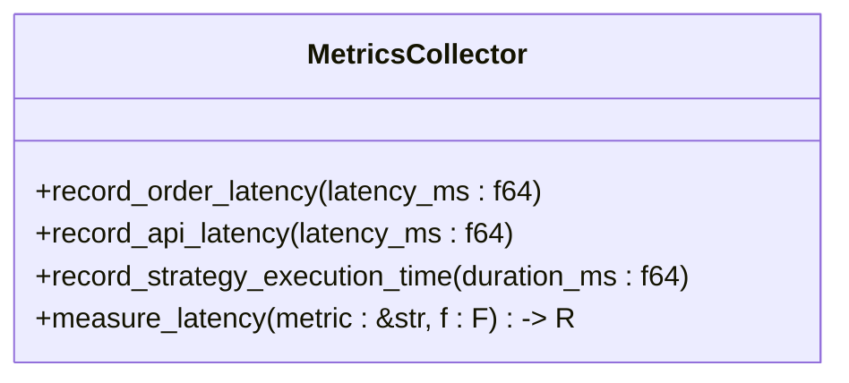
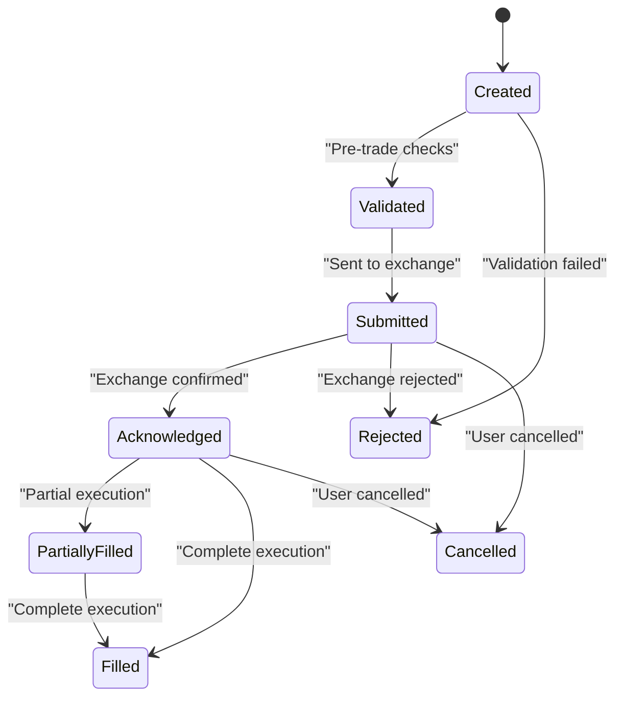
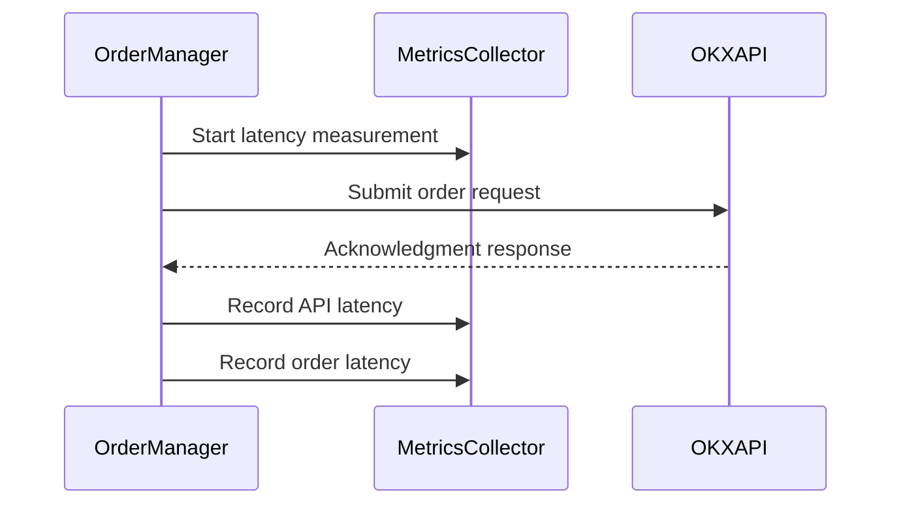
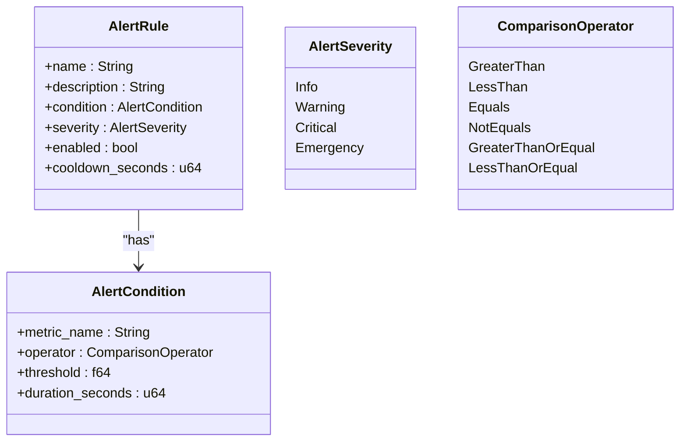
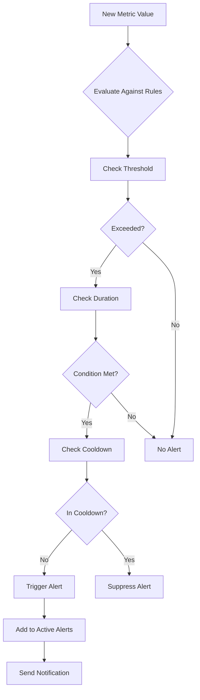
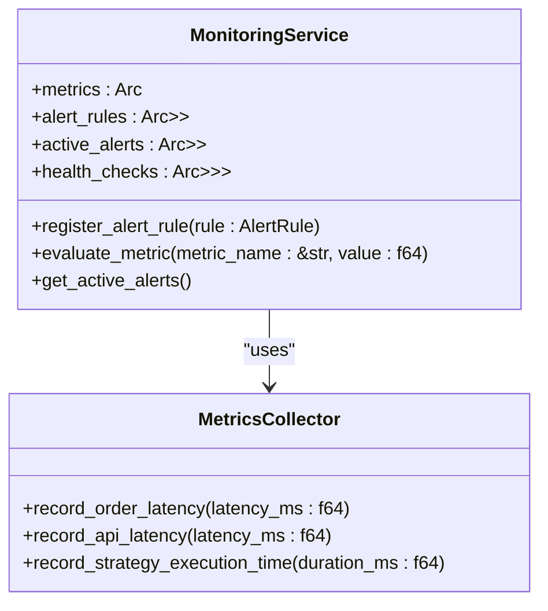
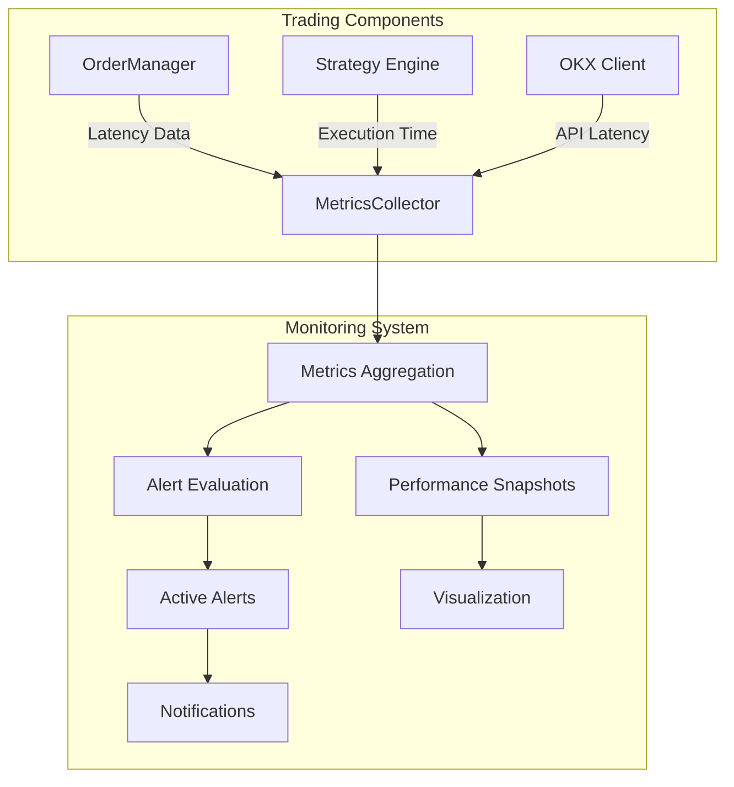
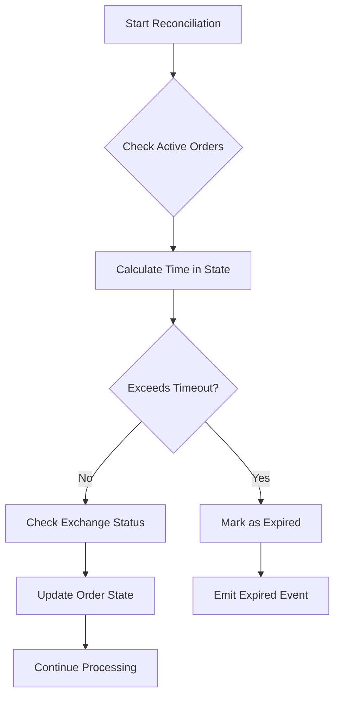

# Latency Tracking

<cite>
**Referenced Files in This Document**   
- [metrics.rs](file://crates/monitoring/src/metrics.rs)
- [service.rs](file://crates/monitoring/src/service.rs)
- [order_manager.rs](file://crates/trading/src/order_manager.rs)
- [order.rs](file://crates/core/src/models/order.rs)
- [state_machine.rs](file://crates/trading/src/state_machine.rs)
- [rest.rs](file://crates/okx-client/src/rest.rs)
</cite>

## Table of Contents
1. [Introduction](#introduction)
2. [Latency Metrics Collection](#latency-metrics-collection)
3. [Order Execution Pipeline Latency](#order-execution-pipeline-latency)
4. [Threshold-Based Alerting](#threshold-based-alerting)
5. [Monitoring Integration](#monitoring-integration)
6. [Clock Synchronization and Latency Spikes](#clock-synchronization-and-latency-spikes)
7. [Conclusion](#conclusion)

## Introduction
The latency tracking system in the EA OKX trading platform provides comprehensive performance monitoring across the entire order execution pipeline. This system measures key latency metrics including network round-trip time to OKX, order processing time, and execution confirmation latency. The implementation leverages a metrics collection framework that integrates with the monitoring crate for aggregation, visualization, and alerting. This documentation explains the technical implementation of latency tracking, how metrics are collected at critical points in the trading workflow, and how the system handles abnormal latency conditions.

## Latency Metrics Collection
The latency tracking system implements a metrics collection mechanism through the `MetricsCollector` struct in the monitoring crate. This component records various latency metrics using histogram methods that capture the distribution of latency values over time.

The system tracks three primary latency metrics:
- **Order latency**: Time from order submission to execution confirmation
- **API latency**: Network round-trip time for API calls to OKX
- **Strategy execution time**: Processing time for strategy calculations

The metrics collection is implemented through dedicated methods in the `MetricsCollector` class:

**Diagram sources**
- [metrics.rs](file://crates/monitoring/src/metrics.rs#L165-L187)

The `measure_latency` method provides a convenient way to measure and record execution time for any code block. It takes a metric type identifier and a closure, automatically calculating the elapsed time and recording it to the appropriate histogram.

**Section sources**
- [metrics.rs](file://crates/monitoring/src/metrics.rs#L189-L207)

## Order Execution Pipeline Latency
The order execution pipeline measures latency at multiple critical points, from order creation through submission, acknowledgment, and final execution. The system captures latency data at each stage of the order state machine, providing granular insights into performance bottlenecks.

### Order State Machine Integration
The order lifecycle is managed by the `OrderStateMachine` which tracks the progression of orders through various states. Each state transition represents a milestone in the execution pipeline where latency can be measured:

**Diagram sources**
- [state_machine.rs](file://crates/trading/src/state_machine.rs#L10-L31)

The `OrderManager` captures latency at key transition points in the execution pipeline. When an order is submitted to the exchange, the system records the submission time. Upon receiving acknowledgment from OKX, it calculates the round-trip time and records this as API latency.

### Critical Latency Measurement Points
The system measures latency at several critical points in the order execution workflow:

1. **Order submission to exchange**: The time between the internal submission request and the exchange acknowledgment
2. **Network round-trip time**: The duration of API calls to the OKX REST interface
3. **Execution confirmation**: The time from order submission to receiving execution confirmation

The `submit_to_exchange` method in `OrderManager` demonstrates how latency is measured during the order submission process:

**Diagram sources**
- [order_manager.rs](file://crates/trading/src/order_manager.rs#L167-L221)
- [metrics.rs](file://crates/monitoring/src/metrics.rs#L190-L207)

The order model itself includes a `latency_ms` field that stores the calculated latency from submission to first fill, providing a complete view of execution performance.

**Section sources**
- [order_manager.rs](file://crates/trading/src/order_manager.rs#L110-L164)
- [order.rs](file://crates/core/src/models/order.rs#L148-L150)

## Threshold-Based Alerting
The system implements threshold-based alerting to detect and respond to abnormal latency conditions. This alerting mechanism is configured through the `AlertRule` system, which defines conditions under which alerts should be triggered based on latency metrics exceeding specified thresholds.

### Alert Configuration
Alert rules are defined with the following parameters:
- **Metric name**: The specific latency metric to monitor (e.g., "order_latency")
- **Comparison operator**: The condition to evaluate (e.g., GreaterThan)
- **Threshold**: The latency value that triggers the alert
- **Duration**: The time period over which the condition must persist
- **Severity**: The importance level of the alert

**Diagram sources**
- [alerts.rs](file://crates/monitoring/src/alerts.rs#L36-L46)

### Alert Evaluation Process
The monitoring service continuously evaluates incoming metrics against registered alert rules. When a metric value exceeds the defined threshold for the specified duration, an alert is triggered and added to the active alerts collection.

The alert evaluation process includes cooldown periods to prevent alert storms during sustained high-latency conditions. Each alert rule has a configurable cooldown period (default 5 minutes) during which additional alerts for the same condition are suppressed.

**Diagram sources**
- [service.rs](file://crates/monitoring/src/service.rs#L62-L88)

The system supports multiple severity levels, allowing for appropriate response strategies based on the criticality of the latency issue. For example, a warning-level alert might trigger internal notifications, while a critical or emergency alert could initiate automatic trading pauses or failover procedures.

**Section sources**
- [service.rs](file://crates/monitoring/src/service.rs#L62-L90)
- [alerts.rs](file://crates/monitoring/src/alerts.rs#L78-L95)

## Monitoring Integration
The latency tracking system integrates with the monitoring crate to provide metrics aggregation, visualization, and reporting capabilities. This integration enables comprehensive performance analysis and operational visibility across the trading platform.

### Metrics Aggregation
The `MonitoringService` serves as the central coordinator for metrics collection, health checks, and alerting. It maintains references to the `MetricsCollector` and manages the lifecycle of alert rules and active alerts.

**Diagram sources**
- [service.rs](file://crates/monitoring/src/service.rs#L12-L17)

The integration with the monitoring system allows for the creation of performance snapshots that capture key metrics at specific time intervals. These snapshots include aggregated latency data such as average order latency, 95th percentile latency, and 99th percentile latency, providing insights into both typical performance and tail latency behavior.

### Data Flow Architecture
The architecture of the latency tracking system follows a producer-consumer pattern where various components generate latency metrics that are collected and processed by the monitoring service:

**Diagram sources**
- [service.rs](file://crates/monitoring/src/service.rs#L26-L34)
- [metrics.rs](file://crates/monitoring/src/metrics.rs#L99-L105)

The system uses tracing for logging metrics, with plans to integrate with Prometheus or similar monitoring solutions in production environments. This design allows for flexible backend integration while maintaining consistent metric collection across the application.

**Section sources**
- [metrics.rs](file://crates/monitoring/src/metrics.rs#L97-L99)
- [service.rs](file://crates/monitoring/src/service.rs#L27-L34)

## Clock Synchronization and Latency Spikes
The system addresses challenges related to clock synchronization and latency spikes through several design considerations and implementation strategies.

### Clock Synchronization
Accurate latency measurement requires synchronized clocks across all system components. The system uses UTC timestamps throughout the order execution pipeline to ensure consistency in time measurements. All timestamp fields in the order model and state machine transitions use `DateTime<Utc>` to avoid timezone-related discrepancies.

The order model includes multiple timestamp fields that capture key moments in the execution lifecycle:
- `created_at`: When the order was created internally
- `submitted_at`: When the order was sent to the exchange
- `first_fill_at`: When the first execution confirmation was received
- `completed_at`: When the order reached a terminal state

These timestamps enable precise calculation of latency at each stage of the execution pipeline, even when processing spans multiple system components.

### Handling Latency Spikes
The system is designed to handle latency spikes through several mechanisms:

1. **Order timeout management**: The `OrderManager` includes a reconciliation loop that checks for orders that have been in a particular state longer than the configured timeout period. Orders exceeding the timeout are marked as expired.

2. **Retry mechanisms**: The system implements configurable retry policies with backoff strategies to handle transient latency issues. The `OrderManagerConfig` includes parameters for maximum retry attempts and retry backoff duration.

3. **Statistical analysis**: By recording latency data in histogram format rather than just averages, the system can detect and analyze tail latency behavior. This allows for identification of occasional spikes that might be masked by average-based metrics.

4. **Health checks**: The monitoring system performs regular health checks on critical components, including the exchange API connection. These checks measure response times and can trigger alerts for degraded performance before it impacts trading operations.

The reconciliation process in the `OrderManager` demonstrates how the system handles potential latency issues:

**Diagram sources**
- [order_manager.rs](file://crates/trading/src/order_manager.rs#L279-L336)

The system's design acknowledges that some latency variation is inevitable in distributed trading systems. Rather than attempting to eliminate all latency, the focus is on measuring it accurately, setting appropriate thresholds, and implementing robust handling mechanisms for abnormal conditions.

**Section sources**
- [order_manager.rs](file://crates/trading/src/order_manager.rs#L308-L328)
- [order.rs](file://crates/core/src/models/order.rs#L137-L146)

## Conclusion
The latency tracking system in the EA OKX trading platform provides comprehensive monitoring of performance metrics throughout the order execution pipeline. By measuring network round-trip time to OKX, order processing time, and execution confirmation latency, the system offers detailed insights into trading performance. The implementation leverages a robust metrics collection framework that integrates with the monitoring crate for aggregation, visualization, and alerting.

Key features of the system include granular latency measurement at multiple points in the order lifecycle, threshold-based alerting for abnormal conditions, and mechanisms to handle clock synchronization and latency spikes. The design emphasizes accurate measurement, statistical analysis of latency distributions, and proactive detection of performance issues.

The system's architecture supports both real-time monitoring and historical analysis, enabling traders and operators to optimize performance, identify bottlenecks, and maintain reliable trading operations even under challenging market conditions. By providing detailed visibility into latency characteristics, the system helps ensure that trading strategies execute as intended and that performance remains within acceptable parameters.